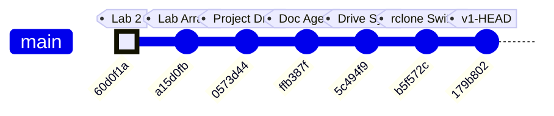
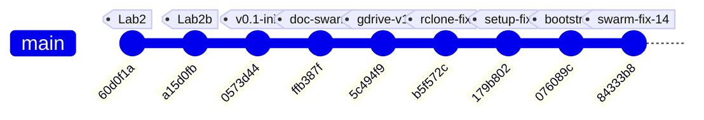
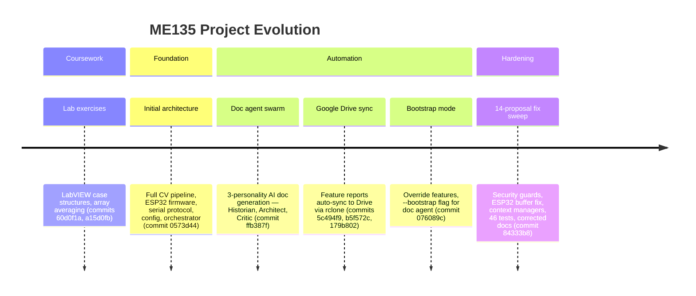

# ME135 | Agent Swarm

> Evolution log — one section per commit.

---

## v1 — 2026-03-13 23:49 — `179b802`

### What Changed

This is the **v1 bootstrap pass** — first documentation of the entire codebase. Below is the initial architecture, followed by the most recent changes visible in the HEAD diff.

---

### Initial Architecture (v1 Snapshot)

**The system is a real-time human detection pipeline for UC Berkeley's ME135 course.** A PS3 Eye camera feeds frames into a CV pipeline running on an NVIDIA Jetson, which produces a 400×300 binary matrix (0 = background, 1 = human). That matrix is bit-packed and sent over 2 Mbaud UART to an ESP32, which drives an 108×108 WS2812B LED panel.

#### CV Pipeline (`cv_pipeline.py`, `gpu_accelerated.py`)
- **CPU path:** OpenCV MOG2/KNN/static-median background subtraction → threshold → morphological cleanup → contour filtering → 400×300 binary output.
- **GPU path:** Drop-in CUDA-accelerated replacement using `cv2.cuda` GpuMat operations. Falls back to CPU automatically when CUDA is unavailable. Claims ~2 ms/frame vs ~8 ms/frame on Jetson Orin Nano Super.
- Both paths share identical public APIs (`calibrate()`, `process_frame()`, `release()`), selected at runtime via `config.yaml`.

#### Serial Protocol (`serial_protocol.py`, `PROTOCOL_SPEC.md`)
- Downsamples 400×300 CV matrix to 108×108 (matching the LED panel), then bit-packs into 1,458 bytes.
- Framing: `[0xAA 0x55][LEN][PAYLOAD][CRC-16][0x55 0xAA]` with ACK/NAK flow control.
- CRC-16/CCITT-FALSE computed over payload only. Up to 3 retransmits on NAK or timeout.

#### ESP32 Firmware (`esp32_main.cpp`, `platformio.ini`)
- Blocking frame receiver with sync-byte state machine and 5-second watchdog.
- Verifies CRC, sends ACK/NAK, then maps bit-packed payload to 11,664 NeoPixels.
- Safety: blanks the display if no frame received within the watchdog window.

#### System Integration (`main.py`, `config.yaml`)
- Single YAML config is the source of truth for all tunable parameters (camera, calibration, processing, serial, display, safety).
- `main.py` orchestrates: config load → pipeline init → interactive calibration (with 10-second countdown) → live loop with FPS limiting, watchdog, and graceful shutdown on SIGINT/SIGTERM.
- Safety: shuts down after 10 consecutive serial errors; logs watchdog warnings.

#### Agent Swarm — Code Generator (`orchestrator.py`)
- Spawns 7 specialized Claude agents (hardware scout, CV engineer, serial architect, ESP32 firmware dev, integration lead, doc writer, LabVIEW advisor) in parallel async loops.
- Each agent gets tools (`write_file`, `read_file`) and runs up to 12 agentic turns.
- This is how the entire `agent_outputs/` codebase was generated.

#### Documentation System (`doc_agent.py`, `gdrive_sync.py`, `gdrive_setup.py`)
- **3-agent doc swarm:** Historian (narrates changes), Architect (draws diagrams), Critic (finds bugs). Runs on every `git push` via pre-push hook.
- **Feature-based doc structure:** `FEATURE_MAP` maps source files → feature names. Each feature gets its own evolving Markdown file with versioned sections.
- **Google Drive sync:** `rclone` syncs `docs/features/` to a shared Drive folder. No Google Cloud Console access needed — uses rclone's bundled OAuth app.
- **SQLite history DB:** Tracks proposals and reports across commits in `docs/history.db`.

---

### Recent Changes (HEAD diff: `179b802`)

#### Documentation System — Bootstrap Mode
- **`doc_agent.py`:** Added `--bootstrap` CLI flag. When set, treats *every* file in `FEATURE_MAP` as changed so all features get v1 documentation in a single run. Without this, the agent only documents files touched in the latest commit. Also: feature names are now sorted in console output for readability; mode label ("Bootstrap v1" vs "Incremental") printed for operator awareness.
- **`gdrive_sync.py`:** `sync_to_drive()` gained an `override_features` parameter. Bootstrap mode passes the full feature list directly, bypassing `git diff` detection. This ensures the Drive folder gets a complete set of feature docs on first run.

#### Documentation System — rclone Setup Hardening
- **`gdrive_setup.py` (major refactor, net −18 lines):** Eliminated the old 13-step interactive `rclone config` wizard. Now uses `rclone config create` non-interactively (with blank `client_id`/`client_secret` to use rclone's bundled OAuth app), then triggers `rclone config reconnect` for the browser-based sign-in. **Key fix:** always deletes any existing remote before recreating — this auto-clears stale or bad `client_id` configurations that caused auth failures. Better error messages and troubleshooting hints on failure.

### Evolution Timeline

### Commit-to-Subsystem Map

| Commit | Message | Subsystems Touched |
|--------|---------|-------------------|
| `60d0f1a` | added casestructure.vi for lab2 | LabVIEW coursework (pre-project) |
| `a15d0fb` | added arrayaverages.vi (unfinished) | LabVIEW coursework (pre-project) |
| `0573d44` | Add Kyle's camera processing project files | **CV Pipeline**, **Serial Protocol**, **ESP32 Firmware**, **System Integration**, **Agent Swarm**, **Hardware & Platform** — initial code drop of all agent-generated outputs |
| `ffb387f` | feat(docs): add documentation agent swarm | **Documentation System** — `doc_agent.py` with 3-agent Historian/Architect/Critic swarm, SQLite proposal tracking |
| `5c494f9` | feat(docs): add Google Drive feature report sync | **Documentation System** — `gdrive_sync.py` (feature-based doc writer + rclone sync), `gdrive_setup.py` (initial interactive setup) |
| `b5f572c` | fix(docs): replace Google API OAuth with rclone | **Documentation System** — dropped Google Cloud Console OAuth dependency, switched to rclone's bundled OAuth app |
| `179b802` | fix(setup): non-interactive rclone config, auto-clear bad client_id | **Documentation System** — `gdrive_setup.py` refactored to non-interactive flow; `doc_agent.py` gained `--bootstrap` mode; `gdrive_sync.py` gained `override_features` |

### Project Trajectory

The repo tells a clear two-phase story:

1. **Phase 1 — Coursework** (`60d0f1a` → `a15d0fb`): Early LabVIEW exercises for ME135 labs. No project code yet.
2. **Phase 2 — Project Build** (`0573d44` → `179b802`): A single large code drop delivered the full detection pipeline (generated by the 7-agent orchestrator), immediately followed by three rapid iterations building and hardening the documentation-and-sync infrastructure. The team is investing heavily in automated documentation before the project enters its integration and testing phase.

### Code Health Summary

**Overall Grade: B−**

The codebase is well-structured with clear module boundaries (CV pipeline → serial protocol → ESP32 firmware), consistent logging, and a solid protocol design with CRC-16 and ACK/NAK flow control. Documentation is thorough. The CPU/GPU pipeline polymorphism is cleanly implemented.

**Critical issues** drag the grade down: (1) The ESP32 firmware calls `setRxBufferSize()` after `begin()`, meaning it's silently ignored — the 256-byte default buffer will overflow at 2 Mbaud, making serial communication non-functional. (2) Both `orchestrator.py` and `doc_agent.py` have path traversal vulnerabilities in their tool handlers — LLM agents can read/write arbitrary files. (3) `main.py` unconditionally opens a GUI window, crashing on headless Jetson deployments.

**Moderate concerns**: no config validation, no context-manager cleanup for camera handles, no frame-dropping on the ESP32 display bottleneck. Reliability under real-world faults needs hardening before demo day.

### Improvement Proposals

**[ORCH-PATH-TRAVERSAL] Path traversal in orchestrator.py write_file / read_file tools** — 🔴 high — must-fix

*Problem:* In `orchestrator.py` `execute_tool()`, the `write_file` tool does `OUTPUT_DIR / tool_input['filename']` with no path validation. An LLM agent could supply a filename like `../orchestrator.py` or `../../.env` to read or overwrite arbitrary files outside `agent_outputs/`. The `read_file` tool has the identical vulnerability.

*Fix:* After computing `path = OUTPUT_DIR / tool_input['filename']`, resolve it with `path.resolve()` and verify `path.resolve().is_relative_to(OUTPUT_DIR.resolve())`. Return an error string if the check fails. Also reject filenames containing `..` or `/` as a defense-in-depth measure.

---
## v2 — 2026-03-14 00:20 — `84333b8`

### What Changed

## Commit `84333b8` — 7-Agent Swarm Addresses All 14 Critic Proposals

This is the project's largest single commit: **537 insertions, 47 deletions across 11 files.** A swarm of 7 specialized AI agents (Security Engineer, Embedded Firmware Engineer, Backend Architect, AI Engineer, Workflow Optimizer, API Tester, Technical Writer) each tackled critic-identified flaws from the previous doc-agent run. Here's what landed, grouped by subsystem:

---

### 🔒 Security (Orchestrator + Doc Agent)

- **`orchestrator.py` — Path traversal guard on `write_file` / `read_file`:** Both tool handlers now reject any filename where `Path(filename).name != filename`. Previously, an agent could write to `../../etc/passwd` via the tool interface. This closes a sandbox escape vector in the agent swarm.
- **`doc_agent.py` — Path containment in `apply_fix`:** The implementer agent's file-editing tool now calls `.resolve()` and checks `.relative_to(PROJECT_ROOT)`, denying any path that escapes the repo. Same class of bug, different entry point.

### 🎛 ESP32 Firmware (`esp32_main.cpp`)

- **`setRxBufferSize()` moved before `begin()`:** The old order (`begin()` then `setRxBufferSize()`) made the buffer resize a silent no-op on ESP-IDF. The 4 KB RX buffer is critical — at 2 Mbaud, a full 1,466-byte frame arrives in ~6 ms, and the default 256-byte buffer would overflow instantly. This was a **latent data-loss bug** since the initial code was generated.
- **Stale-frame skip (`skipDisplay`):** When `strip.show()` blocks for ~350 ms (physics of clocking 11,664 WS2812B LEDs at 30 µs/LED), incoming UART frames pile up. The new logic checks `JetsonSerial.available() >= FRAME_HEADER_SIZE` after each display update; if data is already queued, it skips the *next* `updateDisplay()` to drain the buffer first. This prevents buffer overruns under the newly-raised 10 fps CV target.

### 📷 CV Pipeline (`main.py`, `cv_pipeline.py`, `gpu_accelerated.py`)

- **`main.py` — Preview gated on `args.show_preview`:** The old code always constructed a display image and called `cv2.imshow`, which crashes on a headless Jetson (no X server). Now the entire preview block is wrapped in `if args.show_preview`, making headless deployment safe.
- **`main.py` — `validate_config()` at startup:** Checks for all 6 required YAML sections (`camera`, `calibration`, `processing`, `serial`, `display`, `safety`) before any pipeline init. Catches typos and missing sections immediately instead of producing cryptic `KeyError` deep in pipeline constructors.
- **`cv_pipeline.py` + `gpu_accelerated.py` — Context managers (`__enter__`/`__exit__`):** Both pipeline classes now support `with` blocks, guaranteeing `release()` (which closes the camera) runs even on unhandled exceptions. Previously, a crash during processing could leave `/dev/video0` locked.
- **`gpu_accelerated.py` — KNN fallback warning:** When `config.yaml` says `method: knn` but the GPU pipeline silently uses CUDA MOG2 (CUDA has no KNN), users now get an explicit `logger.warning()` explaining what happened and how to suppress it. Eliminates a confusing "why doesn't my KNN config do anything?" debugging session.

### ⚙️ Config (`config.yaml`)

- **`fps_target` raised from 3 → 10:** The old value of 3 was the *display* physical limit (350 ms per `strip.show()`), but it was also throttling the CV capture loop. The new value of 10 lets the Jetson process frames faster; the ESP32's new `skipDisplay` logic handles the mismatch gracefully. Comment clarified to distinguish CV rate from display rate.

### 🔧 Tooling / DevOps (`gdrive_sync.py`, `gdrive_setup.py`)

- **`subprocess.run(["which", "rclone"])` → `shutil.which("rclone")`:** `which` is a Unix-only command and doesn't exist on Windows or inside some CI containers. `shutil.which()` is the portable Python equivalent — pure stdlib, no subprocess overhead.
- **`gdrive_setup.py` — Idempotent remote setup:** Old behavior: every run deleted and recreated the rclone remote, forcing a full OAuth re-auth. New behavior: tests if the existing remote works (`rclone lsd`); if yes, skips OAuth entirely. Only recreates if auth is actually broken. Remote creation logic extracted to `_create_remote()` helper.

### 🧪 Testing (`tests/test_serial_protocol.py`)

- **46 new pytest tests (427 lines):** Covers CRC-16 computation, bit-packing/unpacking round-trips, 400×300→108×108 downsampling, MSB bit ordering, and CRC integration with the framing protocol. This is the project's **first test suite** — a major milestone for a hardware-coupled system where serial bugs are expensive to debug on real hardware.

### 📝 Documentation (`MEMORY.md`, `orchestrator.py`)

- **Frame size corrected:** `15,005 bytes/frame` → `1,466 bytes/frame`. The old number was from an early design where the full 400×300 matrix was transmitted without downsampling or bit-packing. The actual wire format (108×108 bit-packed + 8B framing) is 10× smaller. The `PROJECT_CONTEXT` in `orchestrator.py` was updated to match, ensuring future agent runs generate code against the correct spec.

### Evolution Timeline

The project evolved from LabVIEW homework exercises into a multi-agent AI-driven embedded CV system across 8 commits. The timeline below shows the trajectory and which subsystems each commit touched.

### Subsystem touch map by commit

| Commit | Summary | CV Pipeline | ESP32 FW | Serial Proto | Agent Swarm | DevOps/Sync | Tests | Docs |
|--------|---------|:-----------:|:--------:|:------------:|:-----------:|:-----------:|:-----:|:----:|
| `60d0f1a` | LabVIEW lab2 case structure | | | | | | | |
| `a15d0fb` | LabVIEW array averages | | | | | | | |
| `0573d44` | **Initial architecture** — all project files | ✅ | ✅ | ✅ | ✅ | | | ✅ |
| `ffb387f` | Documentation agent swarm | | | | ✅ | | | ✅ |
| `5c494f9` | Google Drive sync for reports | | | | | ✅ | | |
| `b5f572c` | Replace Google API OAuth with rclone | | | | | ✅ | | ✅ |
| `179b802` | Non-interactive rclone config | | | | | ✅ | | |
| `076089c` | Bootstrap mode + override fix | | | | ✅ | | | ✅ |
| **`84333b8`** | **7-agent swarm: 14 fixes** | ✅ | ✅ | | ✅ | ✅ | ✅ | ✅ |

### Project phases

**Key inflection point:** Commit `84333b8` marks the transition from "generating code" to "hardening code." Every prior commit added new capability; this one fixed 14 identified flaws without adding new features. The project now has its first test suite, security boundaries on agent tools, and resource-safe pipeline teardown — the hallmarks of production-readiness for a hardware demo.

### Code Health Summary

**Overall Grade: B**

This is a well-structured embedded CV project with clear separation of concerns (pipeline → serial → ESP32 firmware), good documentation, and thoughtful safety features (watchdogs, CRC, retry logic). The config-driven architecture and drop-in CPU/GPU pipeline pattern show solid design thinking.

**Strengths:** CRC-16 implementations match across Python and C++. Frame protocol is well-specified. Config is centralized. Background subtraction has multiple methods with sensible defaults.

**Critical gaps:** The serial ACK timeout is stored but never actually applied (SERIAL-01), both camera pipelines silently accept a missing device (CV-01), and the main loop leaks hardware resources on any exception (MAIN-01). The GPU pipeline breaks the API contract by omitting context manager support (GPU-01).

**Minor concerns:** Dead 1.4 KB buffer on ESP32, blocking `input()` preventing headless deployment, no write-conflict protection in the orchestrator.

Fix the 3 must-fix issues before any hardware integration testing.

### Improvement Proposals

**[ORCH-01] Orchestrator agents run concurrently with shared file writes — data race** — 🟡 medium — future

*Problem:* In `orchestrator.py`, 7 agents run via `asyncio.gather` and all share the same `write_file` tool targeting `agent_outputs/`. If two agents attempt to write the same filename (e.g., both referencing `config.yaml` or `main.py`), the last writer silently wins. There is no locking, no conflict detection, and no warning. The tool description says 'Write or overwrite', so agents may intentionally clobber each other's work.

*Fix:* Add a file-level lock (dict of asyncio.Lock per filename) in `execute_tool`. When a write is attempted for an already-written file, either (a) reject with an error forcing the agent to read first, or (b) log a warning and keep a backup. At minimum, track which agent wrote which file and warn on overwrites.

**[PROP-005] orchestrator.py path traversal guard is bypassable on Windows** — 🟢 low — nice-to-have

*Problem:* The guard `Path(filename).name != filename` correctly blocks '../etc/passwd' but does NOT block filenames containing backslashes on Windows (e.g., '..\\..\\secret'). Path.name on Windows would return 'secret', passing the check. The project runs on Linux (Jetson), but the orchestrator could run on any dev machine.

*Fix:* Add an additional check: reject any filename containing '/', '\\', or '..' as a substring. E.g., `if any(c in filename for c in ('/', '\\', '..')):`

---
