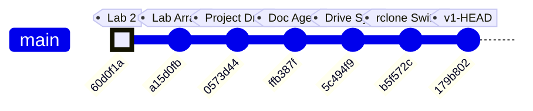

# ME135 | Computer Vision Pipeline

> Evolution log — one section per commit.

---

## v1 — 2026-03-13 23:49 — `179b802`

### What Changed

This is the **v1 bootstrap pass** — first documentation of the entire codebase. Below is the initial architecture, followed by the most recent changes visible in the HEAD diff.

---

### Initial Architecture (v1 Snapshot)

**The system is a real-time human detection pipeline for UC Berkeley's ME135 course.** A PS3 Eye camera feeds frames into a CV pipeline running on an NVIDIA Jetson, which produces a 400×300 binary matrix (0 = background, 1 = human). That matrix is bit-packed and sent over 2 Mbaud UART to an ESP32, which drives an 108×108 WS2812B LED panel.

#### CV Pipeline (`cv_pipeline.py`, `gpu_accelerated.py`)
- **CPU path:** OpenCV MOG2/KNN/static-median background subtraction → threshold → morphological cleanup → contour filtering → 400×300 binary output.
- **GPU path:** Drop-in CUDA-accelerated replacement using `cv2.cuda` GpuMat operations. Falls back to CPU automatically when CUDA is unavailable. Claims ~2 ms/frame vs ~8 ms/frame on Jetson Orin Nano Super.
- Both paths share identical public APIs (`calibrate()`, `process_frame()`, `release()`), selected at runtime via `config.yaml`.

#### Serial Protocol (`serial_protocol.py`, `PROTOCOL_SPEC.md`)
- Downsamples 400×300 CV matrix to 108×108 (matching the LED panel), then bit-packs into 1,458 bytes.
- Framing: `[0xAA 0x55][LEN][PAYLOAD][CRC-16][0x55 0xAA]` with ACK/NAK flow control.
- CRC-16/CCITT-FALSE computed over payload only. Up to 3 retransmits on NAK or timeout.

#### ESP32 Firmware (`esp32_main.cpp`, `platformio.ini`)
- Blocking frame receiver with sync-byte state machine and 5-second watchdog.
- Verifies CRC, sends ACK/NAK, then maps bit-packed payload to 11,664 NeoPixels.
- Safety: blanks the display if no frame received within the watchdog window.

#### System Integration (`main.py`, `config.yaml`)
- Single YAML config is the source of truth for all tunable parameters (camera, calibration, processing, serial, display, safety).
- `main.py` orchestrates: config load → pipeline init → interactive calibration (with 10-second countdown) → live loop with FPS limiting, watchdog, and graceful shutdown on SIGINT/SIGTERM.
- Safety: shuts down after 10 consecutive serial errors; logs watchdog warnings.

#### Agent Swarm — Code Generator (`orchestrator.py`)
- Spawns 7 specialized Claude agents (hardware scout, CV engineer, serial architect, ESP32 firmware dev, integration lead, doc writer, LabVIEW advisor) in parallel async loops.
- Each agent gets tools (`write_file`, `read_file`) and runs up to 12 agentic turns.
- This is how the entire `agent_outputs/` codebase was generated.

#### Documentation System (`doc_agent.py`, `gdrive_sync.py`, `gdrive_setup.py`)
- **3-agent doc swarm:** Historian (narrates changes), Architect (draws diagrams), Critic (finds bugs). Runs on every `git push` via pre-push hook.
- **Feature-based doc structure:** `FEATURE_MAP` maps source files → feature names. Each feature gets its own evolving Markdown file with versioned sections.
- **Google Drive sync:** `rclone` syncs `docs/features/` to a shared Drive folder. No Google Cloud Console access needed — uses rclone's bundled OAuth app.
- **SQLite history DB:** Tracks proposals and reports across commits in `docs/history.db`.

---

### Recent Changes (HEAD diff: `179b802`)

#### Documentation System — Bootstrap Mode
- **`doc_agent.py`:** Added `--bootstrap` CLI flag. When set, treats *every* file in `FEATURE_MAP` as changed so all features get v1 documentation in a single run. Without this, the agent only documents files touched in the latest commit. Also: feature names are now sorted in console output for readability; mode label ("Bootstrap v1" vs "Incremental") printed for operator awareness.
- **`gdrive_sync.py`:** `sync_to_drive()` gained an `override_features` parameter. Bootstrap mode passes the full feature list directly, bypassing `git diff` detection. This ensures the Drive folder gets a complete set of feature docs on first run.

#### Documentation System — rclone Setup Hardening
- **`gdrive_setup.py` (major refactor, net −18 lines):** Eliminated the old 13-step interactive `rclone config` wizard. Now uses `rclone config create` non-interactively (with blank `client_id`/`client_secret` to use rclone's bundled OAuth app), then triggers `rclone config reconnect` for the browser-based sign-in. **Key fix:** always deletes any existing remote before recreating — this auto-clears stale or bad `client_id` configurations that caused auth failures. Better error messages and troubleshooting hints on failure.

### Evolution Timeline

### Commit-to-Subsystem Map

| Commit | Message | Subsystems Touched |
|--------|---------|-------------------|
| `60d0f1a` | added casestructure.vi for lab2 | LabVIEW coursework (pre-project) |
| `a15d0fb` | added arrayaverages.vi (unfinished) | LabVIEW coursework (pre-project) |
| `0573d44` | Add Kyle's camera processing project files | **CV Pipeline**, **Serial Protocol**, **ESP32 Firmware**, **System Integration**, **Agent Swarm**, **Hardware & Platform** — initial code drop of all agent-generated outputs |
| `ffb387f` | feat(docs): add documentation agent swarm | **Documentation System** — `doc_agent.py` with 3-agent Historian/Architect/Critic swarm, SQLite proposal tracking |
| `5c494f9` | feat(docs): add Google Drive feature report sync | **Documentation System** — `gdrive_sync.py` (feature-based doc writer + rclone sync), `gdrive_setup.py` (initial interactive setup) |
| `b5f572c` | fix(docs): replace Google API OAuth with rclone | **Documentation System** — dropped Google Cloud Console OAuth dependency, switched to rclone's bundled OAuth app |
| `179b802` | fix(setup): non-interactive rclone config, auto-clear bad client_id | **Documentation System** — `gdrive_setup.py` refactored to non-interactive flow; `doc_agent.py` gained `--bootstrap` mode; `gdrive_sync.py` gained `override_features` |

### Project Trajectory

The repo tells a clear two-phase story:

1. **Phase 1 — Coursework** (`60d0f1a` → `a15d0fb`): Early LabVIEW exercises for ME135 labs. No project code yet.
2. **Phase 2 — Project Build** (`0573d44` → `179b802`): A single large code drop delivered the full detection pipeline (generated by the 7-agent orchestrator), immediately followed by three rapid iterations building and hardening the documentation-and-sync infrastructure. The team is investing heavily in automated documentation before the project enters its integration and testing phase.

### Code Health Summary

**Overall Grade: B−**

The codebase is well-structured with clear module boundaries (CV pipeline → serial protocol → ESP32 firmware), consistent logging, and a solid protocol design with CRC-16 and ACK/NAK flow control. Documentation is thorough. The CPU/GPU pipeline polymorphism is cleanly implemented.

**Critical issues** drag the grade down: (1) The ESP32 firmware calls `setRxBufferSize()` after `begin()`, meaning it's silently ignored — the 256-byte default buffer will overflow at 2 Mbaud, making serial communication non-functional. (2) Both `orchestrator.py` and `doc_agent.py` have path traversal vulnerabilities in their tool handlers — LLM agents can read/write arbitrary files. (3) `main.py` unconditionally opens a GUI window, crashing on headless Jetson deployments.

**Moderate concerns**: no config validation, no context-manager cleanup for camera handles, no frame-dropping on the ESP32 display bottleneck. Reliability under real-world faults needs hardening before demo day.

### Improvement Proposals

**[CV-NO-CONTEXT-MANAGER] Camera resource leak — no cleanup on exception in CVPipeline / GPUPipeline** — 🟡 medium — nice-to-have

*Problem:* Both `CVPipeline.__init__` and `GPUPipeline.__init__` open a `cv2.VideoCapture` immediately. If any subsequent code in the constructor raises (e.g., invalid calibration method, CUDA filter creation failure), the camera handle is never released. `main.py` wraps calibration but not pipeline construction in try/finally, so a constructor exception leaks the camera device file handle, potentially locking `/dev/video0` until process exit.

*Fix:* Add `__enter__` / `__exit__` (context manager) to both pipeline classes that call `self.release()` on exit. Alternatively, wrap the post-`VideoCapture` initialization in a try/except that calls `self.cap.release()` on failure. Update `main.py` to use `with pipeline: ...` or wrap in try/finally.

**[PROP-004] GPU pipeline silently falls back to CUDA MOG2 when config requests KNN** — 🟢 low — nice-to-have

*Problem:* In gpu_accelerated.py, when `method` is 'knn', the code creates a CUDA MOG2 subtractor anyway (because OpenCV CUDA has no KNN). There's only a comment about this — no log warning to the user. The operator may think they're running KNN when they're actually running MOG2 with different parameters.

*Fix:* Add `logger.warning('CUDA has no KNN subtractor — using MOG2 instead')` when the config method is 'knn' but the GPU path is selected. Consider reading KNN-specific config values and mapping them to MOG2 equivalents, or at minimum documenting the behavioral difference.

---
