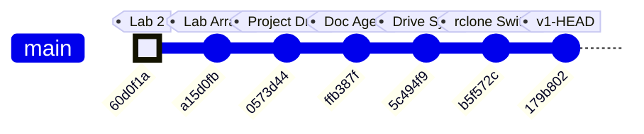
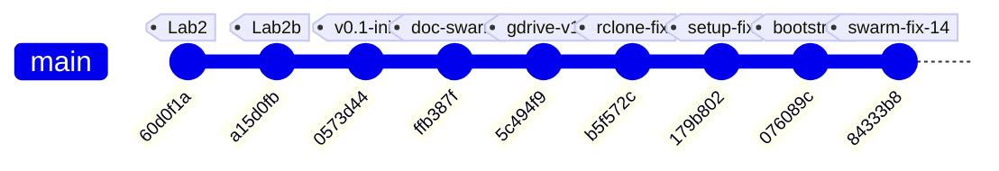
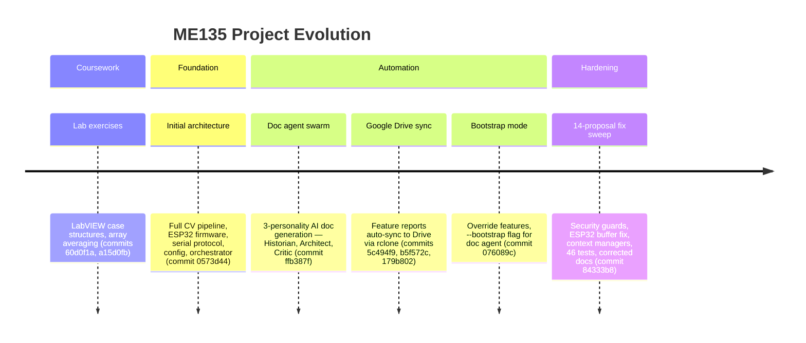
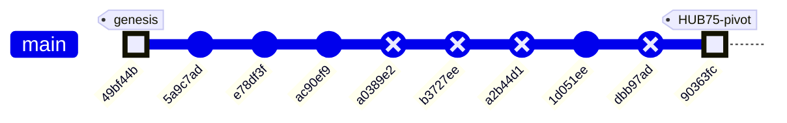

# ME135 | Computer Vision Pipeline

> Evolution log — one section per commit.

---

## v1 — 2026-03-13 23:49 — `179b802`

### What Changed

This is the **v1 bootstrap pass** — first documentation of the entire codebase. Below is the initial architecture, followed by the most recent changes visible in the HEAD diff.

---

### Initial Architecture (v1 Snapshot)

**The system is a real-time human detection pipeline for UC Berkeley's ME135 course.** A PS3 Eye camera feeds frames into a CV pipeline running on an NVIDIA Jetson, which produces a 400×300 binary matrix (0 = background, 1 = human). That matrix is bit-packed and sent over 2 Mbaud UART to an ESP32, which drives an 108×108 WS2812B LED panel.

#### CV Pipeline (`cv_pipeline.py`, `gpu_accelerated.py`)
- **CPU path:** OpenCV MOG2/KNN/static-median background subtraction → threshold → morphological cleanup → contour filtering → 400×300 binary output.
- **GPU path:** Drop-in CUDA-accelerated replacement using `cv2.cuda` GpuMat operations. Falls back to CPU automatically when CUDA is unavailable. Claims ~2 ms/frame vs ~8 ms/frame on Jetson Orin Nano Super.
- Both paths share identical public APIs (`calibrate()`, `process_frame()`, `release()`), selected at runtime via `config.yaml`.

#### Serial Protocol (`serial_protocol.py`, `PROTOCOL_SPEC.md`)
- Downsamples 400×300 CV matrix to 108×108 (matching the LED panel), then bit-packs into 1,458 bytes.
- Framing: `[0xAA 0x55][LEN][PAYLOAD][CRC-16][0x55 0xAA]` with ACK/NAK flow control.
- CRC-16/CCITT-FALSE computed over payload only. Up to 3 retransmits on NAK or timeout.

#### ESP32 Firmware (`esp32_main.cpp`, `platformio.ini`)
- Blocking frame receiver with sync-byte state machine and 5-second watchdog.
- Verifies CRC, sends ACK/NAK, then maps bit-packed payload to 11,664 NeoPixels.
- Safety: blanks the display if no frame received within the watchdog window.

#### System Integration (`main.py`, `config.yaml`)
- Single YAML config is the source of truth for all tunable parameters (camera, calibration, processing, serial, display, safety).
- `main.py` orchestrates: config load → pipeline init → interactive calibration (with 10-second countdown) → live loop with FPS limiting, watchdog, and graceful shutdown on SIGINT/SIGTERM.
- Safety: shuts down after 10 consecutive serial errors; logs watchdog warnings.

#### Agent Swarm — Code Generator (`orchestrator.py`)
- Spawns 7 specialized Claude agents (hardware scout, CV engineer, serial architect, ESP32 firmware dev, integration lead, doc writer, LabVIEW advisor) in parallel async loops.
- Each agent gets tools (`write_file`, `read_file`) and runs up to 12 agentic turns.
- This is how the entire `agent_outputs/` codebase was generated.

#### Documentation System (`doc_agent.py`, `gdrive_sync.py`, `gdrive_setup.py`)
- **3-agent doc swarm:** Historian (narrates changes), Architect (draws diagrams), Critic (finds bugs). Runs on every `git push` via pre-push hook.
- **Feature-based doc structure:** `FEATURE_MAP` maps source files → feature names. Each feature gets its own evolving Markdown file with versioned sections.
- **Google Drive sync:** `rclone` syncs `docs/features/` to a shared Drive folder. No Google Cloud Console access needed — uses rclone's bundled OAuth app.
- **SQLite history DB:** Tracks proposals and reports across commits in `docs/history.db`.

---

### Recent Changes (HEAD diff: `179b802`)

#### Documentation System — Bootstrap Mode
- **`doc_agent.py`:** Added `--bootstrap` CLI flag. When set, treats *every* file in `FEATURE_MAP` as changed so all features get v1 documentation in a single run. Without this, the agent only documents files touched in the latest commit. Also: feature names are now sorted in console output for readability; mode label ("Bootstrap v1" vs "Incremental") printed for operator awareness.
- **`gdrive_sync.py`:** `sync_to_drive()` gained an `override_features` parameter. Bootstrap mode passes the full feature list directly, bypassing `git diff` detection. This ensures the Drive folder gets a complete set of feature docs on first run.

#### Documentation System — rclone Setup Hardening
- **`gdrive_setup.py` (major refactor, net −18 lines):** Eliminated the old 13-step interactive `rclone config` wizard. Now uses `rclone config create` non-interactively (with blank `client_id`/`client_secret` to use rclone's bundled OAuth app), then triggers `rclone config reconnect` for the browser-based sign-in. **Key fix:** always deletes any existing remote before recreating — this auto-clears stale or bad `client_id` configurations that caused auth failures. Better error messages and troubleshooting hints on failure.

### Evolution Timeline

### Commit-to-Subsystem Map

| Commit | Message | Subsystems Touched |
|--------|---------|-------------------|
| `60d0f1a` | added casestructure.vi for lab2 | LabVIEW coursework (pre-project) |
| `a15d0fb` | added arrayaverages.vi (unfinished) | LabVIEW coursework (pre-project) |
| `0573d44` | Add Kyle's camera processing project files | **CV Pipeline**, **Serial Protocol**, **ESP32 Firmware**, **System Integration**, **Agent Swarm**, **Hardware & Platform** — initial code drop of all agent-generated outputs |
| `ffb387f` | feat(docs): add documentation agent swarm | **Documentation System** — `doc_agent.py` with 3-agent Historian/Architect/Critic swarm, SQLite proposal tracking |
| `5c494f9` | feat(docs): add Google Drive feature report sync | **Documentation System** — `gdrive_sync.py` (feature-based doc writer + rclone sync), `gdrive_setup.py` (initial interactive setup) |
| `b5f572c` | fix(docs): replace Google API OAuth with rclone | **Documentation System** — dropped Google Cloud Console OAuth dependency, switched to rclone's bundled OAuth app |
| `179b802` | fix(setup): non-interactive rclone config, auto-clear bad client_id | **Documentation System** — `gdrive_setup.py` refactored to non-interactive flow; `doc_agent.py` gained `--bootstrap` mode; `gdrive_sync.py` gained `override_features` |

### Project Trajectory

The repo tells a clear two-phase story:

1. **Phase 1 — Coursework** (`60d0f1a` → `a15d0fb`): Early LabVIEW exercises for ME135 labs. No project code yet.
2. **Phase 2 — Project Build** (`0573d44` → `179b802`): A single large code drop delivered the full detection pipeline (generated by the 7-agent orchestrator), immediately followed by three rapid iterations building and hardening the documentation-and-sync infrastructure. The team is investing heavily in automated documentation before the project enters its integration and testing phase.

### Code Health Summary

**Overall Grade: B−**

The codebase is well-structured with clear module boundaries (CV pipeline → serial protocol → ESP32 firmware), consistent logging, and a solid protocol design with CRC-16 and ACK/NAK flow control. Documentation is thorough. The CPU/GPU pipeline polymorphism is cleanly implemented.

**Critical issues** drag the grade down: (1) The ESP32 firmware calls `setRxBufferSize()` after `begin()`, meaning it's silently ignored — the 256-byte default buffer will overflow at 2 Mbaud, making serial communication non-functional. (2) Both `orchestrator.py` and `doc_agent.py` have path traversal vulnerabilities in their tool handlers — LLM agents can read/write arbitrary files. (3) `main.py` unconditionally opens a GUI window, crashing on headless Jetson deployments.

**Moderate concerns**: no config validation, no context-manager cleanup for camera handles, no frame-dropping on the ESP32 display bottleneck. Reliability under real-world faults needs hardening before demo day.

### Improvement Proposals

**[CV-NO-CONTEXT-MANAGER] Camera resource leak — no cleanup on exception in CVPipeline / GPUPipeline** — 🟡 medium — nice-to-have

*Problem:* Both `CVPipeline.__init__` and `GPUPipeline.__init__` open a `cv2.VideoCapture` immediately. If any subsequent code in the constructor raises (e.g., invalid calibration method, CUDA filter creation failure), the camera handle is never released. `main.py` wraps calibration but not pipeline construction in try/finally, so a constructor exception leaks the camera device file handle, potentially locking `/dev/video0` until process exit.

*Fix:* Add `__enter__` / `__exit__` (context manager) to both pipeline classes that call `self.release()` on exit. Alternatively, wrap the post-`VideoCapture` initialization in a try/except that calls `self.cap.release()` on failure. Update `main.py` to use `with pipeline: ...` or wrap in try/finally.

**[PROP-004] GPU pipeline silently falls back to CUDA MOG2 when config requests KNN** — 🟢 low — nice-to-have

*Problem:* In gpu_accelerated.py, when `method` is 'knn', the code creates a CUDA MOG2 subtractor anyway (because OpenCV CUDA has no KNN). There's only a comment about this — no log warning to the user. The operator may think they're running KNN when they're actually running MOG2 with different parameters.

*Fix:* Add `logger.warning('CUDA has no KNN subtractor — using MOG2 instead')` when the config method is 'knn' but the GPU path is selected. Consider reading KNN-specific config values and mapping them to MOG2 equivalents, or at minimum documenting the behavioral difference.

---
## v2 — 2026-03-14 00:20 — `84333b8`

### What Changed

## Commit `84333b8` — 7-Agent Swarm Addresses All 14 Critic Proposals

This is the project's largest single commit: **537 insertions, 47 deletions across 11 files.** A swarm of 7 specialized AI agents (Security Engineer, Embedded Firmware Engineer, Backend Architect, AI Engineer, Workflow Optimizer, API Tester, Technical Writer) each tackled critic-identified flaws from the previous doc-agent run. Here's what landed, grouped by subsystem:

---

### 🔒 Security (Orchestrator + Doc Agent)

- **`orchestrator.py` — Path traversal guard on `write_file` / `read_file`:** Both tool handlers now reject any filename where `Path(filename).name != filename`. Previously, an agent could write to `../../etc/passwd` via the tool interface. This closes a sandbox escape vector in the agent swarm.
- **`doc_agent.py` — Path containment in `apply_fix`:** The implementer agent's file-editing tool now calls `.resolve()` and checks `.relative_to(PROJECT_ROOT)`, denying any path that escapes the repo. Same class of bug, different entry point.

### 🎛 ESP32 Firmware (`esp32_main.cpp`)

- **`setRxBufferSize()` moved before `begin()`:** The old order (`begin()` then `setRxBufferSize()`) made the buffer resize a silent no-op on ESP-IDF. The 4 KB RX buffer is critical — at 2 Mbaud, a full 1,466-byte frame arrives in ~6 ms, and the default 256-byte buffer would overflow instantly. This was a **latent data-loss bug** since the initial code was generated.
- **Stale-frame skip (`skipDisplay`):** When `strip.show()` blocks for ~350 ms (physics of clocking 11,664 WS2812B LEDs at 30 µs/LED), incoming UART frames pile up. The new logic checks `JetsonSerial.available() >= FRAME_HEADER_SIZE` after each display update; if data is already queued, it skips the *next* `updateDisplay()` to drain the buffer first. This prevents buffer overruns under the newly-raised 10 fps CV target.

### 📷 CV Pipeline (`main.py`, `cv_pipeline.py`, `gpu_accelerated.py`)

- **`main.py` — Preview gated on `args.show_preview`:** The old code always constructed a display image and called `cv2.imshow`, which crashes on a headless Jetson (no X server). Now the entire preview block is wrapped in `if args.show_preview`, making headless deployment safe.
- **`main.py` — `validate_config()` at startup:** Checks for all 6 required YAML sections (`camera`, `calibration`, `processing`, `serial`, `display`, `safety`) before any pipeline init. Catches typos and missing sections immediately instead of producing cryptic `KeyError` deep in pipeline constructors.
- **`cv_pipeline.py` + `gpu_accelerated.py` — Context managers (`__enter__`/`__exit__`):** Both pipeline classes now support `with` blocks, guaranteeing `release()` (which closes the camera) runs even on unhandled exceptions. Previously, a crash during processing could leave `/dev/video0` locked.
- **`gpu_accelerated.py` — KNN fallback warning:** When `config.yaml` says `method: knn` but the GPU pipeline silently uses CUDA MOG2 (CUDA has no KNN), users now get an explicit `logger.warning()` explaining what happened and how to suppress it. Eliminates a confusing "why doesn't my KNN config do anything?" debugging session.

### ⚙️ Config (`config.yaml`)

- **`fps_target` raised from 3 → 10:** The old value of 3 was the *display* physical limit (350 ms per `strip.show()`), but it was also throttling the CV capture loop. The new value of 10 lets the Jetson process frames faster; the ESP32's new `skipDisplay` logic handles the mismatch gracefully. Comment clarified to distinguish CV rate from display rate.

### 🔧 Tooling / DevOps (`gdrive_sync.py`, `gdrive_setup.py`)

- **`subprocess.run(["which", "rclone"])` → `shutil.which("rclone")`:** `which` is a Unix-only command and doesn't exist on Windows or inside some CI containers. `shutil.which()` is the portable Python equivalent — pure stdlib, no subprocess overhead.
- **`gdrive_setup.py` — Idempotent remote setup:** Old behavior: every run deleted and recreated the rclone remote, forcing a full OAuth re-auth. New behavior: tests if the existing remote works (`rclone lsd`); if yes, skips OAuth entirely. Only recreates if auth is actually broken. Remote creation logic extracted to `_create_remote()` helper.

### 🧪 Testing (`tests/test_serial_protocol.py`)

- **46 new pytest tests (427 lines):** Covers CRC-16 computation, bit-packing/unpacking round-trips, 400×300→108×108 downsampling, MSB bit ordering, and CRC integration with the framing protocol. This is the project's **first test suite** — a major milestone for a hardware-coupled system where serial bugs are expensive to debug on real hardware.

### 📝 Documentation (`MEMORY.md`, `orchestrator.py`)

- **Frame size corrected:** `15,005 bytes/frame` → `1,466 bytes/frame`. The old number was from an early design where the full 400×300 matrix was transmitted without downsampling or bit-packing. The actual wire format (108×108 bit-packed + 8B framing) is 10× smaller. The `PROJECT_CONTEXT` in `orchestrator.py` was updated to match, ensuring future agent runs generate code against the correct spec.

### Evolution Timeline

The project evolved from LabVIEW homework exercises into a multi-agent AI-driven embedded CV system across 8 commits. The timeline below shows the trajectory and which subsystems each commit touched.

### Subsystem touch map by commit

| Commit | Summary | CV Pipeline | ESP32 FW | Serial Proto | Agent Swarm | DevOps/Sync | Tests | Docs |
|--------|---------|:-----------:|:--------:|:------------:|:-----------:|:-----------:|:-----:|:----:|
| `60d0f1a` | LabVIEW lab2 case structure | | | | | | | |
| `a15d0fb` | LabVIEW array averages | | | | | | | |
| `0573d44` | **Initial architecture** — all project files | ✅ | ✅ | ✅ | ✅ | | | ✅ |
| `ffb387f` | Documentation agent swarm | | | | ✅ | | | ✅ |
| `5c494f9` | Google Drive sync for reports | | | | | ✅ | | |
| `b5f572c` | Replace Google API OAuth with rclone | | | | | ✅ | | ✅ |
| `179b802` | Non-interactive rclone config | | | | | ✅ | | |
| `076089c` | Bootstrap mode + override fix | | | | ✅ | | | ✅ |
| **`84333b8`** | **7-agent swarm: 14 fixes** | ✅ | ✅ | | ✅ | ✅ | ✅ | ✅ |

### Project phases

**Key inflection point:** Commit `84333b8` marks the transition from "generating code" to "hardening code." Every prior commit added new capability; this one fixed 14 identified flaws without adding new features. The project now has its first test suite, security boundaries on agent tools, and resource-safe pipeline teardown — the hallmarks of production-readiness for a hardware demo.

### Code Health Summary

**Overall Grade: B**

This is a well-structured embedded CV project with clear separation of concerns (pipeline → serial → ESP32 firmware), good documentation, and thoughtful safety features (watchdogs, CRC, retry logic). The config-driven architecture and drop-in CPU/GPU pipeline pattern show solid design thinking.

**Strengths:** CRC-16 implementations match across Python and C++. Frame protocol is well-specified. Config is centralized. Background subtraction has multiple methods with sensible defaults.

**Critical gaps:** The serial ACK timeout is stored but never actually applied (SERIAL-01), both camera pipelines silently accept a missing device (CV-01), and the main loop leaks hardware resources on any exception (MAIN-01). The GPU pipeline breaks the API contract by omitting context manager support (GPU-01).

**Minor concerns:** Dead 1.4 KB buffer on ESP32, blocking `input()` preventing headless deployment, no write-conflict protection in the orchestrator.

Fix the 3 must-fix issues before any hardware integration testing.

### Improvement Proposals

**[CV-01] Camera open never verified — silent failure on missing device** — 🟢 low — must-fix

*Problem:* In both `cv_pipeline.py` (`CVPipeline.__init__`) and `gpu_accelerated.py` (`GPUPipeline.__init__`), `cv2.VideoCapture(device_index)` is called but `.isOpened()` is never checked. If the PS3 Eye is disconnected or `/dev/video0` doesn't exist, the constructor silently succeeds. The first error appears much later during `calibrate()` as a cryptic `RuntimeError('Camera read failed during calibration')` — no mention of the actual root cause (device missing).

*Fix:* Immediately after `self.cap = cv2.VideoCapture(...)`, add: `if not self.cap.isOpened(): raise RuntimeError(f'Failed to open camera device {cam_cfg["device_index"]}. Check connection and /dev/video* permissions.')`. Apply to both CVPipeline and GPUPipeline.

**[GPU-01] GPUPipeline missing `__enter__`/`__exit__` — breaks drop-in API contract** — 🟢 low — nice-to-have

*Problem:* CVPipeline implements `__enter__` and `__exit__` for use as a context manager (`with CVPipeline(cfg) as p:`), but GPUPipeline does not. The GPU pipeline is documented as a 'drop-in replacement' with an 'identical' API, but code using the context manager pattern will get `AttributeError` when swapping to GPU. This violates the Liskov substitution principle these classes were designed around.

*Fix:* Add `__enter__` and `__exit__` methods to GPUPipeline, identical to CVPipeline's implementation. Better yet, extract a common `BasePipeline` base class (or mixin) that provides `__enter__`, `__exit__`, and `release()` to eliminate the duplication entirely.

**[PROP-006] gpu_accelerated.py static_median calibration downloads to CPU unnecessarily** — 🟢 low — future

*Problem:* During static_median calibration, frames are captured, converted to grayscale on CPU, collected into a list, median-computed on CPU, then uploaded to GPU. The per-frame grayscale conversion could be done on GPU to save ~30% calibration time on large frame counts.

*Fix:* Upload each frame to GPU, use cv2.cuda.cvtColor for grayscale conversion, then download only the gray result for the numpy median stack. Minor optimization but consistent with the GPU-first philosophy.

---
## v3 — 2026-05-07 18:14 — `90363fc`

### What Changed

## Commit `90363fc` — Hardware Pivot: WS2812B → Waveshare RGB-Matrix-P2 64×64 (HUB75)

This is the **defining commit of the current sprint**: the display hardware was swapped from a custom-built 108×108 WS2812B addressable LED panel to an off-the-shelf **Waveshare RGB-Matrix-P2 64×64** HUB75 panel. No functional code was rewritten — instead, authoritative config was updated and every stale file got a prominent warning banner pointing to what must change next.

### Configuration & Context (the "source of truth" layer)

- **`config.yaml`** — `display.type` changed from `"ws2812b"` to `"hub75_waveshare_p2_64"`. Panel dimensions: 108×108 → **64×64** (4,096 LEDs, down from 11,664). Driver library: `ESP32-HUB75-MatrixPanel-DMA` replaces FastLED. `fps_target` raised from 10 → **60** because HUB75 DMA easily sustains it. Single `gpio_data_pin` removed — HUB75 needs 13 control GPIOs.
- **`config.yaml` processing section** — `output_width`/`output_height` changed from 400×300 to **64×64**, matching the panel's native resolution. This eliminates the intermediate downsample stage.
- **`orchestrator.py` PROJECT_CONTEXT** — The entire project description block now references the Waveshare panel, 512 bytes/frame payload, 921,600 bps baud, and `ESP32-HUB75-MatrixPanel-DMA`. This matters because every Claude agent spawned by the orchestrator inherits this context.
- **`doc_agent.py`** — Architect agent prompt updated: data-flow diagram now targets "64×64 Waveshare HUB75 LED panel" and "512 B/frame".
- **`PROJECT_README.md`** — One-liner, architecture overview, and ASCII data-flow diagram all rewritten: 400×300 / 15 KB → 64×64 / 512 B. Transport label changed from GPIO → HUB75.

### STALE Banners (the "debt marker" layer)

These files received prominent `⚠ STALE` banners at the top, explaining exactly what needs rewriting. No functional code was changed — the old logic still compiles/runs but targets the wrong hardware:

- **`esp32_main.cpp`** — Banner says: replace FastLED with `ESP32-HUB75-MatrixPanel-DMA`, change `MATRIX_COLS/ROWS` to 64, `FRAME_BYTES` to 512, map 13 HUB75 GPIOs. Marked **"DO NOT FLASH AS-IS"**.
- **`serial_protocol.py`** — Banner says: payload shrinks from 1,458 → 512 bytes, adjust `LEN_H/LEN_L` and CRC scope. Notes that Larry's pipeline already outputs 64×64 natively.
- **`PROTOCOL_SPEC.md`** — Banner outlines a v2.0 spec: 512-byte payload, ~518-byte total frame, 921,600 bps sufficient for 60+ fps. Old v1.0 spec body (15,000-byte frames at 2 Mbaud) left intact for reference.
- **`hardware_recommendation.md`** — Banner identifies 4 BOM rows to drop (WS2812B strip, 30A PSU, level shifter, inrush cap) and replace with the Waveshare panel + 5V/4A supply. Wiring diagram and power budget flagged for rewrite.
- **`cv_pipeline.py`** and **`gpu_accelerated.py`** — Both get banners noting their docstrings still say 400×300, but the config now feeds them 64×64. Actual resize call reads `out_w`/`out_h` from config, so **the pipeline already works at 64×64 without code changes** — only the docstrings and comments are stale.

### Earlier Commits in This Window

| Commit | Subsystem | What & Why |
|--------|-----------|------------|
| `1d051ee` | CV/Vision | Replaced `[` / `]` keyboard-driven confidence keys with a **trackbar slider** (`Conf %`). Why: continuous adjustment is faster during live tuning than discrete key presses. |
| `ac90ef9` | CV/Vision | Kyle **forked** `Larry/vision.py` into his own workspace for personal experiments. Establishes the Kyle/Larry branch convention. |
| `e78df3f` | Project governance | Added `CLAUDE.md` — the collaboration convention doc that tells Claude agents which workspace belongs to whom (Kyle vs. Larry). |
| `49bf44b` | CV + ESP32 | Larry's initial commit: vision code and optimized C++ code. The project's genesis. |

### Evolution Timeline

### Subsystem Touch Map

| Commit | CV Pipeline | Serial Protocol | ESP32 Firmware | Config | Docs / Governance | Vision (Kyle) |
|--------|:-----------:|:---------------:|:--------------:|:------:|:-----------------:|:-------------:|
| `49bf44b` — initial code | ✅ | | ✅ | | | |
| `5a9c7ad` — merge main | | | | | | |
| `e78df3f` — CLAUDE.md | | | | | ✅ | |
| `ac90ef9` — fork vision.py | | | | | | ✅ |
| `1d051ee` — trackbar slider | | | | | | ✅ |
| **`90363fc` — HUB75 pivot** | ✅ | ✅ | ✅ | ✅ | ✅ | |

> **Pattern:** The project started with Larry's CV + C++ foundation, Kyle forked the vision code for experimentation, and the HEAD commit is a sweeping **hardware-pivot bookkeeping pass** — updating every config surface while deliberately deferring the actual code rewrites behind STALE banners. This is a "declare the destination, mark the debt" strategy: the team can now grep for `⚠ STALE` to find every file that needs a rewrite before the next hardware integration milestone.

### Code Health Summary

**Overall Grade: D+**

The codebase demonstrates strong *architectural intent* — clean module boundaries, config-driven design, dual CPU/GPU pipelines, and a well-structured agent orchestration layer. Documentation is thorough.

However, **a hardware migration from 108×108 WS2812B to 64×64 HUB75 was only partially applied**, leaving the system in a broken state. `config.yaml` was updated to 64×64, but `serial_protocol.py` still hardcodes 108×108/400×300, meaning **every serial frame raises `ValueError`**. The ESP32 firmware still targets the wrong display hardware entirely. Protocol docs are self-contradictory (banners say 512B, body says 15KB).

Beyond the migration debt: camera open is never verified, the GPU pipeline lacks a safety guard present in the CPU path, and `SerialSender` has no context-manager cleanup. The orchestrator and doc-agent layers are in better shape but have minor subprocess fragility and a needless JSON roundtrip.

**Bottom line:** Fix the three must-fix dimension/hardware issues and this jumps to a B.

### Improvement Proposals

**[PROP-004] cv_pipeline.py and gpu_accelerated.py docstrings say 400×300** — 🟢 low — nice-to-have

*Problem:* Both pipeline modules have docstrings and inline comments referencing '400×300 binary matrix' and shape (300, 400). The code itself reads output_width/height from config (now 64×64), so it works correctly, but the misleading docstrings will confuse any developer reading the code.

*Fix:* Update all docstrings, shape annotations, and inline comments to reference 64×64. Change process_frame() return docstring from '(300, 400)' to '(out_h, out_w)' or '(64, 64)'. Remove the hardcoded comment '# 400' / '# 300' next to out_w / out_h assignments.

**[CV-001] Camera open never verified — silent failure cascade** — 🟡 medium — nice-to-have

*Problem:* In both `CVPipeline.__init__` and `GPUPipeline.__init__`, `cv2.VideoCapture(device_index)` is called but `cap.isOpened()` is never checked. If the camera is missing or busy, `VideoCapture` returns a valid object but `cap.read()` returns `(False, None)`. Calibration then raises a generic `RuntimeError('Camera read failed during calibration')` with no hint about the root cause. Worse, the warmup loop silently discards the `(False, None)` returns without error.

*Fix:* Immediately after `self.cap = cv2.VideoCapture(...)`, add `if not self.cap.isOpened(): raise RuntimeError(f'Failed to open camera at index {cam_cfg["device_index"]}. Check device and driver.')`. Apply to both CVPipeline and GPUPipeline constructors.

**[GPU-001] GPUPipeline.process_frame() missing foreground overflow guard** — 🟡 medium — nice-to-have

*Problem:* CVPipeline.process_frame() has a critical safety check: if >60% of pixels are foreground, it logs a warning and returns a zeroed matrix (preventing the stale-background-model problem from flooding the display). GPUPipeline.process_frame() has no equivalent check — a stale background model would send a nearly-all-white matrix to the panel continuously, which is a power and safety concern for the LED driver.

*Fix:* After downloading the thresholded mask to CPU in GPUPipeline.process_frame(), add the same guard: `if np.mean(fg_cpu > 0) > 0.6: logger.warning('Foreground overflow...'); return np.zeros((...), dtype=np.uint8), frame`. This ensures both code paths have identical safety behavior.

---
