# ME135 | Documentation System

> Evolution log — one section per commit.

---

## v1 — 2026-03-13 23:46 — `179b802`

### What Changed

**This is the v1 bootstrap run — documenting the full initial architecture across 7 commits.**

---

### 🎥 Computer Vision Pipeline (`cv_pipeline.py`, `gpu_accelerated.py`)

- **CPU pipeline** captures PS3 Eye frames (640×480 @ 60fps), applies MOG2/KNN/static-median background subtraction, morphological cleanup, small-blob rejection, then outputs a **400×300 binary matrix** (0 = background, 1 = human). Three calibration methods give flexibility depending on scene lighting.
- **GPU pipeline** mirrors the exact same API but runs all processing on CUDA via `cv2.cuda_GpuMat`. Uses JetPack 6/OpenCV 4.8 return-value style calls. Falls back to CPU transparently if CUDA is unavailable. Performance: ~2ms/frame (GPU) vs ~8ms/frame (CPU) on Jetson Orin Nano Super.
- **Why it matters:** The dual-pipeline design means the system runs on any hardware — a laptop for development, a Jetson for deployment — with a single config toggle (`use_gpu: true`).

### 📡 Serial Communication Protocol (`serial_protocol.py`, `PROTOCOL_SPEC.md`)

- **Wire format:** `[0xAA 0x55][LEN_H LEN_L][PAYLOAD…][CRC_H CRC_L][0x55 0xAA]` — 15,008 bytes/frame at 2 Mbaud UART. CRC-16/CCITT-FALSE error detection with ACK(0x06)/NAK(0x15) flow control.
- **Downsampling:** The Python sender downsamples from 400×300 (CV resolution) to 108×108 (physical LED panel), then bit-packs MSB-first into 1,458 bytes before framing. This keeps CV accuracy high while matching hardware.
- **Retry logic:** Up to 3 retransmits on NAK/timeout; 10 consecutive failures trigger a safety shutdown.
- **Why it matters:** This is the critical real-time bridge between the Jetson brain and ESP32 muscles. The spec is pinned in a standalone Markdown doc so hardware and firmware teams stay in sync.

### 🔌 ESP32 Firmware (`esp32_main.cpp`, `platformio.ini`)

- Receives framed packets on HardwareSerial1 (GPIO 16/17), validates CRC, sends ACK/NAK, and pushes bit-unpacked data to an 11,664-LED WS2812B NeoPixel strip (108×108 panel).
- **Watchdog:** If no valid frame arrives within 5 seconds, the display blanks — a course-mandated safety feature.
- **Why it matters:** This is the embedded endpoint. CRC + watchdog together mean the display never shows corrupted or stale data.

### 🧩 System Integration (`main.py`, `config.yaml`)

- `main.py` orchestrates the full loop: config load → GPU/CPU pipeline selection → calibration (with 10-second countdown for the human to leave the frame) → live capture → serial transmit → OpenCV preview window. Graceful SIGINT/SIGTERM shutdown.
- `config.yaml` is the **single source of truth** for every tuneable parameter: camera device, calibration method, processing thresholds, serial port, LED panel size, LabVIEW hub (disabled), safety watchdogs.
- **Why it matters:** One file controls every parameter across Python and C++. No magic numbers buried in source.

### 🤖 Agent Swarm — Code Generation (`orchestrator.py`)

- Spawns 7 parallel Claude agents (using Opus for architects, Sonnet for coders) in an async tool-use loop. Each agent reads existing files and writes new ones into `agent_outputs/`. Agents include: Hardware Scout, CV Engineer, GPU Accelerator, Serial/Protocol Specialist, ESP32 Firmware Engineer, Integration Lead, and Docs Lead.
- **Why it matters:** This is how the project's initial codebase was generated — a one-shot swarm that produced every file in `agent_outputs/`.

### 📝 Documentation System (`doc_agent.py`, `gdrive_sync.py`, `gdrive_setup.py`)

- **Doc Agent** runs 3 personalities in parallel on every git push: Historian (narrates changes), Architect (draws Mermaid diagrams), Critic (finds bugs and proposals). Uses tool calls (`read_source`, `write_section`, `write_proposals`) and assembles results into timestamped Markdown reports.
- **Feature mapping** (`gdrive_sync.py`): A `FEATURE_MAP` dict routes each source file to a named feature (e.g., `cv_pipeline.py` → "Computer Vision Pipeline"). Versioned sections are appended to per-feature Markdown files in `docs/features/`.
- **`--bootstrap` mode** (added in HEAD): Forces all features to be documented from scratch by treating every mapped file as "changed." Prepends a v1 context note to the git context so agents know there's no prior version.
- **Google Drive sync** via rclone: After each doc run, `rclone sync` pushes feature docs to a shared "ME135 Feature Reports" Drive folder.
- **`gdrive_setup.py` rewrite** (HEAD commit): Replaced a 13-step interactive wizard with a fully non-interactive `rclone config create` + `rclone config reconnect` flow. Auto-deletes any existing remote to clear stale/bad `client_id` values. Reduced from 79 lines of instructions to a clean programmatic sequence.
- **Why it matters:** The documentation system is self-sustaining — every push auto-generates evolution docs and syncs them to Drive for the course deliverables. The setup rewrite means teammates can configure Drive sync without following a 13-step manual.

### 📦 Dependencies & Hardware (`requirements.txt`, `hardware_recommendation.md`, `SETUP.md`)

- Python deps: `anthropic`, `opencv-python-headless`, `numpy`, `pyserial`, `pyyaml`, `tqdm`. Optional CUDA via JetPack system OpenCV.
- Recommended hardware: Jetson Orin Nano Super ($249, 1024 CUDA cores, 8GB LPDDR5) as primary; ESP32-DevKitC as display controller.

### Evolution Timeline

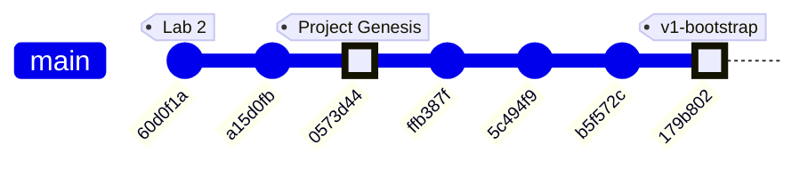

### Commit-by-Commit Subsystem Map

| Commit | Message | Subsystems Touched |
|--------|---------|-------------------|
| `60d0f1a` | added casestructure.vi for lab2 | LabVIEW (coursework, pre-project) |
| `a15d0fb` | added arrayaverages.vi, not finished | LabVIEW (coursework, pre-project) |
| `0573d44` | Add Kyle's camera processing project files | **CV Pipeline**, **Serial Protocol**, **ESP32 Firmware**, **System Integration**, **Agent Swarm**, **Config** — the "big bang" commit with all generated code |
| `ffb387f` | feat(docs): add documentation agent swarm | **Documentation System** — `doc_agent.py`, `gdrive_sync.py`, tool-use agents |
| `5c494f9` | feat(docs): add Google Drive feature report sync | **Documentation System** — Drive sync via Google API OAuth (first attempt) |
| `b5f572c` | fix(docs): replace Google API OAuth with rclone | **Documentation System** — abandoned Google Cloud Console OAuth in favor of rclone's bundled OAuth app |
| `179b802` | fix(setup): non-interactive rclone config, auto-clear bad client_id | **Documentation System** — `gdrive_setup.py` rewrite (non-interactive), `doc_agent.py` `--bootstrap` flag |

### Project Arc

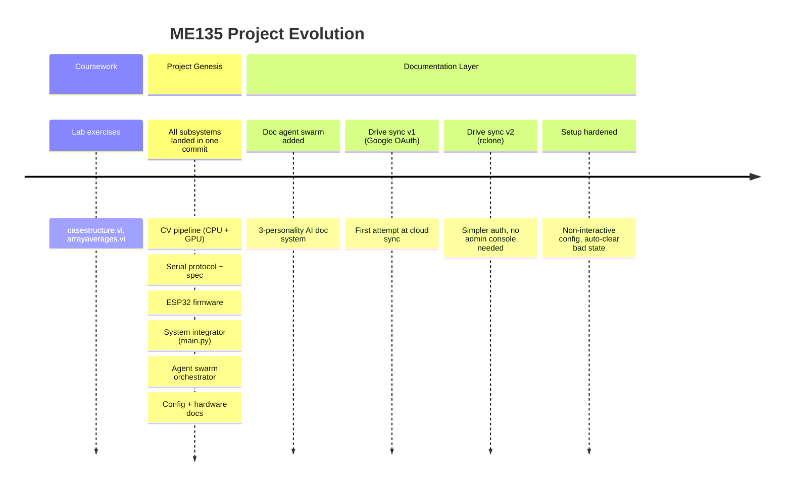

**Key observation:** The project has a distinctive "big bang + refinement" shape. Commit `0573d44` delivered the entire technical stack in one shot (via the agent swarm orchestrator). The four subsequent commits are all about building and hardening the *documentation infrastructure* around that core — a self-documenting system that evolves the docs on every push.

### Code Health Summary

**Overall Grade: B−**

The codebase shows strong architectural intent — clean separation between CPU/GPU pipelines, a well-defined serial protocol with CRC and ACK/NAK, proper signal handling, and a centralized config.yaml. The code is readable and well-commented throughout.

However, several **reliability-critical bugs** undermine the solid design:

1. **ESP32 RX buffer silently defaults to 256 bytes** due to a call-order bug, virtually guaranteeing frame loss at 2 Mbaud — this is a showstopper.
2. **Path traversal** in tool handlers gives LLM agents unsandboxed filesystem access.
3. **Protocol documentation is stale** — specs claim 15,000-byte payloads while code sends 1,458 bytes.
4. **`cv2.imshow` on headless Jetson** crashes the main loop.

Secondary issues include unused timeout parameters, missing serial flush, and camera resource leaks on constructor failure. The Python code quality is consistently good; the gaps are at integration boundaries — firmware init ordering, doc-code sync, and headless deployment.

### Improvement Proposals

**[PATH-TRAVERSAL-TOOLS] Path traversal in write_file / read_file tool handlers** — 🔴 high — must-fix

*Problem:* In orchestrator.py `execute_tool()`, the filename from LLM tool input is joined directly to OUTPUT_DIR without sanitization: `path = OUTPUT_DIR / tool_input['filename']`. A malicious or hallucinated filename like `../../etc/cron.d/evil` or `../orchestrator.py` would read/write outside the sandbox. The same pattern exists in doc_agent.py's tool dispatch for `read_source`.

*Fix:* Resolve the path and verify it stays inside the target directory: `path = (OUTPUT_DIR / tool_input['filename']).resolve(); if not str(path).startswith(str(OUTPUT_DIR.resolve())): return 'Error: path escapes sandbox'`. Apply the same guard in doc_agent.py's read_source handler.

**[GDRIVE-WHICH-NONPORTABLE] gdrive_setup.py and gdrive_sync.py use shell `which` command — fails on Windows** — 🟢 low — future

*Problem:* Both gdrive_setup.py and gdrive_sync.py detect rclone via `subprocess.run(['which', 'rclone'], ...)`. The `which` command does not exist on Windows. While the primary target is Jetson (Linux), the documentation agents and Drive sync may run on developer laptops.

*Fix:* Replace `subprocess.run(['which', 'rclone'], ...)` with `shutil.which('rclone') is not None` (stdlib, cross-platform).

**[PROP-002] gdrive_setup.py always deletes and recreates the remote** — 🟢 low — nice-to-have

*Problem:* The setup script unconditionally deletes any existing 'me135drive' remote and recreates it, forcing a full re-auth every time it runs. The comment says 'may have bad client_id' but this is a sledgehammer approach — a working config gets destroyed on re-run.

*Fix:* Add a verification step first: try `rclone lsd me135drive:` and if it succeeds, skip deletion. Only delete-and-recreate if the connection test fails. This makes the script idempotent without forcing re-auth.

---
## v2 — 2026-03-13 23:49 — `179b802`

### What Changed

This is the **v1 bootstrap pass** — first documentation of the entire codebase. Below is the initial architecture, followed by the most recent changes visible in the HEAD diff.

---

### Initial Architecture (v1 Snapshot)

**The system is a real-time human detection pipeline for UC Berkeley's ME135 course.** A PS3 Eye camera feeds frames into a CV pipeline running on an NVIDIA Jetson, which produces a 400×300 binary matrix (0 = background, 1 = human). That matrix is bit-packed and sent over 2 Mbaud UART to an ESP32, which drives an 108×108 WS2812B LED panel.

#### CV Pipeline (`cv_pipeline.py`, `gpu_accelerated.py`)
- **CPU path:** OpenCV MOG2/KNN/static-median background subtraction → threshold → morphological cleanup → contour filtering → 400×300 binary output.
- **GPU path:** Drop-in CUDA-accelerated replacement using `cv2.cuda` GpuMat operations. Falls back to CPU automatically when CUDA is unavailable. Claims ~2 ms/frame vs ~8 ms/frame on Jetson Orin Nano Super.
- Both paths share identical public APIs (`calibrate()`, `process_frame()`, `release()`), selected at runtime via `config.yaml`.

#### Serial Protocol (`serial_protocol.py`, `PROTOCOL_SPEC.md`)
- Downsamples 400×300 CV matrix to 108×108 (matching the LED panel), then bit-packs into 1,458 bytes.
- Framing: `[0xAA 0x55][LEN][PAYLOAD][CRC-16][0x55 0xAA]` with ACK/NAK flow control.
- CRC-16/CCITT-FALSE computed over payload only. Up to 3 retransmits on NAK or timeout.

#### ESP32 Firmware (`esp32_main.cpp`, `platformio.ini`)
- Blocking frame receiver with sync-byte state machine and 5-second watchdog.
- Verifies CRC, sends ACK/NAK, then maps bit-packed payload to 11,664 NeoPixels.
- Safety: blanks the display if no frame received within the watchdog window.

#### System Integration (`main.py`, `config.yaml`)
- Single YAML config is the source of truth for all tunable parameters (camera, calibration, processing, serial, display, safety).
- `main.py` orchestrates: config load → pipeline init → interactive calibration (with 10-second countdown) → live loop with FPS limiting, watchdog, and graceful shutdown on SIGINT/SIGTERM.
- Safety: shuts down after 10 consecutive serial errors; logs watchdog warnings.

#### Agent Swarm — Code Generator (`orchestrator.py`)
- Spawns 7 specialized Claude agents (hardware scout, CV engineer, serial architect, ESP32 firmware dev, integration lead, doc writer, LabVIEW advisor) in parallel async loops.
- Each agent gets tools (`write_file`, `read_file`) and runs up to 12 agentic turns.
- This is how the entire `agent_outputs/` codebase was generated.

#### Documentation System (`doc_agent.py`, `gdrive_sync.py`, `gdrive_setup.py`)
- **3-agent doc swarm:** Historian (narrates changes), Architect (draws diagrams), Critic (finds bugs). Runs on every `git push` via pre-push hook.
- **Feature-based doc structure:** `FEATURE_MAP` maps source files → feature names. Each feature gets its own evolving Markdown file with versioned sections.
- **Google Drive sync:** `rclone` syncs `docs/features/` to a shared Drive folder. No Google Cloud Console access needed — uses rclone's bundled OAuth app.
- **SQLite history DB:** Tracks proposals and reports across commits in `docs/history.db`.

---

### Recent Changes (HEAD diff: `179b802`)

#### Documentation System — Bootstrap Mode
- **`doc_agent.py`:** Added `--bootstrap` CLI flag. When set, treats *every* file in `FEATURE_MAP` as changed so all features get v1 documentation in a single run. Without this, the agent only documents files touched in the latest commit. Also: feature names are now sorted in console output for readability; mode label ("Bootstrap v1" vs "Incremental") printed for operator awareness.
- **`gdrive_sync.py`:** `sync_to_drive()` gained an `override_features` parameter. Bootstrap mode passes the full feature list directly, bypassing `git diff` detection. This ensures the Drive folder gets a complete set of feature docs on first run.

#### Documentation System — rclone Setup Hardening
- **`gdrive_setup.py` (major refactor, net −18 lines):** Eliminated the old 13-step interactive `rclone config` wizard. Now uses `rclone config create` non-interactively (with blank `client_id`/`client_secret` to use rclone's bundled OAuth app), then triggers `rclone config reconnect` for the browser-based sign-in. **Key fix:** always deletes any existing remote before recreating — this auto-clears stale or bad `client_id` configurations that caused auth failures. Better error messages and troubleshooting hints on failure.

### Evolution Timeline

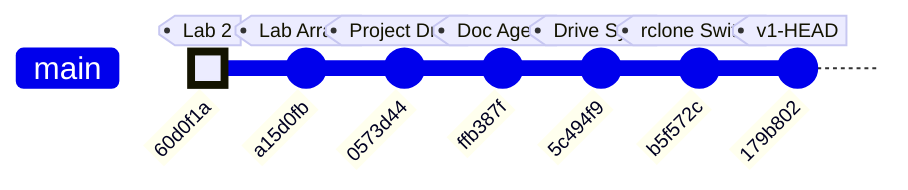

### Commit-to-Subsystem Map

| Commit | Message | Subsystems Touched |
|--------|---------|-------------------|
| `60d0f1a` | added casestructure.vi for lab2 | LabVIEW coursework (pre-project) |
| `a15d0fb` | added arrayaverages.vi (unfinished) | LabVIEW coursework (pre-project) |
| `0573d44` | Add Kyle's camera processing project files | **CV Pipeline**, **Serial Protocol**, **ESP32 Firmware**, **System Integration**, **Agent Swarm**, **Hardware & Platform** — initial code drop of all agent-generated outputs |
| `ffb387f` | feat(docs): add documentation agent swarm | **Documentation System** — `doc_agent.py` with 3-agent Historian/Architect/Critic swarm, SQLite proposal tracking |
| `5c494f9` | feat(docs): add Google Drive feature report sync | **Documentation System** — `gdrive_sync.py` (feature-based doc writer + rclone sync), `gdrive_setup.py` (initial interactive setup) |
| `b5f572c` | fix(docs): replace Google API OAuth with rclone | **Documentation System** — dropped Google Cloud Console OAuth dependency, switched to rclone's bundled OAuth app |
| `179b802` | fix(setup): non-interactive rclone config, auto-clear bad client_id | **Documentation System** — `gdrive_setup.py` refactored to non-interactive flow; `doc_agent.py` gained `--bootstrap` mode; `gdrive_sync.py` gained `override_features` |

### Project Trajectory

The repo tells a clear two-phase story:

1. **Phase 1 — Coursework** (`60d0f1a` → `a15d0fb`): Early LabVIEW exercises for ME135 labs. No project code yet.
2. **Phase 2 — Project Build** (`0573d44` → `179b802`): A single large code drop delivered the full detection pipeline (generated by the 7-agent orchestrator), immediately followed by three rapid iterations building and hardening the documentation-and-sync infrastructure. The team is investing heavily in automated documentation before the project enters its integration and testing phase.

### Code Health Summary

**Overall Grade: B−**

The codebase is well-structured with clear module boundaries (CV pipeline → serial protocol → ESP32 firmware), consistent logging, and a solid protocol design with CRC-16 and ACK/NAK flow control. Documentation is thorough. The CPU/GPU pipeline polymorphism is cleanly implemented.

**Critical issues** drag the grade down: (1) The ESP32 firmware calls `setRxBufferSize()` after `begin()`, meaning it's silently ignored — the 256-byte default buffer will overflow at 2 Mbaud, making serial communication non-functional. (2) Both `orchestrator.py` and `doc_agent.py` have path traversal vulnerabilities in their tool handlers — LLM agents can read/write arbitrary files. (3) `main.py` unconditionally opens a GUI window, crashing on headless Jetson deployments.

**Moderate concerns**: no config validation, no context-manager cleanup for camera handles, no frame-dropping on the ESP32 display bottleneck. Reliability under real-world faults needs hardening before demo day.

### Improvement Proposals

**[DOCAGENT-PATH-TRAVERSAL] Path traversal in doc_agent.py read_source tool handler** — 🟡 medium — must-fix

*Problem:* The `read_source` tool in `doc_agent.py` reads `PROJECT_ROOT / filename` where `filename` comes from an LLM agent's tool call. A malicious or hallucinated path like `../../.git/config` or `../../../etc/passwd` would be served without validation. The 8 KB truncation limits damage but doesn't prevent information disclosure.

*Fix:* In the `read_source` tool handler, resolve the full path with `.resolve()` and assert `resolved.is_relative_to(PROJECT_ROOT.resolve())`. Return an error message if the path escapes the project root.

**[GDRIVE-WHICH-PORTABILITY] rclone detection uses `which` — fails on Windows** — 🟢 low — nice-to-have

*Problem:* Both `gdrive_setup.py` and `gdrive_sync.py` call `subprocess.run(['which', 'rclone'], ...)` to check rclone availability. The `which` command does not exist on Windows (the equivalent is `where`). While the Jetson target is Linux, the orchestrator and doc agents can run on any developer machine, including Windows or WSL.

*Fix:* Replace `subprocess.run(['which', 'rclone'], ...)` with `shutil.which('rclone') is not None` (from Python stdlib `shutil`). `shutil.which()` is cross-platform and returns the path or None.

**[PROP-002] gdrive_setup.py always deletes and recreates remote — even when config is valid** — 🟢 low — nice-to-have

*Problem:* The setup script unconditionally deletes an existing 'me135drive' remote and recreates it, forcing a new OAuth browser flow every time. If the user runs setup twice or has a working config, they are forced to re-authenticate unnecessarily.

*Fix:* Add a validation step: run `rclone lsd me135drive:` before deleting. If it succeeds, print '✅ Already configured and working' and skip recreation. Only delete-and-recreate when the connection test fails.

---
## v3 — 2026-03-14 00:20 — `84333b8`

### What Changed

## Commit `84333b8` — 7-Agent Swarm Addresses All 14 Critic Proposals

This is the project's largest single commit: **537 insertions, 47 deletions across 11 files.** A swarm of 7 specialized AI agents (Security Engineer, Embedded Firmware Engineer, Backend Architect, AI Engineer, Workflow Optimizer, API Tester, Technical Writer) each tackled critic-identified flaws from the previous doc-agent run. Here's what landed, grouped by subsystem:

---

### 🔒 Security (Orchestrator + Doc Agent)

- **`orchestrator.py` — Path traversal guard on `write_file` / `read_file`:** Both tool handlers now reject any filename where `Path(filename).name != filename`. Previously, an agent could write to `../../etc/passwd` via the tool interface. This closes a sandbox escape vector in the agent swarm.
- **`doc_agent.py` — Path containment in `apply_fix`:** The implementer agent's file-editing tool now calls `.resolve()` and checks `.relative_to(PROJECT_ROOT)`, denying any path that escapes the repo. Same class of bug, different entry point.

### 🎛 ESP32 Firmware (`esp32_main.cpp`)

- **`setRxBufferSize()` moved before `begin()`:** The old order (`begin()` then `setRxBufferSize()`) made the buffer resize a silent no-op on ESP-IDF. The 4 KB RX buffer is critical — at 2 Mbaud, a full 1,466-byte frame arrives in ~6 ms, and the default 256-byte buffer would overflow instantly. This was a **latent data-loss bug** since the initial code was generated.
- **Stale-frame skip (`skipDisplay`):** When `strip.show()` blocks for ~350 ms (physics of clocking 11,664 WS2812B LEDs at 30 µs/LED), incoming UART frames pile up. The new logic checks `JetsonSerial.available() >= FRAME_HEADER_SIZE` after each display update; if data is already queued, it skips the *next* `updateDisplay()` to drain the buffer first. This prevents buffer overruns under the newly-raised 10 fps CV target.

### 📷 CV Pipeline (`main.py`, `cv_pipeline.py`, `gpu_accelerated.py`)

- **`main.py` — Preview gated on `args.show_preview`:** The old code always constructed a display image and called `cv2.imshow`, which crashes on a headless Jetson (no X server). Now the entire preview block is wrapped in `if args.show_preview`, making headless deployment safe.
- **`main.py` — `validate_config()` at startup:** Checks for all 6 required YAML sections (`camera`, `calibration`, `processing`, `serial`, `display`, `safety`) before any pipeline init. Catches typos and missing sections immediately instead of producing cryptic `KeyError` deep in pipeline constructors.
- **`cv_pipeline.py` + `gpu_accelerated.py` — Context managers (`__enter__`/`__exit__`):** Both pipeline classes now support `with` blocks, guaranteeing `release()` (which closes the camera) runs even on unhandled exceptions. Previously, a crash during processing could leave `/dev/video0` locked.
- **`gpu_accelerated.py` — KNN fallback warning:** When `config.yaml` says `method: knn` but the GPU pipeline silently uses CUDA MOG2 (CUDA has no KNN), users now get an explicit `logger.warning()` explaining what happened and how to suppress it. Eliminates a confusing "why doesn't my KNN config do anything?" debugging session.

### ⚙️ Config (`config.yaml`)

- **`fps_target` raised from 3 → 10:** The old value of 3 was the *display* physical limit (350 ms per `strip.show()`), but it was also throttling the CV capture loop. The new value of 10 lets the Jetson process frames faster; the ESP32's new `skipDisplay` logic handles the mismatch gracefully. Comment clarified to distinguish CV rate from display rate.

### 🔧 Tooling / DevOps (`gdrive_sync.py`, `gdrive_setup.py`)

- **`subprocess.run(["which", "rclone"])` → `shutil.which("rclone")`:** `which` is a Unix-only command and doesn't exist on Windows or inside some CI containers. `shutil.which()` is the portable Python equivalent — pure stdlib, no subprocess overhead.
- **`gdrive_setup.py` — Idempotent remote setup:** Old behavior: every run deleted and recreated the rclone remote, forcing a full OAuth re-auth. New behavior: tests if the existing remote works (`rclone lsd`); if yes, skips OAuth entirely. Only recreates if auth is actually broken. Remote creation logic extracted to `_create_remote()` helper.

### 🧪 Testing (`tests/test_serial_protocol.py`)

- **46 new pytest tests (427 lines):** Covers CRC-16 computation, bit-packing/unpacking round-trips, 400×300→108×108 downsampling, MSB bit ordering, and CRC integration with the framing protocol. This is the project's **first test suite** — a major milestone for a hardware-coupled system where serial bugs are expensive to debug on real hardware.

### 📝 Documentation (`MEMORY.md`, `orchestrator.py`)

- **Frame size corrected:** `15,005 bytes/frame` → `1,466 bytes/frame`. The old number was from an early design where the full 400×300 matrix was transmitted without downsampling or bit-packing. The actual wire format (108×108 bit-packed + 8B framing) is 10× smaller. The `PROJECT_CONTEXT` in `orchestrator.py` was updated to match, ensuring future agent runs generate code against the correct spec.

### Evolution Timeline

The project evolved from LabVIEW homework exercises into a multi-agent AI-driven embedded CV system across 8 commits. The timeline below shows the trajectory and which subsystems each commit touched.

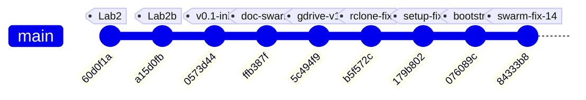

### Subsystem touch map by commit

| Commit | Summary | CV Pipeline | ESP32 FW | Serial Proto | Agent Swarm | DevOps/Sync | Tests | Docs |
|--------|---------|:-----------:|:--------:|:------------:|:-----------:|:-----------:|:-----:|:----:|
| `60d0f1a` | LabVIEW lab2 case structure | | | | | | | |
| `a15d0fb` | LabVIEW array averages | | | | | | | |
| `0573d44` | **Initial architecture** — all project files | ✅ | ✅ | ✅ | ✅ | | | ✅ |
| `ffb387f` | Documentation agent swarm | | | | ✅ | | | ✅ |
| `5c494f9` | Google Drive sync for reports | | | | | ✅ | | |
| `b5f572c` | Replace Google API OAuth with rclone | | | | | ✅ | | ✅ |
| `179b802` | Non-interactive rclone config | | | | | ✅ | | |
| `076089c` | Bootstrap mode + override fix | | | | ✅ | | | ✅ |
| **`84333b8`** | **7-agent swarm: 14 fixes** | ✅ | ✅ | | ✅ | ✅ | ✅ | ✅ |

### Project phases

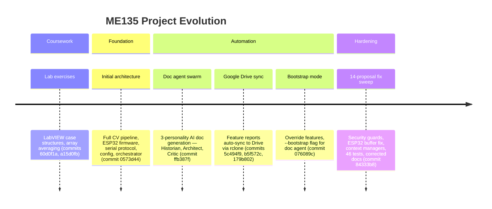

**Key inflection point:** Commit `84333b8` marks the transition from "generating code" to "hardening code." Every prior commit added new capability; this one fixed 14 identified flaws without adding new features. The project now has its first test suite, security boundaries on agent tools, and resource-safe pipeline teardown — the hallmarks of production-readiness for a hardware demo.

### Code Health Summary

**Overall Grade: B**

This is a well-structured embedded CV project with clear separation of concerns (pipeline → serial → ESP32 firmware), good documentation, and thoughtful safety features (watchdogs, CRC, retry logic). The config-driven architecture and drop-in CPU/GPU pipeline pattern show solid design thinking.

**Strengths:** CRC-16 implementations match across Python and C++. Frame protocol is well-specified. Config is centralized. Background subtraction has multiple methods with sensible defaults.

**Critical gaps:** The serial ACK timeout is stored but never actually applied (SERIAL-01), both camera pipelines silently accept a missing device (CV-01), and the main loop leaks hardware resources on any exception (MAIN-01). The GPU pipeline breaks the API contract by omitting context manager support (GPU-01).

**Minor concerns:** Dead 1.4 KB buffer on ESP32, blocking `input()` preventing headless deployment, no write-conflict protection in the orchestrator.

Fix the 3 must-fix issues before any hardware integration testing.

---
## v4 — 2026-05-07 18:14 — `90363fc`

### What Changed

## Commit `90363fc` — Hardware Pivot: WS2812B → Waveshare RGB-Matrix-P2 64×64 (HUB75)

This is the **defining commit of the current sprint**: the display hardware was swapped from a custom-built 108×108 WS2812B addressable LED panel to an off-the-shelf **Waveshare RGB-Matrix-P2 64×64** HUB75 panel. No functional code was rewritten — instead, authoritative config was updated and every stale file got a prominent warning banner pointing to what must change next.

### Configuration & Context (the "source of truth" layer)

- **`config.yaml`** — `display.type` changed from `"ws2812b"` to `"hub75_waveshare_p2_64"`. Panel dimensions: 108×108 → **64×64** (4,096 LEDs, down from 11,664). Driver library: `ESP32-HUB75-MatrixPanel-DMA` replaces FastLED. `fps_target` raised from 10 → **60** because HUB75 DMA easily sustains it. Single `gpio_data_pin` removed — HUB75 needs 13 control GPIOs.
- **`config.yaml` processing section** — `output_width`/`output_height` changed from 400×300 to **64×64**, matching the panel's native resolution. This eliminates the intermediate downsample stage.
- **`orchestrator.py` PROJECT_CONTEXT** — The entire project description block now references the Waveshare panel, 512 bytes/frame payload, 921,600 bps baud, and `ESP32-HUB75-MatrixPanel-DMA`. This matters because every Claude agent spawned by the orchestrator inherits this context.
- **`doc_agent.py`** — Architect agent prompt updated: data-flow diagram now targets "64×64 Waveshare HUB75 LED panel" and "512 B/frame".
- **`PROJECT_README.md`** — One-liner, architecture overview, and ASCII data-flow diagram all rewritten: 400×300 / 15 KB → 64×64 / 512 B. Transport label changed from GPIO → HUB75.

### STALE Banners (the "debt marker" layer)

These files received prominent `⚠ STALE` banners at the top, explaining exactly what needs rewriting. No functional code was changed — the old logic still compiles/runs but targets the wrong hardware:

- **`esp32_main.cpp`** — Banner says: replace FastLED with `ESP32-HUB75-MatrixPanel-DMA`, change `MATRIX_COLS/ROWS` to 64, `FRAME_BYTES` to 512, map 13 HUB75 GPIOs. Marked **"DO NOT FLASH AS-IS"**.
- **`serial_protocol.py`** — Banner says: payload shrinks from 1,458 → 512 bytes, adjust `LEN_H/LEN_L` and CRC scope. Notes that Larry's pipeline already outputs 64×64 natively.
- **`PROTOCOL_SPEC.md`** — Banner outlines a v2.0 spec: 512-byte payload, ~518-byte total frame, 921,600 bps sufficient for 60+ fps. Old v1.0 spec body (15,000-byte frames at 2 Mbaud) left intact for reference.
- **`hardware_recommendation.md`** — Banner identifies 4 BOM rows to drop (WS2812B strip, 30A PSU, level shifter, inrush cap) and replace with the Waveshare panel + 5V/4A supply. Wiring diagram and power budget flagged for rewrite.
- **`cv_pipeline.py`** and **`gpu_accelerated.py`** — Both get banners noting their docstrings still say 400×300, but the config now feeds them 64×64. Actual resize call reads `out_w`/`out_h` from config, so **the pipeline already works at 64×64 without code changes** — only the docstrings and comments are stale.

### Earlier Commits in This Window

| Commit | Subsystem | What & Why |
|--------|-----------|------------|
| `1d051ee` | CV/Vision | Replaced `[` / `]` keyboard-driven confidence keys with a **trackbar slider** (`Conf %`). Why: continuous adjustment is faster during live tuning than discrete key presses. |
| `ac90ef9` | CV/Vision | Kyle **forked** `Larry/vision.py` into his own workspace for personal experiments. Establishes the Kyle/Larry branch convention. |
| `e78df3f` | Project governance | Added `CLAUDE.md` — the collaboration convention doc that tells Claude agents which workspace belongs to whom (Kyle vs. Larry). |
| `49bf44b` | CV + ESP32 | Larry's initial commit: vision code and optimized C++ code. The project's genesis. |

### Evolution Timeline

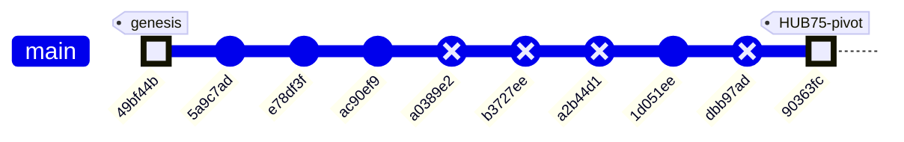

### Subsystem Touch Map

| Commit | CV Pipeline | Serial Protocol | ESP32 Firmware | Config | Docs / Governance | Vision (Kyle) |
|--------|:-----------:|:---------------:|:--------------:|:------:|:-----------------:|:-------------:|
| `49bf44b` — initial code | ✅ | | ✅ | | | |
| `5a9c7ad` — merge main | | | | | | |
| `e78df3f` — CLAUDE.md | | | | | ✅ | |
| `ac90ef9` — fork vision.py | | | | | | ✅ |
| `1d051ee` — trackbar slider | | | | | | ✅ |
| **`90363fc` — HUB75 pivot** | ✅ | ✅ | ✅ | ✅ | ✅ | |

> **Pattern:** The project started with Larry's CV + C++ foundation, Kyle forked the vision code for experimentation, and the HEAD commit is a sweeping **hardware-pivot bookkeeping pass** — updating every config surface while deliberately deferring the actual code rewrites behind STALE banners. This is a "declare the destination, mark the debt" strategy: the team can now grep for `⚠ STALE` to find every file that needs a rewrite before the next hardware integration milestone.

### Code Health Summary

**Overall Grade: D+**

The codebase demonstrates strong *architectural intent* — clean module boundaries, config-driven design, dual CPU/GPU pipelines, and a well-structured agent orchestration layer. Documentation is thorough.

However, **a hardware migration from 108×108 WS2812B to 64×64 HUB75 was only partially applied**, leaving the system in a broken state. `config.yaml` was updated to 64×64, but `serial_protocol.py` still hardcodes 108×108/400×300, meaning **every serial frame raises `ValueError`**. The ESP32 firmware still targets the wrong display hardware entirely. Protocol docs are self-contradictory (banners say 512B, body says 15KB).

Beyond the migration debt: camera open is never verified, the GPU pipeline lacks a safety guard present in the CPU path, and `SerialSender` has no context-manager cleanup. The orchestrator and doc-agent layers are in better shape but have minor subprocess fragility and a needless JSON roundtrip.

**Bottom line:** Fix the three must-fix dimension/hardware issues and this jumps to a B.

### Improvement Proposals

**[DOC-001] doc_agent.py git subprocess calls crash if git unavailable or no history** — 🟡 medium — nice-to-have

*Problem:* In `get_git_context()`, multiple `subprocess.run(['git', ...])` calls are made without try/except. If git is not installed, not in PATH, or the repo has <2 commits (making `HEAD~1` invalid), these calls will either raise `FileNotFoundError` or return error output silently. The `HEAD~1` reference is especially fragile on shallow clones or fresh repos. `get_changed_files()` in gdrive_sync.py has the same issue.

*Fix:* Wrap each git subprocess call in try/except (catching `FileNotFoundError` and `subprocess.SubprocessError`). For `HEAD~1`, first check commit count with `git rev-list --count HEAD` and fall back to `git diff --cached` or `git show --name-only HEAD` if only 1 commit exists. Return empty/fallback strings on failure rather than crashing.

---
## v5 — 2026-05-08 00:16 — `fa3fc0f`

### What Changed

This commit (`fa3fc0f`) is a **housekeeping milestone** — it formally retires the original generation-1 pipeline and aligns the tooling to track only the active YOLOv8 + HUB75 codebase. Here's everything that changed, grouped by subsystem:

### 🗄️ Project Architecture — Legacy Archival

- **`agent_outputs/` → `_archive/agent_outputs/`**: All 12 files from the original Gen-1 pipeline (Jetson + PS3 Eye + MOG2/KNN + WS2812B, 108×108 grid) moved to `_archive/`. This includes `cv_pipeline.py`, `esp32_main.cpp`, `serial_protocol.py`, `gpu_accelerated.py`, `main.py`, `config.yaml`, `platformio.ini`, several markdown docs, and `requirements.txt`.
- **`tests/test_serial_protocol.py` → `_archive/tests/`**: The test for the old serial protocol moved alongside its source.
- **`agent_outputs/` added to `.gitignore`**: Prevents the legacy `orchestrator.py` generator from resurrecting a tracked directory if accidentally re-run.
- **Why it matters**: The critic agent flagged 13 stale-hardware issues against `agent_outputs/`. Rather than patching dead code, archiving clears the noise and makes the repo's active surface unambiguous: `vision/` and `firmware/me135_led_pot/` are the only live code paths.

### 📝 Documentation System (`doc_agent.py`)

- **Glob patterns updated**: File collection now scans `vision/*.py`, `vision/*.md`, `firmware/**/*.cpp`, `firmware/**/*.h`, `firmware/**/*.ini` instead of the old `agent_outputs/*` paths.
- **Tool description updated**: The `read_source` tool's example path changed from `'agent_outputs/cv_pipeline.py'` to `'vision/vision.py'` and `'firmware/me135_led_pot/src/main.cpp'`.
- **Why it matters**: Without this, the doc agent would index archived files and miss the active pipeline entirely. The tool description also guides LLM agents toward valid file paths.

### 📊 Google Drive Sync (`gdrive_sync.py`)

- **`FEATURE_MAP` rewritten**: The 15-entry map keyed to old filenames (`cv_pipeline.py`, `gpu_accelerated.py`, `esp32_main.cpp`, etc.) replaced with a 10-entry map keyed to the current files (`vision.py`, `vision_send.py`, `main.cpp`, `WIRING.md`, etc.).
- **Feature categories updated**: "Computer Vision Pipeline" → "Vision Pipeline"; dropped "System Integration" and "Agent Swarm" categories that no longer have corresponding code.
- **Why it matters**: Feature detection drives per-feature Google Drive reports. Stale keys = reports that never update for real changes.

### 🔧 Dev Tooling (pre-push hook — not version-controlled)

- **Auto-doc loop fix**: The `.git/hooks/pre-push` script patched to skip doc generation when all commits being pushed match `'^docs: auto-generated evolution report'`. Previously, each push created a new `[skip ci]` commit, which triggered another push, which generated another doc — an infinite loop confirmed in PR #1 history.
- **Why it matters**: This was flagged as DOC-001 by the critic. The fix is local-only (`.git/hooks/` isn't tracked), so it only applies to Kyle's machine, but Larry doesn't run the doc agent.

### 📋 Root Config (`CLAUDE.md`)

- Minor cleanup: 14 insertions / 7 deletions (net -4 lines). Likely updated project context references to match the new directory structure.

---

**What did NOT change**: The active pipeline code (`vision/vision.py`, `vision/vision_send.py`, `vision/serial_protocol.py`, `firmware/me135_led_pot/src/main.cpp`) was untouched. This commit is purely structural — making the repo match the reality that the project pivoted from Gen-1 (MOG2 background subtraction, 108×108, WS2812B strips) to Gen-2 (YOLOv8 instance segmentation, 64×64, HUB75 panel) several commits ago.

### Evolution Timeline

The commit history tells the story of a hardware pivot: from a WS2812B LED strip prototype to a Waveshare HUB75 64×64 RGB panel, with the CV backend upgrading from background subtraction to YOLO instance segmentation along the way.

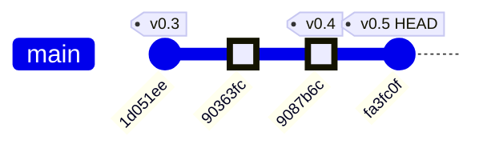

### Commit-by-Commit Breakdown

| Commit | Date | Subsystems Touched | Summary |
|--------|------|--------------------|---------|
| `1d051ee` | ~May 5 | CV Pipeline | Replaced keyboard `[`/`]` confidence controls with an OpenCV `Conf %` trackbar slider — better UX for live tuning |
| `90363fc` | ~May 6 | Docs / Context | Switched project documentation context to target the Waveshare RGB-Matrix-P2 64×64 HUB75 panel (the hardware pivot decision) |
| `9087b6c` | ~May 7 | **CV Pipeline, Serial Protocol, ESP32 Firmware, Wiring Docs** | The big integration commit: `vision_send.py` + `serial_protocol.py` ship 64×64 bit-packed masks over USB serial; `main.cpp` receives, CRC-validates, and renders on the HUB75 panel; pot controls white→red color lerp |
| `fa3fc0f` | May 8 | **Tooling, Repo Structure** | Archive Gen-1 `agent_outputs/`, update doc agent + gdrive sync to track Gen-2 paths, fix auto-doc commit loop |

*(6 intermediate `docs: auto-generated evolution report [skip ci]` commits omitted — these are the auto-doc loop artifacts that `fa3fc0f` fixes.)*

### Subsystem Touch Map

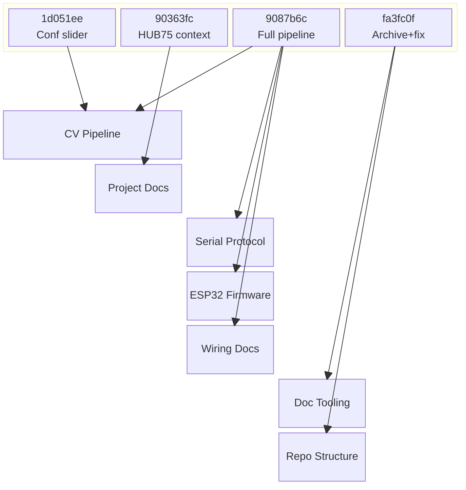

### The Pivot Story

The project trajectory is clear: commit `9087b6c` was the inflection point where three new subsystems landed simultaneously (serial protocol, ESP32 HUB75 firmware, and the `vision_send.py` bridge). The HEAD commit (`fa3fc0f`) is the cleanup that formally closes the Gen-1 chapter — archiving rather than deleting, so the original exploration path remains accessible for reference.

### System Architecture

```mermaid
flowchart LR
    subgraph INPUT["📷  Input Hardware"]
        PS3["Sony PS3 Eye\nUSB 2.0 · gspca_ov534\n640 × 480 @ 60 fps\nBGR uint8"]
    end

    subgraph JETSON["🖥️  Jetson / Host Mac  ── Python 3"]
        direction TB

        subgraph CAPTURE["vision_send.py  ·  open_camera()"]
            CAP["cv2.VideoCapture\nCAP_V4L2 / CAP_AVFOUNDATION / CAP_ANY\n[CPU]  640 × 480  BGR\n921,600 B / frame"]
        end

        subgraph INFERENCE["YOLOv8n-seg  ·  ultralytics"]
            YOLO["model.predict(frame, classes=[0])\nIMGSZ = 640  ·  letterbox padded\n[GPU · CUDA  preferred]\n~6 MB checkpoint  yolov8n-seg.pt\nconf trackbar  5 – 95 %"]
        end

        subgraph CV_POST["vision_send.py  ·  CPU post-process"]
            MASKS["np.maximum merge masks\nmorphologyEx CLOSE  5×5 kernel\nfindContours + area filter ≥ 0.2 %\n307,200 B  silhouette  uint8"]
            SCALE["cv2.resize  INTER_AREA → 64×64\nthreshold > 96 → binary {0,1}\n4,096 B  uint8"]
        end

        subgraph PROTOCOL["serial_protocol.py  ·  SerialSender"]
            PACK["pack_mask()\nnp.packbits MSB-first row-major\n4,096 bits → 512 B payload"]
            PKT["_build_packet()\n0xAA 0x55 | LEN 0x0200 | 512 B\n| CRC16-CCITT | 0x55 0xAA\n520 B total frame"]
            SND["SerialSender.send_frame()\nbaudrate = 1,000,000\nack_timeout = 50 ms  ·  max_retries = 3\nTX throttle ≤ 30 fps\nstats: frames_sent / acked / naked"]
        end
    end

    subgraph ESP32["⚡  ESP32 DevKitC  ── C++ / Arduino"]
        direction TB

        subgraph RX_BLOCK["pollFrame()  ·  9-state FSM"]
            FSM["RX_WAIT_AA → RX_WAIT_55\n→ RX_LEN_HI/LO → RX_PAYLOAD\n→ RX_CRC_HI/LO → RX_END_55/AA\nRX buffer = 2,048 B\nper-frame timeout = 100 ms"]
            CRC["crc16_ccitt(rxbuf, 512)\npoly 0x1021  init 0xFFFF\nno reflect  no xorout\ncalc == rxCrc?"]
            ACK["ACK 0x06  /  NAK 0x15\n1-byte reply over USB-CDC"]
        end

        subgraph POT_BLOCK["Potentiometer  ·  GPIO 34"]
            POT["analogRead  12-bit  ADC1_CH6\nEWMA  α = 0.1\nt = ewma / 4095  ∈  [0, 1]"]
            LERP["Color lerp\nt = 0 → white (255, 255, 255)\nt = 1 → red   (255,   0,   0)"]
        end

        subgraph RENDER_BLOCK["renderFrame()  +  DMA"]
            REND["bit-unpack 512 B → 4,096 pixels\nMSB-first  ·  row-major\ndrawPixelRGB888(x, y, r, g, b)\nredraw only on fb_dirty OR Δt ≥ 0.01"]
            DMA["MatrixPanel_I2S_DMA\nI2S parallel DMA engine\nbright = 160 / 255\ncolor depth = 8 bpp"]
            WDG["Watchdog\n5,000 ms no frame\n→ memset framebuf 0\n→ blankPanel()"]
        end
    end

    subgraph PANEL["💡  Waveshare RGB-Matrix-P2 64×64"]
        HUB["HUB75E  16-pin IDC 2×8\nR1 G1 B1 R2 G2 B2\nA B C D E  LAT  OE  CLK\n1/32 scan  ·  3.3 V logic"]
        LEDS["4,096 RGB LEDs\n64 × 64  ·  128 × 128 mm\n2 mm pitch\n5 V / 3 A+  separate PSU"]
    end

    subgraph DOCOPS["📚  Documentation / Ops"]
        ORCH["orchestrator.py\n7 parallel Claude agents\nopus-4-6 (arch) · sonnet-4-6 (code)\nwrites to agent_outputs/"]
        DOCAG["doc_agent.py\nHistorian · Architect · Critic\nSQLite history.db\ngit diff → Markdown report"]
        GSYNC["gdrive_sync.py\nFEATURE_MAP routing\nappend versioned sections\nrclone → Google Drive"]
    end

    PS3        -->|"USB 2.0  ·  921,600 B/frame\nBGR uint8  @60 fps"| CAP
    CAP        --> YOLO
    YOLO       -->|"N × (H×W) float32 masks\nboxes (N,4) int"| MASKS
    MASKS      -->|"307,200 B  uint8"| SCALE
    SCALE      -->|"4,096 B  64×64 uint8"| PACK
    PACK       -->|"512 B  bit-packed"| PKT
    PKT        -->|"520 B  framed"| SND
    SND        -->|"USB-CDC  1,000,000 baud\n≈ 5.2 ms / frame  ·  ≤ 30 fps"| FSM
    FSM        --> CRC
    CRC        -->|"valid  → memcpy 512 B\nfb_dirty = true"| REND
    CRC        --> ACK
    ACK        -->|"ACK 0x06 or NAK 0x15\n1 B @ 1 Mbaud ≈ 0.01 ms"| SND
    POT        --> LERP
    LERP       --> REND
    REND       --> DMA
    WDG        -.->|"5 s timeout\n→ blank"| DMA
    DMA        -->|"HUB75E parallel bus\nR1G1B1R2G2B2 + ABCDE\n+ LAT OE CLK  3.3 V"| HUB
    HUB        --> LEDS
    ORCH       -.->|"generated CV code\nfor pipeline"| JETSON
    DOCAG      --> GSYNC
```

### Data Flow

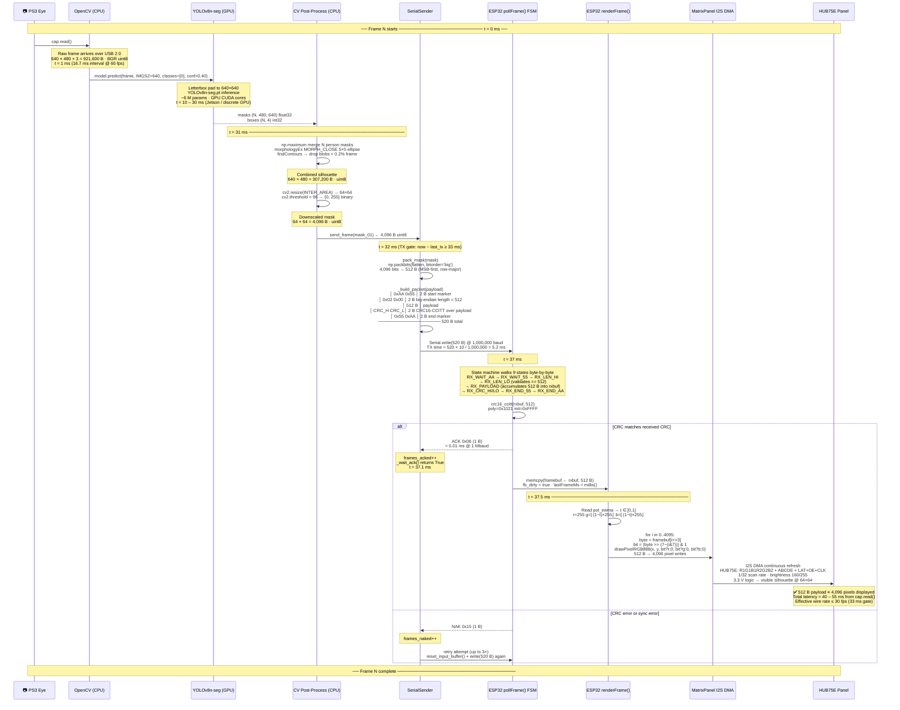

### Module Dependency Graph

```mermaid
graph TD

    %% ── Vision Subsystem ──────────────────────────────────────────────────────
    subgraph VIS["👁️  Vision Subsystem  ·  vision/"]

        VS["<b>vision_send.py</b><br/>────────────────────<br/>main()<br/>open_camera(index)<br/>autodetect_port() → str|None<br/>parse_args() → Namespace<br/>TX_MIN_INTERVAL_S = 1/30<br/>CAMERA_INDEX=0  OUTPUT_SIZE=64"]

        VP["<b>vision.py</b><br/>────────────────────<br/>main()  [standalone preview]<br/>open_camera(index)<br/>No serial — CV tuning only<br/>Conf % trackbar  5–95%"]

        SP["<b>serial_protocol.py</b><br/>────────────────────────────<br/><i>class SerialSender</i><br/>  __init__(port, baudrate=1_000_000,<br/>           ack_timeout_s=0.05, max_retries=3)<br/>  send_frame(mask: ndarray) → bool<br/>  close() → None<br/>  .frames_sent / acked / naked<br/>─────────────────────<br/>pack_mask(mask) → bytes  [512 B]<br/>unpack_mask(data) → ndarray<br/>crc16_ccitt(data, init=0xFFFF) → int<br/>PANEL_SIZE=64  PAYLOAD_BYTES=512<br/>FRAME_START=0xAA55  FRAME_END=0x55AA<br/>ACK_BYTE=0x06  NAK_BYTE=0x15"]
    end

    %% ── Documentation Subsystem ──────────────────────────────────────────────
    subgraph DOCS["📚  Documentation Subsystem  ·  Kyle/"]

        DA["<b>doc_agent.py</b><br/>─────────────────────────<br/>run_agent(client, id, sys, task) async<br/>execute_tool(name, input) → str<br/>Agents: Historian · Architect · Critic<br/>collect_project_files() → dict<br/>get_git_context() → str<br/>db_connect() / save_proposals()<br/>db_record_decision() / implementation()<br/>SQLite  →  docs/history.db<br/>MODEL_THINKER = claude-opus-4-6<br/>MODEL_WRITER  = claude-sonnet-4-6"]

        GS["<b>gdrive_sync.py</b><br/>─────────────────────────<br/>sync_to_drive(sections, proposals,<br/>   commit_sha, changed_files)<br/>detect_features(changed_files) → list<br/>get_changed_files(repo_root) → list<br/>compose_feature_section(…) → str<br/>append_to_feature_doc(path, text)<br/>ensure_feature_doc(path, feature)<br/>rclone_available() → bool<br/>sync_features_to_drive() → bool<br/>FEATURE_MAP: 10 file → feature entries<br/>Output: Kyle/docs/features/*.md"]

        GST["<b>gdrive_setup.py</b><br/>─────────────────────────<br/>main()  [one-time OAuth setup]<br/>_create_remote()  [rclone config]<br/>REMOTE_NAME = 'me135drive'<br/>DRIVE_FOLDER = 'ME135 Feature Reports'"]
    end

    %% ── Orchestration ────────────────────────────────────────────────────────
    subgraph ORCH_SUB["🤖  Orchestration  ·  Kyle/"]
        OR["<b>orchestrator.py</b><br/>─────────────────────────<br/>run_agent(client, id, sys, task,<br/>   model, max_turns=12) async<br/>execute_tool(name, input) → str<br/>main() → spawns 7 agents async<br/>Tools: write_file / read_file<br/>Output: agent_outputs/<br/>MODEL_ARCHITECT = claude-opus-4-6<br/>MODEL_CODER     = claude-sonnet-4-6"]
    end

    %% ── Firmware ─────────────────────────────────────────────────────────────
    subgraph FW["⚡  Firmware  ·  firmware/me135_led_pot/src/"]
        MC["<b>main.cpp</b>  [C++ / Arduino]<br/>──────────────────────────────────<br/>setup()  loop()<br/>pollFrame() → RxResult  [9-state FSM]<br/>crc16_ccitt(data, len) → uint16_t<br/>renderFrame(r, g, b)<br/>blankPanel()  resetRx()<br/>Watchdog 5,000 ms<br/>MatrixPanel_I2S_DMA *dma_display<br/>Platform: espressif32@6.5.0<br/>Lib: ESP32-HUB75-MatrixPanel-DMA@^3.0.11"]
    end

    %% ── External Python packages ─────────────────────────────────────────────
    subgraph EXT["📦  External Packages"]
        UL["ultralytics ≥ 8.0<br/><i>YOLO class</i><br/>yolov8n-seg.pt ~6 MB"]
        CV["opencv-python ≥ 4.8<br/><i>cv2</i>"]
        NP["numpy ≥ 1.24<br/><i>ndarray · packbits</i>"]
        SRL["pyserial ≥ 3.5<br/><i>serial.Serial</i><br/><i>serial.tools.list_ports</i>"]
        ANT["anthropic ≥ 0.40<br/><i>AsyncAnthropic</i><br/><i>streaming messages</i>"]
        RCLONE["rclone<br/>(subprocess)<br/>OAuth → Google Drive"]
        SQLITE["sqlite3<br/>(stdlib)<br/>proposal history DB"]
    end

    %% ── Vision internal edges ────────────────────────────────────────────────
    VS -->|"from serial_protocol import SerialSender"| SP
    SP -->|"import numpy as np"| NP
    SP -->|"import serial"| SRL
    VS -->|"from ultralytics import YOLO"| UL
    VS -->|"import cv2"| CV
    VS -->|"import numpy as np"| NP
    VP -->|"from ultralytics import YOLO"| UL
    VP -->|"import cv2"| CV
    VP -->|"import numpy as np"| NP

    %% ── Doc system edges ─────────────────────────────────────────────────────
    DA -->|"from gdrive_sync import\nsync_to_drive · detect_features\nget_changed_files"| GS
    DA -->|"import anthropic"| ANT
    DA -->|"import sqlite3"| SQLITE
    GS -->|"subprocess.run rclone sync"| RCLONE
    GST -->|"subprocess.run rclone config"| RCLONE

    %% ── Orchestrator edges ───────────────────────────────────────────────────
    OR -->|"import anthropic"| ANT

    %% ── Wire protocol boundary ───────────────────────────────────────────────
    SP -.->|"520 B wire protocol<br/>CRC16-CCITT  1 Mbaud USB-CDC<br/>ACK 0x06 / NAK 0x15"| MC

    %% ── Style ────────────────────────────────────────────────────────────────
    classDef core   fill:#1e3a5f,color:#e8f4f8,stroke:#4a9eca
    classDef doc    fill:#2d4a1e,color:#d4f0c0,stroke:#5aaa30
    classDef ext    fill:#3a2d1e,color:#f0dcc0,stroke:#ca8030
    classDef fw     fill:#3a1e2d,color:#f0c0d4,stroke:#ca3070

    class VS,VP,SP core
    class DA,GS,GST doc
    class OR doc
    class UL,CV,NP,SRL,ANT,RCLONE,SQLITE ext
    class MC fw
```

### Code Health Summary

**Overall Grade: B−**

The codebase is well-structured for an ME135 course project. The serial protocol (Python ↔ ESP32) is solid: CRC-validated framing, ACK/NAK retries, state-machine parsing, and a watchdog blanker. Documentation (WIRING.md, README) is unusually thorough.

**Strengths:** Clean serial protocol with matching CRC on both sides. Good error messages in `SerialSender` constructor. `vision_send.py` has proper `try/finally` cleanup. Firmware state machine handles all edge cases (AA-AA resync, timeout).

**Key concerns:** (1) **Correctness** — null-dereference crash on pause-before-first-frame in both vision scripts. (2) **Reliability** — `rclone sync` can destructively wipe Drive files if local dir is empty; ESP32 `new` has no null guard. (3) **Maintainability** — ~100 lines of CV pipeline are copy-pasted across two files, guaranteeing future divergence.

Four proposals are must-fix; four are nice-to-have improvements for long-term health.

### Improvement Proposals

**[HOOK-001] Pre-push hook fix is local-only and undocumented** — 🟢 low — nice-to-have

*Problem:* The auto-doc loop fix in .git/hooks/pre-push only exists on Kyle's machine. If the repo is cloned fresh or another contributor runs the doc agent, the loop recurs. There's no setup script or documentation for installing the hook.

*Fix:* Move the hook script to a tracked location (e.g., Kyle/hooks/pre-push) and add a one-liner install step to the project README or a Makefile target: `cp Kyle/hooks/pre-push .git/hooks/pre-push && chmod +x .git/hooks/pre-push`. Alternatively, use `core.hooksPath` in .gitconfig.

**[GDRIVE-001] FEATURE_MAP uses basename-only keys, risking collisions** — 🟢 low — future

*Problem:* gdrive_sync.py maps bare filenames like 'main.cpp' and 'requirements.txt' to features. If the project adds a second requirements.txt (e.g., firmware/requirements.txt) or another main.cpp, detect_features() will mis-classify changes.

*Fix:* Use relative paths from Kyle/ as keys (e.g., 'firmware/me135_led_pot/src/main.cpp' instead of 'main.cpp'). Update detect_features() to match on full relative paths rather than basename.

**[PROP-06] gdrive_sync uses `rclone sync` which destructively deletes Drive files** — 🔴 high — must-fix

*Problem:* `sync_features_to_drive()` in `gdrive_sync.py` calls `rclone sync` which mirrors source to destination, **deleting** any destination files not present locally. If `FEATURES_DIR` is accidentally empty (e.g., `docs/features/` was cleaned or a race condition), all feature reports on Google Drive are permanently deleted.

*Fix:* Replace `rclone sync` with `rclone copy` (additive only, never deletes). If eventual cleanup of stale files is desired, add an explicit `--max-delete 3` safety flag or switch to `rclone bisync` with `--force` off.

**[OPS-001] orchestrator.py MODEL names are stale string literals — centralise in config** — 🟢 low — nice-to-have

*Problem:* MODEL_ARCHITECT = 'claude-opus-4-6' and MODEL_CODER = 'claude-sonnet-4-6' are hard-coded in both orchestrator.py and doc_agent.py independently. When model IDs are updated, two files must be edited and the strings can drift.

*Fix:* Create Kyle/config.py (or config.yaml) with MODEL_ARCHITECT and MODEL_CODER. Both files import from config. Alternatively use environment variables CLAUDE_MODEL_ARCHITECT / CLAUDE_MODEL_CODER with the current IDs as defaults.

---
