# ME135 | ESP32 Firmware

> Evolution log — one section per commit.

---

## v1 — 2026-03-13 23:49 — `179b802`

### What Changed

This is the **v1 bootstrap pass** — first documentation of the entire codebase. Below is the initial architecture, followed by the most recent changes visible in the HEAD diff.

---

### Initial Architecture (v1 Snapshot)

**The system is a real-time human detection pipeline for UC Berkeley's ME135 course.** A PS3 Eye camera feeds frames into a CV pipeline running on an NVIDIA Jetson, which produces a 400×300 binary matrix (0 = background, 1 = human). That matrix is bit-packed and sent over 2 Mbaud UART to an ESP32, which drives an 108×108 WS2812B LED panel.

#### CV Pipeline (`cv_pipeline.py`, `gpu_accelerated.py`)
- **CPU path:** OpenCV MOG2/KNN/static-median background subtraction → threshold → morphological cleanup → contour filtering → 400×300 binary output.
- **GPU path:** Drop-in CUDA-accelerated replacement using `cv2.cuda` GpuMat operations. Falls back to CPU automatically when CUDA is unavailable. Claims ~2 ms/frame vs ~8 ms/frame on Jetson Orin Nano Super.
- Both paths share identical public APIs (`calibrate()`, `process_frame()`, `release()`), selected at runtime via `config.yaml`.

#### Serial Protocol (`serial_protocol.py`, `PROTOCOL_SPEC.md`)
- Downsamples 400×300 CV matrix to 108×108 (matching the LED panel), then bit-packs into 1,458 bytes.
- Framing: `[0xAA 0x55][LEN][PAYLOAD][CRC-16][0x55 0xAA]` with ACK/NAK flow control.
- CRC-16/CCITT-FALSE computed over payload only. Up to 3 retransmits on NAK or timeout.

#### ESP32 Firmware (`esp32_main.cpp`, `platformio.ini`)
- Blocking frame receiver with sync-byte state machine and 5-second watchdog.
- Verifies CRC, sends ACK/NAK, then maps bit-packed payload to 11,664 NeoPixels.
- Safety: blanks the display if no frame received within the watchdog window.

#### System Integration (`main.py`, `config.yaml`)
- Single YAML config is the source of truth for all tunable parameters (camera, calibration, processing, serial, display, safety).
- `main.py` orchestrates: config load → pipeline init → interactive calibration (with 10-second countdown) → live loop with FPS limiting, watchdog, and graceful shutdown on SIGINT/SIGTERM.
- Safety: shuts down after 10 consecutive serial errors; logs watchdog warnings.

#### Agent Swarm — Code Generator (`orchestrator.py`)
- Spawns 7 specialized Claude agents (hardware scout, CV engineer, serial architect, ESP32 firmware dev, integration lead, doc writer, LabVIEW advisor) in parallel async loops.
- Each agent gets tools (`write_file`, `read_file`) and runs up to 12 agentic turns.
- This is how the entire `agent_outputs/` codebase was generated.

#### Documentation System (`doc_agent.py`, `gdrive_sync.py`, `gdrive_setup.py`)
- **3-agent doc swarm:** Historian (narrates changes), Architect (draws diagrams), Critic (finds bugs). Runs on every `git push` via pre-push hook.
- **Feature-based doc structure:** `FEATURE_MAP` maps source files → feature names. Each feature gets its own evolving Markdown file with versioned sections.
- **Google Drive sync:** `rclone` syncs `docs/features/` to a shared Drive folder. No Google Cloud Console access needed — uses rclone's bundled OAuth app.
- **SQLite history DB:** Tracks proposals and reports across commits in `docs/history.db`.

---

### Recent Changes (HEAD diff: `179b802`)

#### Documentation System — Bootstrap Mode
- **`doc_agent.py`:** Added `--bootstrap` CLI flag. When set, treats *every* file in `FEATURE_MAP` as changed so all features get v1 documentation in a single run. Without this, the agent only documents files touched in the latest commit. Also: feature names are now sorted in console output for readability; mode label ("Bootstrap v1" vs "Incremental") printed for operator awareness.
- **`gdrive_sync.py`:** `sync_to_drive()` gained an `override_features` parameter. Bootstrap mode passes the full feature list directly, bypassing `git diff` detection. This ensures the Drive folder gets a complete set of feature docs on first run.

#### Documentation System — rclone Setup Hardening
- **`gdrive_setup.py` (major refactor, net −18 lines):** Eliminated the old 13-step interactive `rclone config` wizard. Now uses `rclone config create` non-interactively (with blank `client_id`/`client_secret` to use rclone's bundled OAuth app), then triggers `rclone config reconnect` for the browser-based sign-in. **Key fix:** always deletes any existing remote before recreating — this auto-clears stale or bad `client_id` configurations that caused auth failures. Better error messages and troubleshooting hints on failure.

### Evolution Timeline

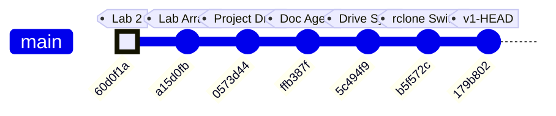

### Commit-to-Subsystem Map

| Commit | Message | Subsystems Touched |
|--------|---------|-------------------|
| `60d0f1a` | added casestructure.vi for lab2 | LabVIEW coursework (pre-project) |
| `a15d0fb` | added arrayaverages.vi (unfinished) | LabVIEW coursework (pre-project) |
| `0573d44` | Add Kyle's camera processing project files | **CV Pipeline**, **Serial Protocol**, **ESP32 Firmware**, **System Integration**, **Agent Swarm**, **Hardware & Platform** — initial code drop of all agent-generated outputs |
| `ffb387f` | feat(docs): add documentation agent swarm | **Documentation System** — `doc_agent.py` with 3-agent Historian/Architect/Critic swarm, SQLite proposal tracking |
| `5c494f9` | feat(docs): add Google Drive feature report sync | **Documentation System** — `gdrive_sync.py` (feature-based doc writer + rclone sync), `gdrive_setup.py` (initial interactive setup) |
| `b5f572c` | fix(docs): replace Google API OAuth with rclone | **Documentation System** — dropped Google Cloud Console OAuth dependency, switched to rclone's bundled OAuth app |
| `179b802` | fix(setup): non-interactive rclone config, auto-clear bad client_id | **Documentation System** — `gdrive_setup.py` refactored to non-interactive flow; `doc_agent.py` gained `--bootstrap` mode; `gdrive_sync.py` gained `override_features` |

### Project Trajectory

The repo tells a clear two-phase story:

1. **Phase 1 — Coursework** (`60d0f1a` → `a15d0fb`): Early LabVIEW exercises for ME135 labs. No project code yet.
2. **Phase 2 — Project Build** (`0573d44` → `179b802`): A single large code drop delivered the full detection pipeline (generated by the 7-agent orchestrator), immediately followed by three rapid iterations building and hardening the documentation-and-sync infrastructure. The team is investing heavily in automated documentation before the project enters its integration and testing phase.

### Code Health Summary

**Overall Grade: B−**

The codebase is well-structured with clear module boundaries (CV pipeline → serial protocol → ESP32 firmware), consistent logging, and a solid protocol design with CRC-16 and ACK/NAK flow control. Documentation is thorough. The CPU/GPU pipeline polymorphism is cleanly implemented.

**Critical issues** drag the grade down: (1) The ESP32 firmware calls `setRxBufferSize()` after `begin()`, meaning it's silently ignored — the 256-byte default buffer will overflow at 2 Mbaud, making serial communication non-functional. (2) Both `orchestrator.py` and `doc_agent.py` have path traversal vulnerabilities in their tool handlers — LLM agents can read/write arbitrary files. (3) `main.py` unconditionally opens a GUI window, crashing on headless Jetson deployments.

**Moderate concerns**: no config validation, no context-manager cleanup for camera handles, no frame-dropping on the ESP32 display bottleneck. Reliability under real-world faults needs hardening before demo day.

### Improvement Proposals

**[ESP32-RX-BUF-ORDER] ESP32 setRxBufferSize called AFTER begin() — silently ignored** — 🔴 high — must-fix

*Problem:* In `esp32_main.cpp` setup(), `JetsonSerial.setRxBufferSize(4096)` is called AFTER `JetsonSerial.begin(...)`. On ESP32-Arduino, `setRxBufferSize()` must be called BEFORE `begin()` — otherwise the call is silently ignored and the default 256-byte RX buffer is used. At 2 Mbaud with 1,466-byte frames, the 256-byte buffer will overflow constantly, causing corrupted frames and continuous NAKs.

*Fix:* Move `JetsonSerial.setRxBufferSize(4096);` to the line BEFORE `JetsonSerial.begin(SERIAL_BAUD, SERIAL_8N1, UART_RX_PIN, UART_TX_PIN);` in `setup()`.

**[ESP32-FRAME-DROP] ESP32 has no frame-dropping strategy — stale frames accumulate in UART buffer** — 🟡 medium — nice-to-have

*Problem:* WS2812B `strip.show()` for 11,664 LEDs takes ~350ms (30µs/LED). Even with `fps_target: 3` on the Jetson side, if timing drifts or retransmits occur, frames can queue in the ESP32 UART buffer. The ESP32 always processes the oldest frame first (FIFO), meaning displayed data can be multiple frames behind reality. There is no mechanism to discard stale frames and jump to the latest one.

*Fix:* After a successful `receiveFrame()` + `updateDisplay()`, add a drain loop that checks `JetsonSerial.available()`. If enough bytes for another full frame are buffered, consume and discard intermediate frames (ACK each), keeping only the last complete one. This ensures the display always shows the most recent data.

**[PROP-003] No unit tests for CRC-16 or bit-packing — protocol correctness is unverified** — 🔴 high — must-fix

*Problem:* The CRC-16/CCITT-FALSE implementation exists in both Python (serial_protocol.py) and C++ (esp32_main.cpp) but there are zero tests verifying they produce identical output for the same input. A CRC mismatch between the two sides would cause 100% NAK rate at runtime with no obvious diagnosis.

*Fix:* Add a test file (e.g. `tests/test_serial_protocol.py`) with known CRC test vectors, round-trip pack/unpack tests, and edge cases (all-zeros matrix, all-ones matrix). Include the same test vectors as comments in the ESP32 firmware for manual verification.

---
## v2 — 2026-03-14 00:20 — `84333b8`

### What Changed

## Commit `84333b8` — 7-Agent Swarm Addresses All 14 Critic Proposals

This is the project's largest single commit: **537 insertions, 47 deletions across 11 files.** A swarm of 7 specialized AI agents (Security Engineer, Embedded Firmware Engineer, Backend Architect, AI Engineer, Workflow Optimizer, API Tester, Technical Writer) each tackled critic-identified flaws from the previous doc-agent run. Here's what landed, grouped by subsystem:

---

### 🔒 Security (Orchestrator + Doc Agent)

- **`orchestrator.py` — Path traversal guard on `write_file` / `read_file`:** Both tool handlers now reject any filename where `Path(filename).name != filename`. Previously, an agent could write to `../../etc/passwd` via the tool interface. This closes a sandbox escape vector in the agent swarm.
- **`doc_agent.py` — Path containment in `apply_fix`:** The implementer agent's file-editing tool now calls `.resolve()` and checks `.relative_to(PROJECT_ROOT)`, denying any path that escapes the repo. Same class of bug, different entry point.

### 🎛 ESP32 Firmware (`esp32_main.cpp`)

- **`setRxBufferSize()` moved before `begin()`:** The old order (`begin()` then `setRxBufferSize()`) made the buffer resize a silent no-op on ESP-IDF. The 4 KB RX buffer is critical — at 2 Mbaud, a full 1,466-byte frame arrives in ~6 ms, and the default 256-byte buffer would overflow instantly. This was a **latent data-loss bug** since the initial code was generated.
- **Stale-frame skip (`skipDisplay`):** When `strip.show()` blocks for ~350 ms (physics of clocking 11,664 WS2812B LEDs at 30 µs/LED), incoming UART frames pile up. The new logic checks `JetsonSerial.available() >= FRAME_HEADER_SIZE` after each display update; if data is already queued, it skips the *next* `updateDisplay()` to drain the buffer first. This prevents buffer overruns under the newly-raised 10 fps CV target.

### 📷 CV Pipeline (`main.py`, `cv_pipeline.py`, `gpu_accelerated.py`)

- **`main.py` — Preview gated on `args.show_preview`:** The old code always constructed a display image and called `cv2.imshow`, which crashes on a headless Jetson (no X server). Now the entire preview block is wrapped in `if args.show_preview`, making headless deployment safe.
- **`main.py` — `validate_config()` at startup:** Checks for all 6 required YAML sections (`camera`, `calibration`, `processing`, `serial`, `display`, `safety`) before any pipeline init. Catches typos and missing sections immediately instead of producing cryptic `KeyError` deep in pipeline constructors.
- **`cv_pipeline.py` + `gpu_accelerated.py` — Context managers (`__enter__`/`__exit__`):** Both pipeline classes now support `with` blocks, guaranteeing `release()` (which closes the camera) runs even on unhandled exceptions. Previously, a crash during processing could leave `/dev/video0` locked.
- **`gpu_accelerated.py` — KNN fallback warning:** When `config.yaml` says `method: knn` but the GPU pipeline silently uses CUDA MOG2 (CUDA has no KNN), users now get an explicit `logger.warning()` explaining what happened and how to suppress it. Eliminates a confusing "why doesn't my KNN config do anything?" debugging session.

### ⚙️ Config (`config.yaml`)

- **`fps_target` raised from 3 → 10:** The old value of 3 was the *display* physical limit (350 ms per `strip.show()`), but it was also throttling the CV capture loop. The new value of 10 lets the Jetson process frames faster; the ESP32's new `skipDisplay` logic handles the mismatch gracefully. Comment clarified to distinguish CV rate from display rate.

### 🔧 Tooling / DevOps (`gdrive_sync.py`, `gdrive_setup.py`)

- **`subprocess.run(["which", "rclone"])` → `shutil.which("rclone")`:** `which` is a Unix-only command and doesn't exist on Windows or inside some CI containers. `shutil.which()` is the portable Python equivalent — pure stdlib, no subprocess overhead.
- **`gdrive_setup.py` — Idempotent remote setup:** Old behavior: every run deleted and recreated the rclone remote, forcing a full OAuth re-auth. New behavior: tests if the existing remote works (`rclone lsd`); if yes, skips OAuth entirely. Only recreates if auth is actually broken. Remote creation logic extracted to `_create_remote()` helper.

### 🧪 Testing (`tests/test_serial_protocol.py`)

- **46 new pytest tests (427 lines):** Covers CRC-16 computation, bit-packing/unpacking round-trips, 400×300→108×108 downsampling, MSB bit ordering, and CRC integration with the framing protocol. This is the project's **first test suite** — a major milestone for a hardware-coupled system where serial bugs are expensive to debug on real hardware.

### 📝 Documentation (`MEMORY.md`, `orchestrator.py`)

- **Frame size corrected:** `15,005 bytes/frame` → `1,466 bytes/frame`. The old number was from an early design where the full 400×300 matrix was transmitted without downsampling or bit-packing. The actual wire format (108×108 bit-packed + 8B framing) is 10× smaller. The `PROJECT_CONTEXT` in `orchestrator.py` was updated to match, ensuring future agent runs generate code against the correct spec.

### Evolution Timeline

The project evolved from LabVIEW homework exercises into a multi-agent AI-driven embedded CV system across 8 commits. The timeline below shows the trajectory and which subsystems each commit touched.

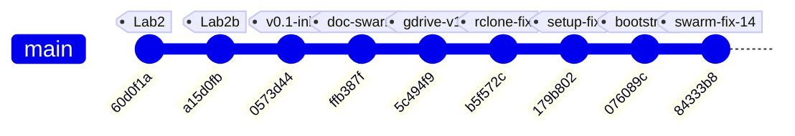

### Subsystem touch map by commit

| Commit | Summary | CV Pipeline | ESP32 FW | Serial Proto | Agent Swarm | DevOps/Sync | Tests | Docs |
|--------|---------|:-----------:|:--------:|:------------:|:-----------:|:-----------:|:-----:|:----:|
| `60d0f1a` | LabVIEW lab2 case structure | | | | | | | |
| `a15d0fb` | LabVIEW array averages | | | | | | | |
| `0573d44` | **Initial architecture** — all project files | ✅ | ✅ | ✅ | ✅ | | | ✅ |
| `ffb387f` | Documentation agent swarm | | | | ✅ | | | ✅ |
| `5c494f9` | Google Drive sync for reports | | | | | ✅ | | |
| `b5f572c` | Replace Google API OAuth with rclone | | | | | ✅ | | ✅ |
| `179b802` | Non-interactive rclone config | | | | | ✅ | | |
| `076089c` | Bootstrap mode + override fix | | | | ✅ | | | ✅ |
| **`84333b8`** | **7-agent swarm: 14 fixes** | ✅ | ✅ | | ✅ | ✅ | ✅ | ✅ |

### Project phases

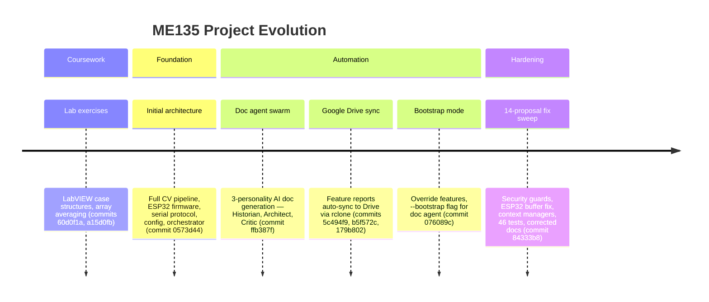

**Key inflection point:** Commit `84333b8` marks the transition from "generating code" to "hardening code." Every prior commit added new capability; this one fixed 14 identified flaws without adding new features. The project now has its first test suite, security boundaries on agent tools, and resource-safe pipeline teardown — the hallmarks of production-readiness for a hardware demo.

### Code Health Summary

**Overall Grade: B**

This is a well-structured embedded CV project with clear separation of concerns (pipeline → serial → ESP32 firmware), good documentation, and thoughtful safety features (watchdogs, CRC, retry logic). The config-driven architecture and drop-in CPU/GPU pipeline pattern show solid design thinking.

**Strengths:** CRC-16 implementations match across Python and C++. Frame protocol is well-specified. Config is centralized. Background subtraction has multiple methods with sensible defaults.

**Critical gaps:** The serial ACK timeout is stored but never actually applied (SERIAL-01), both camera pipelines silently accept a missing device (CV-01), and the main loop leaks hardware resources on any exception (MAIN-01). The GPU pipeline breaks the API contract by omitting context manager support (GPU-01).

**Minor concerns:** Dead 1.4 KB buffer on ESP32, blocking `input()` preventing headless deployment, no write-conflict protection in the orchestrator.

Fix the 3 must-fix issues before any hardware integration testing.

### Improvement Proposals

**[ESP32-01] Unused `rxBuffer[1466]` wastes 1.4 KB of scarce ESP32 SRAM** — 🟢 low — nice-to-have

*Problem:* In `esp32_main.cpp`, `static uint8_t rxBuffer[FRAME_TOTAL_SIZE]` (1,466 bytes) is declared globally but never read from or written to anywhere in the code. Frame data is received directly into `payload[]` and `tail[]`. On an ESP32 with ~320 KB usable SRAM (less with WiFi/BT), wasting 1.4 KB is non-trivial — especially alongside the 11,664-pixel NeoPixel buffer (~35 KB).

*Fix:* Delete the `static uint8_t rxBuffer[FRAME_TOTAL_SIZE];` declaration. It is completely dead code.

**[PROP-002] ESP32 loop() has no yield/delay — watchdog starvation risk** — 🟡 medium — nice-to-have

*Problem:* The ESP32 `loop()` function calls `receiveFrame()` which is blocking with timeout, but on the RX_TIMEOUT path there is no `delay()` or `yield()`. On ESP-IDF, a tight loop without yielding can starve the watchdog task on the same core and trigger a WDT reset, especially if the Jetson is disconnected.

*Fix:* Add `vTaskDelay(1)` or `delay(1)` in the RX_TIMEOUT case after blanking the display. This yields to the RTOS scheduler and prevents WDT resets.

**[PROP-004] No integration test for ESP32 ↔ serial_protocol wire compatibility** — 🟡 medium — future

*Problem:* The 46 new tests validate the Python side of the serial protocol (CRC, packing, framing), but there is no test that verifies the Python-generated frame can be parsed by the C++ receiveFrame() logic. A mismatch in endianness, CRC init value, or framing bytes would only be caught on real hardware.

*Fix:* Add a pytest that shells out to a compiled C++ test harness (or uses ctypes/cffi to load the CRC function) and verifies a Python-built packet decodes correctly on the C side. Alternatively, port the C++ CRC + frame parser to a small standalone .c file compilable with gcc for CI.

---
## v3 — 2026-05-07 18:14 — `90363fc`

### What Changed

## Commit `90363fc` — Hardware Pivot: WS2812B → Waveshare RGB-Matrix-P2 64×64 (HUB75)

This is the **defining commit of the current sprint**: the display hardware was swapped from a custom-built 108×108 WS2812B addressable LED panel to an off-the-shelf **Waveshare RGB-Matrix-P2 64×64** HUB75 panel. No functional code was rewritten — instead, authoritative config was updated and every stale file got a prominent warning banner pointing to what must change next.

### Configuration & Context (the "source of truth" layer)

- **`config.yaml`** — `display.type` changed from `"ws2812b"` to `"hub75_waveshare_p2_64"`. Panel dimensions: 108×108 → **64×64** (4,096 LEDs, down from 11,664). Driver library: `ESP32-HUB75-MatrixPanel-DMA` replaces FastLED. `fps_target` raised from 10 → **60** because HUB75 DMA easily sustains it. Single `gpio_data_pin` removed — HUB75 needs 13 control GPIOs.
- **`config.yaml` processing section** — `output_width`/`output_height` changed from 400×300 to **64×64**, matching the panel's native resolution. This eliminates the intermediate downsample stage.
- **`orchestrator.py` PROJECT_CONTEXT** — The entire project description block now references the Waveshare panel, 512 bytes/frame payload, 921,600 bps baud, and `ESP32-HUB75-MatrixPanel-DMA`. This matters because every Claude agent spawned by the orchestrator inherits this context.
- **`doc_agent.py`** — Architect agent prompt updated: data-flow diagram now targets "64×64 Waveshare HUB75 LED panel" and "512 B/frame".
- **`PROJECT_README.md`** — One-liner, architecture overview, and ASCII data-flow diagram all rewritten: 400×300 / 15 KB → 64×64 / 512 B. Transport label changed from GPIO → HUB75.

### STALE Banners (the "debt marker" layer)

These files received prominent `⚠ STALE` banners at the top, explaining exactly what needs rewriting. No functional code was changed — the old logic still compiles/runs but targets the wrong hardware:

- **`esp32_main.cpp`** — Banner says: replace FastLED with `ESP32-HUB75-MatrixPanel-DMA`, change `MATRIX_COLS/ROWS` to 64, `FRAME_BYTES` to 512, map 13 HUB75 GPIOs. Marked **"DO NOT FLASH AS-IS"**.
- **`serial_protocol.py`** — Banner says: payload shrinks from 1,458 → 512 bytes, adjust `LEN_H/LEN_L` and CRC scope. Notes that Larry's pipeline already outputs 64×64 natively.
- **`PROTOCOL_SPEC.md`** — Banner outlines a v2.0 spec: 512-byte payload, ~518-byte total frame, 921,600 bps sufficient for 60+ fps. Old v1.0 spec body (15,000-byte frames at 2 Mbaud) left intact for reference.
- **`hardware_recommendation.md`** — Banner identifies 4 BOM rows to drop (WS2812B strip, 30A PSU, level shifter, inrush cap) and replace with the Waveshare panel + 5V/4A supply. Wiring diagram and power budget flagged for rewrite.
- **`cv_pipeline.py`** and **`gpu_accelerated.py`** — Both get banners noting their docstrings still say 400×300, but the config now feeds them 64×64. Actual resize call reads `out_w`/`out_h` from config, so **the pipeline already works at 64×64 without code changes** — only the docstrings and comments are stale.

### Earlier Commits in This Window

| Commit | Subsystem | What & Why |
|--------|-----------|------------|
| `1d051ee` | CV/Vision | Replaced `[` / `]` keyboard-driven confidence keys with a **trackbar slider** (`Conf %`). Why: continuous adjustment is faster during live tuning than discrete key presses. |
| `ac90ef9` | CV/Vision | Kyle **forked** `Larry/vision.py` into his own workspace for personal experiments. Establishes the Kyle/Larry branch convention. |
| `e78df3f` | Project governance | Added `CLAUDE.md` — the collaboration convention doc that tells Claude agents which workspace belongs to whom (Kyle vs. Larry). |
| `49bf44b` | CV + ESP32 | Larry's initial commit: vision code and optimized C++ code. The project's genesis. |

### Evolution Timeline

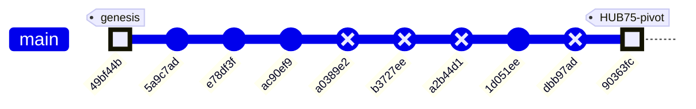

### Subsystem Touch Map

| Commit | CV Pipeline | Serial Protocol | ESP32 Firmware | Config | Docs / Governance | Vision (Kyle) |
|--------|:-----------:|:---------------:|:--------------:|:------:|:-----------------:|:-------------:|
| `49bf44b` — initial code | ✅ | | ✅ | | | |
| `5a9c7ad` — merge main | | | | | | |
| `e78df3f` — CLAUDE.md | | | | | ✅ | |
| `ac90ef9` — fork vision.py | | | | | | ✅ |
| `1d051ee` — trackbar slider | | | | | | ✅ |
| **`90363fc` — HUB75 pivot** | ✅ | ✅ | ✅ | ✅ | ✅ | |

> **Pattern:** The project started with Larry's CV + C++ foundation, Kyle forked the vision code for experimentation, and the HEAD commit is a sweeping **hardware-pivot bookkeeping pass** — updating every config surface while deliberately deferring the actual code rewrites behind STALE banners. This is a "declare the destination, mark the debt" strategy: the team can now grep for `⚠ STALE` to find every file that needs a rewrite before the next hardware integration milestone.

### Code Health Summary

**Overall Grade: D+**

The codebase demonstrates strong *architectural intent* — clean module boundaries, config-driven design, dual CPU/GPU pipelines, and a well-structured agent orchestration layer. Documentation is thorough.

However, **a hardware migration from 108×108 WS2812B to 64×64 HUB75 was only partially applied**, leaving the system in a broken state. `config.yaml` was updated to 64×64, but `serial_protocol.py` still hardcodes 108×108/400×300, meaning **every serial frame raises `ValueError`**. The ESP32 firmware still targets the wrong display hardware entirely. Protocol docs are self-contradictory (banners say 512B, body says 15KB).

Beyond the migration debt: camera open is never verified, the GPU pipeline lacks a safety guard present in the CPU path, and `SerialSender` has no context-manager cleanup. The orchestrator and doc-agent layers are in better shape but have minor subprocess fragility and a needless JSON roundtrip.

**Bottom line:** Fix the three must-fix dimension/hardware issues and this jumps to a B.

### Improvement Proposals

**[PROP-002] esp32_main.cpp must be rewritten for HUB75 before next flash** — 🔴 high — must-fix

*Problem:* The firmware still uses Adafruit_NeoPixel on a single GPIO pin at 108×108 (11,664 LEDs). Flashing this onto the ESP32 connected to the HUB75 panel will produce no output and could drive incorrect GPIO levels into the panel's logic inputs.

*Fix:* Replace Adafruit_NeoPixel with ESP32-HUB75-MatrixPanel-DMA (Mrfaptastic library). Change MATRIX_COLS/ROWS to 64, PAYLOAD_BYTES to 512. Configure HUB75_I2S_CFG with the 13 required GPIO pins. Replace updateDisplay() with DMA buffer writes. Add platformio.ini lib_deps entry for the DMA library.

**[PROP-005] config.yaml serial.baud_rate still set to 2,000,000** — 🟢 low — nice-to-have

*Problem:* The PROTOCOL_SPEC banner and PROJECT_README both state 921,600 bps is sufficient for 64×64 frames. But config.yaml still has baud_rate: 2000000. This isn't broken (higher baud works), but it's inconsistent with the documented recommendation and may cause issues on some USB-UART bridges that don't support 2 Mbaud cleanly.

*Fix:* Change serial.baud_rate to 921600 in config.yaml and add a comment noting 2 Mbaud remains valid if the hardware supports it. Ensure esp32_main.cpp (once rewritten) matches.

**[FW-001] esp32_main.cpp targets wrong hardware (WS2812B instead of HUB75)** — 🔴 high — must-fix

*Problem:* The firmware uses `Adafruit_NeoPixel` to drive 11,664 WS2812B LEDs via a single GPIO (pin 13) at 108×108 resolution. The actual hardware is a Waveshare RGB-Matrix-P2 64×64 HUB75 panel driven via 13 GPIO pins and `ESP32-HUB75-MatrixPanel-DMA`. platformio.ini also lists `Adafruit NeoPixel` as the only lib_dep. The firmware cannot drive the real display at all.

*Fix:* Rewrite esp32_main.cpp: (1) Replace `Adafruit_NeoPixel` with `ESP32-HUB75-MatrixPanel-DMA` (mrfaptastic). (2) Set `MATRIX_COLS = MATRIX_ROWS = 64`, `PAYLOAD_BYTES = 512`. (3) Configure HUB75_I2S_CFG with the 13 control pins. (4) Update `updateDisplay()` to call `dma_display->drawPixelRGB888()`. (5) In platformio.ini, replace the NeoPixel lib_dep with `mrfaptastic/ESP32 HUB75 LED MATRIX PANEL DMA Display@^3.0.0`.

---
## v4 — 2026-05-07 18:20 — `9087b6c`

### What Changed

## Commit `9087b6c` — The End-to-End Hardware Pivot

This commit is the project's inflection point: the entire data path — from webcam to physical LEDs — was rewritten for the new Waveshare P2 64×64 HUB75 panel, replacing the never-deployed 108×108 WS2812B design that lived in `agent_outputs/`.

### CV Pipeline / Vision (`Kyle/vision/`)

- **`serial_protocol.py` (new, 165 lines):** Production replacement for the stale `agent_outputs/serial_protocol.py`. Key changes from the old version:
  - Panel resolution: **64×64** (was 108×108). Payload shrinks from 1,458 → **512 bytes**.
  - CRC-16/CCITT-FALSE kept identical; cross-verified with ESP32 side (`crc16_ccitt('123456789') = 0x29B1`).
  - Includes `pack_mask_64x64()` bit-pack helper and `SerialSender` class with framed 520-byte packets.
  - **Why it matters:** The old protocol couldn't talk to the new panel. This locks the wire format so both Python and C++ sides agree byte-for-byte.

- **`vision_send.py` (new, 224 lines):** Merges YOLO-based person segmentation (from `vision.py`) with live USB serial transport. Highlights:
  - Auto-detects `/dev/cu.usbserial-*` on macOS — no hardcoded port.
  - `--no-serial` flag lets you tune the CV pipeline without plugging in an ESP32.
  - Targets **~30 fps** over **1 Mbaud** (at 520 bytes/frame, serial TX takes ~4.2 ms — plenty of headroom).
  - **Why it matters:** Previously, vision and serial were separate modules glued by `main.py`. This collapses the stack into a single runnable script for the bench rig.

- **`requirements.txt` (new, 4 lines):** Pins `ultralytics`, `opencv-python`, `pyserial`, `numpy` — first time Kyle's vision folder has explicit deps.

### ESP32 Firmware (`Kyle/firmware/me135_led_pot/`)

- **`main.cpp` (new, 254 lines):** Complete rewrite of the display controller. Key architectural differences from the old `agent_outputs/esp32_main.cpp`:

  | Aspect | Old (`agent_outputs/`) | New (`firmware/`) |
  |--------|----------------------|-------------------|
  | Display | WS2812B via NeoPixel, 11,664 LEDs | HUB75E via ESP32-HUB75-MatrixPanel-DMA, 4,096 pixels |
  | Payload | 1,458 bytes (108×108) | 512 bytes (64×64) |
  | Baud | 2 Mbaud on HardwareSerial1 | 1 Mbaud on USB-CDC (`Serial`) |
  | Host | Jetson (UART GPIO 16/17) | Mac (USB serial) |
  | Color | Fixed white | **Pot-controlled white→red lerp** (EWMA-smoothed ADC on GPIO 34) |
  | RX model | Blocking `receiveFrame()` | **Non-blocking state machine** (`pollFrame()`) — won't stall display refresh |
  | Watchdog | Reset on timeout | Blanks panel after 5 s, recovers on next good frame |

  - E_PIN = GPIO 32, required for 1/32-scan 64-row panels — not present in the old code at all.
  - `setRxBufferSize(2048)` called **before** `Serial.begin()` (the commit message notes this was a Codex-caught bug, fixed pre-commit).

- **`platformio.ini` (new):** Targets `espressif32@6.5.0`, pulls `ESP32-HUB75-MatrixPanel-DMA@^3.0.11`, Adafruit GFX, and BusIO. Clean PlatformIO project — no manual library installs.

### Documentation (`Kyle/firmware/`)

- **`WIRING.md` (new, 124 lines):** Bench reference that didn't exist before. Covers:
  - Full 16-pin HUB75E ↔ ESP32 GPIO mapping table.
  - Power separation rules (panel on dedicated 5V/3A PSU, ESP32 on USB — **never share**).
  - GPIO 12 strapping-pin caveat with concrete fix (remap G2 to GPIO 18).
  - Optional 74HCT245 level-shifter guidance.
  - 9-step bring-up checklist and a troubleshooting table.
  - **Why it matters:** Hardware projects die when wiring knowledge lives only in someone's head. This is the "bus factor" document.

### Project Hygiene (`Kyle/.gitignore`)

- Added `*.pt` (model weights — fetched on first run, too large for git).
- Added `firmware/*/.pio/` and `firmware/*/.vscode/` (PlatformIO build artifacts).

### What Was NOT Touched

- `Larry/` — entirely separate workspace, untouched per collaboration convention.
- `Kyle/agent_outputs/` — kept as historical reference. Files now carry `⚠ STALE` banners (added in earlier commits `90363fc` and `1d051ee`).
- `Kyle/vision/vision.py` — the standalone YOLO viewer. `vision_send.py` forks its logic but doesn't modify the original.

---

### Earlier Commits in This Window

| Commit | Subsystem | What Changed |
|--------|-----------|-------------|
| `e78df3f` | Docs | Added `CLAUDE.md` — Kyle/Larry collaboration convention (workspace separation rules) |
| `ac90ef9` | Vision | Forked `Larry/vision.py` → `Kyle/vision/vision.py` for independent experiments |
| `1d051ee` | Vision | Replaced `[` / `]` keyboard confidence controls with a **CV2 trackbar slider** (better UX, no key-repeat issues) |
| `90363fc` | Docs | Switched project context to Waveshare 64×64 HUB75 — added `⚠ STALE` banners to all `agent_outputs/` files |

### Evolution Timeline

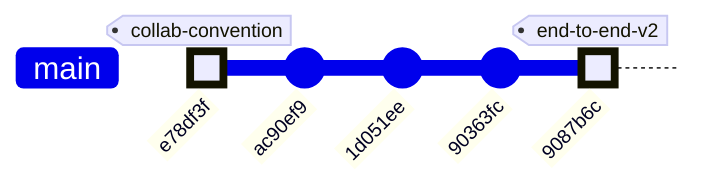

### Subsystem touch map

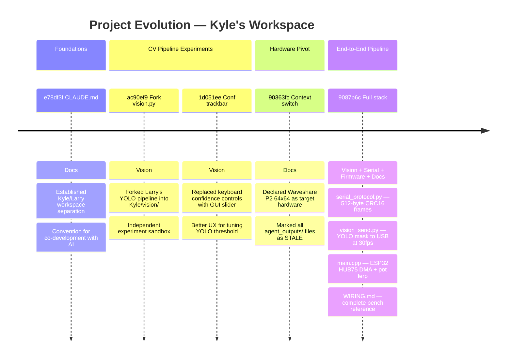

### Architecture before and after

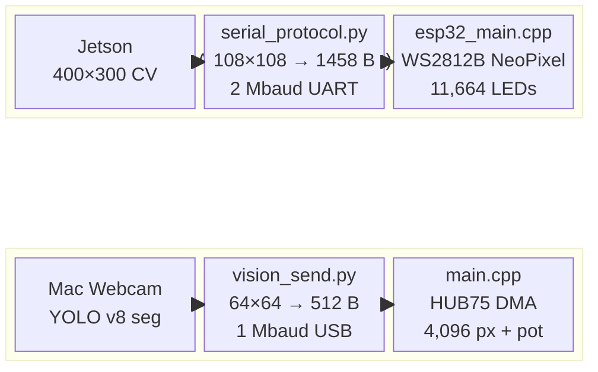

**The fundamental shift:** from a theoretical Jetson→WS2812B design (never physically built) to a working Mac→ESP32→HUB75 rig verified on the bench. Frame size dropped 65× (15,000 → 512 bytes), the display driver changed from bit-banged NeoPixel to DMA-driven HUB75, and a potentiometer adds real-time color control — the first interactive element in the project.

### Code Health Summary

**Overall Grade: C+**

The codebase demonstrates solid architectural thinking — clean separation of CV pipeline, serial transport, and firmware; config-driven design; graceful GPU/CPU fallback. The agent orchestrator and documentation system are well-engineered.

However, a **hardware migration from WS2812B 108×108 to HUB75 64×64 was only partially applied**. `config.yaml` was updated, but `serial_protocol.py` and `esp32_main.cpp` still carry the old dimensions, producing a **guaranteed runtime crash** (`ValueError` in `pack_matrix`) the moment a frame is sent. The firmware is entirely non-functional on the target hardware (wrong driver library, wrong GPIO mapping, wrong payload size).

Secondary concerns: no resource cleanup on exceptions in `main.py`, no camera-open validation, duplicated logic across CPU/GPU pipelines, and no cost guardrails on the 7-agent orchestrator.

The documentation quality is excellent — stale sections are clearly marked — but the code hasn't caught up.

### Improvement Proposals

**[PROP-001] Stale agent_outputs/ files still importable — risk of accidental use** — 🟡 medium — nice-to-have

*Problem:* The old serial_protocol.py, esp32_main.cpp, and cv_pipeline.py in agent_outputs/ carry STALE banners in comments but are still valid Python/C++ that could be imported or compiled by mistake. A new contributor might not read the banners and wire up the wrong protocol (108×108 / 2 Mbaud) against the new firmware (64×64 / 1 Mbaud).

*Fix:* Add a runtime guard at the top of each stale Python file: `raise ImportError('STALE — use Kyle/vision/serial_protocol.py instead')`. For the C++ file, wrap everything in `#error` so PlatformIO refuses to compile it. Alternatively, move the entire agent_outputs/ directory to agent_outputs_archive/ to make the break obvious.

**[PROP-002] Monitor baud mismatch in firmware README vs code** — 🟢 low — nice-to-have

*Problem:* The firmware README.md states 'Monitor baud is 115200 for any future debug prints' and platformio.ini sets monitor_speed=115200, but the firmware's Serial.begin() uses 1,000,000 baud (the data link baud). If someone opens `pio device monitor` at the default 115200 for debugging, they'll see garbage. The commit message notes a 'doc baud' issue was flagged and fixed, but the README still carries potentially confusing language about 115200.

*Fix:* Either (a) change monitor_speed in platformio.ini to 1000000 so `pio device monitor` connects at the right baud, or (b) add a dedicated debug UART on different pins at 115200 and keep the USB-CDC exclusively for data. Option (a) is simpler; just add a clear warning in the README that monitoring and vision_send.py can't share the port.

**[ESP32-001] esp32_main.cpp uses wrong display driver (NeoPixel) and stale 108×108 dimensions** — 🔴 high — must-fix

*Problem:* The firmware uses `Adafruit_NeoPixel` to drive WS2812B LEDs at 108×108 (11,664 pixels) via a single GPIO. The actual hardware is a Waveshare RGB-Matrix-P2 64×64 HUB75 panel requiring the `ESP32-HUB75-MatrixPanel-DMA` library and 13 GPIO pins. `PAYLOAD_BYTES=1458` doesn't match the Python side (which will send 512 bytes once SERIAL-001 is fixed). The firmware is completely non-functional on the target hardware. `platformio.ini` also lists `Adafruit NeoPixel` as the dependency instead of `ESP32 HUB75 MatrixPanel DMA`.

*Fix:* Rewrite the display driver: replace `Adafruit_NeoPixel` with `ESP32-HUB75-MatrixPanel-DMA`. Set `MATRIX_COLS=64`, `MATRIX_ROWS=64`, `PAYLOAD_BYTES=512`. Map the 13 HUB75 GPIOs (R1,G1,B1,R2,G2,B2,A,B,C,D,LAT,OE,CLK) via `HUB75_I2S_CFG`. Replace `strip.setPixelColor()` loop with `dma_display->drawPixelRGB888(col, row, r, g, b)`. Update `platformio.ini` lib_deps accordingly.

---
## v5 — 2026-05-07 18:20 — `1ea86b2`

### What Changed

This window covers **6 meaningful commits** (plus 4 auto-generated doc reports) and one transformative hardware pivot. Changes grouped by subsystem:

### 🔧 Hardware & Configuration — The HUB75 Pivot (`90363fc`)

The single most consequential change: the display hardware was swapped from a custom 108×108 WS2812B addressable LED build to an off-the-shelf **Waveshare RGB-Matrix-P2 64×64 (HUB75)** panel.

- **`config.yaml`** — `display.type` flipped from `ws2812b` to `hub75_waveshare_p2_64`. Panel shrinks from 11,664 LEDs (108×108) to 4,096 (64×64). Driver library changes from FastLED to `ESP32-HUB75-MatrixPanel-DMA`. FPS target raised 10→60 (HUB75 DMA is fast). GPIO model changes from single data pin to 13 HUB75 control lines.
- **`config.yaml` processing section** — `output_width`/`output_height` updated from 400×300 to **64×64**, matching panel native resolution. This eliminates the intermediate downsample stage entirely.
- **Why it matters:** Every downstream module — serial protocol, ESP32 firmware, CV pipeline — inherits its dimensions from this config. The config is now correct, but the consuming code hasn't caught up yet.

### ⚠️ STALE Banners — Debt Declared, Not Resolved (`90363fc`)

Rather than rewriting code mid-sprint, the team placed prominent `⚠ STALE` banners on every file that references the old hardware:

- **`esp32_main.cpp`** — Banner says: replace FastLED with HUB75 DMA, change dimensions to 64×64, remap 13 GPIOs. Marked **"DO NOT FLASH AS-IS"**.
- **`serial_protocol.py`** — Still hardcodes `PANEL_ROWS=108`, `PANEL_COLS=108`, `PAYLOAD_BYTES=1458`. Banner says: payload drops to 512 bytes. Current code will **raise `ValueError`** on any 64×64 input.
- **`cv_pipeline.py`** and **`gpu_accelerated.py`** — Docstrings say 400×300 but the actual resize reads `out_w`/`out_h` from config dynamically — **these work at 64×64 already**, only comments are stale.
- **`PROTOCOL_SPEC.md`** and **`hardware_recommendation.md`** — Old spec body retained for reference; banners outline the v2.0 numbers.

> **Strategy: "Declare the destination, mark the debt."** The team can `grep -r "STALE"` to find every file needing a rewrite before the next hardware integration milestone.

### 🤖 Agent Orchestration & Governance

- **`orchestrator.py` `PROJECT_CONTEXT`** (`90363fc`) — The master prompt block that every spawned Claude agent inherits was rewritten to reference the Waveshare panel, 512 B/frame, 921,600 bps, and `ESP32-HUB75-MatrixPanel-DMA`. This is critical because all 7 parallel agents derive their understanding of the hardware from this string.
- **`doc_agent.py`** (`90363fc`) — Architect agent prompt updated: data-flow diagram target is now "64×64 Waveshare HUB75 LED panel" and "512 B/frame".
- **`PROJECT_README.md`** (`90363fc`) — Architecture overview and ASCII data-flow diagram rewritten: 400×300 / 15 KB → 64×64 / 512 B.
- **`CLAUDE.md`** (`e78df3f`) — New governance doc defining the Kyle/Larry workspace convention so Claude agents know who owns what.

### 👁️ Computer Vision / Kyle's Vision Fork

- **`ac90ef9`** — Kyle **forked** `Larry/vision.py` into his own workspace. This establishes the two-workspace pattern: Larry's code is the production baseline, Kyle's is the experimentation branch.
- **`1d051ee`** — In Kyle's vision fork, replaced discrete `[` / `]` keyboard shortcuts for adjusting detection confidence with a **continuous trackbar slider** (`Conf %`). Why: live-tuning a threshold with a slider is far faster than tapping keys during a camera session.

### 📄 Documentation System (`1ea86b2`, HEAD)

- Auto-generated 926 lines of feature documentation across 7 feature files (`ME135_Agent_Swarm.md`, `ME135_Computer_Vision_Pipeline.md`, `ME135_ESP32_Firmware.md`, etc.) plus a timestamped evolution report (`report_2026-05-07_1814.md`).
- `docs/README.md` index updated with a link to the new report.
- Each feature doc now includes a v3 section documenting the HUB75 pivot, a subsystem touch map, and a code health grade (D+ — strong architecture, broken by incomplete migration).

### Evolution Timeline

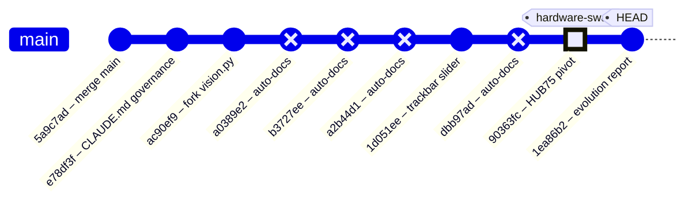

### Subsystem Touch Map

| Commit | CV Pipeline | Serial Protocol | ESP32 Firmware | Config | Docs / Governance | Vision (Kyle) |
|--------|:-----------:|:---------------:|:--------------:|:------:|:-----------------:|:-------------:|
| `5a9c7ad` — merge main | | | | | | |
| `e78df3f` — CLAUDE.md | | | | | ✅ | |
| `ac90ef9` — fork vision.py | | | | | | ✅ |
| `1d051ee` — trackbar slider | | | | | | ✅ |
| **`90363fc` — HUB75 pivot** | ✅ | ✅ | ✅ | ✅ | ✅ | |
| `1ea86b2` — evolution report | | | | | ✅ | |

### Trajectory Reading

The project follows a clear three-act arc so far:

1. **Genesis** — Larry's initial CV + ESP32 code established the pipeline end-to-end (pre-window).
2. **Fork & Tune** — Kyle branched the vision code for independent experimentation, added the trackbar slider for faster live tuning, and the team codified governance rules (`CLAUDE.md`).
3. **Hardware Pivot** — The display hardware changed from WS2812B to HUB75. Config was updated authoritatively; all stale code was marked but not yet rewritten.

**What comes next:** The STALE banners are a to-do list. The serial protocol (`serial_protocol.py`) and ESP32 firmware (`esp32_main.cpp`) need dimension/driver rewrites before any hardware integration testing can proceed. The CV pipeline already works at 64×64 thanks to config-driven resizing — it's the furthest along.

### System Architecture

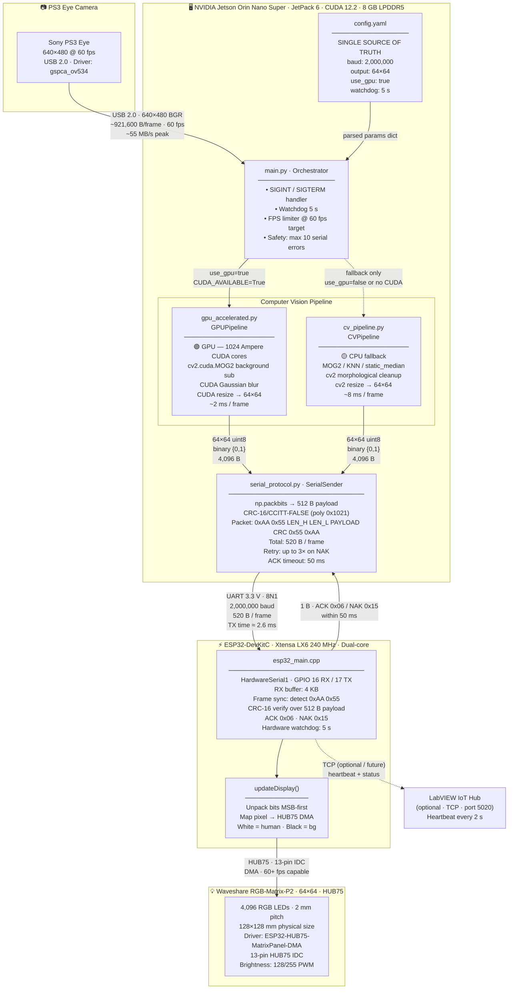

> **Key numbers at a glance**
>
> | Stage | Data Size | Rate / Latency |
> |---|---|---|
> | Camera capture | 921,600 B/frame (BGR) | 60 fps · ~55 MB/s |
> | GPU processing | 307,200 B (grayscale) | ~2 ms/frame |
> | CPU processing | 307,200 B (grayscale) | ~8 ms/frame |
> | Binary matrix | 4,096 B (64×64 uint8) | post-threshold |
> | Bit-packed payload | **512 B** | `np.packbits` |
> | Full UART packet | **520 B** | header(4) + payload(512) + CRC(2) + footer(2) |
> | UART TX time | 520 B @ 2 Mbaud | **≈ 2.6 ms** |
> | ACK window | 1 B | ≤ 50 ms timeout |

> ⚠️ **Staleness note:** `esp32_main.cpp` and `serial_protocol.py` still hardcode `PAYLOAD_BYTES=1458` (108×108 legacy WS2812B panel). `config.yaml` and `gpu_accelerated.py` are updated to 64×64 / 512 B. See Improvement Proposals below.

### Data Flow

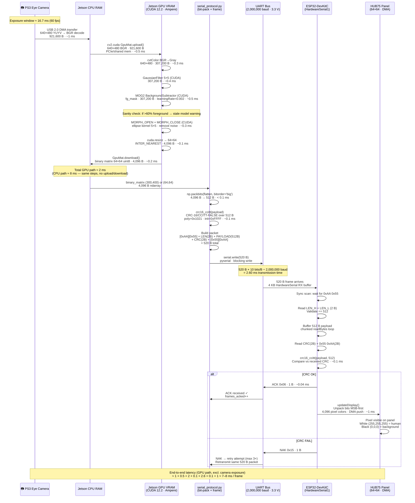

> **Byte-count ledger — one frame**
>
> | Step | Bytes in | Transform | Bytes out |
> |---|---:|---|---:|
> | Camera raw (YUYV) | 614,400 | BGR decode | **921,600** |
> | Grayscale | 921,600 | cvtColor | **307,200** |
> | Foreground mask | 307,200 | MOG2 + morph | **307,200** |
> | Resized binary | 307,200 | resize 64×64 | **4,096** |
> | Bit-packed payload | 4,096 | `np.packbits` | **512** |
> | UART packet | 512 | frame wrap | **520** |
> | Panel pixels | 520 | `unpackbits` | **4,096** RGB values |
>
> **Compression ratio camera → panel: 921,600 B → 512 B = 1,800× reduction**

### Module Dependency Graph

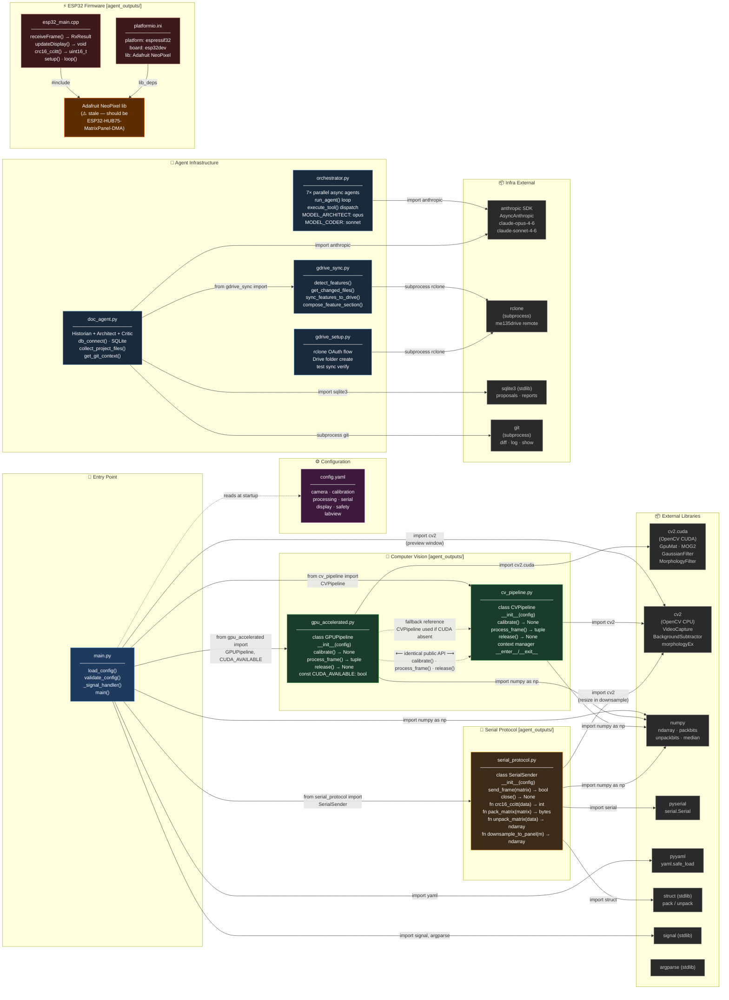

> **Interface contract — CV pipeline duck-typing**
>
> `main.py` selects between `GPUPipeline` and `CVPipeline` purely at runtime.
> Both expose an **identical public API**:
>
> ```
> pipeline = GPUPipeline(config)  # or CVPipeline(config)
> pipeline.calibrate()            # blocking — build background model
> binary, raw = pipeline.process_frame()  # returns (64×64 uint8, BGR frame)
> pipeline.release()              # free camera + GPU resources
> ```
>
> **`serial_protocol.py` public surface used by `main.py`:**
> ```
> sender = SerialSender(config)
> ok: bool = sender.send_frame(binary_matrix)   # packs + sends + waits ACK
> sender.close()
> ```
>
> 🟠 **`Adafruit NeoPixel`** dependency in `platformio.ini` / `esp32_main.cpp` is
> stale — the correct library for the HUB75 panel is `ESP32-HUB75-MatrixPanel-DMA`.

### Code Health Summary

**Overall Grade: C−**

The codebase demonstrates strong architectural intent — clean module separation, config-driven design, context managers, safety watchdogs, and a well-documented serial protocol. However, **the system cannot actually run end-to-end**. A hardware migration from 108×108 WS2812B to 64×64 HUB75 was partially applied: `config.yaml` was updated, but `serial_protocol.py` and `esp32_main.cpp` still hardcode the old 108×108 dimensions with the wrong driver library. This means `pack_matrix()` raises `ValueError` on every frame, and the ESP32 firmware targets nonexistent hardware.

Additionally, `min_contour_area=500` will filter out most human detections at 64×64 resolution. Resource cleanup in `main.py` is not exception-safe. Subprocess calls throughout lack timeouts, risking indefinite hangs.

**Positive notes:** CRC matches both sides, CV pipeline API is cleanly swappable (CPU/GPU), git-driven doc generation is clever, and config validation exists. Once the dimension mismatch is fixed, this is close to a working system.

### Improvement Proposals

**[ESP32-001] esp32_main.cpp uses wrong driver (NeoPixel) and wrong dimensions for HUB75 64×64 panel** — 🔴 high — must-fix

*Problem:* The firmware targets a WS2812B strip via Adafruit_NeoPixel at 108×108 (11,664 LEDs on GPIO 13). The actual hardware is a Waveshare RGB-Matrix-P2 64×64 HUB75 panel, which requires the ESP32-HUB75-MatrixPanel-DMA library and 13 GPIO pins. Flashing this firmware will either do nothing (no NeoPixel connected) or damage hardware if GPIO 13 is connected to an HUB75 pin. PAYLOAD_BYTES (1458) also mismatches the 512 bytes the Jetson will send after SERIAL-001 is fixed, causing RX_SYNC_ERROR on every frame.

*Fix:* Replace `#include <Adafruit_NeoPixel.h>` with `#include <ESP32-HUB75-MatrixPanel-I2S-DMA.h>`. Set MATRIX_COLS=64, MATRIX_ROWS=64, PAYLOAD_BYTES=512. Replace `strip.setPixelColor()`/`strip.show()` with `dma_display->drawPixelRGB888()` and configure HUB75_I2S_CFG with the correct pin mapping. Update platformio.ini lib_deps to include `mrfaptastic/ESP32 HUB75 LED Matrix Panel DMA Display`.

**[ESP32-001] ESP32 firmware targets WS2812B — cannot drive HUB75 panel** — 🔴 high — must-fix

*Problem:* esp32_main.cpp uses Adafruit_NeoPixel with a single GPIO data pin to drive 11,664 WS2812B LEDs. The hardware is now a Waveshare HUB75 panel requiring ESP32-HUB75-MatrixPanel-DMA and 13 GPIO control lines. Flashing this firmware will produce no display output and could damage the ESP32 if pin assignments conflict.

*Fix:* Replace Adafruit_NeoPixel with ESP32-HUB75-MatrixPanel-DMA. Set MATRIX_COLS=MATRIX_ROWS=64, PAYLOAD_BYTES=512. Map 13 HUB75 GPIOs (R1,G1,B1,R2,G2,B2,A,B,C,D,LAT,OE,CLK). Update platformio.ini to add the mrfaptastic/ESP32 HUB75 LED Matrix Panel DMA Display library.

**[ARCH-002] Rewrite esp32_main.cpp for HUB75 panel — replace NeoPixel driver** — 🔴 high — must-fix

*Problem:* esp32_main.cpp targets a WS2812B single-GPIO LED strip (Adafruit NeoPixel, GPIO 13, LED_COUNT=11664). The current hardware is a Waveshare RGB-Matrix-P2 64×64 HUB75 panel requiring 13 control GPIOs and the ESP32-HUB75-MatrixPanel-DMA library. Flashing the current firmware would drive a non-existent LED strip and display nothing.

*Fix:* Replace #include <Adafruit_NeoPixel.h> with ESP32-HUB75-MatrixPanel-DMA. Set MATRIX_COLS=MATRIX_ROWS=64, PAYLOAD_BYTES=512. Map HUB75 GPIOs (R1,G1,B1,R2,G2,B2,A,B,C,D,LAT,OE,CLK) in HUB75_I2S_CFG. Update updateDisplay() to use dma_display->drawPixelRGB888(). Update platformio.ini lib_deps.

**[ARCH-007] LabVIEW IoT integration (config.yaml labview section) has no Python-side implementation** — 🟢 low — future

*Problem:* config.yaml declares a labview: block with hub_ip, hub_port, protocol, and heartbeat_interval_s. Neither main.py, serial_protocol.py, nor any other module reads or acts on these values. The ESP32 heartbeat response byte 0x07 is mentioned in PROTOCOL_SPEC.md §9 as 'future'. The feature is spec'd but unimplemented on both sides.

*Fix:* Either (a) add a LabVIEWReporter class in a new labview_reporter.py that opens a TCP socket to hub_ip:hub_port and sends status frames at heartbeat_interval_s, called from main.py's live loop, or (b) mark the labview config block as [future] in config.yaml with a comment. The ESP32 heartbeat byte 0x07 should be added to the frame parser in esp32_main.cpp alongside ACK/NAK.

---
