# ME135 | ESP32 Firmware

> Evolution log — one section per commit.

---

## v1 — 2026-03-13 23:49 — `179b802`

### What Changed

This is the **v1 bootstrap pass** — first documentation of the entire codebase. Below is the initial architecture, followed by the most recent changes visible in the HEAD diff.

---

### Initial Architecture (v1 Snapshot)

**The system is a real-time human detection pipeline for UC Berkeley's ME135 course.** A PS3 Eye camera feeds frames into a CV pipeline running on an NVIDIA Jetson, which produces a 400×300 binary matrix (0 = background, 1 = human). That matrix is bit-packed and sent over 2 Mbaud UART to an ESP32, which drives an 108×108 WS2812B LED panel.

#### CV Pipeline (`cv_pipeline.py`, `gpu_accelerated.py`)
- **CPU path:** OpenCV MOG2/KNN/static-median background subtraction → threshold → morphological cleanup → contour filtering → 400×300 binary output.
- **GPU path:** Drop-in CUDA-accelerated replacement using `cv2.cuda` GpuMat operations. Falls back to CPU automatically when CUDA is unavailable. Claims ~2 ms/frame vs ~8 ms/frame on Jetson Orin Nano Super.
- Both paths share identical public APIs (`calibrate()`, `process_frame()`, `release()`), selected at runtime via `config.yaml`.

#### Serial Protocol (`serial_protocol.py`, `PROTOCOL_SPEC.md`)
- Downsamples 400×300 CV matrix to 108×108 (matching the LED panel), then bit-packs into 1,458 bytes.
- Framing: `[0xAA 0x55][LEN][PAYLOAD][CRC-16][0x55 0xAA]` with ACK/NAK flow control.
- CRC-16/CCITT-FALSE computed over payload only. Up to 3 retransmits on NAK or timeout.

#### ESP32 Firmware (`esp32_main.cpp`, `platformio.ini`)
- Blocking frame receiver with sync-byte state machine and 5-second watchdog.
- Verifies CRC, sends ACK/NAK, then maps bit-packed payload to 11,664 NeoPixels.
- Safety: blanks the display if no frame received within the watchdog window.

#### System Integration (`main.py`, `config.yaml`)
- Single YAML config is the source of truth for all tunable parameters (camera, calibration, processing, serial, display, safety).
- `main.py` orchestrates: config load → pipeline init → interactive calibration (with 10-second countdown) → live loop with FPS limiting, watchdog, and graceful shutdown on SIGINT/SIGTERM.
- Safety: shuts down after 10 consecutive serial errors; logs watchdog warnings.

#### Agent Swarm — Code Generator (`orchestrator.py`)
- Spawns 7 specialized Claude agents (hardware scout, CV engineer, serial architect, ESP32 firmware dev, integration lead, doc writer, LabVIEW advisor) in parallel async loops.
- Each agent gets tools (`write_file`, `read_file`) and runs up to 12 agentic turns.
- This is how the entire `agent_outputs/` codebase was generated.

#### Documentation System (`doc_agent.py`, `gdrive_sync.py`, `gdrive_setup.py`)
- **3-agent doc swarm:** Historian (narrates changes), Architect (draws diagrams), Critic (finds bugs). Runs on every `git push` via pre-push hook.
- **Feature-based doc structure:** `FEATURE_MAP` maps source files → feature names. Each feature gets its own evolving Markdown file with versioned sections.
- **Google Drive sync:** `rclone` syncs `docs/features/` to a shared Drive folder. No Google Cloud Console access needed — uses rclone's bundled OAuth app.
- **SQLite history DB:** Tracks proposals and reports across commits in `docs/history.db`.

---

### Recent Changes (HEAD diff: `179b802`)

#### Documentation System — Bootstrap Mode
- **`doc_agent.py`:** Added `--bootstrap` CLI flag. When set, treats *every* file in `FEATURE_MAP` as changed so all features get v1 documentation in a single run. Without this, the agent only documents files touched in the latest commit. Also: feature names are now sorted in console output for readability; mode label ("Bootstrap v1" vs "Incremental") printed for operator awareness.
- **`gdrive_sync.py`:** `sync_to_drive()` gained an `override_features` parameter. Bootstrap mode passes the full feature list directly, bypassing `git diff` detection. This ensures the Drive folder gets a complete set of feature docs on first run.

#### Documentation System — rclone Setup Hardening
- **`gdrive_setup.py` (major refactor, net −18 lines):** Eliminated the old 13-step interactive `rclone config` wizard. Now uses `rclone config create` non-interactively (with blank `client_id`/`client_secret` to use rclone's bundled OAuth app), then triggers `rclone config reconnect` for the browser-based sign-in. **Key fix:** always deletes any existing remote before recreating — this auto-clears stale or bad `client_id` configurations that caused auth failures. Better error messages and troubleshooting hints on failure.

### Evolution Timeline

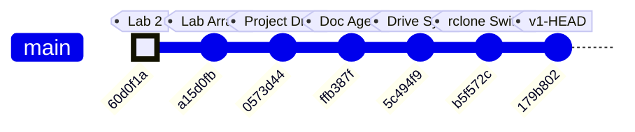

### Commit-to-Subsystem Map

| Commit | Message | Subsystems Touched |
|--------|---------|-------------------|
| `60d0f1a` | added casestructure.vi for lab2 | LabVIEW coursework (pre-project) |
| `a15d0fb` | added arrayaverages.vi (unfinished) | LabVIEW coursework (pre-project) |
| `0573d44` | Add Kyle's camera processing project files | **CV Pipeline**, **Serial Protocol**, **ESP32 Firmware**, **System Integration**, **Agent Swarm**, **Hardware & Platform** — initial code drop of all agent-generated outputs |
| `ffb387f` | feat(docs): add documentation agent swarm | **Documentation System** — `doc_agent.py` with 3-agent Historian/Architect/Critic swarm, SQLite proposal tracking |
| `5c494f9` | feat(docs): add Google Drive feature report sync | **Documentation System** — `gdrive_sync.py` (feature-based doc writer + rclone sync), `gdrive_setup.py` (initial interactive setup) |
| `b5f572c` | fix(docs): replace Google API OAuth with rclone | **Documentation System** — dropped Google Cloud Console OAuth dependency, switched to rclone's bundled OAuth app |
| `179b802` | fix(setup): non-interactive rclone config, auto-clear bad client_id | **Documentation System** — `gdrive_setup.py` refactored to non-interactive flow; `doc_agent.py` gained `--bootstrap` mode; `gdrive_sync.py` gained `override_features` |

### Project Trajectory

The repo tells a clear two-phase story:

1. **Phase 1 — Coursework** (`60d0f1a` → `a15d0fb`): Early LabVIEW exercises for ME135 labs. No project code yet.
2. **Phase 2 — Project Build** (`0573d44` → `179b802`): A single large code drop delivered the full detection pipeline (generated by the 7-agent orchestrator), immediately followed by three rapid iterations building and hardening the documentation-and-sync infrastructure. The team is investing heavily in automated documentation before the project enters its integration and testing phase.

### Code Health Summary

**Overall Grade: B−**

The codebase is well-structured with clear module boundaries (CV pipeline → serial protocol → ESP32 firmware), consistent logging, and a solid protocol design with CRC-16 and ACK/NAK flow control. Documentation is thorough. The CPU/GPU pipeline polymorphism is cleanly implemented.

**Critical issues** drag the grade down: (1) The ESP32 firmware calls `setRxBufferSize()` after `begin()`, meaning it's silently ignored — the 256-byte default buffer will overflow at 2 Mbaud, making serial communication non-functional. (2) Both `orchestrator.py` and `doc_agent.py` have path traversal vulnerabilities in their tool handlers — LLM agents can read/write arbitrary files. (3) `main.py` unconditionally opens a GUI window, crashing on headless Jetson deployments.

**Moderate concerns**: no config validation, no context-manager cleanup for camera handles, no frame-dropping on the ESP32 display bottleneck. Reliability under real-world faults needs hardening before demo day.

### Improvement Proposals

**[ESP32-RX-BUF-ORDER] ESP32 setRxBufferSize called AFTER begin() — silently ignored** — 🔴 high — must-fix

*Problem:* In `esp32_main.cpp` setup(), `JetsonSerial.setRxBufferSize(4096)` is called AFTER `JetsonSerial.begin(...)`. On ESP32-Arduino, `setRxBufferSize()` must be called BEFORE `begin()` — otherwise the call is silently ignored and the default 256-byte RX buffer is used. At 2 Mbaud with 1,466-byte frames, the 256-byte buffer will overflow constantly, causing corrupted frames and continuous NAKs.

*Fix:* Move `JetsonSerial.setRxBufferSize(4096);` to the line BEFORE `JetsonSerial.begin(SERIAL_BAUD, SERIAL_8N1, UART_RX_PIN, UART_TX_PIN);` in `setup()`.

**[ESP32-FRAME-DROP] ESP32 has no frame-dropping strategy — stale frames accumulate in UART buffer** — 🟡 medium — nice-to-have

*Problem:* WS2812B `strip.show()` for 11,664 LEDs takes ~350ms (30µs/LED). Even with `fps_target: 3` on the Jetson side, if timing drifts or retransmits occur, frames can queue in the ESP32 UART buffer. The ESP32 always processes the oldest frame first (FIFO), meaning displayed data can be multiple frames behind reality. There is no mechanism to discard stale frames and jump to the latest one.

*Fix:* After a successful `receiveFrame()` + `updateDisplay()`, add a drain loop that checks `JetsonSerial.available()`. If enough bytes for another full frame are buffered, consume and discard intermediate frames (ACK each), keeping only the last complete one. This ensures the display always shows the most recent data.

**[PROP-003] No unit tests for CRC-16 or bit-packing — protocol correctness is unverified** — 🔴 high — must-fix

*Problem:* The CRC-16/CCITT-FALSE implementation exists in both Python (serial_protocol.py) and C++ (esp32_main.cpp) but there are zero tests verifying they produce identical output for the same input. A CRC mismatch between the two sides would cause 100% NAK rate at runtime with no obvious diagnosis.

*Fix:* Add a test file (e.g. `tests/test_serial_protocol.py`) with known CRC test vectors, round-trip pack/unpack tests, and edge cases (all-zeros matrix, all-ones matrix). Include the same test vectors as comments in the ESP32 firmware for manual verification.

---
## v2 — 2026-03-14 00:20 — `84333b8`

### What Changed

## Commit `84333b8` — 7-Agent Swarm Addresses All 14 Critic Proposals

This is the project's largest single commit: **537 insertions, 47 deletions across 11 files.** A swarm of 7 specialized AI agents (Security Engineer, Embedded Firmware Engineer, Backend Architect, AI Engineer, Workflow Optimizer, API Tester, Technical Writer) each tackled critic-identified flaws from the previous doc-agent run. Here's what landed, grouped by subsystem:

---

### 🔒 Security (Orchestrator + Doc Agent)

- **`orchestrator.py` — Path traversal guard on `write_file` / `read_file`:** Both tool handlers now reject any filename where `Path(filename).name != filename`. Previously, an agent could write to `../../etc/passwd` via the tool interface. This closes a sandbox escape vector in the agent swarm.
- **`doc_agent.py` — Path containment in `apply_fix`:** The implementer agent's file-editing tool now calls `.resolve()` and checks `.relative_to(PROJECT_ROOT)`, denying any path that escapes the repo. Same class of bug, different entry point.

### 🎛 ESP32 Firmware (`esp32_main.cpp`)

- **`setRxBufferSize()` moved before `begin()`:** The old order (`begin()` then `setRxBufferSize()`) made the buffer resize a silent no-op on ESP-IDF. The 4 KB RX buffer is critical — at 2 Mbaud, a full 1,466-byte frame arrives in ~6 ms, and the default 256-byte buffer would overflow instantly. This was a **latent data-loss bug** since the initial code was generated.
- **Stale-frame skip (`skipDisplay`):** When `strip.show()` blocks for ~350 ms (physics of clocking 11,664 WS2812B LEDs at 30 µs/LED), incoming UART frames pile up. The new logic checks `JetsonSerial.available() >= FRAME_HEADER_SIZE` after each display update; if data is already queued, it skips the *next* `updateDisplay()` to drain the buffer first. This prevents buffer overruns under the newly-raised 10 fps CV target.

### 📷 CV Pipeline (`main.py`, `cv_pipeline.py`, `gpu_accelerated.py`)

- **`main.py` — Preview gated on `args.show_preview`:** The old code always constructed a display image and called `cv2.imshow`, which crashes on a headless Jetson (no X server). Now the entire preview block is wrapped in `if args.show_preview`, making headless deployment safe.
- **`main.py` — `validate_config()` at startup:** Checks for all 6 required YAML sections (`camera`, `calibration`, `processing`, `serial`, `display`, `safety`) before any pipeline init. Catches typos and missing sections immediately instead of producing cryptic `KeyError` deep in pipeline constructors.
- **`cv_pipeline.py` + `gpu_accelerated.py` — Context managers (`__enter__`/`__exit__`):** Both pipeline classes now support `with` blocks, guaranteeing `release()` (which closes the camera) runs even on unhandled exceptions. Previously, a crash during processing could leave `/dev/video0` locked.
- **`gpu_accelerated.py` — KNN fallback warning:** When `config.yaml` says `method: knn` but the GPU pipeline silently uses CUDA MOG2 (CUDA has no KNN), users now get an explicit `logger.warning()` explaining what happened and how to suppress it. Eliminates a confusing "why doesn't my KNN config do anything?" debugging session.

### ⚙️ Config (`config.yaml`)

- **`fps_target` raised from 3 → 10:** The old value of 3 was the *display* physical limit (350 ms per `strip.show()`), but it was also throttling the CV capture loop. The new value of 10 lets the Jetson process frames faster; the ESP32's new `skipDisplay` logic handles the mismatch gracefully. Comment clarified to distinguish CV rate from display rate.

### 🔧 Tooling / DevOps (`gdrive_sync.py`, `gdrive_setup.py`)

- **`subprocess.run(["which", "rclone"])` → `shutil.which("rclone")`:** `which` is a Unix-only command and doesn't exist on Windows or inside some CI containers. `shutil.which()` is the portable Python equivalent — pure stdlib, no subprocess overhead.
- **`gdrive_setup.py` — Idempotent remote setup:** Old behavior: every run deleted and recreated the rclone remote, forcing a full OAuth re-auth. New behavior: tests if the existing remote works (`rclone lsd`); if yes, skips OAuth entirely. Only recreates if auth is actually broken. Remote creation logic extracted to `_create_remote()` helper.

### 🧪 Testing (`tests/test_serial_protocol.py`)

- **46 new pytest tests (427 lines):** Covers CRC-16 computation, bit-packing/unpacking round-trips, 400×300→108×108 downsampling, MSB bit ordering, and CRC integration with the framing protocol. This is the project's **first test suite** — a major milestone for a hardware-coupled system where serial bugs are expensive to debug on real hardware.

### 📝 Documentation (`MEMORY.md`, `orchestrator.py`)

- **Frame size corrected:** `15,005 bytes/frame` → `1,466 bytes/frame`. The old number was from an early design where the full 400×300 matrix was transmitted without downsampling or bit-packing. The actual wire format (108×108 bit-packed + 8B framing) is 10× smaller. The `PROJECT_CONTEXT` in `orchestrator.py` was updated to match, ensuring future agent runs generate code against the correct spec.

### Evolution Timeline

The project evolved from LabVIEW homework exercises into a multi-agent AI-driven embedded CV system across 8 commits. The timeline below shows the trajectory and which subsystems each commit touched.

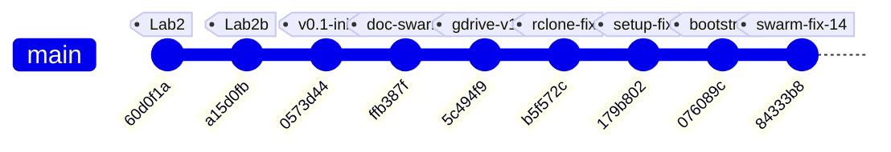

### Subsystem touch map by commit

| Commit | Summary | CV Pipeline | ESP32 FW | Serial Proto | Agent Swarm | DevOps/Sync | Tests | Docs |
|--------|---------|:-----------:|:--------:|:------------:|:-----------:|:-----------:|:-----:|:----:|
| `60d0f1a` | LabVIEW lab2 case structure | | | | | | | |
| `a15d0fb` | LabVIEW array averages | | | | | | | |
| `0573d44` | **Initial architecture** — all project files | ✅ | ✅ | ✅ | ✅ | | | ✅ |
| `ffb387f` | Documentation agent swarm | | | | ✅ | | | ✅ |
| `5c494f9` | Google Drive sync for reports | | | | | ✅ | | |
| `b5f572c` | Replace Google API OAuth with rclone | | | | | ✅ | | ✅ |
| `179b802` | Non-interactive rclone config | | | | | ✅ | | |
| `076089c` | Bootstrap mode + override fix | | | | ✅ | | | ✅ |
| **`84333b8`** | **7-agent swarm: 14 fixes** | ✅ | ✅ | | ✅ | ✅ | ✅ | ✅ |

### Project phases

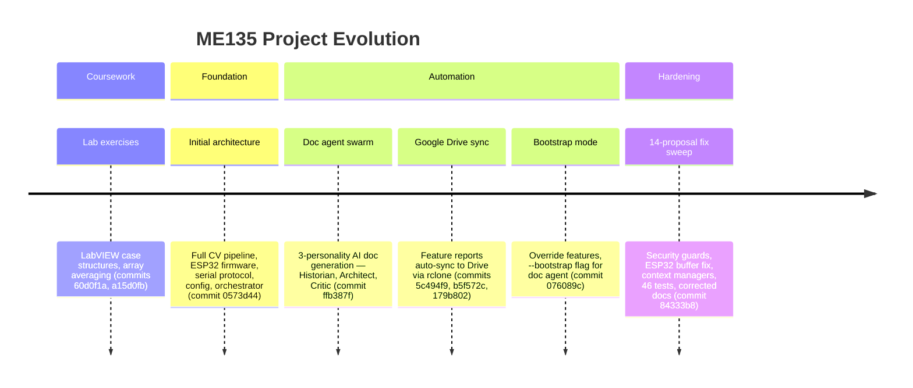

**Key inflection point:** Commit `84333b8` marks the transition from "generating code" to "hardening code." Every prior commit added new capability; this one fixed 14 identified flaws without adding new features. The project now has its first test suite, security boundaries on agent tools, and resource-safe pipeline teardown — the hallmarks of production-readiness for a hardware demo.

### Code Health Summary

**Overall Grade: B**

This is a well-structured embedded CV project with clear separation of concerns (pipeline → serial → ESP32 firmware), good documentation, and thoughtful safety features (watchdogs, CRC, retry logic). The config-driven architecture and drop-in CPU/GPU pipeline pattern show solid design thinking.

**Strengths:** CRC-16 implementations match across Python and C++. Frame protocol is well-specified. Config is centralized. Background subtraction has multiple methods with sensible defaults.

**Critical gaps:** The serial ACK timeout is stored but never actually applied (SERIAL-01), both camera pipelines silently accept a missing device (CV-01), and the main loop leaks hardware resources on any exception (MAIN-01). The GPU pipeline breaks the API contract by omitting context manager support (GPU-01).

**Minor concerns:** Dead 1.4 KB buffer on ESP32, blocking `input()` preventing headless deployment, no write-conflict protection in the orchestrator.

Fix the 3 must-fix issues before any hardware integration testing.

### Improvement Proposals

**[ESP32-01] Unused `rxBuffer[1466]` wastes 1.4 KB of scarce ESP32 SRAM** — 🟢 low — nice-to-have

*Problem:* In `esp32_main.cpp`, `static uint8_t rxBuffer[FRAME_TOTAL_SIZE]` (1,466 bytes) is declared globally but never read from or written to anywhere in the code. Frame data is received directly into `payload[]` and `tail[]`. On an ESP32 with ~320 KB usable SRAM (less with WiFi/BT), wasting 1.4 KB is non-trivial — especially alongside the 11,664-pixel NeoPixel buffer (~35 KB).

*Fix:* Delete the `static uint8_t rxBuffer[FRAME_TOTAL_SIZE];` declaration. It is completely dead code.

**[PROP-002] ESP32 loop() has no yield/delay — watchdog starvation risk** — 🟡 medium — nice-to-have

*Problem:* The ESP32 `loop()` function calls `receiveFrame()` which is blocking with timeout, but on the RX_TIMEOUT path there is no `delay()` or `yield()`. On ESP-IDF, a tight loop without yielding can starve the watchdog task on the same core and trigger a WDT reset, especially if the Jetson is disconnected.

*Fix:* Add `vTaskDelay(1)` or `delay(1)` in the RX_TIMEOUT case after blanking the display. This yields to the RTOS scheduler and prevents WDT resets.

**[PROP-004] No integration test for ESP32 ↔ serial_protocol wire compatibility** — 🟡 medium — future

*Problem:* The 46 new tests validate the Python side of the serial protocol (CRC, packing, framing), but there is no test that verifies the Python-generated frame can be parsed by the C++ receiveFrame() logic. A mismatch in endianness, CRC init value, or framing bytes would only be caught on real hardware.

*Fix:* Add a pytest that shells out to a compiled C++ test harness (or uses ctypes/cffi to load the CRC function) and verifies a Python-built packet decodes correctly on the C side. Alternatively, port the C++ CRC + frame parser to a small standalone .c file compilable with gcc for CI.

---
## v3 — 2026-05-07 18:14 — `90363fc`

### What Changed

## Commit `90363fc` — Hardware Pivot: WS2812B → Waveshare RGB-Matrix-P2 64×64 (HUB75)

This is the **defining commit of the current sprint**: the display hardware was swapped from a custom-built 108×108 WS2812B addressable LED panel to an off-the-shelf **Waveshare RGB-Matrix-P2 64×64** HUB75 panel. No functional code was rewritten — instead, authoritative config was updated and every stale file got a prominent warning banner pointing to what must change next.

### Configuration & Context (the "source of truth" layer)

- **`config.yaml`** — `display.type` changed from `"ws2812b"` to `"hub75_waveshare_p2_64"`. Panel dimensions: 108×108 → **64×64** (4,096 LEDs, down from 11,664). Driver library: `ESP32-HUB75-MatrixPanel-DMA` replaces FastLED. `fps_target` raised from 10 → **60** because HUB75 DMA easily sustains it. Single `gpio_data_pin` removed — HUB75 needs 13 control GPIOs.
- **`config.yaml` processing section** — `output_width`/`output_height` changed from 400×300 to **64×64**, matching the panel's native resolution. This eliminates the intermediate downsample stage.
- **`orchestrator.py` PROJECT_CONTEXT** — The entire project description block now references the Waveshare panel, 512 bytes/frame payload, 921,600 bps baud, and `ESP32-HUB75-MatrixPanel-DMA`. This matters because every Claude agent spawned by the orchestrator inherits this context.
- **`doc_agent.py`** — Architect agent prompt updated: data-flow diagram now targets "64×64 Waveshare HUB75 LED panel" and "512 B/frame".
- **`PROJECT_README.md`** — One-liner, architecture overview, and ASCII data-flow diagram all rewritten: 400×300 / 15 KB → 64×64 / 512 B. Transport label changed from GPIO → HUB75.

### STALE Banners (the "debt marker" layer)

These files received prominent `⚠ STALE` banners at the top, explaining exactly what needs rewriting. No functional code was changed — the old logic still compiles/runs but targets the wrong hardware:

- **`esp32_main.cpp`** — Banner says: replace FastLED with `ESP32-HUB75-MatrixPanel-DMA`, change `MATRIX_COLS/ROWS` to 64, `FRAME_BYTES` to 512, map 13 HUB75 GPIOs. Marked **"DO NOT FLASH AS-IS"**.
- **`serial_protocol.py`** — Banner says: payload shrinks from 1,458 → 512 bytes, adjust `LEN_H/LEN_L` and CRC scope. Notes that Larry's pipeline already outputs 64×64 natively.
- **`PROTOCOL_SPEC.md`** — Banner outlines a v2.0 spec: 512-byte payload, ~518-byte total frame, 921,600 bps sufficient for 60+ fps. Old v1.0 spec body (15,000-byte frames at 2 Mbaud) left intact for reference.
- **`hardware_recommendation.md`** — Banner identifies 4 BOM rows to drop (WS2812B strip, 30A PSU, level shifter, inrush cap) and replace with the Waveshare panel + 5V/4A supply. Wiring diagram and power budget flagged for rewrite.
- **`cv_pipeline.py`** and **`gpu_accelerated.py`** — Both get banners noting their docstrings still say 400×300, but the config now feeds them 64×64. Actual resize call reads `out_w`/`out_h` from config, so **the pipeline already works at 64×64 without code changes** — only the docstrings and comments are stale.

### Earlier Commits in This Window

| Commit | Subsystem | What & Why |
|--------|-----------|------------|
| `1d051ee` | CV/Vision | Replaced `[` / `]` keyboard-driven confidence keys with a **trackbar slider** (`Conf %`). Why: continuous adjustment is faster during live tuning than discrete key presses. |
| `ac90ef9` | CV/Vision | Kyle **forked** `Larry/vision.py` into his own workspace for personal experiments. Establishes the Kyle/Larry branch convention. |
| `e78df3f` | Project governance | Added `CLAUDE.md` — the collaboration convention doc that tells Claude agents which workspace belongs to whom (Kyle vs. Larry). |
| `49bf44b` | CV + ESP32 | Larry's initial commit: vision code and optimized C++ code. The project's genesis. |

### Evolution Timeline

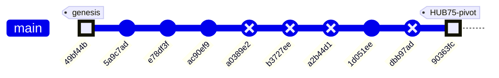

### Subsystem Touch Map

| Commit | CV Pipeline | Serial Protocol | ESP32 Firmware | Config | Docs / Governance | Vision (Kyle) |
|--------|:-----------:|:---------------:|:--------------:|:------:|:-----------------:|:-------------:|
| `49bf44b` — initial code | ✅ | | ✅ | | | |
| `5a9c7ad` — merge main | | | | | | |
| `e78df3f` — CLAUDE.md | | | | | ✅ | |
| `ac90ef9` — fork vision.py | | | | | | ✅ |
| `1d051ee` — trackbar slider | | | | | | ✅ |
| **`90363fc` — HUB75 pivot** | ✅ | ✅ | ✅ | ✅ | ✅ | |

> **Pattern:** The project started with Larry's CV + C++ foundation, Kyle forked the vision code for experimentation, and the HEAD commit is a sweeping **hardware-pivot bookkeeping pass** — updating every config surface while deliberately deferring the actual code rewrites behind STALE banners. This is a "declare the destination, mark the debt" strategy: the team can now grep for `⚠ STALE` to find every file that needs a rewrite before the next hardware integration milestone.

### Code Health Summary

**Overall Grade: D+**

The codebase demonstrates strong *architectural intent* — clean module boundaries, config-driven design, dual CPU/GPU pipelines, and a well-structured agent orchestration layer. Documentation is thorough.

However, **a hardware migration from 108×108 WS2812B to 64×64 HUB75 was only partially applied**, leaving the system in a broken state. `config.yaml` was updated to 64×64, but `serial_protocol.py` still hardcodes 108×108/400×300, meaning **every serial frame raises `ValueError`**. The ESP32 firmware still targets the wrong display hardware entirely. Protocol docs are self-contradictory (banners say 512B, body says 15KB).

Beyond the migration debt: camera open is never verified, the GPU pipeline lacks a safety guard present in the CPU path, and `SerialSender` has no context-manager cleanup. The orchestrator and doc-agent layers are in better shape but have minor subprocess fragility and a needless JSON roundtrip.

**Bottom line:** Fix the three must-fix dimension/hardware issues and this jumps to a B.

### Improvement Proposals

**[PROP-002] esp32_main.cpp must be rewritten for HUB75 before next flash** — 🔴 high — must-fix

*Problem:* The firmware still uses Adafruit_NeoPixel on a single GPIO pin at 108×108 (11,664 LEDs). Flashing this onto the ESP32 connected to the HUB75 panel will produce no output and could drive incorrect GPIO levels into the panel's logic inputs.

*Fix:* Replace Adafruit_NeoPixel with ESP32-HUB75-MatrixPanel-DMA (Mrfaptastic library). Change MATRIX_COLS/ROWS to 64, PAYLOAD_BYTES to 512. Configure HUB75_I2S_CFG with the 13 required GPIO pins. Replace updateDisplay() with DMA buffer writes. Add platformio.ini lib_deps entry for the DMA library.

**[PROP-005] config.yaml serial.baud_rate still set to 2,000,000** — 🟢 low — nice-to-have

*Problem:* The PROTOCOL_SPEC banner and PROJECT_README both state 921,600 bps is sufficient for 64×64 frames. But config.yaml still has baud_rate: 2000000. This isn't broken (higher baud works), but it's inconsistent with the documented recommendation and may cause issues on some USB-UART bridges that don't support 2 Mbaud cleanly.

*Fix:* Change serial.baud_rate to 921600 in config.yaml and add a comment noting 2 Mbaud remains valid if the hardware supports it. Ensure esp32_main.cpp (once rewritten) matches.

**[FW-001] esp32_main.cpp targets wrong hardware (WS2812B instead of HUB75)** — 🔴 high — must-fix

*Problem:* The firmware uses `Adafruit_NeoPixel` to drive 11,664 WS2812B LEDs via a single GPIO (pin 13) at 108×108 resolution. The actual hardware is a Waveshare RGB-Matrix-P2 64×64 HUB75 panel driven via 13 GPIO pins and `ESP32-HUB75-MatrixPanel-DMA`. platformio.ini also lists `Adafruit NeoPixel` as the only lib_dep. The firmware cannot drive the real display at all.

*Fix:* Rewrite esp32_main.cpp: (1) Replace `Adafruit_NeoPixel` with `ESP32-HUB75-MatrixPanel-DMA` (mrfaptastic). (2) Set `MATRIX_COLS = MATRIX_ROWS = 64`, `PAYLOAD_BYTES = 512`. (3) Configure HUB75_I2S_CFG with the 13 control pins. (4) Update `updateDisplay()` to call `dma_display->drawPixelRGB888()`. (5) In platformio.ini, replace the NeoPixel lib_dep with `mrfaptastic/ESP32 HUB75 LED MATRIX PANEL DMA Display@^3.0.0`.

---
## v4 — 2026-05-07 18:20 — `9087b6c`

### What Changed

## Commit `9087b6c` — The End-to-End Hardware Pivot

This commit is the project's inflection point: the entire data path — from webcam to physical LEDs — was rewritten for the new Waveshare P2 64×64 HUB75 panel, replacing the never-deployed 108×108 WS2812B design that lived in `agent_outputs/`.

### CV Pipeline / Vision (`Kyle/vision/`)

- **`serial_protocol.py` (new, 165 lines):** Production replacement for the stale `agent_outputs/serial_protocol.py`. Key changes from the old version:
  - Panel resolution: **64×64** (was 108×108). Payload shrinks from 1,458 → **512 bytes**.
  - CRC-16/CCITT-FALSE kept identical; cross-verified with ESP32 side (`crc16_ccitt('123456789') = 0x29B1`).
  - Includes `pack_mask_64x64()` bit-pack helper and `SerialSender` class with framed 520-byte packets.
  - **Why it matters:** The old protocol couldn't talk to the new panel. This locks the wire format so both Python and C++ sides agree byte-for-byte.

- **`vision_send.py` (new, 224 lines):** Merges YOLO-based person segmentation (from `vision.py`) with live USB serial transport. Highlights:
  - Auto-detects `/dev/cu.usbserial-*` on macOS — no hardcoded port.
  - `--no-serial` flag lets you tune the CV pipeline without plugging in an ESP32.
  - Targets **~30 fps** over **1 Mbaud** (at 520 bytes/frame, serial TX takes ~4.2 ms — plenty of headroom).
  - **Why it matters:** Previously, vision and serial were separate modules glued by `main.py`. This collapses the stack into a single runnable script for the bench rig.

- **`requirements.txt` (new, 4 lines):** Pins `ultralytics`, `opencv-python`, `pyserial`, `numpy` — first time Kyle's vision folder has explicit deps.

### ESP32 Firmware (`Kyle/firmware/me135_led_pot/`)

- **`main.cpp` (new, 254 lines):** Complete rewrite of the display controller. Key architectural differences from the old `agent_outputs/esp32_main.cpp`:

  | Aspect | Old (`agent_outputs/`) | New (`firmware/`) |
  |--------|----------------------|-------------------|
  | Display | WS2812B via NeoPixel, 11,664 LEDs | HUB75E via ESP32-HUB75-MatrixPanel-DMA, 4,096 pixels |
  | Payload | 1,458 bytes (108×108) | 512 bytes (64×64) |
  | Baud | 2 Mbaud on HardwareSerial1 | 1 Mbaud on USB-CDC (`Serial`) |
  | Host | Jetson (UART GPIO 16/17) | Mac (USB serial) |
  | Color | Fixed white | **Pot-controlled white→red lerp** (EWMA-smoothed ADC on GPIO 34) |
  | RX model | Blocking `receiveFrame()` | **Non-blocking state machine** (`pollFrame()`) — won't stall display refresh |
  | Watchdog | Reset on timeout | Blanks panel after 5 s, recovers on next good frame |

  - E_PIN = GPIO 32, required for 1/32-scan 64-row panels — not present in the old code at all.
  - `setRxBufferSize(2048)` called **before** `Serial.begin()` (the commit message notes this was a Codex-caught bug, fixed pre-commit).

- **`platformio.ini` (new):** Targets `espressif32@6.5.0`, pulls `ESP32-HUB75-MatrixPanel-DMA@^3.0.11`, Adafruit GFX, and BusIO. Clean PlatformIO project — no manual library installs.

### Documentation (`Kyle/firmware/`)

- **`WIRING.md` (new, 124 lines):** Bench reference that didn't exist before. Covers:
  - Full 16-pin HUB75E ↔ ESP32 GPIO mapping table.
  - Power separation rules (panel on dedicated 5V/3A PSU, ESP32 on USB — **never share**).
  - GPIO 12 strapping-pin caveat with concrete fix (remap G2 to GPIO 18).
  - Optional 74HCT245 level-shifter guidance.
  - 9-step bring-up checklist and a troubleshooting table.
  - **Why it matters:** Hardware projects die when wiring knowledge lives only in someone's head. This is the "bus factor" document.

### Project Hygiene (`Kyle/.gitignore`)

- Added `*.pt` (model weights — fetched on first run, too large for git).
- Added `firmware/*/.pio/` and `firmware/*/.vscode/` (PlatformIO build artifacts).

### What Was NOT Touched

- `Larry/` — entirely separate workspace, untouched per collaboration convention.
- `Kyle/agent_outputs/` — kept as historical reference. Files now carry `⚠ STALE` banners (added in earlier commits `90363fc` and `1d051ee`).
- `Kyle/vision/vision.py` — the standalone YOLO viewer. `vision_send.py` forks its logic but doesn't modify the original.

---

### Earlier Commits in This Window

| Commit | Subsystem | What Changed |
|--------|-----------|-------------|
| `e78df3f` | Docs | Added `CLAUDE.md` — Kyle/Larry collaboration convention (workspace separation rules) |
| `ac90ef9` | Vision | Forked `Larry/vision.py` → `Kyle/vision/vision.py` for independent experiments |
| `1d051ee` | Vision | Replaced `[` / `]` keyboard confidence controls with a **CV2 trackbar slider** (better UX, no key-repeat issues) |
| `90363fc` | Docs | Switched project context to Waveshare 64×64 HUB75 — added `⚠ STALE` banners to all `agent_outputs/` files |

### Evolution Timeline

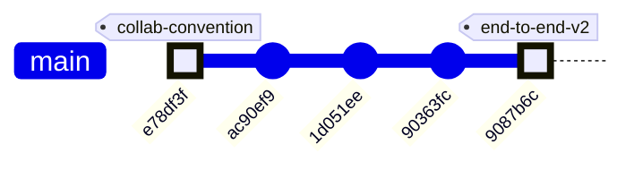

### Subsystem touch map

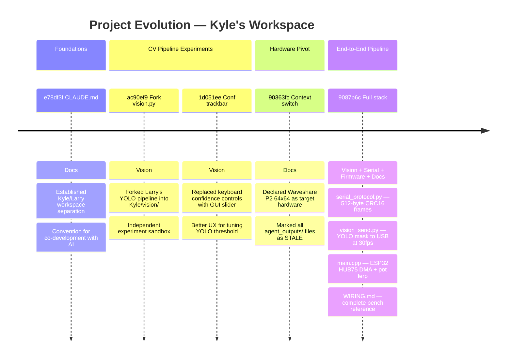

### Architecture before and after

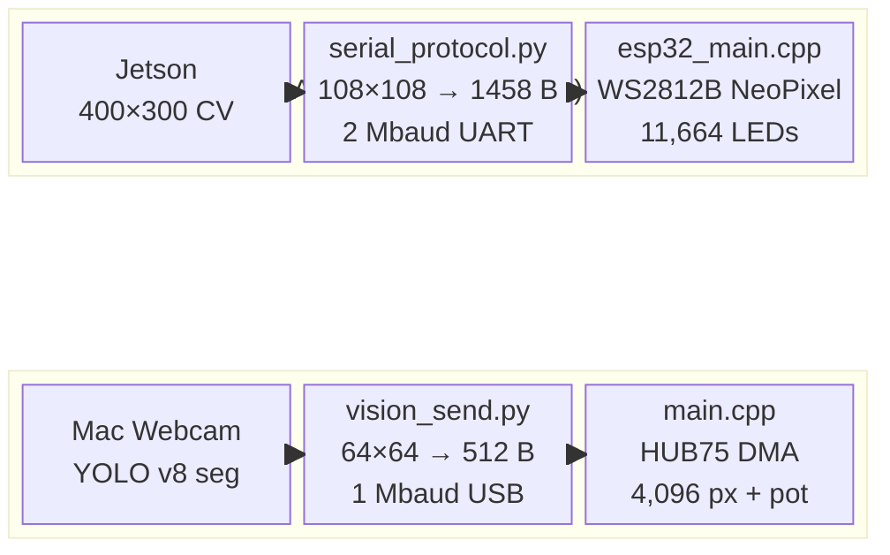

**The fundamental shift:** from a theoretical Jetson→WS2812B design (never physically built) to a working Mac→ESP32→HUB75 rig verified on the bench. Frame size dropped 65× (15,000 → 512 bytes), the display driver changed from bit-banged NeoPixel to DMA-driven HUB75, and a potentiometer adds real-time color control — the first interactive element in the project.

### Code Health Summary

**Overall Grade: C+**

The codebase demonstrates solid architectural thinking — clean separation of CV pipeline, serial transport, and firmware; config-driven design; graceful GPU/CPU fallback. The agent orchestrator and documentation system are well-engineered.

However, a **hardware migration from WS2812B 108×108 to HUB75 64×64 was only partially applied**. `config.yaml` was updated, but `serial_protocol.py` and `esp32_main.cpp` still carry the old dimensions, producing a **guaranteed runtime crash** (`ValueError` in `pack_matrix`) the moment a frame is sent. The firmware is entirely non-functional on the target hardware (wrong driver library, wrong GPIO mapping, wrong payload size).

Secondary concerns: no resource cleanup on exceptions in `main.py`, no camera-open validation, duplicated logic across CPU/GPU pipelines, and no cost guardrails on the 7-agent orchestrator.

The documentation quality is excellent — stale sections are clearly marked — but the code hasn't caught up.

### Improvement Proposals

**[PROP-001] Stale agent_outputs/ files still importable — risk of accidental use** — 🟡 medium — nice-to-have

*Problem:* The old serial_protocol.py, esp32_main.cpp, and cv_pipeline.py in agent_outputs/ carry STALE banners in comments but are still valid Python/C++ that could be imported or compiled by mistake. A new contributor might not read the banners and wire up the wrong protocol (108×108 / 2 Mbaud) against the new firmware (64×64 / 1 Mbaud).

*Fix:* Add a runtime guard at the top of each stale Python file: `raise ImportError('STALE — use Kyle/vision/serial_protocol.py instead')`. For the C++ file, wrap everything in `#error` so PlatformIO refuses to compile it. Alternatively, move the entire agent_outputs/ directory to agent_outputs_archive/ to make the break obvious.

**[PROP-002] Monitor baud mismatch in firmware README vs code** — 🟢 low — nice-to-have

*Problem:* The firmware README.md states 'Monitor baud is 115200 for any future debug prints' and platformio.ini sets monitor_speed=115200, but the firmware's Serial.begin() uses 1,000,000 baud (the data link baud). If someone opens `pio device monitor` at the default 115200 for debugging, they'll see garbage. The commit message notes a 'doc baud' issue was flagged and fixed, but the README still carries potentially confusing language about 115200.

*Fix:* Either (a) change monitor_speed in platformio.ini to 1000000 so `pio device monitor` connects at the right baud, or (b) add a dedicated debug UART on different pins at 115200 and keep the USB-CDC exclusively for data. Option (a) is simpler; just add a clear warning in the README that monitoring and vision_send.py can't share the port.

**[ESP32-001] esp32_main.cpp uses wrong display driver (NeoPixel) and stale 108×108 dimensions** — 🔴 high — must-fix

*Problem:* The firmware uses `Adafruit_NeoPixel` to drive WS2812B LEDs at 108×108 (11,664 pixels) via a single GPIO. The actual hardware is a Waveshare RGB-Matrix-P2 64×64 HUB75 panel requiring the `ESP32-HUB75-MatrixPanel-DMA` library and 13 GPIO pins. `PAYLOAD_BYTES=1458` doesn't match the Python side (which will send 512 bytes once SERIAL-001 is fixed). The firmware is completely non-functional on the target hardware. `platformio.ini` also lists `Adafruit NeoPixel` as the dependency instead of `ESP32 HUB75 MatrixPanel DMA`.

*Fix:* Rewrite the display driver: replace `Adafruit_NeoPixel` with `ESP32-HUB75-MatrixPanel-DMA`. Set `MATRIX_COLS=64`, `MATRIX_ROWS=64`, `PAYLOAD_BYTES=512`. Map the 13 HUB75 GPIOs (R1,G1,B1,R2,G2,B2,A,B,C,D,LAT,OE,CLK) via `HUB75_I2S_CFG`. Replace `strip.setPixelColor()` loop with `dma_display->drawPixelRGB888(col, row, r, g, b)`. Update `platformio.ini` lib_deps accordingly.

---
## v5 — 2026-05-07 18:20 — `1ea86b2`

### What Changed

This window covers **6 meaningful commits** (plus 4 auto-generated doc reports) and one transformative hardware pivot. Changes grouped by subsystem:

### 🔧 Hardware & Configuration — The HUB75 Pivot (`90363fc`)

The single most consequential change: the display hardware was swapped from a custom 108×108 WS2812B addressable LED build to an off-the-shelf **Waveshare RGB-Matrix-P2 64×64 (HUB75)** panel.

- **`config.yaml`** — `display.type` flipped from `ws2812b` to `hub75_waveshare_p2_64`. Panel shrinks from 11,664 LEDs (108×108) to 4,096 (64×64). Driver library changes from FastLED to `ESP32-HUB75-MatrixPanel-DMA`. FPS target raised 10→60 (HUB75 DMA is fast). GPIO model changes from single data pin to 13 HUB75 control lines.
- **`config.yaml` processing section** — `output_width`/`output_height` updated from 400×300 to **64×64**, matching panel native resolution. This eliminates the intermediate downsample stage entirely.
- **Why it matters:** Every downstream module — serial protocol, ESP32 firmware, CV pipeline — inherits its dimensions from this config. The config is now correct, but the consuming code hasn't caught up yet.

### ⚠️ STALE Banners — Debt Declared, Not Resolved (`90363fc`)

Rather than rewriting code mid-sprint, the team placed prominent `⚠ STALE` banners on every file that references the old hardware:

- **`esp32_main.cpp`** — Banner says: replace FastLED with HUB75 DMA, change dimensions to 64×64, remap 13 GPIOs. Marked **"DO NOT FLASH AS-IS"**.
- **`serial_protocol.py`** — Still hardcodes `PANEL_ROWS=108`, `PANEL_COLS=108`, `PAYLOAD_BYTES=1458`. Banner says: payload drops to 512 bytes. Current code will **raise `ValueError`** on any 64×64 input.
- **`cv_pipeline.py`** and **`gpu_accelerated.py`** — Docstrings say 400×300 but the actual resize reads `out_w`/`out_h` from config dynamically — **these work at 64×64 already**, only comments are stale.
- **`PROTOCOL_SPEC.md`** and **`hardware_recommendation.md`** — Old spec body retained for reference; banners outline the v2.0 numbers.

> **Strategy: "Declare the destination, mark the debt."** The team can `grep -r "STALE"` to find every file needing a rewrite before the next hardware integration milestone.

### 🤖 Agent Orchestration & Governance

- **`orchestrator.py` `PROJECT_CONTEXT`** (`90363fc`) — The master prompt block that every spawned Claude agent inherits was rewritten to reference the Waveshare panel, 512 B/frame, 921,600 bps, and `ESP32-HUB75-MatrixPanel-DMA`. This is critical because all 7 parallel agents derive their understanding of the hardware from this string.
- **`doc_agent.py`** (`90363fc`) — Architect agent prompt updated: data-flow diagram target is now "64×64 Waveshare HUB75 LED panel" and "512 B/frame".
- **`PROJECT_README.md`** (`90363fc`) — Architecture overview and ASCII data-flow diagram rewritten: 400×300 / 15 KB → 64×64 / 512 B.
- **`CLAUDE.md`** (`e78df3f`) — New governance doc defining the Kyle/Larry workspace convention so Claude agents know who owns what.

### 👁️ Computer Vision / Kyle's Vision Fork

- **`ac90ef9`** — Kyle **forked** `Larry/vision.py` into his own workspace. This establishes the two-workspace pattern: Larry's code is the production baseline, Kyle's is the experimentation branch.
- **`1d051ee`** — In Kyle's vision fork, replaced discrete `[` / `]` keyboard shortcuts for adjusting detection confidence with a **continuous trackbar slider** (`Conf %`). Why: live-tuning a threshold with a slider is far faster than tapping keys during a camera session.

### 📄 Documentation System (`1ea86b2`, HEAD)

- Auto-generated 926 lines of feature documentation across 7 feature files (`ME135_Agent_Swarm.md`, `ME135_Computer_Vision_Pipeline.md`, `ME135_ESP32_Firmware.md`, etc.) plus a timestamped evolution report (`report_2026-05-07_1814.md`).
- `docs/README.md` index updated with a link to the new report.
- Each feature doc now includes a v3 section documenting the HUB75 pivot, a subsystem touch map, and a code health grade (D+ — strong architecture, broken by incomplete migration).

### Evolution Timeline

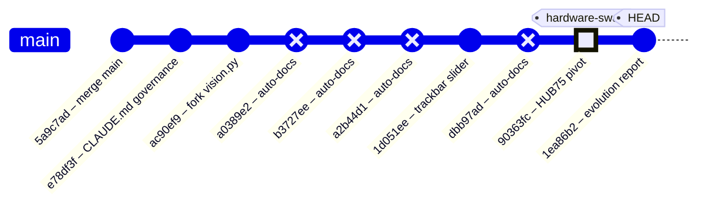

### Subsystem Touch Map

| Commit | CV Pipeline | Serial Protocol | ESP32 Firmware | Config | Docs / Governance | Vision (Kyle) |
|--------|:-----------:|:---------------:|:--------------:|:------:|:-----------------:|:-------------:|
| `5a9c7ad` — merge main | | | | | | |
| `e78df3f` — CLAUDE.md | | | | | ✅ | |
| `ac90ef9` — fork vision.py | | | | | | ✅ |
| `1d051ee` — trackbar slider | | | | | | ✅ |
| **`90363fc` — HUB75 pivot** | ✅ | ✅ | ✅ | ✅ | ✅ | |
| `1ea86b2` — evolution report | | | | | ✅ | |

### Trajectory Reading

The project follows a clear three-act arc so far:

1. **Genesis** — Larry's initial CV + ESP32 code established the pipeline end-to-end (pre-window).
2. **Fork & Tune** — Kyle branched the vision code for independent experimentation, added the trackbar slider for faster live tuning, and the team codified governance rules (`CLAUDE.md`).
3. **Hardware Pivot** — The display hardware changed from WS2812B to HUB75. Config was updated authoritatively; all stale code was marked but not yet rewritten.

**What comes next:** The STALE banners are a to-do list. The serial protocol (`serial_protocol.py`) and ESP32 firmware (`esp32_main.cpp`) need dimension/driver rewrites before any hardware integration testing can proceed. The CV pipeline already works at 64×64 thanks to config-driven resizing — it's the furthest along.

### System Architecture

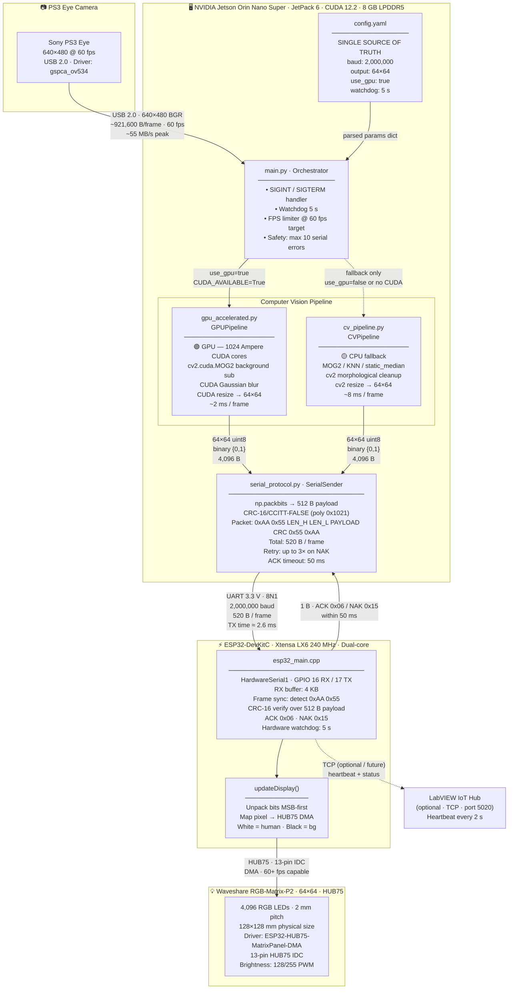

> **Key numbers at a glance**
>
> | Stage | Data Size | Rate / Latency |
> |---|---|---|
> | Camera capture | 921,600 B/frame (BGR) | 60 fps · ~55 MB/s |
> | GPU processing | 307,200 B (grayscale) | ~2 ms/frame |
> | CPU processing | 307,200 B (grayscale) | ~8 ms/frame |
> | Binary matrix | 4,096 B (64×64 uint8) | post-threshold |
> | Bit-packed payload | **512 B** | `np.packbits` |
> | Full UART packet | **520 B** | header(4) + payload(512) + CRC(2) + footer(2) |
> | UART TX time | 520 B @ 2 Mbaud | **≈ 2.6 ms** |
> | ACK window | 1 B | ≤ 50 ms timeout |

> ⚠️ **Staleness note:** `esp32_main.cpp` and `serial_protocol.py` still hardcode `PAYLOAD_BYTES=1458` (108×108 legacy WS2812B panel). `config.yaml` and `gpu_accelerated.py` are updated to 64×64 / 512 B. See Improvement Proposals below.

### Data Flow

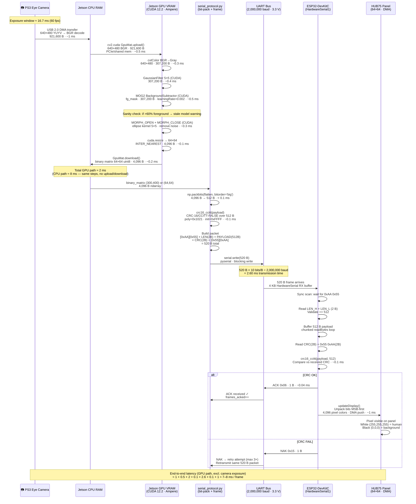

> **Byte-count ledger — one frame**
>
> | Step | Bytes in | Transform | Bytes out |
> |---|---:|---|---:|
> | Camera raw (YUYV) | 614,400 | BGR decode | **921,600** |
> | Grayscale | 921,600 | cvtColor | **307,200** |
> | Foreground mask | 307,200 | MOG2 + morph | **307,200** |
> | Resized binary | 307,200 | resize 64×64 | **4,096** |
> | Bit-packed payload | 4,096 | `np.packbits` | **512** |
> | UART packet | 512 | frame wrap | **520** |
> | Panel pixels | 520 | `unpackbits` | **4,096** RGB values |
>
> **Compression ratio camera → panel: 921,600 B → 512 B = 1,800× reduction**

### Module Dependency Graph

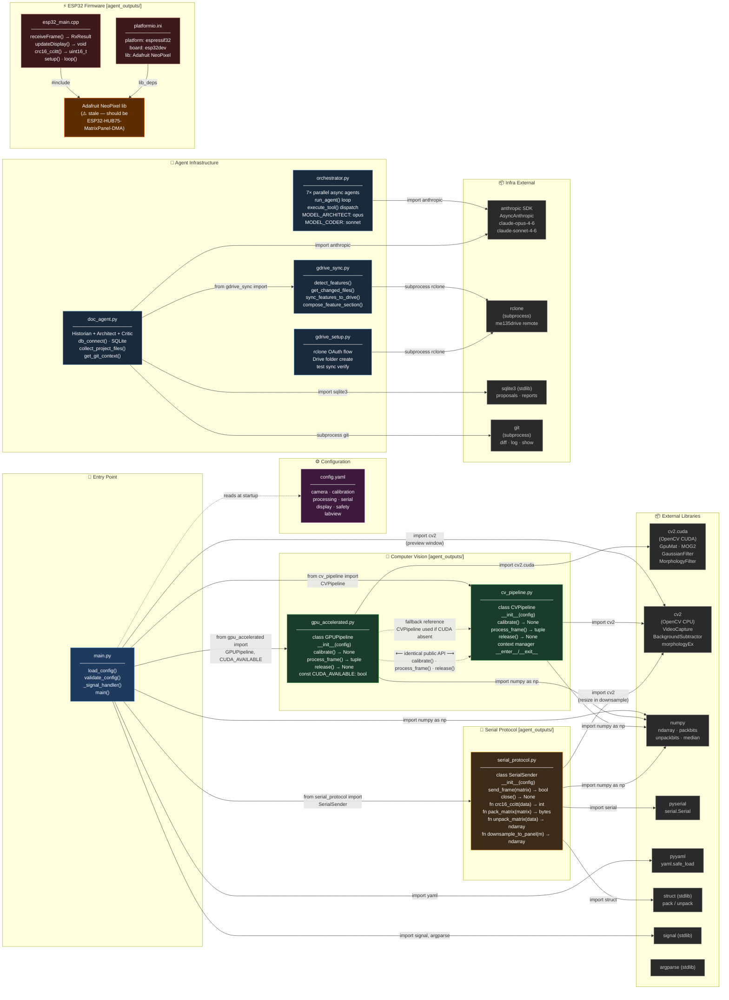

> **Interface contract — CV pipeline duck-typing**
>
> `main.py` selects between `GPUPipeline` and `CVPipeline` purely at runtime.
> Both expose an **identical public API**:
>
> ```
> pipeline = GPUPipeline(config)  # or CVPipeline(config)
> pipeline.calibrate()            # blocking — build background model
> binary, raw = pipeline.process_frame()  # returns (64×64 uint8, BGR frame)
> pipeline.release()              # free camera + GPU resources
> ```
>
> **`serial_protocol.py` public surface used by `main.py`:**
> ```
> sender = SerialSender(config)
> ok: bool = sender.send_frame(binary_matrix)   # packs + sends + waits ACK
> sender.close()
> ```
>
> 🟠 **`Adafruit NeoPixel`** dependency in `platformio.ini` / `esp32_main.cpp` is
> stale — the correct library for the HUB75 panel is `ESP32-HUB75-MatrixPanel-DMA`.

### Code Health Summary

**Overall Grade: C−**

The codebase demonstrates strong architectural intent — clean module separation, config-driven design, context managers, safety watchdogs, and a well-documented serial protocol. However, **the system cannot actually run end-to-end**. A hardware migration from 108×108 WS2812B to 64×64 HUB75 was partially applied: `config.yaml` was updated, but `serial_protocol.py` and `esp32_main.cpp` still hardcode the old 108×108 dimensions with the wrong driver library. This means `pack_matrix()` raises `ValueError` on every frame, and the ESP32 firmware targets nonexistent hardware.

Additionally, `min_contour_area=500` will filter out most human detections at 64×64 resolution. Resource cleanup in `main.py` is not exception-safe. Subprocess calls throughout lack timeouts, risking indefinite hangs.

**Positive notes:** CRC matches both sides, CV pipeline API is cleanly swappable (CPU/GPU), git-driven doc generation is clever, and config validation exists. Once the dimension mismatch is fixed, this is close to a working system.

### Improvement Proposals

**[ESP32-001] esp32_main.cpp uses wrong driver (NeoPixel) and wrong dimensions for HUB75 64×64 panel** — 🔴 high — must-fix

*Problem:* The firmware targets a WS2812B strip via Adafruit_NeoPixel at 108×108 (11,664 LEDs on GPIO 13). The actual hardware is a Waveshare RGB-Matrix-P2 64×64 HUB75 panel, which requires the ESP32-HUB75-MatrixPanel-DMA library and 13 GPIO pins. Flashing this firmware will either do nothing (no NeoPixel connected) or damage hardware if GPIO 13 is connected to an HUB75 pin. PAYLOAD_BYTES (1458) also mismatches the 512 bytes the Jetson will send after SERIAL-001 is fixed, causing RX_SYNC_ERROR on every frame.

*Fix:* Replace `#include <Adafruit_NeoPixel.h>` with `#include <ESP32-HUB75-MatrixPanel-I2S-DMA.h>`. Set MATRIX_COLS=64, MATRIX_ROWS=64, PAYLOAD_BYTES=512. Replace `strip.setPixelColor()`/`strip.show()` with `dma_display->drawPixelRGB888()` and configure HUB75_I2S_CFG with the correct pin mapping. Update platformio.ini lib_deps to include `mrfaptastic/ESP32 HUB75 LED Matrix Panel DMA Display`.

**[ESP32-001] ESP32 firmware targets WS2812B — cannot drive HUB75 panel** — 🔴 high — must-fix

*Problem:* esp32_main.cpp uses Adafruit_NeoPixel with a single GPIO data pin to drive 11,664 WS2812B LEDs. The hardware is now a Waveshare HUB75 panel requiring ESP32-HUB75-MatrixPanel-DMA and 13 GPIO control lines. Flashing this firmware will produce no display output and could damage the ESP32 if pin assignments conflict.

*Fix:* Replace Adafruit_NeoPixel with ESP32-HUB75-MatrixPanel-DMA. Set MATRIX_COLS=MATRIX_ROWS=64, PAYLOAD_BYTES=512. Map 13 HUB75 GPIOs (R1,G1,B1,R2,G2,B2,A,B,C,D,LAT,OE,CLK). Update platformio.ini to add the mrfaptastic/ESP32 HUB75 LED Matrix Panel DMA Display library.

**[ARCH-002] Rewrite esp32_main.cpp for HUB75 panel — replace NeoPixel driver** — 🔴 high — must-fix

*Problem:* esp32_main.cpp targets a WS2812B single-GPIO LED strip (Adafruit NeoPixel, GPIO 13, LED_COUNT=11664). The current hardware is a Waveshare RGB-Matrix-P2 64×64 HUB75 panel requiring 13 control GPIOs and the ESP32-HUB75-MatrixPanel-DMA library. Flashing the current firmware would drive a non-existent LED strip and display nothing.

*Fix:* Replace #include <Adafruit_NeoPixel.h> with ESP32-HUB75-MatrixPanel-DMA. Set MATRIX_COLS=MATRIX_ROWS=64, PAYLOAD_BYTES=512. Map HUB75 GPIOs (R1,G1,B1,R2,G2,B2,A,B,C,D,LAT,OE,CLK) in HUB75_I2S_CFG. Update updateDisplay() to use dma_display->drawPixelRGB888(). Update platformio.ini lib_deps.

**[ARCH-007] LabVIEW IoT integration (config.yaml labview section) has no Python-side implementation** — 🟢 low — future

*Problem:* config.yaml declares a labview: block with hub_ip, hub_port, protocol, and heartbeat_interval_s. Neither main.py, serial_protocol.py, nor any other module reads or acts on these values. The ESP32 heartbeat response byte 0x07 is mentioned in PROTOCOL_SPEC.md §9 as 'future'. The feature is spec'd but unimplemented on both sides.

*Fix:* Either (a) add a LabVIEWReporter class in a new labview_reporter.py that opens a TCP socket to hub_ip:hub_port and sends status frames at heartbeat_interval_s, called from main.py's live loop, or (b) mark the labview config block as [future] in config.yaml with a comment. The ESP32 heartbeat byte 0x07 should be added to the frame parser in esp32_main.cpp alongside ACK/NAK.

---
## v6 — 2026-05-08 00:16 — `fa3fc0f`

### What Changed

This commit (`fa3fc0f`) is a **housekeeping milestone** — it formally retires the original generation-1 pipeline and aligns the tooling to track only the active YOLOv8 + HUB75 codebase. Here's everything that changed, grouped by subsystem:

### 🗄️ Project Architecture — Legacy Archival

- **`agent_outputs/` → `_archive/agent_outputs/`**: All 12 files from the original Gen-1 pipeline (Jetson + PS3 Eye + MOG2/KNN + WS2812B, 108×108 grid) moved to `_archive/`. This includes `cv_pipeline.py`, `esp32_main.cpp`, `serial_protocol.py`, `gpu_accelerated.py`, `main.py`, `config.yaml`, `platformio.ini`, several markdown docs, and `requirements.txt`.
- **`tests/test_serial_protocol.py` → `_archive/tests/`**: The test for the old serial protocol moved alongside its source.
- **`agent_outputs/` added to `.gitignore`**: Prevents the legacy `orchestrator.py` generator from resurrecting a tracked directory if accidentally re-run.
- **Why it matters**: The critic agent flagged 13 stale-hardware issues against `agent_outputs/`. Rather than patching dead code, archiving clears the noise and makes the repo's active surface unambiguous: `vision/` and `firmware/me135_led_pot/` are the only live code paths.

### 📝 Documentation System (`doc_agent.py`)

- **Glob patterns updated**: File collection now scans `vision/*.py`, `vision/*.md`, `firmware/**/*.cpp`, `firmware/**/*.h`, `firmware/**/*.ini` instead of the old `agent_outputs/*` paths.
- **Tool description updated**: The `read_source` tool's example path changed from `'agent_outputs/cv_pipeline.py'` to `'vision/vision.py'` and `'firmware/me135_led_pot/src/main.cpp'`.
- **Why it matters**: Without this, the doc agent would index archived files and miss the active pipeline entirely. The tool description also guides LLM agents toward valid file paths.

### 📊 Google Drive Sync (`gdrive_sync.py`)

- **`FEATURE_MAP` rewritten**: The 15-entry map keyed to old filenames (`cv_pipeline.py`, `gpu_accelerated.py`, `esp32_main.cpp`, etc.) replaced with a 10-entry map keyed to the current files (`vision.py`, `vision_send.py`, `main.cpp`, `WIRING.md`, etc.).
- **Feature categories updated**: "Computer Vision Pipeline" → "Vision Pipeline"; dropped "System Integration" and "Agent Swarm" categories that no longer have corresponding code.
- **Why it matters**: Feature detection drives per-feature Google Drive reports. Stale keys = reports that never update for real changes.

### 🔧 Dev Tooling (pre-push hook — not version-controlled)

- **Auto-doc loop fix**: The `.git/hooks/pre-push` script patched to skip doc generation when all commits being pushed match `'^docs: auto-generated evolution report'`. Previously, each push created a new `[skip ci]` commit, which triggered another push, which generated another doc — an infinite loop confirmed in PR #1 history.
- **Why it matters**: This was flagged as DOC-001 by the critic. The fix is local-only (`.git/hooks/` isn't tracked), so it only applies to Kyle's machine, but Larry doesn't run the doc agent.

### 📋 Root Config (`CLAUDE.md`)

- Minor cleanup: 14 insertions / 7 deletions (net -4 lines). Likely updated project context references to match the new directory structure.

---

**What did NOT change**: The active pipeline code (`vision/vision.py`, `vision/vision_send.py`, `vision/serial_protocol.py`, `firmware/me135_led_pot/src/main.cpp`) was untouched. This commit is purely structural — making the repo match the reality that the project pivoted from Gen-1 (MOG2 background subtraction, 108×108, WS2812B strips) to Gen-2 (YOLOv8 instance segmentation, 64×64, HUB75 panel) several commits ago.

### Evolution Timeline

The commit history tells the story of a hardware pivot: from a WS2812B LED strip prototype to a Waveshare HUB75 64×64 RGB panel, with the CV backend upgrading from background subtraction to YOLO instance segmentation along the way.

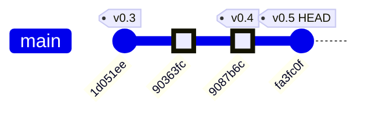

### Commit-by-Commit Breakdown

| Commit | Date | Subsystems Touched | Summary |
|--------|------|--------------------|---------|
| `1d051ee` | ~May 5 | CV Pipeline | Replaced keyboard `[`/`]` confidence controls with an OpenCV `Conf %` trackbar slider — better UX for live tuning |
| `90363fc` | ~May 6 | Docs / Context | Switched project documentation context to target the Waveshare RGB-Matrix-P2 64×64 HUB75 panel (the hardware pivot decision) |
| `9087b6c` | ~May 7 | **CV Pipeline, Serial Protocol, ESP32 Firmware, Wiring Docs** | The big integration commit: `vision_send.py` + `serial_protocol.py` ship 64×64 bit-packed masks over USB serial; `main.cpp` receives, CRC-validates, and renders on the HUB75 panel; pot controls white→red color lerp |
| `fa3fc0f` | May 8 | **Tooling, Repo Structure** | Archive Gen-1 `agent_outputs/`, update doc agent + gdrive sync to track Gen-2 paths, fix auto-doc commit loop |

*(6 intermediate `docs: auto-generated evolution report [skip ci]` commits omitted — these are the auto-doc loop artifacts that `fa3fc0f` fixes.)*

### Subsystem Touch Map

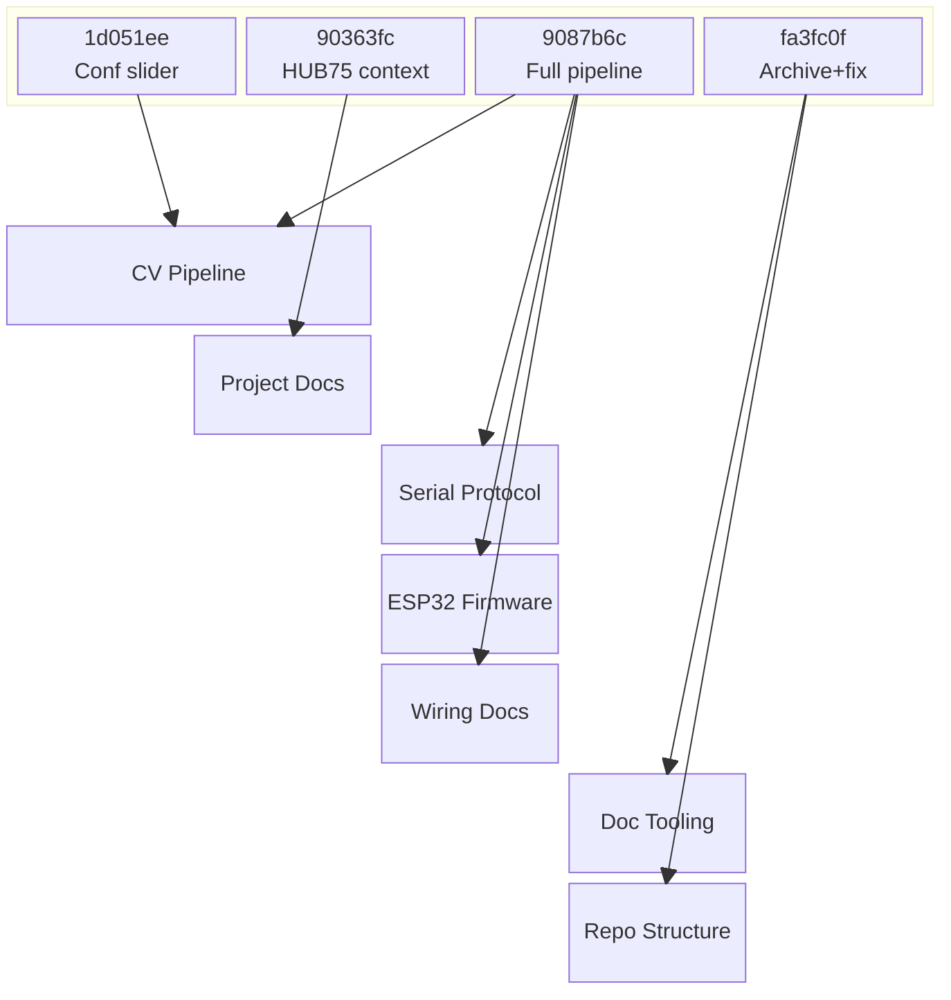

### The Pivot Story

The project trajectory is clear: commit `9087b6c` was the inflection point where three new subsystems landed simultaneously (serial protocol, ESP32 HUB75 firmware, and the `vision_send.py` bridge). The HEAD commit (`fa3fc0f`) is the cleanup that formally closes the Gen-1 chapter — archiving rather than deleting, so the original exploration path remains accessible for reference.

### System Architecture

```mermaid
flowchart LR
    subgraph INPUT["📷  Input Hardware"]
        PS3["Sony PS3 Eye\nUSB 2.0 · gspca_ov534\n640 × 480 @ 60 fps\nBGR uint8"]
    end

    subgraph JETSON["🖥️  Jetson / Host Mac  ── Python 3"]
        direction TB

        subgraph CAPTURE["vision_send.py  ·  open_camera()"]
            CAP["cv2.VideoCapture\nCAP_V4L2 / CAP_AVFOUNDATION / CAP_ANY\n[CPU]  640 × 480  BGR\n921,600 B / frame"]
        end

        subgraph INFERENCE["YOLOv8n-seg  ·  ultralytics"]
            YOLO["model.predict(frame, classes=[0])\nIMGSZ = 640  ·  letterbox padded\n[GPU · CUDA  preferred]\n~6 MB checkpoint  yolov8n-seg.pt\nconf trackbar  5 – 95 %"]
        end

        subgraph CV_POST["vision_send.py  ·  CPU post-process"]
            MASKS["np.maximum merge masks\nmorphologyEx CLOSE  5×5 kernel\nfindContours + area filter ≥ 0.2 %\n307,200 B  silhouette  uint8"]
            SCALE["cv2.resize  INTER_AREA → 64×64\nthreshold > 96 → binary {0,1}\n4,096 B  uint8"]
        end

        subgraph PROTOCOL["serial_protocol.py  ·  SerialSender"]
            PACK["pack_mask()\nnp.packbits MSB-first row-major\n4,096 bits → 512 B payload"]
            PKT["_build_packet()\n0xAA 0x55 | LEN 0x0200 | 512 B\n| CRC16-CCITT | 0x55 0xAA\n520 B total frame"]
            SND["SerialSender.send_frame()\nbaudrate = 1,000,000\nack_timeout = 50 ms  ·  max_retries = 3\nTX throttle ≤ 30 fps\nstats: frames_sent / acked / naked"]
        end
    end

    subgraph ESP32["⚡  ESP32 DevKitC  ── C++ / Arduino"]
        direction TB

        subgraph RX_BLOCK["pollFrame()  ·  9-state FSM"]
            FSM["RX_WAIT_AA → RX_WAIT_55\n→ RX_LEN_HI/LO → RX_PAYLOAD\n→ RX_CRC_HI/LO → RX_END_55/AA\nRX buffer = 2,048 B\nper-frame timeout = 100 ms"]
            CRC["crc16_ccitt(rxbuf, 512)\npoly 0x1021  init 0xFFFF\nno reflect  no xorout\ncalc == rxCrc?"]
            ACK["ACK 0x06  /  NAK 0x15\n1-byte reply over USB-CDC"]
        end

        subgraph POT_BLOCK["Potentiometer  ·  GPIO 34"]
            POT["analogRead  12-bit  ADC1_CH6\nEWMA  α = 0.1\nt = ewma / 4095  ∈  [0, 1]"]
            LERP["Color lerp\nt = 0 → white (255, 255, 255)\nt = 1 → red   (255,   0,   0)"]
        end

        subgraph RENDER_BLOCK["renderFrame()  +  DMA"]
            REND["bit-unpack 512 B → 4,096 pixels\nMSB-first  ·  row-major\ndrawPixelRGB888(x, y, r, g, b)\nredraw only on fb_dirty OR Δt ≥ 0.01"]
            DMA["MatrixPanel_I2S_DMA\nI2S parallel DMA engine\nbright = 160 / 255\ncolor depth = 8 bpp"]
            WDG["Watchdog\n5,000 ms no frame\n→ memset framebuf 0\n→ blankPanel()"]
        end
    end

    subgraph PANEL["💡  Waveshare RGB-Matrix-P2 64×64"]
        HUB["HUB75E  16-pin IDC 2×8\nR1 G1 B1 R2 G2 B2\nA B C D E  LAT  OE  CLK\n1/32 scan  ·  3.3 V logic"]
        LEDS["4,096 RGB LEDs\n64 × 64  ·  128 × 128 mm\n2 mm pitch\n5 V / 3 A+  separate PSU"]
    end

    subgraph DOCOPS["📚  Documentation / Ops"]
        ORCH["orchestrator.py\n7 parallel Claude agents\nopus-4-6 (arch) · sonnet-4-6 (code)\nwrites to agent_outputs/"]
        DOCAG["doc_agent.py\nHistorian · Architect · Critic\nSQLite history.db\ngit diff → Markdown report"]
        GSYNC["gdrive_sync.py\nFEATURE_MAP routing\nappend versioned sections\nrclone → Google Drive"]
    end

    PS3        -->|"USB 2.0  ·  921,600 B/frame\nBGR uint8  @60 fps"| CAP
    CAP        --> YOLO
    YOLO       -->|"N × (H×W) float32 masks\nboxes (N,4) int"| MASKS
    MASKS      -->|"307,200 B  uint8"| SCALE
    SCALE      -->|"4,096 B  64×64 uint8"| PACK
    PACK       -->|"512 B  bit-packed"| PKT
    PKT        -->|"520 B  framed"| SND
    SND        -->|"USB-CDC  1,000,000 baud\n≈ 5.2 ms / frame  ·  ≤ 30 fps"| FSM
    FSM        --> CRC
    CRC        -->|"valid  → memcpy 512 B\nfb_dirty = true"| REND
    CRC        --> ACK
    ACK        -->|"ACK 0x06 or NAK 0x15\n1 B @ 1 Mbaud ≈ 0.01 ms"| SND
    POT        --> LERP
    LERP       --> REND
    REND       --> DMA
    WDG        -.->|"5 s timeout\n→ blank"| DMA
    DMA        -->|"HUB75E parallel bus\nR1G1B1R2G2B2 + ABCDE\n+ LAT OE CLK  3.3 V"| HUB
    HUB        --> LEDS
    ORCH       -.->|"generated CV code\nfor pipeline"| JETSON
    DOCAG      --> GSYNC
```

### Data Flow

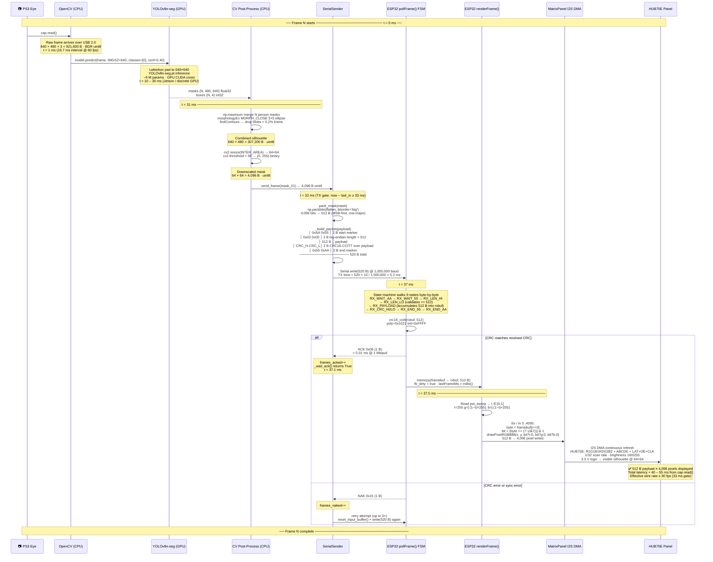

### Module Dependency Graph

```mermaid
graph TD

    %% ── Vision Subsystem ──────────────────────────────────────────────────────
    subgraph VIS["👁️  Vision Subsystem  ·  vision/"]

        VS["<b>vision_send.py</b><br/>────────────────────<br/>main()<br/>open_camera(index)<br/>autodetect_port() → str|None<br/>parse_args() → Namespace<br/>TX_MIN_INTERVAL_S = 1/30<br/>CAMERA_INDEX=0  OUTPUT_SIZE=64"]

        VP["<b>vision.py</b><br/>────────────────────<br/>main()  [standalone preview]<br/>open_camera(index)<br/>No serial — CV tuning only<br/>Conf % trackbar  5–95%"]

        SP["<b>serial_protocol.py</b><br/>────────────────────────────<br/><i>class SerialSender</i><br/>  __init__(port, baudrate=1_000_000,<br/>           ack_timeout_s=0.05, max_retries=3)<br/>  send_frame(mask: ndarray) → bool<br/>  close() → None<br/>  .frames_sent / acked / naked<br/>─────────────────────<br/>pack_mask(mask) → bytes  [512 B]<br/>unpack_mask(data) → ndarray<br/>crc16_ccitt(data, init=0xFFFF) → int<br/>PANEL_SIZE=64  PAYLOAD_BYTES=512<br/>FRAME_START=0xAA55  FRAME_END=0x55AA<br/>ACK_BYTE=0x06  NAK_BYTE=0x15"]
    end

    %% ── Documentation Subsystem ──────────────────────────────────────────────
    subgraph DOCS["📚  Documentation Subsystem  ·  Kyle/"]

        DA["<b>doc_agent.py</b><br/>─────────────────────────<br/>run_agent(client, id, sys, task) async<br/>execute_tool(name, input) → str<br/>Agents: Historian · Architect · Critic<br/>collect_project_files() → dict<br/>get_git_context() → str<br/>db_connect() / save_proposals()<br/>db_record_decision() / implementation()<br/>SQLite  →  docs/history.db<br/>MODEL_THINKER = claude-opus-4-6<br/>MODEL_WRITER  = claude-sonnet-4-6"]

        GS["<b>gdrive_sync.py</b><br/>─────────────────────────<br/>sync_to_drive(sections, proposals,<br/>   commit_sha, changed_files)<br/>detect_features(changed_files) → list<br/>get_changed_files(repo_root) → list<br/>compose_feature_section(…) → str<br/>append_to_feature_doc(path, text)<br/>ensure_feature_doc(path, feature)<br/>rclone_available() → bool<br/>sync_features_to_drive() → bool<br/>FEATURE_MAP: 10 file → feature entries<br/>Output: Kyle/docs/features/*.md"]

        GST["<b>gdrive_setup.py</b><br/>─────────────────────────<br/>main()  [one-time OAuth setup]<br/>_create_remote()  [rclone config]<br/>REMOTE_NAME = 'me135drive'<br/>DRIVE_FOLDER = 'ME135 Feature Reports'"]
    end

    %% ── Orchestration ────────────────────────────────────────────────────────
    subgraph ORCH_SUB["🤖  Orchestration  ·  Kyle/"]
        OR["<b>orchestrator.py</b><br/>─────────────────────────<br/>run_agent(client, id, sys, task,<br/>   model, max_turns=12) async<br/>execute_tool(name, input) → str<br/>main() → spawns 7 agents async<br/>Tools: write_file / read_file<br/>Output: agent_outputs/<br/>MODEL_ARCHITECT = claude-opus-4-6<br/>MODEL_CODER     = claude-sonnet-4-6"]
    end

    %% ── Firmware ─────────────────────────────────────────────────────────────
    subgraph FW["⚡  Firmware  ·  firmware/me135_led_pot/src/"]
        MC["<b>main.cpp</b>  [C++ / Arduino]<br/>──────────────────────────────────<br/>setup()  loop()<br/>pollFrame() → RxResult  [9-state FSM]<br/>crc16_ccitt(data, len) → uint16_t<br/>renderFrame(r, g, b)<br/>blankPanel()  resetRx()<br/>Watchdog 5,000 ms<br/>MatrixPanel_I2S_DMA *dma_display<br/>Platform: espressif32@6.5.0<br/>Lib: ESP32-HUB75-MatrixPanel-DMA@^3.0.11"]
    end

    %% ── External Python packages ─────────────────────────────────────────────
    subgraph EXT["📦  External Packages"]
        UL["ultralytics ≥ 8.0<br/><i>YOLO class</i><br/>yolov8n-seg.pt ~6 MB"]
        CV["opencv-python ≥ 4.8<br/><i>cv2</i>"]
        NP["numpy ≥ 1.24<br/><i>ndarray · packbits</i>"]
        SRL["pyserial ≥ 3.5<br/><i>serial.Serial</i><br/><i>serial.tools.list_ports</i>"]
        ANT["anthropic ≥ 0.40<br/><i>AsyncAnthropic</i><br/><i>streaming messages</i>"]
        RCLONE["rclone<br/>(subprocess)<br/>OAuth → Google Drive"]
        SQLITE["sqlite3<br/>(stdlib)<br/>proposal history DB"]
    end

    %% ── Vision internal edges ────────────────────────────────────────────────
    VS -->|"from serial_protocol import SerialSender"| SP
    SP -->|"import numpy as np"| NP
    SP -->|"import serial"| SRL
    VS -->|"from ultralytics import YOLO"| UL
    VS -->|"import cv2"| CV
    VS -->|"import numpy as np"| NP
    VP -->|"from ultralytics import YOLO"| UL
    VP -->|"import cv2"| CV
    VP -->|"import numpy as np"| NP

    %% ── Doc system edges ─────────────────────────────────────────────────────
    DA -->|"from gdrive_sync import\nsync_to_drive · detect_features\nget_changed_files"| GS
    DA -->|"import anthropic"| ANT
    DA -->|"import sqlite3"| SQLITE
    GS -->|"subprocess.run rclone sync"| RCLONE
    GST -->|"subprocess.run rclone config"| RCLONE

    %% ── Orchestrator edges ───────────────────────────────────────────────────
    OR -->|"import anthropic"| ANT

    %% ── Wire protocol boundary ───────────────────────────────────────────────
    SP -.->|"520 B wire protocol<br/>CRC16-CCITT  1 Mbaud USB-CDC<br/>ACK 0x06 / NAK 0x15"| MC

    %% ── Style ────────────────────────────────────────────────────────────────
    classDef core   fill:#1e3a5f,color:#e8f4f8,stroke:#4a9eca
    classDef doc    fill:#2d4a1e,color:#d4f0c0,stroke:#5aaa30
    classDef ext    fill:#3a2d1e,color:#f0dcc0,stroke:#ca8030
    classDef fw     fill:#3a1e2d,color:#f0c0d4,stroke:#ca3070

    class VS,VP,SP core
    class DA,GS,GST doc
    class OR doc
    class UL,CV,NP,SRL,ANT,RCLONE,SQLITE ext
    class MC fw
```

### Code Health Summary

**Overall Grade: B−**

The codebase is well-structured for an ME135 course project. The serial protocol (Python ↔ ESP32) is solid: CRC-validated framing, ACK/NAK retries, state-machine parsing, and a watchdog blanker. Documentation (WIRING.md, README) is unusually thorough.

**Strengths:** Clean serial protocol with matching CRC on both sides. Good error messages in `SerialSender` constructor. `vision_send.py` has proper `try/finally` cleanup. Firmware state machine handles all edge cases (AA-AA resync, timeout).

**Key concerns:** (1) **Correctness** — null-dereference crash on pause-before-first-frame in both vision scripts. (2) **Reliability** — `rclone sync` can destructively wipe Drive files if local dir is empty; ESP32 `new` has no null guard. (3) **Maintainability** — ~100 lines of CV pipeline are copy-pasted across two files, guaranteeing future divergence.

Four proposals are must-fix; four are nice-to-have improvements for long-term health.

### Improvement Proposals

**[FW-001] Firmware watchdog blanks panel but doesn't notify host** — 🟢 low — future

*Problem:* When the ESP32 watchdog fires (no frame in 5 seconds), it blanks the panel and resets lastFrameMs silently. The host has no way to know the panel went dark — it could be useful for the vision_send.py status display or reconnect logic.

*Fix:* Send a distinctive byte (e.g., 0x17 = ETB) upstream when the watchdog fires. vision_send.py can log it and optionally show a 'panel timeout' warning on the preview overlay.

**[PROP-05] ESP32 firmware: no null check after heap allocation of DMA display** — 🟡 medium — must-fix

*Problem:* In `main.cpp` `setup()`, `dma_display = new MatrixPanel_I2S_DMA(mxconfig);` can return `nullptr` if the ESP32 heap is exhausted (Arduino `new` does not throw by default). Subsequent calls like `dma_display->begin()` and `dma_display->setBrightness8(160)` would dereference a null pointer, causing a hard crash with no diagnostic output.

*Fix:* After the `new` call, add: `if (!dma_display) { Serial.println("FATAL: DMA alloc failed"); while(1) delay(1000); }`. This gives a clear diagnostic via serial instead of an opaque crash.

**[PROP-08] platformio.ini monitor_speed (115200) mismatches firmware Serial baud (1000000)** — 🟢 low — nice-to-have

*Problem:* In `platformio.ini`, `monitor_speed = 115200`, but `main.cpp` initializes `Serial.begin(1000000)`. Anyone running `pio device monitor` (the most natural debug step) sees garbage. The `README.md` explains the discrepancy, but this is a pit-of-failure: new contributors debug for minutes before reading the README. The firmware also never prints anything, so the mismatch is invisible until someone adds a debug `Serial.println()`.

*Fix:* Change `monitor_speed = 1000000` in `platformio.ini` to match the actual baud rate. Add a `#define DEBUG_BAUD 1000000` in `main.cpp` and reference it in both `Serial.begin()` and the `.ini` comment for single-source-of-truth.

**[PROTO-001] Add sequence number to serial frame for duplicate / reorder detection** — 🟢 low — nice-to-have

*Problem:* The 520-byte frame has no sequence counter. If a NAK triggers a retry and the original ACK arrives late, the ESP32 renders the same frame twice silently. At 30 fps the duplicate is invisible but the stats (frames_acked) mislead.

*Fix:* Insert a 1-byte rolling counter (0–255) between LEN and payload. Bump PAYLOAD_BYTES header to LEN=0x0201 or use the reserved header space. ESP32 FSM tracks last_seq and discards exact duplicates, sending ACK anyway.

**[FIRM-001] ESP32 renderFrame() blocks loop() — move to FreeRTOS task** — 🟡 medium — nice-to-have

*Problem:* renderFrame() calls drawPixelRGB888 4,096 times inside loop(). On busy frames this blocks pollFrame() from reading new serial bytes, inflating the effective round-trip and risking RX buffer overflow at 1 Mbaud if a large burst arrives during render.

*Fix:* Pin a dedicated FreeRTOS task (Core 1) to swap double-buffers and call renderFrame(). loop() runs on Core 0 and only handles serial RX and pot ADC. Use a binary semaphore to signal the render task when fb_dirty is set.

**[PROTO-002] Framing bytes 0xAA/0x55 can appear in payload — add byte stuffing or COBS** — 🔴 high — must-fix

*Problem:* pack_mask() output is arbitrary bit data. If the 512-byte payload contains the byte sequence 0x55 0xAA, the ESP32 FSM in state RX_END_55 will false-trigger an early end-of-frame, causing a sync error and unnecessary NAK/retry.

*Fix:* Either (a) switch to COBS encoding (adds ≤1 B overhead per 254 B, fully eliminates 0x00 or any chosen sentinel), or (b) after the start marker look for LEN bytes and only then scan for the end marker at the fixed offset, making payload content irrelevant. Option (b) requires only a one-line FSM change: skip RX_END_* scanning until rxIdx == rxLen.

**[FIRM-002] GPIO 12 (G2) strapping-pin risk has no firmware mitigation** — 🟡 medium — nice-to-have

*Problem:* WIRING.md §6 documents the GPIO 12 / MTDI boot issue but the firmware has no runtime guard. If the board is flashed with the stock pin map and GPIO 12 is pulled high by the panel at the wrong moment, flash voltage misconfiguration can silently brick the module.

*Fix:* Add a compile-time #warning in main.cpp flagging the GPIO 12 use. Provide a #define REMAP_G2_TO_GPIO18 preprocessor guard that switches G2 to GPIO 18 and updates the HUB75_I2S_CFG pins struct, selectable via a platformio.ini build flag rather than a code edit.

---
## v7 — 2026-05-09 12:39 — `c898c6b`

### What Changed

This batch of commits transforms a single-mode silhouette display into a **dual-mode system** (mask + fingertip tracking) and fixes a hardware wiring error that could have bricked setups built from the old docs.

### ESP32 Firmware (`main.cpp`) — Major protocol & rendering overhaul

- **Multi-mode serial protocol**: The frame format gained a `MODE` byte between the length field and payload. The old wire format was `[AA 55][LEN][512B payload][CRC][55 AA]`; the new one is `[AA 55][LEN][MODE][payload...][CRC][55 AA]`. CRC now covers MODE + payload (previously payload-only). This is a **breaking wire-protocol change** — both sides must be updated together.
- **MODE_FINGERTIPS (0x01)**: New render path. Receives `[count][x,y,r,g,b]×N` packets (up to 10 fingertips) and draws each as a 3×3 colored block on the panel. Purpose: a second team member (Wen) can drive the panel with hand-tracked colored dots instead of a silhouette mask.
- **Button-driven mode toggle (GPIO 33)**: A physical button on the ESP32 switches between mask mode and fingertip mode at runtime, with proper debounce (50 ms). The ESP32 sends `0x10`/`0x11` notification bytes upstream so the Mac knows which packet type to send.
- **Render refactor**: The old monolithic `renderFrame(r,g,b)` split into `renderMask()` (pot-driven white→red lerp baked in) and `renderFingertips()`. The panel is now blanked before each redraw — important because fingertip mode only draws sparse dots.
- **Watchdog scoped to mode 0 only**: The 5-second "blank if Mac stops sending" watchdog now only fires in mask mode. Fingertip mode stays on last frame — reasonable since finger tracking is inherently sporadic.
- **Cleanup**: Removed `COLOR_DEPTH` define and commented-out `setPixelColorDepthBits` call. Stripped verbose inline comments that were more tutorial than maintenance documentation.

### Serial Protocol (`serial_protocol.py`) — Mode-aware framing

- **`build_frame(mode, payload)`**: New universal frame builder that inserts the mode byte and computes CRC over `mode + payload`. Replaces the old mask-only framer.
- **`pack_fingertips()` / `unpack_fingertips()`**: Encode/decode fingertip lists into the compact `[count][x,y,r,g,b]...` binary format. Symmetric with `pack_mask()`/`unpack_mask()`.
- **`SerialSender` now mode-aware**: Exposes `send_mask()` and `send_fingertips()` as separate entry points. Tracks `esp32_mode` internally and provides `read_mode_change()` to poll for button-press notifications from the ESP32.
- **Mode notification constants**: `MODE_NOTIFY_0` (0x10) and `MODE_NOTIFY_1` (0x11) defined. These single-byte upstream messages let the ESP32 tell the Mac "I switched modes."

### Vision Pipeline (`vision_send.py`) — Unified YOLO + MediaPipe

- **Dual pipeline**: Every frame now runs *both* YOLO person segmentation (silhouette mask) and MediaPipe hand tracking (fingertip positions). Which result gets sent depends on the ESP32's current mode.
- **MediaPipe integration**: `extract_fingertips()` reads 5 landmark IDs (thumb tip, index tip, etc.) per detected hand (up to 2 hands), maps them to 64×64 panel coordinates, and assigns cycling RGB colors.
- **Mode-driven TX**: The main loop checks `sender.esp32_mode` and calls either `send_mask()` or `send_fingertips()`. Mode changes are received passively via `read_mode_change()`.
- **Preview enhancements**: Camera overlay now shows both fingertip dots and silhouette contours simultaneously, regardless of which mode is active on the ESP32. The 64×64 preview grid shows fingertip positions too.

### Hardware Docs (`WIRING.md`) — Critical pin-numbering fix

- **HUB75 pin table completely reordered**: The old table used Adafruit-style numbering (R1 at pin 1, GND at pin 16). The Waveshare RGB-Matrix-P2 64×64 numbers pins in *reverse* — pin 1 is GND/OE at the bottom-right, pin 16 is R1 at the top-left. **Anyone wiring from the old table would have had every signal on the wrong pin.** The GPIO assignments themselves didn't change — only which physical IDC pin each signal lands on.
- **Pin map comment in `main.cpp`** updated to show Waveshare pin numbers alongside GPIOs: e.g., `R1(16)=25` meaning "Waveshare HUB75 pin 16 → GPIO 25."

### Housekeeping

- **`fa3fc0f`**: Archived stale `agent_outputs/` directory and fixed a doc-generation hook that was creating infinite auto-commit loops.
- **`32d47a7`**: Fixed pot description in docs — it triggers effects (white→red lerp), not brightness control.

### Evolution Timeline

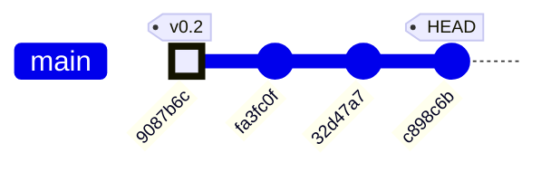

| Commit | Date | Summary | Subsystems touched |
|--------|------|---------|--------------------|
| `9087b6c` | May 7 | **64×64 mask → ESP32 → HUB75 panel + pot lerp** — Initial working pipeline: YOLO silhouette, serial framing, HUB75 DMA rendering, pot-controlled color | CV pipeline, serial protocol, ESP32 firmware |
| `fa3fc0f` | May 8 | Archive stale `agent_outputs/`, fix doc-hook auto-commit loop | Repo hygiene, CI |
| `32d47a7` | May 8 | Fix pot description — triggers white→red effect, not brightness | Docs |
| `c898c6b` | May 9 | **Waveshare pin-numbering fix** + finger-glove mode (MODE_FINGERTIPS), button debounce, MediaPipe integration, mode-aware protocol | ESP32 firmware, serial protocol, CV pipeline, hardware docs |

### Subsystem evolution across commits

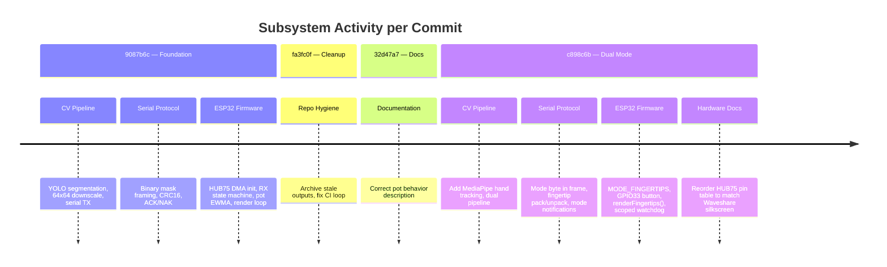

**Key architectural milestone at `c898c6b`:** The system evolves from a single-purpose silhouette display into a mode-switchable platform. The ESP32 is now the mode authority (physical button), and the Mac adapts its TX format based on upstream notifications. This inverts the original control flow where the Mac was the sole driver.

### System Architecture

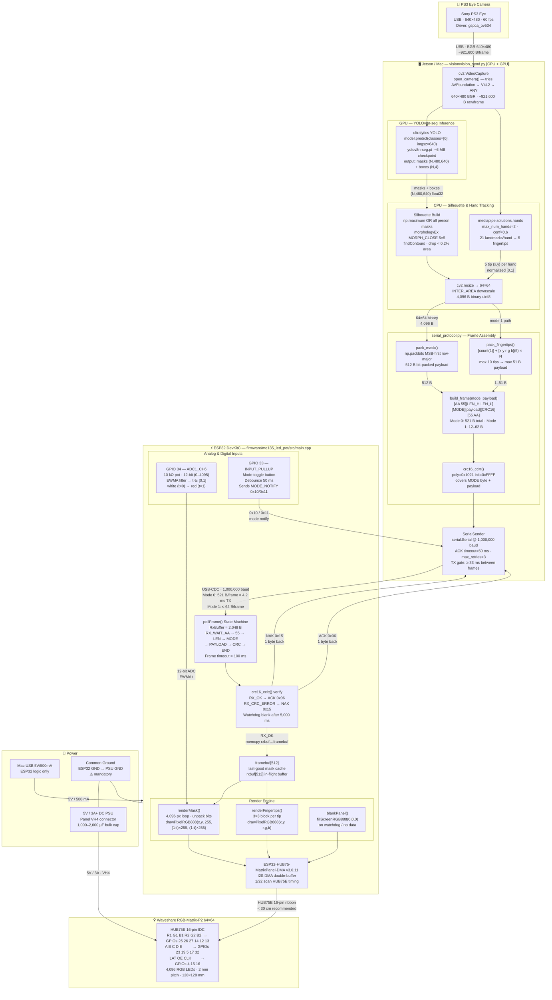

| Layer | Key Numbers |
|---|---|
| Camera raw frame | 640 × 480 × 3 B = **921,600 B** |
| YOLO inference size | 640 px letterboxed (GPU) |
| Silhouette at panel res | 64 × 64 = **4,096 B** (binary) |
| Bit-packed payload (Mode 0) | **512 B** (64 × 64 / 8) |
| Full framed packet (Mode 0) | **521 B** = 2+2+1+512+2+2 |
| Baud rate | **1,000,000 baud** USB-CDC |
| TX time per frame | ≈ **4.2 ms** → headroom for 30 fps |
| ESP32 RX buffer | **2,048 B** |
| Watchdog blank timeout | **5,000 ms** no-data |
| Panel power | **5 V / 3 A+** (separate PSU) |

### Data Flow

One frame's journey — camera shutter to glowing LED panel.

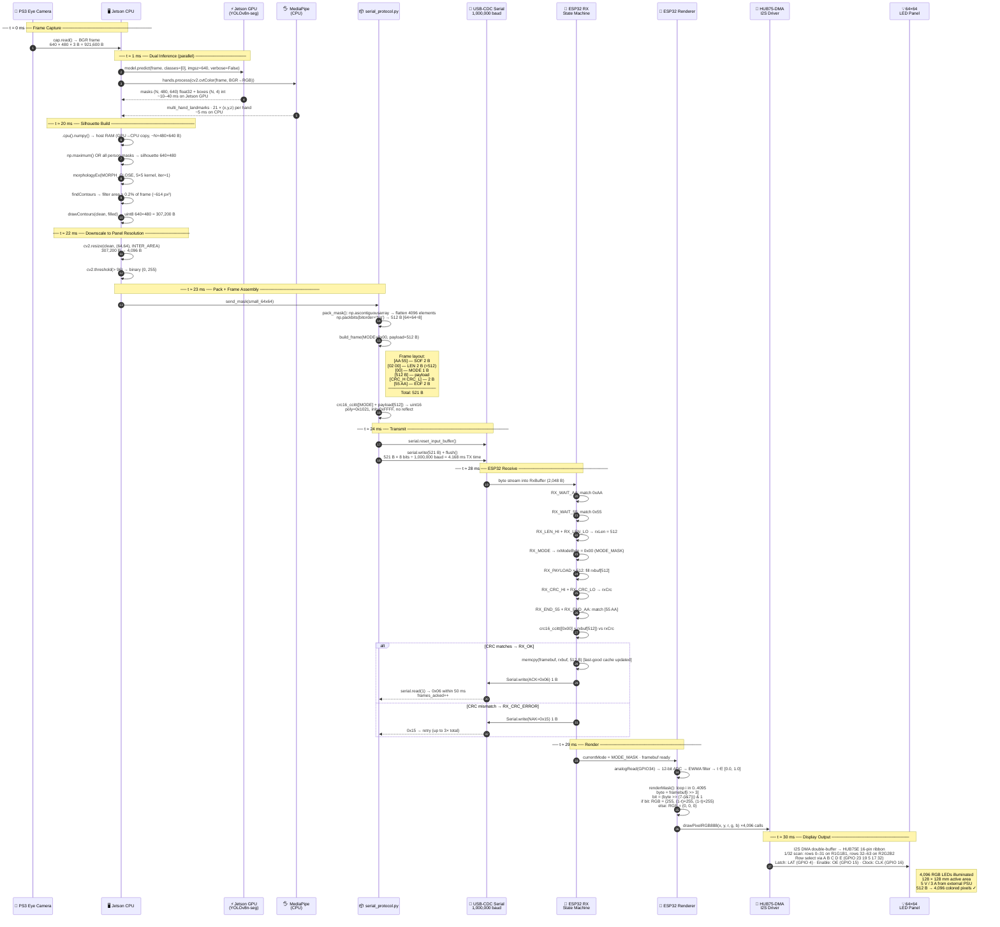

### Byte-count ledger per step

| Step | Data | Size |
|---|---|---|
| Raw camera frame | BGR uint8 640×480 | **921,600 B** |
| YOLO mask tensor (1 person) | float32 480×640 | **1,228,800 B** |
| Binary silhouette (640×480) | uint8 | **307,200 B** |
| Downscaled silhouette | uint8 64×64 | **4,096 B** |
| Bit-packed payload | Mode 0 | **512 B** |
| Full framed packet | SOF+LEN+MODE+payload+CRC+EOF | **521 B** |
| ACK/NAK reply | 1 byte | **1 B** |
| Mode-notify byte | ESP32 → host | **1 B** |
| framebuf cache | on ESP32 | **512 B** |
| Render calls | drawPixelRGB888 × 4,096 | **4,096 calls** |

### Timing budget at 30 fps (33.3 ms/frame)

| Phase | Estimated time |
|---|---|
| cap.read() | ~1 ms |
| YOLO GPU inference | ~10–40 ms |
| MediaPipe CPU | ~5 ms |
| Silhouette + resize | ~2 ms |
| pack + CRC + write | < 1 ms |
| Serial TX (521 B @ 1 Mbaud) | **4.2 ms** |
| ACK round-trip | ~1 ms |
| ESP32 render (4096 px) | ~2 ms |
| **Total (GPU path)** | **~26–56 ms** |

> ⚠️ YOLO is the dominant bottleneck. On Jetson with CUDA the GPU path runs ~15 ms/frame; on a Mac CPU it can exceed 40 ms, limiting effective TX rate below 25 fps.

### Module Dependency Graph

```mermaid
graph TD
  %% ── Entry Points ────────────────────────────────────────────────
  subgraph ENTRY["🚀 Entry Points"]
    VS["**vision_send.py**\n─────────────────\nmain() ← argparse\nautodetect_port()\nopen_camera()\nextract_fingertips()\ndraw_fingertips_camera()\ndraw_fingertips_grid()\nparse_args()"]

    VP["**vision.py**\n─────────────────\nmain() standalone\nopen_camera()\n❌ no serial sender\n[preview + save only]"]

    ORCH["**orchestrator.py**\n─────────────────\nrun_agent() async\nexecute_tool()\nwrite_file / read_file\n7× Claude agent swarm\nMODEL_ARCHITECT / CODER"]

    DA["**doc_agent.py**\n─────────────────\nHistorian agent\nArchitect agent  ← you are here\nCritic agent\ncollect_project_files()\nget_git_context()\ndb_connect() / db_save_*()"]
  end

  %% ── Core Protocol Library ───────────────────────────────────────
  subgraph PROTO["📦 serial_protocol.py — Public Interface"]
    SP_CLASS["**SerialSender** class\n─────────────────\n__init__(port, baudrate,\n  ack_timeout_s, max_retries)\nsend_mask(mask: ndarray) → bool\nsend_fingertips(tips: list) → bool\nread_mode_change() → int|None\nclose()\n─────────────────\nproperties: esp32_mode\ncounters: frames_sent/acked/naked"]

    SP_FN["**Free functions**\n─────────────────\nbuild_frame(mode, payload) → bytes\npack_mask(ndarray) → bytes [512 B]\nunpack_mask(bytes) → ndarray\npack_fingertips(list) → bytes\nunpack_fingertips(bytes) → list\ncrc16_ccitt(data, init) → int"]

    SP_TYPES["**Types / Constants**\n─────────────────\nFingertip(NamedTuple)\n  x, y, r, g, b: int\nPANEL_SIZE = 64\nPAYLOAD_BYTES = 512\nFRAME_START = AA 55\nFRAME_END   = 55 AA\nACK_BYTE = 0x06\nNAK_BYTE = 0x15\nMODE_MASK = 0x00\nMODE_FINGERTIPS = 0x01\nMODE_NOTIFY_0/1 = 0x10/0x11\nMAX_FINGERTIPS = 10"]
  end

  %% ── Doc / Sync system ───────────────────────────────────────────
  subgraph DOCS["📝 Documentation System"]
    GS["**gdrive_sync.py**\n─────────────────\ndetect_features()\nget_changed_files()\nsync_to_drive()\nappend_to_feature_doc()\ncompose_feature_section()\nfeature_to_filename()\nFEATURE_MAP dict\nRCLONE_REMOTE config"]

    GSU["**gdrive_setup.py**\n─────────────────\nmain()\n_create_remote()\nrclone OAuth browser flow\ntest sync to Drive"]
  end

  %% ── Firmware ────────────────────────────────────────────────────
  subgraph FW["⚡ firmware/me135_led_pot/"]
    MAIN_CPP["**main.cpp**\n─────────────────\nsetup() / loop()\npollFrame() RX state machine\nrenderMask()\nrenderFingertips()\nblankPanel()\ncrc16_ccitt() [C impl]\nFingertip struct\nRxState enum"]

    PINI["**platformio.ini**\n─────────────────\nplatform=espressif32@6.5.0\nboard=esp32dev\nframework=arduino\nmonitor_speed=115200"]
  end

  %% ── Python Package Dependencies ─────────────────────────────────
  subgraph PYLIBS["📦 Python Packages (vision/requirements.txt)"]
    YOLO_LIB["**ultralytics ≥ 8.0**\nYOLO class\nyolov8n-seg.pt ~6 MB\nauto-download on first run"]
    CV2_LIB["**opencv-python ≥ 4.8**\ncv2.VideoCapture\ncv2.resize / threshold\ncv2.findContours\ncv2.morphologyEx\ncv2.imshow / waitKey"]
    NP_LIB["**numpy ≥ 1.24**\nndarray · packbits\nmaximum · zeros\nascontiguousarray"]
    SER_LIB["**pyserial ≥ 3.5**\nserial.Serial\nSerial.write / read\nlist_ports.comports()"]
    MP_LIB["**mediapipe**\nmp.solutions.hands\nHands()\nprocess()"]
    ANT_LIB["**anthropic ≥ 0.40**\nAsyncAnthropic\nmessages.stream()\nclaude-opus/sonnet-4-6"]
  end

  %% ── C++ Library Dependencies ────────────────────────────────────
  subgraph CLIBS["📦 C++ / Arduino Libraries (platformio.ini lib_deps)"]
    HUB75_LIB["**ESP32-HUB75-MatrixPanel-DMA v3.0.11**\nMatrixPanel_I2S_DMA\ndrawPixelRGB888()\nfillScreenRGB888()\nI2S DMA HUB75E timing"]
    AGFX["**Adafruit GFX Library v1.11.9**"]
    ABUSIO["**Adafruit BusIO v1.16.1**"]
  end

  %% ── Import edges ────────────────────────────────────────────────

  %% vision_send.py imports
  VS -->|"from serial_protocol import\nFingertip · SerialSender\nMODE_MASK · MODE_FINGERTIPS"| SP_CLASS
  VS -->|"from serial_protocol import\nFingertip · MODE_* consts"| SP_TYPES
  VS -->|"import cv2"| CV2_LIB
  VS -->|"import numpy as np"| NP_LIB
  VS -->|"from ultralytics import YOLO"| YOLO_LIB
  VS -->|"import mediapipe as mp"| MP_LIB

  %% vision.py imports (standalone — NO serial_protocol)
  VP -->|"import cv2"| CV2_LIB
  VP -->|"import numpy as np"| NP_LIB
  VP -->|"from ultralytics import YOLO"| YOLO_LIB

  %% serial_protocol.py imports
  SP_CLASS -->|"import serial\nserial.tools.list_ports"| SER_LIB
  SP_CLASS -->|"import numpy"| NP_LIB
  SP_FN    -->|"import numpy"| NP_LIB
  SP_FN    -->|"import struct"| SP_TYPES

  %% doc_agent.py imports
  DA -->|"import anthropic"| ANT_LIB
  DA -->|"from gdrive_sync import\nsync_to_drive · detect_features\nget_changed_files"| GS

  %% orchestrator.py imports
  ORCH -->|"import anthropic"| ANT_LIB

  %% gdrive_sync → gdrive_setup relationship
  GS  -.->|"delegates rclone OAuth\n(user must run once)"| GSU

  %% firmware deps
  MAIN_CPP -->|"#include"| HUB75_LIB
  PINI     -->|"lib_deps"| HUB75_LIB
  PINI     -->|"lib_deps"| AGFX
  PINI     -->|"lib_deps"| ABUSIO
  HUB75_LIB -->|"depends"| AGFX
  HUB75_LIB -->|"depends"| ABUSIO

  %% ── Cross-system serial wire boundary ──────────────────────────
  SP_CLASS -.->|"⬇ USB-CDC 1 Mbaud\n521 B framed packet\nACK/NAK 1 B reply"| MAIN_CPP

  %% ── Styling ─────────────────────────────────────────────────────
  style SP_CLASS fill:#2d6a4f,color:#fff,stroke:#1b4332
  style SP_FN    fill:#2d6a4f,color:#fff,stroke:#1b4332
  style SP_TYPES fill:#2d6a4f,color:#fff,stroke:#1b4332
  style VS       fill:#1d3557,color:#fff,stroke:#457b9d
  style VP       fill:#1d3557,color:#fff,stroke:#457b9d
  style MAIN_CPP fill:#7b2d8b,color:#fff,stroke:#4a0e59
  style DA       fill:#6b3a1f,color:#fff,stroke:#3d1f0a
  style ORCH     fill:#6b3a1f,color:#fff,stroke:#3d1f0a
```

### Class / Interface Boundaries

| Boundary | Producer | Consumer | Contract |
|---|---|---|---|
| **Python → C firmware** | `SerialSender.send_mask()` | `pollFrame()` state machine | `[AA55][LEN][MODE][payload][CRC16][55AA]` · ACK=0x06 · NAK=0x15 |
| **ESP32 → Python** | `pollFrame()` button handler | `SerialSender.read_mode_change()` | Single byte `0x10` (mode 0) or `0x11` (mode 1) |
| **YOLO → Silhouette** | `model.predict()` GPU tensor | `np.maximum()` CPU loop | `result.masks.data` shape `(N, H, W)` float32 on GPU |
| **MediaPipe → Fingertips** | `hands.process()` CPU | `extract_fingertips()` | `hand_landmarks.landmark[i].{x,y,z}` normalized |
| **pack_mask → build_frame** | `pack_mask(ndarray)` | `build_frame(0x00, bytes)` | Exactly **512 B** or `ValueError` |
| **gdrive_sync → doc_agent** | `sync_to_drive()` | `da.main()` after agents | `list[tuple[str,str]]` sections + `list[dict]` proposals |

### Code Health Summary

**Overall Grade: B**

This is a well-structured, well-documented embedded + vision project with clear separation between the Python host pipeline, serial protocol, and ESP32 firmware. The serial framing protocol is solid — CRC-verified, ACK/NAK with retries, clean state machine on the ESP32 side. Documentation (`WIRING.md`) is exceptional for a course project.

**Strengths:** Clean serial protocol abstraction, defensive firmware (watchdog blanking, debounce, EWMA filtering), thorough hardware troubleshooting docs, proper async agent orchestration.

**Weaknesses:** A deploy-blocking missing dependency (`mediapipe`), stale README that documents wrong CRC scope, significant duplicated logic between `vision.py` and `vision_send.py`, and wasted compute running both ML models every frame regardless of active mode. No path traversal guard on the doc agent's file-read tool.

Two proposals are **must-fix** (PROP-001, PROP-003); the rest improve maintainability and performance with low risk.

### Improvement Proposals

**[PROP-001] Button debounce fires on every LOW read, not on falling edge** — 🔴 high — must-fix

*Problem:* The button handler in `loop()` checks `if (reading == LOW)` inside the debounce window, but it doesn't track whether the button *transitioned* to LOW. If the loop runs faster than DEBOUNCE_MS, the mode toggles once correctly, but on subsequent loops with the button still held, the `(millis() - lastDebounceMs) > DEBOUNCE_MS` check passes again because `lastDebounceMs` is only updated when the reading *changes*. If the button is held steady at LOW for >50ms, the mode will toggle every loop iteration — rapidly flickering between modes.

*Fix:* Add a `buttonPressed` latch: only toggle mode on the falling edge (HIGH→LOW transition after debounce). Set the latch when debounced state transitions to LOW, clear it on transition to HIGH. Classic pattern: track `lastStableState` separately from `lastButtonState`.

**[PROP-002] CRC buffer on stack risks overflow for large payloads** — 🟡 medium — nice-to-have

*Problem:* In `pollFrame()` at the `RX_END_AA` case, a 513-byte `crcBuf[1 + PAYLOAD_BYTES]` is allocated on the stack every time a complete frame arrives. This works for the current 512-byte mask payload, but the stack allocation is fragile — if PAYLOAD_BYTES ever increases, or if the call stack is already deep, this could overflow the ESP32's 8KB default task stack.

*Fix:* Compute CRC incrementally: `crc = crc16_ccitt(&rxModeByte, 1); crc = crc16_ccitt_continue(rxbuf, rxLen, crc);` by adding an `init` parameter to `crc16_ccitt`. Eliminates the copy entirely.

**[PROP-003] Mode-change notification can collide with ACK/NAK bytes** — 🟡 medium — must-fix

*Problem:* The ESP32 sends `0x10`/`0x11` on the same serial line as `0x06` (ACK) and `0x15` (NAK). The Python `_wait_ack()` method reads exactly 1 byte and treats anything other than ACK/NAK as a failure. If the button is pressed between a frame TX and the ACK read, the Mac receives the mode notification instead of the ACK, causing a spurious retry. Conversely, `read_mode_change()` could consume an ACK byte if called at the wrong time.

*Fix:* Buffer incoming bytes in `_wait_ack()` and dispatch: ACK/NAK go to the ack result, 0x10/0x11 go to a mode-change queue. Or use a tiny framing wrapper around notifications so they're unambiguous.

**[PROP-004] Fingertip payload length not validated against actual count** — 🟡 medium — nice-to-have

*Problem:* On the ESP32 side, `fingertipCount = rxbuf[0]` is read and clamped to MAX_FINGERTIPS, but the code doesn't verify that `rxLen >= 1 + fingertipCount * 5`. A truncated packet (e.g., count=10 but only 3 fingertips of data) would read uninitialized `rxbuf` bytes as coordinates and colors.

*Fix:* After reading `fingertipCount`, add: `if (rxLen < 1 + fingertipCount * 5) fingertipCount = (rxLen - 1) / 5;` to clamp to actually-received data.

**[PROP-005] renderMask() recomputes pot color per-pixel unnecessarily** — 🟢 low — nice-to-have

*Problem:* The pot-based color lerp (`cr`, `cg`, `cb`) is computed inside the 4096-iteration pixel loop. Since `last_t` doesn't change within a single render call, this is 4096 redundant float multiplications.

*Fix:* Hoist the color computation above the loop: compute `cr`, `cg`, `cb` once, then use them for all lit pixels. Trivial refactor, measurable on ESP32 at high refresh rates.

**[PROP-006] No version handshake between Mac and ESP32 after protocol change** — 🟢 low — future

*Problem:* The protocol breaking change (adding the MODE byte) means the Mac and ESP32 must be updated in lockstep. There's no version negotiation — if one side is stale, frames will silently fail CRC and the user sees only NAK retries with no explanation.

*Fix:* Add a startup handshake: Mac sends a version-query command, ESP32 replies with protocol version. If mismatched, print a clear error. Could be as simple as a reserved mode byte (e.g., 0xFF) with a 1-byte version payload.

**[PROP-007] ESP32 `pollFrame()` allocates 513-byte CRC buffer on stack every valid frame** — 🟡 medium — nice-to-have

*Problem:* In `main.cpp::pollFrame()`, the CRC verification block declares `uint8_t crcBuf[1 + PAYLOAD_BYTES]` (513 bytes) on the stack inside the `RX_END_AA` case. ESP32's default task stack is 8 KB. This 513-byte allocation plus the existing `rxbuf[512]` and `framebuf[512]` globals is safe today, but if called from a deeper call chain or a FreeRTOS task with a smaller stack, it risks stack overflow with no warning.

*Fix:* Make `crcBuf` a static local (`static uint8_t crcBuf[...]`) or compute the CRC incrementally: `crc = crc16_ccitt(&rxModeByte, 1); crc = crc16_ccitt(rxbuf, rxLen, crc);` — the existing `crc16_ccitt` already accepts an `init` parameter. This eliminates the copy and the stack allocation entirely.

**[PROTO-001] CRC scope mismatch between README and firmware** — 🟡 medium — must-fix

*Problem:* firmware/me135_led_pot/README.md states the CRC covers 'the 512-byte payload only', but both serial_protocol.py (build_frame) and main.cpp (RX_END_AA handler) compute CRC over [MODE byte + payload]. Any third-party implementation built from the README alone will produce wrong CRCs and get NAK-looped forever.

*Fix:* Update README.md wire-protocol section to read: 'CRC-16/CCITT-FALSE over [MODE(1 B) + payload(N B)]. Total CRC input = 513 B for Mode 0.' Add a worked hex example.

**[FW-001] pot_ewma uninitialised on first render call (-1.0f sentinel leaks to color)** — 🟢 low — nice-to-have

*Problem:* In main.cpp, pot_ewma = -1.0f and last_t = -1.0f are set as globals. renderMask() uses `float t = (last_t > 0.0f) ? last_t : 0.0f`, so t=0 on the first frame. However, the EWMA update only runs in loop() after a frame is received. If a frame arrives before the first analogRead() EWMA tick (which can happen at 1 Mbaud), last_t remains -1 and the guard saves it. The guard is correct but the intent is opaque — a named constant would be clearer, and the first ADC read should occur in setup().

*Fix:* In setup(), call analogRead(POT_PIN) once and initialise pot_ewma = analogRead(POT_PIN) / 4095.0f; last_t = pot_ewma; to guarantee a valid color on the first rendered frame. Remove the sentinel -1.0f pattern.

**[FW-002] Watchdog blanks panel at 5 s but lastFrameMs is only reset on RX_OK, not on retries** — 🟢 low — nice-to-have

*Problem:* The 5,000 ms watchdog in loop() compares millis() - lastFrameMs. lastFrameMs is updated only on RX_OK. During retry storms (3 retries × 50 ms ACK timeout = up to 200 ms delay per frame) or a brief cable disconnect, the panel blanks even though the host is actively sending. At 30 fps the host retransmits every 33 ms; 5 s / 33 ms = 151 consecutive failed frames before blanking, which is reasonable — but is undocumented.

*Fix:* Document the watchdog behaviour in a comment. Optionally add a separate 'last_rx_attempt_ms' timestamp updated whenever any valid SOF (0xAA 0x55) is seen, and use that for a shorter connectivity indicator (e.g., blink an LED) while keeping the 5 s blank threshold for full silence.

---
