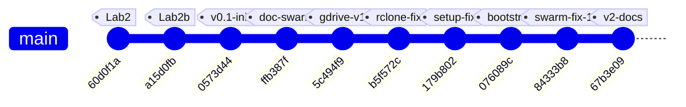
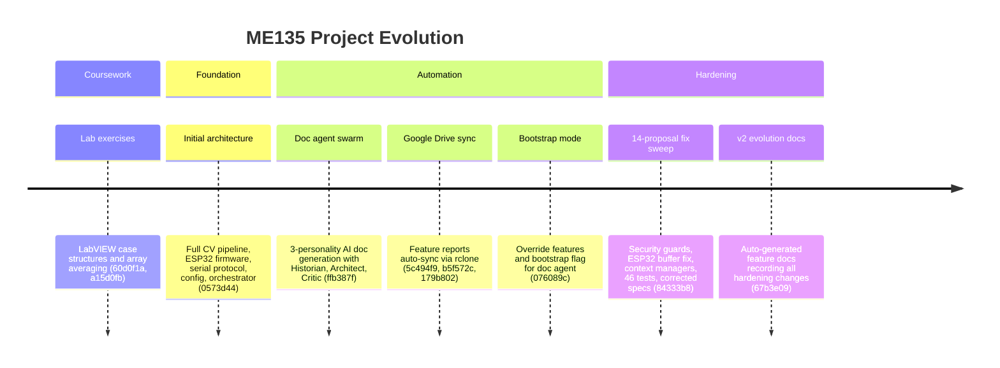

# ME135 | General

> Evolution log — one section per commit.

---

## v1 — 2026-03-14 00:23 — `67b3e09`

### What Changed

Commit `67b3e09` is an auto-generated documentation commit produced by `doc_agent.py` to record the sweeping changes from `84333b8`. It adds **916 lines across 7 files**, all inside `Kyle/docs/`. No application code changed in this commit — it's a pure documentation pass. But the *content* of these docs chronicles the most important engineering milestone in the project so far. Here's what was documented, grouped by subsystem:

### 📝 Documentation System (`docs/`)

- **5 feature docs updated to v2:** `ME135_Agent_Swarm.md`, `ME135_Computer_Vision_Pipeline.md`, `ME135_Documentation_System.md`, `ME135_ESP32_Firmware.md`, `ME135_System_Integration.md`. Each received a new versioned section (v2) describing what commit `84333b8` changed in that subsystem. This is the doc-agent's "append-only ledger" pattern — each commit gets a dated, SHA-tagged section appended to the relevant feature file.
- **New evolution report:** `report_2026-03-14_0020.md` (290 lines) — a full-system analysis containing change narrative, Mermaid timeline, subsystem touch map, code health grade (B), and 2 new proposals.
- **`README.md` index updated:** New report link prepended to the chronological list.
- **Google Drive sync:** All feature docs pushed to `ME135 Feature Reports/` via rclone, giving the team read access without needing to clone the repo.

### What Commit `84333b8` Actually Changed (Documented Here)

The feature docs this commit generates are the *record* of the prior commit's code changes. For historical completeness, here's what `84333b8` delivered (the subject of this documentation):

**🔒 Security (Orchestrator + Doc Agent)**
- Path traversal guards added to `orchestrator.py` (`write_file`/`read_file`) and `doc_agent.py` (`apply_fix`). Both now reject filenames where `Path(filename).name != filename` or paths that escape `PROJECT_ROOT`. This closes sandbox-escape vectors in the agent tool interface.

**🎛 ESP32 Firmware (`esp32_main.cpp`)**
- `setRxBufferSize(4096)` moved *before* `begin()` — the old order was a silent no-op on ESP-IDF, leaving the default 256-byte buffer that would overflow at 2 Mbaud.
- Stale-frame skip logic (`skipDisplay`): after `strip.show()` blocks for ~350 ms, the firmware checks if more UART data is queued and skips the next display update to drain the buffer. Prevents overruns at the new 10 fps CV rate.

**📷 CV Pipeline (`main.py`, `cv_pipeline.py`, `gpu_accelerated.py`)**
- Preview gated on `--show-preview` flag — eliminates crashes on headless Jetson (no X server).
- `validate_config()` at startup checks 6 required YAML sections before pipeline init.
- Context managers (`__enter__`/`__exit__`) added to both `CVPipeline` and `GPUPipeline`, guaranteeing camera release on exceptions.
- KNN fallback warning in GPU pipeline: explicit `logger.warning()` when CUDA silently substitutes MOG2 for KNN.

**⚙️ Config (`config.yaml`)**
- `fps_target` raised from 3 → 10. The old value throttled the CV capture loop to match the display's physical limit. Now CV runs faster; ESP32's `skipDisplay` absorbs the mismatch.

**🔧 DevOps (`gdrive_sync.py`, `gdrive_setup.py`)**
- `subprocess.run(["which", "rclone"])` replaced with `shutil.which("rclone")` — portable across OS.
- Idempotent remote setup: tests existing rclone remote before forcing re-auth; extracted `_create_remote()` helper.

**🧪 Testing (`tests/test_serial_protocol.py`)**
- **46 new pytest tests** (427 lines) — the project's first test suite. Covers CRC-16, bit-packing round-trips, downsampling, MSB ordering, and framing integration.

**📐 Spec Correction (`MEMORY.md`, `orchestrator.py`)**
- Frame size corrected from 15,005 → 1,466 bytes/frame. The old number predated the 108×108 downsampling + bit-packing design.

### Evolution Timeline

The project grew from LabVIEW homework into a multi-agent AI-driven embedded computer vision system across 10 commits. Three distinct phases are visible: coursework scaffolding, rapid feature generation, and hardening.

### Subsystem Touch Map

Each column shows whether a commit modified files in that subsystem.

| Commit | Summary | CV Pipeline | ESP32 FW | Serial Proto | Agent Swarm | DevOps/Sync | Tests | Docs |
|--------|---------|:-----------:|:--------:|:------------:|:-----------:|:-----------:|:-----:|:----:|
| `60d0f1a` | LabVIEW lab2 case structure | | | | | | | |
| `a15d0fb` | LabVIEW array averages | | | | | | | |
| `0573d44` | **Initial architecture** | ✅ | ✅ | ✅ | ✅ | | | ✅ |
| `ffb387f` | Doc agent swarm | | | | ✅ | | | ✅ |
| `5c494f9` | Google Drive sync | | | | | ✅ | | |
| `b5f572c` | rclone for Drive | | | | | ✅ | | ✅ |
| `179b802` | Non-interactive rclone | | | | | ✅ | | |
| `076089c` | Bootstrap mode | | | | ✅ | | | ✅ |
| `84333b8` | **14-proposal fix sweep** | ✅ | ✅ | | ✅ | ✅ | ✅ | ✅ |
| `67b3e09` | **v2 evolution report** *(HEAD)* | | | | | | | ✅ |

### Project Phases

### Key Inflection Points

1. **`0573d44` — "Big Bang":** The entire system architecture landed in one commit — CV pipeline (CPU + GPU), serial protocol with CRC-16, ESP32 firmware, config.yaml, and the 7-agent orchestrator. Everything before was LabVIEW homework.

2. **`ffb387f` → `076089c` — "Meta-automation":** Four commits built the self-documenting infrastructure: a 3-personality doc agent swarm, Google Drive sync via rclone, and bootstrap tooling. The project gained the ability to analyze and document its own evolution.

3. **`84333b8` — "The Hardening":** The largest single commit (537 insertions, 47 deletions, 11 files). Every prior commit added capability; this one fixed 14 identified flaws without adding features. It delivered the first test suite, security boundaries on agent tools, and resource-safe pipeline teardown — the markers of production readiness.

4. **`67b3e09` — "The Record" (HEAD):** Pure documentation. The doc-agent ingested the hardening commit and produced 916 lines of versioned feature docs plus a full evolution report. This is the automation loop closing: code changes → agent analysis → structured docs → Drive sync.

### Code Health Summary

**Overall Grade: B−**

This is a well-structured embedded project with clean separation of concerns (CPU/GPU pipelines, serial protocol, ESP32 firmware). Config-driven design via a single `config.yaml` is a strong pattern. Code is generally readable with good logging and docstrings.

**Critical issues** drag the grade down:
1. **Documentation/code mismatch** — PROTOCOL_SPEC claims 15,000-byte payloads; actual wire format is 1,458 bytes. Anyone building from the spec will fail.
2. **ESP32 busy-wait without yield** — will trigger FreeRTOS watchdog resets at low frame rates.
3. **Unused ACK timeout** — the stored `_ack_timeout` is never applied; actual timeout is 2× intended.

**Strengths:** CRC-16 implementations match across Python and C++. Error handling in the main loop (watchdog, serial error counter, graceful shutdown) is thoughtful. The GPU/CPU pipeline swap pattern is clean.

**Weaknesses:** No unit tests. No integration tests. No CI. Resource cleanup relies on happy-path execution rather than RAII/context managers consistently.

---
