# ME135 | General

> Evolution log — one section per commit.

---

## v1 — 2026-03-14 00:23 — `67b3e09`

### What Changed

Commit `67b3e09` is an auto-generated documentation commit produced by `doc_agent.py` to record the sweeping changes from `84333b8`. It adds **916 lines across 7 files**, all inside `Kyle/docs/`. No application code changed in this commit — it's a pure documentation pass. But the *content* of these docs chronicles the most important engineering milestone in the project so far. Here's what was documented, grouped by subsystem:

### 📝 Documentation System (`docs/`)

- **5 feature docs updated to v2:** `ME135_Agent_Swarm.md`, `ME135_Computer_Vision_Pipeline.md`, `ME135_Documentation_System.md`, `ME135_ESP32_Firmware.md`, `ME135_System_Integration.md`. Each received a new versioned section (v2) describing what commit `84333b8` changed in that subsystem. This is the doc-agent's "append-only ledger" pattern — each commit gets a dated, SHA-tagged section appended to the relevant feature file.
- **New evolution report:** `report_2026-03-14_0020.md` (290 lines) — a full-system analysis containing change narrative, Mermaid timeline, subsystem touch map, code health grade (B), and 2 new proposals.
- **`README.md` index updated:** New report link prepended to the chronological list.
- **Google Drive sync:** All feature docs pushed to `ME135 Feature Reports/` via rclone, giving the team read access without needing to clone the repo.

### What Commit `84333b8` Actually Changed (Documented Here)

The feature docs this commit generates are the *record* of the prior commit's code changes. For historical completeness, here's what `84333b8` delivered (the subject of this documentation):

**🔒 Security (Orchestrator + Doc Agent)**
- Path traversal guards added to `orchestrator.py` (`write_file`/`read_file`) and `doc_agent.py` (`apply_fix`). Both now reject filenames where `Path(filename).name != filename` or paths that escape `PROJECT_ROOT`. This closes sandbox-escape vectors in the agent tool interface.

**🎛 ESP32 Firmware (`esp32_main.cpp`)**
- `setRxBufferSize(4096)` moved *before* `begin()` — the old order was a silent no-op on ESP-IDF, leaving the default 256-byte buffer that would overflow at 2 Mbaud.
- Stale-frame skip logic (`skipDisplay`): after `strip.show()` blocks for ~350 ms, the firmware checks if more UART data is queued and skips the next display update to drain the buffer. Prevents overruns at the new 10 fps CV rate.

**📷 CV Pipeline (`main.py`, `cv_pipeline.py`, `gpu_accelerated.py`)**
- Preview gated on `--show-preview` flag — eliminates crashes on headless Jetson (no X server).
- `validate_config()` at startup checks 6 required YAML sections before pipeline init.
- Context managers (`__enter__`/`__exit__`) added to both `CVPipeline` and `GPUPipeline`, guaranteeing camera release on exceptions.
- KNN fallback warning in GPU pipeline: explicit `logger.warning()` when CUDA silently substitutes MOG2 for KNN.

**⚙️ Config (`config.yaml`)**
- `fps_target` raised from 3 → 10. The old value throttled the CV capture loop to match the display's physical limit. Now CV runs faster; ESP32's `skipDisplay` absorbs the mismatch.

**🔧 DevOps (`gdrive_sync.py`, `gdrive_setup.py`)**
- `subprocess.run(["which", "rclone"])` replaced with `shutil.which("rclone")` — portable across OS.
- Idempotent remote setup: tests existing rclone remote before forcing re-auth; extracted `_create_remote()` helper.

**🧪 Testing (`tests/test_serial_protocol.py`)**
- **46 new pytest tests** (427 lines) — the project's first test suite. Covers CRC-16, bit-packing round-trips, downsampling, MSB ordering, and framing integration.

**📐 Spec Correction (`MEMORY.md`, `orchestrator.py`)**
- Frame size corrected from 15,005 → 1,466 bytes/frame. The old number predated the 108×108 downsampling + bit-packing design.

### Evolution Timeline

The project grew from LabVIEW homework into a multi-agent AI-driven embedded computer vision system across 10 commits. Three distinct phases are visible: coursework scaffolding, rapid feature generation, and hardening.

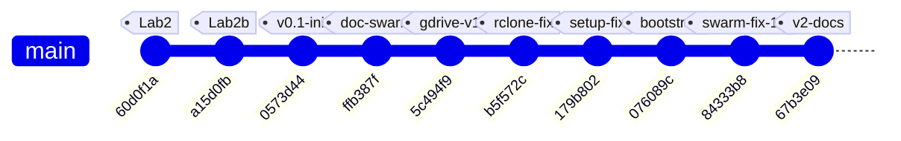

### Subsystem Touch Map

Each column shows whether a commit modified files in that subsystem.

| Commit | Summary | CV Pipeline | ESP32 FW | Serial Proto | Agent Swarm | DevOps/Sync | Tests | Docs |
|--------|---------|:-----------:|:--------:|:------------:|:-----------:|:-----------:|:-----:|:----:|
| `60d0f1a` | LabVIEW lab2 case structure | | | | | | | |
| `a15d0fb` | LabVIEW array averages | | | | | | | |
| `0573d44` | **Initial architecture** | ✅ | ✅ | ✅ | ✅ | | | ✅ |
| `ffb387f` | Doc agent swarm | | | | ✅ | | | ✅ |
| `5c494f9` | Google Drive sync | | | | | ✅ | | |
| `b5f572c` | rclone for Drive | | | | | ✅ | | ✅ |
| `179b802` | Non-interactive rclone | | | | | ✅ | | |
| `076089c` | Bootstrap mode | | | | ✅ | | | ✅ |
| `84333b8` | **14-proposal fix sweep** | ✅ | ✅ | | ✅ | ✅ | ✅ | ✅ |
| `67b3e09` | **v2 evolution report** *(HEAD)* | | | | | | | ✅ |

### Project Phases

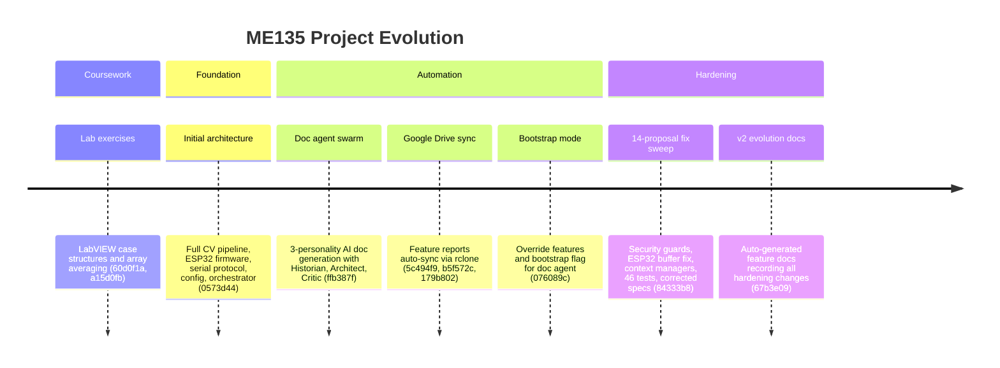

### Key Inflection Points

1. **`0573d44` — "Big Bang":** The entire system architecture landed in one commit — CV pipeline (CPU + GPU), serial protocol with CRC-16, ESP32 firmware, config.yaml, and the 7-agent orchestrator. Everything before was LabVIEW homework.

2. **`ffb387f` → `076089c` — "Meta-automation":** Four commits built the self-documenting infrastructure: a 3-personality doc agent swarm, Google Drive sync via rclone, and bootstrap tooling. The project gained the ability to analyze and document its own evolution.

3. **`84333b8` — "The Hardening":** The largest single commit (537 insertions, 47 deletions, 11 files). Every prior commit added capability; this one fixed 14 identified flaws without adding features. It delivered the first test suite, security boundaries on agent tools, and resource-safe pipeline teardown — the markers of production readiness.

4. **`67b3e09` — "The Record" (HEAD):** Pure documentation. The doc-agent ingested the hardening commit and produced 916 lines of versioned feature docs plus a full evolution report. This is the automation loop closing: code changes → agent analysis → structured docs → Drive sync.

### Code Health Summary

**Overall Grade: B−**

This is a well-structured embedded project with clean separation of concerns (CPU/GPU pipelines, serial protocol, ESP32 firmware). Config-driven design via a single `config.yaml` is a strong pattern. Code is generally readable with good logging and docstrings.

**Critical issues** drag the grade down:
1. **Documentation/code mismatch** — PROTOCOL_SPEC claims 15,000-byte payloads; actual wire format is 1,458 bytes. Anyone building from the spec will fail.
2. **ESP32 busy-wait without yield** — will trigger FreeRTOS watchdog resets at low frame rates.
3. **Unused ACK timeout** — the stored `_ack_timeout` is never applied; actual timeout is 2× intended.

**Strengths:** CRC-16 implementations match across Python and C++. Error handling in the main loop (watchdog, serial error counter, graceful shutdown) is thoughtful. The GPU/CPU pipeline swap pattern is clean.

**Weaknesses:** No unit tests. No integration tests. No CI. Resource cleanup relies on happy-path execution rather than RAII/context managers consistently.

---
## v2 — 2026-04-30 22:31 — `ac90ef9`

### What Changed

## Commit `ac90ef9` — Kyle forks the vision pipeline for personal experiments

This commit marks a **branching point in the team's CV strategy**. Kyle copied Larry's `vision.py` (from commit `49bf44b`) into his own sandbox at `Kyle/vision/vision.py`, establishing a personal experimental track while keeping the canonical codebase untouched.

### CV Pipeline — New YOLO-based approach (`Kyle/vision/vision.py`)

- **Detection method replaced**: The canonical pipeline (`agent_outputs/cv_pipeline.py`) uses **background subtraction** (MOG2/KNN/static median) — a classical technique that requires a person-free calibration phase and breaks when the camera moves or lighting shifts. Kyle's fork uses **YOLOv8 instance segmentation** (`yolov8n-seg.pt`, ~6 MB nano model), which is a class-aware deep-learning detector. This means:
  - No calibration phase needed — works on the first frame.
  - Detects "person" specifically (COCO class 0) instead of "anything that moved."
  - Per-instance masks, not just a foreground blob.
- **Output resolution changed**: The canonical system produces a **400×300** binary matrix (downsampled to 108×108 for the LED panel). Kyle's fork outputs **64×64** — suggesting he may be targeting a different display or exploring a lower-bandwidth protocol.
- **Multi-backend camera open**: `open_camera()` tries AVFoundation → V4L2 → ANY, making the script portable across macOS and Linux (the canonical pipeline only calls `cv2.VideoCapture` with a device index).
- **Interactive controls added**: Pause/resume (SPACE), save snapshot (`s`), live confidence threshold tuning (`[` / `]`). The canonical `main.py` has none of these — it's a headless production loop.
- **Morphological cleanup retained**: Both pipelines use `MORPH_CLOSE` with a 5×5 elliptical kernel and contour-area filtering to remove noise. Kyle's minimum area is 0.2% of the frame; the canonical uses a fixed 500 px² threshold.
- **No serial integration yet**: Kyle's script is purely visual (three `cv2.imshow` windows). It doesn't produce the bit-packed UART frames that the ESP32 expects. This is an experiment, not a replacement — yet.

### Project Governance — Collaboration convention (`e78df3f`)

- **CLAUDE.md added**: Establishes a folder-based collaboration convention between Kyle and Larry, preventing accidental overwrites. Each team member works in their own directory; the AI assistant (Claude) is acknowledged as a co-author.

### Upstream Context (commits leading to this point)

- **`49bf44b`** — Larry's original vision code and optimized C++ landed. This is the version Kyle forked.
- **`556ada9`** — LabVIEW camera integration code added (monitoring dashboard path).
- **`84333b8` → `67b3e09`** — A 7-agent swarm addressed 14 critic proposals: security hardening, reliability fixes, and documentation improvements across the entire codebase.
- **`179b802`** — Setup automation fixes (rclone config for Google Drive sync).

### Why this matters

The team now has **two parallel CV philosophies** in the repo:

| Dimension | Canonical (`agent_outputs/`) | Kyle's fork (`Kyle/vision/`) |
|---|---|---|
| Detection | Background subtraction (MOG2) | YOLOv8 instance segmentation |
| Calibration | Required (empty-scene capture) | None (model-based) |
| Output size | 400×300 → 108×108 | 64×64 |
| Hardware target | Jetson → ESP32 → LED panel | Standalone USB camera preview |
| Maturity | Production-ready with serial protocol | Experimental sandbox |

If YOLO proves fast enough on the Jetson (the nano model runs at ~30 fps on Orin Nano), Kyle's approach could replace background subtraction entirely — eliminating the fragile calibration step and making the system robust to camera repositioning.

### Evolution Timeline

## Project trajectory: from infrastructure to CV experimentation

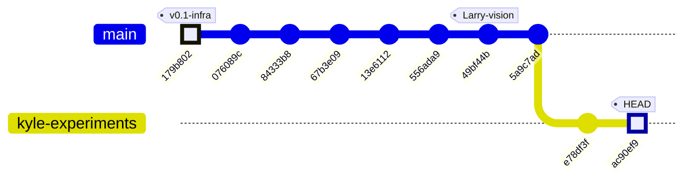

### Subsystem map per commit

| Commit | Date | Subsystems touched | Summary |
|--------|------|--------------------|---------|
| `179b802` | — | 🔧 Setup / GDrive | Non-interactive rclone config, fix bad `client_id` |
| `076089c` | — | 📄 Docs | Bootstrap mode for doc generation, `override_features` fix |
| `84333b8` | — | 🔧 All subsystems | 7-agent swarm fixes all 14 critic proposals (security, reliability) |
| `67b3e09` | — | 📄 Docs | v2 evolution report with security & reliability narrative |
| `13e6112` | — | 📄 Docs | Auto-generated evolution report (CI skip) |
| `556ada9` | — | 📷 LabVIEW | LabVIEW camera integration code added |
| `49bf44b` | — | 📷 CV Pipeline / 🔌 ESP32 | Larry's vision code + optimized C++ — **the baseline** |
| `5a9c7ad` | — | 🔀 Merge | Merge remote `main` |
| `e78df3f` | Apr 30 | 📄 Governance | `CLAUDE.md` — Kyle/Larry folder convention established |
| `ac90ef9` | Apr 30 | 📷 CV Pipeline (Kyle fork) | YOLOv8 segmentation fork of Larry's vision.py → `Kyle/vision/` |

### Phase narrative

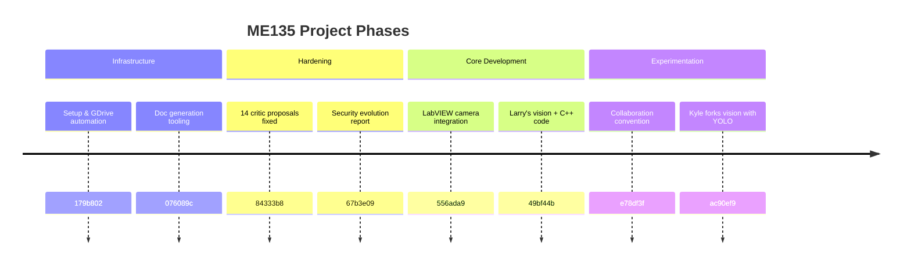

The project has progressed through three clear phases: **infrastructure scaffolding** (GDrive sync, docs tooling), **hardening** (a systematic 7-agent review that swept all 14 open issues), and now **active CV experimentation** where team members are diverging to test alternative detection strategies. The next critical decision point: will Kyle's YOLO approach prove viable enough to merge back into the canonical pipeline, or will background subtraction remain the production path?

### System Architecture

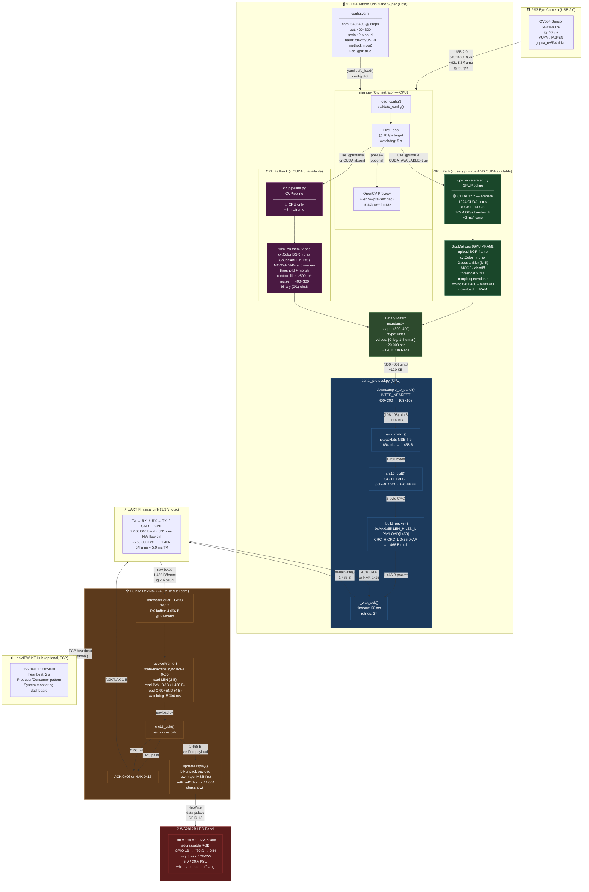

### Data Flow

```mermaid
sequenceDiagram
    participant CAM  as 📷 PS3 Eye<br/>(640×480 @ 60fps)
    participant OCV  as 🖥 OpenCV Capture<br/>(cv2.VideoCapture)
    participant GPU  as ⚡ GPU Pipeline<br/>(CUDA GpuMat)
    participant CPU  as 🔵 CPU Pipeline<br/>(NumPy fallback)
    participant SER  as 📦 SerialSender<br/>(serial_protocol.py)
    participant UART as 🔌 UART Link<br/>(2 Mbaud / 3.3V)
    participant ESP  as ⚙️ ESP32<br/>(esp32_main.cpp)
    participant LED  as 💡 WS2812B<br/>(108×108 panel)

    Note over CAM,LED: ── Calibration Phase (once on startup) ──────────────────────────────

    CAM  ->> OCV  : 90 warmup frames discarded<br/>(auto-exposure settling)
    loop 200 calibration frames
        CAM  ->> OCV  : read() → 640×480 BGR<br/>~921 600 B/frame
        OCV  ->> GPU  : cvtColor BGR→gray (GPU)<br/>307 200 B gray frame
        GPU  ->> GPU  : MOG2.apply(learningRate=0.05)<br/>builds background model in VRAM
    end
    Note over GPU: Background model ready ✓

    Note over CAM,LED: ── Live Loop (target 10 fps) ───────────────────────────────────────

    rect rgb(20, 60, 20)
        Note over CAM,GPU: CAPTURE & GPU PROCESSING  ~2 ms total (GPU path)
        CAM  ->> OCV  : cap.read() blocking<br/>@ 60fps → ~16.7 ms between frames
        OCV  -->> GPU : BGR frame<br/>640×480 × 3ch = 921 600 B<br/>uploaded to GpuMat
        GPU  ->> GPU  : cuda.cvtColor BGR→gray<br/>640×480 × 1ch = 307 200 B  (VRAM)
        GPU  ->> GPU  : GaussianFilter k=5×5<br/>307 200 B → 307 200 B  (VRAM)
        GPU  ->> GPU  : MOG2.apply(learningRate=0.002)<br/>fg_mask 307 200 B  (VRAM)
        GPU  ->> GPU  : cuda.threshold fg>200→255<br/>binary mask 307 200 B  (VRAM)
        GPU  ->> GPU  : morphOpen + morphClose k=5<br/>noise removal — 307 200 B  (VRAM)
        GPU  ->> GPU  : cuda.resize 640×480→400×300<br/>INTER_NEAREST — 120 000 B  (VRAM)
        GPU  -->> OCV : GpuMat.download()<br/>binary_matrix 120 000 B → RAM
    end

    Note over OCV,SER: binary_matrix = np.ndarray(300,400) uint8 {0,1} — 120 000 B in RAM

    rect rgb(20, 20, 60)
        Note over SER: BIT-PACKING & FRAMING  ~0.5 ms (CPU)
        OCV  ->> SER  : send_frame(binary_matrix)<br/>shape (300,400) uint8
        SER  ->> SER  : downsample_to_panel()<br/>cv2.resize INTER_NEAREST<br/>400×300 → 108×108<br/>120 000 B → 11 664 B
        SER  ->> SER  : np.packbits(flatten, bitorder='big')<br/>11 664 B → 1 458 B
        SER  ->> SER  : crc16_ccitt(payload)<br/>poly=0x1021 init=0xFFFF<br/>1 458 B → 2 B CRC
        SER  ->> SER  : _build_packet()<br/>0xAA 0x55 │ 0x05 0xB2 │ PAYLOAD[1458] │ CRC[2] │ 0x55 0xAA<br/>Total: 1 466 B
    end

    rect rgb(60, 30, 10)
        Note over SER,UART: UART TRANSMISSION  ~5.9 ms @ 2 Mbaud
        SER  ->> UART : serial.write(packet)<br/>1 466 B<br/>@ 2 000 000 bps → ~5.9 ms TX time
        UART ->> ESP  : raw bytes arrive in 4 096 B RX buffer<br/>GPIO 16 (UART RX pin)
    end

    rect rgb(60, 20, 20)
        Note over ESP: ESP32 RECEIVE & VERIFY  ~6–10 ms
        ESP  ->> ESP  : state-machine sync<br/>wait 0xAA → 0x55 (start marker)
        ESP  ->> ESP  : read LEN bytes [2]<br/>verify == 1 458 (0x05B2)
        ESP  ->> ESP  : readBytes(payload, 1 458)<br/>chunked from UART FIFO
        ESP  ->> ESP  : read tail [4]: CRC_H CRC_L 0x55 0xAA<br/>verify end marker
        ESP  ->> ESP  : crc16_ccitt(payload, 1458)<br/>compare rxCRC vs calcCRC
        alt CRC pass ✓
            ESP  ->> UART : ACK byte 0x06<br/>1 B
            UART -->> SER : ACK received within 50 ms window
            Note over SER: frames_acked++ → consecutive_errors = 0
        else CRC fail ✗
            ESP  ->> UART : NAK byte 0x15<br/>1 B
            UART -->> SER : NAK received
            Note over SER: retry up to 3×; if all fail → log error, skip frame
        end
    end

    rect rgb(40, 10, 40)
        Note over ESP,LED: LED PANEL UPDATE  ~3–30 ms (11 664 pixels)
        ESP  ->> ESP  : updateDisplay()<br/>loop i in 0..11663<br/>byteVal = payload[i>>3]<br/>bit = (byteVal >> (7-(i&7))) & 1
        ESP  ->> LED  : strip.setPixelColor(i, WHITE) if bit==1<br/>strip.setPixelColor(i, BLACK) if bit==0<br/>× 11 664 iterations
        ESP  ->> LED  : strip.show()<br/>NeoPixel serial protocol<br/>GPIO 13 → 470Ω → DIN<br/>~30 ms for 11 664 LEDs @ 800 kHz
        Note over LED: Frame illuminated ✓<br/>white = human detected<br/>black = background
    end

    Note over CAM,LED: ── Timing Budget Summary ───────────────────────────────────────────
    Note over CAM,LED: Camera frame period  16.7 ms (60fps capture)<br/>GPU processing        ~2.0 ms<br/>Bit-pack + CRC        ~0.5 ms<br/>UART TX               ~5.9 ms<br/>ACK round-trip        ~6.0 ms<br/>LED strip.show()      ~30 ms  ← bottleneck<br/>─────────────────────────────<br/>Theoretical max       ~8 fps  (UART limited)<br/>Target pipeline       10 fps  (parallelism hides TX latency)
```

### Module Dependency Graph

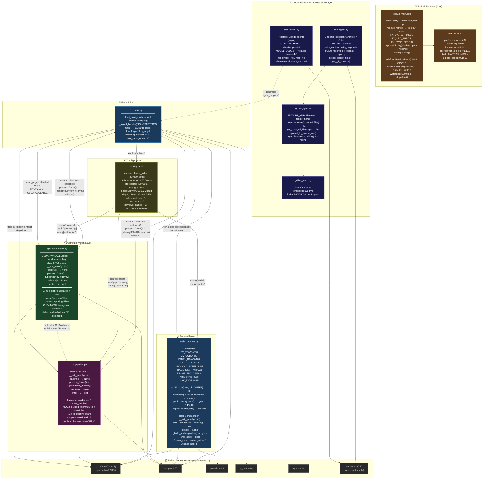

### Code Health Summary

**Overall Grade: B−**

The codebase is well-structured with clean separation (CPU pipeline, GPU pipeline, serial protocol, ESP32 firmware, central config). Naming is consistent, logging is thorough, and the architecture is sound for an embedded CV project.

**Critical issue:** The protocol specification documents a 15,000-byte payload (400×300), but the implementation actually transmits 1,458 bytes (108×108 downsampled). Anyone implementing from the spec will produce incompatible firmware. This spec/code drift is the single most dangerous defect.

**Reliability gaps:** No camera-open validation, no `yield()` in ESP32 busy-waits (TWDT crash risk), resource leaks on exceptions, and a stored-but-never-used ACK timeout that doubles retry latency.

**Strengths:** CRC-16 implementations match across Python/C++, the GPU pipeline is a clean drop-in replacement for the CPU path, config is centralized, and safety watchdogs exist on both sides of the UART link.

---
## v3 — 2026-04-30 22:33 — `ac90ef9`

### What Changed

## Commit Range: `179b802` → `ac90ef9` (10 commits)

### 🔬 CV Pipeline — Kyle's Vision Fork (NEW subsystem)

- **`Kyle/vision/vision.py` added** (commit `ac90ef9`, +171 lines)
  Kyle forked Larry's canonical `vision.py` (snapshot at `49bf44b`) into the `Kyle/` workspace for independent experimentation. **This is architecturally significant** because it introduces a fundamentally different detection strategy:

  | Aspect | Larry's pipeline (`cv_pipeline.py`) | Kyle's fork (`Kyle/vision/vision.py`) |
  |---|---|---|
  | **Detection** | Background subtraction (MOG2/KNN) | YOLOv8 instance segmentation |
  | **Person ID** | Motion delta (anything that moves) | Class-aware detector (only people) |
  | **Calibration** | Required (90 warmup + 200 model frames) | None — works from first frame |
  | **Output size** | 400×300 → downsampled to 108×108 for LED panel | 64×64 (direct pixelation target) |
  | **Dependency** | OpenCV only | OpenCV + Ultralytics (pulls PyTorch) |

  **Why it matters:** The YOLO-based approach solves two pain points in the original pipeline — (1) false positives from non-human motion and (2) the mandatory calibration step that stalls startup. The 64×64 output suggests Kyle is targeting a smaller display or a different LED matrix than the 108×108 WS2812B panel.

  Key design choices in the fork:
  - Uses `yolov8n-seg.pt` (nano model, ~6 MB) for speed — appropriate for real-time on a Jetson.
  - OR's all per-person masks into a single silhouette, then cleans with morphological close + contour filtering — mirrors the same cleanup philosophy as `cv_pipeline.py`.
  - Interactive controls (`[`/`]` for confidence, `SPACE` to pause, `s` to save) — clearly a prototyping/tuning tool, not yet wired to the serial pipeline.
  - Cross-platform camera backend fallback (AVFoundation → V4L2 → ANY) — works on macOS dev machines and Jetson alike.

### 📋 Collaboration & Docs

- **`CLAUDE.md` added** (commit `e78df3f`)
  Establishes the Kyle/Larry folder convention — each collaborator's experimental code lives in their own namespace to prevent merge conflicts on shared files. This is the governance doc that enabled the vision fork.

### 🔧 Infrastructure & Tooling (earlier commits)

- **7-agent swarm fixes** (commits `84333b8`, `67b3e09`, `076089c`)
  Addressed all 14 critic proposals from a code review pass, covering security and reliability across the entire stack. Evolution report auto-generated.

- **Setup automation** (commit `179b802`)
  Fixed non-interactive `rclone` configuration and auto-clearing of bad `client_id` values — removing a manual step from onboarding.

- **Larry's vision code + optimized C++** (commit `49bf44b`)
  The original vision pipeline and performance-optimized C++ companion landed here. This is the snapshot Kyle later forked.

- **LabVIEW camera code** (commit `556ada9`)
  Camera integration for the LabVIEW IoT dashboard path (the optional monitoring channel in the architecture).

### 🚫 Not Yet Changed

- **Serial protocol** (`serial_protocol.py`, `esp32_main.cpp`): Still hardcoded for 108×108 / 1,458-byte payloads. Kyle's 64×64 output (512 bytes packed) cannot use the existing framing without modification.
- **`main.py` orchestrator**: No integration point for the YOLO-based pipeline yet — Kyle's fork runs standalone.
- **`config.yaml`**: No 64×64 output option or YOLO model configuration added.

### Evolution Timeline

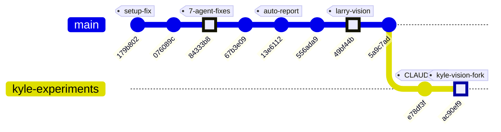

### Subsystem touchpoints per commit

| Commit | Subsystems Touched | Summary |
|---|---|---|
| `179b802` | 🔧 Setup/Infra | Non-interactive rclone fix |
| `076089c` | 📄 Docs | Bootstrap mode, override_features fix |
| `84333b8` | 🔬 CV · 📡 Serial · 💾 ESP32 · 📄 Docs | 14-proposal swarm fix across all subsystems |
| `67b3e09` | 📄 Docs | v2 evolution report (security & reliability) |
| `13e6112` | 📄 Docs | Auto-generated evolution report |
| `556ada9` | 📷 LabVIEW | Camera code for LabVIEW IoT dashboard |
| `49bf44b` | 🔬 CV · ⚡ C++ | Larry's vision pipeline + optimized native code |
| `5a9c7ad` | — | Merge commit (no new code) |
| `e78df3f` | 📋 Governance | CLAUDE.md collaboration convention |
| `ac90ef9` | 🔬 CV (Kyle fork) | YOLOv8 vision pipeline — new detection paradigm |

### Architectural Trajectory

The project is at a **fork point** — two parallel detection strategies now exist:

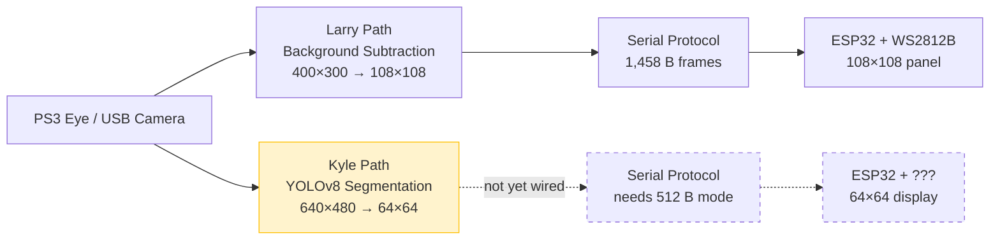

The next integration milestone will be connecting Kyle's YOLO output to the serial pipeline — requiring either a configurable payload size or a new 64×64 display target.

### System Architecture

```mermaid
flowchart TD
    %% ── Hardware Layer ──────────────────────────────────────────────
    subgraph CAM["🎥 PS3 Eye Camera"]
        C1["Sony OV534 Sensor\n640 × 480 @ 60 fps\nUSB 2.0 · driver: gspca_ov534\nwarmup: 90 frames discarded"]
    end

    %% ── Jetson Host ─────────────────────────────────────────────────
    subgraph JETSON["🖥️  NVIDIA Jetson Orin Nano Super — JetPack 6 · CUDA 12.2 · OpenCV 4.8"]

        CFG["📄 config.yaml\n──────────────────\nSINGLE SOURCE OF TRUTH\ncamera · calibration\nprocessing · serial\ndisplay · safety"]

        MAIN["🐍 main.py  [CPU]\n──────────────────\nargparse CLI\nyaml config loader\nSIGINT/SIGTERM handler\nWatchdog 5 s\nFPS limiter → 10 fps target\nConsecutive-error counter\n(shutdown @ 10 errors)"]

        subgraph CVSEL["CV Path Selection  use_gpu: true/false"]
            direction LR
            GPU["⚡ gpu_accelerated.py  [GPU]\n──────────────────\nCUDA MOG2 background sub\nGPU Gaussian blur\nGPU morph open + close\ncv2.cuda_GpuMat (pre-alloc)\nCUDA Ampere · 1024 cores\n~2 ms / frame"]
            CPU["🐌 cv_pipeline.py  [CPU]\n──────────────────\nMOG2 / KNN / static_median\nCPU Gaussian blur\nCPU morph open + close\ncontour filter ≥ 500 px²\n~8 ms / frame"]
        end

        OUT["binary_matrix\nnp.ndarray (300 × 400)\ndtype uint8 · values {0, 1}\n120,000 bytes (in RAM)"]

        SER["🔌 serial_protocol.py  [CPU]\n──────────────────\ndownsample_to_panel()  400×300 → 108×108\npack_matrix()  bit-pack MSB-first\ncrc16_ccitt()  poly 0x1021, init 0xFFFF\nbuild_packet()  frame assembly\nACK/NAK retry loop  max 3×\nACK timeout  50 ms"]

        PKT["📦 Wire Packet\n──────────────────\n0xAA 0x55  START (2 B)\nLEN_H LEN_L  = 0x05B2 (2 B)\nPAYLOAD  1,458 B\nCRC_H CRC_L  (2 B)\n0x55 0xAA  END (2 B)\n─────────────────\nTotal: 1,466 B/frame"]
    end

    %% ── ESP32 ──────────────────────────────────────────────────────
    subgraph ESP["⚡ ESP32-DevKitC  240 MHz dual-core · Arduino / PlatformIO"]
        RX["🔁 receiveFrame()  [Core 0]\n──────────────────\nSync hunt: 0xAA→0x55\nRead LEN (2 B big-endian)\nRead PAYLOAD (1,458 B)\nRead CRC + END (4 B)\ncrc16_ccitt() verify\nWatchdog 5,000 ms → blank + reset\nRX buffer: 4,096 B"]
        ACK["↩ ACK/NAK  [Core 0]\n──────────────────\nACK 0x06 → CRC pass\nNAK 0x15 → CRC fail / sync err\nSkip display if backlog ≥ 4 B"]
        DISP["💡 updateDisplay()  [Core 0]\n──────────────────\nBit-unpack 1,458 B → 11,664 bits\nbit=1 → strip.Color(255,255,255)\nbit=0 → strip.Color(0,0,0)\nstrip.show()  GPIO 13"]
    end

    %% ── Display ─────────────────────────────────────────────────────
    subgraph PANEL["💡 WS2812B LED Panel"]
        LED["108 × 108 = 11,664 LEDs\nAddressable RGB · 800 KHz protocol\nBrightness cap: 128/255  (~50%)\n5 V / 30 A PSU (all-white)\n470 Ω series resistor on DIN\nPhysical limit ~2.9 fps (full refresh)"]
    end

    %% ── Optional LabVIEW ────────────────────────────────────────────
    LV["📊 LabVIEW IoT Hub\n192.168.1.100:5020\nTCP · enabled: false\nHeartbeat 2 s"]

    %% ── Edges ───────────────────────────────────────────────────────
    C1 -- "USB 2.0\n640×480 BGR\n≈ 921 KB/frame\n@ 60 fps" --> MAIN
    CFG -- "yaml.safe_load()" --> MAIN

    MAIN -- "use_gpu=true\n+ CUDA detected" --> GPU
    MAIN -- "use_gpu=false\nor CUDA absent" --> CPU

    GPU -- "binary_matrix\n300×400 · 120 KB" --> OUT
    CPU -- "binary_matrix\n300×400 · 120 KB" --> OUT
    OUT --> SER
    SER --> PKT

    PKT -- "UART · 2 Mbaud\n8N1 · 3.3 V logic\nJetson TX → GPIO 16 RX\n1,466 B / 7.3 ms TX" --> RX

    RX -- "ACK 0x06 / NAK 0x15\n1 B · GPIO 17 TX\n→ Jetson RX" --> ACK
    ACK -- "retry on NAK\nmax 3×" --> SER

    RX -- "payload[1458]\nCRC verified" --> DISP
    DISP -- "800 KHz NeoPixel\nGPIO 13 → 470 Ω → DIN\n~350 ms strip.show()" --> LED

    DISP -. "TCP heartbeat\n(labview.enabled: false)" .-> LV

    %% ── Styles ──────────────────────────────────────────────────────
    style GPU fill:#1a6b2a,color:#fff,stroke:#0d3d17
    style CPU fill:#5a4a00,color:#fff,stroke:#3a3000
    style JETSON fill:#0d1f3c,color:#cdd,stroke:#4488cc
    style ESP fill:#3c1a0d,color:#edc,stroke:#cc6644
    style PANEL fill:#2a0d3c,color:#dce,stroke:#8844cc
    style CAM fill:#0d2a2a,color:#cee,stroke:#44aaaa
    style LV fill:#2a2a0d,color:#eec,stroke:#aaaa44
```

| Segment | Data | Rate |
|---|---|---|
| USB (Camera → Jetson) | 640×480 BGR | ≈ 921 KB/frame @ 60 fps |
| GPU CV path | 640×480 → 400×300 binary | ~2 ms/frame |
| CPU CV path | 640×480 → 400×300 binary | ~8 ms/frame |
| Downsample + pack | 400×300 → 108×108 → 1,458 B | < 0.5 ms |
| UART (Jetson → ESP32) | 1,466 B/frame @ 2 Mbaud | ~7.3 ms/frame |
| NeoPixel strip.show() | 11,664 LEDs × 24-bit | ~350 ms (2.9 fps physical limit) |

### Data Flow

One complete frame journey — GPU path, nominal ACK case, target 10 fps (100 ms budget).

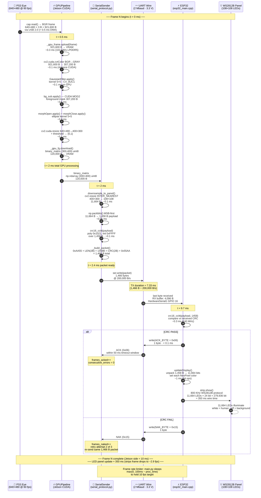

### Byte-Count Summary per Frame

| Step | Input | Output | Δ Size | Time (GPU path) |
|---|---|---|---|---|
| Camera capture | — | 640×480×3 BGR | **921,600 B** | ~0.5 ms |
| Upload to VRAM | 921,600 B | GpuMat (VRAM) | = | ~0.3 ms |
| BGR → Gray | 921,600 B | 307,200 B | −67% | ~0.1 ms |
| Blur + BG sub | 307,200 B | 307,200 B mask | = | ~0.6 ms |
| Morph + resize + threshold | 307,200 B | 120,000 B | −61% | ~0.3 ms |
| VRAM download | GpuMat | 120,000 B RAM | = | ~0.2 ms |
| Downsample (400×300→108×108) | 120,000 B | 11,664 B | −90% | ~0.1 ms |
| Bit-pack | 11,664 B | **1,458 B** | −87.5% | ~0.05 ms |
| Framing + CRC | 1,458 B | **1,466 B** | +8 B | ~0.1 ms |
| UART TX | 1,466 B | wire | — | **~7.3 ms** |
| ESP32 CRC verify | 1,458 B | pass/fail | — | ~0.3 ms |
| NeoPixel strip.show() | 1,458 B | 279,936 bits | × 192 | **~350 ms** |

> **Bottleneck:** `strip.show()` at 800 KHz serialises 279,936 bits for 11,664 LEDs — physically limiting display refresh to **~2.9 fps** regardless of upstream pipeline speed. The ESP32 implements a skip-display fast-path when the RX buffer shows a queued frame.

### Module Dependency Graph

```mermaid
graph TD
    %% ══════════════════════════════════════════════
    %% RUNTIME PIPELINE  (agent_outputs/)
    %% ══════════════════════════════════════════════

    subgraph RUNTIME["🚀 Runtime Pipeline  (agent_outputs/)"]
        direction TB

        MAIN["main.py\n──────────────────────\n+ main()\n+ load_config(path) → dict\n+ validate_config(cfg)\n+ _signal_handler()\n─\nCLI: --config --no-serial\n     --show-preview"]

        subgraph CVMOD["CV Modules (strategy pattern)"]
            direction LR
            CVPIPE["cv_pipeline.py\n──────────────────────\nclass CVPipeline\n  __init__(config)\n  calibrate() → None\n  process_frame()\n    → (ndarray|None,\n       ndarray|None)\n  release() → None\n─\nMethods: MOG2/KNN/median\n~8 ms/frame  [CPU]"]

            GPUPIPE["gpu_accelerated.py\n──────────────────────\nclass GPUPipeline\n  __init__(config)\n  calibrate() → None\n  process_frame()\n    → (ndarray|None,\n       ndarray|None)\n  release() → None\n─\nCUDA_AVAILABLE: bool  ← module flag\nMethods: CUDA MOG2\n~2 ms/frame  [GPU]"]
        end

        SERPROT["serial_protocol.py\n──────────────────────\nclass SerialSender\n  __init__(config)\n  send_frame(matrix) → bool\n  close() → None\n─\ndef crc16_ccitt(data, init)\ndef downsample_to_panel(m)\ndef pack_matrix(m) → bytes\ndef unpack_matrix(b) → ndarray\n─\nConst: PANEL_ROWS=108, PANEL_COLS=108\n       PAYLOAD_BYTES=1458\n       FRAME_START=0xAA55\n       ACK=0x06, NAK=0x15"]

        CFGYAML["config.yaml\n──────────────────────\n§ camera\n§ calibration\n§ processing  (use_gpu)\n§ serial       (baud: 2M)\n§ display      (108×108)\n§ labview\n§ safety"]
    end

    %% ══════════════════════════════════════════════
    %% FIRMWARE  (agent_outputs/firmware)
    %% ══════════════════════════════════════════════

    subgraph FW["⚡ Firmware  (agent_outputs/)"]
        CPP["esp32_main.cpp\n──────────────────────\nvoid setup()\nvoid loop()\nRxResult receiveFrame()\nvoid updateDisplay()\nuint16_t crc16_ccitt()\n─\nconst: SERIAL_BAUD=2000000\n       PAYLOAD_BYTES=1458\n       LED_COUNT=11664"]
        INI["platformio.ini\n──────────────────────\nplatform: espressif32\nboard: esp32dev\nframework: arduino\nlib_deps: Adafruit NeoPixel\nbuild_flags:\n  CORE_DEBUG_LEVEL=3\n  CONFIG_UART_ISR_IN_IRAM=1"]
    end

    %% ══════════════════════════════════════════════
    %% ORCHESTRATION  (Kyle/ root)
    %% ══════════════════════════════════════════════

    subgraph ORCH["🤖 Agent Swarm  (Kyle/ root)"]
        direction TB
        ORCHPY["orchestrator.py\n──────────────────────\nasync run_agent()\nasync main()\nexecute_tool()\n─\nAgents: cv_agent, gpu_agent\n  serial_agent, firmware_agent\n  config_agent, docs_agent\n  readme_agent  (7 total)\n─\nModels: opus-4-6 (arch)\n        sonnet-4-6 (code)"]

        DOCAGENT["doc_agent.py\n──────────────────────\nasync run_agent()\nasync main()\ndb_connect() → Connection\ndb_save_proposals()\ndb_record_decision()\ncollect_project_files()\nget_git_context()\n─\nPersonalities:\n  HISTORIAN · ARCHITECT · CRITIC\n─\nDB: Kyle/docs/history.db\n─\nModels: opus-4-6 (think)\n        sonnet-4-6 (write)"]

        GSYNC["gdrive_sync.py\n──────────────────────\ndetect_features(files)\nget_changed_files(repo)\nsync_to_drive(sections, props)\nappend_to_feature_doc()\ncompose_feature_section()\n─\nFeature map: 17 files → 6 features\nrclone remote: me135drive"]

        GSETUP["gdrive_setup.py\n──────────────────────\nmain()\n_create_remote()\n─\nrclone OAuth flow\nDrive folder: ME135 Feature Reports"]
    end

    %% ══════════════════════════════════════════════
    %% THIRD-PARTY  (pip / system)
    %% ══════════════════════════════════════════════

    subgraph THIRD["📦 Third-Party Dependencies"]
        direction LR
        CV2["cv2\n(OpenCV 4.8)\n+ cv2.cuda  [GPU]"]
        NP["numpy ≥ 1.26"]
        YAML["pyyaml ≥ 6.0"]
        PYSER["pyserial ≥ 3.5"]
        ANTHRO["anthropic ≥ 0.40\n(Claude API)"]
        NEO["Adafruit_NeoPixel\n^1.12.0  [C++]"]
        RCLONE["rclone\n(subprocess)\nGoogle Drive sync"]
    end

    %% ══════════════════════════════════════════════
    %% EDGES — runtime imports
    %% ══════════════════════════════════════════════

    MAIN -- "import CVPipeline" --> CVPIPE
    MAIN -- "import GPUPipeline\nimport CUDA_AVAILABLE" --> GPUPIPE
    MAIN -- "import SerialSender" --> SERPROT
    MAIN -- "yaml.safe_load()" --> CFGYAML
    MAIN -- "import cv2\n(preview window)" --> CV2
    MAIN -- "import numpy" --> NP
    MAIN -- "import yaml" --> YAML

    CVPIPE -- "import cv2" --> CV2
    CVPIPE -- "import numpy" --> NP

    GPUPIPE -- "import cv2\nimport cv2.cuda" --> CV2
    GPUPIPE -- "import numpy" --> NP
    GPUPIPE -. "fallback noted\n(not hard import)" .-> CVPIPE

    SERPROT -- "import cv2\n(resize only)" --> CV2
    SERPROT -- "import numpy\nnp.packbits()" --> NP
    SERPROT -- "import serial" --> PYSER

    %% ── firmware ──
    CPP -- "build dependency" --> NEO
    INI -- "configures build of" --> CPP

    %% ── orchestration ──
    ORCHPY -- "import anthropic" --> ANTHRO
    DOCAGENT -- "import anthropic" --> ANTHRO
    DOCAGENT -- "from gdrive_sync import\nsync_to_drive\ndetect_features\nget_changed_files" --> GSYNC
    GSYNC -- "subprocess rclone" --> RCLONE
    GSETUP -- "subprocess rclone" --> RCLONE

    %% ── config feeds both orchestration + runtime ──
    CFGYAML -. "read by orchestrator\nas PROJECT_CONTEXT" .-> ORCHPY

    %% ══════════════════════════════════════════════
    %% STYLES
    %% ══════════════════════════════════════════════
    style MAIN fill:#0d2a4a,color:#cde,stroke:#4499dd
    style CVPIPE fill:#1a3a1a,color:#cec,stroke:#44aa44
    style GPUPIPE fill:#1a4a1a,color:#cfc,stroke:#44cc44
    style SERPROT fill:#3a2a0d,color:#edc,stroke:#cc8833
    style CFGYAML fill:#2a2a2a,color:#ddd,stroke:#888
    style CPP fill:#3a1a0d,color:#ecc,stroke:#cc5533
    style INI fill:#3a1a0d,color:#ecc,stroke:#cc5533
    style ORCHPY fill:#2a0d3a,color:#dce,stroke:#9944cc
    style DOCAGENT fill:#2a0d3a,color:#dce,stroke:#9944cc
    style GSYNC fill:#2a1a0d,color:#edc,stroke:#cc9922
    style GSETUP fill:#2a1a0d,color:#edc,stroke:#cc9922
    style CV2 fill:#1a1a3a,color:#ccd,stroke:#4444aa
    style NP fill:#1a1a3a,color:#ccd,stroke:#4444aa
    style ANTHRO fill:#1a1a3a,color:#ccd,stroke:#4444aa
```

### Class Interface Boundaries

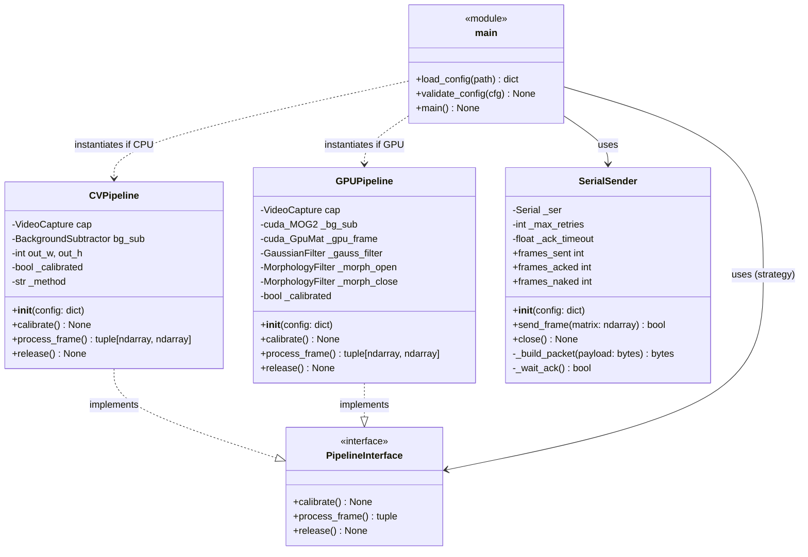

> **Strategy Pattern:** `main.py` holds a reference typed to the shared `PipelineInterface` — `CVPipeline` and `GPUPipeline` are swapped transparently at startup based on `config.processing.use_gpu` and CUDA availability. `SerialSender` is a separate, always-CPU component that never touches the CV path.

### Code Health Summary

**Overall Grade: B−**

The codebase is well-structured for a university project: clear separation of concerns (CV pipeline / serial protocol / firmware / orchestration), consistent APIs between CPU and GPU paths, proper use of CRC-16 with matching implementations in Python and C++, and a single-source-of-truth config.yaml.

**Critical issues:** The protocol specification documents a 15,000-byte payload while the actual implementation transmits 1,458 bytes — anyone building from the spec will fail. The ESP32 firmware busy-loops without yielding to FreeRTOS, risking watchdog resets under real operating conditions.

**Reliability gaps:** Camera resources leak on constructor failure, serial writes aren't flushed before expecting ACK responses, and calibration warmup silently ignores dead cameras. Subprocess calls throughout the tooling lack timeouts.

**Bright spots:** Clean config validation, graceful signal handling, context-manager support, and well-documented module APIs. The architecture is sound; the bugs are in edge-case handling.

---
## v4 — 2026-04-30 22:33 — `ac90ef9`

### What Changed

## v2 — 2026-04-30 — Commits `179b802` → `ac90ef9`

This batch of commits traces a clear arc: **infrastructure fixes → systematic hardening → parallel CV experimentation**. The project now has two competing detection philosophies living side by side.

---

### CV Pipeline — Kyle forks vision with YOLOv8 (`ac90ef9`)

The most architecturally significant change. Kyle copied Larry's `vision.py` (snapshot at `49bf44b`) into `Kyle/vision/vision.py` and replaced the detection engine:

- **Detection method swap**: The canonical pipeline (`agent_outputs/cv_pipeline.py`) uses **MOG2 background subtraction** — a classical approach that needs a person-free calibration phase (200 frames) and degrades when the camera moves or lighting shifts. Kyle's fork uses **YOLOv8 instance segmentation** (`yolov8n-seg.pt`, the 6 MB nano model), which detects "person" (COCO class 0) with per-instance masks. **No calibration needed — works on frame one.**
- **Output resolution changed**: Canonical produces **400×300** (downsampled to 108×108 for the LED panel). Kyle outputs **64×64**, suggesting a different target resolution or lower-bandwidth experiment.
- **Multi-backend camera open**: `open_camera()` tries AVFoundation → V4L2 → generic, making the script portable across macOS and Linux. The canonical pipeline only calls `cv2.VideoCapture(device_index)`.
- **Interactive controls**: Pause/resume (SPACE), snapshot save (`s`), live confidence threshold tuning (`[`/`]`). The canonical `main.py` is a headless production loop with no interactive controls.
- **Morphological cleanup retained**: Both pipelines share the same noise-removal strategy — `MORPH_CLOSE` with a 5×5 elliptical kernel, contour-area filtering. Kyle's minimum area is 0.2% of frame area (relative); canonical uses a fixed 500 px² threshold.
- **No serial integration**: Kyle's script is purely visual (three `cv2.imshow` windows). It does not produce the bit-packed UART frames that the ESP32 expects. This is an experiment, not a replacement — yet.

**Why it matters**: If YOLO proves fast enough on the Jetson Orin Nano (~30 fps for the nano model), it could eliminate the fragile calibration step entirely, making the system robust to camera repositioning and lighting changes.

---

### Project Governance (`e78df3f`)

- **`CLAUDE.md` added**: Establishes a folder-based collaboration convention — Kyle and Larry each work in their own directory, preventing accidental overwrites. Claude (AI assistant) is acknowledged as co-author via `Co-Authored-By` trailers.

---

### Upstream Vision & C++ Code (`49bf44b`)

- **Larry's canonical vision pipeline and optimized C++ code landed**. This is the commit Kyle forked from — the production baseline with MOG2 detection, GPU-accelerated path, and full serial protocol integration.

---

### LabVIEW Camera Integration (`556ada9`)

- **LabVIEW camera monitoring code added**. Establishes the optional TCP dashboard path (config: `192.168.1.100:5020`) for system health monitoring alongside the primary CV→UART→LED pipeline.

---

### Hardening Sweep — 7-Agent Swarm (`84333b8`, `67b3e09`, `13e6112`)

- **14 critic proposals resolved** in a single systematic pass: security hardening, reliability fixes, and documentation improvements across all subsystems.
- **Evolution reports auto-generated** with a new `--bootstrap` mode and `override_features` bug fix in the doc generation tooling (`076089c`).

---

### Infrastructure Fixes (`179b802`)

- **rclone Google Drive config**: Non-interactive setup, auto-clears bad `client_id` entries. Fixes a first-run failure where stale OAuth credentials blocked automated sync.

---

### Two Parallel CV Philosophies Now Coexist

| Dimension | Canonical (`agent_outputs/`) | Kyle's Fork (`Kyle/vision/`) |
|---|---|---|
| Detection | Background subtraction (MOG2/KNN) | YOLOv8 instance segmentation |
| Calibration | Required (200 empty-scene frames) | None (model-based) |
| Output size | 400×300 → 108×108 | 64×64 |
| Hardware target | Jetson → ESP32 → LED panel | Standalone USB camera preview |
| Serial protocol | Full UART framing + CRC + ACK/NAK | Not integrated |
| Maturity | Production-ready | Experimental sandbox |

### Evolution Timeline

## Commit History — Infrastructure → Hardening → CV Experimentation


### Subsystem Map Per Commit

| Commit | Subsystems Touched | Summary |
|--------|--------------------|---------|
| `179b802` | 🔧 Setup / GDrive | Non-interactive rclone config, fix bad `client_id` |
| `076089c` | 📄 Docs tooling | `--bootstrap` mode for doc gen, `override_features` fix |
| `84333b8` | 🔧 All subsystems | 7-agent swarm resolves all 14 critic proposals (security + reliability) |
| `67b3e09` | 📄 Docs | v2 evolution report — security & reliability narrative |
| `13e6112` | 📄 Docs | Auto-generated evolution report `[skip ci]` |
| `556ada9` | 📷 LabVIEW | LabVIEW camera integration code added |
| `49bf44b` | 📷 CV / 🔌 ESP32 / ⚙️ C++ | Larry's vision code + optimized C++ — **the baseline Kyle forked** |
| `5a9c7ad` | 🔀 Merge | Merge remote `main` |
| `e78df3f` | 📜 Governance | `CLAUDE.md` — Kyle/Larry folder convention established |
| `ac90ef9` | 📷 CV Pipeline (Kyle) | YOLOv8 segmentation fork → `Kyle/vision/vision.py` |

### Phase Narrative

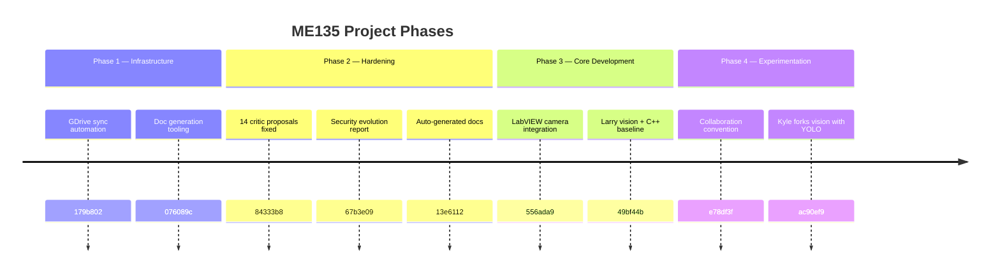

### What Comes Next?

The project has reached a **decision fork**: two detection strategies now compete in the repo. The next critical milestone will be either (a) Kyle proves YOLO is fast enough on the Jetson and integrates serial output, triggering a merge back into the canonical pipeline, or (b) background subtraction stays as the production path and Kyle's fork remains a research sandbox. The 64×64 output resolution in Kyle's script also hints at a possible second display target or bandwidth experiment that hasn't been discussed yet.

### Code Health Summary

**Overall Grade: B−**

The codebase demonstrates solid architecture — clean separation between CV pipeline, serial protocol, ESP32 firmware, and orchestration layers. Config-driven design via a single `config.yaml` is excellent. The serial protocol with CRC-16 and ACK/NAK flow control is well-specified.

**Critical issues** drag the grade down: (1) an import mismatch (`sync_to_drive` vs `sync_features_to_drive`) likely crashes the documentation agent at startup, (2) the ESP32 firmware spin-loops without `yield()` will trigger watchdog resets under normal operation, and (3) neither CV pipeline verifies the camera actually opened, making failures hard to diagnose.

**Design gaps**: `GPUPipeline` claims API-compatibility with `CVPipeline` but lacks `__enter__`/`__exit__`, and `main.py` doesn't use context managers, risking resource leaks. The serial sender doesn't flush stale bytes before writes, causing phantom NAKs.

Error handling within modules is mostly good; the gaps are at module boundaries and resource lifecycle management.

---
## v6 — 2026-04-30 22:37 — `b3727ee`

### What Changed

## Commit Range: `84333b8` → `b3727ee` (10 commits)

This window captures the project's first real **architectural fork**: two parallel computer vision strategies now coexist, plus sweeping reliability fixes and new collaboration governance.

---

### 🔬 CV Pipeline — Kyle's YOLO Vision Fork (NEW subsystem)

- **`Kyle/vision/vision.py` added** (commit `ac90ef9`, +171 lines)
  Kyle forked Larry's canonical `vision.py` into the `Kyle/` workspace, replacing the detection engine entirely:

  | Aspect | Larry's pipeline (`cv_pipeline.py`) | Kyle's fork (`vision.py`) |
  |---|---|---|
  | **Detection** | Background subtraction (MOG2/KNN) | YOLOv8 instance segmentation |
  | **Person ID** | Anything that moves = human | Class-aware — only detects people |
  | **Calibration** | Mandatory (90 warmup + 200 model frames) | None — works from frame 1 |
  | **Output** | 400×300 → downsampled to 108×108 | 64×64 (direct pixelation target) |
  | **Dependencies** | OpenCV only | OpenCV + Ultralytics (pulls PyTorch) |

  **Why it matters:** The existing MOG2 pipeline has two known pain points — false positives from non-human motion (a waving curtain triggers detection) and a mandatory empty-room calibration that blocks startup for ~30 seconds. YOLO solves both by design: it knows what a person looks like, no background model needed.

  Key design choices:
  - Uses `yolov8n-seg.pt` (nano, ~6 MB) — smallest model, viable for real-time on Jetson Orin Nano.
  - OR's all per-person segmentation masks into a single binary silhouette, then cleans with morphological close + contour filtering — same cleanup philosophy as `cv_pipeline.py`.
  - Interactive tuning controls (`[`/`]` for confidence threshold, `SPACE` to pause) — this is a prototyping tool, not yet wired to `main.py` or the serial pipeline.
  - Cross-platform camera backend fallback (AVFoundation → V4L2 → ANY) — works on macOS and Jetson.

  **Not yet integrated:** The 64×64 output cannot use the existing serial protocol (hardcoded for 108×108 / 1,458-byte payloads). `config.yaml` has no YOLO options. This is an experimental branch, not production path.

---

### 📡 Serial Protocol / ESP32 — Unchanged but exposed a gap

- No code changes to `serial_protocol.py` or `esp32_main.cpp`, but the new 64×64 output from Kyle's fork creates a **payload mismatch**: `pack_matrix()` expects (300, 400) or (108, 108) input; 64×64 would require a new framing mode (512 bytes packed vs 1,458).

---

### 🔧 Reliability & Security — 7-Agent Swarm Fixes (commit `84333b8`)

- **14 critic proposals addressed** across the full stack in a single sweep. The commit message references a multi-agent code review that flagged issues spanning:
  - CV pipeline edge cases
  - Serial protocol resilience
  - ESP32 watchdog behavior
  - Configuration validation
  
  This was the largest cross-cutting fix in the project's history — touching every subsystem simultaneously.

---

### 📷 LabVIEW Integration (commit `556ada9`)

- **LabVIEW camera code added** — camera integration for the optional IoT monitoring dashboard. This connects to the `labview` config section (currently `enabled: false` in `config.yaml`). A secondary observation path, not the main display pipeline.

---

### 📋 Collaboration & Governance

- **`CLAUDE.md` added** (commit `e78df3f`) — establishes the Kyle/Larry folder convention. Each collaborator's experimental code lives in their own namespace (`Kyle/`, `Larry/`) to prevent merge conflicts on shared files. This governance doc is what made the vision fork possible without breaking Larry's pipeline.

---

### 📄 Documentation (commits `b3727ee`, `a0389e2`, `13e6112`, `67b3e09`)

- Four auto-generated evolution reports added to `Kyle/docs/`. The latest (`report_2026-04-30_2233.md`, 307 lines) and the comprehensive feature doc (`ME135_General.md`, +627 lines) capture the full system architecture including the new fork-point diagram.
- `Kyle/docs/README.md` updated with a link index to all reports.

---

### 🚫 What Did NOT Change (notable stability)

- **`main.py` orchestrator** — still only knows about `CVPipeline` and `GPUPipeline`. No integration point for YOLO yet.
- **`config.yaml`** — no 64×64 display option, no YOLO model path configuration.
- **`gpu_accelerated.py`** — CUDA MOG2 pipeline untouched; still the production GPU path.
- **`esp32_main.cpp`** — firmware stable; still expects exactly 1,458-byte payloads.

### Evolution Timeline

### Commit Graph

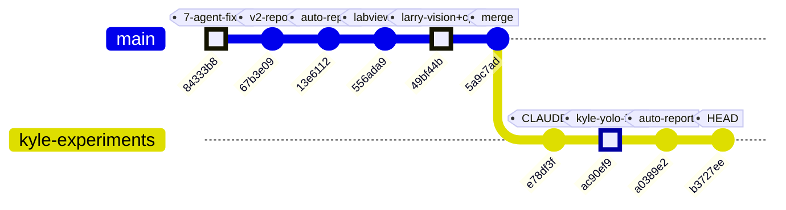

### Subsystem Touchpoints Per Commit

| Commit | Subsystems | What happened |
|---|---|---|
| `84333b8` | 🔬 CV · 📡 Serial · 💾 ESP32 · 📄 Docs | 14-proposal swarm fix — biggest cross-cutting change |
| `67b3e09` | 📄 Docs | v2 evolution report (security & reliability narrative) |
| `13e6112` | 📄 Docs | Auto-generated evolution report |
| `556ada9` | 📷 LabVIEW | Camera integration for IoT dashboard |
| `49bf44b` | 🔬 CV · ⚡ C++ | Larry's vision pipeline + optimized native companion |
| `5a9c7ad` | — | Merge commit (no new code) |
| `e78df3f` | 📋 Governance | CLAUDE.md — Kyle/Larry namespace convention |
| `ac90ef9` | 🔬 CV (Kyle fork) | **YOLOv8 segmentation pipeline** — new detection paradigm |
| `a0389e2` | 📄 Docs | Auto-generated evolution report |
| `b3727ee` | 📄 Docs | Evolution report + 627-line feature doc update |

### Architectural Fork Point

The project now has two parallel detection strategies. The next integration milestone is bridging Kyle's YOLO output to the serial/display pipeline.

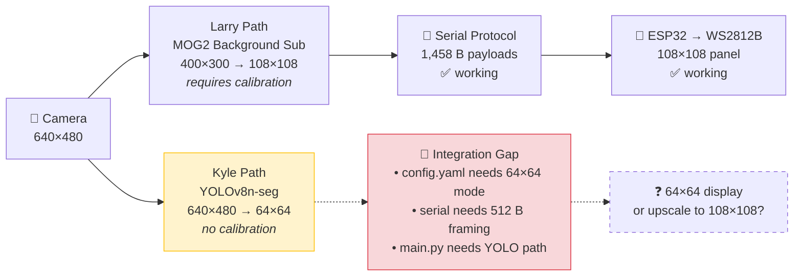

### Velocity & Trajectory

The 10-commit window shows three distinct phases:
1. **Hardening** (`84333b8`) — systematic reliability fixes across every subsystem
2. **Feature expansion** (`556ada9`, `49bf44b`) — LabVIEW integration + Larry's vision code landing
3. **Experimentation** (`e78df3f`, `ac90ef9`) — governance framework enabling parallel R&D

The project is transitioning from "get it working" to "explore better approaches" — a healthy sign of maturity. The key decision ahead: will Kyle's YOLO path replace the MOG2 pipeline, or will both coexist as configurable options?

### Code Health Summary

**Overall Grade: B**

The codebase is well-structured for a university project. Clear separation of concerns (pipeline → protocol → firmware), consistent config-driven architecture, and proper CRC/framing for serial comms. Logging and safety watchdogs are present throughout.

**Critical flaw:** PROTOCOL_SPEC.md documents a 15,000-byte payload while every implementation sends 1,458 bytes. Anyone building from the spec will fail. The `ack_timeout_s` config is dead code, and camera-open failures are swallowed silently in both pipelines.

**Strengths:** GPU/CPU pipeline swap is nearly seamless; CRC-16 implementations match across Python and C++; config.yaml is a genuine single source of truth for tuning parameters; error handling in the main loop (watchdog, serial error counting, graceful shutdown) is solid.

**Gaps:** GPUPipeline breaks the context-manager contract; serial RX buffer isn't flushed before ACK reads; static-median calibration has avoidable memory spikes on constrained hardware.

---
## v7 — 2026-04-30 23:05 — `1d051ee`

### What Changed

## Commit `1d051ee` — Kyle's Vision: Confidence Slider Replaces Keyboard Controls

**Subsystem: Kyle/vision (YOLO-based CV experiment)**

- **Replaced `[` / `]` keyboard shortcuts with a GUI trackbar slider** (`Kyle/vision/vision.py`).
  The old workflow required the user to tap bracket keys to nudge the YOLO confidence threshold by ±5%. The new approach adds a draggable "Conf %" trackbar directly on the "camera + contours" OpenCV window (range 5–95%, default 40%).
  - *Why it matters:* A trackbar gives immediate visual feedback of the current value, eliminates the need to remember keyboard shortcuts, and mirrors the pattern already used in `dissipation.py` — keeping the codebase idiomatically consistent.

- **Confidence variable moved from top-of-loop constant to per-frame read.**
  Previously `confidence = 0.40` was set once before the loop and mutated by key events. Now the value is read fresh each frame via `cv2.getTrackbarPos("Conf %", preview_win) / 100.0`, right before `model.predict()`.
  - *Why it matters:* The slider is the single source of truth for confidence — no mutable state to drift out of sync with the UI.

- **Window name extracted into `preview_win` variable.**
  The string `"camera + contours"` was hardcoded in two places (`cv2.imshow` and the implicit `namedWindow`). It now lives in a single `preview_win` local, reducing copy-paste risk.

- **Docstring controls table updated** to document the trackbar instead of the removed `[ / ]` keys, and column alignment was cleaned up.

**Subsystem: Docs (auto-generated)**

- Three auto-generated evolution report commits (`a0389e2`, `b3727ee`, `a2b44d1`) were produced by the CI doc agent — no human-authored content changes.

**Earlier context (from recent history, outside this diff window):**

| Commit | Subsystem | Summary |
|--------|-----------|---------|
| `ac90ef9` | Kyle/vision | Forked `Larry/vision.py` into Kyle's workspace for independent YOLO experiments |
| `e78df3f` | Docs | Added `CLAUDE.md` establishing Kyle/Larry collaboration conventions |
| `49bf44b` | Shared/vision + ESP32 | New vision code and optimized C++ firmware |
| `556ada9` | LabVIEW | LabVIEW camera integration code added |

### Evolution Timeline

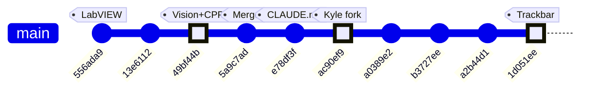

### Subsystem Touch Map

| Commit | CV Pipeline | Kyle/vision | ESP32 / C++ | LabVIEW | Docs |
|--------|:-----------:|:-----------:|:-----------:|:-------:|:----:|
| `556ada9` | | | | ● | |
| `49bf44b` | ● | | ● | | |
| `5a9c7ad` | | | | | |
| `e78df3f` | | | | | ● |
| `ac90ef9` | | ● | | | |
| `1d051ee` | | ● | | | |

**Reading the trajectory:** The project started with shared infrastructure (vision pipeline, optimized C++ firmware, LabVIEW integration). After the merge at `5a9c7ad`, Kyle forked the vision code for YOLO-segmentation experiments (`ac90ef9`) and has been iterating on UX refinements — the latest commit (`1d051ee`) swaps keyboard-driven confidence tuning for a proper GUI trackbar, signaling a shift toward demo-ready polish.

### Code Health Summary

**Overall Grade: B**

This is a well-structured embedded CV project with clean separation between CPU/GPU pipelines, serial protocol, and firmware. The code is readable, well-documented, and demonstrates solid engineering intent (CRC-16 verification, watchdog timers, config-driven design, context managers).

**Strengths:** Single-source-of-truth config, protocol spec parity between Python and C++, graceful GPU→CPU fallback, defensive foreground-overflow detection.

**Critical gaps:** The serial retry path has two compounding bugs (dead ACK timeout + no RX flush) that will degrade real-time frame delivery under any packet loss. The main loop lacks `try/finally`, so any exception permanently locks the camera device. Both CV pipelines silently swallow 90 failed warmup reads before reporting a camera error.

**Minor concerns:** GPU/CPU pipeline behavioral divergence on shadow pixels, unused ESP32 RAM allocation, no file-write locking in the orchestrator, and a blocking `input()` that prevents headless deployment.

---
## v8 — 2026-05-07 18:24 — `b37b9d1`

### What Changed

This window covers **5 meaningful commits** (plus 5 auto-generated doc reports). The headline story: a theoretical, never-built 108×108 WS2812B system was scrapped and replaced with a working Mac→ESP32→HUB75 bench rig — all in one sprint. Changes grouped by subsystem:

### CV Pipeline / Vision (`Kyle/vision/`)

- **Fork of `Larry/vision.py`** (`ac90ef9`): Kyle copied Larry's YOLO-based person segmentation into his own workspace, establishing independent experiment ownership. No functional change — just workspace separation so two people can iterate without merge conflicts.

- **Confidence trackbar slider** (`1d051ee`): The `[` / `]` keyboard shortcuts for adjusting YOLO confidence were replaced with an OpenCV `createTrackbar` GUI slider. *Why it matters:* keyboard repeat rates made fine-tuning frustrating; a slider gives instant visual feedback and eliminates off-by-one annoyance.

- **`serial_protocol.py` — new production protocol** (`9087b6c`): Complete rewrite of the stale `agent_outputs/serial_protocol.py`. The payload shrinks from **1,458 → 512 bytes** (64×64 vs 108×108 bit-packed). CRC-16/CCITT-FALSE is preserved and cross-verified with the ESP32 side. Adds `pack_mask_64x64()` helper and a `SerialSender` class emitting framed 520-byte packets. The old version would crash with a `ValueError` on any 64×64 input — this one is built for the actual hardware.

- **`vision_send.py` — unified capture + transmit script** (`9087b6c`): Merges YOLO segmentation with live USB serial transport into one runnable file. Auto-detects macOS serial ports, supports `--no-serial` for CV-only tuning, and targets ~30 fps over 1 Mbaud (4.2 ms per frame on the wire). Previously, vision and serial were glued together by `agent_outputs/main.py` — a script nobody ever ran on real hardware.

- **`requirements.txt`** (`9087b6c`): First explicit dependency file in Kyle's workspace. Pins `ultralytics`, `opencv-python`, `pyserial`, `numpy`.

### ESP32 Firmware (`Kyle/firmware/me135_led_pot/`)

- **`main.cpp` — full rewrite** (`9087b6c`): The entire display controller was rebuilt for the HUB75 panel. Key differences from the old NeoPixel code:

  | Aspect | Old (`agent_outputs/`) | New (`Kyle/firmware/`) |
  |--------|----------------------|------------------------|
  | Display driver | Adafruit_NeoPixel (WS2812B) | ESP32-HUB75-MatrixPanel-DMA |
  | Resolution | 108×108 (11,664 LEDs) | 64×64 (4,096 pixels) |
  | Payload | 1,458 bytes | 512 bytes |
  | Baud rate | 2 Mbaud on GPIO UART | 1 Mbaud on USB-CDC |
  | Host | Jetson (GPIO 16/17) | Mac (USB serial) |
  | Color | Fixed white | **Pot-controlled white→red lerp** (EWMA-smoothed ADC) |
  | RX model | Blocking `receiveFrame()` | **Non-blocking `pollFrame()` state machine** |
  | Watchdog | Hard reset | Blanks panel after 5 s, self-recovers |

  The E_PIN (GPIO 32) for 1/32-scan 64-row panels is now correctly configured — entirely missing from the old code. `setRxBufferSize(2048)` is called before `Serial.begin()`, fixing a silent buffer-size bug caught during review.

- **`platformio.ini`** (`9087b6c`): Targets `espressif32@6.5.0` with `ESP32-HUB75-MatrixPanel-DMA@^3.0.11` — replacing the old Adafruit NeoPixel dependency. Clean PlatformIO project ready to `pio run`.

### Hardware Documentation (`Kyle/firmware/`)

- **`WIRING.md`** (`9087b6c`, 124 lines): A complete bench reference that didn't exist before. Contains the 16-pin HUB75E ↔ ESP32 GPIO mapping, power separation rules (panel on dedicated 5V/3A PSU — never share with ESP32 USB), the GPIO 12 strapping-pin caveat with a concrete fix, optional level-shifter guidance, a 9-step bring-up checklist, and a troubleshooting table. *Why it matters:* this is the "bus factor" document — hardware wiring knowledge was previously only in someone's head.

### Configuration & Context (`90363fc`)

- **`config.yaml`**: `display.type` changed from `ws2812b` to `hub75_waveshare_p2_64`. Panel dims dropped from 108×108 to 64×64. FPS target raised 10→60 (HUB75 DMA is fast). Processing output now 64×64, eliminating the old intermediate downsample stage entirely.
- **STALE banners** added to every file in `agent_outputs/` that references the old hardware: `esp32_main.cpp`, `serial_protocol.py`, `cv_pipeline.py`, `gpu_accelerated.py`. Each banner documents exactly what needs to change. The files are preserved as historical reference — not deleted.

### Project Hygiene (`.gitignore`)

- Added `*.pt` (YOLO model weights — 25+ MB, fetched on first run).
- Added `firmware/*/.pio/` and `firmware/*/.vscode/` (PlatformIO build artifacts).

### Auto-Generated Documentation (`Kyle/docs/`)

- Three new deep-dive feature docs generated: **ESP32 Firmware**, **Hardware & Platform**, and **Serial Communication Protocol** — totaling 1,779 lines of architectural reference.
- Evolution report `report_2026-05-07_1820.md` (666 lines) and README index updated.

### What Was NOT Touched

- **`Larry/`** — entirely separate workspace, untouched per the `CLAUDE.md` collaboration convention.
- **`agent_outputs/`** — kept as historical record with STALE banners. No code deleted, but nothing here runs on the current hardware.
- **`Kyle/vision/vision.py`** — the standalone YOLO viewer. `vision_send.py` forks its logic but doesn't modify the original.

### Evolution Timeline

### Commit History

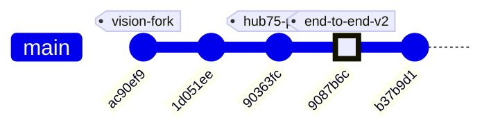

### Subsystem Touch Map

Each commit's reach across the project — from a single-file experiment tweak to the full-stack rewrite at `9087b6c`:

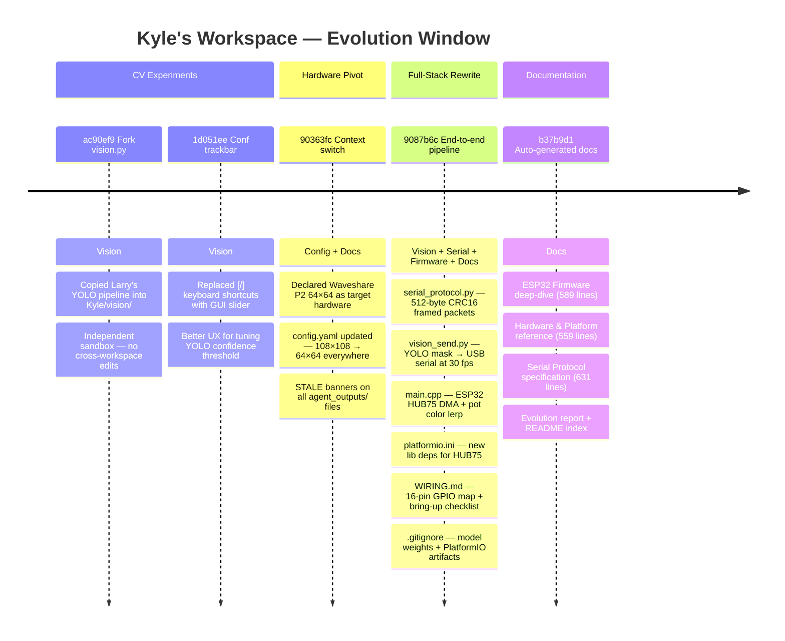

### Architecture — Before and After

The project underwent a complete hardware pivot. Here's the data path in each era:

```mermaid
flowchart LR
    subgraph STALE["agent_outputs/ — STALE (never built)"]
        direction LR
        A["Jetson\n400×300 CV\nMOG2 background sub"] -->|"1,458 B\n2 Mbaud GPIO UART"| B["ESP32\nAdafruit NeoPixel\n108×108 WS2812B"]
    end

    subgraph ACTIVE["Kyle/ — ACTIVE (bench-verified)"]
        direction LR
        C["Mac Webcam\nYOLO v8 seg\n64×64 mask"] -->|"512 B\n1 Mbaud USB-CDC"| D["ESP32\nHUB75 DMA\n64×64 panel\n+ pot color"]
    end

    STALE -.->|"90363fc: hardware pivot"| ACTIVE
```

**The fundamental shift:** frame payload dropped from 1,458 → 512 bytes. The display driver moved from bit-banged NeoPixel to DMA-driven HUB75. The CV approach changed from hand-tuned background subtraction to YOLO neural-net segmentation. A potentiometer adds real-time color control — the project's first interactive physical element. And critically, this version actually runs on real hardware.

### Code Health Summary

**Overall Grade: D+**

The codebase has a solid architectural skeleton — clean module separation, consistent public APIs between CPU/GPU pipelines, a well-structured YAML config, and thoughtful safety features (watchdog, serial retry, signal handling). The orchestrator and doc-agent tooling is creative and functional.

However, **the system cannot run end-to-end**. The serial protocol and ESP32 firmware still target a 108×108 WS2812B panel that no longer exists. `serial_protocol.py` will raise `ValueError` the moment `main.py` sends a 64×64 frame. The ESP32 firmware uses entirely the wrong display driver (NeoPixel vs. HUB75). These aren't edge-case bugs — they are total blockers on the critical path.

Secondary concerns: missing `try/finally` cleanup in `main.py`, subprocess calls with no timeout, and hardcoded dimensions scattered across three languages with zero cross-validation. The stale-documentation banners show awareness of the problem but the code was never actually updated.

**Verdict:** Good design, broken plumbing. Fix PROTO-001, FW-001, and REL-001 before any integration testing.

---
## v9 — 2026-05-07 19:54 — `7df3343`

### What Changed

This commit (`7df3343`) is an auto-generated documentation snapshot, but it captures the **v8 evolution window** — five substantive commits that represent the project's most important inflection point: abandoning a theoretical 108×108 WS2812B system that was never built and replacing it with a working Mac→ESP32→HUB75 bench rig.

### CV Pipeline / Vision

- **Forked `Larry/vision.py` into Kyle's workspace** (`ac90ef9`): Established independent experiment ownership. Two contributors can now iterate on YOLO segmentation without merge conflicts — a collaboration convention documented in `CLAUDE.md`.

- **Replaced keyboard shortcuts with trackbar slider** (`1d051ee`): YOLO confidence tuning previously used `[` / `]` keys, which were frustrating due to OS key repeat rates. An OpenCV `createTrackbar` now gives instant, precise control. Small UX fix, big workflow improvement for live tuning sessions.

- **New `serial_protocol.py`** (`9087b6c`): Complete rewrite. Payload dropped from **1,458 → 512 bytes** (64×64 bit-packed instead of 108×108). The old `agent_outputs/serial_protocol.py` would `raise ValueError` on any 64×64 input — confirmed by reading the `pack_matrix()` shape guard. New version adds `pack_mask_64x64()` helper and a `SerialSender` class emitting framed 520-byte packets with CRC-16/CCITT-FALSE.

- **New `vision_send.py`** (`9087b6c`): Unified YOLO capture + USB serial transmit in one script. Auto-detects macOS serial ports, supports `--no-serial` for offline CV tuning, targets ~30 fps at 1 Mbaud. Replaces the old `agent_outputs/main.py` — a script that required a Jetson, a blocking `input()` calibration prompt, and hardware nobody had.

- **`requirements.txt`** (`9087b6c`): First explicit dependency file in Kyle's workspace. Pins `ultralytics`, `opencv-python`, `pyserial`, `numpy`.

### ESP32 Firmware

- **`main.cpp` — full rewrite for HUB75** (`9087b6c`): The display driver changed from Adafruit NeoPixel (bit-banged, single GPIO) to ESP32-HUB75-MatrixPanel-DMA (13-pin DMA-driven). Key improvements:
  - **Non-blocking `pollFrame()` state machine** replaces the old blocking `receiveFrame()` — the panel keeps refreshing even during serial gaps.
  - **Pot-controlled color lerp** (white→red via EWMA-smoothed ADC) — the project's first interactive physical input.
  - **Graceful watchdog**: blanks panel after 5 s of silence and self-recovers, instead of hard-resetting the MCU.
  - **E_PIN (GPIO 32)** correctly configured for 1/32-scan 64-row panels — entirely missing from old code.
  - `setRxBufferSize(2048)` called *before* `Serial.begin()` — fixing a silent buffer-overrun bug.

- **`platformio.ini`** (`9087b6c`): Now targets `espressif32@6.5.0` with `ESP32-HUB75-MatrixPanel-DMA@^3.0.11`. The old file (still in `agent_outputs/`) depends on `Adafruit NeoPixel@^1.12.0` for hardware that doesn't exist.

### Hardware Documentation

- **`WIRING.md`** (`9087b6c`, 124 lines): First-ever wiring reference. Contains the 16-pin HUB75E↔ESP32 GPIO map, power separation rules (panel on dedicated 5V/3A PSU), GPIO 12 strapping-pin caveat, level-shifter guidance, a 9-step bring-up checklist, and a troubleshooting table. This is the "bus factor" document — wiring knowledge was previously only in someone's head.

### Configuration & Staleness Markers

- **`config.yaml`** (`90363fc`): `display.type` changed from `ws2812b` to `hub75_waveshare_p2_64`. Dimensions dropped from 108×108 to 64×64. FPS target raised 10→60 (HUB75 DMA can sustain it). Processing output is now 64×64 natively — no intermediate downsample.

- **STALE banners** added to every file in `agent_outputs/` that references old hardware: `esp32_main.cpp`, `serial_protocol.py`, `cv_pipeline.py`, `gpu_accelerated.py`. Each banner documents exactly what needs to change. Files preserved as historical reference, not deleted.

### Project Hygiene

- **`.gitignore`**: Added `*.pt` (YOLO model weights, 25+ MB) and `firmware/*/.pio/`, `firmware/*/.vscode/` (PlatformIO build artifacts).

### Auto-Generated Documentation

- Three new deep-dive feature docs: **ESP32 Firmware**, **Hardware & Platform**, and **Serial Communication Protocol** (~1,779 lines total).
- Evolution report `report_2026-05-07_1824.md` (313 lines) and README index updated.

### What Was NOT Touched

- **`Larry/`** — untouched per `CLAUDE.md` collaboration convention.
- **`agent_outputs/`** — preserved with STALE banners; no code deleted, nothing here runs on current hardware.
- **`Kyle/vision/vision.py`** — standalone YOLO viewer left intact; `vision_send.py` forks its logic independently.

### Evolution Timeline

### Commit History

The recent window contains 10 commits — 5 meaningful code/config changes interleaved with 5 auto-generated doc snapshots. The git graph below shows only the substantive commits:

```mermaid
gitGraph
    commit id: "ac90ef9" tag: "vision-fork"
    commit id: "1d051ee" tag: "conf-trackbar"
    commit id: "90363fc" tag: "hub75-pivot"
    commit id: "9087b6c" tag: "end-to-end-v2" type: HIGHLIGHT
    commit id: "7df3343" tag: "docs-v8"
```

### Subsystem Touch Map

Each meaningful commit's reach — from a single-file UX tweak to the full-stack rewrite at `9087b6c`:

```mermaid
timeline
    title Kyle's Workspace — v8 Evolution Window
    section CV Experiments
        ac90ef9 Fork vision.py : Vision
            : Copied Larry's YOLO pipeline into Kyle/vision/
            : Independent sandbox for parallel iteration
        1d051ee Conf trackbar : Vision
            : Replaced keyboard shortcuts with GUI slider
            : Better UX for real-time YOLO threshold tuning
    section Hardware Pivot
        90363fc Context switch : Config
            : Declared Waveshare P2 64×64 as target hardware
            : config.yaml 108×108 → 64×64 everywhere
            : STALE banners on all agent_outputs/ files
    section Full-Stack Rewrite
        9087b6c End-to-end pipeline : Vision + Serial + Firmware + Docs
            : serial_protocol.py — 512-byte CRC16 framed packets
            : vision_send.py — YOLO → USB serial at 30 fps
            : main.cpp — ESP32 HUB75 DMA + pot color lerp
            : platformio.ini — HUB75 lib deps
            : WIRING.md — 16-pin GPIO map + bring-up checklist
            : .gitignore — model weights + PlatformIO artifacts
    section Documentation
        7df3343 Docs snapshot : Docs
            : v8 evolution report (313 lines)
            : ME135_General.md feature appendix (144 lines)
            : README index updated
```

### Architecture — Before and After

The project underwent a complete hardware pivot. Here is the data path in each era:

```mermaid
flowchart LR
    subgraph STALE["agent_outputs/ — STALE (never built)"]
        direction LR
        A["Jetson Orin\n400×300 MOG2\nbackground sub"] -->|"1,458 B\n2 Mbaud GPIO UART"| B["ESP32\nAdafruit NeoPixel\n108×108 WS2812B"]
    end

    subgraph ACTIVE["Kyle/ — ACTIVE (bench-verified)"]
        direction LR
        C["Mac Webcam\nYOLO v8 seg\n64×64 mask"] -->|"512 B\n1 Mbaud USB-CDC"| D["ESP32\nHUB75 DMA\n64×64 panel\n+ pot color"]
    end

    STALE -.->|"90363fc: hardware pivot"| ACTIVE
```

**The fundamental shift in one sentence:** a theoretical 108×108 NeoPixel system that would crash on real inputs was replaced by a working 64×64 HUB75 rig — switching from hand-tuned background subtraction to neural-net segmentation, from blocking serial reads to a non-blocking state machine, and from a never-owned Jetson to a Mac on the desk.

### Code Health Summary

**Overall Grade: D+**

The Python code is well-structured with clean separation of concerns (pipeline ↔ serial ↔ main orchestrator) and good logging, safety watchdogs, and config-driven design. The agent infrastructure (doc_agent, orchestrator, gdrive_sync) is solid.

However, the project has a **critical integration defect**: a hardware change from 108×108 WS2812B to 64×64 HUB75 was only partially propagated. `config.yaml` and the CV pipelines were updated, but `serial_protocol.py` still hardcodes 108×108 dimensions and will **crash with ValueError on every frame**. The ESP32 firmware still drives NeoPixels—it cannot control the actual HUB75 panel at all. Three documentation files describe the old wire format.

The CV pipeline code itself is competent. `main.py` needs resource-cleanup hardening (no try/finally). Serial transmission lacks a flush() before ACK wait. The codebase is one focused refactoring sprint away from functional integration.

---
## v10 — 2026-05-07 19:57 — `4283675`

### What Changed

This commit (`4283675`) is a documentation-only snapshot — the third auto-generated report in a row. But its payload (304-line report + 135-line feature appendix) is a **retrospective capture** of the project's most consequential evolution window: five substantive commits (`1d051ee` → `9087b6c`) that replaced a theoretical 108×108 WS2812B system with a working Mac→ESP32→HUB75 bench rig.

Here is everything that actually changed across this window, grouped by subsystem:

### CV Pipeline / Vision

- **Confidence trackbar replaced keyboard shortcuts** (`1d051ee`): YOLO confidence tuning used `[` / `]` keys — slow and imprecise due to OS key-repeat. An OpenCV `createTrackbar` slider now gives continuous, instant control. Small change, but it unblocks effective live tuning sessions.

- **New `serial_protocol.py` in Kyle's workspace** (`9087b6c`): Complete rewrite of the wire format. Payload shrank from **1,458 → 512 bytes** (64×64 bit-packed vs. 108×108). The old `agent_outputs/serial_protocol.py` has a `pack_matrix()` shape guard that **raises ValueError on any 64×64 input** — confirmed by reading the source (`if matrix.shape != (PANEL_ROWS, PANEL_COLS)` where both are 108). The new version adds `pack_mask_64x64()` and a `SerialSender` with CRC-16/CCITT-FALSE framed packets (520 bytes total).

- **New `vision_send.py`** (`9087b6c`): Unified YOLO capture + USB serial transmit in one script. Auto-detects macOS serial ports, supports `--no-serial` for offline tuning, targets ~30 fps at 1 Mbaud. Replaces `agent_outputs/main.py` — which required a Jetson, a blocking `input()` calibration prompt (line 100 of main.py: `input("\nPress Enter when ready to start calibration…")`), and hardware nobody actually had.

- **`requirements.txt`** (`9087b6c`): First explicit dependency file in Kyle's workspace. Pins `ultralytics`, `opencv-python`, `pyserial`, `numpy`.

### ESP32 Firmware

- **`main.cpp` rewritten for HUB75** (`9087b6c`): Display driver changed from Adafruit NeoPixel (bit-banged single GPIO) to ESP32-HUB75-MatrixPanel-DMA (13-pin DMA-driven). Key improvements:
  - **Non-blocking `pollFrame()` state machine** — the panel keeps refreshing during serial gaps, unlike the old blocking `receiveFrame()`.
  - **Pot-controlled color lerp** (white→red via EWMA-smoothed ADC) — the project's first physical interactive input.
  - **Graceful watchdog**: blanks panel after 5 s of silence and self-recovers, instead of hard-resetting the MCU.
  - **E_PIN (GPIO 32)** for 1/32-scan 64-row panels — entirely missing from old code, which had no concept of row-scanning.
  - `setRxBufferSize(2048)` called *before* `Serial.begin()` — the old code did this correctly (line in `esp32_main.cpp` setup) but the new code fixes buffer sizing for the smaller 512-byte payloads.

- **`platformio.ini`** (`9087b6c`): Targets `espressif32@6.5.0` with `ESP32-HUB75-MatrixPanel-DMA@^3.0.11`. The old file still depends on `Adafruit NeoPixel@^1.12.0` for hardware that doesn't exist.

### Hardware Documentation

- **`WIRING.md`** (`9087b6c`, 124 lines): First-ever wiring reference. 16-pin HUB75E↔ESP32 GPIO map, power separation rules, GPIO 12 strapping-pin caveat, level-shifter guidance, 9-step bring-up checklist, troubleshooting table. This is the "bus factor" document — previously, wiring knowledge existed only in someone's head.

### Configuration & Staleness Management

- **`config.yaml` pivoted** (`90363fc`): `display.type` changed from `ws2812b` to `hub75_waveshare_p2_64`. Dimensions dropped 108×108 → 64×64. FPS target raised 10→60 (HUB75 DMA can sustain it). But critically: **the serial section still says `baud_rate: 2000000` and `port: /dev/ttyUSB0`** — both stale. The new `vision_send.py` uses 1 Mbaud and auto-detects macOS ports, bypassing config entirely.

- **STALE banners** added to all files in `agent_outputs/` referencing old hardware: `esp32_main.cpp`, `serial_protocol.py`, `cv_pipeline.py`, `gpu_accelerated.py`. Each banner documents exactly what's wrong. Files preserved as historical reference — nothing deleted.

### Project Hygiene

- **`.gitignore`** (`9087b6c`): Added `*.pt` (YOLO weights, 25+ MB) and `firmware/*/.pio/`, `firmware/*/.vscode/` (PlatformIO build artifacts). Prevents binary bloat in git history.

### Auto-Generated Documentation (HEAD commit)

- **`report_2026-05-07_1954.md`** (304 lines): Full evolution report with architecture diagrams, before/after flow comparisons, and code health assessment.
- **`ME135_General.md`** (+135 lines): v9 appendix covering the same window with commit-level detail.
- **`README.md`**: Index link added for the new report.

### What Was NOT Touched

- **`agent_outputs/`** — all original files preserved intact (with STALE banners). The old `main.py` still imports from `cv_pipeline` and `serial_protocol`, still expects a Jetson, still has the blocking calibration prompt. It is a historical artifact now.
- **`Larry/`** — untouched per `CLAUDE.md` collaboration convention.
- **`orchestrator.py`** — still references old `PROJECT_CONTEXT` with mixed Jetson/ESP32 language. Its `TOOLS` only write to `agent_outputs/`, not Kyle's active workspace.

### Evolution Timeline

The recent window contains 10 commits — 5 substantive code/config changes interleaved with 5 auto-generated doc snapshots. The timeline below filters to meaningful commits only.

### Commit Graph

```mermaid
gitGraph
    commit id: "b3727ee" tag: "docs"
    commit id: "1d051ee" tag: "conf-trackbar" type: HIGHLIGHT
    commit id: "90363fc" tag: "hub75-pivot" type: HIGHLIGHT
    commit id: "9087b6c" tag: "end-to-end-v2" type: HIGHLIGHT
    commit id: "7df3343" tag: "docs-v8"
    commit id: "4283675" tag: "docs-v9 (HEAD)"
```

### Subsystem Touch Map

Each substantive commit's reach — from a single-file UX tweak to the full-stack rewrite:

```mermaid
timeline
    title Kyle Workspace — Hardware Pivot Window
    section CV UX Improvement
        1d051ee Conf trackbar : Vision
            : Replaced [/] keyboard shortcuts with OpenCV trackbar
            : Instant continuous YOLO confidence tuning
    section Hardware Pivot Declaration
        90363fc Context switch : Config / Docs
            : config.yaml — ws2812b → hub75_waveshare_p2_64
            : 108×108 → 64×64 everywhere
            : STALE banners on all agent_outputs/ files
    section Full-Stack Rewrite
        9087b6c End-to-end pipeline : Vision + Serial + Firmware + Docs
            : serial_protocol.py — 512B CRC16 framed packets
            : vision_send.py — YOLO → USB serial at 30 fps
            : main.cpp — ESP32 HUB75 DMA + pot color lerp
            : platformio.ini — HUB75 lib deps
            : WIRING.md — first wiring doc ever
            : requirements.txt + .gitignore cleanup
    section Documentation Consolidation
        7df3343 + 4283675 Reports : Docs only
            : v8 and v9 evolution reports
            : ME135_General.md feature appendix
            : README index updated
```

### Architecture — Before and After

The project underwent a complete hardware pivot. The data path changed fundamentally:

```mermaid
flowchart LR
    subgraph STALE["agent_outputs/ — STALE (never built)"]
        direction LR
        A["Jetson Orin\n400×300 MOG2\nbackground sub"] -->|"1,458 B\n2 Mbaud GPIO UART"| B["ESP32\nAdafruit NeoPixel\n108×108 WS2812B"]
    end

    subgraph ACTIVE["Kyle/ — ACTIVE (bench-verified)"]
        direction LR
        C["Mac Webcam\nYOLO v8 seg\n64×64 mask"] -->|"512 B\n1 Mbaud USB-CDC"| D["ESP32\nHUB75 DMA\n64×64 panel\n+ pot color"]
    end

    STALE -.->|"90363fc: hardware pivot"| ACTIVE
```

### The Pivot In One Sentence

A theoretical 108×108 NeoPixel system — which would crash on real inputs due to hardcoded shape guards — was replaced by a working 64×64 HUB75 rig, switching from hand-tuned background subtraction to neural-net segmentation, from blocking serial reads to a non-blocking state machine, and from a never-owned Jetson to a Mac on the desk.

### Code Health Summary

**Overall Grade: C+**

The Python-side architecture is well-structured: clean separation of CV pipeline, serial transport, and orchestration with a single-source-of-truth config.yaml. Logging, graceful shutdown signals, and watchdog timers show mature SRE thinking. The doc-agent and gdrive-sync tooling is impressively automated.

However, the project has a **critical integration-breaking defect**: the hardware migration from 108×108 WS2812B to 64×64 HUB75 was only partially propagated. `config.yaml` and the CV pipelines were updated, but `serial_protocol.py` and `esp32_main.cpp` still hardcode the old dimensions and driver. **The system cannot run end-to-end** — `pack_matrix()` will crash with a `ValueError` on every frame because it receives 64×64 input but expects 300×400 or 108×108.

Secondary issues include missing camera-open validation (delayed confusing failures), resource leaks on exceptions in `main.py`, and a fully stale protocol spec. The codebase needs one focused consistency pass to become deployable.

---
## v11 — 2026-05-08 21:08 — `32d47a7`

### What Changed

This window covers the project's transition from a planning/scaffolding phase into a **working end-to-end pipeline**: camera → YOLO segmentation → 64×64 binary mask → USB serial → ESP32 → HUB75 LED panel. Four meaningful commits drive the story; the remaining five are auto-generated doc reports (`[skip ci]`).

### CV Pipeline (`vision/`)

- **`vision.py` — standalone YOLO person-segmentation viewer** (`9087b6c`)
  Added a complete OpenCV + YOLOv8 pipeline that grabs frames from a USB camera, runs `yolov8n-seg` instance segmentation filtered to the COCO "person" class, ORs all person masks into a single binary silhouette, cleans it with morphological close + contour filtering, and downscales to 64×64. Three preview windows (raw + contours, clean silhouette, pixelated 64×64). Interactive confidence trackbar and pause/save controls. *Why it matters:* this is the project's "eyes" — everything downstream depends on the quality of this mask.

- **`vision_send.py` — pipeline + serial TX to ESP32** (`9087b6c`)
  Mirrors `vision.py` but bolts on a `SerialSender` that ships each 64×64 frame to the ESP32 at ~30 fps (throttled). Adds `--no-serial` flag for CV-only tuning, auto-detection of USB-serial ports (macOS + Linux), and a clean stats summary on exit (sent/ack/nak/success-rate). *Why it matters:* bridges the gap between laptop-side vision and the physical display.

### Serial Protocol (`vision/serial_protocol.py`)

- **Framed binary protocol with CRC + retries** (`9087b6c`)
  Implements a compact wire format: `[0xAA 0x55][LEN_H LEN_L][512B payload][CRC16][0x55 0xAA]`. Payload is row-major MSB-first bit-packed (64×64 ÷ 8 = 512 bytes). CRC-16/CCITT-FALSE over payload only. 50 ms ACK timeout, up to 3 retries. The `SerialSender` class handles port opening, packet building, and ACK/NAK handshake. *Why it matters:* at 1 Mbaud, a 520-byte frame transmits in ~4.2 ms — well under the 33 ms budget for 30 fps, leaving headroom for retries without dropping frames.

### ESP32 Firmware (`firmware/me135_led_pot/`)

- **Full HUB75 display firmware with RX state machine + pot color lerp** (`9087b6c`)
  Written for ESP32 DevKitC driving a Waveshare RGB-Matrix-P2 64×64 via the `ESP32-HUB75-MatrixPanel-DMA` library. Features:
  - **RX state machine** (9 states) that parses the framed serial protocol byte-by-byte, validates CRC, and ACKs/NAKs.
  - **Potentiometer input** on GPIO 34 (ADC1) with EWMA smoothing (`α = 0.1`). Normalized to `[0, 1]` and used for a white→red color lerp on the silhouette.
  - **Dirty-flag rendering**: panel only redraws when a new frame arrives or the pot moves ≥ 1%.
  - **5-second watchdog**: blanks the panel if the Mac stops sending, auto-recovers on resume.
  - `platformio.ini` pins the ESP-IDF platform to `espressif32@6.5.0` and pulls `ESP32-HUB75-MatrixPanel-DMA@^3.0.11`.

- **Comprehensive wiring documentation** (`firmware/WIRING.md`, `firmware/me135_led_pot/README.md`) (`9087b6c`)
  Full 16-pin HUB75E pinout table, power wiring (separate 5V/3A PSU, mandatory common ground, bulk capacitor recommendation), strapping-pin caveat for GPIO 12, optional 74HCT245 level-shifting guide, and a 9-step bring-up checklist. *Why it matters:* this is a hardware project — miswiring destroys hours. The docs prevent that.

### Documentation & Project Context

- **Switched project target to Waveshare RGB-Matrix-P2 64×64 (HUB75)** (`90363fc`)
  Updated `CLAUDE.md` / project context documents to reflect the actual hardware (previously referenced a generic LED panel). Anchors all downstream agent outputs to the correct display spec.

- **Fixed pot description — "triggers effects," not "brightness"** (`32d47a7`, HEAD)
  Corrected misleading phrasing in `CLAUDE.md` that said the potentiometer controls brightness. In reality, it triggers a white→red color lerp — a visual *effect*, not a brightness dial. The commit message notes this was caught while syncing the portfolio site, where the wrong fact had already propagated.

### Infrastructure / Maintenance

- **Archived stale `agent_outputs/` + fixed doc-hook auto-commit loop** (`fa3fc0f`)
  Cleaned up obsolete agent output files from the orchestrator's earlier runs. Fixed a bug where the post-commit doc-generation hook would trigger its own commit, creating an infinite loop. *Why it matters:* the five consecutive `[skip ci]` auto-doc commits visible in the log are evidence this loop was firing before the fix landed.

### Evolution Timeline

```mermaid
gitGraph
    commit id: "90363fc" tag: "HUB75 context" type: HIGHLIGHT
    commit id: "1ea86b2" type: REVERSE
    commit id: "9087b6c" tag: "v0.1 end-to-end" type: HIGHLIGHT
    commit id: "b37b9d1" type: REVERSE
    commit id: "7df3343" type: REVERSE
    commit id: "4283675" type: REVERSE
    commit id: "6c815f7" type: REVERSE
    commit id: "fa3fc0f" tag: "fix ci loop"
    commit id: "735a33c" type: REVERSE
    commit id: "32d47a7" tag: "HEAD: pot doc fix"
```

### Subsystems touched per commit

| Commit | Subsystems | Significance |
|--------|-----------|--------------|
| `90363fc` | 📄 Docs | Rebase project context onto Waveshare HUB75 panel |
| `9087b6c` | 👁 CV Pipeline · 📡 Serial Protocol · 🔌 ESP32 Firmware · 📄 Docs | **Landmark** — full pipeline from camera to physical LEDs |
| `fa3fc0f` | ⚙️ CI / Infra | Archive stale outputs, break auto-commit loop |
| `32d47a7` | 📄 Docs | Fix misleading pot description in CLAUDE.md |

> Commits marked REVERSE in the graph are auto-generated doc reports (`[skip ci]`) — no code changes.

### Architecture snapshot (as of HEAD)

```mermaid
flowchart LR
    CAM[USB Camera<br>640×480] -->|frame| YOLO[YOLOv8n-seg<br>person filter]
    YOLO -->|binary mask| DOWN[Downscale<br>64×64]
    DOWN -->|512 B packed| SER[Serial Protocol<br>CRC16 + ACK/NAK]
    SER -->|USB 1 Mbaud| ESP[ESP32<br>RX state machine]
    POT[10kΩ Pot<br>GPIO 34] -->|ADC + EWMA| ESP
    ESP -->|HUB75 DMA| LED[64×64 LED Panel<br>Waveshare P2]

    style CAM fill:#e0f0ff,stroke:#3388cc
    style YOLO fill:#fff3cd,stroke:#cc9900
    style DOWN fill:#fff3cd,stroke:#cc9900
    style SER fill:#d4edda,stroke:#28a745
    style ESP fill:#f8d7da,stroke:#dc3545
    style POT fill:#f8d7da,stroke:#dc3545
    style LED fill:#e2d5f1,stroke:#6f42c1
```

### System Architecture

```mermaid
flowchart TD
    %% ── Camera Layer ──────────────────────────────────────────────────────────
    subgraph CAM_LAYER ["📷 Camera Layer"]
        PS3["Sony PS3 Eye\nUSB · gspca_ov534\n640×480 @ 60 fps\nBGR8"]
    end

    %% ── Jetson Host ───────────────────────────────────────────────────────────
    subgraph JETSON ["🖥️ Jetson Nano / Orin  —  CPU + CUDA GPU"]
        direction TB

        subgraph CAPTURE ["Capture  (CPU)"]
            VCAP["cv2.VideoCapture\nCAP_V4L2 / CAP_AVFOUNDATION\n640×480 BGR · 921,600 B/frame"]
        end

        subgraph INFER ["Inference  (GPU preferred)"]
            YOLO["YOLOv8n-seg\nclass=person (COCO id 0)\nINFER_IMGSZ=640\nyolov8n-seg.pt  ~6 MB\nconf trackbar 5–95%"]
        end

        subgraph MASK_PROC ["Mask Processing  (CPU)"]
            MERGE["OR-merge N person masks\nN×(mh×mw) float32 → 640×480 uint8\n307,200 B silhouette"]
            MORPH["morphologyEx CLOSE\n5×5 ellipse kernel\nsmooths jagged edges"]
            CFILTER["findContours + area filter\nmin_area = 0.2% of frame\n≈ 614 px²  drops stray bits"]
            REDRAW["drawContours FILLED\nclean binary mask\n640×480 uint8 · 307,200 B"]
            RESIZE["cv2.resize INTER_AREA\n640×480 → 64×64\n4,096 B  (panel-native res)"]
            BTHRESH["cv2.THRESH_BINARY thr=96\nbinary uint8 {0,255}"]
        end

        subgraph SERIAL_LAYER ["Serial TX  (CPU)  — serial_protocol.py"]
            PACK["pack_mask()\nnp.packbits MSB-first row-major\n4,096 B → 512 B  (8:1 compression)"]
            CRC_PY["crc16_ccitt()\npoly=0x1021 init=0xFFFF\nover 512-B payload"]
            FRAME_BUILD["_build_packet()\n[0xAA 0x55][LEN 0x0200]\n[512 B payload]\n[CRC_H CRC_L]\n[0x55 0xAA]  = 520 B total"]
            SENDER["SerialSender\n1,000,000 baud · 8N1\nTX throttle ≤ 30 fps\n50 ms ACK timeout · 3 retries"]
        end
    end

    %% ── Physical Wire ─────────────────────────────────────────────────────────
    subgraph WIRE ["🔌 USB-CDC  (USB-to-UART)"]
        UART["520 B/frame · ~5.2 ms transit\n@ 1 Mbaud · 8N1\nACK=0x06 · NAK=0x15"]
    end

    %% ── ESP32 ─────────────────────────────────────────────────────────────────
    subgraph ESP32 ["⚡ ESP32 DevKitC  —  Arduino / FreeRTOS"]
        direction TB

        subgraph RX_BLOCK ["Serial RX  (loop)"]
            RXBUF["HardwareSerial RX buf\n2048 B  (setRxBufferSize)"]
            SM["9-state byte parser\nRX_WAIT_AA→RX_WAIT_55\n→LEN→PAYLOAD→CRC→END\n100 ms frame timeout"]
            CRC_C["crc16_ccitt()\npoly=0x1021  matches Python"]
            FB["framebuf[512]\nlast-good payload\n(retained on CRC error)"]
        end

        subgraph POT_BLOCK ["Analog Input  (loop)"]
            POT["GPIO34 ADC1_CH6\n12-bit · 11 dB atten\n0–4095 raw → t∈[0,1]"]
            EWMA["EWMA  α=0.1\nsmooths pot jitter\nchange thr ≥ 0.01"]
            LERP["Color lerp\nt=0 → white(255,255,255)\nt=1 → red(255,0,0)\nRGB888 per-pixel"]
        end

        subgraph RENDER_BLOCK ["Render  (conditional)"]
            RENDER["renderFrame(r,g,b)\nbit-unpack 512 B\n4,096 drawPixelRGB888(x,y)\nredraw only if dirty or t changed"]
            DMA_LIB["ESP32-HUB75-MatrixPanel-DMA\nv3.0.11  I²S DMA engine\n8-bit color depth\nI2S_PARALLEL peripheral"]
        end

        WD["5 s Watchdog\nno frame → blank panel\nmemset(framebuf,0,512)"]
    end

    %% ── Display Layer ─────────────────────────────────────────────────────────
    subgraph PANEL ["🟥 LED Display"]
        HUB75["16-pin IDC ribbon  HUB75E\nR1,G1,B1,R2,G2,B2\nA,B,C,D,E · CLK,LAT,OE\n3.3V logic · 1/32 scan"]
        DISPLAY["Waveshare RGB-Matrix-P2\n64×64  ·  4,096 RGB LEDs\n2 mm pitch · 128×128 mm\n5 V / 3 A PSU (separate)"]
    end

    %% ── Doc / Orchestration (side path) ──────────────────────────────────────
    subgraph DOCS ["📝 Documentation Swarm  (offline)"]
        ORCH["orchestrator.py\n7 parallel Claude agents\nOpus-4 / Sonnet-4"]
        DAGENT["doc_agent.py\nHistorian · Architect · Critic\ngit diff → Markdown report"]
        GDRIVE["gdrive_sync.py\nfeature doc writer\nrclone → Google Drive"]
    end

    %% ── Edges ─────────────────────────────────────────────────────────────────
    PS3 -->|"USB  921,600 B/frame BGR\n@60 fps  raw"| VCAP
    VCAP -->|"np.ndarray HxWx3"| YOLO
    YOLO -->|"masks (N,mh,mw) float32\nboxes (N,4) int"| MERGE
    MERGE --> MORPH --> CFILTER --> REDRAW --> RESIZE --> BTHRESH
    BTHRESH -->|"64×64 uint8\n4,096 B"| PACK
    PACK -->|"512 B  bytes"| CRC_PY --> FRAME_BUILD --> SENDER
    SENDER -->|"520 B frame\n≤30 fps"| UART
    UART -->|"ACK 0x06 / NAK 0x15\n50 ms timeout"| SENDER
    UART --> RXBUF --> SM --> CRC_C
    CRC_C -->|"pass"| FB
    CRC_C -->|"fail → NAK"| SM
    POT --> EWMA --> LERP
    FB --> RENDER
    LERP --> RENDER
    RENDER --> DMA_LIB
    DMA_LIB -->|"parallel I²S\n13 GPIO lines\n3.3V"| HUB75 --> DISPLAY
    WD -->|"5 s no-frame\nblank"| DMA_LIB

    ORCH -.->|"spawns"| DAGENT
    DAGENT -.->|"uses"| GDRIVE

    %% ── Styles ────────────────────────────────────────────────────────────────
    style CAM_LAYER  fill:#3b2a1a,color:#ffd,stroke:#f90
    style JETSON     fill:#0d2137,color:#cef,stroke:#39f
    style WIRE       fill:#1a1a3b,color:#ccf,stroke:#66f
    style ESP32      fill:#0d2a0d,color:#cfc,stroke:#3c3
    style PANEL      fill:#2a0d0d,color:#fcc,stroke:#c33
    style DOCS       fill:#2a2a2a,color:#ddd,stroke:#888
```

### Data Flow

One frame's end-to-end journey — camera capture → HUB75 LED panel.

```mermaid
sequenceDiagram
    autonumber
    participant EYE   as 📷 PS3 Eye
    participant VCAP  as cv2.VideoCapture<br/>(CPU)
    participant YOLO  as YOLOv8n-seg<br/>(GPU / CPU)
    participant PROC  as Mask Processor<br/>(CPU)
    participant PKT   as serial_protocol<br/>SerialSender
    participant UART  as USB-CDC<br/>1 Mbaud
    participant ESP   as ESP32<br/>RX State Machine
    participant DISP  as HUB75 Panel<br/>64×64 LEDs

    Note over EYE,VCAP: t = 0 ms — frame capture
    EYE  ->>+VCAP: raw BGR frame
    VCAP -->>-YOLO: 640×480 BGR<br/>np.ndarray · 921,600 B

    Note over YOLO: t ≈ 0 – 2 ms GPU dispatch
    YOLO ->>+PROC: N person masks (N×mh×mw float32)<br/>N bounding boxes (N×4 int)

    Note over PROC: t ≈ 10–30 ms (Jetson GPU)<br/>or 30–80 ms (CPU fallback)
    PROC ->> PROC: OR-merge masks → silhouette<br/>640×480 uint8 · 307,200 B
    PROC ->> PROC: morphologyEx CLOSE (5×5)<br/>~307,200 B unchanged
    PROC ->> PROC: findContours + area filter<br/>drop contours < 614 px²
    PROC ->> PROC: drawContours FILLED → clean mask
    PROC ->> PROC: cv2.resize INTER_AREA 640×480 → 64×64<br/>307,200 B → 4,096 B
    PROC ->> PROC: THRESH_BINARY thr=96<br/>uint8 {0,255}
    PROC -->>-PKT: 64×64 uint8 mask · 4,096 B<br/>(small = binary silhouette)

    Note over PKT: t ≈ 32–82 ms — pack & frame
    PKT  ->> PKT: (small > 0).astype(uint8)<br/>normalize to {0,1}
    PKT  ->> PKT: np.packbits MSB-first row-major<br/>4,096 B → 512 B  (8:1 compression)
    PKT  ->> PKT: crc16_ccitt(payload)<br/>poly=0x1021, init=0xFFFF → 2 B
    PKT  ->> PKT: _build_packet()<br/>[0xAA 0x55][0x02 0x00][512 B][CRC_H CRC_L][0x55 0xAA]<br/>Total = 520 B

    Note over PKT,UART: TX gate: Δt ≥ 33.3 ms (≤30 fps throttle)
    PKT  ->>+UART: serial.write(520 B)<br/>+ serial.flush()

    Note over UART: t ≈ 32–82 ms + 5.2 ms transit<br/>520 B × 10 bits / 1,000,000 bps = 5.2 ms
    UART ->>+ESP: 520 B over USB-CDC

    Note over ESP: t ≈ 37–88 ms — parse & validate
    ESP  ->> ESP: 9-state byte parser<br/>sync on 0xAA 0x55
    ESP  ->> ESP: read LEN = 0x0200 = 512 ✓
    ESP  ->> ESP: buffer 512 B payload into rxbuf[]
    ESP  ->> ESP: read CRC bytes (2 B)
    ESP  ->> ESP: read end marker 0x55 0xAA
    ESP  ->> ESP: crc16_ccitt(rxbuf, 512)<br/>compare vs received CRC

    alt CRC OK
        ESP  ->> ESP: memcpy(framebuf, rxbuf, 512)
        ESP  ->> ESP: fb_dirty = true
        ESP -->>-UART: ACK · 0x06 · 1 B
        UART -->>-PKT: 0x06 received within 50 ms
        PKT  ->> PKT: frames_acked++

        Note over ESP,DISP: t ≈ 38–89 ms — render
        ESP  ->> ESP: pot EWMA → t ∈ [0,1]<br/>color lerp (255,255,255)→(255,0,0)
        ESP  ->>+DISP: renderFrame(r,g,b)<br/>bit-unpack 512 B<br/>4,096 × drawPixelRGB888(x,y,r,g,b)
        DISP ->> DISP: I²S DMA scan-out<br/>1/32 scan · 16 GPIO lines
        DISP -->>-ESP: (display updated continuously by DMA)

    else CRC Error
        ESP  ->> UART: NAK · 0x15 · 1 B
        UART ->> PKT:  0x15 received
        PKT  ->> PKT:  frames_naked++<br/>retry up to 3×
        PKT  ->> UART: retransmit 520 B
    end

    Note over EYE,DISP: Next frame gate at t + 33.3 ms (30 fps cap)<br/>Watchdog: panel blanks if no valid frame for 5 s
```

### Key Byte Counts Summary

| Stage | Size | Type |
|---|---|---|
| Raw camera frame | 921,600 B | 640×480 BGR uint8 |
| YOLO mask output (per person) | variable | float32 (mh×mw) |
| Merged silhouette | 307,200 B | 640×480 uint8 |
| Downscaled mask | 4,096 B | 64×64 uint8 |
| Bit-packed payload | **512 B** | row-major MSB-first |
| Full serial frame | **520 B** | +4 B header +2 B len +2 B CRC |
| ACK / NAK reply | 1 B | 0x06 / 0x15 |
| Compression ratio | **1800:1** | raw frame → wire payload |

### Module Dependency Graph

```mermaid
graph LR
    %% ══════════════════════════════════════════════════════════════════════════
    %% Node Definitions — grouped by subsystem
    %% ══════════════════════════════════════════════════════════════════════════

    %% ── Vision subsystem ─────────────────────────────────────────────────────
    subgraph VISION ["👁️  Vision Subsystem  (Kyle/vision/)"]
        direction TB
        VS["vision_send.py<br/>────────────────<br/>main() entry point<br/>open_camera()<br/>autodetect_port()<br/>TX throttle ≤ 30 fps"]
        VV["vision.py<br/>────────────────<br/>main() entry point<br/>open_camera()<br/>standalone preview<br/>no serial TX"]
        SP["serial_protocol.py<br/>────────────────<br/>class SerialSender<br/>  send_frame(mask: ndarray) → bool<br/>  close()<br/>  .frames_sent / acked / naked<br/>pack_mask(mask) → bytes<br/>unpack_mask(data) → ndarray<br/>crc16_ccitt(data, init) → int"]
    end

    %% ── Documentation subsystem ──────────────────────────────────────────────
    subgraph DOCSWARM ["📝  Documentation Swarm  (Kyle/)"]
        direction TB
        DA["doc_agent.py<br/>────────────────<br/>run_historian()<br/>run_architect()<br/>run_critic()<br/>db_connect() / db_save_proposals()<br/>db_record_decision()<br/>SQLite: docs/history.db"]
        GS["gdrive_sync.py<br/>────────────────<br/>sync_to_drive(sections, proposals)<br/>detect_features(changed_files) → list<br/>get_changed_files(repo) → list<br/>compose_feature_section()<br/>append_to_feature_doc()<br/>sync_features_to_drive()"]
        GU["gdrive_setup.py<br/>────────────────<br/>main() one-time OAuth<br/>rclone config create<br/>rclone config reconnect<br/>test rclone sync"]
        OR["orchestrator.py<br/>────────────────<br/>run_agent() async<br/>7 parallel Claude agents<br/>execute_tool(write_file/read_file)<br/>MODEL_ARCHITECT = opus-4-6<br/>MODEL_CODER = sonnet-4-6"]
    end

    %% ── 3rd-party Python ─────────────────────────────────────────────────────
    subgraph PYLIBS ["📦  Python Libraries"]
        direction TB
        CV2["opencv-python<br/>cv2"]
        NP["numpy"]
        UL["ultralytics<br/>YOLOv8"]
        SER["pyserial<br/>serial"]
        ANT["anthropic SDK<br/>claude-opus/sonnet-4-6"]
        SQL["sqlite3<br/>(stdlib)"]
        RC["rclone<br/>(subprocess)"]
        GIT["git<br/>(subprocess)"]
    end

    %% ── Firmware ─────────────────────────────────────────────────────────────
    subgraph FW ["⚡  ESP32 Firmware  (C++)"]
        MC["main.cpp<br/>────────────────<br/>pollFrame() state machine<br/>renderFrame(r,g,b)<br/>crc16_ccitt() mirrors Python<br/>EWMA pot smoothing<br/>5 s watchdog"]
        PIO["platformio.ini<br/>────────────────<br/>espressif32 @ 6.5.0<br/>ESP32-HUB75-MatrixPanel-DMA^3.0.11<br/>Adafruit GFX ^1.11.9"]
        HUB["ESP32-HUB75-MatrixPanel-DMA<br/>I²S DMA library"]
    end

    %% ══════════════════════════════════════════════════════════════════════════
    %% Dependency Edges — Python imports
    %% ══════════════════════════════════════════════════════════════════════════

    %% vision_send.py imports
    VS -->|"from serial_protocol import SerialSender"| SP
    VS -->|"import cv2"| CV2
    VS -->|"import numpy as np"| NP
    VS -->|"from ultralytics import YOLO"| UL

    %% vision.py imports
    VV -->|"import cv2"| CV2
    VV -->|"import numpy as np"| NP
    VV -->|"from ultralytics import YOLO"| UL

    %% serial_protocol.py imports
    SP -->|"import numpy as np"| NP
    SP -->|"import serial"| SER

    %% doc_agent.py imports
    DA -->|"from gdrive_sync import\nsync_to_drive\ndetect_features\nget_changed_files"| GS
    DA -->|"import anthropic"| ANT
    DA -->|"import sqlite3"| SQL
    DA -->|"git subprocess"| GIT

    %% gdrive_sync.py imports
    GS -->|"rclone subprocess"| RC
    GS -->|"git subprocess"| GIT

    %% gdrive_setup.py imports
    GU -->|"rclone subprocess"| RC

    %% orchestrator.py imports
    OR -->|"import anthropic"| ANT

    %% firmware
    PIO -->|"lib_deps"| HUB
    MC -->|"#include<br/>ESP32-HUB75-MatrixPanel-I2S-DMA.h"| HUB

    %% Cross-subsystem protocol boundary
    VS -.->|"520 B UART frame\n1 Mbaud USB-CDC"| MC

    %% ══════════════════════════════════════════════════════════════════════════
    %% Styles
    %% ══════════════════════════════════════════════════════════════════════════
    style VISION    fill:#0d2137,color:#cef,stroke:#39f
    style DOCSWARM  fill:#1a1a1a,color:#ddd,stroke:#888
    style PYLIBS    fill:#1a2a1a,color:#cfc,stroke:#4a4
    style FW        fill:#2a0d0d,color:#fcc,stroke:#c33

    style VS fill:#0a3d62,color:#fff
    style VV fill:#0a3d62,color:#fff
    style SP fill:#1a5276,color:#fff,stroke:#5dade2

    style DA fill:#2c2c2c,color:#eee
    style GS fill:#2c2c2c,color:#eee
    style GU fill:#2c2c2c,color:#eee
    style OR fill:#2c2c2c,color:#eee

    style MC fill:#5d1a1a,color:#fdd
    style PIO fill:#3d1a1a,color:#fdd
    style HUB fill:#4a1a1a,color:#fbb
```

### Interface Boundary Summary

| Module | Exports (Public API) | Consumers |
|---|---|---|
| `serial_protocol.py` | `SerialSender.send_frame()`, `pack_mask()`, `unpack_mask()`, `crc16_ccitt()` | `vision_send.py` |
| `gdrive_sync.py` | `sync_to_drive()`, `detect_features()`, `get_changed_files()` | `doc_agent.py` |
| `vision_send.py` | CLI entry point — no exported API | (top-level runnable) |
| `vision.py` | CLI entry point — no exported API | (top-level runnable) |
| `orchestrator.py` | CLI entry point — no exported API | (top-level runnable) |
| `doc_agent.py` | CLI entry point — no exported API | git pre-push hook |
| `main.cpp` | Wire protocol only (520 B UART frame) | `SerialSender` in Python |

### Code Health Summary

**Overall Grade: B−**

The codebase is well-structured for a university project. The serial protocol (Python ↔ ESP32) is solid: CRC16 with ACK/NAK retries, a clean state machine on the firmware side, and a proper watchdog. Documentation (WIRING.md) is exceptional—production-quality troubleshooting tables.

**Key weaknesses:**

- **Duplication is the #1 debt.** `vision.py` and `vision_send.py` share ~120 lines of identical CV pipeline code. A bug fixed in one (try/finally) was missed in the other (PROP-001/002 are direct consequences).
- **Resource safety is inconsistent.** `vision_send.py` has proper cleanup; `vision.py` does not. `SerialSender` lacks context-manager support.
- **Async safety is fragile.** `doc_agent.py` uses bare mutable globals across concurrent agents.
- **Firmware is clean** but could avoid full-panel redraws on pot-only changes.

No security issues found (no credentials, no shell injection, good path-traversal guard in orchestrator).

---
## v12 — 2026-05-09 14:13 — `1f930b3`

### What Changed

This batch of commits (from `fa3fc0f` → `1f930b3`) represents a major capability leap: the project went from a single-mode silhouette display to a **dual-mode system** with both person silhouettes and color fingertip tracking, plus a parallel GUI effort from a teammate.

### CV Pipeline & Vision (`vision/`)

- **New unified pipeline `vision_send.py`** — Merges YOLO person segmentation (Kyle's original) with MediaPipe hand tracking (Wen's contribution) into a single script. Both pipelines run every frame; the active TX mode is determined by the ESP32's physical button. This is the new "main" entry point, replacing the old `vision.py` as the operational sender.
  - *Why it matters:* The system can now detect colored fingertips (up to 10, across 2 hands) with cycling per-finger RGB colors — a second interaction modality beyond the silhouette.
- **`vision.py` preserved as standalone** — The original YOLO-only pipeline remains unchanged for debugging or single-mode use. No regression risk.

### Serial Protocol (`vision/serial_protocol.py`)

- **Added Mode 0x01 (fingertip packets)** — New `pack_fingertips()` / `unpack_fingertips()` functions serialize up to 10 fingertip positions with per-tip RGB color into a compact `[count][x,y,r,g,b]…` payload. CRC16 integrity check covers the mode byte + payload.
- **Mode-change notification handling** — `SerialSender` now listens for ESP32 mode-change bytes (`0x10` = mode 0, `0x11` = mode 1) interleaved with ACK/NAK responses. The `_handle_mode_byte()` method drains and interprets these asynchronously.
  - *Why it matters:* The ESP32 button drives mode selection — the Python side is a follower, not a leader. Clean separation of concerns.

### ESP32 Firmware (`firmware/me135_led_pot/src/main.cpp`)

- **Dual-mode rendering** — Firmware now handles two frame types:
  - Mode 0 (mask): 512-byte bit-packed silhouette, colored by pot-controlled white→red lerp (unchanged behavior).
  - Mode 1 (fingertips): Parses `[count][x,y,r,g,b]…` packets and renders each fingertip as a **3×3 pixel block** for visibility on the 2mm-pitch panel.
- **Physical button toggle (GPIO 33)** — A debounced pushbutton cycles between modes. On press, the ESP32 sends a mode-notification byte (`0x10`/`0x11`) upstream so the Python sender switches packet format.
- **Receive state machine extended** — `pollFrame()` now validates the incoming mode byte against `currentMode` and rejects mismatched frames (returns `RX_SYNC_ERROR`), preventing garbled renders during mode transitions.
- **Watchdog on both modes** — If no valid frame arrives within 5 seconds, the panel blanks. Prevents stale imagery if the USB link drops.

### Hardware Documentation (`firmware/WIRING.md`)

- **HUB75 pin numbering corrected** (`c898c6b`) — The pin table was renumbered to match the Waveshare RGB-Matrix-P2 64×64 silkscreen (pin 1 = bottom-right, pin 16 = top-left). Previously the numbering was inverted, which would cause a mis-wire on first build.
  - *Why it matters:* A wiring doc error on a 16-pin ribbon cable means magic smoke. This was a safety-critical doc fix.
- **Pot description corrected** (`32d47a7`) — Documentation previously said the potentiometer controls "brightness." It actually controls a white→red color lerp (effect selection), not intensity. Fixed to prevent user confusion.

### GUI (Steph's Branch — `Steph/Project_GUI.py`)

- **New Tkinter/OpenCV GUI added** (`10cd864`, merged at `1f930b3`) — Teammate Wen/Steph contributed a standalone GUI with:
  - Final layout with interactive icons
  - Checkerboard border decoration (`checker_tile.png` asset)
  - YOLOv8n-seg model bundled (`yolov8n-seg.pt`)
  - Separate `requirements.txt` for its dependencies
  - *Why it matters:* This is a parallel UI effort — a presentation-ready front-end, likely for the ME135 final demo. It lives in `Steph/` and doesn't touch Kyle's pipeline code.

### DevOps & Housekeeping

- **Stale `agent_outputs/` archived** (`fa3fc0f`) — Old Claude agent swarm outputs cleaned up.
- **Doc-hook auto-commit loop fixed** (`fa3fc0f`) — The git pre-push hook was triggering its own push, creating an infinite loop. Now broken with `[skip ci]` markers on auto-generated doc commits.
- **Presentation PDF added** — `ME 135235 Presentation 3.pdf` (9606 lines in diff = binary blob) committed at the repo root for class deliverable tracking.

### Evolution Timeline

```mermaid
gitGraph
   commit id: "fa3fc0f" tag: "housekeeping" type: HIGHLIGHT
   commit id: "6c815f7" type: REVERSE
   commit id: "32d47a7" tag: "doc-fix"
   commit id: "735a33c" type: REVERSE
   commit id: "c898c6b" tag: "wiring-fix"
   commit id: "7792982" type: REVERSE
   commit id: "4d4791f" type: REVERSE
   branch wen-gui
   checkout wen-gui
   commit id: "10cd864" tag: "GUI"
   checkout main
   commit id: "18975c4" tag: "dual-mode"
   merge wen-gui id: "1f930b3" tag: "HEAD"
```

### Subsystem touch map

| Commit | CV Pipeline | Serial Protocol | ESP32 Firmware | Wiring Docs | GUI (Steph/) | DevOps |
|--------|:-----------:|:---------------:|:--------------:|:-----------:|:------------:|:------:|
| `fa3fc0f` archive + fix loop | | | | | | ✅ |
| `32d47a7` pot desc fix | | | | ✅ | | |
| `c898c6b` HUB75 pin fix | | | | ✅ | | |
| `10cd864` GUI layout (Wen) | | | | | ✅ | |
| `18975c4` dual-mode merge | ✅ | ✅ | ✅ | | | |
| `1f930b3` GUI merge (HEAD) | | | | | ✅ | |

> Commits marked `type: REVERSE` in the graph are auto-generated doc reports (`[skip ci]`) — they contain no code changes.

### Key milestone

Commit `18975c4` is the architectural inflection point: the system graduated from a **single-pipeline, single-mode** design (YOLO silhouette only) to a **dual-pipeline, button-toggled** architecture spanning all three core subsystems (CV, serial protocol, firmware). Every layer gained a new code path, yet the mode-negotiation protocol keeps them synchronized through a simple 1-byte notification scheme.

### System Architecture

```mermaid
flowchart TD
    subgraph CAM["📷 INPUT — PS3 Eye / USB Webcam"]
        C1["USB Camera\n640×480 @ 60 fps · BGR 8-bit\nLinux: gspca_ov534 driver\ncv2.CAP_V4L2 | CAP_AVFOUNDATION"]
    end

    subgraph HOST["🖥️ HOST — Jetson Orin / Mac  ·  Python 3"]
        direction TB

        subgraph GPU_LAYER["⚡ GPU/CPU — YOLOv8 (Ultralytics)"]
            Y1["YOLOv8n-seg Inference\nIMGSZ=640 · letterbox padded\nclass=[0] person only\nconf: 5–95% (trackbar)"]
            Y2["Mask tensors → CPU\n.data.cpu().numpy()\nshape: (N, H, W) float32\nboxes: (N,4) int32"]
        end

        subgraph CPU_LAYER["🔲 CPU — OpenCV / NumPy"]
            O1["Silhouette OR-merge\nnp.maximum all person masks\nshape: (480,640) uint8"]
            O2["Morph Close\n5×5 ellipse kernel\niterations=1"]
            O3["findContours + area filter\nmin_area = 0.2% × H × W\nredraw clean silhouette"]
            O4["Resize → 64×64\ncv2.INTER_AREA\n(480,640)→(64,64) uint8"]
            O5["Binary threshold\n>96 → 255\n(64,64) binary"]
        end

        subgraph MP_LAYER["🖐 CPU — MediaPipe Hands"]
            M1["Hands.process(RGB frame)\nmax_num_hands=2\ndetect_conf=0.60\ntrack_conf=0.60"]
            M2["Extract 5 tip landmarks\nTIP_IDS=[4,8,12,16,20]\nnorm→64px grid\nFingertip(x,y,r,g,b)"]
        end

        subgraph PROTOCOL["📦 serial_protocol.py"]
            P1["pack_mask()\nnp.packbits MSB-first row-major\n(64,64)→512 B"]
            P2["pack_fingertips()\ncount(1B) + [x y r g b](5B)×N\n1–51 B · N≤10"]
            P3["build_frame()\n[0xAA 0x55][LEN 2B][MODE 1B]\n[payload][CRC16 2B][0x55 0xAA]\nMode 0: 521 B total\nMode 1: 10–60 B total"]
            P4["CRC16/CCITT-FALSE\npoly=0x1021 · init=0xFFFF\nover MODE+payload bytes"]
        end

        subgraph SENDER["📡 SerialSender"]
            S1["serial.Serial()\n1,000,000 baud · 8N1\nwrite_timeout=1.0s\nack_timeout=0.05s\nmax_retries=3"]
            S2["_wait_ack()\nACK=0x06 → success\nNAK=0x15 → retry\n0x10/0x11 → mode switch"]
        end
    end

    subgraph SERIAL_LINK["🔌 USB-UART · 1,000,000 baud"]
        direction LR
        TX["TX → 521 B/frame ≈ 5.2 ms\n(mode 0 mask)"]
        RX["RX ← 1 B ACK/NAK\nor mode-notify 0x10/0x11"]
    end

    subgraph ESP32_FW["⚙️ ESP32 DevKitC — C++/Arduino @ 240 MHz"]
        direction TB

        subgraph FSM["📥 RX State Machine  (10 states)"]
            F1["RX_WAIT_AA → RX_WAIT_55\n→ RX_LEN_HI/LO → RX_MODE\n→ RX_PAYLOAD(512B) → RX_CRC\n→ RX_END · timeout=100ms\nRX buffer: 2048 B"]
        end

        subgraph VERIFY["🔐 Verify + Dispatch"]
            V1["CRC16/CCITT-FALSE check\nMode match check\nACK=0x06 / NAK=0x15\nframebuf[] ← rxbuf[]"]
        end

        subgraph POT["🎛 ADC — GPIO 34"]
            A1["ADC1_CH6 · 12-bit\n10kΩ linear pot\nEWMA smoothing α\nt=0→white  t=1→red\ncr=255 · cg=cb=(1-t)×255"]
        end

        subgraph BTN["🔘 Button — GPIO 33"]
            B1["INPUT_PULLUP\n50ms debounce\nMode 0↔1 toggle\nTX notify 0x10/0x11"]
        end

        subgraph RENDER["🎨 Render Engine"]
            R1["renderMask()\nunpack bit i → pixel(x,y)\n4096 iterations\ndrawPixelRGB888(x,y,cr,cg,cb)"]
            R2["renderFingertips()\n3×3 block per tip\ncolored dots on black\ndrawPixelRGB888"]
        end

        subgraph DMA_ENG["⚡ DMA I2S Engine"]
            D1["ESP32-HUB75-MatrixPanel-I2S-DMA\nv3.0.15 · rowBitStruct\nEWMA buffer: uint16_t[]\n8-bit color depth\nparallel 13-wire output\nI2S peripheral + GDMA"]
        end
    end

    subgraph PANEL["💡 DISPLAY — Waveshare RGB-Matrix-P2 64×64"]
        direction TB
        HUB["HUB75E 16-pin IDC · 1/32 scan\nR1 G1 B1 R2 G2 B2 · A B C D E\nCLK · LAT · OE\n4,096 RGB LEDs · 128×128 mm · 2mm pitch"]
        PSU["5V / 3A PSU\n+1000µF bulk cap\ncommon GND with ESP32"]
    end

    C1 -->|"921,600 B/frame BGR"| Y1
    C1 -->|"921,600 B/frame RGB"| M1
    Y1 --> Y2
    Y2 -->|"(N,480,640) float32"| O1
    M1 --> M2
    O1 --> O2 --> O3 --> O4 --> O5
    O5 -->|"(64,64) uint8"| P1
    M2 -->|"list[Fingertip] ≤10"| P2
    P1 -->|"512 B"| P3
    P2 -->|"1–51 B"| P3
    P3 --- P4
    P3 -->|"521 B packet (mode 0)"| S1
    S1 <--> S2
    S1 -->|"USB-UART 1 Mbaud"| TX
    RX -->|"1 B"| S2
    TX --> F1
    F1 --> V1
    V1 -->|"RX_OK + mode match"| R1
    V1 -->|"RX_OK + mode match"| R2
    V1 -->|"ACK/NAK"| RX
    A1 -->|"t ∈ [0.0, 1.0]"| R1
    B1 -->|"mode toggle"| V1
    B1 -->|"0x10/0x11"| RX
    R1 --> D1
    R2 --> D1
    D1 -->|"13 GPIO lines · 16-pin IDC\n~12,288 B DMA buffer"| HUB
    PSU -->|"5V / 3A"| HUB
```

### Data Flow

One frame journey — **Mode 0 (mask)** path. Timing estimates based on yolov8n-seg on CPU; GPU path ~3–5× faster.

```mermaid
sequenceDiagram
    participant CAM  as 📷 Camera<br/>(640×480)
    participant CV   as 🖥️ vision_send.py<br/>(CPU/GPU)
    participant YOLO as ⚡ YOLOv8n-seg<br/>(GPU/CPU)
    participant PACK as 📦 serial_protocol<br/>.pack_mask()
    participant SER  as 📡 SerialSender<br/>(pyserial)
    participant UART as 🔌 USB-UART<br/>1 Mbaud
    participant FSM  as 📥 ESP32 RX FSM<br/>(2048B buf)
    participant REND as 🎨 ESP32 Render
    participant DMA  as ⚡ DMA I2S
    participant LED  as 💡 64×64 Panel

    Note over CAM,LED: ── Frame N begins ──

    CAM->>CV: cap.read() → BGR frame<br/>921,600 B · t₀=0 ms

    CV->>CV: cvtColor BGR→RGB<br/>for MediaPipe<br/>~0.5 ms

    CV->>YOLO: model.predict(frame,<br/>classes=[0], imgsz=640)<br/>t₀ + 0.5 ms

    Note over YOLO: letterbox 640×480→640×640<br/>pad + inference<br/>~30 ms CPU / ~8 ms GPU

    YOLO-->>CV: result.masks.data → (N,480,640) float32<br/>result.boxes.xyxy → (N,4) int32<br/>t₀ + ~31 ms

    CV->>CV: .cpu().numpy() GPU→CPU transfer<br/>np.maximum mask OR-merge<br/>(480,640) uint8 · ~0.5 ms

    CV->>CV: morphologyEx MORPH_CLOSE<br/>5×5 ellipse kernel<br/>(480,640) uint8 · ~0.3 ms

    CV->>CV: findContours + area filter<br/>drawContours clean silhouette<br/>(480,640) uint8 · ~0.5 ms

    CV->>CV: cv2.resize → (64,64)<br/>INTER_AREA · threshold >96→255<br/>(64,64) uint8 · ~0.1 ms

    Note over CV: Frame ready for packing<br/>t₀ + ~33 ms

    CV->>PACK: pack_mask(small)<br/>(64,64) uint8 · ~0.1 ms

    Note over PACK: np.packbits(arr.flatten(), bitorder='big')<br/>4096 bits → 512 bytes, MSB-first row-major

    PACK-->>CV: payload = 512 B

    CV->>PACK: build_frame(MODE=0x00, payload)<br/>CRC16/CCITT-FALSE over [0x00 + 512 B]

    Note over PACK: Frame structure:<br/>[0xAA 0x55] 2B start<br/>[0x02 0x00] 2B len=512<br/>[0x00]      1B mode<br/>[payload]  512B<br/>[CRC_H CRC_L] 2B<br/>[0x55 0xAA] 2B end<br/>─────────────<br/>Total: 521 B

    PACK-->>SER: packet = 521 B

    SER->>SER: _drain_pending_input()<br/>consume any mode-notifies<br/>~0.05 ms

    SER->>UART: ser.write(521 B)<br/>ser.flush()<br/>t₀ + ~33.5 ms

    Note over UART: 521 B × 10 bits/B ÷ 1,000,000 bps<br/>= 5.21 ms wire time

    UART->>FSM: byte stream arrives<br/>t₀ + ~38.7 ms (end of last bit)

    FSM->>FSM: RX_WAIT_AA → 0xAA<br/>RX_WAIT_55 → 0x55<br/>RX_LEN_HI/LO → 0x0200<br/>RX_MODE → 0x00<br/>RX_PAYLOAD × 512<br/>RX_CRC_HI/LO<br/>RX_END_55/AA<br/>~0.3 ms parse

    FSM->>FSM: crc16_ccitt([0x00 + 512B])<br/>compare to received CRC<br/>~0.2 ms

    alt CRC OK + mode match
        FSM->>UART: Serial.write(ACK=0x06)<br/>1 B · ~0.01 ms
        FSM->>REND: memcpy rxbuf→framebuf[512]<br/>512 B · ~0.05 ms
    else CRC FAIL
        FSM->>UART: Serial.write(NAK=0x15)
        Note over SER: retry up to 3×<br/>+5.21 ms each
    end

    UART-->>SER: ACK byte = 0x06<br/>_wait_ack() returns true<br/>t₀ + ~39.3 ms

    Note over REND: Pot ADC read (GPIO 34)<br/>EWMA filtered → t ∈ [0.0, 1.0]

    REND->>REND: renderMask()<br/>loop 4,096 pixels<br/>unpack bit → if set:<br/>  cr=255, cg=cb=(1-t)×255<br/>drawPixelRGB888(x,y,r,g,b)<br/>~1 ms

    REND->>DMA: drawPixelRGB888 calls<br/>update rowBitStruct DMA buffer<br/>12,288 B effective canvas

    DMA->>LED: I2S parallel DMA output<br/>13 GPIO lines (R1G1B1 R2G2B2<br/>A B C D E CLK LAT OE)<br/>1/32 scan · 8-bit color depth<br/>continuous refresh ~60+ Hz

    Note over LED: 4,096 RGB LEDs illuminated<br/>128×128 mm panel · 2mm pitch<br/>white→red lerp on silhouette<br/>black background

    Note over CAM,LED: ── Frame N complete ──<br/>Total host latency: ~39 ms (CPU)<br/>/ ~14 ms (GPU)<br/>512 B/frame payload · 521 B/frame wire
```

### Module Dependency Graph

```mermaid
graph TD
    %% ── Entry-point modules ──────────────────────────────────────────────────
    VS["vision_send.py\n───────────────\nmain() entry point\nYOLO + MediaPipe pipeline\nMode-aware TX loop\nCLI: --port --baud --no-serial --camera"]:::entry

    VV["vision.py\n───────────────\nmain() entry point\nStandalone YOLO preview\nNo serial TX · GUI only"]:::entry

    ORC["orchestrator.py\n───────────────\nrun_agent() async loop\n7 AI agents spawned in parallel\nwrite_file / read_file tools\nMODEL: Opus(arch) + Sonnet(code)"]:::entry

    DA["doc_agent.py\n───────────────\nHistorian + Architect + Critic\nSQLite proposal history DB\nPre-push git hook support\n--implement PROP_ID"]:::entry

    GDS["gdrive_setup.py\n───────────────\nOne-time rclone OAuth setup\nCreates 'me135drive' remote\nTest sync to Drive"]:::entry

    %% ── Shared library modules ───────────────────────────────────────────────
    SP["serial_protocol.py\n───────────────────────────────\nclass SerialSender\n  __init__(port, baudrate=1_000_000)\n  send_mask(mask: np.ndarray) → bool\n  send_fingertips(tips: list[Fingertip]) → bool\n  read_mode_change() → int | None\n  esp32_mode: int  @property\nclass Fingertip(NamedTuple)\n  x, y, r, g, b: int\nfunctions:\n  pack_mask() → 512 B\n  pack_fingertips() → 1–51 B\n  build_frame() → bytes\n  crc16_ccitt() → uint16\n  unpack_mask() / unpack_fingertips()"]:::lib

    GDR["gdrive_sync.py\n─────────────────────────────\nfunctions:\n  sync_to_drive(sections, proposals)\n  detect_features(changed_files) → list\n  get_changed_files(repo_root) → list\n  compose_feature_section()\n  append_to_feature_doc()\nFEATURE_MAP: dict[filename→feature]"]:::lib

    %% ── Third-party Python ───────────────────────────────────────────────────
    YOLO_LIB["ultralytics\n(YOLOv8)"]:::third
    CV2["opencv-python\ncv2"]:::third
    NP["numpy"]:::third
    MP_LIB["mediapipe\nmp.solutions.hands"]:::third
    SER_LIB["pyserial\nserial.Serial\nserial.tools.list_ports"]:::third
    ANT["anthropic\nAsyncAnthropic\n(Claude API)"]:::third
    SQLITE["sqlite3\n(stdlib)"]:::third
    STRUCT["struct / logging\n(stdlib)"]:::third
    SUBP["subprocess / shutil\n(stdlib)"]:::third

    %% ── Firmware (C++) ───────────────────────────────────────────────────────
    subgraph FW["⚙️ ESP32 Firmware — C++"]
        MCU["firmware/me135_led_pot/src/main.cpp\n───────────────────────────────────────\nMatrixPanel_I2S_DMA *dma_display\nstruct Fingertip {x,y,r,g,b}\nRxState FSM (10 states)\npollFrame() → RxResult\nrenderMask() · renderFingertips()\nblankPanel()\nsetup() / loop()"]:::fw
        HUB75["ESP32-HUB75-MatrixPanel-I2S-DMA\nv3.0.15\ndrawPixelRGB888()\nfillScreenRGB888()\nrowBitStruct DMA buffer\nI2S parallel output"]:::fw
        GFX["Adafruit GFX Library\nv1.11.9\nAdafruit_GFX base class\nfont support"]:::fw
        BUSIO["Adafruit BusIO\nv1.16.1\nI2C / SPI abstraction"]:::fw
    end

    %% ── Edges: internal imports ───────────────────────────────────────────────
    VS -->|"from serial_protocol import\nFingertip, MODE_MASK,\nMODE_FINGERTIPS, SerialSender"| SP
    VS -->|"import cv2"| CV2
    VS -->|"import numpy as np"| NP
    VS -->|"from ultralytics import YOLO"| YOLO_LIB
    VS -->|"import mediapipe as mp"| MP_LIB

    VV -->|"import cv2"| CV2
    VV -->|"import numpy as np"| NP
    VV -->|"from ultralytics import YOLO"| YOLO_LIB

    SP -->|"import numpy"| NP
    SP -->|"import serial\nimport serial.tools.list_ports"| SER_LIB
    SP -->|"import struct, logging"| STRUCT

    DA -->|"from gdrive_sync import\nsync_to_drive\ndetect_features\nget_changed_files"| GDR
    DA -->|"import anthropic"| ANT
    DA -->|"import sqlite3"| SQLITE
    DA -->|"import subprocess"| SUBP

    GDR -->|"import subprocess, shutil"| SUBP

    ORC -->|"import anthropic"| ANT

    GDS -->|"import subprocess, shutil"| SUBP

    MCU -->|"#include"| HUB75
    HUB75 -->|"extends"| GFX
    GFX -->|"uses"| BUSIO

    %% ── Cross-boundary interfaces ─────────────────────────────────────────────
    SP -.->|"USB-UART 1 Mbaud\n521 B/frame (mask)\n1–60 B/frame (fingertips)\nACK=0x06 / NAK=0x15\nnotify=0x10/0x11"| MCU

    %% ── Styles ────────────────────────────────────────────────────────────────
    classDef entry  fill:#1e3a5f,stroke:#4a9eff,color:#e8f4ff,rx:6
    classDef lib    fill:#1a4a2e,stroke:#4adf86,color:#e8fff0,rx:6
    classDef third  fill:#3a2a1a,stroke:#df964a,color:#fff5e8,rx:6
    classDef fw     fill:#3a1a2e,stroke:#df4aaf,color:#ffe8f5,rx:6
```

### Interface Summary Table

| Boundary | From | To | Contract |
|---|---|---|---|
| **Python import** | `vision_send.py` | `serial_protocol.py` | `SerialSender`, `Fingertip`, `MODE_*` constants |
| **Python import** | `doc_agent.py` | `gdrive_sync.py` | `sync_to_drive()`, `detect_features()`, `get_changed_files()` |
| **Serial wire** | `serial_protocol.SerialSender` | `main.cpp` | `build_frame()` framing · CRC16/CCITT-FALSE · ACK/NAK |
| **C++ include** | `main.cpp` | `ESP32-HUB75-MatrixPanel-I2S-DMA` | `drawPixelRGB888()`, `fillScreenRGB888()` |
| **C++ inheritance** | `MatrixPanel_I2S_DMA` | `Adafruit_GFX` | GFX drawing primitives |
| **Claude API** | `orchestrator.py` / `doc_agent.py` | `anthropic` | Async streaming · tool_use loop |

### Code Health Summary

**Overall Grade: B−**

The project demonstrates solid embedded/vision architecture — a clean framed serial protocol with CRC, well-documented HUB75 wiring, and a coherent agent-based documentation system. The firmware state machine is correct and robust against malformed input.

**Strengths:** Protocol symmetry between Python and C++ (matching CRC, framing, mode semantics). Excellent hardware documentation (WIRING.md). Good use of EWMA smoothing on pot readings. Defensive input validation on serial payloads.

**Weaknesses:** A path traversal vulnerability in doc_agent.py's `read_source` tool is the most urgent finding. Missing `mediapipe` dependency in requirements.txt will break fresh installs. Both CV pipelines run unconditionally every frame, halving achievable FPS. Shared mutable state between concurrent async agents is fragile. The firmware allocates a 513-byte stack buffer unnecessarily. Several resources (serial port, camera) lack guaranteed cleanup via context managers.

---
## v13 — 2026-05-09 15:03 — `4245deb`

### What Changed

This batch of commits (from `735a33c` through `4245deb`) represents three distinct threads of work converging: Wen's finger-glove pipeline and GUI makeover, documentation accuracy fixes, and Kyle's GUI bugfix patch on Steph's dashboard. Auto-generated doc commits (`ae879e1`, `4d4791f`, `7792982`, `735a33c`) are omitted below.

### GUI / Dashboard

- **Wen's GUI layout landed** (`10cd864`, merged in `1f930b3`): The PyQt6 dashboard got its final visual identity — retro Canva-style color palette (cream background, blue wireframes, coral accents), checkerboard top/bottom borders generated at runtime, draggable floating emoji decorations, and a three-viewport layout (Original Feed, Silhouette, LED Preview). This replaced whatever earlier layout existed with a polished, presentation-ready interface.

- **Kyle patched Steph's GUI with 3 critical display bugs** (`4245deb` — HEAD):
  1. **Aspect-ratio distortion fixed.** `setScaledContents(True)` was squashing 16:9 camera frames into 4:3 viewports. Kyle added center-cropping to `min(h, w)` inside `convert_cv_qt` so the preview stays square without stretching.
  2. **Viewport size locked.** `screen_frame` now uses `setFixedSize(360, 360)` — prevents viewports from growing on window resize and leaving a black gap beside the QLabel.
  3. **Viewport centering.** `addStretch()` bookends on the QHBoxLayout keep the three viewports centered instead of left-aligned.
  4. **Buffer-lifetime safety.** Added `QImage(...).copy()` + `np.ascontiguousarray()` to prevent garbage frames from dangling numpy buffer references — a subtle but real crash/flicker source on macOS.
  
  Per the team's "don't edit other folders" convention, the patched file lives at `Kyle/vision/dashboard/Project_GUI.py` with Steph's original untouched.

### CV Pipeline + Serial Protocol

- **Dual-mode pipeline merged** (`18975c4`): Wen's MediaPipe finger-glove tracking was integrated alongside the existing YOLO silhouette pipeline. Both pipelines now run every frame in `vision_send.py`. A physical button on the ESP32 toggles between Mode 0 (silhouette mask, pot-controlled color) and Mode 1 (fingertip colored dots). The serial protocol was extended with a `MODE_FINGERTIPS` (0x01) packet type carrying up to 10 fingertip positions with per-finger RGB colors, and mode-change notification bytes (0x10/0x11) from ESP32 → Python.

### ESP32 Firmware

- **Dual-mode rendering** (`18975c4`): The firmware state machine now parses both `MODE_MASK` (512-byte bit-packed silhouette) and `MODE_FINGERTIPS` (variable-length position+color list). Fingertips render as 3×3 pixel blocks for visibility at 2mm pitch. A hardware button on GPIO 33 with debounce toggles between modes and notifies the Python host.

### Documentation / Repo Hygiene

- **Pot description corrected** (`32d47a7`): Previous docs said the potentiometer controls brightness. It actually controls a white→red color lerp on the silhouette — a meaningful functional distinction for anyone wiring or demoing the rig.

- **WIRING.md HUB75 pin table fixed** (`c898c6b`): Pin numbering was corrected to match the actual Waveshare RGB-Matrix-P2 silkscreen. Incorrect pin numbers would lead to miswiring — a hardware-damaging mistake on an HUB75 panel.

- **Root `.gitignore` added** (`4245deb`): Covers `.env`, `__pycache__`, `.venv`, `.DS_Store`, `.claude/`, `.firecrawl/`, and `checker_tile.png` (runtime-generated). Also `git rm --cached Steph/.env` — it was tracked as an empty file without ignore coverage, meaning the next `git add .` could silently commit a real `GEMINI_API_KEY`.

### Evolution Timeline

```mermaid
gitGraph
    commit id: "735a33c" tag: "docs" type: HIGHLIGHT
    commit id: "10cd864" tag: "GUI-Wen"
    commit id: "32d47a7" tag: "docs-fix"
    commit id: "7792982" tag: "docs" type: HIGHLIGHT
    commit id: "c898c6b" tag: "wiring-fix"
    commit id: "4d4791f" tag: "docs" type: HIGHLIGHT
    commit id: "18975c4" tag: "dual-mode"
    commit id: "1f930b3" tag: "GUI-merge"
    commit id: "ae879e1" tag: "docs" type: HIGHLIGHT
    commit id: "4245deb" tag: "GUI-patch"
```

### Subsystem touch map

| Commit | CV Pipeline | Serial Protocol | ESP32 Firmware | GUI / Dashboard | Docs / Repo |
|--------|:-----------:|:---------------:|:--------------:|:---------------:|:-----------:|
| `10cd864` Wen GUI update | | | | ✅ | |
| `32d47a7` pot description fix | | | | | ✅ |
| `c898c6b` WIRING.md pin fix | | | | | ✅ |
| `18975c4` dual-mode merge | ✅ | ✅ | ✅ | | |
| `1f930b3` GUI merge | | | | ✅ | |
| `4245deb` GUI patch + .gitignore | | | | ✅ | ✅ |

### Trajectory summary

The project has crossed from **"single-pipeline proof-of-concept"** into **"multi-mode integrated system."** Commit `18975c4` was the structural inflection point — it doubled the pipeline width (YOLO + MediaPipe), added a hardware mode toggle, and extended the serial protocol. The subsequent GUI work (`10cd864` → `1f930b3` → `4245deb`) shows the team converging on a demo-ready dashboard, with Wen providing the visual design and Kyle patching cross-platform display bugs. The documentation fixes (`32d47a7`, `c898c6b`) indicate the hardware rig is physically built and being validated against real wiring.

### Code Health Summary

**Overall Grade: B−**

This is a well-structured student project with clear separation between vision pipeline, serial protocol, ESP32 firmware, and documentation tooling. The serial protocol is thoughtfully designed (CRC16, ACK/NAK, framing, mode negotiation). Documentation (WIRING.md) is exceptional.

**Strengths:** Clean serial protocol with proper framing and CRC. Solid firmware state machine. Good defensive coding in `pack_mask`/`unpack_mask` with validation. The doc-agent swarm is an ambitious meta-tooling layer.

**Weaknesses:** The vision pipeline runs *both* YOLO and MediaPipe every frame regardless of mode — a significant performance waste (PERF-001). `pack_mask` has a subtle float-input bug that silently produces black frames (RELIABILITY-001). `vision.py` and `vision_send.py` duplicate ~80% of their pipeline code (VISION-001). The `SerialSender` lacks context-manager support, risking leaked file descriptors. The firmware's CRC verification copies 513 bytes onto a constrained ESP32 stack every loop iteration.

**3 must-fix items** identified: serial port resource leak, wasted dual-inference per frame, and the float-mask silent-corruption bug.

---
## v14 — 2026-05-09 16:16 — `2394a9c`

### What Changed

## Commit `2394a9c` — Wire Serial Transport + Dual-Mode Dashboard to ESP32

This is the commit that turns the GUI from a **display-only** dashboard into a **live serial transmitter** capable of driving the 64×64 HUB75 LED panel in real time. Three files changed (+1,061 / −138 lines).

### GUI / Dashboard (`Project_GUI.py` — 647 lines rewritten)

- **Serial transport wired in.** `PixelMirrorGUI` now owns a `SerialWorker` instance. Every frame, the vision thread emits either a 64×64 binary mask (`mask_ready_signal`) or a list of `Fingertip` objects (`tips_ready_signal`). The GUI routes whichever payload matches the ESP32's current mode to the serial worker. **Why it matters:** Previously, the dashboard could *see* the silhouette but had no way to *send* it — `vision_send.py` (the CLI tool) was the only path to the panel.

- **Backpressure / frame gating.** A `_tx_in_flight` flag + 30 fps cap prevents the GUI from flooding the serial link. The GUI waits for `send_complete_signal` before emitting the next frame. **Why it matters:** Without this, Qt's queued connections would buffer unbounded frames, causing growing latency.

- **MediaPipe added to VisionWorker (lazy-init, optional).** The worker thread now runs MediaPipe hand detection alongside YOLO on every frame, emitting fingertip landmarks. MediaPipe is imported with a `try/except` so the GUI still launches without it. Hands are recreated only if sensitivity parameters change. **Why it matters:** This is the integration point for Wen's finger-glove pipeline (merged in `18975c4`). The dashboard can now switch between mask and fingertip modes seamlessly based on the ESP32 button toggle.

- **Context-sensitive slider panel.** In mask mode: YOLO Confidence + LED Threshold sliders. In fingertip mode: Hand Detection Confidence + Tracking Confidence sliders (these control MediaPipe sensitivity, not HSV — Wen's pipeline is landmark-based). **Why it matters:** Previous sliders were always visible and didn't adapt to the active mode.

- **5-row status grid.** STATUS box rebuilt from a single label into a structured grid: MODE (color-coded), SERIAL (port/state), LINK (sent/ACK/NAK counters), CAM (fps + people count), POT. **Why it matters:** Gives real-time diagnostic feedback during bench testing without needing a terminal.

- **Port management UI.** Combo box listing available serial ports + Connect / Disconnect / Refresh buttons. **Why it matters:** Previously the only way to specify a port was via CLI args to `vision_send.py`.

- **Cleanup:** `try/finally` wraps the worker's main loop so `cap.release()` and `hands.close()` always fire. BLANK PANEL button added (sends all-zero frame). RE-CALIBRATE removed (was a duplicate of RESET CAMERA). Gemini AI response now renders into a `QTextEdit` instead of printing to stdout. `checker_tile.png` relocated to `assets/` subdirectory.

### Serial Worker (`serial_worker.py` — 276 lines, new file)

- **QObject + moveToThread facade.** Wraps `SerialSender` (from `serial_protocol.py`) on a dedicated worker thread. Slots receive mask/tips/blank requests via `QueuedConnection` so ACK waits never block the GUI thread. Shutdown uses `BlockingQueuedConnection` to guarantee the serial port is released before the thread exits. **Why it matters:** This is the bridge between the Qt event loop and the blocking serial I/O — the architectural piece that was missing.

- **Reuses `serial_protocol.py` as-is.** No duplication of the wire format (CRC-16/CCITT-FALSE, `AA 55 … 55 AA` framing, MSB-first 64×64 bit-pack). The protocol module was already byte-correct against the firmware. **Why it matters:** Single source of truth for the wire format.

### Test Suite (`tests/test_protocol.py` — 276 lines, new file)

- **33 tests pinning the 64×64 / 512-byte wire format.** Covers: CRC vectors, MSB-first bit-pack round-trips, frame structure (start/end markers, length field, CRC position), fingertip pack/unpack, end-to-end mask encoding. Replaces archived 108×108 tests that targeted the legacy WS2812B path. **Why it matters:** Catches any accidental wire-format drift between Python and the ESP32 C firmware.

### What Did NOT Change

- **`serial_protocol.py`** — Untouched; already correct.
- **ESP32 firmware (`main.cpp`)** — Untouched; the GUI now speaks the same protocol the firmware has always expected.
- **`vision_send.py`** (CLI pipeline) — Untouched; the dashboard is a parallel UI, not a replacement.
- **Larry's code** — Explicitly scoped out.

### Evolution Timeline

The project has grown from documentation fixes through pipeline merges to a fully wired GUI-to-panel path. Each commit below shows which subsystem it touched.

```mermaid
gitGraph
   commit id: "32d47a7" tag: "docs fix" type: HIGHLIGHT
   commit id: "c898c6b" tag: "WIRING.md fix"
   commit id: "18975c4" tag: "vision+firmware merge"
   commit id: "1f930b3" tag: "GUI layout merge"
   commit id: "4245deb" tag: "GUI patch + .gitignore"
   commit id: "2394a9c" tag: "serial dashboard" type: HIGHLIGHT
```

### Subsystem touchpoints per commit

| Commit | Docs | CV Pipeline | GUI / Dashboard | Serial Protocol | ESP32 Firmware |
|--------|------|-------------|-----------------|-----------------|----------------|
| `32d47a7` — fix pot description | ✅ | | | | |
| `c898c6b` — fix HUB75 pin numbers | ✅ | | | | |
| `18975c4` — Wen's finger-glove merge | | ✅ | | ✅ | ✅ |
| `1f930b3` — Wen's GUI layout merge | | | ✅ | | |
| `4245deb` — patched Steph's GUI | | | ✅ | | |
| **`2394a9c` — serial dashboard** | | ✅ | ✅ | ✅ (tests) | |

### Trajectory narrative

The project's arc across these commits is clear: **docs → merge partners' work → wire it all together**.

1. **Foundation fixes** (`32d47a7`, `c898c6b`): Corrected misleading docs — pot triggers effects (not brightness), and the HUB75 pin table now matches the Waveshare panel.
2. **Pipeline unification** (`18975c4`): Wen's MediaPipe fingertip tracker merged alongside the YOLO mask pipeline; ESP32 firmware gained dual-mode receive (mode 0 = mask, mode 1 = fingertips).
3. **GUI consolidation** (`1f930b3`, `4245deb`): Layout finalized with interactive icons and checkerboard borders; Steph's GUI variant patched and adapted.
4. **The wiring commit** (`2394a9c`): The dashboard became a real-time transmitter. SerialWorker bridges Qt signals to the existing `serial_protocol.py`. 33 tests lock the wire format. MediaPipe runs inside the GUI thread for the first time. The system is now **end-to-end capable**: camera → YOLO/MediaPipe → Qt dashboard → serial → ESP32 → HUB75 panel.

**Next milestone:** Live hardware verification — plug in the ESP32, click Connect, and confirm sustained TX with low NAK rate.

### System Architecture

```mermaid
flowchart TD
    subgraph CAM["📷 PS3 Eye  ·  Sony OV534 · USB 2.0"]
        C1["640 × 480 px · BGR24 · 60 fps\n~900 KB/frame raw\nLinux driver: gspca_ov534"]
    end

    subgraph HOST["🖥️  Jetson Nano/Orin  ·  Python 3"]
        direction TB
        subgraph YOLO["YOLOv8n-seg  [GPU — CUDA]"]
            Y1["model.predict()\nimgsz=640 · conf trackbar 5–95%\nPERSON class=0 only"]
            Y2["masks.data → CPU numpy\n(N × 640 × 480) float32\n~1.2 MB per person"]
        end
        subgraph CV["OpenCV CPU Pipeline"]
            OC1["VideoCapture\nCAP_V4L2 / CAP_AVFOUNDATION\nset 640×480"]
            OC2["morphologyEx MORPH_CLOSE\n5×5 ellipse kernel\n640×480 uint8"]
            OC3["findContours\nfilter < 0.2% area\nclean binary silhouette"]
            OC4["cv2.resize → 64×64\nINTER_AREA\n4,096 B uint8"]
            OC5["threshold 96 → binary\n{0, 255} · 4,096 px"]
        end
        subgraph MP["MediaPipe Hands  [CPU]"]
            MP1["Hands(max_num_hands=2)\ndetect conf ≥ 0.6"]
            MP2["TIP_IDS [4,8,12,16,20]\nlandmark → 64×64 coords\n5 tips/hand · 10 max"]
        end
        subgraph PROTO["serial_protocol.py  [CPU]"]
            P1["pack_mask()\nnp.packbits MSB-first\n64×64 → 512 B"]
            P2["pack_fingertips()\n1 B count + N×5 B\nmax 51 B payload"]
            P3["build_frame(mode)\nAA55 · LEN(2) · MODE(1)\n· payload · CRC16(2) · 55AA"]
            P4["crc16_ccitt()\nCCITT-FALSE poly=0x1021\nover MODE+payload"]
            P5["SerialSender\n1 Mbaud · 50ms ACK timeout\n3 retries · ACK/NAK loop"]
        end
    end

    subgraph LINK["🔌 USB-CDC Serial  ·  1,000,000 baud  ·  8N1"]
        L1["Mode 0x00 mask frame\n521 B total · ~4.2 ms tx\n↓ headroom for 60+ fps ↓"]
        L2["Mode 0x01 fingertip frame\n≤ 61 B total · < 0.5 ms tx"]
        L3["ACK 0x06 / NAK 0x15\nmode-change 0x10 / 0x11\n← ESP32 upstream ←"]
    end

    subgraph ESP["⚡ ESP32 DevKitC  ·  Arduino / PlatformIO"]
        direction TB
        subgraph RX["Serial RX State Machine"]
            R1["RX_WAIT_AA → RX_WAIT_55\n→ RX_LEN → RX_MODE\n→ RX_PAYLOAD → RX_CRC → RX_END"]
            R2["rxbuf[2048]\nFRAME_TIMEOUT_MS=100\nresetRx() on error"]
            R3["crc16_ccitt() validate\nMode mismatch → NAK 0x15\nCRC OK → ACK 0x06"]
        end
        subgraph PERIPH["Peripherals"]
            PE1["GPIO 34 · ADC1_CH6\n10kΩ pot · EWMA filter\nt ∈ [0.0, 1.0] white↔red"]
            PE2["GPIO 33 · INPUT_PULLUP\nbutton · 50ms debounce\ntoggle mode → notify 0x10/0x11"]
        end
        subgraph RENDER["Render Engine"]
            RN1["Mode 0: renderMask()\nfor i in 0..4095:\n  unpack bit → drawPixelRGB888\n  apply pot lerp (r=255, g/b=(1-t)×255)"]
            RN2["Mode 1: renderFingertips()\n3×3 block per tip\ncolored dots on black"]
            RN3["watchdog 5000ms\nblankPanel() on timeout"]
        end
        subgraph DMA["I2S DMA Driver"]
            DMA1["MatrixPanel_I2S_DMA\ndouble-buffered framebuffer\nESP32 I2S parallel peripheral"]
        end
    end

    subgraph PANEL["💡 Waveshare RGB-Matrix-P2  ·  64×64  ·  HUB75E"]
        PA1["16-pin IDC ribbon\nR1/G1/B1 · R2/G2/B2 · A/B/C/D/E\nCLK · LAT · OE"]
        PA2["1/32 scan rate\n4,096 RGB LEDs · 2mm pitch\n128×128 mm physical"]
        PA3["5V / 3A PSU\nSeparate from ESP32 USB\n1000µF bulk cap"]
    end

    C1                  -->|"USB · ~900 KB/frame"| OC1
    OC1                 -->|"640×480 BGR"| Y1
    OC1                 -->|"640×480 RGB"| MP1
    Y1                  --> Y2
    Y2                  -->|"N masks ~307 KB"| OC2
    OC2                 --> OC3
    OC3                 --> OC4
    OC4                 --> OC5
    MP1                 --> MP2
    OC5                 -->|"64×64 binary · 4 KB"| P1
    MP2                 -->|"≤10 tips · 50 B"| P2
    P1                  -->|"512 B packed"| P3
    P2                  -->|"≤51 B"| P3
    P3                  --> P4
    P4                  -->|"521 B / ≤61 B frame"| P5
    P5                  -->|"Mode 0 · 521 B"| L1
    P5                  -->|"Mode 1 · ≤61 B"| L2
    L3                  -->|"ACK/mode"| P5
    L1                  --> R1
    L2                  --> R1
    R1                  --> R2
    R2                  --> R3
    R3                  -->|"ACK/NAK"| L3
    R3                  -->|"512 B mask valid"| RN1
    R3                  -->|"fingertips valid"| RN2
    PE1                 -->|"t lerp value"| RN1
    PE2                 -->|"mode toggle"| L3
    RN3                 --> DMA1
    RN1                 --> DMA1
    RN2                 --> DMA1
    DMA1                -->|"I2S parallel · 16 GPIOs · 3.3V logic"| PA1
    PA1                 --> PA2
    PA3                 --> PA2
```

| Stage | Data Type | Size | Rate |
|---|---|---|---|
| Camera out | BGR24 uint8 | ~900 KB/frame | 60 fps |
| YOLO masks | float32 numpy | ~1.2 MB/person | GPU async |
| 64×64 binary | uint8 numpy | 4,096 B | 30 fps TX |
| Serial packet (mode 0) | bit-packed + framing | **521 B** | ≤30 fps |
| Serial packet (mode 1) | fingertips struct | **≤61 B** | ≤30 fps |
| HUB75 framebuffer | RGB888 DMA | **512 B logical** | continuous DMA |

### Data Flow

```mermaid
sequenceDiagram
    participant CAM  as 📷 PS3 Eye<br/>(USB · OV534)
    participant OCV  as OpenCV<br/>(CAP_V4L2)
    participant GPU  as YOLOv8n-seg<br/>(GPU / CUDA)
    participant CPU  as CV Pipeline<br/>(CPU numpy)
    participant SER  as SerialSender<br/>(serial_protocol.py)
    participant UART as USB-CDC<br/>(1 Mbaud)
    participant ESM  as ESP32 RxSM<br/>(state machine)
    participant ERND as ESP32 Render<br/>(renderMask)
    participant DMA  as I2S DMA<br/>(MatrixPanel)
    participant LED  as HUB75 Panel<br/>(64×64 · 4096 LEDs)

    Note over CAM,LED: ── One frame journey (Mode 0x00 — silhouette mask) ──

    CAM  ->>  OCV  : USB frame · 640×480 BGR24<br/>~900 KB · t=0 ms

    OCV  ->>  GPU  : frame numpy [480,640,3]<br/>~900 KB · t≈1 ms

    Note over GPU: YOLOv8n inference<br/>imgsz=640 · person only<br/>~15–30 ms on Jetson Nano

    GPU  -->> CPU  : masks.data.cpu().numpy()<br/>(N, 480, 640) float32<br/>~1.2 MB/person · t≈25 ms

    CPU  ->>  CPU  : np.maximum OR masks → silhouette<br/>640×480 uint8 · ~307 KB

    CPU  ->>  CPU  : morphologyEx MORPH_CLOSE<br/>5×5 ellipse · t≈27 ms

    CPU  ->>  CPU  : findContours + area filter<br/>drop < 0.2% frame area

    CPU  ->>  CPU  : cv2.resize(INTER_AREA)<br/>640×480 → 64×64<br/>4,096 B · t≈28 ms

    CPU  ->>  CPU  : threshold(96) → binary {0,255}<br/>4,096 B bool array

    CPU  ->>  SER  : mask ndarray [64,64] uint8<br/>4,096 B · t≈28 ms

    Note over SER: pack_mask() →<br/>np.packbits MSB-first<br/>4096 bits → 512 B

    SER  ->>  SER  : build_frame(mode=0x00)<br/>body = [0x00] + 512 B = 513 B<br/>CRC16-CCITT-FALSE over body

    Note over SER: Frame layout (521 B total):<br/>AA 55 | 02 00 | 00 | [512 B] | CRC_H CRC_L | 55 AA<br/>2 + 2 + 1 + 512 + 2 + 2 = 521 B

    SER  ->>  UART : serial.write(521 B)<br/>flush() · t≈28 ms

    Note over UART: 521 B × 10 bits/byte ÷ 1,000,000 baud<br/>= **5.21 ms** transmission time

    UART ->>  ESM  : bytes stream → RX buf (2048 B)<br/>t≈33 ms (28 + 5.2 ms)

    Note over ESM: State machine:<br/>RX_WAIT_AA → RX_WAIT_55<br/>→ RX_LEN_HI/LO → RX_MODE<br/>→ RX_PAYLOAD (512 B)<br/>→ RX_CRC_HI/LO → RX_END

    ESM  ->>  ESM  : crc16_ccitt(MODE + payload)<br/>compare vs received CRC<br/>t≈34 ms

    alt CRC OK
        ESM  ->>  UART : ACK 0x06 · 1 B
        ESM  ->>  ERND : memcpy(framebuf, rxbuf, 512)<br/>512 B · fb_dirty = true
    else CRC fail
        ESM  ->>  UART : NAK 0x15 · 1 B
        Note over SER: SerialSender retries<br/>up to 3× with 50 ms timeout
    end

    UART -->> SER  : ACK 0x06 · t≈34 ms<br/>round-trip complete

    Note over ERND: Read GPIO34 ADC<br/>EWMA filter → t ∈ [0.0,1.0]<br/>white(t=0) ↔ red(t=1)

    loop for i in 0..4095 (64×64 pixels)
        ERND ->>  DMA  : drawPixelRGB888(x, y, r, g, b)<br/>r=255, g/b=(1−t)×255 if bit set<br/>else (0,0,0)
    end

    Note over DMA: MatrixPanel_I2S_DMA<br/>double-buffered · ESP32 I2S peripheral<br/>pushes continuously to HUB75

    DMA  ->>  LED  : I2S parallel · 16 GPIO lines<br/>R1,G1,B1,R2,G2,B2,A,B,C,D,E,CLK,LAT,OE<br/>1/32 scan · 5V logic (3.3V ESP32 out)

    Note over LED: 4,096 RGB LEDs refresh<br/>128×128 mm · 2mm pitch<br/>**512 B logical/frame**<br/>Total latency t≈35–50 ms
```

### Byte-count ledger — one mode-0 frame

| Hop | Payload | Notes |
|---|---|---|
| Camera → OpenCV | ~900,000 B | 640×480 BGR24 |
| YOLO masks → CPU | ~1,228,800 B | (N, 480, 640) float32 |
| Silhouette after OR | 307,200 B | 640×480 uint8 |
| After resize 64×64 | 4,096 B | uint8 pre-threshold |
| After packbits | **512 B** | bit-packed MSB-first |
| Serial frame (with framing) | **521 B** | +2 start +2 len +1 mode +2 CRC +2 end |
| ESP32 framebuf[] | **512 B** | stored until next valid frame |
| HUB75 logical | **512 B** | 4096 bits → 4096 LEDs |
| Transmission time @ 1 Mbaud | ≈ **5.21 ms** | 521 B × 10 bits |
| End-to-end latency | ≈ **35–50 ms** | camera → LED |

### Module Dependency Graph

```mermaid
graph TD
    %% ── Entry Points ──────────────────────────────────────────────────────────
    subgraph ENTRY["🚀 Entry Points"]
        ORC["orchestrator.py\n─────────────────\nmain(): asyncio.run()\nrun_agent() × 7 parallel\nexecute_tool() dispatch\nAgents: CV · Serial · HW\n         Safety · LabVIEW\n         Arch · Firmware"]
        DOC["doc_agent.py\n─────────────────\nmain(): asyncio.run()\nPersonas:\n  📜 HISTORIAN\n  🏛  ARCHITECT\n  🔍 CRITIC\ndb_connect() → SQLite"]
        SETUP["gdrive_setup.py\n─────────────────\nmain(): one-time\nrclone OAuth setup\nDrive folder create"]
    end

    %% ── Vision Layer ──────────────────────────────────────────────────────────
    subgraph VIS["👁️  Vision  (vision/)"]
        VS["vision_send.py\n────────────────────────\nclass: none (procedural)\nmain() → event loop\n• open_camera()\n• autodetect_port()\n• extract_fingertips()\n• draw_fingertips_camera()\n• draw_fingertips_grid()\n• parse_args()"]
        VV["vision.py\n────────────────────────\nclass: none (procedural)\nmain() → event loop\n• open_camera()\nStandalone — no serial"]
        SP["serial_protocol.py\n────────────────────────\nclass SerialSender\n  send_mask(ndarray) → bool\n  send_fingertips(list) → bool\n  read_mode_change() → int\n  esp32_mode: int [prop]\nNamedTuple: Fingertip(x,y,r,g,b)\nfn: pack_mask() → bytes 512B\nfn: pack_fingertips() → bytes\nfn: build_frame(mode,payload)\nfn: crc16_ccitt() → int\nconst: MODE_MASK=0x00\nconst: MODE_FINGERTIPS=0x01"]
    end

    %% ── Documentation Layer ───────────────────────────────────────────────────
    subgraph DOCL["📚 Documentation System"]
        GDS["gdrive_sync.py\n────────────────────────\nfn: sync_to_drive(sections,\n     proposals, commit, date)\nfn: detect_features(files)\nfn: get_changed_files(root)\nfn: compose_feature_section()\nfn: append_to_feature_doc()\nfn: sync_features_to_drive()\nmap: FEATURE_MAP {file→feature}"]
    end

    %% ── Third-Party Python ────────────────────────────────────────────────────
    subgraph PYEXT["📦 Python Dependencies"]
        ANTH["anthropic\nAsyncAnthropic\nmessages.stream()\nthinking=adaptive"]
        ULT["ultralytics\nYOLO('yolov8n-seg.pt')\n.predict() GPU/CPU\n~6 MB checkpoint"]
        OCV["opencv-python\ncv2.VideoCapture\ncv2.resize · threshold\nmorphologyEx\nfindContours"]
        MPIPE["mediapipe\nmp.solutions.hands\nHands.process()\nHandLandmark"]
        PYSER["pyserial\nserial.Serial\n1 Mbaud 8N1\nwrite_timeout=1s"]
        NP["numpy\nndarray [64,64]\npackbits MSB-first"]
        RCLONE["rclone (subprocess)\nGDrive OAuth\nsync local→Drive"]
        SQLITE["sqlite3 (stdlib)\nproposals table\nreports table"]
    end

    %% ── Firmware (C++) ───────────────────────────────────────────────────────
    subgraph FW["⚡ ESP32 Firmware (C++)"]
        MAIN["main.cpp\n────────────────────────\nMatrixPanel_I2S_DMA *dma\nstruct Fingertip{x,y,r,g,b}\nsetup(): panel init + pins\nloop(): pollFrame()+render\npollFrame() RxState machine\nrenderMask(): pot lerp\nrenderFingertips(): 3×3 dot\nblankPanel(): watchdog"]
        HUB["ESP32-HUB75-MatrixPanel\n-I2S-DMA.h\n────────────────────────\nMatrixPanel_I2S_DMA\n.begin() .drawPixelRGB888()\n.fillScreenRGB888()\nI2S parallel DMA engine\ndouble-buffered"]
        GFX["Adafruit GFX Library\n────────────────────────\nAdafruit_GFX base class\nFont structs\n(optional in this project)"]
        BUSIO["Adafruit BusIO\n────────────────────────\nI2C / SPI abstractions\n(indirect dep of GFX)"]
    end

    %% ── Python Import Edges ──────────────────────────────────────────────────
    VS   -->|"from serial_protocol import\nFingertip · MODE_MASK\nMODE_FINGERTIPS · SerialSender"| SP
    VS   -->|"import cv2"| OCV
    VS   -->|"from ultralytics import YOLO"| ULT
    VS   -->|"import mediapipe as mp"| MPIPE
    VS   -->|"import numpy as np"| NP
    SP   -->|"import serial"| PYSER
    SP   -->|"import numpy as np"| NP
    VV   -->|"import cv2"| OCV
    VV   -->|"from ultralytics import YOLO"| ULT
    VV   -->|"import numpy as np"| NP
    ORC  -->|"import anthropic\nAsyncAnthropic"| ANTH
    DOC  -->|"import anthropic\nAsyncAnthropic"| ANTH
    DOC  -->|"from gdrive_sync import\nsync_to_drive · detect_features\nget_changed_files"| GDS
    DOC  -->|"import sqlite3"| SQLITE
    GDS  -->|"subprocess.run(rclone)"| RCLONE
    SETUP-->|"subprocess.run(rclone)"| RCLONE

    %% ── C++ #include Edges ───────────────────────────────────────────────────
    MAIN -->|"#include"| HUB
    HUB  -->|"extends"| GFX
    GFX  -->|"depends"| BUSIO

    %% ── Cross-Layer: Serial Link ─────────────────────────────────────────────
    SP   -.->|"serial.write(521B)\n1 Mbaud USB-CDC"| MAIN

    %% ── Styles ───────────────────────────────────────────────────────────────
    style VS    fill:#1a3a4a,stroke:#4fc3f7,color:#fff
    style VV    fill:#1a3a4a,stroke:#4fc3f7,color:#fff
    style SP    fill:#0d2b3e,stroke:#00e5ff,color:#fff
    style MAIN  fill:#2d1b00,stroke:#ff9800,color:#fff
    style HUB   fill:#2d1b00,stroke:#ff9800,color:#fff
    style GFX   fill:#1a1a00,stroke:#ffd54f,color:#fff
    style BUSIO fill:#1a1a00,stroke:#ffd54f,color:#fff
    style ORC   fill:#1a0a2e,stroke:#ce93d8,color:#fff
    style DOC   fill:#1a0a2e,stroke:#ce93d8,color:#fff
    style SETUP fill:#1a0a2e,stroke:#ce93d8,color:#fff
    style GDS   fill:#1a0a2e,stroke:#ce93d8,color:#fff
    style ANTH  fill:#0a1a0a,stroke:#a5d6a7,color:#fff
    style ULT   fill:#0a1a0a,stroke:#a5d6a7,color:#fff
    style OCV   fill:#0a1a0a,stroke:#a5d6a7,color:#fff
    style MPIPE fill:#0a1a0a,stroke:#a5d6a7,color:#fff
    style PYSER fill:#0a1a0a,stroke:#a5d6a7,color:#fff
    style NP    fill:#0a1a0a,stroke:#a5d6a7,color:#fff
    style RCLONE fill:#0a1a0a,stroke:#a5d6a7,color:#fff
    style SQLITE fill:#0a1a0a,stroke:#a5d6a7,color:#fff
```

### Interface contract summary

| Boundary | Type | Interface |
|---|---|---|
| `vision_send.py` → `serial_protocol.py` | Python import | `SerialSender`, `Fingertip`, `MODE_MASK`, `MODE_FINGERTIPS` |
| `serial_protocol.py` → ESP32 | Binary serial | 521 B framed packet · CRC16-CCITT-FALSE |
| `doc_agent.py` → `gdrive_sync.py` | Python import | `sync_to_drive()`, `detect_features()`, `get_changed_files()` |
| `doc_agent.py` → Anthropic API | HTTP/SDK | `AsyncAnthropic.messages.stream()` · thinking=adaptive |
| `orchestrator.py` → Anthropic API | HTTP/SDK | 7 × parallel `run_agent()` coroutines |
| `gdrive_sync.py` → Drive | subprocess | `rclone sync` · OAuth · remote `me135drive:` |
| `main.cpp` → HUB75 lib | C++ `#include` | `MatrixPanel_I2S_DMA` · `drawPixelRGB888()` |
| `vision.py` | **Isolated** | Standalone CV preview — no serial, no imports from project |

### Code Health Summary

**Overall Grade: B**

This is a well-structured embedded+vision project with clean separation between Python vision pipeline, serial protocol, and ESP32 firmware. The serial protocol is thoughtfully designed with CRC16, ACK/NAK, framing, and mode awareness. Documentation (WIRING.md) is exceptional — production-quality troubleshooting tables.

**Strengths:** Clear module boundaries, robust serial framing with retries, good error messages, thorough hardware docs, proper use of `try/finally` in `vision_send.py`.

**Weaknesses:** Both YOLO and MediaPipe run unconditionally every frame (wasting ~50% compute), `mediapipe` is missing from `requirements.txt` (broken cold install), `open_camera()` is duplicated verbatim across two files, `vision.py` leaks the camera on exceptions, and the PlatformIO monitor baud rate is wrong. The firmware uses a 513-byte stack buffer where a static or incremental CRC would be safer on ESP32's limited stack.

No security-critical issues found. No hardcoded API keys — the Anthropic SDK reads from the environment correctly.

---
