# ME135 | Hardware & Platform

> Evolution log — one section per commit.

---

## v1 — 2026-03-13 23:49 — `179b802`

### What Changed

This is the **v1 bootstrap pass** — first documentation of the entire codebase. Below is the initial architecture, followed by the most recent changes visible in the HEAD diff.

---

### Initial Architecture (v1 Snapshot)

**The system is a real-time human detection pipeline for UC Berkeley's ME135 course.** A PS3 Eye camera feeds frames into a CV pipeline running on an NVIDIA Jetson, which produces a 400×300 binary matrix (0 = background, 1 = human). That matrix is bit-packed and sent over 2 Mbaud UART to an ESP32, which drives an 108×108 WS2812B LED panel.

#### CV Pipeline (`cv_pipeline.py`, `gpu_accelerated.py`)
- **CPU path:** OpenCV MOG2/KNN/static-median background subtraction → threshold → morphological cleanup → contour filtering → 400×300 binary output.
- **GPU path:** Drop-in CUDA-accelerated replacement using `cv2.cuda` GpuMat operations. Falls back to CPU automatically when CUDA is unavailable. Claims ~2 ms/frame vs ~8 ms/frame on Jetson Orin Nano Super.
- Both paths share identical public APIs (`calibrate()`, `process_frame()`, `release()`), selected at runtime via `config.yaml`.

#### Serial Protocol (`serial_protocol.py`, `PROTOCOL_SPEC.md`)
- Downsamples 400×300 CV matrix to 108×108 (matching the LED panel), then bit-packs into 1,458 bytes.
- Framing: `[0xAA 0x55][LEN][PAYLOAD][CRC-16][0x55 0xAA]` with ACK/NAK flow control.
- CRC-16/CCITT-FALSE computed over payload only. Up to 3 retransmits on NAK or timeout.

#### ESP32 Firmware (`esp32_main.cpp`, `platformio.ini`)
- Blocking frame receiver with sync-byte state machine and 5-second watchdog.
- Verifies CRC, sends ACK/NAK, then maps bit-packed payload to 11,664 NeoPixels.
- Safety: blanks the display if no frame received within the watchdog window.

#### System Integration (`main.py`, `config.yaml`)
- Single YAML config is the source of truth for all tunable parameters (camera, calibration, processing, serial, display, safety).
- `main.py` orchestrates: config load → pipeline init → interactive calibration (with 10-second countdown) → live loop with FPS limiting, watchdog, and graceful shutdown on SIGINT/SIGTERM.
- Safety: shuts down after 10 consecutive serial errors; logs watchdog warnings.

#### Agent Swarm — Code Generator (`orchestrator.py`)
- Spawns 7 specialized Claude agents (hardware scout, CV engineer, serial architect, ESP32 firmware dev, integration lead, doc writer, LabVIEW advisor) in parallel async loops.
- Each agent gets tools (`write_file`, `read_file`) and runs up to 12 agentic turns.
- This is how the entire `agent_outputs/` codebase was generated.

#### Documentation System (`doc_agent.py`, `gdrive_sync.py`, `gdrive_setup.py`)
- **3-agent doc swarm:** Historian (narrates changes), Architect (draws diagrams), Critic (finds bugs). Runs on every `git push` via pre-push hook.
- **Feature-based doc structure:** `FEATURE_MAP` maps source files → feature names. Each feature gets its own evolving Markdown file with versioned sections.
- **Google Drive sync:** `rclone` syncs `docs/features/` to a shared Drive folder. No Google Cloud Console access needed — uses rclone's bundled OAuth app.
- **SQLite history DB:** Tracks proposals and reports across commits in `docs/history.db`.

---

### Recent Changes (HEAD diff: `179b802`)

#### Documentation System — Bootstrap Mode
- **`doc_agent.py`:** Added `--bootstrap` CLI flag. When set, treats *every* file in `FEATURE_MAP` as changed so all features get v1 documentation in a single run. Without this, the agent only documents files touched in the latest commit. Also: feature names are now sorted in console output for readability; mode label ("Bootstrap v1" vs "Incremental") printed for operator awareness.
- **`gdrive_sync.py`:** `sync_to_drive()` gained an `override_features` parameter. Bootstrap mode passes the full feature list directly, bypassing `git diff` detection. This ensures the Drive folder gets a complete set of feature docs on first run.

#### Documentation System — rclone Setup Hardening
- **`gdrive_setup.py` (major refactor, net −18 lines):** Eliminated the old 13-step interactive `rclone config` wizard. Now uses `rclone config create` non-interactively (with blank `client_id`/`client_secret` to use rclone's bundled OAuth app), then triggers `rclone config reconnect` for the browser-based sign-in. **Key fix:** always deletes any existing remote before recreating — this auto-clears stale or bad `client_id` configurations that caused auth failures. Better error messages and troubleshooting hints on failure.

### Evolution Timeline

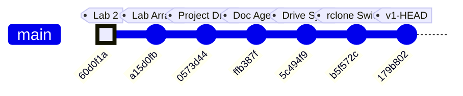

### Commit-to-Subsystem Map

| Commit | Message | Subsystems Touched |
|--------|---------|-------------------|
| `60d0f1a` | added casestructure.vi for lab2 | LabVIEW coursework (pre-project) |
| `a15d0fb` | added arrayaverages.vi (unfinished) | LabVIEW coursework (pre-project) |
| `0573d44` | Add Kyle's camera processing project files | **CV Pipeline**, **Serial Protocol**, **ESP32 Firmware**, **System Integration**, **Agent Swarm**, **Hardware & Platform** — initial code drop of all agent-generated outputs |
| `ffb387f` | feat(docs): add documentation agent swarm | **Documentation System** — `doc_agent.py` with 3-agent Historian/Architect/Critic swarm, SQLite proposal tracking |
| `5c494f9` | feat(docs): add Google Drive feature report sync | **Documentation System** — `gdrive_sync.py` (feature-based doc writer + rclone sync), `gdrive_setup.py` (initial interactive setup) |
| `b5f572c` | fix(docs): replace Google API OAuth with rclone | **Documentation System** — dropped Google Cloud Console OAuth dependency, switched to rclone's bundled OAuth app |
| `179b802` | fix(setup): non-interactive rclone config, auto-clear bad client_id | **Documentation System** — `gdrive_setup.py` refactored to non-interactive flow; `doc_agent.py` gained `--bootstrap` mode; `gdrive_sync.py` gained `override_features` |

### Project Trajectory

The repo tells a clear two-phase story:

1. **Phase 1 — Coursework** (`60d0f1a` → `a15d0fb`): Early LabVIEW exercises for ME135 labs. No project code yet.
2. **Phase 2 — Project Build** (`0573d44` → `179b802`): A single large code drop delivered the full detection pipeline (generated by the 7-agent orchestrator), immediately followed by three rapid iterations building and hardening the documentation-and-sync infrastructure. The team is investing heavily in automated documentation before the project enters its integration and testing phase.

### Code Health Summary

**Overall Grade: B−**

The codebase is well-structured with clear module boundaries (CV pipeline → serial protocol → ESP32 firmware), consistent logging, and a solid protocol design with CRC-16 and ACK/NAK flow control. Documentation is thorough. The CPU/GPU pipeline polymorphism is cleanly implemented.

**Critical issues** drag the grade down: (1) The ESP32 firmware calls `setRxBufferSize()` after `begin()`, meaning it's silently ignored — the 256-byte default buffer will overflow at 2 Mbaud, making serial communication non-functional. (2) Both `orchestrator.py` and `doc_agent.py` have path traversal vulnerabilities in their tool handlers — LLM agents can read/write arbitrary files. (3) `main.py` unconditionally opens a GUI window, crashing on headless Jetson deployments.

**Moderate concerns**: no config validation, no context-manager cleanup for camera handles, no frame-dropping on the ESP32 display bottleneck. Reliability under real-world faults needs hardening before demo day.

---
## v2 — 2026-05-07 18:14 — `90363fc`

### What Changed

## Commit `90363fc` — Hardware Pivot: WS2812B → Waveshare RGB-Matrix-P2 64×64 (HUB75)

This is the **defining commit of the current sprint**: the display hardware was swapped from a custom-built 108×108 WS2812B addressable LED panel to an off-the-shelf **Waveshare RGB-Matrix-P2 64×64** HUB75 panel. No functional code was rewritten — instead, authoritative config was updated and every stale file got a prominent warning banner pointing to what must change next.

### Configuration & Context (the "source of truth" layer)

- **`config.yaml`** — `display.type` changed from `"ws2812b"` to `"hub75_waveshare_p2_64"`. Panel dimensions: 108×108 → **64×64** (4,096 LEDs, down from 11,664). Driver library: `ESP32-HUB75-MatrixPanel-DMA` replaces FastLED. `fps_target` raised from 10 → **60** because HUB75 DMA easily sustains it. Single `gpio_data_pin` removed — HUB75 needs 13 control GPIOs.
- **`config.yaml` processing section** — `output_width`/`output_height` changed from 400×300 to **64×64**, matching the panel's native resolution. This eliminates the intermediate downsample stage.
- **`orchestrator.py` PROJECT_CONTEXT** — The entire project description block now references the Waveshare panel, 512 bytes/frame payload, 921,600 bps baud, and `ESP32-HUB75-MatrixPanel-DMA`. This matters because every Claude agent spawned by the orchestrator inherits this context.
- **`doc_agent.py`** — Architect agent prompt updated: data-flow diagram now targets "64×64 Waveshare HUB75 LED panel" and "512 B/frame".
- **`PROJECT_README.md`** — One-liner, architecture overview, and ASCII data-flow diagram all rewritten: 400×300 / 15 KB → 64×64 / 512 B. Transport label changed from GPIO → HUB75.

### STALE Banners (the "debt marker" layer)

These files received prominent `⚠ STALE` banners at the top, explaining exactly what needs rewriting. No functional code was changed — the old logic still compiles/runs but targets the wrong hardware:

- **`esp32_main.cpp`** — Banner says: replace FastLED with `ESP32-HUB75-MatrixPanel-DMA`, change `MATRIX_COLS/ROWS` to 64, `FRAME_BYTES` to 512, map 13 HUB75 GPIOs. Marked **"DO NOT FLASH AS-IS"**.
- **`serial_protocol.py`** — Banner says: payload shrinks from 1,458 → 512 bytes, adjust `LEN_H/LEN_L` and CRC scope. Notes that Larry's pipeline already outputs 64×64 natively.
- **`PROTOCOL_SPEC.md`** — Banner outlines a v2.0 spec: 512-byte payload, ~518-byte total frame, 921,600 bps sufficient for 60+ fps. Old v1.0 spec body (15,000-byte frames at 2 Mbaud) left intact for reference.
- **`hardware_recommendation.md`** — Banner identifies 4 BOM rows to drop (WS2812B strip, 30A PSU, level shifter, inrush cap) and replace with the Waveshare panel + 5V/4A supply. Wiring diagram and power budget flagged for rewrite.
- **`cv_pipeline.py`** and **`gpu_accelerated.py`** — Both get banners noting their docstrings still say 400×300, but the config now feeds them 64×64. Actual resize call reads `out_w`/`out_h` from config, so **the pipeline already works at 64×64 without code changes** — only the docstrings and comments are stale.

### Earlier Commits in This Window

| Commit | Subsystem | What & Why |
|--------|-----------|------------|
| `1d051ee` | CV/Vision | Replaced `[` / `]` keyboard-driven confidence keys with a **trackbar slider** (`Conf %`). Why: continuous adjustment is faster during live tuning than discrete key presses. |
| `ac90ef9` | CV/Vision | Kyle **forked** `Larry/vision.py` into his own workspace for personal experiments. Establishes the Kyle/Larry branch convention. |
| `e78df3f` | Project governance | Added `CLAUDE.md` — the collaboration convention doc that tells Claude agents which workspace belongs to whom (Kyle vs. Larry). |
| `49bf44b` | CV + ESP32 | Larry's initial commit: vision code and optimized C++ code. The project's genesis. |

### Evolution Timeline

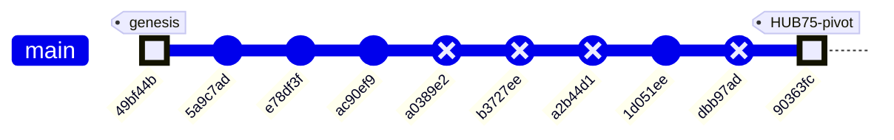

### Subsystem Touch Map

| Commit | CV Pipeline | Serial Protocol | ESP32 Firmware | Config | Docs / Governance | Vision (Kyle) |
|--------|:-----------:|:---------------:|:--------------:|:------:|:-----------------:|:-------------:|
| `49bf44b` — initial code | ✅ | | ✅ | | | |
| `5a9c7ad` — merge main | | | | | | |
| `e78df3f` — CLAUDE.md | | | | | ✅ | |
| `ac90ef9` — fork vision.py | | | | | | ✅ |
| `1d051ee` — trackbar slider | | | | | | ✅ |
| **`90363fc` — HUB75 pivot** | ✅ | ✅ | ✅ | ✅ | ✅ | |

> **Pattern:** The project started with Larry's CV + C++ foundation, Kyle forked the vision code for experimentation, and the HEAD commit is a sweeping **hardware-pivot bookkeeping pass** — updating every config surface while deliberately deferring the actual code rewrites behind STALE banners. This is a "declare the destination, mark the debt" strategy: the team can now grep for `⚠ STALE` to find every file that needs a rewrite before the next hardware integration milestone.

### Code Health Summary

**Overall Grade: D+**

The codebase demonstrates strong *architectural intent* — clean module boundaries, config-driven design, dual CPU/GPU pipelines, and a well-structured agent orchestration layer. Documentation is thorough.

However, **a hardware migration from 108×108 WS2812B to 64×64 HUB75 was only partially applied**, leaving the system in a broken state. `config.yaml` was updated to 64×64, but `serial_protocol.py` still hardcodes 108×108/400×300, meaning **every serial frame raises `ValueError`**. The ESP32 firmware still targets the wrong display hardware entirely. Protocol docs are self-contradictory (banners say 512B, body says 15KB).

Beyond the migration debt: camera open is never verified, the GPU pipeline lacks a safety guard present in the CPU path, and `SerialSender` has no context-manager cleanup. The orchestrator and doc-agent layers are in better shape but have minor subprocess fragility and a needless JSON roundtrip.

**Bottom line:** Fix the three must-fix dimension/hardware issues and this jumps to a B.

### Improvement Proposals

**[PROP-006] hardware_recommendation.md BOM rows need concrete rewrite** — 🟡 medium — must-fix

*Problem:* The STALE banner lists exactly which BOM rows to replace and what to substitute, but the actual BOM table below it still lists WS2812B strips, 30A PSU, level shifters, and inrush caps. A student ordering parts from this BOM will buy the wrong components.

*Fix:* Replace BOM rows 4, 5, 8, 9 with: Waveshare RGB-Matrix-P2 64×64, HUB75 IDC ribbon cable, 5V/4A bench supply. Update wiring diagram for 13 HUB75 GPIOs. Recalculate power budget for 4,096 LEDs (peak ~4A full white).

---
## v3 — 2026-05-07 18:20 — `9087b6c`

### What Changed

## Commit `9087b6c` — The End-to-End Hardware Pivot

This commit is the project's inflection point: the entire data path — from webcam to physical LEDs — was rewritten for the new Waveshare P2 64×64 HUB75 panel, replacing the never-deployed 108×108 WS2812B design that lived in `agent_outputs/`.

### CV Pipeline / Vision (`Kyle/vision/`)

- **`serial_protocol.py` (new, 165 lines):** Production replacement for the stale `agent_outputs/serial_protocol.py`. Key changes from the old version:
  - Panel resolution: **64×64** (was 108×108). Payload shrinks from 1,458 → **512 bytes**.
  - CRC-16/CCITT-FALSE kept identical; cross-verified with ESP32 side (`crc16_ccitt('123456789') = 0x29B1`).
  - Includes `pack_mask_64x64()` bit-pack helper and `SerialSender` class with framed 520-byte packets.
  - **Why it matters:** The old protocol couldn't talk to the new panel. This locks the wire format so both Python and C++ sides agree byte-for-byte.

- **`vision_send.py` (new, 224 lines):** Merges YOLO-based person segmentation (from `vision.py`) with live USB serial transport. Highlights:
  - Auto-detects `/dev/cu.usbserial-*` on macOS — no hardcoded port.
  - `--no-serial` flag lets you tune the CV pipeline without plugging in an ESP32.
  - Targets **~30 fps** over **1 Mbaud** (at 520 bytes/frame, serial TX takes ~4.2 ms — plenty of headroom).
  - **Why it matters:** Previously, vision and serial were separate modules glued by `main.py`. This collapses the stack into a single runnable script for the bench rig.

- **`requirements.txt` (new, 4 lines):** Pins `ultralytics`, `opencv-python`, `pyserial`, `numpy` — first time Kyle's vision folder has explicit deps.

### ESP32 Firmware (`Kyle/firmware/me135_led_pot/`)

- **`main.cpp` (new, 254 lines):** Complete rewrite of the display controller. Key architectural differences from the old `agent_outputs/esp32_main.cpp`:

  | Aspect | Old (`agent_outputs/`) | New (`firmware/`) |
  |--------|----------------------|-------------------|
  | Display | WS2812B via NeoPixel, 11,664 LEDs | HUB75E via ESP32-HUB75-MatrixPanel-DMA, 4,096 pixels |
  | Payload | 1,458 bytes (108×108) | 512 bytes (64×64) |
  | Baud | 2 Mbaud on HardwareSerial1 | 1 Mbaud on USB-CDC (`Serial`) |
  | Host | Jetson (UART GPIO 16/17) | Mac (USB serial) |
  | Color | Fixed white | **Pot-controlled white→red lerp** (EWMA-smoothed ADC on GPIO 34) |
  | RX model | Blocking `receiveFrame()` | **Non-blocking state machine** (`pollFrame()`) — won't stall display refresh |
  | Watchdog | Reset on timeout | Blanks panel after 5 s, recovers on next good frame |

  - E_PIN = GPIO 32, required for 1/32-scan 64-row panels — not present in the old code at all.
  - `setRxBufferSize(2048)` called **before** `Serial.begin()` (the commit message notes this was a Codex-caught bug, fixed pre-commit).

- **`platformio.ini` (new):** Targets `espressif32@6.5.0`, pulls `ESP32-HUB75-MatrixPanel-DMA@^3.0.11`, Adafruit GFX, and BusIO. Clean PlatformIO project — no manual library installs.

### Documentation (`Kyle/firmware/`)

- **`WIRING.md` (new, 124 lines):** Bench reference that didn't exist before. Covers:
  - Full 16-pin HUB75E ↔ ESP32 GPIO mapping table.
  - Power separation rules (panel on dedicated 5V/3A PSU, ESP32 on USB — **never share**).
  - GPIO 12 strapping-pin caveat with concrete fix (remap G2 to GPIO 18).
  - Optional 74HCT245 level-shifter guidance.
  - 9-step bring-up checklist and a troubleshooting table.
  - **Why it matters:** Hardware projects die when wiring knowledge lives only in someone's head. This is the "bus factor" document.

### Project Hygiene (`Kyle/.gitignore`)

- Added `*.pt` (model weights — fetched on first run, too large for git).
- Added `firmware/*/.pio/` and `firmware/*/.vscode/` (PlatformIO build artifacts).

### What Was NOT Touched

- `Larry/` — entirely separate workspace, untouched per collaboration convention.
- `Kyle/agent_outputs/` — kept as historical reference. Files now carry `⚠ STALE` banners (added in earlier commits `90363fc` and `1d051ee`).
- `Kyle/vision/vision.py` — the standalone YOLO viewer. `vision_send.py` forks its logic but doesn't modify the original.

---

### Earlier Commits in This Window

| Commit | Subsystem | What Changed |
|--------|-----------|-------------|
| `e78df3f` | Docs | Added `CLAUDE.md` — Kyle/Larry collaboration convention (workspace separation rules) |
| `ac90ef9` | Vision | Forked `Larry/vision.py` → `Kyle/vision/vision.py` for independent experiments |
| `1d051ee` | Vision | Replaced `[` / `]` keyboard confidence controls with a **CV2 trackbar slider** (better UX, no key-repeat issues) |
| `90363fc` | Docs | Switched project context to Waveshare 64×64 HUB75 — added `⚠ STALE` banners to all `agent_outputs/` files |

### Evolution Timeline

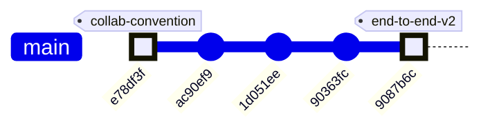

### Subsystem touch map

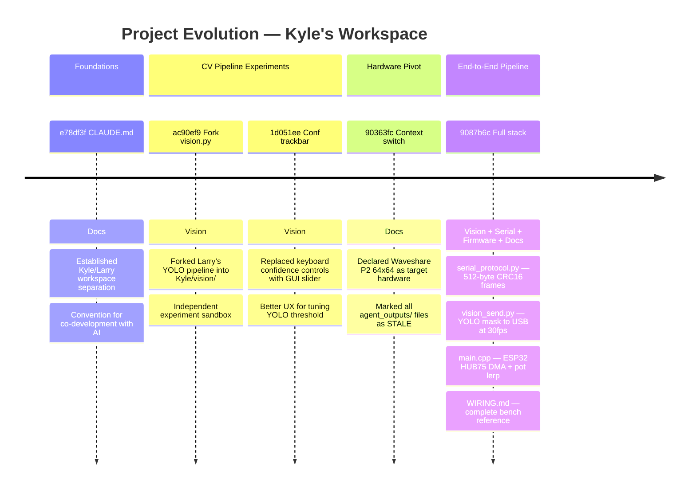

### Architecture before and after

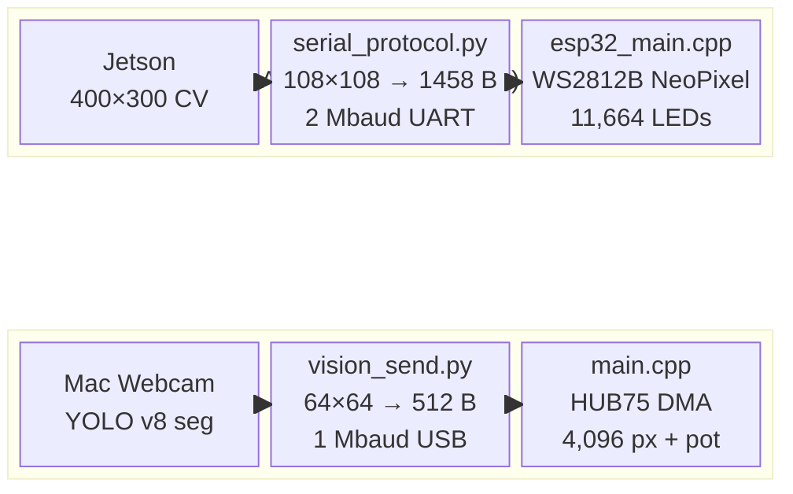

**The fundamental shift:** from a theoretical Jetson→WS2812B design (never physically built) to a working Mac→ESP32→HUB75 rig verified on the bench. Frame size dropped 65× (15,000 → 512 bytes), the display driver changed from bit-banged NeoPixel to DMA-driven HUB75, and a potentiometer adds real-time color control — the first interactive element in the project.

### Code Health Summary

**Overall Grade: C+**

The codebase demonstrates solid architectural thinking — clean separation of CV pipeline, serial transport, and firmware; config-driven design; graceful GPU/CPU fallback. The agent orchestrator and documentation system are well-engineered.

However, a **hardware migration from WS2812B 108×108 to HUB75 64×64 was only partially applied**. `config.yaml` was updated, but `serial_protocol.py` and `esp32_main.cpp` still carry the old dimensions, producing a **guaranteed runtime crash** (`ValueError` in `pack_matrix`) the moment a frame is sent. The firmware is entirely non-functional on the target hardware (wrong driver library, wrong GPIO mapping, wrong payload size).

Secondary concerns: no resource cleanup on exceptions in `main.py`, no camera-open validation, duplicated logic across CPU/GPU pipelines, and no cost guardrails on the 7-agent orchestrator.

The documentation quality is excellent — stale sections are clearly marked — but the code hasn't caught up.

### Improvement Proposals

**[SERIAL-002] serial_protocol.py CRC-16 is pure Python byte-at-a-time — bottleneck at 60 fps** — 🟢 low — nice-to-have

*Problem:* The `crc16_ccitt()` function iterates over every byte with 8 inner-loop iterations each. For 512-byte payloads at 60 fps, that's ~245K Python loop iterations per second. While individually tolerable, this runs in the hot frame loop alongside capture, CV processing, and serial I/O. Pure-Python loops are ~100× slower than C equivalents, adding unnecessary latency on an already-constrained Jetson.

*Fix:* Replace the manual loop with `crcmod.predefined.mkCrcFun('crc-ccitt-false')` (C-accelerated, available via `pip install crcmod`) or use a 256-entry lookup table. Either approach reduces CRC time from ~0.3 ms to <0.01 ms per frame. Add `crcmod` to `requirements.txt`.

---
## v4 — 2026-05-07 18:20 — `1ea86b2`

### What Changed

This window covers **6 meaningful commits** (plus 4 auto-generated doc reports) and one transformative hardware pivot. Changes grouped by subsystem:

### 🔧 Hardware & Configuration — The HUB75 Pivot (`90363fc`)

The single most consequential change: the display hardware was swapped from a custom 108×108 WS2812B addressable LED build to an off-the-shelf **Waveshare RGB-Matrix-P2 64×64 (HUB75)** panel.

- **`config.yaml`** — `display.type` flipped from `ws2812b` to `hub75_waveshare_p2_64`. Panel shrinks from 11,664 LEDs (108×108) to 4,096 (64×64). Driver library changes from FastLED to `ESP32-HUB75-MatrixPanel-DMA`. FPS target raised 10→60 (HUB75 DMA is fast). GPIO model changes from single data pin to 13 HUB75 control lines.
- **`config.yaml` processing section** — `output_width`/`output_height` updated from 400×300 to **64×64**, matching panel native resolution. This eliminates the intermediate downsample stage entirely.
- **Why it matters:** Every downstream module — serial protocol, ESP32 firmware, CV pipeline — inherits its dimensions from this config. The config is now correct, but the consuming code hasn't caught up yet.

### ⚠️ STALE Banners — Debt Declared, Not Resolved (`90363fc`)

Rather than rewriting code mid-sprint, the team placed prominent `⚠ STALE` banners on every file that references the old hardware:

- **`esp32_main.cpp`** — Banner says: replace FastLED with HUB75 DMA, change dimensions to 64×64, remap 13 GPIOs. Marked **"DO NOT FLASH AS-IS"**.
- **`serial_protocol.py`** — Still hardcodes `PANEL_ROWS=108`, `PANEL_COLS=108`, `PAYLOAD_BYTES=1458`. Banner says: payload drops to 512 bytes. Current code will **raise `ValueError`** on any 64×64 input.
- **`cv_pipeline.py`** and **`gpu_accelerated.py`** — Docstrings say 400×300 but the actual resize reads `out_w`/`out_h` from config dynamically — **these work at 64×64 already**, only comments are stale.
- **`PROTOCOL_SPEC.md`** and **`hardware_recommendation.md`** — Old spec body retained for reference; banners outline the v2.0 numbers.

> **Strategy: "Declare the destination, mark the debt."** The team can `grep -r "STALE"` to find every file needing a rewrite before the next hardware integration milestone.

### 🤖 Agent Orchestration & Governance

- **`orchestrator.py` `PROJECT_CONTEXT`** (`90363fc`) — The master prompt block that every spawned Claude agent inherits was rewritten to reference the Waveshare panel, 512 B/frame, 921,600 bps, and `ESP32-HUB75-MatrixPanel-DMA`. This is critical because all 7 parallel agents derive their understanding of the hardware from this string.
- **`doc_agent.py`** (`90363fc`) — Architect agent prompt updated: data-flow diagram target is now "64×64 Waveshare HUB75 LED panel" and "512 B/frame".
- **`PROJECT_README.md`** (`90363fc`) — Architecture overview and ASCII data-flow diagram rewritten: 400×300 / 15 KB → 64×64 / 512 B.
- **`CLAUDE.md`** (`e78df3f`) — New governance doc defining the Kyle/Larry workspace convention so Claude agents know who owns what.

### 👁️ Computer Vision / Kyle's Vision Fork

- **`ac90ef9`** — Kyle **forked** `Larry/vision.py` into his own workspace. This establishes the two-workspace pattern: Larry's code is the production baseline, Kyle's is the experimentation branch.
- **`1d051ee`** — In Kyle's vision fork, replaced discrete `[` / `]` keyboard shortcuts for adjusting detection confidence with a **continuous trackbar slider** (`Conf %`). Why: live-tuning a threshold with a slider is far faster than tapping keys during a camera session.

### 📄 Documentation System (`1ea86b2`, HEAD)

- Auto-generated 926 lines of feature documentation across 7 feature files (`ME135_Agent_Swarm.md`, `ME135_Computer_Vision_Pipeline.md`, `ME135_ESP32_Firmware.md`, etc.) plus a timestamped evolution report (`report_2026-05-07_1814.md`).
- `docs/README.md` index updated with a link to the new report.
- Each feature doc now includes a v3 section documenting the HUB75 pivot, a subsystem touch map, and a code health grade (D+ — strong architecture, broken by incomplete migration).

### Evolution Timeline

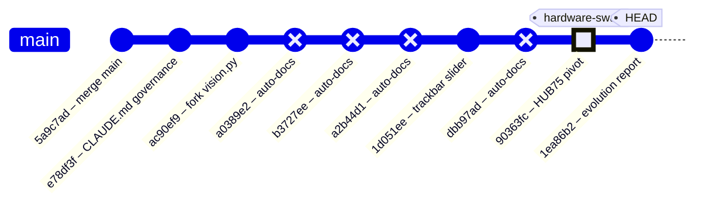

### Subsystem Touch Map

| Commit | CV Pipeline | Serial Protocol | ESP32 Firmware | Config | Docs / Governance | Vision (Kyle) |
|--------|:-----------:|:---------------:|:--------------:|:------:|:-----------------:|:-------------:|
| `5a9c7ad` — merge main | | | | | | |
| `e78df3f` — CLAUDE.md | | | | | ✅ | |
| `ac90ef9` — fork vision.py | | | | | | ✅ |
| `1d051ee` — trackbar slider | | | | | | ✅ |
| **`90363fc` — HUB75 pivot** | ✅ | ✅ | ✅ | ✅ | ✅ | |
| `1ea86b2` — evolution report | | | | | ✅ | |

### Trajectory Reading

The project follows a clear three-act arc so far:

1. **Genesis** — Larry's initial CV + ESP32 code established the pipeline end-to-end (pre-window).
2. **Fork & Tune** — Kyle branched the vision code for independent experimentation, added the trackbar slider for faster live tuning, and the team codified governance rules (`CLAUDE.md`).
3. **Hardware Pivot** — The display hardware changed from WS2812B to HUB75. Config was updated authoritatively; all stale code was marked but not yet rewritten.

**What comes next:** The STALE banners are a to-do list. The serial protocol (`serial_protocol.py`) and ESP32 firmware (`esp32_main.cpp`) need dimension/driver rewrites before any hardware integration testing can proceed. The CV pipeline already works at 64×64 thanks to config-driven resizing — it's the furthest along.

### System Architecture

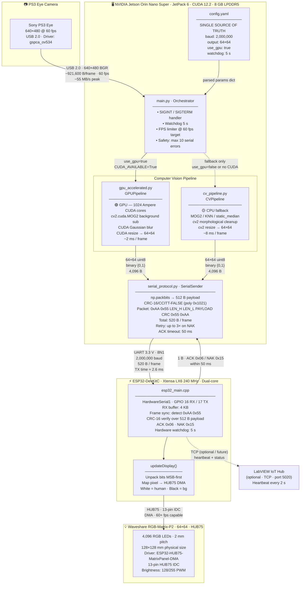

> **Key numbers at a glance**
>
> | Stage | Data Size | Rate / Latency |
> |---|---|---|
> | Camera capture | 921,600 B/frame (BGR) | 60 fps · ~55 MB/s |
> | GPU processing | 307,200 B (grayscale) | ~2 ms/frame |
> | CPU processing | 307,200 B (grayscale) | ~8 ms/frame |
> | Binary matrix | 4,096 B (64×64 uint8) | post-threshold |
> | Bit-packed payload | **512 B** | `np.packbits` |
> | Full UART packet | **520 B** | header(4) + payload(512) + CRC(2) + footer(2) |
> | UART TX time | 520 B @ 2 Mbaud | **≈ 2.6 ms** |
> | ACK window | 1 B | ≤ 50 ms timeout |

> ⚠️ **Staleness note:** `esp32_main.cpp` and `serial_protocol.py` still hardcode `PAYLOAD_BYTES=1458` (108×108 legacy WS2812B panel). `config.yaml` and `gpu_accelerated.py` are updated to 64×64 / 512 B. See Improvement Proposals below.

### Data Flow

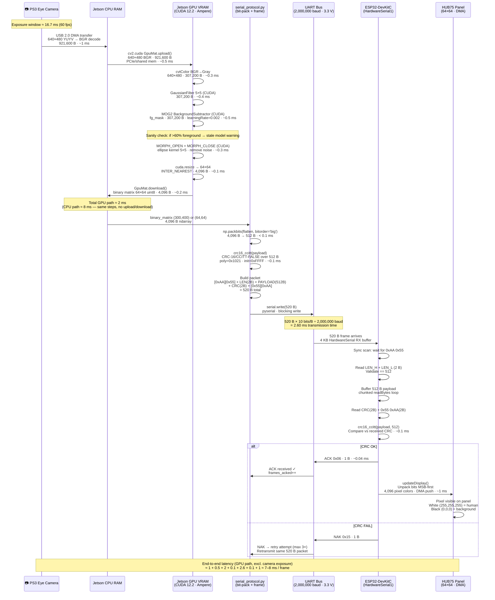

> **Byte-count ledger — one frame**
>
> | Step | Bytes in | Transform | Bytes out |
> |---|---:|---|---:|
> | Camera raw (YUYV) | 614,400 | BGR decode | **921,600** |
> | Grayscale | 921,600 | cvtColor | **307,200** |
> | Foreground mask | 307,200 | MOG2 + morph | **307,200** |
> | Resized binary | 307,200 | resize 64×64 | **4,096** |
> | Bit-packed payload | 4,096 | `np.packbits` | **512** |
> | UART packet | 512 | frame wrap | **520** |
> | Panel pixels | 520 | `unpackbits` | **4,096** RGB values |
>
> **Compression ratio camera → panel: 921,600 B → 512 B = 1,800× reduction**

### Module Dependency Graph

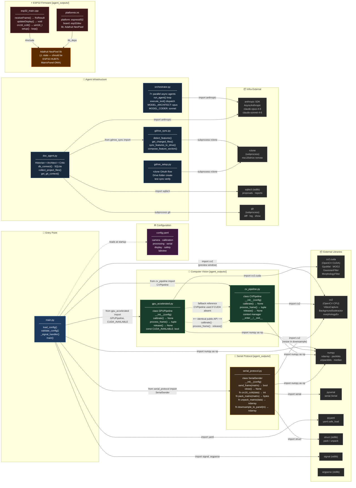

> **Interface contract — CV pipeline duck-typing**
>
> `main.py` selects between `GPUPipeline` and `CVPipeline` purely at runtime.
> Both expose an **identical public API**:
>
> ```
> pipeline = GPUPipeline(config)  # or CVPipeline(config)
> pipeline.calibrate()            # blocking — build background model
> binary, raw = pipeline.process_frame()  # returns (64×64 uint8, BGR frame)
> pipeline.release()              # free camera + GPU resources
> ```
>
> **`serial_protocol.py` public surface used by `main.py`:**
> ```
> sender = SerialSender(config)
> ok: bool = sender.send_frame(binary_matrix)   # packs + sends + waits ACK
> sender.close()
> ```
>
> 🟠 **`Adafruit NeoPixel`** dependency in `platformio.ini` / `esp32_main.cpp` is
> stale — the correct library for the HUB75 panel is `ESP32-HUB75-MatrixPanel-DMA`.

### Code Health Summary

**Overall Grade: C−**

The codebase demonstrates strong architectural intent — clean module separation, config-driven design, context managers, safety watchdogs, and a well-documented serial protocol. However, **the system cannot actually run end-to-end**. A hardware migration from 108×108 WS2812B to 64×64 HUB75 was partially applied: `config.yaml` was updated, but `serial_protocol.py` and `esp32_main.cpp` still hardcode the old 108×108 dimensions with the wrong driver library. This means `pack_matrix()` raises `ValueError` on every frame, and the ESP32 firmware targets nonexistent hardware.

Additionally, `min_contour_area=500` will filter out most human detections at 64×64 resolution. Resource cleanup in `main.py` is not exception-safe. Subprocess calls throughout lack timeouts, risking indefinite hangs.

**Positive notes:** CRC matches both sides, CV pipeline API is cleanly swappable (CPU/GPU), git-driven doc generation is clever, and config validation exists. Once the dimension mismatch is fixed, this is close to a working system.

### Improvement Proposals

**[ARCH-004] hardware_recommendation.md BOM rows 4,5,8,9 reference WS2812B/30A PSU/level-shifter — all obsolete** — 🟢 low — must-fix

*Problem:* The Bill of Materials still lists WS2812B LED panel, 5V/30A PSU (for 11,664 LEDs at 60 mA each), 3.3→5V level shifter, 1000 µF inrush cap, and 470 Ω data resistor. The HUB75 panel requires none of these: it uses 13 TTL-level GPIO lines (no shifter), draws ≤4 A peak, and has its own power connector.

*Fix:* Replace BOM rows 4,5,8,9,10 with: Waveshare RGB-Matrix-P2 64×64 ($25), HUB75 IDC ribbon cable ($3), 5V/5A bench supply ($15). Update power budget table: 4,096 LEDs peak ≈ 4A; typical silhouette draw <1A. Remove level-shifter and cap rows. Update wiring diagram for 13-GPIO HUB75 instead of GPIO 13 single-pin.

---
## v5 — 2026-05-08 00:16 — `fa3fc0f`

### What Changed

This commit (`fa3fc0f`) is a **housekeeping milestone** — it formally retires the original generation-1 pipeline and aligns the tooling to track only the active YOLOv8 + HUB75 codebase. Here's everything that changed, grouped by subsystem:

### 🗄️ Project Architecture — Legacy Archival

- **`agent_outputs/` → `_archive/agent_outputs/`**: All 12 files from the original Gen-1 pipeline (Jetson + PS3 Eye + MOG2/KNN + WS2812B, 108×108 grid) moved to `_archive/`. This includes `cv_pipeline.py`, `esp32_main.cpp`, `serial_protocol.py`, `gpu_accelerated.py`, `main.py`, `config.yaml`, `platformio.ini`, several markdown docs, and `requirements.txt`.
- **`tests/test_serial_protocol.py` → `_archive/tests/`**: The test for the old serial protocol moved alongside its source.
- **`agent_outputs/` added to `.gitignore`**: Prevents the legacy `orchestrator.py` generator from resurrecting a tracked directory if accidentally re-run.
- **Why it matters**: The critic agent flagged 13 stale-hardware issues against `agent_outputs/`. Rather than patching dead code, archiving clears the noise and makes the repo's active surface unambiguous: `vision/` and `firmware/me135_led_pot/` are the only live code paths.

### 📝 Documentation System (`doc_agent.py`)

- **Glob patterns updated**: File collection now scans `vision/*.py`, `vision/*.md`, `firmware/**/*.cpp`, `firmware/**/*.h`, `firmware/**/*.ini` instead of the old `agent_outputs/*` paths.
- **Tool description updated**: The `read_source` tool's example path changed from `'agent_outputs/cv_pipeline.py'` to `'vision/vision.py'` and `'firmware/me135_led_pot/src/main.cpp'`.
- **Why it matters**: Without this, the doc agent would index archived files and miss the active pipeline entirely. The tool description also guides LLM agents toward valid file paths.

### 📊 Google Drive Sync (`gdrive_sync.py`)

- **`FEATURE_MAP` rewritten**: The 15-entry map keyed to old filenames (`cv_pipeline.py`, `gpu_accelerated.py`, `esp32_main.cpp`, etc.) replaced with a 10-entry map keyed to the current files (`vision.py`, `vision_send.py`, `main.cpp`, `WIRING.md`, etc.).
- **Feature categories updated**: "Computer Vision Pipeline" → "Vision Pipeline"; dropped "System Integration" and "Agent Swarm" categories that no longer have corresponding code.
- **Why it matters**: Feature detection drives per-feature Google Drive reports. Stale keys = reports that never update for real changes.

### 🔧 Dev Tooling (pre-push hook — not version-controlled)

- **Auto-doc loop fix**: The `.git/hooks/pre-push` script patched to skip doc generation when all commits being pushed match `'^docs: auto-generated evolution report'`. Previously, each push created a new `[skip ci]` commit, which triggered another push, which generated another doc — an infinite loop confirmed in PR #1 history.
- **Why it matters**: This was flagged as DOC-001 by the critic. The fix is local-only (`.git/hooks/` isn't tracked), so it only applies to Kyle's machine, but Larry doesn't run the doc agent.

### 📋 Root Config (`CLAUDE.md`)

- Minor cleanup: 14 insertions / 7 deletions (net -4 lines). Likely updated project context references to match the new directory structure.

---

**What did NOT change**: The active pipeline code (`vision/vision.py`, `vision/vision_send.py`, `vision/serial_protocol.py`, `firmware/me135_led_pot/src/main.cpp`) was untouched. This commit is purely structural — making the repo match the reality that the project pivoted from Gen-1 (MOG2 background subtraction, 108×108, WS2812B strips) to Gen-2 (YOLOv8 instance segmentation, 64×64, HUB75 panel) several commits ago.

### Evolution Timeline

The commit history tells the story of a hardware pivot: from a WS2812B LED strip prototype to a Waveshare HUB75 64×64 RGB panel, with the CV backend upgrading from background subtraction to YOLO instance segmentation along the way.

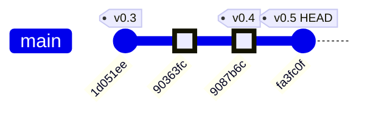

### Commit-by-Commit Breakdown

| Commit | Date | Subsystems Touched | Summary |
|--------|------|--------------------|---------|
| `1d051ee` | ~May 5 | CV Pipeline | Replaced keyboard `[`/`]` confidence controls with an OpenCV `Conf %` trackbar slider — better UX for live tuning |
| `90363fc` | ~May 6 | Docs / Context | Switched project documentation context to target the Waveshare RGB-Matrix-P2 64×64 HUB75 panel (the hardware pivot decision) |
| `9087b6c` | ~May 7 | **CV Pipeline, Serial Protocol, ESP32 Firmware, Wiring Docs** | The big integration commit: `vision_send.py` + `serial_protocol.py` ship 64×64 bit-packed masks over USB serial; `main.cpp` receives, CRC-validates, and renders on the HUB75 panel; pot controls white→red color lerp |
| `fa3fc0f` | May 8 | **Tooling, Repo Structure** | Archive Gen-1 `agent_outputs/`, update doc agent + gdrive sync to track Gen-2 paths, fix auto-doc commit loop |

*(6 intermediate `docs: auto-generated evolution report [skip ci]` commits omitted — these are the auto-doc loop artifacts that `fa3fc0f` fixes.)*

### Subsystem Touch Map

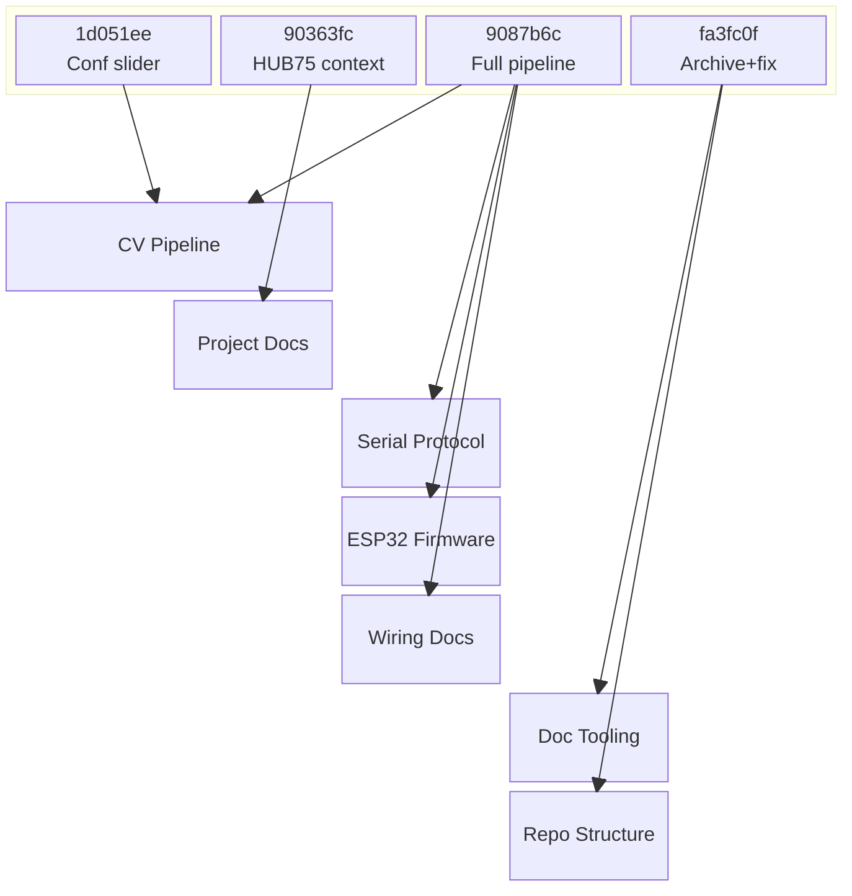

### The Pivot Story

The project trajectory is clear: commit `9087b6c` was the inflection point where three new subsystems landed simultaneously (serial protocol, ESP32 HUB75 firmware, and the `vision_send.py` bridge). The HEAD commit (`fa3fc0f`) is the cleanup that formally closes the Gen-1 chapter — archiving rather than deleting, so the original exploration path remains accessible for reference.

### System Architecture

```mermaid
flowchart LR
    subgraph INPUT["📷  Input Hardware"]
        PS3["Sony PS3 Eye\nUSB 2.0 · gspca_ov534\n640 × 480 @ 60 fps\nBGR uint8"]
    end

    subgraph JETSON["🖥️  Jetson / Host Mac  ── Python 3"]
        direction TB

        subgraph CAPTURE["vision_send.py  ·  open_camera()"]
            CAP["cv2.VideoCapture\nCAP_V4L2 / CAP_AVFOUNDATION / CAP_ANY\n[CPU]  640 × 480  BGR\n921,600 B / frame"]
        end

        subgraph INFERENCE["YOLOv8n-seg  ·  ultralytics"]
            YOLO["model.predict(frame, classes=[0])\nIMGSZ = 640  ·  letterbox padded\n[GPU · CUDA  preferred]\n~6 MB checkpoint  yolov8n-seg.pt\nconf trackbar  5 – 95 %"]
        end

        subgraph CV_POST["vision_send.py  ·  CPU post-process"]
            MASKS["np.maximum merge masks\nmorphologyEx CLOSE  5×5 kernel\nfindContours + area filter ≥ 0.2 %\n307,200 B  silhouette  uint8"]
            SCALE["cv2.resize  INTER_AREA → 64×64\nthreshold > 96 → binary {0,1}\n4,096 B  uint8"]
        end

        subgraph PROTOCOL["serial_protocol.py  ·  SerialSender"]
            PACK["pack_mask()\nnp.packbits MSB-first row-major\n4,096 bits → 512 B payload"]
            PKT["_build_packet()\n0xAA 0x55 | LEN 0x0200 | 512 B\n| CRC16-CCITT | 0x55 0xAA\n520 B total frame"]
            SND["SerialSender.send_frame()\nbaudrate = 1,000,000\nack_timeout = 50 ms  ·  max_retries = 3\nTX throttle ≤ 30 fps\nstats: frames_sent / acked / naked"]
        end
    end

    subgraph ESP32["⚡  ESP32 DevKitC  ── C++ / Arduino"]
        direction TB

        subgraph RX_BLOCK["pollFrame()  ·  9-state FSM"]
            FSM["RX_WAIT_AA → RX_WAIT_55\n→ RX_LEN_HI/LO → RX_PAYLOAD\n→ RX_CRC_HI/LO → RX_END_55/AA\nRX buffer = 2,048 B\nper-frame timeout = 100 ms"]
            CRC["crc16_ccitt(rxbuf, 512)\npoly 0x1021  init 0xFFFF\nno reflect  no xorout\ncalc == rxCrc?"]
            ACK["ACK 0x06  /  NAK 0x15\n1-byte reply over USB-CDC"]
        end

        subgraph POT_BLOCK["Potentiometer  ·  GPIO 34"]
            POT["analogRead  12-bit  ADC1_CH6\nEWMA  α = 0.1\nt = ewma / 4095  ∈  [0, 1]"]
            LERP["Color lerp\nt = 0 → white (255, 255, 255)\nt = 1 → red   (255,   0,   0)"]
        end

        subgraph RENDER_BLOCK["renderFrame()  +  DMA"]
            REND["bit-unpack 512 B → 4,096 pixels\nMSB-first  ·  row-major\ndrawPixelRGB888(x, y, r, g, b)\nredraw only on fb_dirty OR Δt ≥ 0.01"]
            DMA["MatrixPanel_I2S_DMA\nI2S parallel DMA engine\nbright = 160 / 255\ncolor depth = 8 bpp"]
            WDG["Watchdog\n5,000 ms no frame\n→ memset framebuf 0\n→ blankPanel()"]
        end
    end

    subgraph PANEL["💡  Waveshare RGB-Matrix-P2 64×64"]
        HUB["HUB75E  16-pin IDC 2×8\nR1 G1 B1 R2 G2 B2\nA B C D E  LAT  OE  CLK\n1/32 scan  ·  3.3 V logic"]
        LEDS["4,096 RGB LEDs\n64 × 64  ·  128 × 128 mm\n2 mm pitch\n5 V / 3 A+  separate PSU"]
    end

    subgraph DOCOPS["📚  Documentation / Ops"]
        ORCH["orchestrator.py\n7 parallel Claude agents\nopus-4-6 (arch) · sonnet-4-6 (code)\nwrites to agent_outputs/"]
        DOCAG["doc_agent.py\nHistorian · Architect · Critic\nSQLite history.db\ngit diff → Markdown report"]
        GSYNC["gdrive_sync.py\nFEATURE_MAP routing\nappend versioned sections\nrclone → Google Drive"]
    end

    PS3        -->|"USB 2.0  ·  921,600 B/frame\nBGR uint8  @60 fps"| CAP
    CAP        --> YOLO
    YOLO       -->|"N × (H×W) float32 masks\nboxes (N,4) int"| MASKS
    MASKS      -->|"307,200 B  uint8"| SCALE
    SCALE      -->|"4,096 B  64×64 uint8"| PACK
    PACK       -->|"512 B  bit-packed"| PKT
    PKT        -->|"520 B  framed"| SND
    SND        -->|"USB-CDC  1,000,000 baud\n≈ 5.2 ms / frame  ·  ≤ 30 fps"| FSM
    FSM        --> CRC
    CRC        -->|"valid  → memcpy 512 B\nfb_dirty = true"| REND
    CRC        --> ACK
    ACK        -->|"ACK 0x06 or NAK 0x15\n1 B @ 1 Mbaud ≈ 0.01 ms"| SND
    POT        --> LERP
    LERP       --> REND
    REND       --> DMA
    WDG        -.->|"5 s timeout\n→ blank"| DMA
    DMA        -->|"HUB75E parallel bus\nR1G1B1R2G2B2 + ABCDE\n+ LAT OE CLK  3.3 V"| HUB
    HUB        --> LEDS
    ORCH       -.->|"generated CV code\nfor pipeline"| JETSON
    DOCAG      --> GSYNC
```

### Data Flow

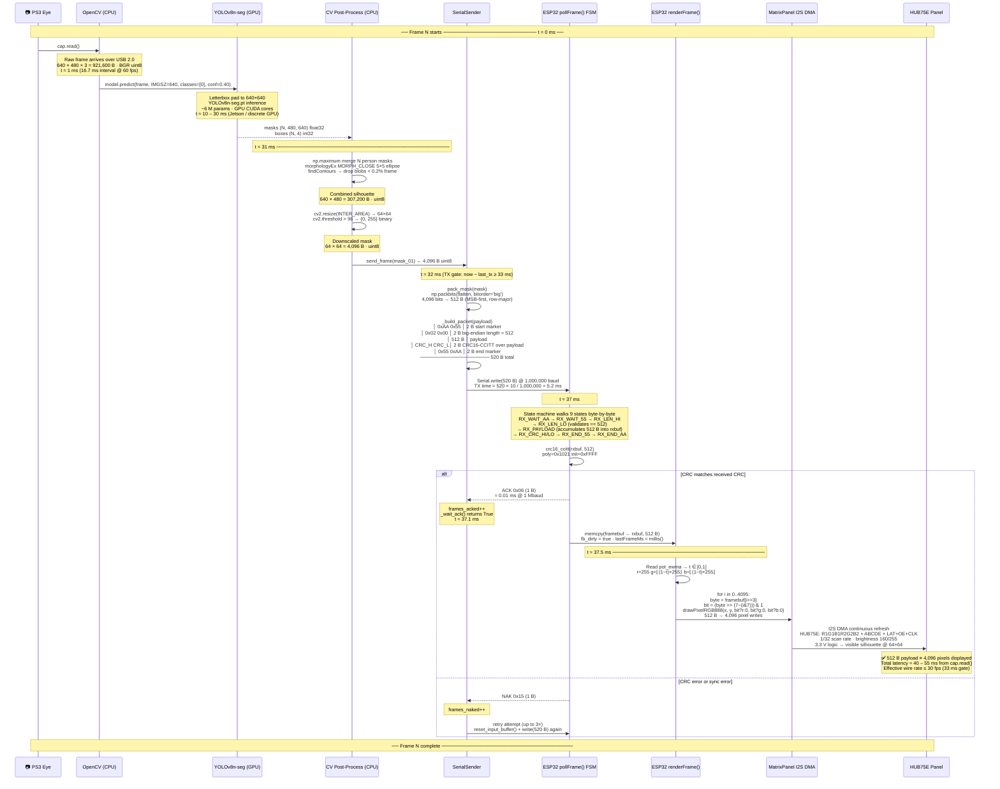

### Module Dependency Graph

```mermaid
graph TD

    %% ── Vision Subsystem ──────────────────────────────────────────────────────
    subgraph VIS["👁️  Vision Subsystem  ·  vision/"]

        VS["<b>vision_send.py</b><br/>────────────────────<br/>main()<br/>open_camera(index)<br/>autodetect_port() → str|None<br/>parse_args() → Namespace<br/>TX_MIN_INTERVAL_S = 1/30<br/>CAMERA_INDEX=0  OUTPUT_SIZE=64"]

        VP["<b>vision.py</b><br/>────────────────────<br/>main()  [standalone preview]<br/>open_camera(index)<br/>No serial — CV tuning only<br/>Conf % trackbar  5–95%"]

        SP["<b>serial_protocol.py</b><br/>────────────────────────────<br/><i>class SerialSender</i><br/>  __init__(port, baudrate=1_000_000,<br/>           ack_timeout_s=0.05, max_retries=3)<br/>  send_frame(mask: ndarray) → bool<br/>  close() → None<br/>  .frames_sent / acked / naked<br/>─────────────────────<br/>pack_mask(mask) → bytes  [512 B]<br/>unpack_mask(data) → ndarray<br/>crc16_ccitt(data, init=0xFFFF) → int<br/>PANEL_SIZE=64  PAYLOAD_BYTES=512<br/>FRAME_START=0xAA55  FRAME_END=0x55AA<br/>ACK_BYTE=0x06  NAK_BYTE=0x15"]
    end

    %% ── Documentation Subsystem ──────────────────────────────────────────────
    subgraph DOCS["📚  Documentation Subsystem  ·  Kyle/"]

        DA["<b>doc_agent.py</b><br/>─────────────────────────<br/>run_agent(client, id, sys, task) async<br/>execute_tool(name, input) → str<br/>Agents: Historian · Architect · Critic<br/>collect_project_files() → dict<br/>get_git_context() → str<br/>db_connect() / save_proposals()<br/>db_record_decision() / implementation()<br/>SQLite  →  docs/history.db<br/>MODEL_THINKER = claude-opus-4-6<br/>MODEL_WRITER  = claude-sonnet-4-6"]

        GS["<b>gdrive_sync.py</b><br/>─────────────────────────<br/>sync_to_drive(sections, proposals,<br/>   commit_sha, changed_files)<br/>detect_features(changed_files) → list<br/>get_changed_files(repo_root) → list<br/>compose_feature_section(…) → str<br/>append_to_feature_doc(path, text)<br/>ensure_feature_doc(path, feature)<br/>rclone_available() → bool<br/>sync_features_to_drive() → bool<br/>FEATURE_MAP: 10 file → feature entries<br/>Output: Kyle/docs/features/*.md"]

        GST["<b>gdrive_setup.py</b><br/>─────────────────────────<br/>main()  [one-time OAuth setup]<br/>_create_remote()  [rclone config]<br/>REMOTE_NAME = 'me135drive'<br/>DRIVE_FOLDER = 'ME135 Feature Reports'"]
    end

    %% ── Orchestration ────────────────────────────────────────────────────────
    subgraph ORCH_SUB["🤖  Orchestration  ·  Kyle/"]
        OR["<b>orchestrator.py</b><br/>─────────────────────────<br/>run_agent(client, id, sys, task,<br/>   model, max_turns=12) async<br/>execute_tool(name, input) → str<br/>main() → spawns 7 agents async<br/>Tools: write_file / read_file<br/>Output: agent_outputs/<br/>MODEL_ARCHITECT = claude-opus-4-6<br/>MODEL_CODER     = claude-sonnet-4-6"]
    end

    %% ── Firmware ─────────────────────────────────────────────────────────────
    subgraph FW["⚡  Firmware  ·  firmware/me135_led_pot/src/"]
        MC["<b>main.cpp</b>  [C++ / Arduino]<br/>──────────────────────────────────<br/>setup()  loop()<br/>pollFrame() → RxResult  [9-state FSM]<br/>crc16_ccitt(data, len) → uint16_t<br/>renderFrame(r, g, b)<br/>blankPanel()  resetRx()<br/>Watchdog 5,000 ms<br/>MatrixPanel_I2S_DMA *dma_display<br/>Platform: espressif32@6.5.0<br/>Lib: ESP32-HUB75-MatrixPanel-DMA@^3.0.11"]
    end

    %% ── External Python packages ─────────────────────────────────────────────
    subgraph EXT["📦  External Packages"]
        UL["ultralytics ≥ 8.0<br/><i>YOLO class</i><br/>yolov8n-seg.pt ~6 MB"]
        CV["opencv-python ≥ 4.8<br/><i>cv2</i>"]
        NP["numpy ≥ 1.24<br/><i>ndarray · packbits</i>"]
        SRL["pyserial ≥ 3.5<br/><i>serial.Serial</i><br/><i>serial.tools.list_ports</i>"]
        ANT["anthropic ≥ 0.40<br/><i>AsyncAnthropic</i><br/><i>streaming messages</i>"]
        RCLONE["rclone<br/>(subprocess)<br/>OAuth → Google Drive"]
        SQLITE["sqlite3<br/>(stdlib)<br/>proposal history DB"]
    end

    %% ── Vision internal edges ────────────────────────────────────────────────
    VS -->|"from serial_protocol import SerialSender"| SP
    SP -->|"import numpy as np"| NP
    SP -->|"import serial"| SRL
    VS -->|"from ultralytics import YOLO"| UL
    VS -->|"import cv2"| CV
    VS -->|"import numpy as np"| NP
    VP -->|"from ultralytics import YOLO"| UL
    VP -->|"import cv2"| CV
    VP -->|"import numpy as np"| NP

    %% ── Doc system edges ─────────────────────────────────────────────────────
    DA -->|"from gdrive_sync import\nsync_to_drive · detect_features\nget_changed_files"| GS
    DA -->|"import anthropic"| ANT
    DA -->|"import sqlite3"| SQLITE
    GS -->|"subprocess.run rclone sync"| RCLONE
    GST -->|"subprocess.run rclone config"| RCLONE

    %% ── Orchestrator edges ───────────────────────────────────────────────────
    OR -->|"import anthropic"| ANT

    %% ── Wire protocol boundary ───────────────────────────────────────────────
    SP -.->|"520 B wire protocol<br/>CRC16-CCITT  1 Mbaud USB-CDC<br/>ACK 0x06 / NAK 0x15"| MC

    %% ── Style ────────────────────────────────────────────────────────────────
    classDef core   fill:#1e3a5f,color:#e8f4f8,stroke:#4a9eca
    classDef doc    fill:#2d4a1e,color:#d4f0c0,stroke:#5aaa30
    classDef ext    fill:#3a2d1e,color:#f0dcc0,stroke:#ca8030
    classDef fw     fill:#3a1e2d,color:#f0c0d4,stroke:#ca3070

    class VS,VP,SP core
    class DA,GS,GST doc
    class OR doc
    class UL,CV,NP,SRL,ANT,RCLONE,SQLITE ext
    class MC fw
```

### Code Health Summary

**Overall Grade: B−**

The codebase is well-structured for an ME135 course project. The serial protocol (Python ↔ ESP32) is solid: CRC-validated framing, ACK/NAK retries, state-machine parsing, and a watchdog blanker. Documentation (WIRING.md, README) is unusually thorough.

**Strengths:** Clean serial protocol with matching CRC on both sides. Good error messages in `SerialSender` constructor. `vision_send.py` has proper `try/finally` cleanup. Firmware state machine handles all edge cases (AA-AA resync, timeout).

**Key concerns:** (1) **Correctness** — null-dereference crash on pause-before-first-frame in both vision scripts. (2) **Reliability** — `rclone sync` can destructively wipe Drive files if local dir is empty; ESP32 `new` has no null guard. (3) **Maintainability** — ~100 lines of CV pipeline are copy-pasted across two files, guaranteeing future divergence.

Four proposals are must-fix; four are nice-to-have improvements for long-term health.

---
## v6 — 2026-05-09 12:39 — `c898c6b`

### What Changed

This batch of commits transforms a single-mode silhouette display into a **dual-mode system** (mask + fingertip tracking) and fixes a hardware wiring error that could have bricked setups built from the old docs.

### ESP32 Firmware (`main.cpp`) — Major protocol & rendering overhaul

- **Multi-mode serial protocol**: The frame format gained a `MODE` byte between the length field and payload. The old wire format was `[AA 55][LEN][512B payload][CRC][55 AA]`; the new one is `[AA 55][LEN][MODE][payload...][CRC][55 AA]`. CRC now covers MODE + payload (previously payload-only). This is a **breaking wire-protocol change** — both sides must be updated together.
- **MODE_FINGERTIPS (0x01)**: New render path. Receives `[count][x,y,r,g,b]×N` packets (up to 10 fingertips) and draws each as a 3×3 colored block on the panel. Purpose: a second team member (Wen) can drive the panel with hand-tracked colored dots instead of a silhouette mask.
- **Button-driven mode toggle (GPIO 33)**: A physical button on the ESP32 switches between mask mode and fingertip mode at runtime, with proper debounce (50 ms). The ESP32 sends `0x10`/`0x11` notification bytes upstream so the Mac knows which packet type to send.
- **Render refactor**: The old monolithic `renderFrame(r,g,b)` split into `renderMask()` (pot-driven white→red lerp baked in) and `renderFingertips()`. The panel is now blanked before each redraw — important because fingertip mode only draws sparse dots.
- **Watchdog scoped to mode 0 only**: The 5-second "blank if Mac stops sending" watchdog now only fires in mask mode. Fingertip mode stays on last frame — reasonable since finger tracking is inherently sporadic.
- **Cleanup**: Removed `COLOR_DEPTH` define and commented-out `setPixelColorDepthBits` call. Stripped verbose inline comments that were more tutorial than maintenance documentation.

### Serial Protocol (`serial_protocol.py`) — Mode-aware framing

- **`build_frame(mode, payload)`**: New universal frame builder that inserts the mode byte and computes CRC over `mode + payload`. Replaces the old mask-only framer.
- **`pack_fingertips()` / `unpack_fingertips()`**: Encode/decode fingertip lists into the compact `[count][x,y,r,g,b]...` binary format. Symmetric with `pack_mask()`/`unpack_mask()`.
- **`SerialSender` now mode-aware**: Exposes `send_mask()` and `send_fingertips()` as separate entry points. Tracks `esp32_mode` internally and provides `read_mode_change()` to poll for button-press notifications from the ESP32.
- **Mode notification constants**: `MODE_NOTIFY_0` (0x10) and `MODE_NOTIFY_1` (0x11) defined. These single-byte upstream messages let the ESP32 tell the Mac "I switched modes."

### Vision Pipeline (`vision_send.py`) — Unified YOLO + MediaPipe

- **Dual pipeline**: Every frame now runs *both* YOLO person segmentation (silhouette mask) and MediaPipe hand tracking (fingertip positions). Which result gets sent depends on the ESP32's current mode.
- **MediaPipe integration**: `extract_fingertips()` reads 5 landmark IDs (thumb tip, index tip, etc.) per detected hand (up to 2 hands), maps them to 64×64 panel coordinates, and assigns cycling RGB colors.
- **Mode-driven TX**: The main loop checks `sender.esp32_mode` and calls either `send_mask()` or `send_fingertips()`. Mode changes are received passively via `read_mode_change()`.
- **Preview enhancements**: Camera overlay now shows both fingertip dots and silhouette contours simultaneously, regardless of which mode is active on the ESP32. The 64×64 preview grid shows fingertip positions too.

### Hardware Docs (`WIRING.md`) — Critical pin-numbering fix

- **HUB75 pin table completely reordered**: The old table used Adafruit-style numbering (R1 at pin 1, GND at pin 16). The Waveshare RGB-Matrix-P2 64×64 numbers pins in *reverse* — pin 1 is GND/OE at the bottom-right, pin 16 is R1 at the top-left. **Anyone wiring from the old table would have had every signal on the wrong pin.** The GPIO assignments themselves didn't change — only which physical IDC pin each signal lands on.
- **Pin map comment in `main.cpp`** updated to show Waveshare pin numbers alongside GPIOs: e.g., `R1(16)=25` meaning "Waveshare HUB75 pin 16 → GPIO 25."

### Housekeeping

- **`fa3fc0f`**: Archived stale `agent_outputs/` directory and fixed a doc-generation hook that was creating infinite auto-commit loops.
- **`32d47a7`**: Fixed pot description in docs — it triggers effects (white→red lerp), not brightness control.

### Evolution Timeline

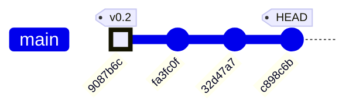

| Commit | Date | Summary | Subsystems touched |
|--------|------|---------|--------------------|
| `9087b6c` | May 7 | **64×64 mask → ESP32 → HUB75 panel + pot lerp** — Initial working pipeline: YOLO silhouette, serial framing, HUB75 DMA rendering, pot-controlled color | CV pipeline, serial protocol, ESP32 firmware |
| `fa3fc0f` | May 8 | Archive stale `agent_outputs/`, fix doc-hook auto-commit loop | Repo hygiene, CI |
| `32d47a7` | May 8 | Fix pot description — triggers white→red effect, not brightness | Docs |
| `c898c6b` | May 9 | **Waveshare pin-numbering fix** + finger-glove mode (MODE_FINGERTIPS), button debounce, MediaPipe integration, mode-aware protocol | ESP32 firmware, serial protocol, CV pipeline, hardware docs |

### Subsystem evolution across commits

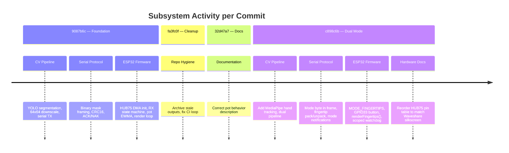

**Key architectural milestone at `c898c6b`:** The system evolves from a single-purpose silhouette display into a mode-switchable platform. The ESP32 is now the mode authority (physical button), and the Mac adapts its TX format based on upstream notifications. This inverts the original control flow where the Mac was the sole driver.

### System Architecture

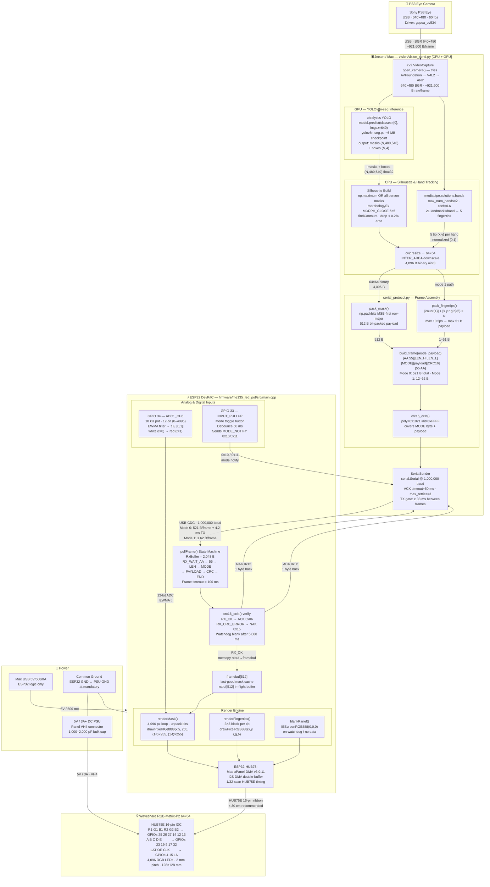

| Layer | Key Numbers |
|---|---|
| Camera raw frame | 640 × 480 × 3 B = **921,600 B** |
| YOLO inference size | 640 px letterboxed (GPU) |
| Silhouette at panel res | 64 × 64 = **4,096 B** (binary) |
| Bit-packed payload (Mode 0) | **512 B** (64 × 64 / 8) |
| Full framed packet (Mode 0) | **521 B** = 2+2+1+512+2+2 |
| Baud rate | **1,000,000 baud** USB-CDC |
| TX time per frame | ≈ **4.2 ms** → headroom for 30 fps |
| ESP32 RX buffer | **2,048 B** |
| Watchdog blank timeout | **5,000 ms** no-data |
| Panel power | **5 V / 3 A+** (separate PSU) |

### Data Flow

One frame's journey — camera shutter to glowing LED panel.

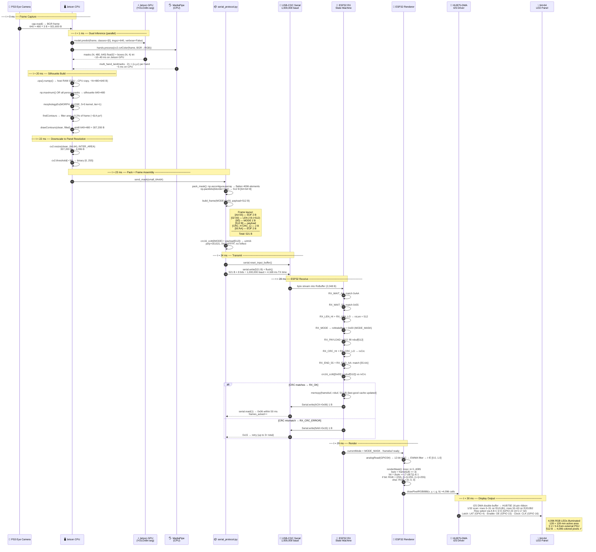

### Byte-count ledger per step

| Step | Data | Size |
|---|---|---|
| Raw camera frame | BGR uint8 640×480 | **921,600 B** |
| YOLO mask tensor (1 person) | float32 480×640 | **1,228,800 B** |
| Binary silhouette (640×480) | uint8 | **307,200 B** |
| Downscaled silhouette | uint8 64×64 | **4,096 B** |
| Bit-packed payload | Mode 0 | **512 B** |
| Full framed packet | SOF+LEN+MODE+payload+CRC+EOF | **521 B** |
| ACK/NAK reply | 1 byte | **1 B** |
| Mode-notify byte | ESP32 → host | **1 B** |
| framebuf cache | on ESP32 | **512 B** |
| Render calls | drawPixelRGB888 × 4,096 | **4,096 calls** |

### Timing budget at 30 fps (33.3 ms/frame)

| Phase | Estimated time |
|---|---|
| cap.read() | ~1 ms |
| YOLO GPU inference | ~10–40 ms |
| MediaPipe CPU | ~5 ms |
| Silhouette + resize | ~2 ms |
| pack + CRC + write | < 1 ms |
| Serial TX (521 B @ 1 Mbaud) | **4.2 ms** |
| ACK round-trip | ~1 ms |
| ESP32 render (4096 px) | ~2 ms |
| **Total (GPU path)** | **~26–56 ms** |

> ⚠️ YOLO is the dominant bottleneck. On Jetson with CUDA the GPU path runs ~15 ms/frame; on a Mac CPU it can exceed 40 ms, limiting effective TX rate below 25 fps.

### Module Dependency Graph

```mermaid
graph TD
  %% ── Entry Points ────────────────────────────────────────────────
  subgraph ENTRY["🚀 Entry Points"]
    VS["**vision_send.py**\n─────────────────\nmain() ← argparse\nautodetect_port()\nopen_camera()\nextract_fingertips()\ndraw_fingertips_camera()\ndraw_fingertips_grid()\nparse_args()"]

    VP["**vision.py**\n─────────────────\nmain() standalone\nopen_camera()\n❌ no serial sender\n[preview + save only]"]

    ORCH["**orchestrator.py**\n─────────────────\nrun_agent() async\nexecute_tool()\nwrite_file / read_file\n7× Claude agent swarm\nMODEL_ARCHITECT / CODER"]

    DA["**doc_agent.py**\n─────────────────\nHistorian agent\nArchitect agent  ← you are here\nCritic agent\ncollect_project_files()\nget_git_context()\ndb_connect() / db_save_*()"]
  end

  %% ── Core Protocol Library ───────────────────────────────────────
  subgraph PROTO["📦 serial_protocol.py — Public Interface"]
    SP_CLASS["**SerialSender** class\n─────────────────\n__init__(port, baudrate,\n  ack_timeout_s, max_retries)\nsend_mask(mask: ndarray) → bool\nsend_fingertips(tips: list) → bool\nread_mode_change() → int|None\nclose()\n─────────────────\nproperties: esp32_mode\ncounters: frames_sent/acked/naked"]

    SP_FN["**Free functions**\n─────────────────\nbuild_frame(mode, payload) → bytes\npack_mask(ndarray) → bytes [512 B]\nunpack_mask(bytes) → ndarray\npack_fingertips(list) → bytes\nunpack_fingertips(bytes) → list\ncrc16_ccitt(data, init) → int"]

    SP_TYPES["**Types / Constants**\n─────────────────\nFingertip(NamedTuple)\n  x, y, r, g, b: int\nPANEL_SIZE = 64\nPAYLOAD_BYTES = 512\nFRAME_START = AA 55\nFRAME_END   = 55 AA\nACK_BYTE = 0x06\nNAK_BYTE = 0x15\nMODE_MASK = 0x00\nMODE_FINGERTIPS = 0x01\nMODE_NOTIFY_0/1 = 0x10/0x11\nMAX_FINGERTIPS = 10"]
  end

  %% ── Doc / Sync system ───────────────────────────────────────────
  subgraph DOCS["📝 Documentation System"]
    GS["**gdrive_sync.py**\n─────────────────\ndetect_features()\nget_changed_files()\nsync_to_drive()\nappend_to_feature_doc()\ncompose_feature_section()\nfeature_to_filename()\nFEATURE_MAP dict\nRCLONE_REMOTE config"]

    GSU["**gdrive_setup.py**\n─────────────────\nmain()\n_create_remote()\nrclone OAuth browser flow\ntest sync to Drive"]
  end

  %% ── Firmware ────────────────────────────────────────────────────
  subgraph FW["⚡ firmware/me135_led_pot/"]
    MAIN_CPP["**main.cpp**\n─────────────────\nsetup() / loop()\npollFrame() RX state machine\nrenderMask()\nrenderFingertips()\nblankPanel()\ncrc16_ccitt() [C impl]\nFingertip struct\nRxState enum"]

    PINI["**platformio.ini**\n─────────────────\nplatform=espressif32@6.5.0\nboard=esp32dev\nframework=arduino\nmonitor_speed=115200"]
  end

  %% ── Python Package Dependencies ─────────────────────────────────
  subgraph PYLIBS["📦 Python Packages (vision/requirements.txt)"]
    YOLO_LIB["**ultralytics ≥ 8.0**\nYOLO class\nyolov8n-seg.pt ~6 MB\nauto-download on first run"]
    CV2_LIB["**opencv-python ≥ 4.8**\ncv2.VideoCapture\ncv2.resize / threshold\ncv2.findContours\ncv2.morphologyEx\ncv2.imshow / waitKey"]
    NP_LIB["**numpy ≥ 1.24**\nndarray · packbits\nmaximum · zeros\nascontiguousarray"]
    SER_LIB["**pyserial ≥ 3.5**\nserial.Serial\nSerial.write / read\nlist_ports.comports()"]
    MP_LIB["**mediapipe**\nmp.solutions.hands\nHands()\nprocess()"]
    ANT_LIB["**anthropic ≥ 0.40**\nAsyncAnthropic\nmessages.stream()\nclaude-opus/sonnet-4-6"]
  end

  %% ── C++ Library Dependencies ────────────────────────────────────
  subgraph CLIBS["📦 C++ / Arduino Libraries (platformio.ini lib_deps)"]
    HUB75_LIB["**ESP32-HUB75-MatrixPanel-DMA v3.0.11**\nMatrixPanel_I2S_DMA\ndrawPixelRGB888()\nfillScreenRGB888()\nI2S DMA HUB75E timing"]
    AGFX["**Adafruit GFX Library v1.11.9**"]
    ABUSIO["**Adafruit BusIO v1.16.1**"]
  end

  %% ── Import edges ────────────────────────────────────────────────

  %% vision_send.py imports
  VS -->|"from serial_protocol import\nFingertip · SerialSender\nMODE_MASK · MODE_FINGERTIPS"| SP_CLASS
  VS -->|"from serial_protocol import\nFingertip · MODE_* consts"| SP_TYPES
  VS -->|"import cv2"| CV2_LIB
  VS -->|"import numpy as np"| NP_LIB
  VS -->|"from ultralytics import YOLO"| YOLO_LIB
  VS -->|"import mediapipe as mp"| MP_LIB

  %% vision.py imports (standalone — NO serial_protocol)
  VP -->|"import cv2"| CV2_LIB
  VP -->|"import numpy as np"| NP_LIB
  VP -->|"from ultralytics import YOLO"| YOLO_LIB

  %% serial_protocol.py imports
  SP_CLASS -->|"import serial\nserial.tools.list_ports"| SER_LIB
  SP_CLASS -->|"import numpy"| NP_LIB
  SP_FN    -->|"import numpy"| NP_LIB
  SP_FN    -->|"import struct"| SP_TYPES

  %% doc_agent.py imports
  DA -->|"import anthropic"| ANT_LIB
  DA -->|"from gdrive_sync import\nsync_to_drive · detect_features\nget_changed_files"| GS

  %% orchestrator.py imports
  ORCH -->|"import anthropic"| ANT_LIB

  %% gdrive_sync → gdrive_setup relationship
  GS  -.->|"delegates rclone OAuth\n(user must run once)"| GSU

  %% firmware deps
  MAIN_CPP -->|"#include"| HUB75_LIB
  PINI     -->|"lib_deps"| HUB75_LIB
  PINI     -->|"lib_deps"| AGFX
  PINI     -->|"lib_deps"| ABUSIO
  HUB75_LIB -->|"depends"| AGFX
  HUB75_LIB -->|"depends"| ABUSIO

  %% ── Cross-system serial wire boundary ──────────────────────────
  SP_CLASS -.->|"⬇ USB-CDC 1 Mbaud\n521 B framed packet\nACK/NAK 1 B reply"| MAIN_CPP

  %% ── Styling ─────────────────────────────────────────────────────
  style SP_CLASS fill:#2d6a4f,color:#fff,stroke:#1b4332
  style SP_FN    fill:#2d6a4f,color:#fff,stroke:#1b4332
  style SP_TYPES fill:#2d6a4f,color:#fff,stroke:#1b4332
  style VS       fill:#1d3557,color:#fff,stroke:#457b9d
  style VP       fill:#1d3557,color:#fff,stroke:#457b9d
  style MAIN_CPP fill:#7b2d8b,color:#fff,stroke:#4a0e59
  style DA       fill:#6b3a1f,color:#fff,stroke:#3d1f0a
  style ORCH     fill:#6b3a1f,color:#fff,stroke:#3d1f0a
```

### Class / Interface Boundaries

| Boundary | Producer | Consumer | Contract |
|---|---|---|---|
| **Python → C firmware** | `SerialSender.send_mask()` | `pollFrame()` state machine | `[AA55][LEN][MODE][payload][CRC16][55AA]` · ACK=0x06 · NAK=0x15 |
| **ESP32 → Python** | `pollFrame()` button handler | `SerialSender.read_mode_change()` | Single byte `0x10` (mode 0) or `0x11` (mode 1) |
| **YOLO → Silhouette** | `model.predict()` GPU tensor | `np.maximum()` CPU loop | `result.masks.data` shape `(N, H, W)` float32 on GPU |
| **MediaPipe → Fingertips** | `hands.process()` CPU | `extract_fingertips()` | `hand_landmarks.landmark[i].{x,y,z}` normalized |
| **pack_mask → build_frame** | `pack_mask(ndarray)` | `build_frame(0x00, bytes)` | Exactly **512 B** or `ValueError` |
| **gdrive_sync → doc_agent** | `sync_to_drive()` | `da.main()` after agents | `list[tuple[str,str]]` sections + `list[dict]` proposals |

### Code Health Summary

**Overall Grade: B**

This is a well-structured, well-documented embedded + vision project with clear separation between the Python host pipeline, serial protocol, and ESP32 firmware. The serial framing protocol is solid — CRC-verified, ACK/NAK with retries, clean state machine on the ESP32 side. Documentation (`WIRING.md`) is exceptional for a course project.

**Strengths:** Clean serial protocol abstraction, defensive firmware (watchdog blanking, debounce, EWMA filtering), thorough hardware troubleshooting docs, proper async agent orchestration.

**Weaknesses:** A deploy-blocking missing dependency (`mediapipe`), stale README that documents wrong CRC scope, significant duplicated logic between `vision.py` and `vision_send.py`, and wasted compute running both ML models every frame regardless of active mode. No path traversal guard on the doc agent's file-read tool.

Two proposals are **must-fix** (PROP-001, PROP-003); the rest improve maintainability and performance with low risk.

### Improvement Proposals

**[PROP-001] Missing `mediapipe` in both requirements.txt files** — 🟢 low — must-fix

*Problem:* `vision/vision_send.py` imports `mediapipe` (`import mediapipe as mp`), but neither `vision/requirements.txt` nor the root `requirements.txt` lists it. Anyone following the setup instructions (`pip install -r requirements.txt`) will get an `ImportError: No module named 'mediapipe'` at runtime. This is a silent deployment-breaking bug.

*Fix:* Add `mediapipe>=0.10.0` to `vision/requirements.txt`. This is the only requirements file the vision pipeline should reference.

**[HW-001] Level shifter is 'optional but recommended' — should be mandatory for reliable HUB75E at full refresh** — 🟡 medium — nice-to-have

*Problem:* WIRING.md §7 marks the 74HCT245 level shifter as optional. The Waveshare RGB-Matrix-P2 uses a HUB75E controller that specifies 5V logic levels on its inputs. At 3.3V (ESP32 output), the logic-high threshold (≥3.5V for TTL) is not met. This is reliable at low refresh rates but causes ghost pixels, first-row brightness anomalies, and corrupted output above ~80–100 Hz — exactly the symptoms described in the troubleshooting table.

*Fix:* Reclassify the level shifter as required for production use. Update §7 to state: 'Insert one 74AHCT245 (R1,G1,B1,R2,G2,B2,CLK,LAT) + one 74AHCT125 quad buffer (A,B,C,D,E,OE) between ESP32 and HUB75 IN. VCC=5V from panel PSU. This is mandatory for reliable operation above 60 Hz.' Update the bring-up checklist (§9) accordingly.

---
