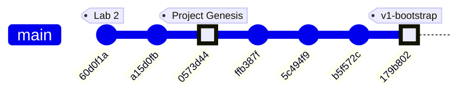
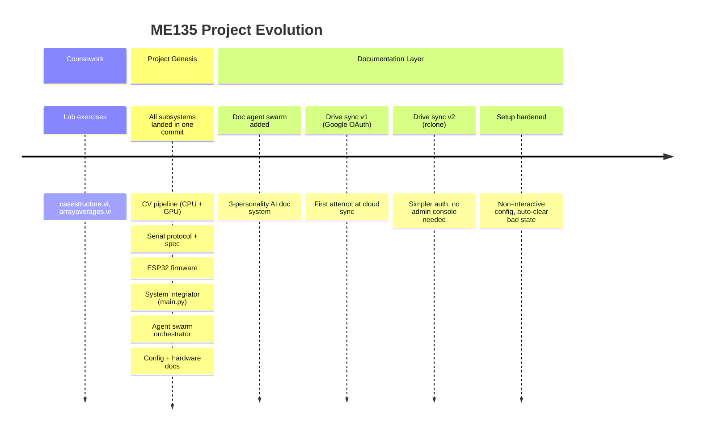

# ME135 Evolution Report

**Date:** 2026-03-13 23:46 &nbsp;|&nbsp; **Commit:** `179b802`

---

## What Changed

**This is the v1 bootstrap run — documenting the full initial architecture across 7 commits.**

---

### 🎥 Computer Vision Pipeline (`cv_pipeline.py`, `gpu_accelerated.py`)

- **CPU pipeline** captures PS3 Eye frames (640×480 @ 60fps), applies MOG2/KNN/static-median background subtraction, morphological cleanup, small-blob rejection, then outputs a **400×300 binary matrix** (0 = background, 1 = human). Three calibration methods give flexibility depending on scene lighting.
- **GPU pipeline** mirrors the exact same API but runs all processing on CUDA via `cv2.cuda_GpuMat`. Uses JetPack 6/OpenCV 4.8 return-value style calls. Falls back to CPU transparently if CUDA is unavailable. Performance: ~2ms/frame (GPU) vs ~8ms/frame (CPU) on Jetson Orin Nano Super.
- **Why it matters:** The dual-pipeline design means the system runs on any hardware — a laptop for development, a Jetson for deployment — with a single config toggle (`use_gpu: true`).

### 📡 Serial Communication Protocol (`serial_protocol.py`, `PROTOCOL_SPEC.md`)

- **Wire format:** `[0xAA 0x55][LEN_H LEN_L][PAYLOAD…][CRC_H CRC_L][0x55 0xAA]` — 15,008 bytes/frame at 2 Mbaud UART. CRC-16/CCITT-FALSE error detection with ACK(0x06)/NAK(0x15) flow control.
- **Downsampling:** The Python sender downsamples from 400×300 (CV resolution) to 108×108 (physical LED panel), then bit-packs MSB-first into 1,458 bytes before framing. This keeps CV accuracy high while matching hardware.
- **Retry logic:** Up to 3 retransmits on NAK/timeout; 10 consecutive failures trigger a safety shutdown.
- **Why it matters:** This is the critical real-time bridge between the Jetson brain and ESP32 muscles. The spec is pinned in a standalone Markdown doc so hardware and firmware teams stay in sync.

### 🔌 ESP32 Firmware (`esp32_main.cpp`, `platformio.ini`)

- Receives framed packets on HardwareSerial1 (GPIO 16/17), validates CRC, sends ACK/NAK, and pushes bit-unpacked data to an 11,664-LED WS2812B NeoPixel strip (108×108 panel).
- **Watchdog:** If no valid frame arrives within 5 seconds, the display blanks — a course-mandated safety feature.
- **Why it matters:** This is the embedded endpoint. CRC + watchdog together mean the display never shows corrupted or stale data.

### 🧩 System Integration (`main.py`, `config.yaml`)

- `main.py` orchestrates the full loop: config load → GPU/CPU pipeline selection → calibration (with 10-second countdown for the human to leave the frame) → live capture → serial transmit → OpenCV preview window. Graceful SIGINT/SIGTERM shutdown.
- `config.yaml` is the **single source of truth** for every tuneable parameter: camera device, calibration method, processing thresholds, serial port, LED panel size, LabVIEW hub (disabled), safety watchdogs.
- **Why it matters:** One file controls every parameter across Python and C++. No magic numbers buried in source.

### 🤖 Agent Swarm — Code Generation (`orchestrator.py`)

- Spawns 7 parallel Claude agents (using Opus for architects, Sonnet for coders) in an async tool-use loop. Each agent reads existing files and writes new ones into `agent_outputs/`. Agents include: Hardware Scout, CV Engineer, GPU Accelerator, Serial/Protocol Specialist, ESP32 Firmware Engineer, Integration Lead, and Docs Lead.
- **Why it matters:** This is how the project's initial codebase was generated — a one-shot swarm that produced every file in `agent_outputs/`.

### 📝 Documentation System (`doc_agent.py`, `gdrive_sync.py`, `gdrive_setup.py`)

- **Doc Agent** runs 3 personalities in parallel on every git push: Historian (narrates changes), Architect (draws Mermaid diagrams), Critic (finds bugs and proposals). Uses tool calls (`read_source`, `write_section`, `write_proposals`) and assembles results into timestamped Markdown reports.
- **Feature mapping** (`gdrive_sync.py`): A `FEATURE_MAP` dict routes each source file to a named feature (e.g., `cv_pipeline.py` → "Computer Vision Pipeline"). Versioned sections are appended to per-feature Markdown files in `docs/features/`.
- **`--bootstrap` mode** (added in HEAD): Forces all features to be documented from scratch by treating every mapped file as "changed." Prepends a v1 context note to the git context so agents know there's no prior version.
- **Google Drive sync** via rclone: After each doc run, `rclone sync` pushes feature docs to a shared "ME135 Feature Reports" Drive folder.
- **`gdrive_setup.py` rewrite** (HEAD commit): Replaced a 13-step interactive wizard with a fully non-interactive `rclone config create` + `rclone config reconnect` flow. Auto-deletes any existing remote to clear stale/bad `client_id` values. Reduced from 79 lines of instructions to a clean programmatic sequence.
- **Why it matters:** The documentation system is self-sustaining — every push auto-generates evolution docs and syncs them to Drive for the course deliverables. The setup rewrite means teammates can configure Drive sync without following a 13-step manual.

### 📦 Dependencies & Hardware (`requirements.txt`, `hardware_recommendation.md`, `SETUP.md`)

- Python deps: `anthropic`, `opencv-python-headless`, `numpy`, `pyserial`, `pyyaml`, `tqdm`. Optional CUDA via JetPack system OpenCV.
- Recommended hardware: Jetson Orin Nano Super ($249, 1024 CUDA cores, 8GB LPDDR5) as primary; ESP32-DevKitC as display controller.

---

## Evolution Timeline

### Commit-by-Commit Subsystem Map

| Commit | Message | Subsystems Touched |
|--------|---------|-------------------|
| `60d0f1a` | added casestructure.vi for lab2 | LabVIEW (coursework, pre-project) |
| `a15d0fb` | added arrayaverages.vi, not finished | LabVIEW (coursework, pre-project) |
| `0573d44` | Add Kyle's camera processing project files | **CV Pipeline**, **Serial Protocol**, **ESP32 Firmware**, **System Integration**, **Agent Swarm**, **Config** — the "big bang" commit with all generated code |
| `ffb387f` | feat(docs): add documentation agent swarm | **Documentation System** — `doc_agent.py`, `gdrive_sync.py`, tool-use agents |
| `5c494f9` | feat(docs): add Google Drive feature report sync | **Documentation System** — Drive sync via Google API OAuth (first attempt) |
| `b5f572c` | fix(docs): replace Google API OAuth with rclone | **Documentation System** — abandoned Google Cloud Console OAuth in favor of rclone's bundled OAuth app |
| `179b802` | fix(setup): non-interactive rclone config, auto-clear bad client_id | **Documentation System** — `gdrive_setup.py` rewrite (non-interactive), `doc_agent.py` `--bootstrap` flag |

### Project Arc

**Key observation:** The project has a distinctive "big bang + refinement" shape. Commit `0573d44` delivered the entire technical stack in one shot (via the agent swarm orchestrator). The four subsequent commits are all about building and hardening the *documentation infrastructure* around that core — a self-documenting system that evolves the docs on every push.

---

## Code Health Summary

**Overall Grade: B−**

The codebase shows strong architectural intent — clean separation between CPU/GPU pipelines, a well-defined serial protocol with CRC and ACK/NAK, proper signal handling, and a centralized config.yaml. The code is readable and well-commented throughout.

However, several **reliability-critical bugs** undermine the solid design:

1. **ESP32 RX buffer silently defaults to 256 bytes** due to a call-order bug, virtually guaranteeing frame loss at 2 Mbaud — this is a showstopper.
2. **Path traversal** in tool handlers gives LLM agents unsandboxed filesystem access.
3. **Protocol documentation is stale** — specs claim 15,000-byte payloads while code sends 1,458 bytes.
4. **`cv2.imshow` on headless Jetson** crashes the main loop.

Secondary issues include unused timeout parameters, missing serial flush, and camera resource leaks on constructor failure. The Python code quality is consistently good; the gaps are at integration boundaries — firmware init ordering, doc-code sync, and headless deployment.

---

## Improvement Proposals

| # | Title | Priority | Risk | Files |
|---|-------|----------|------|-------|
| ESP32-RXBUF-ORDER | ESP32 setRxBufferSize called AFTER begin() — no effect | must-fix | high | `agent_outputs/esp32_main.cpp` |
| PATH-TRAVERSAL-TOOLS | Path traversal in write_file / read_file tool handlers | must-fix | high | `orchestrator.py, doc_agent.py` |
| SPEC-PAYLOAD-MISMATCH | PROTOCOL_SPEC.md documents 15,000-byte payload but code sends 1,458 bytes | must-fix | medium | `agent_outputs/PROTOCOL_SPEC.md, agent_outputs/PROJECT_README.md` |
| HEADLESS-IMSHOW-CRASH | main.py calls cv2.imshow unconditionally — crashes on headless Jetson | must-fix | medium | `agent_outputs/main.py` |
| SERIAL-ACK-TIMEOUT-UNUSED | SerialSender stores ack_timeout_s but never uses it | nice-to-have | medium | `agent_outputs/serial_protocol.py` |
| CAMERA-RESOURCE-LEAK | VideoCapture not released if CVPipeline/GPUPipeline constructor fails partway | nice-to-have | medium | `agent_outputs/cv_pipeline.py, agent_outputs/gpu_accelerated.py` |
| SERIAL-NO-FLUSH | serial_protocol.py: no flush() after write, ACK may be read before data is sent | nice-to-have | low | `agent_outputs/serial_protocol.py` |
| GDRIVE-WHICH-NONPORTABLE | gdrive_setup.py and gdrive_sync.py use shell `which` command — fails on Windows | future | low | `gdrive_setup.py, gdrive_sync.py` |
| PROP-001 | Protocol spec and code disagree on payload size | must-fix | medium | `agent_outputs/PROTOCOL_SPEC.md, agent_outputs/serial_protocol.py` |
| PROP-002 | gdrive_setup.py always deletes and recreates the remote | nice-to-have | low | `gdrive_setup.py` |
| PROP-003 | ESP32 watchdog only blanks display — no LabVIEW heartbeat or recovery | nice-to-have | low | `agent_outputs/esp32_main.cpp, agent_outputs/PROTOCOL_SPEC.md` |
| PROP-004 | config.yaml fps_target (3) contradicts protocol spec target (10+) | nice-to-have | low | `agent_outputs/config.yaml, agent_outputs/PROTOCOL_SPEC.md` |
| PROP-005 | GPU pipeline KNN silently falls back to MOG2 without warning | nice-to-have | low | `agent_outputs/gpu_accelerated.py` |
| PROP-006 | No unit tests for CRC or bit-packing — critical protocol code | must-fix | medium | `agent_outputs/serial_protocol.py, agent_outputs/esp32_main.cpp` |

### ESP32-RXBUF-ORDER: ESP32 setRxBufferSize called AFTER begin() — no effect
**Priority:** must-fix &nbsp;|&nbsp; **Risk:** high

**Problem:** In esp32_main.cpp `setup()`, `JetsonSerial.setRxBufferSize(4096)` is called AFTER `JetsonSerial.begin()`. On the ESP32 Arduino core, `setRxBufferSize()` must be called BEFORE `begin()` to allocate the buffer. With the default 256-byte RX buffer and 1,458-byte payloads at 2 Mbaud, incoming data will overflow the UART FIFO during `receiveFrame()`, causing chronic sync errors and frame loss.

**Proposed fix:** Move `JetsonSerial.setRxBufferSize(4096);` to the line immediately BEFORE `JetsonSerial.begin(SERIAL_BAUD, SERIAL_8N1, UART_RX_PIN, UART_TX_PIN);` in `setup()`.

**Affected files:** agent_outputs/esp32_main.cpp

---

### PATH-TRAVERSAL-TOOLS: Path traversal in write_file / read_file tool handlers
**Priority:** must-fix &nbsp;|&nbsp; **Risk:** high

**Problem:** In orchestrator.py `execute_tool()`, the filename from LLM tool input is joined directly to OUTPUT_DIR without sanitization: `path = OUTPUT_DIR / tool_input['filename']`. A malicious or hallucinated filename like `../../etc/cron.d/evil` or `../orchestrator.py` would read/write outside the sandbox. The same pattern exists in doc_agent.py's tool dispatch for `read_source`.

**Proposed fix:** Resolve the path and verify it stays inside the target directory: `path = (OUTPUT_DIR / tool_input['filename']).resolve(); if not str(path).startswith(str(OUTPUT_DIR.resolve())): return 'Error: path escapes sandbox'`. Apply the same guard in doc_agent.py's read_source handler.

**Affected files:** orchestrator.py, doc_agent.py

---

### SPEC-PAYLOAD-MISMATCH: PROTOCOL_SPEC.md documents 15,000-byte payload but code sends 1,458 bytes
**Priority:** must-fix &nbsp;|&nbsp; **Risk:** medium

**Problem:** PROTOCOL_SPEC.md §3-4 and PROJECT_README.md both state the payload is 15,000 bytes (400×300 / 8) with a total frame size of 15,008 bytes. However, serial_protocol.py `pack_matrix()` downsamples to 108×108 before packing, producing 1,458 bytes. The ESP32 firmware also expects exactly 1,458 bytes (`#define PAYLOAD_BYTES 1458`). This documentation-code mismatch will confuse anyone implementing a new receiver or debugging the protocol.

**Proposed fix:** Update PROTOCOL_SPEC.md §3 and §4 to reflect the actual 108×108 panel resolution: payload = 1,458 bytes, total frame = 1,466 bytes. Update PROJECT_README.md's wire-protocol diagram accordingly. Add a note that CV runs at 400×300 but is downsampled before transmission.

**Affected files:** agent_outputs/PROTOCOL_SPEC.md, agent_outputs/PROJECT_README.md

---

### HEADLESS-IMSHOW-CRASH: main.py calls cv2.imshow unconditionally — crashes on headless Jetson
**Priority:** must-fix &nbsp;|&nbsp; **Risk:** medium

**Problem:** In main.py's live loop, the code path when `args.show_preview` is False still calls `cv2.imshow('ME135 — B&W Mask (white=human)', mask_bgr)` and `cv2.waitKey(1)`. On a headless Jetson (SSH, no X display), this throws `cv2.error: ... cannot open display`. The entire processing loop crashes.

**Proposed fix:** Wrap the entire preview block (both the `if args.show_preview` branch AND the `else` branch that shows just the mask) inside `if args.show_preview:`. When the flag is off, skip all `cv2.imshow` and `cv2.waitKey` calls entirely.

**Affected files:** agent_outputs/main.py

---

### SERIAL-ACK-TIMEOUT-UNUSED: SerialSender stores ack_timeout_s but never uses it
**Priority:** nice-to-have &nbsp;|&nbsp; **Risk:** medium

**Problem:** In serial_protocol.py, `self._ack_timeout = ser_cfg['ack_timeout_s']` (0.05s from config.yaml) is saved but never referenced. The `_wait_ack()` method calls `self._ser.read(1)` which uses the Serial port's `timeout` parameter (set to `timeout_s` = 0.1s from config). The configured 50ms ACK timeout is silently ignored — actual timeout is 100ms, halving theoretical throughput.

**Proposed fix:** Before the `self._ser.read(1)` call in `_wait_ack()`, set `self._ser.timeout = self._ack_timeout`. Alternatively, pass `ack_timeout_s` as the Serial `timeout` at construction. Document which timeout controls what.

**Affected files:** agent_outputs/serial_protocol.py

---

### CAMERA-RESOURCE-LEAK: VideoCapture not released if CVPipeline/GPUPipeline constructor fails partway
**Priority:** nice-to-have &nbsp;|&nbsp; **Risk:** medium

**Problem:** Both CVPipeline.__init__ and GPUPipeline.__init__ open `cv2.VideoCapture()` early, then continue with setup code that can raise (e.g. `ValueError` for unknown calibration method, `RuntimeError` for missing CUDA). If an exception occurs after the capture is opened, `release()` is never called and the camera device file remains locked. Subsequent attempts to create a pipeline will fail.

**Proposed fix:** Wrap the constructor body in a try/except that calls `self.cap.release()` on failure, or implement `__enter__`/`__exit__` context manager protocol. At minimum, add a `__del__` method that calls `self.release()`.

**Affected files:** agent_outputs/cv_pipeline.py, agent_outputs/gpu_accelerated.py

---

### SERIAL-NO-FLUSH: serial_protocol.py: no flush() after write, ACK may be read before data is sent
**Priority:** nice-to-have &nbsp;|&nbsp; **Risk:** low

**Problem:** In `SerialSender.send_frame()`, after `self._ser.write(packet)`, there is no `self._ser.flush()` call. On some OS/driver combinations, `write()` returns immediately while data is still in the kernel buffer. The subsequent `_wait_ack()` may time out because the ESP32 hasn't received the full packet yet. At 2 Mbaud with a 1,466-byte packet this is ~7ms of wire time — well within the 50-100ms timeout but fragile under load.

**Proposed fix:** Add `self._ser.flush()` after `self._ser.write(packet)` in `send_frame()` to ensure all bytes are transmitted before waiting for ACK.

**Affected files:** agent_outputs/serial_protocol.py

---

### GDRIVE-WHICH-NONPORTABLE: gdrive_setup.py and gdrive_sync.py use shell `which` command — fails on Windows
**Priority:** future &nbsp;|&nbsp; **Risk:** low

**Problem:** Both gdrive_setup.py and gdrive_sync.py detect rclone via `subprocess.run(['which', 'rclone'], ...)`. The `which` command does not exist on Windows. While the primary target is Jetson (Linux), the documentation agents and Drive sync may run on developer laptops.

**Proposed fix:** Replace `subprocess.run(['which', 'rclone'], ...)` with `shutil.which('rclone') is not None` (stdlib, cross-platform).

**Affected files:** gdrive_setup.py, gdrive_sync.py

---

### PROP-001: Protocol spec and code disagree on payload size
**Priority:** must-fix &nbsp;|&nbsp; **Risk:** medium

**Problem:** PROTOCOL_SPEC.md documents a 400×300 full-resolution payload (15,000 bytes / 15,008 total), but serial_protocol.py actually downsamples to 108×108 and transmits only 1,458 bytes. The ESP32 firmware also expects 1,458 bytes (PAYLOAD_BYTES = 1458). The spec is stale and will mislead anyone reading it without also reading the code.

**Proposed fix:** Update PROTOCOL_SPEC.md §3 and §4 to document the actual 108×108 / 1,458-byte payload. Add a note that CV runs at 400×300 internally but the matrix is downsampled before transmission. Update the timing budget in §7 accordingly (~7.3ms/frame at 2Mbaud, enabling ~100+ fps theoretical throughput).

**Affected files:** agent_outputs/PROTOCOL_SPEC.md, agent_outputs/serial_protocol.py

---

### PROP-002: gdrive_setup.py always deletes and recreates the remote
**Priority:** nice-to-have &nbsp;|&nbsp; **Risk:** low

**Problem:** The setup script unconditionally deletes any existing 'me135drive' remote and recreates it, forcing a full re-auth every time it runs. The comment says 'may have bad client_id' but this is a sledgehammer approach — a working config gets destroyed on re-run.

**Proposed fix:** Add a verification step first: try `rclone lsd me135drive:` and if it succeeds, skip deletion. Only delete-and-recreate if the connection test fails. This makes the script idempotent without forcing re-auth.

**Affected files:** gdrive_setup.py

---

### PROP-003: ESP32 watchdog only blanks display — no LabVIEW heartbeat or recovery
**Priority:** nice-to-have &nbsp;|&nbsp; **Risk:** low

**Problem:** When the watchdog fires (no frame in 5s), the ESP32 blanks the LEDs and resets the timer, but does nothing to signal the upstream system or attempt recovery. The LabVIEW heartbeat (0x07) is listed as 'future' in the spec but the course requires a V&V matrix and safety documentation.

**Proposed fix:** Implement a heartbeat byte (0x07) sent on the debug Serial when the watchdog fires. Add a counter for consecutive watchdog events; after N (e.g., 5), enter a visually distinct error pattern on the LED panel (flashing red border) rather than just blanking.

**Affected files:** agent_outputs/esp32_main.cpp, agent_outputs/PROTOCOL_SPEC.md

---

### PROP-004: config.yaml fps_target (3) contradicts protocol spec target (10+)
**Priority:** nice-to-have &nbsp;|&nbsp; **Risk:** low

**Problem:** config.yaml sets `display.fps_target: 3` with a comment about WS2812B timing limits (350ms/frame). But the protocol spec §7 targets ≥10 fps and the serial timing budget allows ~8 fps. The actual bottleneck is the NeoPixel strip.show() call, which is correctly identified in the config comment but contradicted everywhere else.

**Proposed fix:** Reconcile the numbers: update PROTOCOL_SPEC.md §7 to acknowledge the WS2812B bottleneck (~2.8 fps for 11,664 LEDs at 30μs/LED). Consider documenting a future optimization path (e.g., parallel data lines via level shifter, or reducing active pixel count).

**Affected files:** agent_outputs/config.yaml, agent_outputs/PROTOCOL_SPEC.md

---

### PROP-005: GPU pipeline KNN silently falls back to MOG2 without warning
**Priority:** nice-to-have &nbsp;|&nbsp; **Risk:** low

**Problem:** In gpu_accelerated.py, if the config specifies method 'knn', the GPU pipeline silently creates a CUDA MOG2 subtractor instead (because CUDA only has MOG2). There's a code comment but no log warning to the user, who might expect KNN behavior.

**Proposed fix:** Add `logger.warning('CUDA does not support KNN — falling back to MOG2')` when method == 'knn' in GPUPipeline.__init__. This prevents silent behavior drift between CPU and GPU pipelines.

**Affected files:** agent_outputs/gpu_accelerated.py

---

### PROP-006: No unit tests for CRC or bit-packing — critical protocol code
**Priority:** must-fix &nbsp;|&nbsp; **Risk:** medium

**Problem:** The CRC-16 implementation exists in both Python (serial_protocol.py) and C++ (esp32_main.cpp) and must produce identical results. There are no tests verifying cross-language parity. A single-bit disagreement would cause every frame to NAK.

**Proposed fix:** Add a test file (e.g., tests/test_protocol.py) with known CRC test vectors and round-trip pack/unpack tests. Include the CRC-16/CCITT-FALSE test vector from the standard (input '123456789' → 0x29B1) as a smoke test.

**Affected files:** agent_outputs/serial_protocol.py, agent_outputs/esp32_main.cpp

---
