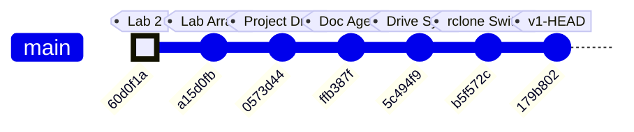

# ME135 Evolution Report

**Date:** 2026-03-13 23:49 &nbsp;|&nbsp; **Commit:** `179b802`

---

## What Changed

This is the **v1 bootstrap pass** — first documentation of the entire codebase. Below is the initial architecture, followed by the most recent changes visible in the HEAD diff.

---

### Initial Architecture (v1 Snapshot)

**The system is a real-time human detection pipeline for UC Berkeley's ME135 course.** A PS3 Eye camera feeds frames into a CV pipeline running on an NVIDIA Jetson, which produces a 400×300 binary matrix (0 = background, 1 = human). That matrix is bit-packed and sent over 2 Mbaud UART to an ESP32, which drives an 108×108 WS2812B LED panel.

#### CV Pipeline (`cv_pipeline.py`, `gpu_accelerated.py`)
- **CPU path:** OpenCV MOG2/KNN/static-median background subtraction → threshold → morphological cleanup → contour filtering → 400×300 binary output.
- **GPU path:** Drop-in CUDA-accelerated replacement using `cv2.cuda` GpuMat operations. Falls back to CPU automatically when CUDA is unavailable. Claims ~2 ms/frame vs ~8 ms/frame on Jetson Orin Nano Super.
- Both paths share identical public APIs (`calibrate()`, `process_frame()`, `release()`), selected at runtime via `config.yaml`.

#### Serial Protocol (`serial_protocol.py`, `PROTOCOL_SPEC.md`)
- Downsamples 400×300 CV matrix to 108×108 (matching the LED panel), then bit-packs into 1,458 bytes.
- Framing: `[0xAA 0x55][LEN][PAYLOAD][CRC-16][0x55 0xAA]` with ACK/NAK flow control.
- CRC-16/CCITT-FALSE computed over payload only. Up to 3 retransmits on NAK or timeout.

#### ESP32 Firmware (`esp32_main.cpp`, `platformio.ini`)
- Blocking frame receiver with sync-byte state machine and 5-second watchdog.
- Verifies CRC, sends ACK/NAK, then maps bit-packed payload to 11,664 NeoPixels.
- Safety: blanks the display if no frame received within the watchdog window.

#### System Integration (`main.py`, `config.yaml`)
- Single YAML config is the source of truth for all tunable parameters (camera, calibration, processing, serial, display, safety).
- `main.py` orchestrates: config load → pipeline init → interactive calibration (with 10-second countdown) → live loop with FPS limiting, watchdog, and graceful shutdown on SIGINT/SIGTERM.
- Safety: shuts down after 10 consecutive serial errors; logs watchdog warnings.

#### Agent Swarm — Code Generator (`orchestrator.py`)
- Spawns 7 specialized Claude agents (hardware scout, CV engineer, serial architect, ESP32 firmware dev, integration lead, doc writer, LabVIEW advisor) in parallel async loops.
- Each agent gets tools (`write_file`, `read_file`) and runs up to 12 agentic turns.
- This is how the entire `agent_outputs/` codebase was generated.

#### Documentation System (`doc_agent.py`, `gdrive_sync.py`, `gdrive_setup.py`)
- **3-agent doc swarm:** Historian (narrates changes), Architect (draws diagrams), Critic (finds bugs). Runs on every `git push` via pre-push hook.
- **Feature-based doc structure:** `FEATURE_MAP` maps source files → feature names. Each feature gets its own evolving Markdown file with versioned sections.
- **Google Drive sync:** `rclone` syncs `docs/features/` to a shared Drive folder. No Google Cloud Console access needed — uses rclone's bundled OAuth app.
- **SQLite history DB:** Tracks proposals and reports across commits in `docs/history.db`.

---

### Recent Changes (HEAD diff: `179b802`)

#### Documentation System — Bootstrap Mode
- **`doc_agent.py`:** Added `--bootstrap` CLI flag. When set, treats *every* file in `FEATURE_MAP` as changed so all features get v1 documentation in a single run. Without this, the agent only documents files touched in the latest commit. Also: feature names are now sorted in console output for readability; mode label ("Bootstrap v1" vs "Incremental") printed for operator awareness.
- **`gdrive_sync.py`:** `sync_to_drive()` gained an `override_features` parameter. Bootstrap mode passes the full feature list directly, bypassing `git diff` detection. This ensures the Drive folder gets a complete set of feature docs on first run.

#### Documentation System — rclone Setup Hardening
- **`gdrive_setup.py` (major refactor, net −18 lines):** Eliminated the old 13-step interactive `rclone config` wizard. Now uses `rclone config create` non-interactively (with blank `client_id`/`client_secret` to use rclone's bundled OAuth app), then triggers `rclone config reconnect` for the browser-based sign-in. **Key fix:** always deletes any existing remote before recreating — this auto-clears stale or bad `client_id` configurations that caused auth failures. Better error messages and troubleshooting hints on failure.

---

## Evolution Timeline

### Commit-to-Subsystem Map

| Commit | Message | Subsystems Touched |
|--------|---------|-------------------|
| `60d0f1a` | added casestructure.vi for lab2 | LabVIEW coursework (pre-project) |
| `a15d0fb` | added arrayaverages.vi (unfinished) | LabVIEW coursework (pre-project) |
| `0573d44` | Add Kyle's camera processing project files | **CV Pipeline**, **Serial Protocol**, **ESP32 Firmware**, **System Integration**, **Agent Swarm**, **Hardware & Platform** — initial code drop of all agent-generated outputs |
| `ffb387f` | feat(docs): add documentation agent swarm | **Documentation System** — `doc_agent.py` with 3-agent Historian/Architect/Critic swarm, SQLite proposal tracking |
| `5c494f9` | feat(docs): add Google Drive feature report sync | **Documentation System** — `gdrive_sync.py` (feature-based doc writer + rclone sync), `gdrive_setup.py` (initial interactive setup) |
| `b5f572c` | fix(docs): replace Google API OAuth with rclone | **Documentation System** — dropped Google Cloud Console OAuth dependency, switched to rclone's bundled OAuth app |
| `179b802` | fix(setup): non-interactive rclone config, auto-clear bad client_id | **Documentation System** — `gdrive_setup.py` refactored to non-interactive flow; `doc_agent.py` gained `--bootstrap` mode; `gdrive_sync.py` gained `override_features` |

### Project Trajectory

The repo tells a clear two-phase story:

1. **Phase 1 — Coursework** (`60d0f1a` → `a15d0fb`): Early LabVIEW exercises for ME135 labs. No project code yet.
2. **Phase 2 — Project Build** (`0573d44` → `179b802`): A single large code drop delivered the full detection pipeline (generated by the 7-agent orchestrator), immediately followed by three rapid iterations building and hardening the documentation-and-sync infrastructure. The team is investing heavily in automated documentation before the project enters its integration and testing phase.

---

## Code Health Summary

**Overall Grade: B−**

The codebase is well-structured with clear module boundaries (CV pipeline → serial protocol → ESP32 firmware), consistent logging, and a solid protocol design with CRC-16 and ACK/NAK flow control. Documentation is thorough. The CPU/GPU pipeline polymorphism is cleanly implemented.

**Critical issues** drag the grade down: (1) The ESP32 firmware calls `setRxBufferSize()` after `begin()`, meaning it's silently ignored — the 256-byte default buffer will overflow at 2 Mbaud, making serial communication non-functional. (2) Both `orchestrator.py` and `doc_agent.py` have path traversal vulnerabilities in their tool handlers — LLM agents can read/write arbitrary files. (3) `main.py` unconditionally opens a GUI window, crashing on headless Jetson deployments.

**Moderate concerns**: no config validation, no context-manager cleanup for camera handles, no frame-dropping on the ESP32 display bottleneck. Reliability under real-world faults needs hardening before demo day.

---

## Improvement Proposals

| # | Title | Priority | Risk | Files |
|---|-------|----------|------|-------|
| ESP32-RX-BUF-ORDER | ESP32 setRxBufferSize called AFTER begin() — silently ignored | must-fix | high | `agent_outputs/esp32_main.cpp` |
| ORCH-PATH-TRAVERSAL | Path traversal in orchestrator.py write_file / read_file tools | must-fix | high | `orchestrator.py` |
| MAIN-ALWAYS-IMSHOW | main.py unconditionally calls cv2.imshow — crashes on headless Jetson | must-fix | high | `agent_outputs/main.py` |
| DOCAGENT-PATH-TRAVERSAL | Path traversal in doc_agent.py read_source tool handler | must-fix | medium | `doc_agent.py` |
| CV-NO-CONTEXT-MANAGER | Camera resource leak — no cleanup on exception in CVPipeline / GPUPipeline | nice-to-have | medium | `agent_outputs/cv_pipeline.py, agent_outputs/gpu_accelerated.py, agent_outputs/main.py` |
| CONFIG-NO-VALIDATION | No config validation — invalid values cause cryptic OpenCV errors | nice-to-have | medium | `agent_outputs/main.py, agent_outputs/config.yaml` |
| ESP32-FRAME-DROP | ESP32 has no frame-dropping strategy — stale frames accumulate in UART buffer | nice-to-have | medium | `agent_outputs/esp32_main.cpp` |
| GDRIVE-WHICH-PORTABILITY | rclone detection uses `which` — fails on Windows | nice-to-have | low | `gdrive_setup.py, gdrive_sync.py` |
| PROP-001 | PROTOCOL_SPEC.md describes 400×300 (15,000 bytes) but code transmits 108×108 (1,458 bytes) | must-fix | medium | `agent_outputs/PROTOCOL_SPEC.md, agent_outputs/serial_protocol.py` |
| PROP-002 | gdrive_setup.py always deletes and recreates remote — even when config is valid | nice-to-have | low | `gdrive_setup.py` |
| PROP-003 | No unit tests for CRC-16 or bit-packing — protocol correctness is unverified | must-fix | high | `agent_outputs/serial_protocol.py, agent_outputs/esp32_main.cpp` |
| PROP-004 | GPU pipeline silently falls back to CUDA MOG2 when config requests KNN | nice-to-have | low | `agent_outputs/gpu_accelerated.py` |
| PROP-005 | main.py always opens an OpenCV display window even without --show-preview | must-fix | medium | `agent_outputs/main.py` |
| PROP-006 | Display FPS target of 3 in config vs protocol spec claiming ≥10 fps | nice-to-have | low | `agent_outputs/config.yaml, agent_outputs/PROTOCOL_SPEC.md` |

### ESP32-RX-BUF-ORDER: ESP32 setRxBufferSize called AFTER begin() — silently ignored
**Priority:** must-fix &nbsp;|&nbsp; **Risk:** high

**Problem:** In `esp32_main.cpp` setup(), `JetsonSerial.setRxBufferSize(4096)` is called AFTER `JetsonSerial.begin(...)`. On ESP32-Arduino, `setRxBufferSize()` must be called BEFORE `begin()` — otherwise the call is silently ignored and the default 256-byte RX buffer is used. At 2 Mbaud with 1,466-byte frames, the 256-byte buffer will overflow constantly, causing corrupted frames and continuous NAKs.

**Proposed fix:** Move `JetsonSerial.setRxBufferSize(4096);` to the line BEFORE `JetsonSerial.begin(SERIAL_BAUD, SERIAL_8N1, UART_RX_PIN, UART_TX_PIN);` in `setup()`.

**Affected files:** agent_outputs/esp32_main.cpp

---

### ORCH-PATH-TRAVERSAL: Path traversal in orchestrator.py write_file / read_file tools
**Priority:** must-fix &nbsp;|&nbsp; **Risk:** high

**Problem:** In `orchestrator.py` `execute_tool()`, the `write_file` tool does `OUTPUT_DIR / tool_input['filename']` with no path validation. An LLM agent could supply a filename like `../orchestrator.py` or `../../.env` to read or overwrite arbitrary files outside `agent_outputs/`. The `read_file` tool has the identical vulnerability.

**Proposed fix:** After computing `path = OUTPUT_DIR / tool_input['filename']`, resolve it with `path.resolve()` and verify `path.resolve().is_relative_to(OUTPUT_DIR.resolve())`. Return an error string if the check fails. Also reject filenames containing `..` or `/` as a defense-in-depth measure.

**Affected files:** orchestrator.py

---

### MAIN-ALWAYS-IMSHOW: main.py unconditionally calls cv2.imshow — crashes on headless Jetson
**Priority:** must-fix &nbsp;|&nbsp; **Risk:** high

**Problem:** In `main.py` the preview display block (lines ~140-150), the `else` branch of `if args.show_preview and raw_frame is not None` still calls `cv2.imshow(...)`. This means a GUI window is ALWAYS opened, even without `--show-preview`. On a headless Jetson (no X display), this raises `cv2.error: (-2:Unspecified error) ...can't open display` and crashes the main loop.

**Proposed fix:** Wrap the entire `cv2.imshow` / `cv2.waitKey` block inside `if args.show_preview:`. Move the 'q'-key quit logic inside that guard as well, or add an alternative non-GUI exit mechanism (e.g., check a file or signal).

**Affected files:** agent_outputs/main.py

---

### DOCAGENT-PATH-TRAVERSAL: Path traversal in doc_agent.py read_source tool handler
**Priority:** must-fix &nbsp;|&nbsp; **Risk:** medium

**Problem:** The `read_source` tool in `doc_agent.py` reads `PROJECT_ROOT / filename` where `filename` comes from an LLM agent's tool call. A malicious or hallucinated path like `../../.git/config` or `../../../etc/passwd` would be served without validation. The 8 KB truncation limits damage but doesn't prevent information disclosure.

**Proposed fix:** In the `read_source` tool handler, resolve the full path with `.resolve()` and assert `resolved.is_relative_to(PROJECT_ROOT.resolve())`. Return an error message if the path escapes the project root.

**Affected files:** doc_agent.py

---

### CV-NO-CONTEXT-MANAGER: Camera resource leak — no cleanup on exception in CVPipeline / GPUPipeline
**Priority:** nice-to-have &nbsp;|&nbsp; **Risk:** medium

**Problem:** Both `CVPipeline.__init__` and `GPUPipeline.__init__` open a `cv2.VideoCapture` immediately. If any subsequent code in the constructor raises (e.g., invalid calibration method, CUDA filter creation failure), the camera handle is never released. `main.py` wraps calibration but not pipeline construction in try/finally, so a constructor exception leaks the camera device file handle, potentially locking `/dev/video0` until process exit.

**Proposed fix:** Add `__enter__` / `__exit__` (context manager) to both pipeline classes that call `self.release()` on exit. Alternatively, wrap the post-`VideoCapture` initialization in a try/except that calls `self.cap.release()` on failure. Update `main.py` to use `with pipeline: ...` or wrap in try/finally.

**Affected files:** agent_outputs/cv_pipeline.py, agent_outputs/gpu_accelerated.py, agent_outputs/main.py

---

### CONFIG-NO-VALIDATION: No config validation — invalid values cause cryptic OpenCV errors
**Priority:** nice-to-have &nbsp;|&nbsp; **Risk:** medium

**Problem:** Config values from `config.yaml` are used directly without validation. OpenCV requires `gaussian_blur_ksize` to be odd (even values cause `cv2.error: (-215:Assertion failed)`). Negative `threshold`, zero `output_width`, or non-existent serial ports produce opaque crash tracebacks. There's no schema or assertion layer between YAML parse and usage.

**Proposed fix:** Add a `validate_config(cfg: dict)` function in `main.py` (or a shared `config.py`) that asserts: blur kernel is odd and ≥1, dimensions are positive, threshold is 0–255, morph_kernel_size is odd, serial port string is non-empty, baud_rate > 0. Call it immediately after `yaml.safe_load()`. Raise `ValueError` with a clear message on failure.

**Affected files:** agent_outputs/main.py, agent_outputs/config.yaml

---

### ESP32-FRAME-DROP: ESP32 has no frame-dropping strategy — stale frames accumulate in UART buffer
**Priority:** nice-to-have &nbsp;|&nbsp; **Risk:** medium

**Problem:** WS2812B `strip.show()` for 11,664 LEDs takes ~350ms (30µs/LED). Even with `fps_target: 3` on the Jetson side, if timing drifts or retransmits occur, frames can queue in the ESP32 UART buffer. The ESP32 always processes the oldest frame first (FIFO), meaning displayed data can be multiple frames behind reality. There is no mechanism to discard stale frames and jump to the latest one.

**Proposed fix:** After a successful `receiveFrame()` + `updateDisplay()`, add a drain loop that checks `JetsonSerial.available()`. If enough bytes for another full frame are buffered, consume and discard intermediate frames (ACK each), keeping only the last complete one. This ensures the display always shows the most recent data.

**Affected files:** agent_outputs/esp32_main.cpp

---

### GDRIVE-WHICH-PORTABILITY: rclone detection uses `which` — fails on Windows
**Priority:** nice-to-have &nbsp;|&nbsp; **Risk:** low

**Problem:** Both `gdrive_setup.py` and `gdrive_sync.py` call `subprocess.run(['which', 'rclone'], ...)` to check rclone availability. The `which` command does not exist on Windows (the equivalent is `where`). While the Jetson target is Linux, the orchestrator and doc agents can run on any developer machine, including Windows or WSL.

**Proposed fix:** Replace `subprocess.run(['which', 'rclone'], ...)` with `shutil.which('rclone') is not None` (from Python stdlib `shutil`). `shutil.which()` is cross-platform and returns the path or None.

**Affected files:** gdrive_setup.py, gdrive_sync.py

---

### PROP-001: PROTOCOL_SPEC.md describes 400×300 (15,000 bytes) but code transmits 108×108 (1,458 bytes)
**Priority:** must-fix &nbsp;|&nbsp; **Risk:** medium

**Problem:** The protocol spec says the payload is 15,000 bytes (400×300 bit-packed), but serial_protocol.py downsamples to 108×108 before transmission, producing 1,458 bytes. The ESP32 firmware also expects 1,458 bytes. The spec document is stale and contradicts the actual wire format.

**Proposed fix:** Update PROTOCOL_SPEC.md §3 and §4 to reflect the actual 108×108 / 1,458-byte payload. Add a note that CV runs at 400×300 internally but the protocol carries the panel-resolution matrix. Update the timing budget in §7 accordingly (~7.3 ms/frame at 2 Mbaud instead of 75 ms).

**Affected files:** agent_outputs/PROTOCOL_SPEC.md, agent_outputs/serial_protocol.py

---

### PROP-002: gdrive_setup.py always deletes and recreates remote — even when config is valid
**Priority:** nice-to-have &nbsp;|&nbsp; **Risk:** low

**Problem:** The setup script unconditionally deletes an existing 'me135drive' remote and recreates it, forcing a new OAuth browser flow every time. If the user runs setup twice or has a working config, they are forced to re-authenticate unnecessarily.

**Proposed fix:** Add a validation step: run `rclone lsd me135drive:` before deleting. If it succeeds, print '✅ Already configured and working' and skip recreation. Only delete-and-recreate when the connection test fails.

**Affected files:** gdrive_setup.py

---

### PROP-003: No unit tests for CRC-16 or bit-packing — protocol correctness is unverified
**Priority:** must-fix &nbsp;|&nbsp; **Risk:** high

**Problem:** The CRC-16/CCITT-FALSE implementation exists in both Python (serial_protocol.py) and C++ (esp32_main.cpp) but there are zero tests verifying they produce identical output for the same input. A CRC mismatch between the two sides would cause 100% NAK rate at runtime with no obvious diagnosis.

**Proposed fix:** Add a test file (e.g. `tests/test_serial_protocol.py`) with known CRC test vectors, round-trip pack/unpack tests, and edge cases (all-zeros matrix, all-ones matrix). Include the same test vectors as comments in the ESP32 firmware for manual verification.

**Affected files:** agent_outputs/serial_protocol.py, agent_outputs/esp32_main.cpp

---

### PROP-004: GPU pipeline silently falls back to CUDA MOG2 when config requests KNN
**Priority:** nice-to-have &nbsp;|&nbsp; **Risk:** low

**Problem:** In gpu_accelerated.py, when `method` is 'knn', the code creates a CUDA MOG2 subtractor anyway (because OpenCV CUDA has no KNN). There's only a comment about this — no log warning to the user. The operator may think they're running KNN when they're actually running MOG2 with different parameters.

**Proposed fix:** Add `logger.warning('CUDA has no KNN subtractor — using MOG2 instead')` when the config method is 'knn' but the GPU path is selected. Consider reading KNN-specific config values and mapping them to MOG2 equivalents, or at minimum documenting the behavioral difference.

**Affected files:** agent_outputs/gpu_accelerated.py

---

### PROP-005: main.py always opens an OpenCV display window even without --show-preview
**Priority:** must-fix &nbsp;|&nbsp; **Risk:** medium

**Problem:** In the live loop, `cv2.imshow()` is called on every frame regardless of whether `--show-preview` is set. The only difference is whether the raw frame is composited side-by-side. On a headless Jetson (no display server), this will crash with a Qt/GTK error.

**Proposed fix:** Wrap the entire `cv2.imshow()` / `cv2.waitKey()` block in `if args.show_preview:`. For headless operation, use a separate exit mechanism (e.g., check for a sentinel file or a keyboard interrupt only).

**Affected files:** agent_outputs/main.py

---

### PROP-006: Display FPS target of 3 in config vs protocol spec claiming ≥10 fps
**Priority:** nice-to-have &nbsp;|&nbsp; **Risk:** low

**Problem:** config.yaml sets `fps_target: 3` with a comment citing WS2812B timing limits (~350ms per frame for 11,664 LEDs). But PROTOCOL_SPEC.md §7 claims a target of ≥10 fps. These contradict each other and will confuse anyone tuning performance.

**Proposed fix:** Reconcile the two: either update the protocol spec to reflect the realistic 3 fps WS2812B limit, or investigate parallel LED driving (multiple data pins) to actually reach 10 fps. Document the chosen approach.

**Affected files:** agent_outputs/config.yaml, agent_outputs/PROTOCOL_SPEC.md

---
