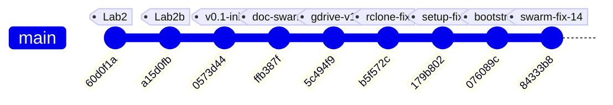
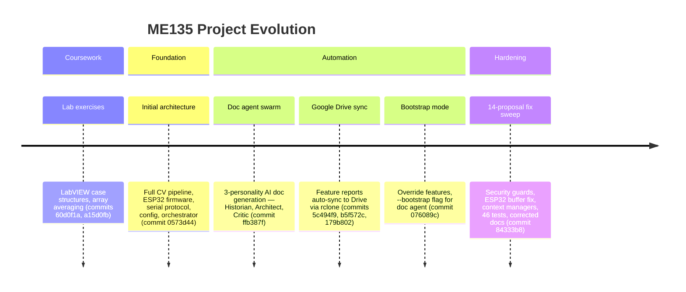

# ME135 Evolution Report

**Date:** 2026-03-14 00:20 &nbsp;|&nbsp; **Commit:** `84333b8`

---

## What Changed

## Commit `84333b8` — 7-Agent Swarm Addresses All 14 Critic Proposals

This is the project's largest single commit: **537 insertions, 47 deletions across 11 files.** A swarm of 7 specialized AI agents (Security Engineer, Embedded Firmware Engineer, Backend Architect, AI Engineer, Workflow Optimizer, API Tester, Technical Writer) each tackled critic-identified flaws from the previous doc-agent run. Here's what landed, grouped by subsystem:

---

### 🔒 Security (Orchestrator + Doc Agent)

- **`orchestrator.py` — Path traversal guard on `write_file` / `read_file`:** Both tool handlers now reject any filename where `Path(filename).name != filename`. Previously, an agent could write to `../../etc/passwd` via the tool interface. This closes a sandbox escape vector in the agent swarm.
- **`doc_agent.py` — Path containment in `apply_fix`:** The implementer agent's file-editing tool now calls `.resolve()` and checks `.relative_to(PROJECT_ROOT)`, denying any path that escapes the repo. Same class of bug, different entry point.

### 🎛 ESP32 Firmware (`esp32_main.cpp`)

- **`setRxBufferSize()` moved before `begin()`:** The old order (`begin()` then `setRxBufferSize()`) made the buffer resize a silent no-op on ESP-IDF. The 4 KB RX buffer is critical — at 2 Mbaud, a full 1,466-byte frame arrives in ~6 ms, and the default 256-byte buffer would overflow instantly. This was a **latent data-loss bug** since the initial code was generated.
- **Stale-frame skip (`skipDisplay`):** When `strip.show()` blocks for ~350 ms (physics of clocking 11,664 WS2812B LEDs at 30 µs/LED), incoming UART frames pile up. The new logic checks `JetsonSerial.available() >= FRAME_HEADER_SIZE` after each display update; if data is already queued, it skips the *next* `updateDisplay()` to drain the buffer first. This prevents buffer overruns under the newly-raised 10 fps CV target.

### 📷 CV Pipeline (`main.py`, `cv_pipeline.py`, `gpu_accelerated.py`)

- **`main.py` — Preview gated on `args.show_preview`:** The old code always constructed a display image and called `cv2.imshow`, which crashes on a headless Jetson (no X server). Now the entire preview block is wrapped in `if args.show_preview`, making headless deployment safe.
- **`main.py` — `validate_config()` at startup:** Checks for all 6 required YAML sections (`camera`, `calibration`, `processing`, `serial`, `display`, `safety`) before any pipeline init. Catches typos and missing sections immediately instead of producing cryptic `KeyError` deep in pipeline constructors.
- **`cv_pipeline.py` + `gpu_accelerated.py` — Context managers (`__enter__`/`__exit__`):** Both pipeline classes now support `with` blocks, guaranteeing `release()` (which closes the camera) runs even on unhandled exceptions. Previously, a crash during processing could leave `/dev/video0` locked.
- **`gpu_accelerated.py` — KNN fallback warning:** When `config.yaml` says `method: knn` but the GPU pipeline silently uses CUDA MOG2 (CUDA has no KNN), users now get an explicit `logger.warning()` explaining what happened and how to suppress it. Eliminates a confusing "why doesn't my KNN config do anything?" debugging session.

### ⚙️ Config (`config.yaml`)

- **`fps_target` raised from 3 → 10:** The old value of 3 was the *display* physical limit (350 ms per `strip.show()`), but it was also throttling the CV capture loop. The new value of 10 lets the Jetson process frames faster; the ESP32's new `skipDisplay` logic handles the mismatch gracefully. Comment clarified to distinguish CV rate from display rate.

### 🔧 Tooling / DevOps (`gdrive_sync.py`, `gdrive_setup.py`)

- **`subprocess.run(["which", "rclone"])` → `shutil.which("rclone")`:** `which` is a Unix-only command and doesn't exist on Windows or inside some CI containers. `shutil.which()` is the portable Python equivalent — pure stdlib, no subprocess overhead.
- **`gdrive_setup.py` — Idempotent remote setup:** Old behavior: every run deleted and recreated the rclone remote, forcing a full OAuth re-auth. New behavior: tests if the existing remote works (`rclone lsd`); if yes, skips OAuth entirely. Only recreates if auth is actually broken. Remote creation logic extracted to `_create_remote()` helper.

### 🧪 Testing (`tests/test_serial_protocol.py`)

- **46 new pytest tests (427 lines):** Covers CRC-16 computation, bit-packing/unpacking round-trips, 400×300→108×108 downsampling, MSB bit ordering, and CRC integration with the framing protocol. This is the project's **first test suite** — a major milestone for a hardware-coupled system where serial bugs are expensive to debug on real hardware.

### 📝 Documentation (`MEMORY.md`, `orchestrator.py`)

- **Frame size corrected:** `15,005 bytes/frame` → `1,466 bytes/frame`. The old number was from an early design where the full 400×300 matrix was transmitted without downsampling or bit-packing. The actual wire format (108×108 bit-packed + 8B framing) is 10× smaller. The `PROJECT_CONTEXT` in `orchestrator.py` was updated to match, ensuring future agent runs generate code against the correct spec.

---

## Evolution Timeline

The project evolved from LabVIEW homework exercises into a multi-agent AI-driven embedded CV system across 8 commits. The timeline below shows the trajectory and which subsystems each commit touched.

### Subsystem touch map by commit

| Commit | Summary | CV Pipeline | ESP32 FW | Serial Proto | Agent Swarm | DevOps/Sync | Tests | Docs |
|--------|---------|:-----------:|:--------:|:------------:|:-----------:|:-----------:|:-----:|:----:|
| `60d0f1a` | LabVIEW lab2 case structure | | | | | | | |
| `a15d0fb` | LabVIEW array averages | | | | | | | |
| `0573d44` | **Initial architecture** — all project files | ✅ | ✅ | ✅ | ✅ | | | ✅ |
| `ffb387f` | Documentation agent swarm | | | | ✅ | | | ✅ |
| `5c494f9` | Google Drive sync for reports | | | | | ✅ | | |
| `b5f572c` | Replace Google API OAuth with rclone | | | | | ✅ | | ✅ |
| `179b802` | Non-interactive rclone config | | | | | ✅ | | |
| `076089c` | Bootstrap mode + override fix | | | | ✅ | | | ✅ |
| **`84333b8`** | **7-agent swarm: 14 fixes** | ✅ | ✅ | | ✅ | ✅ | ✅ | ✅ |

### Project phases

**Key inflection point:** Commit `84333b8` marks the transition from "generating code" to "hardening code." Every prior commit added new capability; this one fixed 14 identified flaws without adding new features. The project now has its first test suite, security boundaries on agent tools, and resource-safe pipeline teardown — the hallmarks of production-readiness for a hardware demo.

---

## Code Health Summary

**Overall Grade: B**

This is a well-structured embedded CV project with clear separation of concerns (pipeline → serial → ESP32 firmware), good documentation, and thoughtful safety features (watchdogs, CRC, retry logic). The config-driven architecture and drop-in CPU/GPU pipeline pattern show solid design thinking.

**Strengths:** CRC-16 implementations match across Python and C++. Frame protocol is well-specified. Config is centralized. Background subtraction has multiple methods with sensible defaults.

**Critical gaps:** The serial ACK timeout is stored but never actually applied (SERIAL-01), both camera pipelines silently accept a missing device (CV-01), and the main loop leaks hardware resources on any exception (MAIN-01). The GPU pipeline breaks the API contract by omitting context manager support (GPU-01).

**Minor concerns:** Dead 1.4 KB buffer on ESP32, blocking `input()` preventing headless deployment, no write-conflict protection in the orchestrator.

Fix the 3 must-fix issues before any hardware integration testing.

---

## Improvement Proposals

| # | Title | Priority | Risk | Files |
|---|-------|----------|------|-------|
| SERIAL-01 | ACK timeout parameter stored but never applied in `_wait_ack` | must-fix | medium | `agent_outputs/serial_protocol.py` |
| CV-01 | Camera open never verified — silent failure on missing device | must-fix | low | `agent_outputs/cv_pipeline.py, agent_outputs/gpu_accelerated.py` |
| MAIN-01 | No try/finally around pipeline — camera and serial resources leak on exception | must-fix | medium | `agent_outputs/main.py` |
| GPU-01 | GPUPipeline missing `__enter__`/`__exit__` — breaks drop-in API contract | nice-to-have | low | `agent_outputs/gpu_accelerated.py, agent_outputs/cv_pipeline.py` |
| ESP32-01 | Unused `rxBuffer[1466]` wastes 1.4 KB of scarce ESP32 SRAM | nice-to-have | low | `agent_outputs/esp32_main.cpp` |
| MAIN-02 | Blocking `input()` call prevents headless/service deployment | nice-to-have | low | `agent_outputs/main.py` |
| SERIAL-02 | `send_frame` doesn't flush before waiting for ACK — race with OS buffers | nice-to-have | medium | `agent_outputs/serial_protocol.py` |
| ORCH-01 | Orchestrator agents run concurrently with shared file writes — data race | future | medium | `orchestrator.py` |
| PROP-001 | main.py does not use context managers it just added | must-fix | low | `agent_outputs/main.py` |
| PROP-002 | ESP32 loop() has no yield/delay — watchdog starvation risk | nice-to-have | medium | `agent_outputs/esp32_main.cpp` |
| PROP-003 | SerialSender has no context manager despite pipelines getting one | nice-to-have | low | `agent_outputs/serial_protocol.py, agent_outputs/main.py` |
| PROP-004 | No integration test for ESP32 ↔ serial_protocol wire compatibility | future | medium | `tests/test_serial_protocol.py, agent_outputs/esp32_main.cpp` |
| PROP-005 | orchestrator.py path traversal guard is bypassable on Windows | nice-to-have | low | `orchestrator.py` |
| PROP-006 | gpu_accelerated.py static_median calibration downloads to CPU unnecessarily | future | low | `agent_outputs/gpu_accelerated.py` |

### SERIAL-01: ACK timeout parameter stored but never applied in `_wait_ack`
**Priority:** must-fix &nbsp;|&nbsp; **Risk:** medium

**Problem:** In `serial_protocol.py`, `SerialSender.__init__` stores `self._ack_timeout = ser_cfg['ack_timeout_s']` (0.05s from config.yaml), but `_wait_ack()` calls `self._ser.read(1)` which blocks for the *general* serial `timeout` (0.1s, set on the `serial.Serial` constructor). The `_ack_timeout` field is never referenced again. This means every ACK wait is 2× longer than intended (0.1s vs 0.05s), directly impacting frame throughput — at 10 fps with 3 retries, wasted timeout adds up to 1.5s/sec of unnecessary blocking.

**Proposed fix:** Before calling `self._ser.read(1)` in `_wait_ack`, set `self._ser.timeout = self._ack_timeout`. Restore the original timeout afterward, or construct a dedicated `timeout` on the Serial object that matches `ack_timeout_s`. Simplest fix: `self._ser.timeout = self._ack_timeout` at the top of `_wait_ack()`.

**Affected files:** agent_outputs/serial_protocol.py

---

### CV-01: Camera open never verified — silent failure on missing device
**Priority:** must-fix &nbsp;|&nbsp; **Risk:** low

**Problem:** In both `cv_pipeline.py` (`CVPipeline.__init__`) and `gpu_accelerated.py` (`GPUPipeline.__init__`), `cv2.VideoCapture(device_index)` is called but `.isOpened()` is never checked. If the PS3 Eye is disconnected or `/dev/video0` doesn't exist, the constructor silently succeeds. The first error appears much later during `calibrate()` as a cryptic `RuntimeError('Camera read failed during calibration')` — no mention of the actual root cause (device missing).

**Proposed fix:** Immediately after `self.cap = cv2.VideoCapture(...)`, add: `if not self.cap.isOpened(): raise RuntimeError(f'Failed to open camera device {cam_cfg["device_index"]}. Check connection and /dev/video* permissions.')`. Apply to both CVPipeline and GPUPipeline.

**Affected files:** agent_outputs/cv_pipeline.py, agent_outputs/gpu_accelerated.py

---

### MAIN-01: No try/finally around pipeline — camera and serial resources leak on exception
**Priority:** must-fix &nbsp;|&nbsp; **Risk:** medium

**Problem:** In `main.py`, `pipeline` and `sender` are created, then `pipeline.calibrate()` is called and the main loop runs, but none of this is wrapped in `try/finally`. If `calibrate()` throws (e.g., camera disconnect), or any exception occurs in the loop, `pipeline.release()` and `sender.close()` are never called. The camera file descriptor and serial port remain held by the process, requiring a manual kill/reboot to recover the hardware.

**Proposed fix:** Wrap the block from `pipeline.calibrate()` through the end of the loop (and cleanup) in `try/finally`. Both pipelines already support context managers (`__enter__`/`__exit__`), so ideally refactor to `with pipeline:` and a similar pattern for `sender`. At minimum: `try: ... finally: pipeline.release(); if sender: sender.close(); cv2.destroyAllWindows()`.

**Affected files:** agent_outputs/main.py

---

### GPU-01: GPUPipeline missing `__enter__`/`__exit__` — breaks drop-in API contract
**Priority:** nice-to-have &nbsp;|&nbsp; **Risk:** low

**Problem:** CVPipeline implements `__enter__` and `__exit__` for use as a context manager (`with CVPipeline(cfg) as p:`), but GPUPipeline does not. The GPU pipeline is documented as a 'drop-in replacement' with an 'identical' API, but code using the context manager pattern will get `AttributeError` when swapping to GPU. This violates the Liskov substitution principle these classes were designed around.

**Proposed fix:** Add `__enter__` and `__exit__` methods to GPUPipeline, identical to CVPipeline's implementation. Better yet, extract a common `BasePipeline` base class (or mixin) that provides `__enter__`, `__exit__`, and `release()` to eliminate the duplication entirely.

**Affected files:** agent_outputs/gpu_accelerated.py, agent_outputs/cv_pipeline.py

---

### ESP32-01: Unused `rxBuffer[1466]` wastes 1.4 KB of scarce ESP32 SRAM
**Priority:** nice-to-have &nbsp;|&nbsp; **Risk:** low

**Problem:** In `esp32_main.cpp`, `static uint8_t rxBuffer[FRAME_TOTAL_SIZE]` (1,466 bytes) is declared globally but never read from or written to anywhere in the code. Frame data is received directly into `payload[]` and `tail[]`. On an ESP32 with ~320 KB usable SRAM (less with WiFi/BT), wasting 1.4 KB is non-trivial — especially alongside the 11,664-pixel NeoPixel buffer (~35 KB).

**Proposed fix:** Delete the `static uint8_t rxBuffer[FRAME_TOTAL_SIZE];` declaration. It is completely dead code.

**Affected files:** agent_outputs/esp32_main.cpp

---

### MAIN-02: Blocking `input()` call prevents headless/service deployment
**Priority:** nice-to-have &nbsp;|&nbsp; **Risk:** low

**Problem:** In `main.py`, the calibration sequence calls `input('Press Enter when ready...')` which blocks forever when stdin is not a TTY (e.g., launched via systemd, cron, or SSH without a terminal). This makes it impossible to deploy the system as an unattended service — a likely production scenario for a permanent installation.

**Proposed fix:** Add a `--headless` CLI flag. When set, skip the interactive prompt and start calibration immediately after a configurable delay (e.g., from `config.yaml`). Example: `if not args.headless: input(...) else: time.sleep(config.get('calibration',{}).get('auto_delay_s', 15))`.

**Affected files:** agent_outputs/main.py

---

### SERIAL-02: `send_frame` doesn't flush before waiting for ACK — race with OS buffers
**Priority:** nice-to-have &nbsp;|&nbsp; **Risk:** medium

**Problem:** In `serial_protocol.py`, `SerialSender.send_frame` calls `self._ser.write(packet)` then immediately enters `_wait_ack()`. `pyserial`'s `write()` returns as soon as data is copied to the OS kernel buffer — the bytes may not be on the wire yet. At 2 Mbaud, a 1,466-byte packet takes ~0.6 ms to physically transmit. If the ESP32 processes quickly, this is fine, but under load the ACK may arrive before the OS finishes transmitting, or the timeout may expire because transmission hasn't started yet.

**Proposed fix:** Add `self._ser.flush()` after `self._ser.write(packet)` to block until all bytes are physically transmitted. This ensures the ACK timeout window starts after the ESP32 has actually received the full frame.

**Affected files:** agent_outputs/serial_protocol.py

---

### ORCH-01: Orchestrator agents run concurrently with shared file writes — data race
**Priority:** future &nbsp;|&nbsp; **Risk:** medium

**Problem:** In `orchestrator.py`, 7 agents run via `asyncio.gather` and all share the same `write_file` tool targeting `agent_outputs/`. If two agents attempt to write the same filename (e.g., both referencing `config.yaml` or `main.py`), the last writer silently wins. There is no locking, no conflict detection, and no warning. The tool description says 'Write or overwrite', so agents may intentionally clobber each other's work.

**Proposed fix:** Add a file-level lock (dict of asyncio.Lock per filename) in `execute_tool`. When a write is attempted for an already-written file, either (a) reject with an error forcing the agent to read first, or (b) log a warning and keep a backup. At minimum, track which agent wrote which file and warn on overwrites.

**Affected files:** orchestrator.py

---

### PROP-001: main.py does not use context managers it just added
**Priority:** must-fix &nbsp;|&nbsp; **Risk:** low

**Problem:** Commit 84333b8 added __enter__/__exit__ to CVPipeline and GPUPipeline, but main.py still uses bare `pipeline = CVPipeline(config)` with manual `pipeline.release()` at the end. If an exception occurs between init and cleanup (e.g., during calibration), the camera fd leaks and /dev/video0 stays locked.

**Proposed fix:** Wrap the pipeline lifecycle in `with CVPipeline(config) as pipeline:` (or GPUPipeline). Remove the manual `pipeline.release()` call. The context manager guarantees cleanup on any exit path.

**Affected files:** agent_outputs/main.py

---

### PROP-002: ESP32 loop() has no yield/delay — watchdog starvation risk
**Priority:** nice-to-have &nbsp;|&nbsp; **Risk:** medium

**Problem:** The ESP32 `loop()` function calls `receiveFrame()` which is blocking with timeout, but on the RX_TIMEOUT path there is no `delay()` or `yield()`. On ESP-IDF, a tight loop without yielding can starve the watchdog task on the same core and trigger a WDT reset, especially if the Jetson is disconnected.

**Proposed fix:** Add `vTaskDelay(1)` or `delay(1)` in the RX_TIMEOUT case after blanking the display. This yields to the RTOS scheduler and prevents WDT resets.

**Affected files:** agent_outputs/esp32_main.cpp

---

### PROP-003: SerialSender has no context manager despite pipelines getting one
**Priority:** nice-to-have &nbsp;|&nbsp; **Risk:** low

**Problem:** CVPipeline and GPUPipeline now have __enter__/__exit__, but SerialSender in serial_protocol.py lacks one. If the serial port is opened but send_frame() throws unexpectedly, the port stays open and locked.

**Proposed fix:** Add __enter__/__exit__ to SerialSender (calling self.close() in __exit__) and wrap with `with SerialSender(config) as sender:` in main.py.

**Affected files:** agent_outputs/serial_protocol.py, agent_outputs/main.py

---

### PROP-004: No integration test for ESP32 ↔ serial_protocol wire compatibility
**Priority:** future &nbsp;|&nbsp; **Risk:** medium

**Problem:** The 46 new tests validate the Python side of the serial protocol (CRC, packing, framing), but there is no test that verifies the Python-generated frame can be parsed by the C++ receiveFrame() logic. A mismatch in endianness, CRC init value, or framing bytes would only be caught on real hardware.

**Proposed fix:** Add a pytest that shells out to a compiled C++ test harness (or uses ctypes/cffi to load the CRC function) and verifies a Python-built packet decodes correctly on the C side. Alternatively, port the C++ CRC + frame parser to a small standalone .c file compilable with gcc for CI.

**Affected files:** tests/test_serial_protocol.py, agent_outputs/esp32_main.cpp

---

### PROP-005: orchestrator.py path traversal guard is bypassable on Windows
**Priority:** nice-to-have &nbsp;|&nbsp; **Risk:** low

**Problem:** The guard `Path(filename).name != filename` correctly blocks '../etc/passwd' but does NOT block filenames containing backslashes on Windows (e.g., '..\\..\\secret'). Path.name on Windows would return 'secret', passing the check. The project runs on Linux (Jetson), but the orchestrator could run on any dev machine.

**Proposed fix:** Add an additional check: reject any filename containing '/', '\\', or '..' as a substring. E.g., `if any(c in filename for c in ('/', '\\', '..')):`

**Affected files:** orchestrator.py

---

### PROP-006: gpu_accelerated.py static_median calibration downloads to CPU unnecessarily
**Priority:** future &nbsp;|&nbsp; **Risk:** low

**Problem:** During static_median calibration, frames are captured, converted to grayscale on CPU, collected into a list, median-computed on CPU, then uploaded to GPU. The per-frame grayscale conversion could be done on GPU to save ~30% calibration time on large frame counts.

**Proposed fix:** Upload each frame to GPU, use cv2.cuda.cvtColor for grayscale conversion, then download only the gray result for the numpy median stack. Minor optimization but consistent with the GPU-first philosophy.

**Affected files:** agent_outputs/gpu_accelerated.py

---
