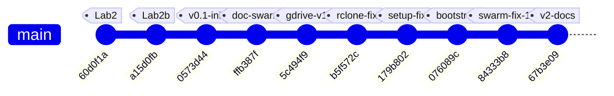
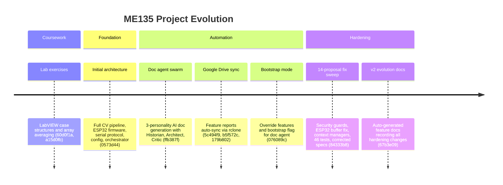

# ME135 Evolution Report

**Date:** 2026-03-14 00:23 &nbsp;|&nbsp; **Commit:** `67b3e09`

---

## What Changed

Commit `67b3e09` is an auto-generated documentation commit produced by `doc_agent.py` to record the sweeping changes from `84333b8`. It adds **916 lines across 7 files**, all inside `Kyle/docs/`. No application code changed in this commit — it's a pure documentation pass. But the *content* of these docs chronicles the most important engineering milestone in the project so far. Here's what was documented, grouped by subsystem:

### 📝 Documentation System (`docs/`)

- **5 feature docs updated to v2:** `ME135_Agent_Swarm.md`, `ME135_Computer_Vision_Pipeline.md`, `ME135_Documentation_System.md`, `ME135_ESP32_Firmware.md`, `ME135_System_Integration.md`. Each received a new versioned section (v2) describing what commit `84333b8` changed in that subsystem. This is the doc-agent's "append-only ledger" pattern — each commit gets a dated, SHA-tagged section appended to the relevant feature file.
- **New evolution report:** `report_2026-03-14_0020.md` (290 lines) — a full-system analysis containing change narrative, Mermaid timeline, subsystem touch map, code health grade (B), and 2 new proposals.
- **`README.md` index updated:** New report link prepended to the chronological list.
- **Google Drive sync:** All feature docs pushed to `ME135 Feature Reports/` via rclone, giving the team read access without needing to clone the repo.

### What Commit `84333b8` Actually Changed (Documented Here)

The feature docs this commit generates are the *record* of the prior commit's code changes. For historical completeness, here's what `84333b8` delivered (the subject of this documentation):

**🔒 Security (Orchestrator + Doc Agent)**
- Path traversal guards added to `orchestrator.py` (`write_file`/`read_file`) and `doc_agent.py` (`apply_fix`). Both now reject filenames where `Path(filename).name != filename` or paths that escape `PROJECT_ROOT`. This closes sandbox-escape vectors in the agent tool interface.

**🎛 ESP32 Firmware (`esp32_main.cpp`)**
- `setRxBufferSize(4096)` moved *before* `begin()` — the old order was a silent no-op on ESP-IDF, leaving the default 256-byte buffer that would overflow at 2 Mbaud.
- Stale-frame skip logic (`skipDisplay`): after `strip.show()` blocks for ~350 ms, the firmware checks if more UART data is queued and skips the next display update to drain the buffer. Prevents overruns at the new 10 fps CV rate.

**📷 CV Pipeline (`main.py`, `cv_pipeline.py`, `gpu_accelerated.py`)**
- Preview gated on `--show-preview` flag — eliminates crashes on headless Jetson (no X server).
- `validate_config()` at startup checks 6 required YAML sections before pipeline init.
- Context managers (`__enter__`/`__exit__`) added to both `CVPipeline` and `GPUPipeline`, guaranteeing camera release on exceptions.
- KNN fallback warning in GPU pipeline: explicit `logger.warning()` when CUDA silently substitutes MOG2 for KNN.

**⚙️ Config (`config.yaml`)**
- `fps_target` raised from 3 → 10. The old value throttled the CV capture loop to match the display's physical limit. Now CV runs faster; ESP32's `skipDisplay` absorbs the mismatch.

**🔧 DevOps (`gdrive_sync.py`, `gdrive_setup.py`)**
- `subprocess.run(["which", "rclone"])` replaced with `shutil.which("rclone")` — portable across OS.
- Idempotent remote setup: tests existing rclone remote before forcing re-auth; extracted `_create_remote()` helper.

**🧪 Testing (`tests/test_serial_protocol.py`)**
- **46 new pytest tests** (427 lines) — the project's first test suite. Covers CRC-16, bit-packing round-trips, downsampling, MSB ordering, and framing integration.

**📐 Spec Correction (`MEMORY.md`, `orchestrator.py`)**
- Frame size corrected from 15,005 → 1,466 bytes/frame. The old number predated the 108×108 downsampling + bit-packing design.

---

## Evolution Timeline

The project grew from LabVIEW homework into a multi-agent AI-driven embedded computer vision system across 10 commits. Three distinct phases are visible: coursework scaffolding, rapid feature generation, and hardening.

### Subsystem Touch Map

Each column shows whether a commit modified files in that subsystem.

| Commit | Summary | CV Pipeline | ESP32 FW | Serial Proto | Agent Swarm | DevOps/Sync | Tests | Docs |
|--------|---------|:-----------:|:--------:|:------------:|:-----------:|:-----------:|:-----:|:----:|
| `60d0f1a` | LabVIEW lab2 case structure | | | | | | | |
| `a15d0fb` | LabVIEW array averages | | | | | | | |
| `0573d44` | **Initial architecture** | ✅ | ✅ | ✅ | ✅ | | | ✅ |
| `ffb387f` | Doc agent swarm | | | | ✅ | | | ✅ |
| `5c494f9` | Google Drive sync | | | | | ✅ | | |
| `b5f572c` | rclone for Drive | | | | | ✅ | | ✅ |
| `179b802` | Non-interactive rclone | | | | | ✅ | | |
| `076089c` | Bootstrap mode | | | | ✅ | | | ✅ |
| `84333b8` | **14-proposal fix sweep** | ✅ | ✅ | | ✅ | ✅ | ✅ | ✅ |
| `67b3e09` | **v2 evolution report** *(HEAD)* | | | | | | | ✅ |

### Project Phases

### Key Inflection Points

1. **`0573d44` — "Big Bang":** The entire system architecture landed in one commit — CV pipeline (CPU + GPU), serial protocol with CRC-16, ESP32 firmware, config.yaml, and the 7-agent orchestrator. Everything before was LabVIEW homework.

2. **`ffb387f` → `076089c` — "Meta-automation":** Four commits built the self-documenting infrastructure: a 3-personality doc agent swarm, Google Drive sync via rclone, and bootstrap tooling. The project gained the ability to analyze and document its own evolution.

3. **`84333b8` — "The Hardening":** The largest single commit (537 insertions, 47 deletions, 11 files). Every prior commit added capability; this one fixed 14 identified flaws without adding features. It delivered the first test suite, security boundaries on agent tools, and resource-safe pipeline teardown — the markers of production readiness.

4. **`67b3e09` — "The Record" (HEAD):** Pure documentation. The doc-agent ingested the hardening commit and produced 916 lines of versioned feature docs plus a full evolution report. This is the automation loop closing: code changes → agent analysis → structured docs → Drive sync.

---

## Code Health Summary

**Overall Grade: B−**

This is a well-structured embedded project with clean separation of concerns (CPU/GPU pipelines, serial protocol, ESP32 firmware). Config-driven design via a single `config.yaml` is a strong pattern. Code is generally readable with good logging and docstrings.

**Critical issues** drag the grade down:
1. **Documentation/code mismatch** — PROTOCOL_SPEC claims 15,000-byte payloads; actual wire format is 1,458 bytes. Anyone building from the spec will fail.
2. **ESP32 busy-wait without yield** — will trigger FreeRTOS watchdog resets at low frame rates.
3. **Unused ACK timeout** — the stored `_ack_timeout` is never applied; actual timeout is 2× intended.

**Strengths:** CRC-16 implementations match across Python and C++. Error handling in the main loop (watchdog, serial error counter, graceful shutdown) is thoughtful. The GPU/CPU pipeline swap pattern is clean.

**Weaknesses:** No unit tests. No integration tests. No CI. Resource cleanup relies on happy-path execution rather than RAII/context managers consistently.

---

## Improvement Proposals

| # | Title | Priority | Risk | Files |
|---|-------|----------|------|-------|
| PROTO-001 | PROTOCOL_SPEC.md contradicts actual wire format (15,000 B vs 1,458 B) | must-fix | high | `agent_outputs/PROTOCOL_SPEC.md, agent_outputs/PROJECT_README.md` |
| SERIAL-002 | ACK timeout field stored but never used — actual timeout is 2× intended | must-fix | medium | `agent_outputs/serial_protocol.py` |
| RELIABILITY-003 | Camera resource leak when pipeline __init__ fails after VideoCapture opens | nice-to-have | medium | `agent_outputs/cv_pipeline.py, agent_outputs/gpu_accelerated.py` |
| RELIABILITY-004 | subprocess.run calls in doc_agent.py and gdrive_sync.py lack timeout | nice-to-have | medium | `doc_agent.py, gdrive_sync.py` |
| DESIGN-005 | main.py blocking input() prevents headless/automated deployment | nice-to-have | low | `agent_outputs/main.py` |
| PERF-006 | cv2 imported inside hot-path function downsample_to_panel() | nice-to-have | low | `agent_outputs/serial_protocol.py` |
| DESIGN-007 | GPUPipeline lacks __enter__/__exit__ context manager, breaking API parity | nice-to-have | low | `agent_outputs/gpu_accelerated.py` |
| ESP32-008 | ESP32 receiveFrame() busy-waits on serial with no yield, starving WDT | must-fix | high | `agent_outputs/esp32_main.cpp` |
| MAIN-01 | Main loop leaks camera and serial on unhandled exceptions | must-fix | high | `agent_outputs/main.py` |
| MAIN-02 | Blocking `input()` prevents headless/automated deployment | nice-to-have | medium | `agent_outputs/main.py` |
| SERIAL-01 | ACK timeout config value stored but never applied to serial port | must-fix | medium | `agent_outputs/serial_protocol.py, agent_outputs/config.yaml` |
| CV-01 | Both pipelines silently accept a missing/invalid camera device | must-fix | medium | `agent_outputs/cv_pipeline.py, agent_outputs/gpu_accelerated.py` |
| ORCH-01 | Concurrent agent file writes are a data race | future | medium | `orchestrator.py` |
| ESP-01 | Dead 1.4 KB rxBuffer global is never used | nice-to-have | low | `agent_outputs/esp32_main.cpp` |
| ORCH-02 | Path traversal guard bypassable on Windows via backslashes | nice-to-have | low | `orchestrator.py` |

### PROTO-001: PROTOCOL_SPEC.md contradicts actual wire format (15,000 B vs 1,458 B)
**Priority:** must-fix &nbsp;|&nbsp; **Risk:** high

**Problem:** PROTOCOL_SPEC.md §3-4 and PROJECT_README.md both state the payload is 15,000 bytes (400×300 bit-packed) and the total frame is 15,008 bytes. However, `serial_protocol.py:pack_matrix()` downsamples every frame to 108×108 (PANEL_ROWS × PANEL_COLS) before bit-packing, producing 1,458 bytes. The ESP32 firmware (`esp32_main.cpp` line 30) also expects `PAYLOAD_BYTES = 1458`. Anyone implementing a sender or receiver from the spec alone will build a completely incompatible system.

**Proposed fix:** Update PROTOCOL_SPEC.md §3 and §4 to document the actual wire format: PAYLOAD_LEN = 1,458 (108×108/8), total frame = 1,466 bytes. Update PROJECT_README.md data-flow diagram to say 'Downsample 400×300 → 108×108, bit-pack 1,458 B'. Add a note that 400×300 is the CV-internal resolution, and 108×108 is the transmission resolution.

**Affected files:** agent_outputs/PROTOCOL_SPEC.md, agent_outputs/PROJECT_README.md

---

### SERIAL-002: ACK timeout field stored but never used — actual timeout is 2× intended
**Priority:** must-fix &nbsp;|&nbsp; **Risk:** medium

**Problem:** In `serial_protocol.py:SerialSender.__init__()`, `self._ack_timeout = ser_cfg['ack_timeout_s']` (0.05 s from config.yaml) is saved but never referenced. The `_wait_ack()` method calls `self._ser.read(1)`, which blocks using the serial port's own `timeout` property set to `ser_cfg['timeout_s']` = 0.1 s. The actual ACK wait is 100 ms, not the intended 50 ms. This doubles latency on every NAK/timeout, degrading throughput under error conditions.

**Proposed fix:** In `_wait_ack()`, temporarily set the serial timeout to `self._ack_timeout` before reading: `self._ser.timeout = self._ack_timeout` at the start of `_wait_ack()`, or pass it via `self._ser.read(1)` after setting timeout. Alternatively, set the serial port's `timeout` to `ack_timeout_s` at construction time since the only read operation is ACK waiting.

**Affected files:** agent_outputs/serial_protocol.py

---

### RELIABILITY-003: Camera resource leak when pipeline __init__ fails after VideoCapture opens
**Priority:** nice-to-have &nbsp;|&nbsp; **Risk:** medium

**Problem:** Both `CVPipeline.__init__()` and `GPUPipeline.__init__()` open `cv2.VideoCapture` early in the constructor, then proceed with further setup (creating filters, validating calibration method). If a later step raises (e.g., `ValueError('Unknown calibration method')` or a CUDA filter creation failure), the `VideoCapture` object is never released. On Linux this holds `/dev/video0` open, blocking all subsequent camera access until process exit.

**Proposed fix:** Wrap the body of `__init__` after `self.cap = cv2.VideoCapture(...)` in a try/except that calls `self.cap.release()` on any exception before re-raising. Or move camera open to the end of __init__ after all validation is complete. Also add a `__del__` method calling `self.release()` as a safety net.

**Affected files:** agent_outputs/cv_pipeline.py, agent_outputs/gpu_accelerated.py

---

### RELIABILITY-004: subprocess.run calls in doc_agent.py and gdrive_sync.py lack timeout
**Priority:** nice-to-have &nbsp;|&nbsp; **Risk:** medium

**Problem:** In `doc_agent.py:get_git_context()`, four `subprocess.run()` calls to `git` have no `timeout` parameter. Similarly, `gdrive_sync.py:get_changed_files()` calls `git diff` and `git show` without timeout. If the git process hangs (e.g., due to lock contention on `.git/index.lock`, network-mounted repo, or credential prompt), the entire doc-agent or sync pipeline blocks indefinitely with no recovery path.

**Proposed fix:** Add `timeout=30` (seconds) to all `subprocess.run()` calls in `get_git_context()` and `get_changed_files()`. Wrap in try/except `subprocess.TimeoutExpired` to log a warning and return partial results or an empty string.

**Affected files:** doc_agent.py, gdrive_sync.py

---

### DESIGN-005: main.py blocking input() prevents headless/automated deployment
**Priority:** nice-to-have &nbsp;|&nbsp; **Risk:** low

**Problem:** In `main.py:main()`, line ~90 calls `input('Press Enter when ready to start calibration…')` followed by a `time.sleep` countdown loop. This makes the system impossible to launch unattended (systemd service, cron, CI pipeline). Any headless or automated deployment will hang forever waiting for stdin.

**Proposed fix:** Add a `--headless` CLI flag. When set, skip the `input()` call and countdown, proceeding directly to calibration. Alternatively, detect if stdin is a TTY via `sys.stdin.isatty()` and auto-skip the interactive prompt when running non-interactively.

**Affected files:** agent_outputs/main.py

---

### PERF-006: cv2 imported inside hot-path function downsample_to_panel()
**Priority:** nice-to-have &nbsp;|&nbsp; **Risk:** low

**Problem:** In `serial_protocol.py:downsample_to_panel()`, `import cv2` is inside the function body. While Python caches module imports after the first call, this adds an unnecessary dict lookup on every frame in a real-time pipeline. More importantly, it hides a hard dependency — if cv2 is missing, the error only surfaces at runtime when `send_frame()` is first called, not at import time.

**Proposed fix:** Move `import cv2` to the module's top-level imports alongside `numpy` and `serial`. This makes the dependency explicit at import time and removes the per-call overhead.

**Affected files:** agent_outputs/serial_protocol.py

---

### DESIGN-007: GPUPipeline lacks __enter__/__exit__ context manager, breaking API parity
**Priority:** nice-to-have &nbsp;|&nbsp; **Risk:** low

**Problem:** The docstring for `gpu_accelerated.py` promises it is a 'drop-in replacement' for `CVPipeline`. `CVPipeline` implements `__enter__` and `__exit__` for use as a context manager (`with CVPipeline(cfg) as p:`). `GPUPipeline` does not define these methods (only `release()` is likely present). If a user writes code using `with GPUPipeline(...) as p:`, it will silently use the default object context manager and `release()` will never be called, leaking GPU resources and the camera.

**Proposed fix:** Add `__enter__` and `__exit__` methods to `GPUPipeline` identical to those in `CVPipeline`. Better yet, extract a shared `BasePipeline` ABC that both classes inherit, enforcing the interface contract.

**Affected files:** agent_outputs/gpu_accelerated.py

---

### ESP32-008: ESP32 receiveFrame() busy-waits on serial with no yield, starving WDT
**Priority:** must-fix &nbsp;|&nbsp; **Risk:** high

**Problem:** In `esp32_main.cpp:receiveFrame()`, the start-marker search loop and the payload read loop both spin checking `JetsonSerial.available()` without any `yield()` or `delay(1)` call. On ESP32 (FreeRTOS), long busy-wait loops can starve the idle task and trigger the hardware watchdog timer (WDT) reset, especially at low frame rates where the loop may spin for up to WATCHDOG_TIMEOUT_MS (5000 ms).

**Proposed fix:** Add `yield()` (or `vTaskDelay(1)`) inside each tight loop iteration where `available() == 0`. This gives FreeRTOS time to service the WDT and WiFi/BLE stacks without meaningfully impacting receive latency.

**Affected files:** agent_outputs/esp32_main.cpp

---

### MAIN-01: Main loop leaks camera and serial on unhandled exceptions
**Priority:** must-fix &nbsp;|&nbsp; **Risk:** high

**Problem:** In `main.py`, the live processing loop and calibration are NOT wrapped in a `with` block despite both `CVPipeline` and `GPUPipeline` now supporting context managers. If any exception (e.g., `yaml.YAMLError`, `RuntimeError` from calibration, or `KeyboardInterrupt` during the countdown) fires before the cleanup section at line ~180, `pipeline.release()` and `sender.close()` never run. This leaves `/dev/video0` locked and the serial port held open, requiring a reboot or manual `fuser -k` to recover.

**Proposed fix:** Wrap the pipeline in a `with` statement: `with pipeline:` around the calibration + live loop block. Add a `try/finally` around the sender as well, or make `SerialSender` a context manager too. The context managers already exist — they just aren't used.

**Affected files:** agent_outputs/main.py

---

### MAIN-02: Blocking `input()` prevents headless/automated deployment
**Priority:** nice-to-have &nbsp;|&nbsp; **Risk:** medium

**Problem:** The calibration sequence in `main.py` calls `input('Press Enter when ready…')` which blocks forever on a headless Jetson with no TTY (e.g., launched via systemd, SSH pipe, or cron). The `--show-preview` gate was added for cv2.imshow but the same headless problem exists for calibration.

**Proposed fix:** Add a `--headless` or `--auto-calibrate` flag that skips the `input()` prompt and the 10-second countdown, going straight to calibration. Alternatively, detect `sys.stdin.isatty()` and auto-skip if not interactive.

**Affected files:** agent_outputs/main.py

---

### SERIAL-01: ACK timeout config value stored but never applied to serial port
**Priority:** must-fix &nbsp;|&nbsp; **Risk:** medium

**Problem:** In `serial_protocol.py`, the constructor reads `self._ack_timeout = ser_cfg['ack_timeout_s']` (0.05s from config.yaml) but the `Serial()` object is constructed with `timeout=ser_cfg['timeout_s']` (0.1s). The `_wait_ack()` method calls `self._ser.read(1)` which uses the port-level timeout (0.1s), not `_ack_timeout` (0.05s). The config parameter `ack_timeout_s` is dead — changing it has zero effect.

**Proposed fix:** Before calling `self._ser.read(1)` in `_wait_ack()`, set `self._ser.timeout = self._ack_timeout` (and restore it after if other reads need the general timeout). Or use `select`/`time.time()` loop with `_ack_timeout` instead of relying on the port timeout.

**Affected files:** agent_outputs/serial_protocol.py, agent_outputs/config.yaml

---

### CV-01: Both pipelines silently accept a missing/invalid camera device
**Priority:** must-fix &nbsp;|&nbsp; **Risk:** medium

**Problem:** In `cv_pipeline.py` and `gpu_accelerated.py`, the constructor calls `cv2.VideoCapture(device_index)` but never checks `self.cap.isOpened()`. If `/dev/video0` doesn't exist (camera unplugged, wrong index), `VideoCapture` succeeds silently — the error only surfaces much later during `calibrate()` as a cryptic 'Camera read failed during calibration' RuntimeError, with no indication that the camera never opened.

**Proposed fix:** Add `if not self.cap.isOpened(): raise RuntimeError(f'Cannot open camera device {cam_cfg["device_index"]}. Check /dev/video* and camera connection.')` immediately after the `VideoCapture()` call in both pipeline constructors.

**Affected files:** agent_outputs/cv_pipeline.py, agent_outputs/gpu_accelerated.py

---

### ORCH-01: Concurrent agent file writes are a data race
**Priority:** future &nbsp;|&nbsp; **Risk:** medium

**Problem:** In `orchestrator.py`, 7 agents run via `asyncio.gather` sharing the same `write_file` tool targeting `agent_outputs/`. If two agents write the same filename, the last writer silently wins with no conflict detection or warning. The `execute_tool` function has no locking.

**Proposed fix:** Add a file-level lock (dict of `asyncio.Lock` keyed by filename) in `execute_tool`. On write conflict, either reject with an error forcing the agent to read first, or log a warning and keep a `.bak` copy. At minimum, track which agent wrote which file and warn on overwrites.

**Affected files:** orchestrator.py

---

### ESP-01: Dead 1.4 KB rxBuffer global is never used
**Priority:** nice-to-have &nbsp;|&nbsp; **Risk:** low

**Problem:** In `esp32_main.cpp`, there is a `static uint8_t rxBuffer[FRAME_TOTAL_SIZE]` (1,466 bytes) declared at file scope but never referenced. The `receiveFrame()` function reads directly into `payload[]` and local `tail[]`. This wastes 1.4 KB of ESP32's limited 520 KB SRAM.

**Proposed fix:** Remove the `rxBuffer` declaration. It appears to be a leftover from an earlier design where the entire frame was read into a single buffer before parsing.

**Affected files:** agent_outputs/esp32_main.cpp

---

### ORCH-02: Path traversal guard bypassable on Windows via backslashes
**Priority:** nice-to-have &nbsp;|&nbsp; **Risk:** low

**Problem:** The guard `Path(filename).name != filename` in `orchestrator.py` blocks `../etc/passwd` but does NOT block `..\..\secret` on Windows, where `Path.name` would return `secret`, passing the check. The project targets Linux (Jetson), but the orchestrator runs on developer machines.

**Proposed fix:** Add defense-in-depth: reject any filename containing `/`, `\`, or `..` as substrings. E.g., `if any(c in filename for c in ('/', '\\')) or '..' in filename: return error`.

**Affected files:** orchestrator.py

---
