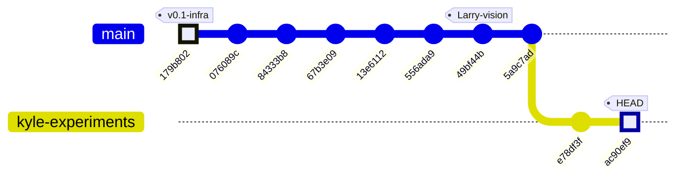
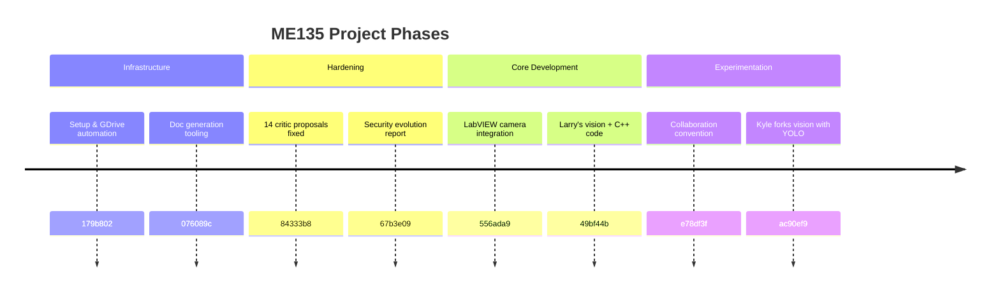
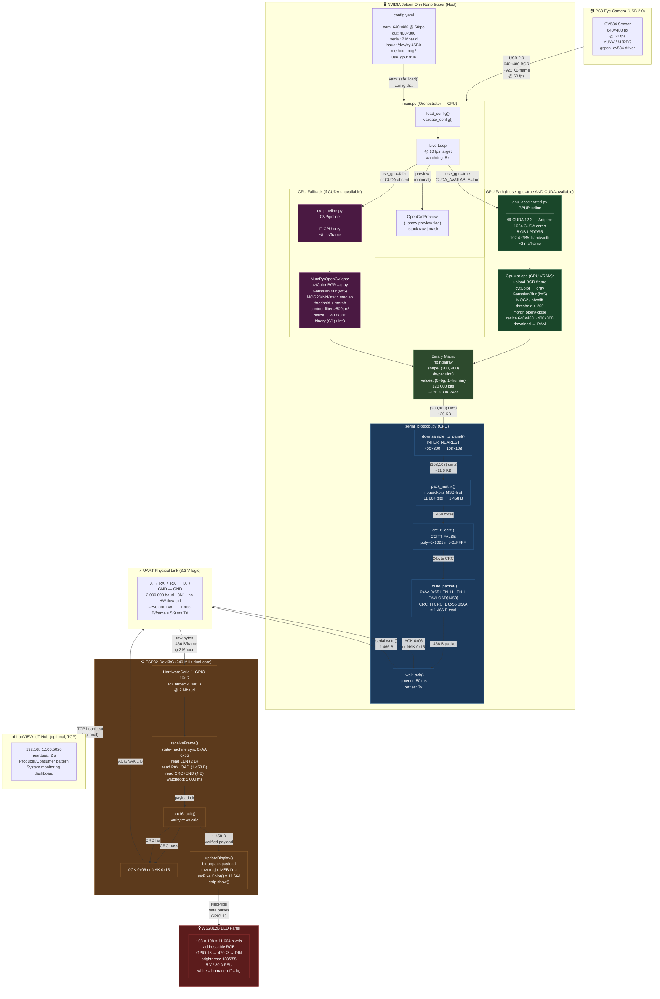
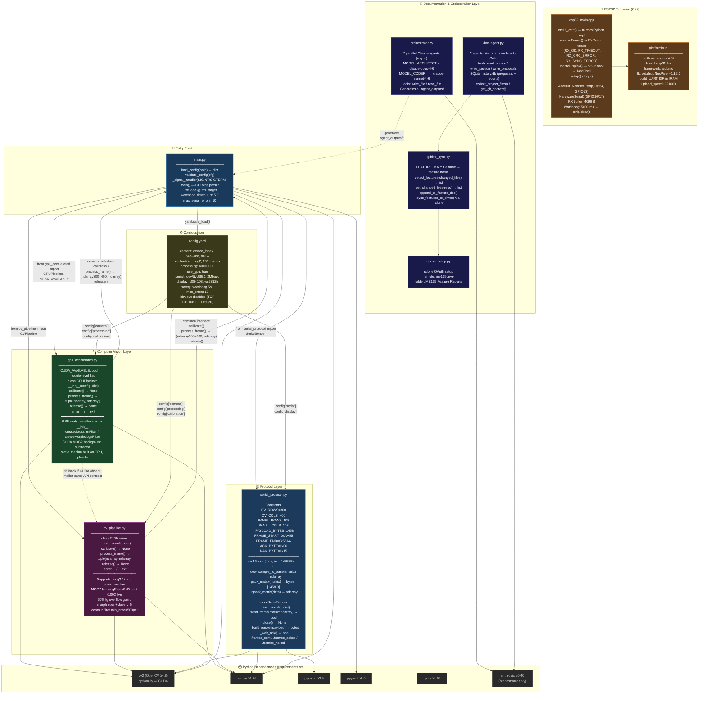

# ME135 Evolution Report

**Date:** 2026-04-30 22:31 &nbsp;|&nbsp; **Commit:** `ac90ef9`

---

## What Changed

## Commit `ac90ef9` — Kyle forks the vision pipeline for personal experiments

This commit marks a **branching point in the team's CV strategy**. Kyle copied Larry's `vision.py` (from commit `49bf44b`) into his own sandbox at `Kyle/vision/vision.py`, establishing a personal experimental track while keeping the canonical codebase untouched.

### CV Pipeline — New YOLO-based approach (`Kyle/vision/vision.py`)

- **Detection method replaced**: The canonical pipeline (`agent_outputs/cv_pipeline.py`) uses **background subtraction** (MOG2/KNN/static median) — a classical technique that requires a person-free calibration phase and breaks when the camera moves or lighting shifts. Kyle's fork uses **YOLOv8 instance segmentation** (`yolov8n-seg.pt`, ~6 MB nano model), which is a class-aware deep-learning detector. This means:
  - No calibration phase needed — works on the first frame.
  - Detects "person" specifically (COCO class 0) instead of "anything that moved."
  - Per-instance masks, not just a foreground blob.
- **Output resolution changed**: The canonical system produces a **400×300** binary matrix (downsampled to 108×108 for the LED panel). Kyle's fork outputs **64×64** — suggesting he may be targeting a different display or exploring a lower-bandwidth protocol.
- **Multi-backend camera open**: `open_camera()` tries AVFoundation → V4L2 → ANY, making the script portable across macOS and Linux (the canonical pipeline only calls `cv2.VideoCapture` with a device index).
- **Interactive controls added**: Pause/resume (SPACE), save snapshot (`s`), live confidence threshold tuning (`[` / `]`). The canonical `main.py` has none of these — it's a headless production loop.
- **Morphological cleanup retained**: Both pipelines use `MORPH_CLOSE` with a 5×5 elliptical kernel and contour-area filtering to remove noise. Kyle's minimum area is 0.2% of the frame; the canonical uses a fixed 500 px² threshold.
- **No serial integration yet**: Kyle's script is purely visual (three `cv2.imshow` windows). It doesn't produce the bit-packed UART frames that the ESP32 expects. This is an experiment, not a replacement — yet.

### Project Governance — Collaboration convention (`e78df3f`)

- **CLAUDE.md added**: Establishes a folder-based collaboration convention between Kyle and Larry, preventing accidental overwrites. Each team member works in their own directory; the AI assistant (Claude) is acknowledged as a co-author.

### Upstream Context (commits leading to this point)

- **`49bf44b`** — Larry's original vision code and optimized C++ landed. This is the version Kyle forked.
- **`556ada9`** — LabVIEW camera integration code added (monitoring dashboard path).
- **`84333b8` → `67b3e09`** — A 7-agent swarm addressed 14 critic proposals: security hardening, reliability fixes, and documentation improvements across the entire codebase.
- **`179b802`** — Setup automation fixes (rclone config for Google Drive sync).

### Why this matters

The team now has **two parallel CV philosophies** in the repo:

| Dimension | Canonical (`agent_outputs/`) | Kyle's fork (`Kyle/vision/`) |
|---|---|---|
| Detection | Background subtraction (MOG2) | YOLOv8 instance segmentation |
| Calibration | Required (empty-scene capture) | None (model-based) |
| Output size | 400×300 → 108×108 | 64×64 |
| Hardware target | Jetson → ESP32 → LED panel | Standalone USB camera preview |
| Maturity | Production-ready with serial protocol | Experimental sandbox |

If YOLO proves fast enough on the Jetson (the nano model runs at ~30 fps on Orin Nano), Kyle's approach could replace background subtraction entirely — eliminating the fragile calibration step and making the system robust to camera repositioning.

---

## Evolution Timeline

## Project trajectory: from infrastructure to CV experimentation



### Subsystem map per commit

| Commit | Date | Subsystems touched | Summary |
|--------|------|--------------------|---------|
| `179b802` | — | 🔧 Setup / GDrive | Non-interactive rclone config, fix bad `client_id` |
| `076089c` | — | 📄 Docs | Bootstrap mode for doc generation, `override_features` fix |
| `84333b8` | — | 🔧 All subsystems | 7-agent swarm fixes all 14 critic proposals (security, reliability) |
| `67b3e09` | — | 📄 Docs | v2 evolution report with security & reliability narrative |
| `13e6112` | — | 📄 Docs | Auto-generated evolution report (CI skip) |
| `556ada9` | — | 📷 LabVIEW | LabVIEW camera integration code added |
| `49bf44b` | — | 📷 CV Pipeline / 🔌 ESP32 | Larry's vision code + optimized C++ — **the baseline** |
| `5a9c7ad` | — | 🔀 Merge | Merge remote `main` |
| `e78df3f` | Apr 30 | 📄 Governance | `CLAUDE.md` — Kyle/Larry folder convention established |
| `ac90ef9` | Apr 30 | 📷 CV Pipeline (Kyle fork) | YOLOv8 segmentation fork of Larry's vision.py → `Kyle/vision/` |

### Phase narrative



The project has progressed through three clear phases: **infrastructure scaffolding** (GDrive sync, docs tooling), **hardening** (a systematic 7-agent review that swept all 14 open issues), and now **active CV experimentation** where team members are diverging to test alternative detection strategies. The next critical decision point: will Kyle's YOLO approach prove viable enough to merge back into the canonical pipeline, or will background subtraction remain the production path?

---

## System Architecture



---

## Data Flow

```mermaid
sequenceDiagram
    participant CAM  as 📷 PS3 Eye<br/>(640×480 @ 60fps)
    participant OCV  as 🖥 OpenCV Capture<br/>(cv2.VideoCapture)
    participant GPU  as ⚡ GPU Pipeline<br/>(CUDA GpuMat)
    participant CPU  as 🔵 CPU Pipeline<br/>(NumPy fallback)
    participant SER  as 📦 SerialSender<br/>(serial_protocol.py)
    participant UART as 🔌 UART Link<br/>(2 Mbaud / 3.3V)
    participant ESP  as ⚙️ ESP32<br/>(esp32_main.cpp)
    participant LED  as 💡 WS2812B<br/>(108×108 panel)

    Note over CAM,LED: ── Calibration Phase (once on startup) ──────────────────────────────

    CAM  ->> OCV  : 90 warmup frames discarded<br/>(auto-exposure settling)
    loop 200 calibration frames
        CAM  ->> OCV  : read() → 640×480 BGR<br/>~921 600 B/frame
        OCV  ->> GPU  : cvtColor BGR→gray (GPU)<br/>307 200 B gray frame
        GPU  ->> GPU  : MOG2.apply(learningRate=0.05)<br/>builds background model in VRAM
    end
    Note over GPU: Background model ready ✓

    Note over CAM,LED: ── Live Loop (target 10 fps) ───────────────────────────────────────

    rect rgb(20, 60, 20)
        Note over CAM,GPU: CAPTURE & GPU PROCESSING  ~2 ms total (GPU path)
        CAM  ->> OCV  : cap.read() blocking<br/>@ 60fps → ~16.7 ms between frames
        OCV  -->> GPU : BGR frame<br/>640×480 × 3ch = 921 600 B<br/>uploaded to GpuMat
        GPU  ->> GPU  : cuda.cvtColor BGR→gray<br/>640×480 × 1ch = 307 200 B  (VRAM)
        GPU  ->> GPU  : GaussianFilter k=5×5<br/>307 200 B → 307 200 B  (VRAM)
        GPU  ->> GPU  : MOG2.apply(learningRate=0.002)<br/>fg_mask 307 200 B  (VRAM)
        GPU  ->> GPU  : cuda.threshold fg>200→255<br/>binary mask 307 200 B  (VRAM)
        GPU  ->> GPU  : morphOpen + morphClose k=5<br/>noise removal — 307 200 B  (VRAM)
        GPU  ->> GPU  : cuda.resize 640×480→400×300<br/>INTER_NEAREST — 120 000 B  (VRAM)
        GPU  -->> OCV : GpuMat.download()<br/>binary_matrix 120 000 B → RAM
    end

    Note over OCV,SER: binary_matrix = np.ndarray(300,400) uint8 {0,1} — 120 000 B in RAM

    rect rgb(20, 20, 60)
        Note over SER: BIT-PACKING & FRAMING  ~0.5 ms (CPU)
        OCV  ->> SER  : send_frame(binary_matrix)<br/>shape (300,400) uint8
        SER  ->> SER  : downsample_to_panel()<br/>cv2.resize INTER_NEAREST<br/>400×300 → 108×108<br/>120 000 B → 11 664 B
        SER  ->> SER  : np.packbits(flatten, bitorder='big')<br/>11 664 B → 1 458 B
        SER  ->> SER  : crc16_ccitt(payload)<br/>poly=0x1021 init=0xFFFF<br/>1 458 B → 2 B CRC
        SER  ->> SER  : _build_packet()<br/>0xAA 0x55 │ 0x05 0xB2 │ PAYLOAD[1458] │ CRC[2] │ 0x55 0xAA<br/>Total: 1 466 B
    end

    rect rgb(60, 30, 10)
        Note over SER,UART: UART TRANSMISSION  ~5.9 ms @ 2 Mbaud
        SER  ->> UART : serial.write(packet)<br/>1 466 B<br/>@ 2 000 000 bps → ~5.9 ms TX time
        UART ->> ESP  : raw bytes arrive in 4 096 B RX buffer<br/>GPIO 16 (UART RX pin)
    end

    rect rgb(60, 20, 20)
        Note over ESP: ESP32 RECEIVE & VERIFY  ~6–10 ms
        ESP  ->> ESP  : state-machine sync<br/>wait 0xAA → 0x55 (start marker)
        ESP  ->> ESP  : read LEN bytes [2]<br/>verify == 1 458 (0x05B2)
        ESP  ->> ESP  : readBytes(payload, 1 458)<br/>chunked from UART FIFO
        ESP  ->> ESP  : read tail [4]: CRC_H CRC_L 0x55 0xAA<br/>verify end marker
        ESP  ->> ESP  : crc16_ccitt(payload, 1458)<br/>compare rxCRC vs calcCRC
        alt CRC pass ✓
            ESP  ->> UART : ACK byte 0x06<br/>1 B
            UART -->> SER : ACK received within 50 ms window
            Note over SER: frames_acked++ → consecutive_errors = 0
        else CRC fail ✗
            ESP  ->> UART : NAK byte 0x15<br/>1 B
            UART -->> SER : NAK received
            Note over SER: retry up to 3×; if all fail → log error, skip frame
        end
    end

    rect rgb(40, 10, 40)
        Note over ESP,LED: LED PANEL UPDATE  ~3–30 ms (11 664 pixels)
        ESP  ->> ESP  : updateDisplay()<br/>loop i in 0..11663<br/>byteVal = payload[i>>3]<br/>bit = (byteVal >> (7-(i&7))) & 1
        ESP  ->> LED  : strip.setPixelColor(i, WHITE) if bit==1<br/>strip.setPixelColor(i, BLACK) if bit==0<br/>× 11 664 iterations
        ESP  ->> LED  : strip.show()<br/>NeoPixel serial protocol<br/>GPIO 13 → 470Ω → DIN<br/>~30 ms for 11 664 LEDs @ 800 kHz
        Note over LED: Frame illuminated ✓<br/>white = human detected<br/>black = background
    end

    Note over CAM,LED: ── Timing Budget Summary ───────────────────────────────────────────
    Note over CAM,LED: Camera frame period  16.7 ms (60fps capture)<br/>GPU processing        ~2.0 ms<br/>Bit-pack + CRC        ~0.5 ms<br/>UART TX               ~5.9 ms<br/>ACK round-trip        ~6.0 ms<br/>LED strip.show()      ~30 ms  ← bottleneck<br/>─────────────────────────────<br/>Theoretical max       ~8 fps  (UART limited)<br/>Target pipeline       10 fps  (parallelism hides TX latency)
```

---

## Module Dependency Graph



---

## Code Health Summary

**Overall Grade: B−**

The codebase is well-structured with clean separation (CPU pipeline, GPU pipeline, serial protocol, ESP32 firmware, central config). Naming is consistent, logging is thorough, and the architecture is sound for an embedded CV project.

**Critical issue:** The protocol specification documents a 15,000-byte payload (400×300), but the implementation actually transmits 1,458 bytes (108×108 downsampled). Anyone implementing from the spec will produce incompatible firmware. This spec/code drift is the single most dangerous defect.

**Reliability gaps:** No camera-open validation, no `yield()` in ESP32 busy-waits (TWDT crash risk), resource leaks on exceptions, and a stored-but-never-used ACK timeout that doubles retry latency.

**Strengths:** CRC-16 implementations match across Python/C++, the GPU pipeline is a clean drop-in replacement for the CPU path, config is centralized, and safety watchdogs exist on both sides of the UART link.

---

## Improvement Proposals

| # | Title | Priority | Risk | Files |
|---|-------|----------|------|-------|
| PROP-001 | Kyle's YOLO fork has no serial protocol integration | nice-to-have | medium | `Kyle/vision/vision.py, agent_outputs/serial_protocol.py` |
| PROP-002 | Output resolution mismatch: 64×64 vs 108×108 LED panel | nice-to-have | low | `Kyle/vision/vision.py, agent_outputs/config.yaml` |
| PROP-003 | YOLO model download on first run without network check | nice-to-have | low | `Kyle/vision/vision.py` |
| PROP-004 | No shared config between canonical pipeline and Kyle's fork | future | low | `Kyle/vision/vision.py, agent_outputs/config.yaml` |
| PROP-005 | Canonical serial_protocol.py has payload size inconsistency with README | must-fix | medium | `agent_outputs/PROJECT_README.md, agent_outputs/serial_protocol.py` |
| PROTO-001 | Protocol spec documents 15,000B payload but code transmits 1,458B | must-fix | high | `agent_outputs/PROTOCOL_SPEC.md, agent_outputs/PROJECT_README.md` |
| SERIAL-001 | SerialSender stores `_ack_timeout` but never applies it | must-fix | medium | `agent_outputs/serial_protocol.py` |
| CV-001 | No camera-open validation in CVPipeline and GPUPipeline constructors | must-fix | medium | `agent_outputs/cv_pipeline.py, agent_outputs/gpu_accelerated.py` |
| FW-001 | ESP32 busy-waits without yield(), risking Task Watchdog reset | must-fix | high | `agent_outputs/esp32_main.cpp` |
| MAIN-001 | Pipeline and serial resources leak on exception | must-fix | medium | `agent_outputs/main.py` |
| CV-002 | Warmup frames silently swallow camera read failures | nice-to-have | low | `agent_outputs/cv_pipeline.py, agent_outputs/gpu_accelerated.py` |
| FW-002 | Unused `rxBuffer` wastes 1,466 bytes of ESP32 SRAM | nice-to-have | low | `agent_outputs/esp32_main.cpp` |
| CFG-001 | Config parameter `static_median_alpha` is defined but never read | nice-to-have | low | `agent_outputs/config.yaml, agent_outputs/cv_pipeline.py, agent_outputs/gpu_accelerated.py` |
| PROTO-01 | PROTOCOL_SPEC.md documents 15 000 B payload but code transmits 1 458 B | must-fix | high | `agent_outputs/PROTOCOL_SPEC.md, agent_outputs/serial_protocol.py` |
| PERF-01 | WS2812B strip.show() latency (~30 ms) is undocumented pipeline bottleneck | must-fix | medium | `agent_outputs/esp32_main.cpp, agent_outputs/PROTOCOL_SPEC.md` |
| PROTO-02 | Frame header and length field not covered by CRC | nice-to-have | medium | `agent_outputs/serial_protocol.py, agent_outputs/esp32_main.cpp, agent_outputs/PROTOCOL_SPEC.md` |
| GPU-01 | GPU pipeline silently degrades KNN to MOG2 without surfacing to main.py | nice-to-have | low | `agent_outputs/gpu_accelerated.py, agent_outputs/main.py` |
| SAFE-01 | main.py watchdog resets its own timer on trigger, masking repeated camera failures | must-fix | medium | `agent_outputs/main.py, agent_outputs/config.yaml` |
| SERIAL-01 | SerialSender has no dropped-frame metric exposed for monitoring | nice-to-have | low | `agent_outputs/serial_protocol.py, agent_outputs/main.py` |
| FW-01 | ESP32 RX buffer (4096 B) can hold only 2.8 frames — no overflow guard | nice-to-have | medium | `agent_outputs/esp32_main.cpp, agent_outputs/serial_protocol.py` |
| CV-01 | Static median background model: GPU path uploads once but CPU path recomputes from scratch — no incremental update | future | low | `agent_outputs/cv_pipeline.py, agent_outputs/gpu_accelerated.py, agent_outputs/config.yaml` |

### PROP-001: Kyle's YOLO fork has no serial protocol integration
**Priority:** nice-to-have &nbsp;|&nbsp; **Risk:** medium

**Problem:** Kyle/vision/vision.py outputs 64×64 frames to OpenCV windows only. It cannot drive the ESP32/LED panel because it lacks bit-packing, UART framing, and CRC logic. If this approach proves superior, significant integration work will be needed.

**Proposed fix:** Import and reuse `serial_protocol.py`'s `SerialSender` class. Change OUTPUT_SIZE to 108 to match the LED panel (or add a config flag). Add a `--serial` CLI flag so the script can optionally transmit frames to the ESP32 alongside the preview.

**Affected files:** Kyle/vision/vision.py, agent_outputs/serial_protocol.py

---

### PROP-002: Output resolution mismatch: 64×64 vs 108×108 LED panel
**Priority:** nice-to-have &nbsp;|&nbsp; **Risk:** low

**Problem:** Kyle's fork hardcodes OUTPUT_SIZE = 64, but the physical LED panel is 108×108 (defined in config.yaml and esp32_main.cpp). If this code is ever connected to the real hardware, the size mismatch will produce a garbled display or a protocol error (ESP32 expects exactly 1,458 bytes = 108×108/8).

**Proposed fix:** Read panel dimensions from config.yaml (display.panel_width / panel_height) instead of hardcoding. Alternatively, add a prominent comment explaining that 64×64 is intentional for a different target display.

**Affected files:** Kyle/vision/vision.py, agent_outputs/config.yaml

---

### PROP-003: YOLO model download on first run without network check
**Priority:** nice-to-have &nbsp;|&nbsp; **Risk:** low

**Problem:** The script calls `YOLO('yolov8n-seg.pt')` which auto-downloads the model on first run. In a lab or embedded environment (Jetson without internet), this will fail silently or raise an opaque error. The canonical pipeline has no such dependency.

**Proposed fix:** Add a startup check: if the .pt file doesn't exist locally and there's no internet, print a clear error message with instructions to manually download. Consider bundling the 6 MB model in the repo or a shared drive (the project already has GDrive sync via gdrive_sync.py).

**Affected files:** Kyle/vision/vision.py

---

### PROP-004: No shared config between canonical pipeline and Kyle's fork
**Priority:** future &nbsp;|&nbsp; **Risk:** low

**Problem:** Kyle's fork hardcodes all parameters (camera index, frame size, confidence threshold, output size) at module level. The canonical system uses config.yaml as a single source of truth. Two parallel config systems will inevitably drift, causing confusion when switching between approaches.

**Proposed fix:** Have Kyle's vision.py load from the same config.yaml, adding a `yolo:` section for YOLO-specific parameters (model path, confidence, inference size). This keeps all tunables in one place and makes A/B testing between background subtraction and YOLO straightforward.

**Affected files:** Kyle/vision/vision.py, agent_outputs/config.yaml

---

### PROP-005: Canonical serial_protocol.py has payload size inconsistency with README
**Priority:** must-fix &nbsp;|&nbsp; **Risk:** medium

**Problem:** PROJECT_README.md states the payload is '15,000 bytes' (400×300 / 8 bits) and the wire format diagram shows 'PAYLOAD (15KB)'. But serial_protocol.py actually downsamples to 108×108 before transmission, producing 1,458 bytes. The README's architecture diagram and protocol summary are stale — they describe an earlier design where the full 400×300 matrix was transmitted.

**Proposed fix:** Update PROJECT_README.md wire-protocol diagram and data-flow description to reflect the actual 108×108 / 1,458-byte payload. This discrepancy will confuse anyone reading the docs.

**Affected files:** agent_outputs/PROJECT_README.md, agent_outputs/serial_protocol.py

---

### PROTO-001: Protocol spec documents 15,000B payload but code transmits 1,458B
**Priority:** must-fix &nbsp;|&nbsp; **Risk:** high

**Problem:** PROTOCOL_SPEC.md §3–§4 and PROJECT_README.md both describe transmitting a raw 400×300 matrix as 15,000 bytes (15,008 total frame). However, `serial_protocol.py` `pack_matrix()` downsamples to 108×108 before bit-packing, yielding only 1,458 bytes. The ESP32 firmware (`esp32_main.cpp` line `#define PAYLOAD_BYTES 1458`) also expects 1,458 bytes. Anyone implementing from the spec alone will produce an incompatible endpoint.

**Proposed fix:** Update PROTOCOL_SPEC.md §3 frame format and §4 payload encoding to reflect the actual wire format: 108×108 matrix → 1,458 byte payload → 1,466 byte total frame. Update PROJECT_README.md data-flow diagram ('Bit-pack 15KB' → 'Bit-pack ~1.5KB') and wire-protocol summary table accordingly.

**Affected files:** agent_outputs/PROTOCOL_SPEC.md, agent_outputs/PROJECT_README.md

---

### SERIAL-001: SerialSender stores `_ack_timeout` but never applies it
**Priority:** must-fix &nbsp;|&nbsp; **Risk:** medium

**Problem:** In `serial_protocol.py`, `SerialSender.__init__` saves `self._ack_timeout = ser_cfg['ack_timeout_s']` (config value: 0.05s), but `_wait_ack()` calls `self._ser.read(1)` which uses the port's general `timeout` (config value: 0.1s). The per-ACK timeout is silently ignored, doubling the actual wait time per retry and slowing frame-drop recovery.

**Proposed fix:** In `_wait_ack()`, temporarily set the serial timeout to `self._ack_timeout` before reading: `self._ser.timeout = self._ack_timeout` at the start of the method (or use `self._ser.read(1)` after setting it once in `__init__` to `ack_timeout_s` instead of `timeout_s` for the read timeout). Alternatively, pass `ack_timeout_s` as the serial port `timeout` since ACK reads are the only reads performed.

**Affected files:** agent_outputs/serial_protocol.py

---

### CV-001: No camera-open validation in CVPipeline and GPUPipeline constructors
**Priority:** must-fix &nbsp;|&nbsp; **Risk:** medium

**Problem:** Both `cv_pipeline.py` `CVPipeline.__init__` and `gpu_accelerated.py` `GPUPipeline.__init__` call `cv2.VideoCapture(device_index)` but never check `self.cap.isOpened()`. If the camera device is missing, busy, or the wrong index, construction silently succeeds. Every subsequent `cap.read()` returns `(False, None)`, causing `calibrate()` to raise a generic 'Camera read failed during calibration' with no hint about the root cause.

**Proposed fix:** Add an `isOpened()` check immediately after `VideoCapture()` in both constructors: `if not self.cap.isOpened(): raise RuntimeError(f'Failed to open camera at device index {cam_cfg["device_index"]}. Check /dev/video* and camera connection.')`

**Affected files:** agent_outputs/cv_pipeline.py, agent_outputs/gpu_accelerated.py

---

### FW-001: ESP32 busy-waits without yield(), risking Task Watchdog reset
**Priority:** must-fix &nbsp;|&nbsp; **Risk:** high

**Problem:** In `esp32_main.cpp`, `receiveFrame()` contains three tight `while` loops polling `JetsonSerial.available()` without calling `yield()` or `delay(1)`. On ESP-IDF/Arduino, the IDLE task must run periodically to reset the Task Watchdog Timer (TWDT). A sustained busy-wait (e.g., when no Jetson is connected) starves the IDLE task and triggers an automatic reset after ~5 seconds.

**Proposed fix:** Add `yield();` (or `delay(1);`) inside each polling loop body when no data is available. For example, in the start-marker loop: `if (JetsonSerial.available()) { ... } else { yield(); }`. This lets the RTOS scheduler run the IDLE task and feed the TWDT.

**Affected files:** agent_outputs/esp32_main.cpp

---

### MAIN-001: Pipeline and serial resources leak on exception
**Priority:** must-fix &nbsp;|&nbsp; **Risk:** medium

**Problem:** In `main.py` `main()`, `pipeline.release()` and `sender.close()` are only called at the end of the function's happy path. If `pipeline.calibrate()`, or any code in the live loop, raises an unhandled exception (e.g., `RuntimeError` from a camera failure), the camera file descriptor and serial port are never closed. On Linux, the camera device remains locked until process exit.

**Proposed fix:** Wrap the calibration + live-loop block in `try: ... finally: pipeline.release(); if sender: sender.close(); cv2.destroyAllWindows()`. Alternatively, use `CVPipeline` as a context manager (it already implements `__enter__`/`__exit__`) and add a similar context manager to `SerialSender`.

**Affected files:** agent_outputs/main.py

---

### CV-002: Warmup frames silently swallow camera read failures
**Priority:** nice-to-have &nbsp;|&nbsp; **Risk:** low

**Problem:** In `cv_pipeline.py` `calibrate()` (line ~80) and `gpu_accelerated.py` `calibrate()`, the warmup loop `for _ in range(self._warmup_frames): self.cap.read()` discards the return value. If the camera is not yet streaming (common with USB cameras), all 90 warmup reads return `(False, None)`. Calibration then proceeds immediately, and the background model may be built from the first few valid frames—or from zero frames if the camera never starts, raising a confusing error only later.

**Proposed fix:** Check the return value during warmup and retry or raise early: `ret, _ = self.cap.read(); if not ret: logger.warning('Warmup frame %d failed', i)`. After the warmup loop, verify at least one frame succeeded. Optionally, retry with a short sleep to tolerate USB camera startup latency.

**Affected files:** agent_outputs/cv_pipeline.py, agent_outputs/gpu_accelerated.py

---

### FW-002: Unused `rxBuffer` wastes 1,466 bytes of ESP32 SRAM
**Priority:** nice-to-have &nbsp;|&nbsp; **Risk:** low

**Problem:** In `esp32_main.cpp`, `static uint8_t rxBuffer[FRAME_TOTAL_SIZE]` (1,466 bytes) is declared at global scope but is never referenced anywhere—`receiveFrame()` reads directly into the separate `payload[1458]` array and a local `tail[4]`. This wastes ~0.5% of the ESP32's ~320 KB SRAM for no reason, and the dead declaration suggests an incomplete refactor.

**Proposed fix:** Delete the `static uint8_t rxBuffer[FRAME_TOTAL_SIZE];` declaration on the globals line. If a future refactor needs a single receive buffer, add it back with a comment explaining its purpose.

**Affected files:** agent_outputs/esp32_main.cpp

---

### CFG-001: Config parameter `static_median_alpha` is defined but never read
**Priority:** nice-to-have &nbsp;|&nbsp; **Risk:** low

**Problem:** In `config.yaml`, `calibration.static_median_alpha: 0.01` is listed as a tuneable parameter. Neither `cv_pipeline.py` nor `gpu_accelerated.py` reads this key—the static-median method computes a one-shot `np.median()` with no exponential moving average. Users adjusting this value get zero effect, creating a false sense of control.

**Proposed fix:** Either (a) remove the parameter from config.yaml and document that static_median is a one-shot model, or (b) implement an EMA update in the static_median path (e.g., `self._bg_model = alpha * new_frame + (1 - alpha) * self._bg_model` after each frame) and wire up the config value. Option (a) is simpler and honest; option (b) adds adaptive background support.

**Affected files:** agent_outputs/config.yaml, agent_outputs/cv_pipeline.py, agent_outputs/gpu_accelerated.py

---

### PROTO-01: PROTOCOL_SPEC.md documents 15 000 B payload but code transmits 1 458 B
**Priority:** must-fix &nbsp;|&nbsp; **Risk:** high

**Problem:** PROTOCOL_SPEC.md §3 documents the frame format as 400×300 → 15 000 B payload (total 15 008 B). The actual implementation in serial_protocol.py downsamples to 108×108 before packing, producing a 1 458 B payload (total 1 466 B). Any future implementer reading the spec will build an incompatible parser.

**Proposed fix:** Update PROTOCOL_SPEC.md §1–§3 and §7 (Timing Budget) to match the real wire format: payload = 108×108/8 = 1 458 B, PAYLOAD_LEN = 0x05B2, total frame = 1 466 B, TX time ≈ 5.9 ms. Add a note explaining the CV↔panel resolution split (400×300 internal, 108×108 transmitted).

**Affected files:** agent_outputs/PROTOCOL_SPEC.md, agent_outputs/serial_protocol.py

---

### PERF-01: WS2812B strip.show() latency (~30 ms) is undocumented pipeline bottleneck
**Priority:** must-fix &nbsp;|&nbsp; **Risk:** medium

**Problem:** At 800 kHz NeoPixel protocol, strip.show() for 11 664 LEDs takes ~29–32 ms. The PROTOCOL_SPEC.md timing budget only accounts for UART TX (~5.9 ms) and claims 8 fps theoretical, but the real display refresh cap is ~33 fps, and the ESP32 loop blocks on strip.show(). The skipDisplay catch-up heuristic (checks JetsonSerial.available() >= 4) only skips if bytes are already in the buffer at the moment of the check — a race condition.

**Proposed fix:** Document the WS2812B refresh time in the timing budget. Replace the `skipDisplay` race with a frame-timestamp comparison: track `lastDisplayMs`, skip display if `(millis() - lastDisplayMs) < MIN_DISPLAY_INTERVAL_MS` (e.g., 35 ms). This gives deterministic frame-drop behaviour at the ESP32 without relying on buffer state.

**Affected files:** agent_outputs/esp32_main.cpp, agent_outputs/PROTOCOL_SPEC.md

---

### PROTO-02: Frame header and length field not covered by CRC
**Priority:** nice-to-have &nbsp;|&nbsp; **Risk:** medium

**Problem:** crc16_ccitt() is computed over the 1 458 B payload only (offsets 4–1461). A bit-flip in the 2-byte PAYLOAD_LEN field will trigger RX_SYNC_ERROR (length mismatch) rather than RX_CRC_ERROR. A flip in the start/end markers causes re-sync loss but is not cryptographically distinguishable from a valid frame at a different offset.

**Proposed fix:** Extend CRC coverage to include the length field bytes: compute CRC over bytes [LEN_H, LEN_L] + PAYLOAD[1458]. Update both crc16_ccitt() call sites (serial_protocol.py _build_packet and esp32_main.cpp receiveFrame) identically. Document the change in PROTOCOL_SPEC.md §5.

**Affected files:** agent_outputs/serial_protocol.py, agent_outputs/esp32_main.cpp, agent_outputs/PROTOCOL_SPEC.md

---

### GPU-01: GPU pipeline silently degrades KNN to MOG2 without surfacing to main.py
**Priority:** nice-to-have &nbsp;|&nbsp; **Risk:** low

**Problem:** In GPUPipeline.__init__(), if config calibration.method == 'knn', a WARNING is logged and the pipeline silently substitutes CUDA MOG2. main.py receives no signal that the requested algorithm was not used. During V&V this can mask parameter-tuning efforts made against KNN.

**Proposed fix:** Raise a ValueError (or a custom PipelineDegradationWarning) with a clear message when KNN is requested on the GPU path, and expose the actually-used method as a pipeline.method property. Alternatively, add a 'knn_cuda_fallback' key to config so the substitution is explicit and opt-in.

**Affected files:** agent_outputs/gpu_accelerated.py, agent_outputs/main.py

---

### SAFE-01: main.py watchdog resets its own timer on trigger, masking repeated camera failures
**Priority:** must-fix &nbsp;|&nbsp; **Risk:** medium

**Problem:** In the live loop, the watchdog check does `last_frame_time = loop_start` when it fires. This resets the watchdog baseline on every iteration even when the camera is continuously failing, so the WATCHDOG log line fires at most once per `watchdog_timeout_s` regardless of how many frames have been dropped. The `if binary_matrix is None: continue` path never increments a failure counter.

**Proposed fix:** Track `consecutive_capture_failures` separately (parallel to `consecutive_errors`). After N failures (configurable in safety section, e.g., max_capture_failures: 30), trigger the same SAFETY SHUTDOWN path used for serial errors. Remove the self-resetting `last_frame_time = loop_start` inside the watchdog branch — only reset on a successful frame.

**Affected files:** agent_outputs/main.py, agent_outputs/config.yaml

---

### SERIAL-01: SerialSender has no dropped-frame metric exposed for monitoring
**Priority:** nice-to-have &nbsp;|&nbsp; **Risk:** low

**Problem:** SerialSender tracks frames_sent, frames_acked, frames_naked, but there is no frames_dropped counter (frames where all max_retries were exhausted and delivery failed). main.py logs a single error on failure but does not surface per-frame drop statistics to any monitoring endpoint. The LabVIEW IoT hub integration (config.labview) is present in config.yaml but entirely unimplemented.

**Proposed fix:** Add a frames_dropped counter to SerialSender.send_frame() (increment when all retries fail). Log a periodic stats summary (sent/acked/nak/dropped/drop%) in the FPS counter block in main.py. As a future step, wire these metrics to the LabVIEW TCP heartbeat payload.

**Affected files:** agent_outputs/serial_protocol.py, agent_outputs/main.py

---

### FW-01: ESP32 RX buffer (4096 B) can hold only 2.8 frames — no overflow guard
**Priority:** nice-to-have &nbsp;|&nbsp; **Risk:** medium

**Problem:** JetsonSerial.setRxBufferSize(4096) is called before begin(). A single frame is 1 466 B, so the buffer fits at most 2 full frames plus a partial. If the Jetson sends frames faster than the ESP32 processes + displays them (e.g., during LED strip.show()), the 3rd frame will silently overflow, corrupting the byte stream and triggering cascading RX_SYNC_ERRORs and NAKs until re-sync.

**Proposed fix:** Increase RX buffer to 8192 B (5× frame size) to absorb burst. Additionally, implement explicit flow control: after ACK/NAK, the Jetson should not send the next frame until the ACK is received (already the design intent via _wait_ack), but add an assert in send_frame() that the serial output buffer is empty before writing, to detect double-send bugs.

**Affected files:** agent_outputs/esp32_main.cpp, agent_outputs/serial_protocol.py

---

### CV-01: Static median background model: GPU path uploads once but CPU path recomputes from scratch — no incremental update
**Priority:** future &nbsp;|&nbsp; **Risk:** low

**Problem:** Both CVPipeline and GPUPipeline build the static_median background model during calibrate() by stacking num_frames (200) frames in RAM (~60 MB for 200 × 640×480 grays) and computing np.median(). There is no mechanism to incrementally refresh the background model during the live loop (e.g., if lighting changes slowly). The mog2/knn paths have learningRate=0.002 for slow adaptation; static_median has none.

**Proposed fix:** Add an optional exponential moving average (EMA) refresh for static_median: `_bg_model = (1-alpha)*_bg_model + alpha*new_gray` on each process_frame() call when fg_mask density is below a threshold (i.e., scene is mostly background). Expose alpha via config key `static_median_alpha` (already present in config.yaml but currently unused at 0.01).

**Affected files:** agent_outputs/cv_pipeline.py, agent_outputs/gpu_accelerated.py, agent_outputs/config.yaml

---
