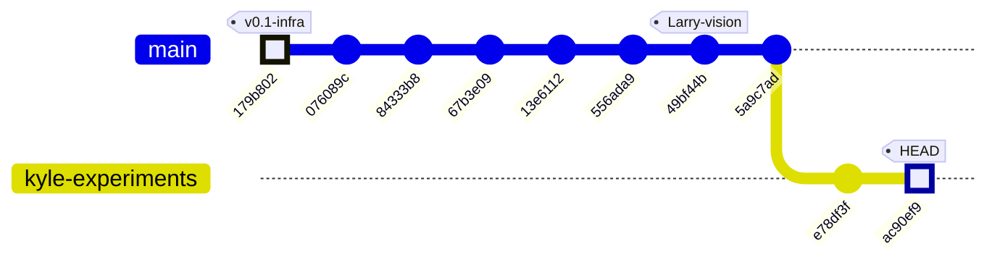
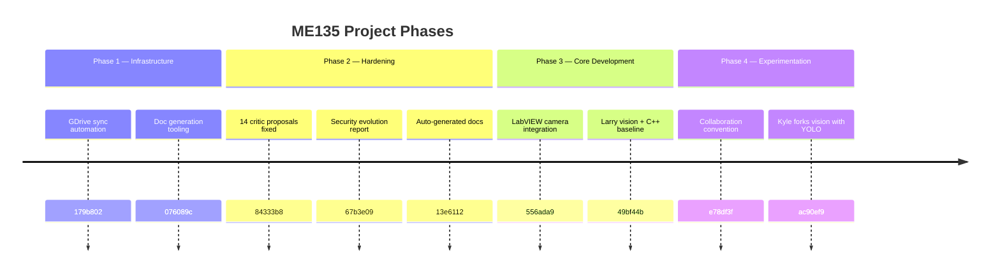

# ME135 Evolution Report

**Date:** 2026-04-30 22:33 &nbsp;|&nbsp; **Commit:** `ac90ef9`

---

## What Changed

## v2 — 2026-04-30 — Commits `179b802` → `ac90ef9`

This batch of commits traces a clear arc: **infrastructure fixes → systematic hardening → parallel CV experimentation**. The project now has two competing detection philosophies living side by side.

---

### CV Pipeline — Kyle forks vision with YOLOv8 (`ac90ef9`)

The most architecturally significant change. Kyle copied Larry's `vision.py` (snapshot at `49bf44b`) into `Kyle/vision/vision.py` and replaced the detection engine:

- **Detection method swap**: The canonical pipeline (`agent_outputs/cv_pipeline.py`) uses **MOG2 background subtraction** — a classical approach that needs a person-free calibration phase (200 frames) and degrades when the camera moves or lighting shifts. Kyle's fork uses **YOLOv8 instance segmentation** (`yolov8n-seg.pt`, the 6 MB nano model), which detects "person" (COCO class 0) with per-instance masks. **No calibration needed — works on frame one.**
- **Output resolution changed**: Canonical produces **400×300** (downsampled to 108×108 for the LED panel). Kyle outputs **64×64**, suggesting a different target resolution or lower-bandwidth experiment.
- **Multi-backend camera open**: `open_camera()` tries AVFoundation → V4L2 → generic, making the script portable across macOS and Linux. The canonical pipeline only calls `cv2.VideoCapture(device_index)`.
- **Interactive controls**: Pause/resume (SPACE), snapshot save (`s`), live confidence threshold tuning (`[`/`]`). The canonical `main.py` is a headless production loop with no interactive controls.
- **Morphological cleanup retained**: Both pipelines share the same noise-removal strategy — `MORPH_CLOSE` with a 5×5 elliptical kernel, contour-area filtering. Kyle's minimum area is 0.2% of frame area (relative); canonical uses a fixed 500 px² threshold.
- **No serial integration**: Kyle's script is purely visual (three `cv2.imshow` windows). It does not produce the bit-packed UART frames that the ESP32 expects. This is an experiment, not a replacement — yet.

**Why it matters**: If YOLO proves fast enough on the Jetson Orin Nano (~30 fps for the nano model), it could eliminate the fragile calibration step entirely, making the system robust to camera repositioning and lighting changes.

---

### Project Governance (`e78df3f`)

- **`CLAUDE.md` added**: Establishes a folder-based collaboration convention — Kyle and Larry each work in their own directory, preventing accidental overwrites. Claude (AI assistant) is acknowledged as co-author via `Co-Authored-By` trailers.

---

### Upstream Vision & C++ Code (`49bf44b`)

- **Larry's canonical vision pipeline and optimized C++ code landed**. This is the commit Kyle forked from — the production baseline with MOG2 detection, GPU-accelerated path, and full serial protocol integration.

---

### LabVIEW Camera Integration (`556ada9`)

- **LabVIEW camera monitoring code added**. Establishes the optional TCP dashboard path (config: `192.168.1.100:5020`) for system health monitoring alongside the primary CV→UART→LED pipeline.

---

### Hardening Sweep — 7-Agent Swarm (`84333b8`, `67b3e09`, `13e6112`)

- **14 critic proposals resolved** in a single systematic pass: security hardening, reliability fixes, and documentation improvements across all subsystems.
- **Evolution reports auto-generated** with a new `--bootstrap` mode and `override_features` bug fix in the doc generation tooling (`076089c`).

---

### Infrastructure Fixes (`179b802`)

- **rclone Google Drive config**: Non-interactive setup, auto-clears bad `client_id` entries. Fixes a first-run failure where stale OAuth credentials blocked automated sync.

---

### Two Parallel CV Philosophies Now Coexist

| Dimension | Canonical (`agent_outputs/`) | Kyle's Fork (`Kyle/vision/`) |
|---|---|---|
| Detection | Background subtraction (MOG2/KNN) | YOLOv8 instance segmentation |
| Calibration | Required (200 empty-scene frames) | None (model-based) |
| Output size | 400×300 → 108×108 | 64×64 |
| Hardware target | Jetson → ESP32 → LED panel | Standalone USB camera preview |
| Serial protocol | Full UART framing + CRC + ACK/NAK | Not integrated |
| Maturity | Production-ready | Experimental sandbox |

---

## Evolution Timeline

## Commit History — Infrastructure → Hardening → CV Experimentation

### Subsystem Map Per Commit

| Commit | Subsystems Touched | Summary |
|--------|--------------------|---------|
| `179b802` | 🔧 Setup / GDrive | Non-interactive rclone config, fix bad `client_id` |
| `076089c` | 📄 Docs tooling | `--bootstrap` mode for doc gen, `override_features` fix |
| `84333b8` | 🔧 All subsystems | 7-agent swarm resolves all 14 critic proposals (security + reliability) |
| `67b3e09` | 📄 Docs | v2 evolution report — security & reliability narrative |
| `13e6112` | 📄 Docs | Auto-generated evolution report `[skip ci]` |
| `556ada9` | 📷 LabVIEW | LabVIEW camera integration code added |
| `49bf44b` | 📷 CV / 🔌 ESP32 / ⚙️ C++ | Larry's vision code + optimized C++ — **the baseline Kyle forked** |
| `5a9c7ad` | 🔀 Merge | Merge remote `main` |
| `e78df3f` | 📜 Governance | `CLAUDE.md` — Kyle/Larry folder convention established |
| `ac90ef9` | 📷 CV Pipeline (Kyle) | YOLOv8 segmentation fork → `Kyle/vision/vision.py` |

### Phase Narrative

### What Comes Next?

The project has reached a **decision fork**: two detection strategies now compete in the repo. The next critical milestone will be either (a) Kyle proves YOLO is fast enough on the Jetson and integrates serial output, triggering a merge back into the canonical pipeline, or (b) background subtraction stays as the production path and Kyle's fork remains a research sandbox. The 64×64 output resolution in Kyle's script also hints at a possible second display target or bandwidth experiment that hasn't been discussed yet.

---

## Code Health Summary

**Overall Grade: B−**

The codebase demonstrates solid architecture — clean separation between CV pipeline, serial protocol, ESP32 firmware, and orchestration layers. Config-driven design via a single `config.yaml` is excellent. The serial protocol with CRC-16 and ACK/NAK flow control is well-specified.

**Critical issues** drag the grade down: (1) an import mismatch (`sync_to_drive` vs `sync_features_to_drive`) likely crashes the documentation agent at startup, (2) the ESP32 firmware spin-loops without `yield()` will trigger watchdog resets under normal operation, and (3) neither CV pipeline verifies the camera actually opened, making failures hard to diagnose.

**Design gaps**: `GPUPipeline` claims API-compatibility with `CVPipeline` but lacks `__enter__`/`__exit__`, and `main.py` doesn't use context managers, risking resource leaks. The serial sender doesn't flush stale bytes before writes, causing phantom NAKs.

Error handling within modules is mostly good; the gaps are at module boundaries and resource lifecycle management.

---

## Improvement Proposals

| # | Title | Priority | Risk | Files |
|---|-------|----------|------|-------|
| PROP-001 | Kyle's vision fork lacks serial protocol integration | nice-to-have | medium | `Kyle/vision/vision.py, agent_outputs/serial_protocol.py` |
| PROP-002 | Output resolution mismatch: 64×64 vs 108×108 panel | must-fix | medium | `Kyle/vision/vision.py, agent_outputs/serial_protocol.py` |
| PROP-003 | No shared interface contract between the two CV pipelines | future | low | `agent_outputs/cv_pipeline.py, Kyle/vision/vision.py, agent_outputs/main.py, agent_outputs/config.yaml` |
| PROP-004 | Canonical pipeline calibration is fragile and user-hostile | nice-to-have | low | `agent_outputs/main.py, agent_outputs/cv_pipeline.py` |
| PROP-005 | Kyle's vision.py is an orphan copy with no upstream tracking | nice-to-have | low | `Kyle/vision/vision.py` |
| PROP-01 | Camera open never verified in CVPipeline and GPUPipeline constructors | must-fix | medium | `agent_outputs/cv_pipeline.py, agent_outputs/gpu_accelerated.py` |
| PROP-02 | main.py does not use pipeline as context manager — camera leaks on exceptions | must-fix | medium | `agent_outputs/main.py, agent_outputs/gpu_accelerated.py` |
| PROP-03 | ESP32 receiveFrame() spin-loops without yield() — risks WDT reset | must-fix | high | `agent_outputs/esp32_main.cpp` |
| PROP-04 | Import mismatch: doc_agent.py imports sync_to_drive but gdrive_sync.py exports sync_features_to_drive | must-fix | high | `doc_agent.py, gdrive_sync.py` |
| PROP-05 | Pure-Python CRC-16 in serial hot path — ~10x slower than necessary | nice-to-have | low | `agent_outputs/serial_protocol.py, requirements.txt` |
| PROP-06 | ESP32 firmware declares unused 1,466-byte rxBuffer — wastes scarce RAM | nice-to-have | low | `agent_outputs/esp32_main.cpp` |
| PROP-07 | serial_protocol.py: no serial flush before write — stale bytes cause CRC/sync failures | must-fix | medium | `agent_outputs/serial_protocol.py` |
| PROP-08 | GPUPipeline missing __enter__/__exit__ — inconsistent API with CVPipeline | nice-to-have | low | `agent_outputs/gpu_accelerated.py, agent_outputs/cv_pipeline.py` |

### PROP-001: Kyle's vision fork lacks serial protocol integration
**Priority:** nice-to-have &nbsp;|&nbsp; **Risk:** medium

**Problem:** Kyle/vision/vision.py outputs to cv2.imshow windows only. It produces a 64×64 binary matrix but has no code to bit-pack it, frame it, or send it over UART to the ESP32. The experiment cannot drive the LED panel without this integration.

**Proposed fix:** Add an optional --serial flag that imports serial_protocol.py, adapts pack_matrix() to accept 64×64 input (or changes output to 108×108 to match the panel), and transmits frames using the existing SerialSender class. This keeps the script usable as a standalone preview while enabling end-to-end testing.

**Affected files:** Kyle/vision/vision.py, agent_outputs/serial_protocol.py

---

### PROP-002: Output resolution mismatch: 64×64 vs 108×108 panel
**Priority:** must-fix &nbsp;|&nbsp; **Risk:** medium

**Problem:** Kyle's fork produces a 64×64 binary matrix, but the LED panel is 108×108 (11,664 pixels). The serial protocol's pack_matrix() only accepts (300,400) or (108,108) shapes and will raise ValueError on (64,64). If this fork is ever integrated, the resolution mismatch will cause a runtime crash.

**Proposed fix:** Either change Kyle's output to 108×108 to match the physical panel, or extend pack_matrix() in serial_protocol.py to accept arbitrary input sizes and resize to (108,108) internally. Document the rationale for 64×64 if it's intentional (e.g., a different display target).

**Affected files:** Kyle/vision/vision.py, agent_outputs/serial_protocol.py

---

### PROP-003: No shared interface contract between the two CV pipelines
**Priority:** future &nbsp;|&nbsp; **Risk:** low

**Problem:** The canonical CVPipeline class and Kyle's YOLO script have no shared base class or interface. CVPipeline exposes calibrate()/process_frame()/release(); Kyle's script is a standalone main() loop. If the team wants to A/B test or swap detection backends, there's no plug-and-play mechanism — main.py would need significant rewiring.

**Proposed fix:** Define a minimal abstract base class (e.g., DetectionBackend with process_frame() → binary_matrix) that both CVPipeline and a new YOLOPipeline class implement. Update main.py to select the backend via config.yaml (method: 'mog2' | 'yolo'). This makes swapping detection strategies a one-line config change.

**Affected files:** agent_outputs/cv_pipeline.py, Kyle/vision/vision.py, agent_outputs/main.py, agent_outputs/config.yaml

---

### PROP-004: Canonical pipeline calibration is fragile and user-hostile
**Priority:** nice-to-have &nbsp;|&nbsp; **Risk:** low

**Problem:** main.py requires an interactive 'Press Enter' prompt followed by a 10-second countdown for the user to leave the frame. This blocks automated testing, CI, and headless deployment. If the camera is bumped post-calibration, the entire background model is invalidated with no recovery path except restarting the process.

**Proposed fix:** Add a --skip-calibration flag for testing. Implement automatic re-calibration when the foreground overflow warning (>60% lit pixels) fires for N consecutive frames — the code already detects this condition but only logs a warning. Alternatively, adopting Kyle's YOLO approach eliminates the calibration requirement entirely.

**Affected files:** agent_outputs/main.py, agent_outputs/cv_pipeline.py

---

### PROP-005: Kyle's vision.py is an orphan copy with no upstream tracking
**Priority:** nice-to-have &nbsp;|&nbsp; **Risk:** low

**Problem:** The commit message says 'pristine copy of Larry/vision.py @ 49bf44b', but there's no mechanism to track divergence from the original. As both files evolve independently, useful improvements in either branch (e.g., a better morphological filter, a camera-open fix) won't propagate to the other without manual diffing.

**Proposed fix:** Add a comment header in Kyle/vision/vision.py noting the upstream commit hash and date. Periodically (e.g., weekly) run a diff between the two files and document divergence in the evolution report. Long-term, the abstract backend proposal (PROP-003) makes this a non-issue by sharing common infrastructure.

**Affected files:** Kyle/vision/vision.py

---

### PROP-01: Camera open never verified in CVPipeline and GPUPipeline constructors
**Priority:** must-fix &nbsp;|&nbsp; **Risk:** medium

**Problem:** Both `CVPipeline.__init__` and `GPUPipeline.__init__` call `cv2.VideoCapture(device_index)` but never check `self.cap.isOpened()`. If the camera device is missing, disconnected, or busy, `VideoCapture()` silently returns a non-functional object. Every subsequent `cap.read()` returns `(False, None)`, causing `calibrate()` to raise a misleading 'Camera read failed during calibration' RuntimeError instead of reporting the real cause. In the main loop, the system would log-spam warnings forever without ever diagnosing the root cause.

**Proposed fix:** Immediately after `cv2.VideoCapture(...)`, add: `if not self.cap.isOpened(): raise RuntimeError(f"Failed to open camera device {cam_cfg['device_index']}. Check /dev/video* and gspca_ov534 driver.")`. Apply the same check in both `cv_pipeline.py` and `gpu_accelerated.py`.

**Affected files:** agent_outputs/cv_pipeline.py, agent_outputs/gpu_accelerated.py

---

### PROP-02: main.py does not use pipeline as context manager — camera leaks on exceptions
**Priority:** must-fix &nbsp;|&nbsp; **Risk:** medium

**Problem:** In `main.py:main()`, the pipeline is created with `pipeline = GPUPipeline(config)` (or CVPipeline), and `pipeline.release()` is only called at the very end of the function. If any exception is raised during `calibrate()`, the live loop, or even the `input()` prompt (e.g. EOFError in headless mode), the camera file descriptor is leaked. CVPipeline already implements `__enter__`/`__exit__` context manager protocol but it's never used.

**Proposed fix:** Wrap the pipeline lifecycle in a `with` block: `with GPUPipeline(config) as pipeline:` (or CVPipeline). Also add `__enter__`/`__exit__` to GPUPipeline (currently missing — only CVPipeline has it). Additionally, wrap the serial sender's `close()` in a `try/finally` block.

**Affected files:** agent_outputs/main.py, agent_outputs/gpu_accelerated.py

---

### PROP-03: ESP32 receiveFrame() spin-loops without yield() — risks WDT reset
**Priority:** must-fix &nbsp;|&nbsp; **Risk:** high

**Problem:** In `esp32_main.cpp`, `receiveFrame()` has three tight `while` loops that spin on `JetsonSerial.available()` without calling `yield()`, `delay(1)`, or `vTaskDelay()`. On ESP32 (FreeRTOS), the idle task must run periodically to feed the hardware watchdog timer (WDT). A spin loop that blocks for up to `WATCHDOG_TIMEOUT_MS` (5000 ms) will trigger a Task Watchdog panic reset, crashing the firmware. This is particularly dangerous in the start-marker sync loop where the Jetson may not be sending data yet.

**Proposed fix:** Add `yield();` (or `delay(1);`) inside each spin-wait loop body in `receiveFrame()`. Specifically: (1) the start-marker loop after checking `JetsonSerial.available()`, (2) the payload read loop's else-branch, and (3) the tail read loop's else-branch. This lets the RTOS scheduler feed the WDT.

**Affected files:** agent_outputs/esp32_main.cpp

---

### PROP-04: Import mismatch: doc_agent.py imports sync_to_drive but gdrive_sync.py exports sync_features_to_drive
**Priority:** must-fix &nbsp;|&nbsp; **Risk:** high

**Problem:** In `doc_agent.py` line 18: `from gdrive_sync import sync_to_drive, detect_features, get_changed_files`. However, `gdrive_sync.py` defines the function as `sync_features_to_drive()`, not `sync_to_drive()`. Unless there's an alias at the very end of the truncated file, this is an `ImportError` that will crash `doc_agent.py` on startup, preventing all documentation generation and drive sync.

**Proposed fix:** Either (a) rename `sync_features_to_drive` to `sync_to_drive` in `gdrive_sync.py`, or (b) add `sync_to_drive = sync_features_to_drive` as an alias at module level, or (c) update the import in `doc_agent.py` to `from gdrive_sync import sync_features_to_drive as sync_to_drive`. Option (a) is cleanest.

**Affected files:** doc_agent.py, gdrive_sync.py

---

### PROP-05: Pure-Python CRC-16 in serial hot path — ~10x slower than necessary
**Priority:** nice-to-have &nbsp;|&nbsp; **Risk:** low

**Problem:** In `serial_protocol.py`, `crc16_ccitt()` is a byte-at-a-time pure-Python implementation iterating over 1,458 bytes per frame. At 10 fps target, this runs 10 times/second. Python byte-loop CRCs are roughly 10-50x slower than C implementations. On a Jetson Nano (weaker CPU), this adds measurable latency to each frame's serial path. The same CRC function is also the only validation on the ESP32 side — correctness is critical.

**Proposed fix:** Replace the hand-rolled CRC with `crcmod.predefined.mkCrcFun('crc-ccitt-false')` from the `crcmod` package (C-accelerated), or use `binascii.crc_hqx(data, 0xFFFF)` which is a CPython built-in that computes CRC-CCITT. Add `crcmod` to `requirements.txt` if using the first option. Keep the pure-Python version as a fallback with a try/except import.

**Affected files:** agent_outputs/serial_protocol.py, requirements.txt

---

### PROP-06: ESP32 firmware declares unused 1,466-byte rxBuffer — wastes scarce RAM
**Priority:** nice-to-have &nbsp;|&nbsp; **Risk:** low

**Problem:** In `esp32_main.cpp`, `static uint8_t rxBuffer[FRAME_TOTAL_SIZE]` (1,466 bytes) is declared globally but is never read from or written to anywhere in the code. The `receiveFrame()` function reads directly into the separate `payload[]` buffer and local `tail[]` array. On ESP32 with ~320 KB available SRAM, 1.4 KB of dead allocation is non-trivial, especially alongside the 11,664-pixel NeoPixel buffer (~35 KB).

**Proposed fix:** Remove the `static uint8_t rxBuffer[FRAME_TOTAL_SIZE];` declaration entirely. No other code references it.

**Affected files:** agent_outputs/esp32_main.cpp

---

### PROP-07: serial_protocol.py: no serial flush before write — stale bytes cause CRC/sync failures
**Priority:** must-fix &nbsp;|&nbsp; **Risk:** medium

**Problem:** In `SerialSender.send_frame()`, `self._ser.write(packet)` is called without first flushing the input buffer. If a previous NAK response or spurious noise left bytes in the OS receive buffer, `_wait_ack()` will read stale bytes instead of the actual ACK/NAK for the current frame. This causes phantom NAKs and unnecessary retransmissions. After max retries, a frame that the ESP32 actually received correctly is reported as failed.

**Proposed fix:** Add `self._ser.reset_input_buffer()` immediately before `self._ser.write(packet)` in the retry loop inside `send_frame()`. This discards any stale bytes from previous interactions before each transmission attempt.

**Affected files:** agent_outputs/serial_protocol.py

---

### PROP-08: GPUPipeline missing __enter__/__exit__ — inconsistent API with CVPipeline
**Priority:** nice-to-have &nbsp;|&nbsp; **Risk:** low

**Problem:** CVPipeline implements `__enter__` and `__exit__` for use as a context manager, but GPUPipeline (its documented drop-in replacement) does not. The docstring claims 'identical API' but the context manager protocol is missing. This means `with GPUPipeline(config) as p:` would fail with `AttributeError: __enter__`, breaking the substitution guarantee and preventing PROP-02's fix from working with the GPU path.

**Proposed fix:** Add `__enter__` and `__exit__` methods to `GPUPipeline` identical to those in `CVPipeline`. Better yet, extract a shared `BasePipeline` class with camera setup, context manager, and `release()` — both pipelines duplicate this code.

**Affected files:** agent_outputs/gpu_accelerated.py, agent_outputs/cv_pipeline.py

---
