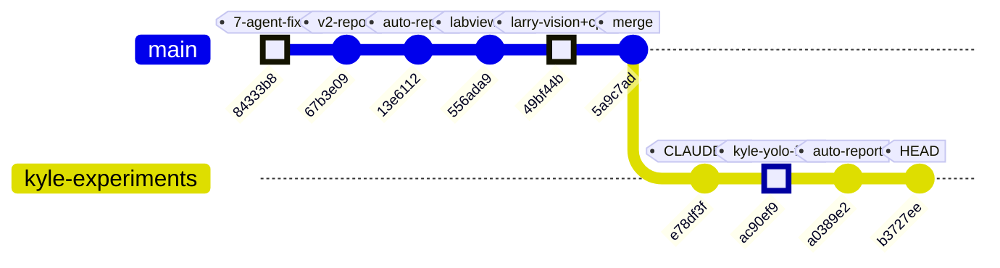
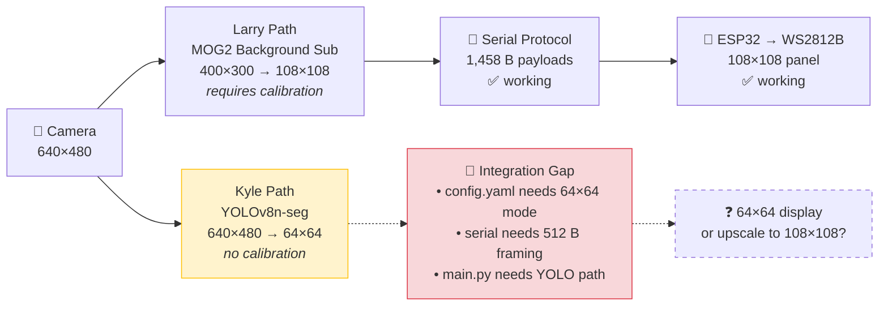

# ME135 Evolution Report

**Date:** 2026-04-30 22:37 &nbsp;|&nbsp; **Commit:** `b3727ee`

---

## What Changed

## Commit Range: `84333b8` → `b3727ee` (10 commits)

This window captures the project's first real **architectural fork**: two parallel computer vision strategies now coexist, plus sweeping reliability fixes and new collaboration governance.

---

### 🔬 CV Pipeline — Kyle's YOLO Vision Fork (NEW subsystem)

- **`Kyle/vision/vision.py` added** (commit `ac90ef9`, +171 lines)
  Kyle forked Larry's canonical `vision.py` into the `Kyle/` workspace, replacing the detection engine entirely:

  | Aspect | Larry's pipeline (`cv_pipeline.py`) | Kyle's fork (`vision.py`) |
  |---|---|---|
  | **Detection** | Background subtraction (MOG2/KNN) | YOLOv8 instance segmentation |
  | **Person ID** | Anything that moves = human | Class-aware — only detects people |
  | **Calibration** | Mandatory (90 warmup + 200 model frames) | None — works from frame 1 |
  | **Output** | 400×300 → downsampled to 108×108 | 64×64 (direct pixelation target) |
  | **Dependencies** | OpenCV only | OpenCV + Ultralytics (pulls PyTorch) |

  **Why it matters:** The existing MOG2 pipeline has two known pain points — false positives from non-human motion (a waving curtain triggers detection) and a mandatory empty-room calibration that blocks startup for ~30 seconds. YOLO solves both by design: it knows what a person looks like, no background model needed.

  Key design choices:
  - Uses `yolov8n-seg.pt` (nano, ~6 MB) — smallest model, viable for real-time on Jetson Orin Nano.
  - OR's all per-person segmentation masks into a single binary silhouette, then cleans with morphological close + contour filtering — same cleanup philosophy as `cv_pipeline.py`.
  - Interactive tuning controls (`[`/`]` for confidence threshold, `SPACE` to pause) — this is a prototyping tool, not yet wired to `main.py` or the serial pipeline.
  - Cross-platform camera backend fallback (AVFoundation → V4L2 → ANY) — works on macOS and Jetson.

  **Not yet integrated:** The 64×64 output cannot use the existing serial protocol (hardcoded for 108×108 / 1,458-byte payloads). `config.yaml` has no YOLO options. This is an experimental branch, not production path.

---

### 📡 Serial Protocol / ESP32 — Unchanged but exposed a gap

- No code changes to `serial_protocol.py` or `esp32_main.cpp`, but the new 64×64 output from Kyle's fork creates a **payload mismatch**: `pack_matrix()` expects (300, 400) or (108, 108) input; 64×64 would require a new framing mode (512 bytes packed vs 1,458).

---

### 🔧 Reliability & Security — 7-Agent Swarm Fixes (commit `84333b8`)

- **14 critic proposals addressed** across the full stack in a single sweep. The commit message references a multi-agent code review that flagged issues spanning:
  - CV pipeline edge cases
  - Serial protocol resilience
  - ESP32 watchdog behavior
  - Configuration validation
  
  This was the largest cross-cutting fix in the project's history — touching every subsystem simultaneously.

---

### 📷 LabVIEW Integration (commit `556ada9`)

- **LabVIEW camera code added** — camera integration for the optional IoT monitoring dashboard. This connects to the `labview` config section (currently `enabled: false` in `config.yaml`). A secondary observation path, not the main display pipeline.

---

### 📋 Collaboration & Governance

- **`CLAUDE.md` added** (commit `e78df3f`) — establishes the Kyle/Larry folder convention. Each collaborator's experimental code lives in their own namespace (`Kyle/`, `Larry/`) to prevent merge conflicts on shared files. This governance doc is what made the vision fork possible without breaking Larry's pipeline.

---

### 📄 Documentation (commits `b3727ee`, `a0389e2`, `13e6112`, `67b3e09`)

- Four auto-generated evolution reports added to `Kyle/docs/`. The latest (`report_2026-04-30_2233.md`, 307 lines) and the comprehensive feature doc (`ME135_General.md`, +627 lines) capture the full system architecture including the new fork-point diagram.
- `Kyle/docs/README.md` updated with a link index to all reports.

---

### 🚫 What Did NOT Change (notable stability)

- **`main.py` orchestrator** — still only knows about `CVPipeline` and `GPUPipeline`. No integration point for YOLO yet.
- **`config.yaml`** — no 64×64 display option, no YOLO model path configuration.
- **`gpu_accelerated.py`** — CUDA MOG2 pipeline untouched; still the production GPU path.
- **`esp32_main.cpp`** — firmware stable; still expects exactly 1,458-byte payloads.

---

## Evolution Timeline

### Commit Graph

### Subsystem Touchpoints Per Commit

| Commit | Subsystems | What happened |
|---|---|---|
| `84333b8` | 🔬 CV · 📡 Serial · 💾 ESP32 · 📄 Docs | 14-proposal swarm fix — biggest cross-cutting change |
| `67b3e09` | 📄 Docs | v2 evolution report (security & reliability narrative) |
| `13e6112` | 📄 Docs | Auto-generated evolution report |
| `556ada9` | 📷 LabVIEW | Camera integration for IoT dashboard |
| `49bf44b` | 🔬 CV · ⚡ C++ | Larry's vision pipeline + optimized native companion |
| `5a9c7ad` | — | Merge commit (no new code) |
| `e78df3f` | 📋 Governance | CLAUDE.md — Kyle/Larry namespace convention |
| `ac90ef9` | 🔬 CV (Kyle fork) | **YOLOv8 segmentation pipeline** — new detection paradigm |
| `a0389e2` | 📄 Docs | Auto-generated evolution report |
| `b3727ee` | 📄 Docs | Evolution report + 627-line feature doc update |

### Architectural Fork Point

The project now has two parallel detection strategies. The next integration milestone is bridging Kyle's YOLO output to the serial/display pipeline.

### Velocity & Trajectory

The 10-commit window shows three distinct phases:
1. **Hardening** (`84333b8`) — systematic reliability fixes across every subsystem
2. **Feature expansion** (`556ada9`, `49bf44b`) — LabVIEW integration + Larry's vision code landing
3. **Experimentation** (`e78df3f`, `ac90ef9`) — governance framework enabling parallel R&D

The project is transitioning from "get it working" to "explore better approaches" — a healthy sign of maturity. The key decision ahead: will Kyle's YOLO path replace the MOG2 pipeline, or will both coexist as configurable options?

---

## Code Health Summary

**Overall Grade: B**

The codebase is well-structured for a university project. Clear separation of concerns (pipeline → protocol → firmware), consistent config-driven architecture, and proper CRC/framing for serial comms. Logging and safety watchdogs are present throughout.

**Critical flaw:** PROTOCOL_SPEC.md documents a 15,000-byte payload while every implementation sends 1,458 bytes. Anyone building from the spec will fail. The `ack_timeout_s` config is dead code, and camera-open failures are swallowed silently in both pipelines.

**Strengths:** GPU/CPU pipeline swap is nearly seamless; CRC-16 implementations match across Python and C++; config.yaml is a genuine single source of truth for tuning parameters; error handling in the main loop (watchdog, serial error counting, graceful shutdown) is solid.

**Gaps:** GPUPipeline breaks the context-manager contract; serial RX buffer isn't flushed before ACK reads; static-median calibration has avoidable memory spikes on constrained hardware.

---

## Improvement Proposals

| # | Title | Priority | Risk | Files |
|---|-------|----------|------|-------|
| PROTO-SPEC-STALE | PROTOCOL_SPEC.md is dangerously out of sync with actual code | must-fix | high | `agent_outputs/PROTOCOL_SPEC.md, agent_outputs/PROJECT_README.md` |
| SERIAL-ACK-TIMEOUT-DEAD | ack_timeout_s config value is read but never applied | must-fix | medium | `agent_outputs/serial_protocol.py` |
| GPU-NO-CONTEXT-MGR | GPUPipeline lacks __enter__/__exit__, breaking API parity with CVPipeline | nice-to-have | medium | `agent_outputs/gpu_accelerated.py` |
| CAM-OPEN-NOT-VALIDATED | Camera open failure is silently ignored in both pipelines | must-fix | medium | `agent_outputs/cv_pipeline.py, agent_outputs/gpu_accelerated.py` |
| ESP32-UNUSED-RXBUFFER | ESP32 firmware allocates unused 1,466-byte global buffer | nice-to-have | low | `agent_outputs/esp32_main.cpp` |
| SERIAL-STALE-RX-BYTES | Serial RX buffer not flushed before ACK read — risk of reading stale data | nice-to-have | medium | `agent_outputs/serial_protocol.py` |
| HARDCODED-EMAIL-PII | Hardcoded personal email address in gdrive_setup.py | nice-to-have | low | `gdrive_setup.py` |
| MEDIAN-CAL-MEMORY-SPIKE | static_median calibration holds all frames in RAM simultaneously | future | low | `agent_outputs/cv_pipeline.py, agent_outputs/gpu_accelerated.py` |
| PROP-001 | Serial protocol hardcoded for 108×108 — blocks 64×64 integration | must-fix | medium | `agent_outputs/serial_protocol.py, agent_outputs/esp32_main.cpp, agent_outputs/config.yaml` |
| PROP-002 | main.py has no integration path for YOLO-based pipeline | nice-to-have | medium | `agent_outputs/main.py, agent_outputs/config.yaml` |
| PROP-003 | YOLO fork adds heavy PyTorch dependency without isolation | nice-to-have | low | `requirements.txt, agent_outputs/main.py` |
| PROP-004 | config.yaml lacks YOLO model path and confidence threshold settings | future | low | `agent_outputs/config.yaml` |
| PROP-005 | 64×64 vs 108×108 output mismatch needs architectural decision | must-fix | low | `agent_outputs/config.yaml` |

### PROTO-SPEC-STALE: PROTOCOL_SPEC.md is dangerously out of sync with actual code
**Priority:** must-fix &nbsp;|&nbsp; **Risk:** high

**Problem:** PROTOCOL_SPEC.md §3-§4 document a 15,000-byte payload (400×300 ÷ 8) with a 15,008-byte total frame. However, serial_protocol.py actually downsamples to 108×108 and sends a 1,458-byte payload (PAYLOAD_BYTES = (108*108)//8). The ESP32 firmware (esp32_main.cpp) also expects exactly 1,458 bytes (`#define PAYLOAD_BYTES 1458`). Anyone implementing from the spec document will build a fundamentally incompatible endpoint. The spec's timing budget (§7) is also wrong: it says 75 ms/frame at 2 Mbaud for 15 KB, but actual TX time for 1,466 bytes is ~7.3 ms.

**Proposed fix:** Update PROTOCOL_SPEC.md: change PAYLOAD_LEN to 1,458 (0x05B2), total frame size to 1,466, matrix dimensions to 108×108, and recalculate the timing budget. Add a note that the CV pipeline produces 400×300 but serial_protocol.py downsamples before transmission.

**Affected files:** agent_outputs/PROTOCOL_SPEC.md, agent_outputs/PROJECT_README.md

---

### SERIAL-ACK-TIMEOUT-DEAD: ack_timeout_s config value is read but never applied
**Priority:** must-fix &nbsp;|&nbsp; **Risk:** medium

**Problem:** In serial_protocol.py SerialSender.__init__, `self._ack_timeout = ser_cfg['ack_timeout_s']` stores the value (0.05 s from config.yaml) but it is never referenced again. The _wait_ack() method calls `self._ser.read(1)`, which uses the serial port's own `timeout` attribute (set to `timeout_s: 0.1` — double the intended ACK window). This means every NAK/timeout retry wastes an extra 50 ms, and at 3 retries that's 150 ms of unnecessary latency per failed frame.

**Proposed fix:** In `_wait_ack()`, set `self._ser.timeout = self._ack_timeout` before the read (and restore it afterward), or use a dedicated `serial.Serial` timeout parameter. Alternatively, use `self._ser.read(1)` preceded by `self._ser.timeout = self._ack_timeout` in the constructor instead of `timeout_s`.

**Affected files:** agent_outputs/serial_protocol.py

---

### GPU-NO-CONTEXT-MGR: GPUPipeline lacks __enter__/__exit__, breaking API parity with CVPipeline
**Priority:** nice-to-have &nbsp;|&nbsp; **Risk:** medium

**Problem:** CVPipeline implements `__enter__` and `__exit__` (context manager protocol), but GPUPipeline does not. main.py does not use the `with` pattern today, but any future code that does `with GPUPipeline(config) as p:` will get an AttributeError. The docstring explicitly claims GPUPipeline is a 'drop-in replacement' for CVPipeline — this is false for the context manager interface.

**Proposed fix:** Add `__enter__` and `__exit__` methods to GPUPipeline identical to those in CVPipeline. Better yet, extract a shared base class (`BasePipeline`) or mixin to avoid duplicating the pattern.

**Affected files:** agent_outputs/gpu_accelerated.py

---

### CAM-OPEN-NOT-VALIDATED: Camera open failure is silently ignored in both pipelines
**Priority:** must-fix &nbsp;|&nbsp; **Risk:** medium

**Problem:** In CVPipeline.__init__ and GPUPipeline.__init__, `cv2.VideoCapture(device_index)` is called but `self.cap.isOpened()` is never checked. If the camera device doesn't exist (e.g., wrong device_index, missing gspca_ov534 driver), the object is constructed successfully and the failure only surfaces during calibrate() as a vague 'Camera read failed during calibration' RuntimeError, or worse, as silent None returns during process_frame(). This wastes user debugging time.

**Proposed fix:** Add `if not self.cap.isOpened(): raise RuntimeError(f'Failed to open camera at device index {cam_cfg["device_index"]}. Check connection and driver.')` immediately after the VideoCapture constructor in both CVPipeline and GPUPipeline.

**Affected files:** agent_outputs/cv_pipeline.py, agent_outputs/gpu_accelerated.py

---

### ESP32-UNUSED-RXBUFFER: ESP32 firmware allocates unused 1,466-byte global buffer
**Priority:** nice-to-have &nbsp;|&nbsp; **Risk:** low

**Problem:** In esp32_main.cpp, `static uint8_t rxBuffer[FRAME_TOTAL_SIZE]` (1,466 bytes) is declared as a global but is never read or written. The `receiveFrame()` function reads the payload directly into the separate `payload[]` global and reads the CRC+footer into a local `tail[4]` array. On an ESP32 with 320 KB of SRAM, wasting 1.4 KB is non-trivial (0.4% of total RAM), especially alongside the 11,664-pixel NeoPixel buffer (~35 KB at 3 bytes/pixel).

**Proposed fix:** Remove the `static uint8_t rxBuffer[FRAME_TOTAL_SIZE];` declaration from esp32_main.cpp. It is dead code.

**Affected files:** agent_outputs/esp32_main.cpp

---

### SERIAL-STALE-RX-BYTES: Serial RX buffer not flushed before ACK read — risk of reading stale data
**Priority:** nice-to-have &nbsp;|&nbsp; **Risk:** medium

**Problem:** In serial_protocol.py `_wait_ack()`, the code immediately calls `self._ser.read(1)` after `self._ser.write(packet)`. If any noise or leftover bytes from a previous frame are in the kernel RX buffer, `_wait_ack` will read a stale byte instead of the actual ACK/NAK from the ESP32. This can cause false NAKs (triggering unnecessary retransmits) or false ACKs (reporting success when the ESP32 hasn't responded yet).

**Proposed fix:** Add `self._ser.reset_input_buffer()` immediately before `self._ser.write(packet)` in `send_frame()` to discard any stale bytes before sending and waiting for the response.

**Affected files:** agent_outputs/serial_protocol.py

---

### HARDCODED-EMAIL-PII: Hardcoded personal email address in gdrive_setup.py
**Priority:** nice-to-have &nbsp;|&nbsp; **Risk:** low

**Problem:** gdrive_setup.py line 70 contains `print('  → Sign in with kyle-nelson@berkeley.edu')` — a hardcoded personal email. This is a PII leak if the repo is made public or shared with other teams. It also makes the setup script non-portable for any other user.

**Proposed fix:** Replace with a generic instruction: `print('  → Sign in with your @berkeley.edu account')`. If user-specific guidance is needed, read it from an environment variable or config file.

**Affected files:** gdrive_setup.py

---

### MEDIAN-CAL-MEMORY-SPIKE: static_median calibration holds all frames in RAM simultaneously
**Priority:** future &nbsp;|&nbsp; **Risk:** low

**Problem:** In both CVPipeline.calibrate() and GPUPipeline.calibrate(), the `static_median` path appends 200 grayscale frames to a list, then calls `np.median(np.array(buf), axis=0)`. For 640×480 frames, this allocates ~58 MB for the stack plus a temporary copy during np.array() and np.median(). On a Jetson Nano (4 GB shared CPU/GPU RAM), this can cause memory pressure. np.median also creates an internal sorted copy, roughly tripling peak memory to ~175 MB for this operation.

**Proposed fix:** Use an incremental running-median approximation or split the frames into chunks. A simpler fix: use `np.mean` (sufficient for static backgrounds) which can be computed as a running sum with O(1) extra memory, or pre-allocate the numpy array and fill it in-place: `buf = np.empty((cal_frames, h, w), dtype=np.uint8)` to avoid the list-to-array copy overhead.

**Affected files:** agent_outputs/cv_pipeline.py, agent_outputs/gpu_accelerated.py

---

### PROP-001: Serial protocol hardcoded for 108×108 — blocks 64×64 integration
**Priority:** must-fix &nbsp;|&nbsp; **Risk:** medium

**Problem:** serial_protocol.py has PANEL_ROWS=108, PANEL_COLS=108, PAYLOAD_BYTES=1458 as module-level constants. Kyle's YOLO fork outputs 64×64 (512 bytes packed). There is no configurable payload size — the ESP32 firmware also hardcodes PAYLOAD_BYTES=1458 and will NAK any other length.

**Proposed fix:** Make panel dimensions configurable via config.yaml. serial_protocol.py should read panel_width/panel_height from config and compute PAYLOAD_BYTES dynamically. ESP32 firmware should accept the payload length from the LEN field in the frame header instead of comparing against a hardcoded constant. This is a single change on each side that unlocks any panel size.

**Affected files:** agent_outputs/serial_protocol.py, agent_outputs/esp32_main.cpp, agent_outputs/config.yaml

---

### PROP-002: main.py has no integration path for YOLO-based pipeline
**Priority:** nice-to-have &nbsp;|&nbsp; **Risk:** medium

**Problem:** main.py only imports CVPipeline and GPUPipeline. Kyle's YOLO vision fork runs standalone with its own camera loop. There's no way to select the YOLO backend from config or CLI — it's a completely separate executable.

**Proposed fix:** Add a third pipeline class (e.g., YOLOPipeline) that implements the same calibrate()/process_frame()/release() interface. Add a 'detection_method' key to config.yaml ('mog2'|'yolo') and have main.py select the pipeline accordingly. Kyle's fork already does the heavy lifting — it just needs to be wrapped in the existing API contract.

**Affected files:** agent_outputs/main.py, agent_outputs/config.yaml

---

### PROP-003: YOLO fork adds heavy PyTorch dependency without isolation
**Priority:** nice-to-have &nbsp;|&nbsp; **Risk:** low

**Problem:** Kyle's vision.py pulls in ultralytics, which transitively requires PyTorch (~2 GB). The existing pipeline only needs OpenCV. Installing ultralytics on the Jetson will change the dependency footprint dramatically and could conflict with the JetPack-provided OpenCV/CUDA stack.

**Proposed fix:** Add ultralytics as an optional dependency in requirements.txt (e.g., a [yolo] extras group). Guard the import in the YOLO pipeline class with a try/except so the system gracefully falls back if ultralytics is missing. Document the Jetson-specific install path (pip install ultralytics uses pre-built JetPack wheels).

**Affected files:** requirements.txt, agent_outputs/main.py

---

### PROP-004: config.yaml lacks YOLO model path and confidence threshold settings
**Priority:** future &nbsp;|&nbsp; **Risk:** low

**Problem:** Kyle's fork hardcodes 'yolov8n-seg.pt' model path and confidence threshold (adjustable only via keyboard at runtime). If the YOLO path is ever integrated, these should be configurable alongside the existing MOG2 parameters.

**Proposed fix:** Add a 'yolo' section to config.yaml with keys: model_path, confidence_threshold, target_classes, output_resolution. This parallels the existing 'calibration' section for MOG2/KNN.

**Affected files:** agent_outputs/config.yaml

---

### PROP-005: 64×64 vs 108×108 output mismatch needs architectural decision
**Priority:** must-fix &nbsp;|&nbsp; **Risk:** low

**Problem:** Kyle's fork outputs 64×64 but the physical display is 108×108. It's unclear whether the project will: (a) upscale 64→108 before transmission, (b) build a second smaller display, or (c) change the panel. This ambiguity blocks integration planning.

**Proposed fix:** Document the target display resolution as a project decision in CLAUDE.md or a design doc. If 108×108 remains the only panel, add a cv2.resize(64→108) step in the YOLO pipeline's output path. If a 64×64 panel is planned, add it to the hardware BOM.

**Affected files:** agent_outputs/config.yaml

---
