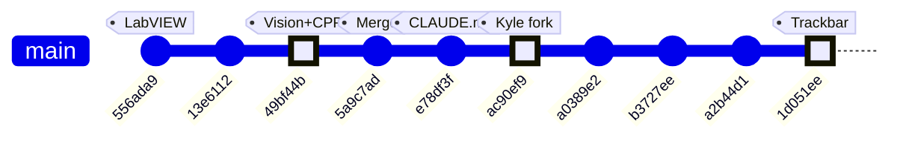

# ME135 Evolution Report

**Date:** 2026-04-30 23:05 &nbsp;|&nbsp; **Commit:** `1d051ee`

---

## What Changed

## Commit `1d051ee` — Kyle's Vision: Confidence Slider Replaces Keyboard Controls

**Subsystem: Kyle/vision (YOLO-based CV experiment)**

- **Replaced `[` / `]` keyboard shortcuts with a GUI trackbar slider** (`Kyle/vision/vision.py`).
  The old workflow required the user to tap bracket keys to nudge the YOLO confidence threshold by ±5%. The new approach adds a draggable "Conf %" trackbar directly on the "camera + contours" OpenCV window (range 5–95%, default 40%).
  - *Why it matters:* A trackbar gives immediate visual feedback of the current value, eliminates the need to remember keyboard shortcuts, and mirrors the pattern already used in `dissipation.py` — keeping the codebase idiomatically consistent.

- **Confidence variable moved from top-of-loop constant to per-frame read.**
  Previously `confidence = 0.40` was set once before the loop and mutated by key events. Now the value is read fresh each frame via `cv2.getTrackbarPos("Conf %", preview_win) / 100.0`, right before `model.predict()`.
  - *Why it matters:* The slider is the single source of truth for confidence — no mutable state to drift out of sync with the UI.

- **Window name extracted into `preview_win` variable.**
  The string `"camera + contours"` was hardcoded in two places (`cv2.imshow` and the implicit `namedWindow`). It now lives in a single `preview_win` local, reducing copy-paste risk.

- **Docstring controls table updated** to document the trackbar instead of the removed `[ / ]` keys, and column alignment was cleaned up.

**Subsystem: Docs (auto-generated)**

- Three auto-generated evolution report commits (`a0389e2`, `b3727ee`, `a2b44d1`) were produced by the CI doc agent — no human-authored content changes.

**Earlier context (from recent history, outside this diff window):**

| Commit | Subsystem | Summary |
|--------|-----------|---------|
| `ac90ef9` | Kyle/vision | Forked `Larry/vision.py` into Kyle's workspace for independent YOLO experiments |
| `e78df3f` | Docs | Added `CLAUDE.md` establishing Kyle/Larry collaboration conventions |
| `49bf44b` | Shared/vision + ESP32 | New vision code and optimized C++ firmware |
| `556ada9` | LabVIEW | LabVIEW camera integration code added |

---

## Evolution Timeline

### Subsystem Touch Map

| Commit | CV Pipeline | Kyle/vision | ESP32 / C++ | LabVIEW | Docs |
|--------|:-----------:|:-----------:|:-----------:|:-------:|:----:|
| `556ada9` | | | | ● | |
| `49bf44b` | ● | | ● | | |
| `5a9c7ad` | | | | | |
| `e78df3f` | | | | | ● |
| `ac90ef9` | | ● | | | |
| `1d051ee` | | ● | | | |

**Reading the trajectory:** The project started with shared infrastructure (vision pipeline, optimized C++ firmware, LabVIEW integration). After the merge at `5a9c7ad`, Kyle forked the vision code for YOLO-segmentation experiments (`ac90ef9`) and has been iterating on UX refinements — the latest commit (`1d051ee`) swaps keyboard-driven confidence tuning for a proper GUI trackbar, signaling a shift toward demo-ready polish.

---

## Code Health Summary

**Overall Grade: B**

This is a well-structured embedded CV project with clean separation between CPU/GPU pipelines, serial protocol, and firmware. The code is readable, well-documented, and demonstrates solid engineering intent (CRC-16 verification, watchdog timers, config-driven design, context managers).

**Strengths:** Single-source-of-truth config, protocol spec parity between Python and C++, graceful GPU→CPU fallback, defensive foreground-overflow detection.

**Critical gaps:** The serial retry path has two compounding bugs (dead ACK timeout + no RX flush) that will degrade real-time frame delivery under any packet loss. The main loop lacks `try/finally`, so any exception permanently locks the camera device. Both CV pipelines silently swallow 90 failed warmup reads before reporting a camera error.

**Minor concerns:** GPU/CPU pipeline behavioral divergence on shadow pixels, unused ESP32 RAM allocation, no file-write locking in the orchestrator, and a blocking `input()` that prevents headless deployment.

---

## Improvement Proposals

| # | Title | Priority | Risk | Files |
|---|-------|----------|------|-------|
| PROP-001 | Trackbar callback is a no-op lambda — consider lightweight validation | nice-to-have | low | `Kyle/vision/vision.py` |
| PROP-002 | Hardcoded window name string still appears in cv2.imshow for other windows | future | low | `Kyle/vision/vision.py` |
| SERIAL-001 | ACK timeout config value is dead code | must-fix | medium | `agent_outputs/serial_protocol.py` |
| SERIAL-002 | No RX buffer flush before serial retry causes false NAKs | must-fix | high | `agent_outputs/serial_protocol.py` |
| MAIN-001 | No try/finally around main loop leaks camera and serial port | must-fix | high | `agent_outputs/main.py` |
| CV-001 | Warmup frames silently ignore camera failure | must-fix | medium | `agent_outputs/cv_pipeline.py, agent_outputs/gpu_accelerated.py` |
| GPU-001 | GPU pipeline missing shadow-pixel threshold for MOG2 | nice-to-have | medium | `agent_outputs/gpu_accelerated.py` |
| ESP-001 | Unused rxBuffer wastes 1,466 bytes of ESP32 SRAM | nice-to-have | low | `agent_outputs/esp32_main.cpp` |
| ORCH-001 | Concurrent agents can silently overwrite each other's files | nice-to-have | medium | `orchestrator.py` |
| MAIN-002 | Blocking input() hangs in non-interactive environments | nice-to-have | low | `agent_outputs/main.py` |

### PROP-001: Trackbar callback is a no-op lambda — consider lightweight validation
**Priority:** nice-to-have &nbsp;|&nbsp; **Risk:** low

**Problem:** The trackbar is created with `lambda _: None` as its callback. This works, but means an invalid value (e.g., 0 from an edge case in `cv2.getTrackbarPos` returning -1 on a destroyed window) would flow directly into `model.predict(conf=0.0)`, potentially causing YOLO to return thousands of detections and tanking frame rate.

**Proposed fix:** Replace the no-op lambda with a lightweight callback that clamps the value to [5, 95] and optionally prints the new threshold. Also add a guard before `model.predict` to clamp `confidence` to `max(0.05, min(0.95, confidence))`.

**Affected files:** Kyle/vision/vision.py

---

### PROP-002: Hardcoded window name string still appears in cv2.imshow for other windows
**Priority:** future &nbsp;|&nbsp; **Risk:** low

**Problem:** The refactor correctly extracted 'camera + contours' into `preview_win`, but the other two `cv2.imshow` calls ('silhouette' and '64x64 pixelated') remain hardcoded strings. If those windows ever need trackbars or programmatic references, the same duplication problem returns.

**Proposed fix:** Extract all window name strings into named constants or variables at the top of `main()` for consistency (e.g., `sil_win = 'silhouette'`, `px_win = '64x64 pixelated'`).

**Affected files:** Kyle/vision/vision.py

---

### SERIAL-001: ACK timeout config value is dead code
**Priority:** must-fix &nbsp;|&nbsp; **Risk:** medium

**Problem:** In `serial_protocol.py`, `SerialSender.__init__` stores `ser_cfg['ack_timeout_s']` (0.05s) as `self._ack_timeout`, but `_wait_ack()` calls `self._ser.read(1)` which uses the serial port's general `timeout` (set to `timeout_s: 0.1`). The dedicated ACK timeout is never applied. The system waits 2× longer than intended for every ACK, directly impacting frame throughput.

**Proposed fix:** In `_wait_ack()`, temporarily set `self._ser.timeout = self._ack_timeout` before the read and restore it after, or pass the timeout via `self._ser.read(1)` after setting the port timeout at init to the ack value. Simplest fix: set `timeout=ser_cfg['ack_timeout_s']` on the `serial.Serial` constructor since the only timed read is the ACK wait.

**Affected files:** agent_outputs/serial_protocol.py

---

### SERIAL-002: No RX buffer flush before serial retry causes false NAKs
**Priority:** must-fix &nbsp;|&nbsp; **Risk:** high

**Problem:** In `serial_protocol.py`, `send_frame()` retries transmission after NAK/timeout without flushing the serial RX buffer. Stale or partial response bytes from the previous attempt remain in the buffer. On retry, `_wait_ack()` reads the stale byte instead of the fresh ACK, causing cascading false NAKs and eventual frame delivery failure after `max_retries`.

**Proposed fix:** Add `self._ser.reset_input_buffer()` at the top of each retry iteration in `send_frame()`, immediately before `self._ser.write(packet)`. This discards any leftover bytes and ensures `_wait_ack()` reads the response to the current transmission.

**Affected files:** agent_outputs/serial_protocol.py

---

### MAIN-001: No try/finally around main loop leaks camera and serial port
**Priority:** must-fix &nbsp;|&nbsp; **Risk:** high

**Problem:** In `main.py`, the live processing loop and calibration run without a `try/finally` block. If any unhandled exception occurs (e.g., OpenCV internal error, numpy shape mismatch, KeyboardInterrupt during sleep), `pipeline.release()` and `sender.close()` are never called. On Linux, the camera device (`/dev/video0`) remains locked and the serial port stays open, requiring manual intervention or reboot.

**Proposed fix:** Wrap the calibration + live loop section in `try: ... finally: pipeline.release(); if sender: sender.close(); cv2.destroyAllWindows()`. Alternatively, use the existing `__enter__/__exit__` context manager on CVPipeline and add one to SerialSender.

**Affected files:** agent_outputs/main.py

---

### CV-001: Warmup frames silently ignore camera failure
**Priority:** must-fix &nbsp;|&nbsp; **Risk:** medium

**Problem:** In both `cv_pipeline.py` (`CVPipeline.calibrate`) and `gpu_accelerated.py` (`GPUPipeline.calibrate`), warmup frames are discarded with bare `self.cap.read()` — the return value is never checked. If the camera is disconnected, powered off, or the device node is wrong, all 90 warmup reads silently fail. The error only surfaces later during model frame capture, 90 iterations later, with a confusing 'Camera read failed during calibration' message.

**Proposed fix:** Check the return value of the first warmup `self.cap.read()` call. If `ret` is False, raise `RuntimeError('Camera not responding during warmup — check device_index and connections')` immediately. A single check on frame 0 suffices to fail fast.

**Affected files:** agent_outputs/cv_pipeline.py, agent_outputs/gpu_accelerated.py

---

### GPU-001: GPU pipeline missing shadow-pixel threshold for MOG2
**Priority:** nice-to-have &nbsp;|&nbsp; **Risk:** medium

**Problem:** In `cv_pipeline.py`, after `bg_sub.apply()`, the CPU pipeline thresholds at 200 to strip MOG2 shadow pixels (value 127): `cv2.threshold(fg_mask, 200, 255, cv2.THRESH_BINARY)`. The GPU pipeline in `gpu_accelerated.py` skips this step — it feeds the raw MOG2 output (which includes shadow=127 pixels) directly into morphology. Currently masked by `mog2_detect_shadows: false` in config, but enabling shadows will produce inconsistent results between CPU and GPU paths.

**Proposed fix:** After `self._bg_sub.apply()` in `GPUPipeline.process_frame()`, add: `_, self._gpu_fg = cv2.cuda.threshold(self._gpu_fg, 200, 255, cv2.THRESH_BINARY)` to match the CPU pipeline's shadow removal. This makes the two pipelines behave identically regardless of the `detect_shadows` config.

**Affected files:** agent_outputs/gpu_accelerated.py

---

### ESP-001: Unused rxBuffer wastes 1,466 bytes of ESP32 SRAM
**Priority:** nice-to-have &nbsp;|&nbsp; **Risk:** low

**Problem:** In `esp32_main.cpp`, `static uint8_t rxBuffer[FRAME_TOTAL_SIZE]` (1,466 bytes) is declared at file scope but never referenced. `receiveFrame()` reads into the separate `payload[PAYLOAD_BYTES]` array and a local `tail[4]`. On an ESP32 with 520KB SRAM (minus FreeRTOS, WiFi stack, and the 4KB UART RX buffer), 1.4KB of dead allocation is non-trivial, especially alongside the 11,664-LED NeoPixel buffer (~35KB).

**Proposed fix:** Delete the line `static uint8_t rxBuffer[FRAME_TOTAL_SIZE];` from `esp32_main.cpp`. No other code references it.

**Affected files:** agent_outputs/esp32_main.cpp

---

### ORCH-001: Concurrent agents can silently overwrite each other's files
**Priority:** nice-to-have &nbsp;|&nbsp; **Risk:** medium

**Problem:** In `orchestrator.py`, 7 agents run in parallel via `asyncio.gather`. All share the same `execute_tool` function which writes to `agent_outputs/` without any locking. If two agents call `write_file` with the same filename (e.g., both want to update `config.yaml`), one write silently overwrites the other with no warning or conflict detection.

**Proposed fix:** Add an `asyncio.Lock` per filename in `execute_tool`. Use a dict `_file_locks: dict[str, asyncio.Lock]` and acquire the lock before writing. If a file was already written in the current run, either reject the second write with an error or append a suffix (e.g., `config_2.yaml`).

**Affected files:** orchestrator.py

---

### MAIN-002: Blocking input() hangs in non-interactive environments
**Priority:** nice-to-have &nbsp;|&nbsp; **Risk:** low

**Problem:** In `main.py`, `input('Press Enter when ready to start calibration…')` blocks indefinitely when stdin is not a terminal (e.g., systemd service, cron, CI pipeline, or the doc_agent pre-push hook). The system cannot start calibration and hangs forever with no timeout or error message.

**Proposed fix:** Add `--no-prompt` CLI flag (or detect `not sys.stdin.isatty()`). When non-interactive, skip the `input()` and countdown, log a warning, and proceed directly to calibration. This allows headless deployment on the Jetson.

**Affected files:** agent_outputs/main.py

---
