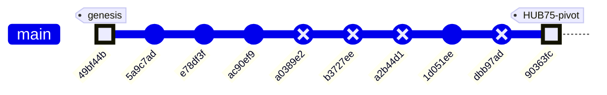

# ME135 Evolution Report

**Date:** 2026-05-07 18:14 &nbsp;|&nbsp; **Commit:** `90363fc`

---

## What Changed

## Commit `90363fc` — Hardware Pivot: WS2812B → Waveshare RGB-Matrix-P2 64×64 (HUB75)

This is the **defining commit of the current sprint**: the display hardware was swapped from a custom-built 108×108 WS2812B addressable LED panel to an off-the-shelf **Waveshare RGB-Matrix-P2 64×64** HUB75 panel. No functional code was rewritten — instead, authoritative config was updated and every stale file got a prominent warning banner pointing to what must change next.

### Configuration & Context (the "source of truth" layer)

- **`config.yaml`** — `display.type` changed from `"ws2812b"` to `"hub75_waveshare_p2_64"`. Panel dimensions: 108×108 → **64×64** (4,096 LEDs, down from 11,664). Driver library: `ESP32-HUB75-MatrixPanel-DMA` replaces FastLED. `fps_target` raised from 10 → **60** because HUB75 DMA easily sustains it. Single `gpio_data_pin` removed — HUB75 needs 13 control GPIOs.
- **`config.yaml` processing section** — `output_width`/`output_height` changed from 400×300 to **64×64**, matching the panel's native resolution. This eliminates the intermediate downsample stage.
- **`orchestrator.py` PROJECT_CONTEXT** — The entire project description block now references the Waveshare panel, 512 bytes/frame payload, 921,600 bps baud, and `ESP32-HUB75-MatrixPanel-DMA`. This matters because every Claude agent spawned by the orchestrator inherits this context.
- **`doc_agent.py`** — Architect agent prompt updated: data-flow diagram now targets "64×64 Waveshare HUB75 LED panel" and "512 B/frame".
- **`PROJECT_README.md`** — One-liner, architecture overview, and ASCII data-flow diagram all rewritten: 400×300 / 15 KB → 64×64 / 512 B. Transport label changed from GPIO → HUB75.

### STALE Banners (the "debt marker" layer)

These files received prominent `⚠ STALE` banners at the top, explaining exactly what needs rewriting. No functional code was changed — the old logic still compiles/runs but targets the wrong hardware:

- **`esp32_main.cpp`** — Banner says: replace FastLED with `ESP32-HUB75-MatrixPanel-DMA`, change `MATRIX_COLS/ROWS` to 64, `FRAME_BYTES` to 512, map 13 HUB75 GPIOs. Marked **"DO NOT FLASH AS-IS"**.
- **`serial_protocol.py`** — Banner says: payload shrinks from 1,458 → 512 bytes, adjust `LEN_H/LEN_L` and CRC scope. Notes that Larry's pipeline already outputs 64×64 natively.
- **`PROTOCOL_SPEC.md`** — Banner outlines a v2.0 spec: 512-byte payload, ~518-byte total frame, 921,600 bps sufficient for 60+ fps. Old v1.0 spec body (15,000-byte frames at 2 Mbaud) left intact for reference.
- **`hardware_recommendation.md`** — Banner identifies 4 BOM rows to drop (WS2812B strip, 30A PSU, level shifter, inrush cap) and replace with the Waveshare panel + 5V/4A supply. Wiring diagram and power budget flagged for rewrite.
- **`cv_pipeline.py`** and **`gpu_accelerated.py`** — Both get banners noting their docstrings still say 400×300, but the config now feeds them 64×64. Actual resize call reads `out_w`/`out_h` from config, so **the pipeline already works at 64×64 without code changes** — only the docstrings and comments are stale.

### Earlier Commits in This Window

| Commit | Subsystem | What & Why |
|--------|-----------|------------|
| `1d051ee` | CV/Vision | Replaced `[` / `]` keyboard-driven confidence keys with a **trackbar slider** (`Conf %`). Why: continuous adjustment is faster during live tuning than discrete key presses. |
| `ac90ef9` | CV/Vision | Kyle **forked** `Larry/vision.py` into his own workspace for personal experiments. Establishes the Kyle/Larry branch convention. |
| `e78df3f` | Project governance | Added `CLAUDE.md` — the collaboration convention doc that tells Claude agents which workspace belongs to whom (Kyle vs. Larry). |
| `49bf44b` | CV + ESP32 | Larry's initial commit: vision code and optimized C++ code. The project's genesis. |

---

## Evolution Timeline

### Subsystem Touch Map

| Commit | CV Pipeline | Serial Protocol | ESP32 Firmware | Config | Docs / Governance | Vision (Kyle) |
|--------|:-----------:|:---------------:|:--------------:|:------:|:-----------------:|:-------------:|
| `49bf44b` — initial code | ✅ | | ✅ | | | |
| `5a9c7ad` — merge main | | | | | | |
| `e78df3f` — CLAUDE.md | | | | | ✅ | |
| `ac90ef9` — fork vision.py | | | | | | ✅ |
| `1d051ee` — trackbar slider | | | | | | ✅ |
| **`90363fc` — HUB75 pivot** | ✅ | ✅ | ✅ | ✅ | ✅ | |

> **Pattern:** The project started with Larry's CV + C++ foundation, Kyle forked the vision code for experimentation, and the HEAD commit is a sweeping **hardware-pivot bookkeeping pass** — updating every config surface while deliberately deferring the actual code rewrites behind STALE banners. This is a "declare the destination, mark the debt" strategy: the team can now grep for `⚠ STALE` to find every file that needs a rewrite before the next hardware integration milestone.

---

## Code Health Summary

**Overall Grade: D+**

The codebase demonstrates strong *architectural intent* — clean module boundaries, config-driven design, dual CPU/GPU pipelines, and a well-structured agent orchestration layer. Documentation is thorough.

However, **a hardware migration from 108×108 WS2812B to 64×64 HUB75 was only partially applied**, leaving the system in a broken state. `config.yaml` was updated to 64×64, but `serial_protocol.py` still hardcodes 108×108/400×300, meaning **every serial frame raises `ValueError`**. The ESP32 firmware still targets the wrong display hardware entirely. Protocol docs are self-contradictory (banners say 512B, body says 15KB).

Beyond the migration debt: camera open is never verified, the GPU pipeline lacks a safety guard present in the CPU path, and `SerialSender` has no context-manager cleanup. The orchestrator and doc-agent layers are in better shape but have minor subprocess fragility and a needless JSON roundtrip.

**Bottom line:** Fix the three must-fix dimension/hardware issues and this jumps to a B.

---

## Improvement Proposals

| # | Title | Priority | Risk | Files |
|---|-------|----------|------|-------|
| PROP-001 | serial_protocol.py still hardcodes 108×108 / 1,458-byte payload | must-fix | high | `agent_outputs/serial_protocol.py, agent_outputs/config.yaml` |
| PROP-002 | esp32_main.cpp must be rewritten for HUB75 before next flash | must-fix | high | `agent_outputs/esp32_main.cpp, agent_outputs/platformio.ini` |
| PROP-003 | PROTOCOL_SPEC.md v2.0 needs to be written (not just bannered) | must-fix | medium | `agent_outputs/PROTOCOL_SPEC.md` |
| PROP-004 | cv_pipeline.py and gpu_accelerated.py docstrings say 400×300 | nice-to-have | low | `agent_outputs/cv_pipeline.py, agent_outputs/gpu_accelerated.py` |
| PROP-005 | config.yaml serial.baud_rate still set to 2,000,000 | nice-to-have | low | `agent_outputs/config.yaml, agent_outputs/esp32_main.cpp` |
| PROP-006 | hardware_recommendation.md BOM rows need concrete rewrite | must-fix | medium | `agent_outputs/hardware_recommendation.md` |
| SERIAL-001 | serial_protocol.py hardcoded dimensions cause ValueError on every frame | must-fix | high | `agent_outputs/serial_protocol.py, agent_outputs/config.yaml` |
| FW-001 | esp32_main.cpp targets wrong hardware (WS2812B instead of HUB75) | must-fix | high | `agent_outputs/esp32_main.cpp, agent_outputs/platformio.ini` |
| CV-001 | Camera open never verified — silent failure cascade | nice-to-have | medium | `agent_outputs/cv_pipeline.py, agent_outputs/gpu_accelerated.py` |
| GPU-001 | GPUPipeline.process_frame() missing foreground overflow guard | nice-to-have | medium | `agent_outputs/gpu_accelerated.py` |
| ORCH-001 | Redundant JSON roundtrip in orchestrator.py tool dispatch | nice-to-have | low | `orchestrator.py` |
| DOC-001 | doc_agent.py git subprocess calls crash if git unavailable or no history | nice-to-have | medium | `doc_agent.py, gdrive_sync.py` |
| SERIAL-002 | SerialSender lacks context manager — resource leak on exception | nice-to-have | low | `agent_outputs/serial_protocol.py, agent_outputs/main.py` |
| PROTO-001 | PROTOCOL_SPEC.md, PROJECT_README.md wire diagrams show stale 15KB frame format | must-fix | medium | `agent_outputs/PROTOCOL_SPEC.md, agent_outputs/PROJECT_README.md` |

### PROP-001: serial_protocol.py still hardcodes 108×108 / 1,458-byte payload
**Priority:** must-fix &nbsp;|&nbsp; **Risk:** high

**Problem:** PANEL_ROWS, PANEL_COLS, and PAYLOAD_BYTES constants are still 108/108/1458. The config.yaml now says 64×64 (512 bytes), but serial_protocol.py ignores the config for these values — they're module-level constants. Any frame sent will be the wrong size for the new panel.

**Proposed fix:** Read panel dimensions from config.yaml at SerialSender.__init__ time (they're already in config['display']['panel_width/height']). Compute PAYLOAD_BYTES dynamically: (w * h) // 8. Update pack_matrix() and unpack_matrix() to use instance dimensions instead of module constants.

**Affected files:** agent_outputs/serial_protocol.py, agent_outputs/config.yaml

---

### PROP-002: esp32_main.cpp must be rewritten for HUB75 before next flash
**Priority:** must-fix &nbsp;|&nbsp; **Risk:** high

**Problem:** The firmware still uses Adafruit_NeoPixel on a single GPIO pin at 108×108 (11,664 LEDs). Flashing this onto the ESP32 connected to the HUB75 panel will produce no output and could drive incorrect GPIO levels into the panel's logic inputs.

**Proposed fix:** Replace Adafruit_NeoPixel with ESP32-HUB75-MatrixPanel-DMA (Mrfaptastic library). Change MATRIX_COLS/ROWS to 64, PAYLOAD_BYTES to 512. Configure HUB75_I2S_CFG with the 13 required GPIO pins. Replace updateDisplay() with DMA buffer writes. Add platformio.ini lib_deps entry for the DMA library.

**Affected files:** agent_outputs/esp32_main.cpp, agent_outputs/platformio.ini

---

### PROP-003: PROTOCOL_SPEC.md v2.0 needs to be written (not just bannered)
**Priority:** must-fix &nbsp;|&nbsp; **Risk:** medium

**Problem:** The STALE banner describes what v2.0 should say, but the spec body still documents the 15,000-byte / 2 Mbaud v1.0 protocol. Anyone implementing from this spec will build the wrong thing.

**Proposed fix:** Write the actual v2.0 spec body: 512-byte payload, ~518-byte frame, 921,600 bps default. Keep v1.0 in a collapsed 'Legacy' section for reference. Update the timing budget table (512 B at 921,600 bps ≈ 5.6 ms/frame → 60+ fps theoretical).

**Affected files:** agent_outputs/PROTOCOL_SPEC.md

---

### PROP-004: cv_pipeline.py and gpu_accelerated.py docstrings say 400×300
**Priority:** nice-to-have &nbsp;|&nbsp; **Risk:** low

**Problem:** Both pipeline modules have docstrings and inline comments referencing '400×300 binary matrix' and shape (300, 400). The code itself reads output_width/height from config (now 64×64), so it works correctly, but the misleading docstrings will confuse any developer reading the code.

**Proposed fix:** Update all docstrings, shape annotations, and inline comments to reference 64×64. Change process_frame() return docstring from '(300, 400)' to '(out_h, out_w)' or '(64, 64)'. Remove the hardcoded comment '# 400' / '# 300' next to out_w / out_h assignments.

**Affected files:** agent_outputs/cv_pipeline.py, agent_outputs/gpu_accelerated.py

---

### PROP-005: config.yaml serial.baud_rate still set to 2,000,000
**Priority:** nice-to-have &nbsp;|&nbsp; **Risk:** low

**Problem:** The PROTOCOL_SPEC banner and PROJECT_README both state 921,600 bps is sufficient for 64×64 frames. But config.yaml still has baud_rate: 2000000. This isn't broken (higher baud works), but it's inconsistent with the documented recommendation and may cause issues on some USB-UART bridges that don't support 2 Mbaud cleanly.

**Proposed fix:** Change serial.baud_rate to 921600 in config.yaml and add a comment noting 2 Mbaud remains valid if the hardware supports it. Ensure esp32_main.cpp (once rewritten) matches.

**Affected files:** agent_outputs/config.yaml, agent_outputs/esp32_main.cpp

---

### PROP-006: hardware_recommendation.md BOM rows need concrete rewrite
**Priority:** must-fix &nbsp;|&nbsp; **Risk:** medium

**Problem:** The STALE banner lists exactly which BOM rows to replace and what to substitute, but the actual BOM table below it still lists WS2812B strips, 30A PSU, level shifters, and inrush caps. A student ordering parts from this BOM will buy the wrong components.

**Proposed fix:** Replace BOM rows 4, 5, 8, 9 with: Waveshare RGB-Matrix-P2 64×64, HUB75 IDC ribbon cable, 5V/4A bench supply. Update wiring diagram for 13 HUB75 GPIOs. Recalculate power budget for 4,096 LEDs (peak ~4A full white).

**Affected files:** agent_outputs/hardware_recommendation.md

---

### SERIAL-001: serial_protocol.py hardcoded dimensions cause ValueError on every frame
**Priority:** must-fix &nbsp;|&nbsp; **Risk:** high

**Problem:** serial_protocol.py hardcodes `CV_ROWS=300, CV_COLS=400, PANEL_ROWS=108, PANEL_COLS=108`. config.yaml now sets `output_width: 64, output_height: 64`. In main.py, the pipeline produces a (64, 64) matrix. When `send_frame()` calls `pack_matrix()`, the shape check fails both `(300, 400)` and `(108, 108)`, raising `ValueError('Expected matrix shape (300, 400) or (108, 108), got (64, 64)')` on every frame. The system is completely non-functional with serial enabled.

**Proposed fix:** Remove all hardcoded dimension constants. Make `SerialSender.__init__` read `config['display']['panel_width']` and `config['display']['panel_height']` (64×64) from config. Compute `PAYLOAD_BYTES = (panel_w * panel_h) // 8` dynamically. Update `pack_matrix()` to accept any shape and only validate it matches the configured panel dimensions. Delete `downsample_to_panel()` entirely — the CV pipeline already outputs at panel resolution.

**Affected files:** agent_outputs/serial_protocol.py, agent_outputs/config.yaml

---

### FW-001: esp32_main.cpp targets wrong hardware (WS2812B instead of HUB75)
**Priority:** must-fix &nbsp;|&nbsp; **Risk:** high

**Problem:** The firmware uses `Adafruit_NeoPixel` to drive 11,664 WS2812B LEDs via a single GPIO (pin 13) at 108×108 resolution. The actual hardware is a Waveshare RGB-Matrix-P2 64×64 HUB75 panel driven via 13 GPIO pins and `ESP32-HUB75-MatrixPanel-DMA`. platformio.ini also lists `Adafruit NeoPixel` as the only lib_dep. The firmware cannot drive the real display at all.

**Proposed fix:** Rewrite esp32_main.cpp: (1) Replace `Adafruit_NeoPixel` with `ESP32-HUB75-MatrixPanel-DMA` (mrfaptastic). (2) Set `MATRIX_COLS = MATRIX_ROWS = 64`, `PAYLOAD_BYTES = 512`. (3) Configure HUB75_I2S_CFG with the 13 control pins. (4) Update `updateDisplay()` to call `dma_display->drawPixelRGB888()`. (5) In platformio.ini, replace the NeoPixel lib_dep with `mrfaptastic/ESP32 HUB75 LED MATRIX PANEL DMA Display@^3.0.0`.

**Affected files:** agent_outputs/esp32_main.cpp, agent_outputs/platformio.ini

---

### CV-001: Camera open never verified — silent failure cascade
**Priority:** nice-to-have &nbsp;|&nbsp; **Risk:** medium

**Problem:** In both `CVPipeline.__init__` and `GPUPipeline.__init__`, `cv2.VideoCapture(device_index)` is called but `cap.isOpened()` is never checked. If the camera is missing or busy, `VideoCapture` returns a valid object but `cap.read()` returns `(False, None)`. Calibration then raises a generic `RuntimeError('Camera read failed during calibration')` with no hint about the root cause. Worse, the warmup loop silently discards the `(False, None)` returns without error.

**Proposed fix:** Immediately after `self.cap = cv2.VideoCapture(...)`, add `if not self.cap.isOpened(): raise RuntimeError(f'Failed to open camera at index {cam_cfg["device_index"]}. Check device and driver.')`. Apply to both CVPipeline and GPUPipeline constructors.

**Affected files:** agent_outputs/cv_pipeline.py, agent_outputs/gpu_accelerated.py

---

### GPU-001: GPUPipeline.process_frame() missing foreground overflow guard
**Priority:** nice-to-have &nbsp;|&nbsp; **Risk:** medium

**Problem:** CVPipeline.process_frame() has a critical safety check: if >60% of pixels are foreground, it logs a warning and returns a zeroed matrix (preventing the stale-background-model problem from flooding the display). GPUPipeline.process_frame() has no equivalent check — a stale background model would send a nearly-all-white matrix to the panel continuously, which is a power and safety concern for the LED driver.

**Proposed fix:** After downloading the thresholded mask to CPU in GPUPipeline.process_frame(), add the same guard: `if np.mean(fg_cpu > 0) > 0.6: logger.warning('Foreground overflow...'); return np.zeros((...), dtype=np.uint8), frame`. This ensures both code paths have identical safety behavior.

**Affected files:** agent_outputs/gpu_accelerated.py

---

### ORCH-001: Redundant JSON roundtrip in orchestrator.py tool dispatch
**Priority:** nice-to-have &nbsp;|&nbsp; **Risk:** low

**Problem:** In `run_agent()`, tool inputs are processed as `json.loads(json.dumps(block.input))`. The Anthropic SDK already returns `block.input` as a native Python dict. This no-op serialization-deserialization roundtrip runs on every tool call across all 7 parallel agents (potentially dozens of tool invocations per run), wasting CPU and adding latency for zero benefit.

**Proposed fix:** Replace `result = execute_tool(block.name, json.loads(json.dumps(block.input)))` with `result = execute_tool(block.name, block.input)`. If defensive copying is desired, use `copy.deepcopy(block.input)` or `dict(block.input)` instead.

**Affected files:** orchestrator.py

---

### DOC-001: doc_agent.py git subprocess calls crash if git unavailable or no history
**Priority:** nice-to-have &nbsp;|&nbsp; **Risk:** medium

**Problem:** In `get_git_context()`, multiple `subprocess.run(['git', ...])` calls are made without try/except. If git is not installed, not in PATH, or the repo has <2 commits (making `HEAD~1` invalid), these calls will either raise `FileNotFoundError` or return error output silently. The `HEAD~1` reference is especially fragile on shallow clones or fresh repos. `get_changed_files()` in gdrive_sync.py has the same issue.

**Proposed fix:** Wrap each git subprocess call in try/except (catching `FileNotFoundError` and `subprocess.SubprocessError`). For `HEAD~1`, first check commit count with `git rev-list --count HEAD` and fall back to `git diff --cached` or `git show --name-only HEAD` if only 1 commit exists. Return empty/fallback strings on failure rather than crashing.

**Affected files:** doc_agent.py, gdrive_sync.py

---

### SERIAL-002: SerialSender lacks context manager — resource leak on exception
**Priority:** nice-to-have &nbsp;|&nbsp; **Risk:** low

**Problem:** CVPipeline implements `__enter__`/`__exit__` for safe resource cleanup, but SerialSender does not. In main.py, if an unhandled exception occurs between `sender = SerialSender(config)` and the cleanup block `if sender: sender.close()`, the serial port remains open. On Linux, this locks `/dev/ttyUSB0` until the process is killed, preventing subsequent runs from connecting.

**Proposed fix:** Add `__enter__` and `__exit__` methods to SerialSender (mirroring CVPipeline's pattern). In `__exit__`, call `self.close()`. In main.py, use `with SerialSender(config) as sender:` or at minimum wrap the main loop in try/finally ensuring `sender.close()` is always called.

**Affected files:** agent_outputs/serial_protocol.py, agent_outputs/main.py

---

### PROTO-001: PROTOCOL_SPEC.md, PROJECT_README.md wire diagrams show stale 15KB frame format
**Priority:** must-fix &nbsp;|&nbsp; **Risk:** medium

**Problem:** The protocol spec (§3 Frame Format) documents a 15,008-byte frame with 15,000-byte payload (400×300 bit-packed). The README's wire-protocol ASCII diagram also shows 15KB. Both documents have ⚠ STALE banners at the top but the body text was never updated. Anyone implementing from the spec will build an incompatible system. The config.yaml and the banner both say 512-byte payload (64×64 / 8), creating a contradictory document.

**Proposed fix:** Bump PROTOCOL_SPEC.md to v2.0. Update §3 Frame Format table: PAYLOAD_LEN = 512 (0x0200), PAYLOAD = 512 bytes, total frame = 520 bytes. Update §4 to describe 64×64 matrix. Update §7 timing budget for 520-byte frames. Update PROJECT_README.md wire-protocol diagram to show 512B payload. Remove the stale banners once content is accurate.

**Affected files:** agent_outputs/PROTOCOL_SPEC.md, agent_outputs/PROJECT_README.md

---
