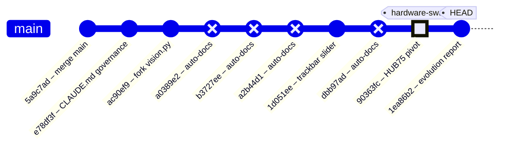
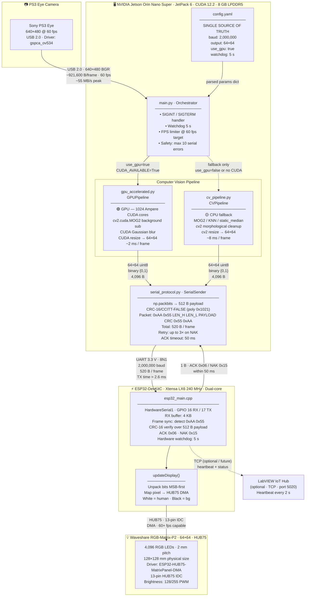
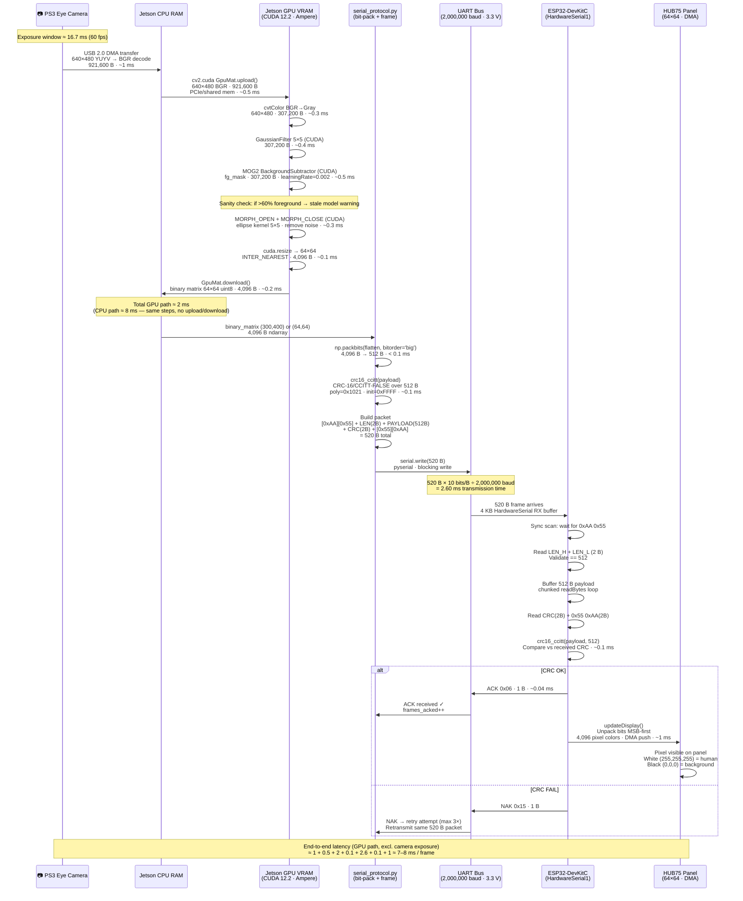
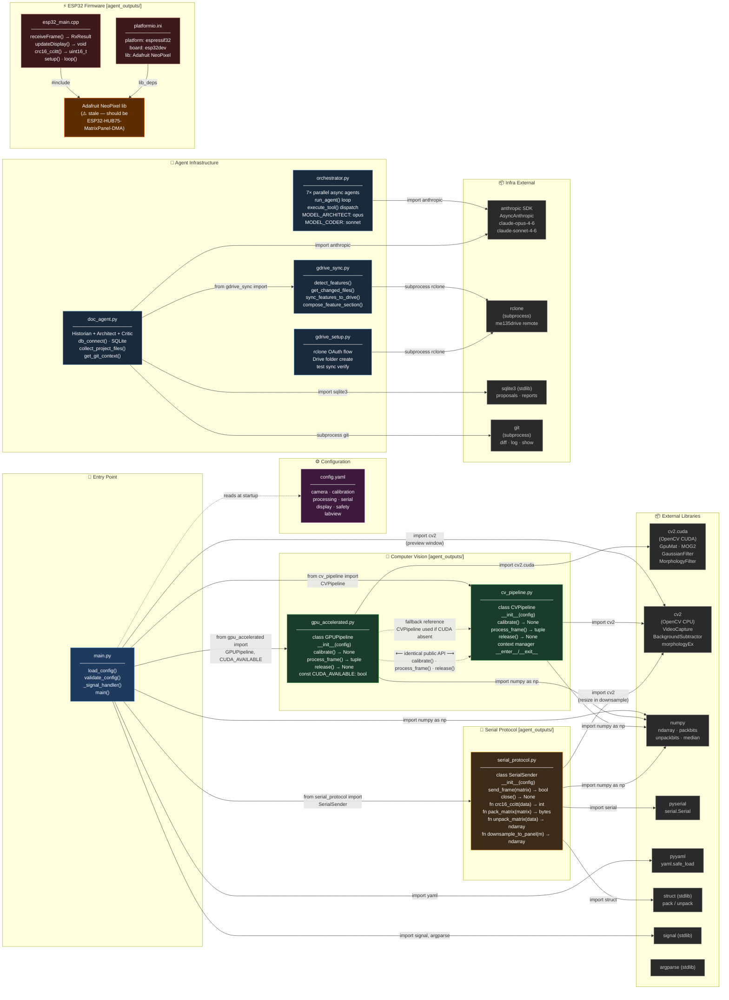

# ME135 Evolution Report

**Date:** 2026-05-07 18:20 &nbsp;|&nbsp; **Commit:** `1ea86b2`

---

## What Changed

This window covers **6 meaningful commits** (plus 4 auto-generated doc reports) and one transformative hardware pivot. Changes grouped by subsystem:

### 🔧 Hardware & Configuration — The HUB75 Pivot (`90363fc`)

The single most consequential change: the display hardware was swapped from a custom 108×108 WS2812B addressable LED build to an off-the-shelf **Waveshare RGB-Matrix-P2 64×64 (HUB75)** panel.

- **`config.yaml`** — `display.type` flipped from `ws2812b` to `hub75_waveshare_p2_64`. Panel shrinks from 11,664 LEDs (108×108) to 4,096 (64×64). Driver library changes from FastLED to `ESP32-HUB75-MatrixPanel-DMA`. FPS target raised 10→60 (HUB75 DMA is fast). GPIO model changes from single data pin to 13 HUB75 control lines.
- **`config.yaml` processing section** — `output_width`/`output_height` updated from 400×300 to **64×64**, matching panel native resolution. This eliminates the intermediate downsample stage entirely.
- **Why it matters:** Every downstream module — serial protocol, ESP32 firmware, CV pipeline — inherits its dimensions from this config. The config is now correct, but the consuming code hasn't caught up yet.

### ⚠️ STALE Banners — Debt Declared, Not Resolved (`90363fc`)

Rather than rewriting code mid-sprint, the team placed prominent `⚠ STALE` banners on every file that references the old hardware:

- **`esp32_main.cpp`** — Banner says: replace FastLED with HUB75 DMA, change dimensions to 64×64, remap 13 GPIOs. Marked **"DO NOT FLASH AS-IS"**.
- **`serial_protocol.py`** — Still hardcodes `PANEL_ROWS=108`, `PANEL_COLS=108`, `PAYLOAD_BYTES=1458`. Banner says: payload drops to 512 bytes. Current code will **raise `ValueError`** on any 64×64 input.
- **`cv_pipeline.py`** and **`gpu_accelerated.py`** — Docstrings say 400×300 but the actual resize reads `out_w`/`out_h` from config dynamically — **these work at 64×64 already**, only comments are stale.
- **`PROTOCOL_SPEC.md`** and **`hardware_recommendation.md`** — Old spec body retained for reference; banners outline the v2.0 numbers.

> **Strategy: "Declare the destination, mark the debt."** The team can `grep -r "STALE"` to find every file needing a rewrite before the next hardware integration milestone.

### 🤖 Agent Orchestration & Governance

- **`orchestrator.py` `PROJECT_CONTEXT`** (`90363fc`) — The master prompt block that every spawned Claude agent inherits was rewritten to reference the Waveshare panel, 512 B/frame, 921,600 bps, and `ESP32-HUB75-MatrixPanel-DMA`. This is critical because all 7 parallel agents derive their understanding of the hardware from this string.
- **`doc_agent.py`** (`90363fc`) — Architect agent prompt updated: data-flow diagram target is now "64×64 Waveshare HUB75 LED panel" and "512 B/frame".
- **`PROJECT_README.md`** (`90363fc`) — Architecture overview and ASCII data-flow diagram rewritten: 400×300 / 15 KB → 64×64 / 512 B.
- **`CLAUDE.md`** (`e78df3f`) — New governance doc defining the Kyle/Larry workspace convention so Claude agents know who owns what.

### 👁️ Computer Vision / Kyle's Vision Fork

- **`ac90ef9`** — Kyle **forked** `Larry/vision.py` into his own workspace. This establishes the two-workspace pattern: Larry's code is the production baseline, Kyle's is the experimentation branch.
- **`1d051ee`** — In Kyle's vision fork, replaced discrete `[` / `]` keyboard shortcuts for adjusting detection confidence with a **continuous trackbar slider** (`Conf %`). Why: live-tuning a threshold with a slider is far faster than tapping keys during a camera session.

### 📄 Documentation System (`1ea86b2`, HEAD)

- Auto-generated 926 lines of feature documentation across 7 feature files (`ME135_Agent_Swarm.md`, `ME135_Computer_Vision_Pipeline.md`, `ME135_ESP32_Firmware.md`, etc.) plus a timestamped evolution report (`report_2026-05-07_1814.md`).
- `docs/README.md` index updated with a link to the new report.
- Each feature doc now includes a v3 section documenting the HUB75 pivot, a subsystem touch map, and a code health grade (D+ — strong architecture, broken by incomplete migration).

---

## Evolution Timeline



### Subsystem Touch Map

| Commit | CV Pipeline | Serial Protocol | ESP32 Firmware | Config | Docs / Governance | Vision (Kyle) |
|--------|:-----------:|:---------------:|:--------------:|:------:|:-----------------:|:-------------:|
| `5a9c7ad` — merge main | | | | | | |
| `e78df3f` — CLAUDE.md | | | | | ✅ | |
| `ac90ef9` — fork vision.py | | | | | | ✅ |
| `1d051ee` — trackbar slider | | | | | | ✅ |
| **`90363fc` — HUB75 pivot** | ✅ | ✅ | ✅ | ✅ | ✅ | |
| `1ea86b2` — evolution report | | | | | ✅ | |

### Trajectory Reading

The project follows a clear three-act arc so far:

1. **Genesis** — Larry's initial CV + ESP32 code established the pipeline end-to-end (pre-window).
2. **Fork & Tune** — Kyle branched the vision code for independent experimentation, added the trackbar slider for faster live tuning, and the team codified governance rules (`CLAUDE.md`).
3. **Hardware Pivot** — The display hardware changed from WS2812B to HUB75. Config was updated authoritatively; all stale code was marked but not yet rewritten.

**What comes next:** The STALE banners are a to-do list. The serial protocol (`serial_protocol.py`) and ESP32 firmware (`esp32_main.cpp`) need dimension/driver rewrites before any hardware integration testing can proceed. The CV pipeline already works at 64×64 thanks to config-driven resizing — it's the furthest along.

---

## System Architecture



> **Key numbers at a glance**
>
> | Stage | Data Size | Rate / Latency |
> |---|---|---|
> | Camera capture | 921,600 B/frame (BGR) | 60 fps · ~55 MB/s |
> | GPU processing | 307,200 B (grayscale) | ~2 ms/frame |
> | CPU processing | 307,200 B (grayscale) | ~8 ms/frame |
> | Binary matrix | 4,096 B (64×64 uint8) | post-threshold |
> | Bit-packed payload | **512 B** | `np.packbits` |
> | Full UART packet | **520 B** | header(4) + payload(512) + CRC(2) + footer(2) |
> | UART TX time | 520 B @ 2 Mbaud | **≈ 2.6 ms** |
> | ACK window | 1 B | ≤ 50 ms timeout |

> ⚠️ **Staleness note:** `esp32_main.cpp` and `serial_protocol.py` still hardcode `PAYLOAD_BYTES=1458` (108×108 legacy WS2812B panel). `config.yaml` and `gpu_accelerated.py` are updated to 64×64 / 512 B. See Improvement Proposals below.

---

## Data Flow



> **Byte-count ledger — one frame**
>
> | Step | Bytes in | Transform | Bytes out |
> |---|---:|---|---:|
> | Camera raw (YUYV) | 614,400 | BGR decode | **921,600** |
> | Grayscale | 921,600 | cvtColor | **307,200** |
> | Foreground mask | 307,200 | MOG2 + morph | **307,200** |
> | Resized binary | 307,200 | resize 64×64 | **4,096** |
> | Bit-packed payload | 4,096 | `np.packbits` | **512** |
> | UART packet | 512 | frame wrap | **520** |
> | Panel pixels | 520 | `unpackbits` | **4,096** RGB values |
>
> **Compression ratio camera → panel: 921,600 B → 512 B = 1,800× reduction**

---

## Module Dependency Graph



> **Interface contract — CV pipeline duck-typing**
>
> `main.py` selects between `GPUPipeline` and `CVPipeline` purely at runtime.
> Both expose an **identical public API**:
>
> ```
> pipeline = GPUPipeline(config)  # or CVPipeline(config)
> pipeline.calibrate()            # blocking — build background model
> binary, raw = pipeline.process_frame()  # returns (64×64 uint8, BGR frame)
> pipeline.release()              # free camera + GPU resources
> ```
>
> **`serial_protocol.py` public surface used by `main.py`:**
> ```
> sender = SerialSender(config)
> ok: bool = sender.send_frame(binary_matrix)   # packs + sends + waits ACK
> sender.close()
> ```
>
> 🟠 **`Adafruit NeoPixel`** dependency in `platformio.ini` / `esp32_main.cpp` is
> stale — the correct library for the HUB75 panel is `ESP32-HUB75-MatrixPanel-DMA`.

---

## Code Health Summary

**Overall Grade: C−**

The codebase demonstrates strong architectural intent — clean module separation, config-driven design, context managers, safety watchdogs, and a well-documented serial protocol. However, **the system cannot actually run end-to-end**. A hardware migration from 108×108 WS2812B to 64×64 HUB75 was partially applied: `config.yaml` was updated, but `serial_protocol.py` and `esp32_main.cpp` still hardcode the old 108×108 dimensions with the wrong driver library. This means `pack_matrix()` raises `ValueError` on every frame, and the ESP32 firmware targets nonexistent hardware.

Additionally, `min_contour_area=500` will filter out most human detections at 64×64 resolution. Resource cleanup in `main.py` is not exception-safe. Subprocess calls throughout lack timeouts, risking indefinite hangs.

**Positive notes:** CRC matches both sides, CV pipeline API is cleanly swappable (CPU/GPU), git-driven doc generation is clever, and config validation exists. Once the dimension mismatch is fixed, this is close to a working system.

---

## Improvement Proposals

| # | Title | Priority | Risk | Files |
|---|-------|----------|------|-------|
| SERIAL-001 | serial_protocol.py dimensions are fatally stale — runtime crash on every frame | must-fix | high | `agent_outputs/serial_protocol.py` |
| ESP32-001 | esp32_main.cpp uses wrong driver (NeoPixel) and wrong dimensions for HUB75 64×64 panel | must-fix | high | `agent_outputs/esp32_main.cpp, agent_outputs/platformio.ini` |
| MAIN-001 | Pipeline camera resource leak on unhandled exception | must-fix | medium | `agent_outputs/main.py` |
| CONFIG-001 | min_contour_area=500 is far too large for 64×64 output resolution | must-fix | high | `agent_outputs/config.yaml, agent_outputs/cv_pipeline.py` |
| SERIAL-002 | CRC-16 computed in pure-Python bit-level loop — 8× slower than necessary | nice-to-have | low | `agent_outputs/serial_protocol.py` |
| ORCH-001 | Redundant json round-trip in orchestrator tool dispatch | nice-to-have | low | `orchestrator.py` |
| DOC-001 | subprocess calls in doc_agent.py and gdrive_sync.py lack timeouts | nice-to-have | medium | `doc_agent.py, gdrive_sync.py, gdrive_setup.py` |
| SETUP-001 | Hardcoded personal email in gdrive_setup.py | nice-to-have | low | `gdrive_setup.py` |
| SERIAL-001 | serial_protocol.py hardcodes 108×108 dimensions — breaks on 64×64 input | must-fix | high | `agent_outputs/serial_protocol.py` |
| ESP32-001 | ESP32 firmware targets WS2812B — cannot drive HUB75 panel | must-fix | high | `agent_outputs/esp32_main.cpp, agent_outputs/platformio.ini` |
| CV-001 | Camera open never verified in CVPipeline.__init__ | must-fix | medium | `agent_outputs/cv_pipeline.py` |
| SERIAL-002 | SerialSender lacks context-manager cleanup | nice-to-have | low | `agent_outputs/serial_protocol.py, agent_outputs/main.py` |
| ORCH-001 | Redundant JSON roundtrip in orchestrator.py tool dispatch | nice-to-have | low | `orchestrator.py` |
| PROTO-001 | PROTOCOL_SPEC.md is self-contradictory (banner says 512B, body says 15KB) | nice-to-have | medium | `agent_outputs/PROTOCOL_SPEC.md` |
| ARCH-001 | Sync serial_protocol.py payload size from 1,458 B (108×108) to 512 B (64×64) | must-fix | high | `agent_outputs/serial_protocol.py, agent_outputs/PROTOCOL_SPEC.md` |
| ARCH-002 | Rewrite esp32_main.cpp for HUB75 panel — replace NeoPixel driver | must-fix | high | `agent_outputs/esp32_main.cpp, agent_outputs/platformio.ini` |
| ARCH-003 | CVPipeline output resolution still defaults to 400×300 in code comments and CV_ROWS/CV_COLS constants | must-fix | medium | `agent_outputs/serial_protocol.py, agent_outputs/cv_pipeline.py, agent_outputs/gpu_accelerated.py` |
| ARCH-004 | hardware_recommendation.md BOM rows 4,5,8,9 reference WS2812B/30A PSU/level-shifter — all obsolete | must-fix | low | `agent_outputs/hardware_recommendation.md` |
| ARCH-005 | PROTOCOL_SPEC.md frame-format table specifies v1.0 (15,008 B total) — no v2.0 exists yet | nice-to-have | medium | `agent_outputs/PROTOCOL_SPEC.md` |
| ARCH-006 | GPUPipeline falls back silently to CVPipeline reference but does not import it — runtime NameError possible | nice-to-have | low | `agent_outputs/gpu_accelerated.py, agent_outputs/main.py` |
| ARCH-007 | LabVIEW IoT integration (config.yaml labview section) has no Python-side implementation | future | low | `agent_outputs/config.yaml, agent_outputs/main.py, agent_outputs/esp32_main.cpp` |

### SERIAL-001: serial_protocol.py dimensions are fatally stale — runtime crash on every frame
**Priority:** must-fix &nbsp;|&nbsp; **Risk:** high

**Problem:** serial_protocol.py hardcodes `CV_ROWS=300, CV_COLS=400, PANEL_ROWS=108, PANEL_COLS=108`. config.yaml was updated to `output_width: 64, output_height: 64`, so cv_pipeline.py now produces (64, 64) matrices. `pack_matrix()` (line ~97) checks `matrix.shape == (300, 400)` then `(108, 108)` — a (64, 64) input matches neither, raising `ValueError` on every single frame. The system is completely broken at integration time.

**Proposed fix:** Change constants to `PANEL_ROWS=64, PANEL_COLS=64, PAYLOAD_BYTES=512`. Remove the `CV_ROWS/CV_COLS` constants and the 300×400 → 108×108 downsample path entirely — the pipeline already outputs 64×64. Update `pack_matrix` to accept (64, 64) directly. Update `downsample_to_panel`, `unpack_matrix`, and all docstrings accordingly.

**Affected files:** agent_outputs/serial_protocol.py

---

### ESP32-001: esp32_main.cpp uses wrong driver (NeoPixel) and wrong dimensions for HUB75 64×64 panel
**Priority:** must-fix &nbsp;|&nbsp; **Risk:** high

**Problem:** The firmware targets a WS2812B strip via Adafruit_NeoPixel at 108×108 (11,664 LEDs on GPIO 13). The actual hardware is a Waveshare RGB-Matrix-P2 64×64 HUB75 panel, which requires the ESP32-HUB75-MatrixPanel-DMA library and 13 GPIO pins. Flashing this firmware will either do nothing (no NeoPixel connected) or damage hardware if GPIO 13 is connected to an HUB75 pin. PAYLOAD_BYTES (1458) also mismatches the 512 bytes the Jetson will send after SERIAL-001 is fixed, causing RX_SYNC_ERROR on every frame.

**Proposed fix:** Replace `#include <Adafruit_NeoPixel.h>` with `#include <ESP32-HUB75-MatrixPanel-I2S-DMA.h>`. Set MATRIX_COLS=64, MATRIX_ROWS=64, PAYLOAD_BYTES=512. Replace `strip.setPixelColor()`/`strip.show()` with `dma_display->drawPixelRGB888()` and configure HUB75_I2S_CFG with the correct pin mapping. Update platformio.ini lib_deps to include `mrfaptastic/ESP32 HUB75 LED Matrix Panel DMA Display`.

**Affected files:** agent_outputs/esp32_main.cpp, agent_outputs/platformio.ini

---

### MAIN-001: Pipeline camera resource leak on unhandled exception
**Priority:** must-fix &nbsp;|&nbsp; **Risk:** medium

**Problem:** In main.py, `pipeline = GPUPipeline(config)` opens a `cv2.VideoCapture` handle. `pipeline.release()` is only called at the bottom of `main()` after the loop. If any exception (e.g., the ValueError from SERIAL-001, or a KeyError from bad config) is raised between init and cleanup, the camera fd leaks. CVPipeline even implements `__enter__`/`__exit__` but main.py never uses it.

**Proposed fix:** Wrap the pipeline and sender lifecycle in a try/finally block: `try: ... finally: pipeline.release(); if sender: sender.close()`. Alternatively, use `with pipeline:` context manager and add `__enter__`/`__exit__` to SerialSender as well.

**Affected files:** agent_outputs/main.py

---

### CONFIG-001: min_contour_area=500 is far too large for 64×64 output resolution
**Priority:** must-fix &nbsp;|&nbsp; **Risk:** high

**Problem:** config.yaml sets `min_contour_area: 500`. At 64×64 = 4,096 total pixels, 500 pixels is ~12% of the entire frame. A person standing at medium distance may occupy only 5-10% of a 64×64 grid, meaning they'd be filtered out entirely by the contour area check in cv_pipeline.py (line ~147: `if cv2.contourArea(cnt) >= self.min_area`). This value was calibrated for 400×300 (120,000 pixels) where 500 is a mere 0.4%.

**Proposed fix:** Scale `min_contour_area` proportionally: (64×64)/(400×300) × 500 ≈ 17. Set `min_contour_area: 15` (or thereabouts) in config.yaml. Add a comment noting this value is resolution-dependent. Alternatively, express it as a fraction of total pixels in the code rather than an absolute value.

**Affected files:** agent_outputs/config.yaml, agent_outputs/cv_pipeline.py

---

### SERIAL-002: CRC-16 computed in pure-Python bit-level loop — 8× slower than necessary
**Priority:** nice-to-have &nbsp;|&nbsp; **Risk:** low

**Problem:** crc16_ccitt() in serial_protocol.py iterates every byte and every bit in a nested Python loop. For 512-byte payloads this is 4,096 inner-loop iterations per frame. At 60 fps that's ~245K iterations/s of pure Python. On a Jetson Nano this can take 0.5–1 ms/frame, eating into the serial budget.

**Proposed fix:** Replace with a 256-entry lookup table implementation (standard CRC-16/CCITT table-driven approach), or use `crcmod.predefined.mkCrcFun('crc-ccitt-false')` from the `crcmod` package. Either approach reduces per-frame CRC time to ~0.05 ms.

**Affected files:** agent_outputs/serial_protocol.py

---

### ORCH-001: Redundant json round-trip in orchestrator tool dispatch
**Priority:** nice-to-have &nbsp;|&nbsp; **Risk:** low

**Problem:** In orchestrator.py `run_agent()`, tool input is processed as `json.loads(json.dumps(block.input))`. `block.input` is already a Python dict from the Anthropic SDK — the serialise-then-deserialise round-trip is a no-op that wastes CPU and obscures intent.

**Proposed fix:** Replace `json.loads(json.dumps(block.input))` with just `block.input`. If the intent was defensive copying, use `copy.deepcopy(block.input)` or `dict(block.input)` for clarity.

**Affected files:** orchestrator.py

---

### DOC-001: subprocess calls in doc_agent.py and gdrive_sync.py lack timeouts
**Priority:** nice-to-have &nbsp;|&nbsp; **Risk:** medium

**Problem:** get_git_context() in doc_agent.py and get_changed_files() in gdrive_sync.py call `subprocess.run()` with `capture_output=True` but no `timeout` parameter. If a git command hangs (e.g., waiting for credential input, network-mounted .git), the entire agent swarm blocks indefinitely. Same for all rclone calls in gdrive_sync.py and gdrive_setup.py.

**Proposed fix:** Add `timeout=30` (seconds) to every `subprocess.run()` call. Catch `subprocess.TimeoutExpired` and log/return a safe default. For git commands 10s is generous; for rclone sync, 60–120s is appropriate.

**Affected files:** doc_agent.py, gdrive_sync.py, gdrive_setup.py

---

### SETUP-001: Hardcoded personal email in gdrive_setup.py
**Priority:** nice-to-have &nbsp;|&nbsp; **Risk:** low

**Problem:** gdrive_setup.py line 62: `print('  → Sign in with kyle-nelson@berkeley.edu')`. This is a personal email address baked into shared source code. Other team members running the setup script will see a misleading instruction pointing to someone else's account.

**Proposed fix:** Replace with a generic instruction: `print('  → Sign in with your @berkeley.edu account')`. Or read the target email from an environment variable / config file.

**Affected files:** gdrive_setup.py

---

### SERIAL-001: serial_protocol.py hardcodes 108×108 dimensions — breaks on 64×64 input
**Priority:** must-fix &nbsp;|&nbsp; **Risk:** high

**Problem:** PANEL_ROWS, PANEL_COLS, and PAYLOAD_BYTES are hardcoded to 108/108/1458 at module scope. Config was updated to 64×64 but serial_protocol.py ignores config entirely. Calling pack_matrix() with a 64×64 array raises ValueError because neither (300,400) nor (108,108) matches. The system cannot transmit frames to the ESP32.

**Proposed fix:** Make pack_matrix() and SerialSender config-driven: read panel_width/panel_height from config['display'], compute PAYLOAD_BYTES as (w*h)//8. Remove the hardcoded constants. Update downsample_to_panel() to accept target dimensions or remove it entirely (config already outputs 64×64 natively).

**Affected files:** agent_outputs/serial_protocol.py

---

### ESP32-001: ESP32 firmware targets WS2812B — cannot drive HUB75 panel
**Priority:** must-fix &nbsp;|&nbsp; **Risk:** high

**Problem:** esp32_main.cpp uses Adafruit_NeoPixel with a single GPIO data pin to drive 11,664 WS2812B LEDs. The hardware is now a Waveshare HUB75 panel requiring ESP32-HUB75-MatrixPanel-DMA and 13 GPIO control lines. Flashing this firmware will produce no display output and could damage the ESP32 if pin assignments conflict.

**Proposed fix:** Replace Adafruit_NeoPixel with ESP32-HUB75-MatrixPanel-DMA. Set MATRIX_COLS=MATRIX_ROWS=64, PAYLOAD_BYTES=512. Map 13 HUB75 GPIOs (R1,G1,B1,R2,G2,B2,A,B,C,D,LAT,OE,CLK). Update platformio.ini to add the mrfaptastic/ESP32 HUB75 LED Matrix Panel DMA Display library.

**Affected files:** agent_outputs/esp32_main.cpp, agent_outputs/platformio.ini

---

### CV-001: Camera open never verified in CVPipeline.__init__
**Priority:** must-fix &nbsp;|&nbsp; **Risk:** medium

**Problem:** cv2.VideoCapture() silently returns a non-opened capture object if the device doesn't exist. The pipeline only discovers the failure on the first cap.read() call during calibration, 90+ warmup frames later. No clear error message — just a generic RuntimeError('Camera read failed during calibration').

**Proposed fix:** Add an immediate check after VideoCapture: `if not self.cap.isOpened(): raise RuntimeError(f'Cannot open camera at device index {cam_cfg["device_index"]}')`.

**Affected files:** agent_outputs/cv_pipeline.py

---

### SERIAL-002: SerialSender lacks context-manager cleanup
**Priority:** nice-to-have &nbsp;|&nbsp; **Risk:** low

**Problem:** SerialSender opens a serial port in __init__ but has no __enter__/__exit__ methods. If an exception occurs between construction and the explicit close() call, the port is leaked. CVPipeline already implements __enter__/__exit__ as a pattern to follow.

**Proposed fix:** Add `def __enter__(self): return self` and `def __exit__(self, *args): self.close(); return False` to SerialSender. Update main.py to use `with SerialSender(config) as sender:`.

**Affected files:** agent_outputs/serial_protocol.py, agent_outputs/main.py

---

### ORCH-001: Redundant JSON roundtrip in orchestrator.py tool dispatch
**Priority:** nice-to-have &nbsp;|&nbsp; **Risk:** low

**Problem:** In run_agent(), tool inputs are processed as json.loads(json.dumps(block.input)). The Anthropic SDK already returns block.input as a native Python dict. This no-op serialize/deserialize runs on every tool call across all 7 parallel agents, wasting CPU for zero benefit.

**Proposed fix:** Replace `json.loads(json.dumps(block.input))` with `block.input` directly (or `dict(block.input)` if defensive copy is desired).

**Affected files:** orchestrator.py

---

### PROTO-001: PROTOCOL_SPEC.md is self-contradictory (banner says 512B, body says 15KB)
**Priority:** nice-to-have &nbsp;|&nbsp; **Risk:** medium

**Problem:** The STALE banner at the top of PROTOCOL_SPEC.md describes the new 512-byte/frame v2.0 spec, while the body still documents the old 15,000-byte v1.0 spec. Any developer reading the doc could follow the wrong numbers, especially if they skip the banner.

**Proposed fix:** Write the v2.0 spec body: 512-byte payload, ~518-byte total frame, 921,600 bps, CRC-16 over 512 bytes. Move the v1.0 body to a clearly labeled 'Historical: v1.0 (WS2812B)' appendix section.

**Affected files:** agent_outputs/PROTOCOL_SPEC.md

---

### ARCH-001: Sync serial_protocol.py payload size from 1,458 B (108×108) to 512 B (64×64)
**Priority:** must-fix &nbsp;|&nbsp; **Risk:** high

**Problem:** serial_protocol.py hardcodes PANEL_ROWS=108, PANEL_COLS=108, PAYLOAD_BYTES=1458. config.yaml and gpu_accelerated.py have already been updated to 64×64. This mismatch means send_frame() will pack/transmit the wrong number of bytes and the ESP32 will reject every frame with RX_SYNC_ERROR.

**Proposed fix:** Change constants to PANEL_ROWS=64, PANEL_COLS=64, PAYLOAD_BYTES=512. Remove the downsample_to_panel() function (resize now happens inside the CV pipeline). Update pack_matrix() shape assertions accordingly. Update PROTOCOL_SPEC.md frame-format table (total packet 520 B, not 15,008 B).

**Affected files:** agent_outputs/serial_protocol.py, agent_outputs/PROTOCOL_SPEC.md

---

### ARCH-002: Rewrite esp32_main.cpp for HUB75 panel — replace NeoPixel driver
**Priority:** must-fix &nbsp;|&nbsp; **Risk:** high

**Problem:** esp32_main.cpp targets a WS2812B single-GPIO LED strip (Adafruit NeoPixel, GPIO 13, LED_COUNT=11664). The current hardware is a Waveshare RGB-Matrix-P2 64×64 HUB75 panel requiring 13 control GPIOs and the ESP32-HUB75-MatrixPanel-DMA library. Flashing the current firmware would drive a non-existent LED strip and display nothing.

**Proposed fix:** Replace #include <Adafruit_NeoPixel.h> with ESP32-HUB75-MatrixPanel-DMA. Set MATRIX_COLS=MATRIX_ROWS=64, PAYLOAD_BYTES=512. Map HUB75 GPIOs (R1,G1,B1,R2,G2,B2,A,B,C,D,LAT,OE,CLK) in HUB75_I2S_CFG. Update updateDisplay() to use dma_display->drawPixelRGB888(). Update platformio.ini lib_deps.

**Affected files:** agent_outputs/esp32_main.cpp, agent_outputs/platformio.ini

---

### ARCH-003: CVPipeline output resolution still defaults to 400×300 in code comments and CV_ROWS/CV_COLS constants
**Priority:** must-fix &nbsp;|&nbsp; **Risk:** medium

**Problem:** serial_protocol.py declares CV_ROWS=300, CV_COLS=400 and pack_matrix() accepts a (300,400) shape as valid input. config.yaml now sets output_width=64, output_height=64, so the CV pipeline already produces 64×64 — but the stale shape-check in pack_matrix() silently accepts wrong-sized inputs and will mis-route resize logic.

**Proposed fix:** Remove the CV_ROWS/CV_COLS/downsample_to_panel indirection from serial_protocol.py. pack_matrix() should assert shape==(64,64) only. Update inline docstrings in cv_pipeline.py and gpu_accelerated.py that still mention '400×300 binary matrix'.

**Affected files:** agent_outputs/serial_protocol.py, agent_outputs/cv_pipeline.py, agent_outputs/gpu_accelerated.py

---

### ARCH-004: hardware_recommendation.md BOM rows 4,5,8,9 reference WS2812B/30A PSU/level-shifter — all obsolete
**Priority:** must-fix &nbsp;|&nbsp; **Risk:** low

**Problem:** The Bill of Materials still lists WS2812B LED panel, 5V/30A PSU (for 11,664 LEDs at 60 mA each), 3.3→5V level shifter, 1000 µF inrush cap, and 470 Ω data resistor. The HUB75 panel requires none of these: it uses 13 TTL-level GPIO lines (no shifter), draws ≤4 A peak, and has its own power connector.

**Proposed fix:** Replace BOM rows 4,5,8,9,10 with: Waveshare RGB-Matrix-P2 64×64 ($25), HUB75 IDC ribbon cable ($3), 5V/5A bench supply ($15). Update power budget table: 4,096 LEDs peak ≈ 4A; typical silhouette draw <1A. Remove level-shifter and cap rows. Update wiring diagram for 13-GPIO HUB75 instead of GPIO 13 single-pin.

**Affected files:** agent_outputs/hardware_recommendation.md

---

### ARCH-005: PROTOCOL_SPEC.md frame-format table specifies v1.0 (15,008 B total) — no v2.0 exists yet
**Priority:** nice-to-have &nbsp;|&nbsp; **Risk:** medium

**Problem:** PROTOCOL_SPEC.md §3 shows PAYLOAD=15,000 B, total=15,008 B, and §7 timing budget says ~8 fps. With the 64×64 panel the payload is 512 B, total packet is 520 B, and the system comfortably targets 60 fps. Developers implementing the ESP32 side from this spec will build the wrong receiver buffer and frame parser.

**Proposed fix:** Add a PROTOCOL_SPEC v2.0 section: payload=512 B, total=520 B, baud=2,000,000 (or 921,600 both valid), timing budget updated (~2.6 ms TX, >60 fps headroom). Keep v1.0 section marked [DEPRECATED] for reference. Update §4 payload encoding to reference 64×64 matrix.

**Affected files:** agent_outputs/PROTOCOL_SPEC.md

---

### ARCH-006: GPUPipeline falls back silently to CVPipeline reference but does not import it — runtime NameError possible
**Priority:** nice-to-have &nbsp;|&nbsp; **Risk:** low

**Problem:** gpu_accelerated.py docstring says 'Falls back to cv_pipeline.CVPipeline automatically if CUDA unavailable', but the module never imports CVPipeline. The fallback is actually handled in main.py via the CUDA_AVAILABLE flag. If any future caller tries to use GPUPipeline directly without CUDA, it raises RuntimeError with a confusing message, not a graceful CVPipeline fallback.

**Proposed fix:** Either (a) remove the 'automatic fallback' claim from the gpu_accelerated.py docstring and clarify that fallback lives in main.py, or (b) implement the fallback inside GPUPipeline.__new__ by returning a CVPipeline instance when CUDA is unavailable. Option (a) is lower risk.

**Affected files:** agent_outputs/gpu_accelerated.py, agent_outputs/main.py

---

### ARCH-007: LabVIEW IoT integration (config.yaml labview section) has no Python-side implementation
**Priority:** future &nbsp;|&nbsp; **Risk:** low

**Problem:** config.yaml declares a labview: block with hub_ip, hub_port, protocol, and heartbeat_interval_s. Neither main.py, serial_protocol.py, nor any other module reads or acts on these values. The ESP32 heartbeat response byte 0x07 is mentioned in PROTOCOL_SPEC.md §9 as 'future'. The feature is spec'd but unimplemented on both sides.

**Proposed fix:** Either (a) add a LabVIEWReporter class in a new labview_reporter.py that opens a TCP socket to hub_ip:hub_port and sends status frames at heartbeat_interval_s, called from main.py's live loop, or (b) mark the labview config block as [future] in config.yaml with a comment. The ESP32 heartbeat byte 0x07 should be added to the frame parser in esp32_main.cpp alongside ACK/NAK.

**Affected files:** agent_outputs/config.yaml, agent_outputs/main.py, agent_outputs/esp32_main.cpp

---
