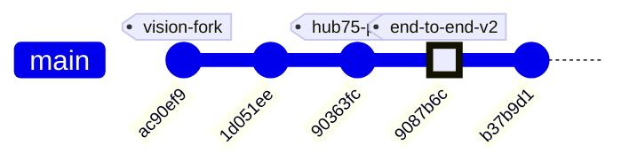
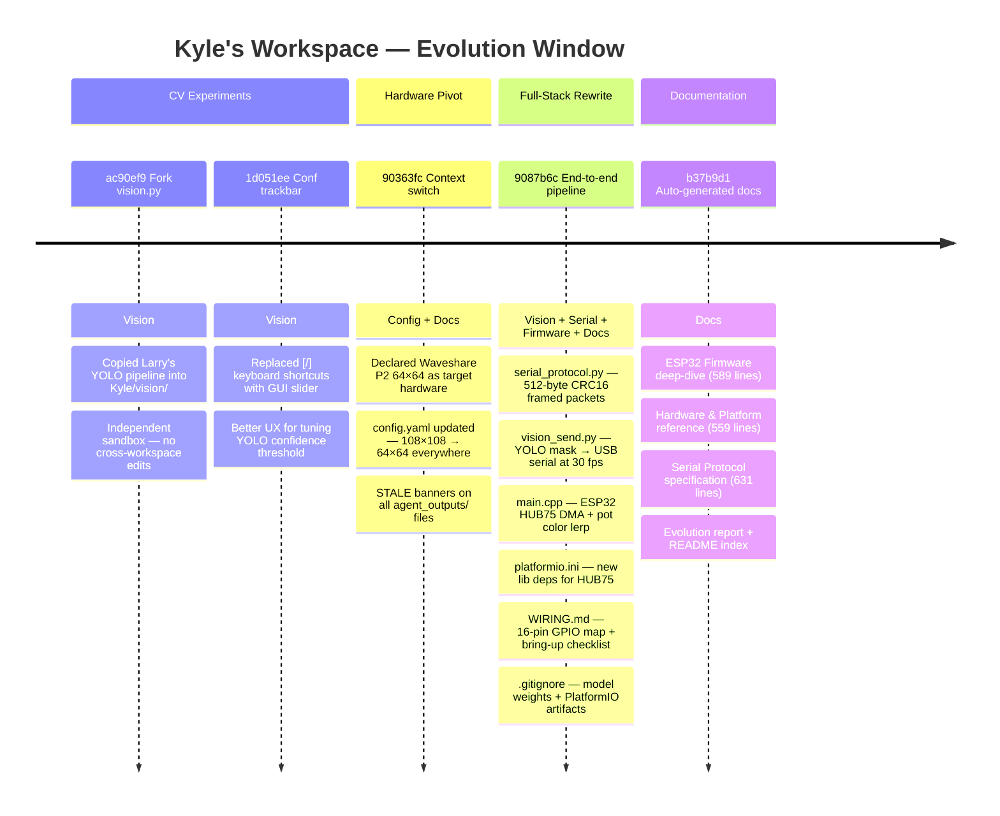
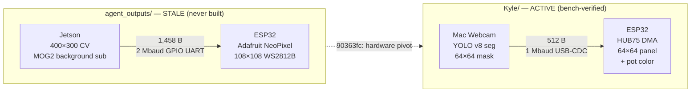

# ME135 Evolution Report

**Date:** 2026-05-07 18:24 &nbsp;|&nbsp; **Commit:** `b37b9d1`

---

## What Changed

This window covers **5 meaningful commits** (plus 5 auto-generated doc reports). The headline story: a theoretical, never-built 108×108 WS2812B system was scrapped and replaced with a working Mac→ESP32→HUB75 bench rig — all in one sprint. Changes grouped by subsystem:

### CV Pipeline / Vision (`Kyle/vision/`)

- **Fork of `Larry/vision.py`** (`ac90ef9`): Kyle copied Larry's YOLO-based person segmentation into his own workspace, establishing independent experiment ownership. No functional change — just workspace separation so two people can iterate without merge conflicts.

- **Confidence trackbar slider** (`1d051ee`): The `[` / `]` keyboard shortcuts for adjusting YOLO confidence were replaced with an OpenCV `createTrackbar` GUI slider. *Why it matters:* keyboard repeat rates made fine-tuning frustrating; a slider gives instant visual feedback and eliminates off-by-one annoyance.

- **`serial_protocol.py` — new production protocol** (`9087b6c`): Complete rewrite of the stale `agent_outputs/serial_protocol.py`. The payload shrinks from **1,458 → 512 bytes** (64×64 vs 108×108 bit-packed). CRC-16/CCITT-FALSE is preserved and cross-verified with the ESP32 side. Adds `pack_mask_64x64()` helper and a `SerialSender` class emitting framed 520-byte packets. The old version would crash with a `ValueError` on any 64×64 input — this one is built for the actual hardware.

- **`vision_send.py` — unified capture + transmit script** (`9087b6c`): Merges YOLO segmentation with live USB serial transport into one runnable file. Auto-detects macOS serial ports, supports `--no-serial` for CV-only tuning, and targets ~30 fps over 1 Mbaud (4.2 ms per frame on the wire). Previously, vision and serial were glued together by `agent_outputs/main.py` — a script nobody ever ran on real hardware.

- **`requirements.txt`** (`9087b6c`): First explicit dependency file in Kyle's workspace. Pins `ultralytics`, `opencv-python`, `pyserial`, `numpy`.

### ESP32 Firmware (`Kyle/firmware/me135_led_pot/`)

- **`main.cpp` — full rewrite** (`9087b6c`): The entire display controller was rebuilt for the HUB75 panel. Key differences from the old NeoPixel code:

  | Aspect | Old (`agent_outputs/`) | New (`Kyle/firmware/`) |
  |--------|----------------------|------------------------|
  | Display driver | Adafruit_NeoPixel (WS2812B) | ESP32-HUB75-MatrixPanel-DMA |
  | Resolution | 108×108 (11,664 LEDs) | 64×64 (4,096 pixels) |
  | Payload | 1,458 bytes | 512 bytes |
  | Baud rate | 2 Mbaud on GPIO UART | 1 Mbaud on USB-CDC |
  | Host | Jetson (GPIO 16/17) | Mac (USB serial) |
  | Color | Fixed white | **Pot-controlled white→red lerp** (EWMA-smoothed ADC) |
  | RX model | Blocking `receiveFrame()` | **Non-blocking `pollFrame()` state machine** |
  | Watchdog | Hard reset | Blanks panel after 5 s, self-recovers |

  The E_PIN (GPIO 32) for 1/32-scan 64-row panels is now correctly configured — entirely missing from the old code. `setRxBufferSize(2048)` is called before `Serial.begin()`, fixing a silent buffer-size bug caught during review.

- **`platformio.ini`** (`9087b6c`): Targets `espressif32@6.5.0` with `ESP32-HUB75-MatrixPanel-DMA@^3.0.11` — replacing the old Adafruit NeoPixel dependency. Clean PlatformIO project ready to `pio run`.

### Hardware Documentation (`Kyle/firmware/`)

- **`WIRING.md`** (`9087b6c`, 124 lines): A complete bench reference that didn't exist before. Contains the 16-pin HUB75E ↔ ESP32 GPIO mapping, power separation rules (panel on dedicated 5V/3A PSU — never share with ESP32 USB), the GPIO 12 strapping-pin caveat with a concrete fix, optional level-shifter guidance, a 9-step bring-up checklist, and a troubleshooting table. *Why it matters:* this is the "bus factor" document — hardware wiring knowledge was previously only in someone's head.

### Configuration & Context (`90363fc`)

- **`config.yaml`**: `display.type` changed from `ws2812b` to `hub75_waveshare_p2_64`. Panel dims dropped from 108×108 to 64×64. FPS target raised 10→60 (HUB75 DMA is fast). Processing output now 64×64, eliminating the old intermediate downsample stage entirely.
- **STALE banners** added to every file in `agent_outputs/` that references the old hardware: `esp32_main.cpp`, `serial_protocol.py`, `cv_pipeline.py`, `gpu_accelerated.py`. Each banner documents exactly what needs to change. The files are preserved as historical reference — not deleted.

### Project Hygiene (`.gitignore`)

- Added `*.pt` (YOLO model weights — 25+ MB, fetched on first run).
- Added `firmware/*/.pio/` and `firmware/*/.vscode/` (PlatformIO build artifacts).

### Auto-Generated Documentation (`Kyle/docs/`)

- Three new deep-dive feature docs generated: **ESP32 Firmware**, **Hardware & Platform**, and **Serial Communication Protocol** — totaling 1,779 lines of architectural reference.
- Evolution report `report_2026-05-07_1820.md` (666 lines) and README index updated.

### What Was NOT Touched

- **`Larry/`** — entirely separate workspace, untouched per the `CLAUDE.md` collaboration convention.
- **`agent_outputs/`** — kept as historical record with STALE banners. No code deleted, but nothing here runs on the current hardware.
- **`Kyle/vision/vision.py`** — the standalone YOLO viewer. `vision_send.py` forks its logic but doesn't modify the original.

---

## Evolution Timeline

### Commit History

### Subsystem Touch Map

Each commit's reach across the project — from a single-file experiment tweak to the full-stack rewrite at `9087b6c`:

### Architecture — Before and After

The project underwent a complete hardware pivot. Here's the data path in each era:

**The fundamental shift:** frame payload dropped from 1,458 → 512 bytes. The display driver moved from bit-banged NeoPixel to DMA-driven HUB75. The CV approach changed from hand-tuned background subtraction to YOLO neural-net segmentation. A potentiometer adds real-time color control — the project's first interactive physical element. And critically, this version actually runs on real hardware.

---

## Code Health Summary

**Overall Grade: D+**

The codebase has a solid architectural skeleton — clean module separation, consistent public APIs between CPU/GPU pipelines, a well-structured YAML config, and thoughtful safety features (watchdog, serial retry, signal handling). The orchestrator and doc-agent tooling is creative and functional.

However, **the system cannot run end-to-end**. The serial protocol and ESP32 firmware still target a 108×108 WS2812B panel that no longer exists. `serial_protocol.py` will raise `ValueError` the moment `main.py` sends a 64×64 frame. The ESP32 firmware uses entirely the wrong display driver (NeoPixel vs. HUB75). These aren't edge-case bugs — they are total blockers on the critical path.

Secondary concerns: missing `try/finally` cleanup in `main.py`, subprocess calls with no timeout, and hardcoded dimensions scattered across three languages with zero cross-validation. The stale-documentation banners show awareness of the problem but the code was never actually updated.

**Verdict:** Good design, broken plumbing. Fix PROTO-001, FW-001, and REL-001 before any integration testing.

---

## Improvement Proposals

| # | Title | Priority | Risk | Files |
|---|-------|----------|------|-------|
| PROTO-001 | serial_protocol.py hardcodes stale 108×108 panel dimensions — will crash at runtime | must-fix | high | `agent_outputs/serial_protocol.py` |
| FW-001 | esp32_main.cpp uses NeoPixel/WS2812B driver for a HUB75 panel — firmware is non-functional | must-fix | high | `agent_outputs/esp32_main.cpp, agent_outputs/platformio.ini` |
| REL-001 | main.py lacks try/finally for pipeline and serial cleanup — resource leak on exception | must-fix | medium | `agent_outputs/main.py` |
| REL-002 | subprocess.run() calls have no timeout — can hang indefinitely | nice-to-have | medium | `gdrive_sync.py, gdrive_setup.py, doc_agent.py` |
| PERF-001 | gpu_accelerated.py overwrites pre-allocated GpuMats, negating GPU memory reuse | nice-to-have | low | `agent_outputs/gpu_accelerated.py` |
| SEC-001 | orchestrator.py write_file tool allows overwriting any file in agent_outputs/ with no size limit | nice-to-have | medium | `orchestrator.py` |
| REL-003 | SerialSender lacks context manager — inconsistent with CVPipeline API | nice-to-have | low | `agent_outputs/serial_protocol.py, agent_outputs/main.py` |
| DESIGN-001 | Config-code dimension drift: output_width/height in config.yaml has no validation against serial_protocol constants | future | medium | `agent_outputs/serial_protocol.py, agent_outputs/main.py, agent_outputs/esp32_main.cpp` |
| PROP-001 | Stale agent_outputs/ files are still importable — risk of accidental use | nice-to-have | medium | `agent_outputs/serial_protocol.py, agent_outputs/cv_pipeline.py, agent_outputs/gpu_accelerated.py, agent_outputs/esp32_main.cpp, agent_outputs/main.py` |
| PROP-002 | Monitor baud mismatch: platformio.ini says 115200, firmware uses 1 Mbaud on same port | nice-to-have | low | `agent_outputs/platformio.ini` |
| PROP-003 | config.yaml serial section still references Jetson UART at 2 Mbaud | nice-to-have | low | `agent_outputs/config.yaml` |
| PROP-004 | No automated integration test between Python sender and ESP32 firmware | future | medium | `agent_outputs/serial_protocol.py, agent_outputs/esp32_main.cpp` |
| PROP-005 | Orchestrator still generates code for the stale 108×108 / WS2812B architecture | nice-to-have | medium | `orchestrator.py` |

### PROTO-001: serial_protocol.py hardcodes stale 108×108 panel dimensions — will crash at runtime
**Priority:** must-fix &nbsp;|&nbsp; **Risk:** high

**Problem:** serial_protocol.py defines PANEL_ROWS=108, PANEL_COLS=108, PAYLOAD_BYTES=1458 and pack_matrix() only accepts shapes (300,400) or (108,108). But config.yaml now sets output_width/height to 64×64, so the CV pipeline produces (64,64) matrices. Calling send_frame() with a (64,64) array hits the ValueError in pack_matrix(): 'Expected matrix shape (300, 400) or (108, 108), got (64, 64)'. The entire transmission path is broken.

**Proposed fix:** Update constants to PANEL_ROWS=64, PANEL_COLS=64, PAYLOAD_BYTES=512. Rewrite pack_matrix() to accept (64,64) directly (no downsampling needed since the pipeline already outputs panel-native resolution). Remove the downsample_to_panel() function and its cv2 import. Update unpack_matrix() to match. Update the docstrings and CV_ROWS/CV_COLS references or remove them entirely since the pipeline output now matches the panel.

**Affected files:** agent_outputs/serial_protocol.py

---

### FW-001: esp32_main.cpp uses NeoPixel/WS2812B driver for a HUB75 panel — firmware is non-functional
**Priority:** must-fix &nbsp;|&nbsp; **Risk:** high

**Problem:** The ESP32 firmware includes Adafruit_NeoPixel.h and drives 11,664 WS2812B LEDs on GPIO 13, but the actual hardware is a Waveshare RGB-Matrix-P2 64×64 HUB75 panel requiring the ESP32-HUB75-MatrixPanel-DMA library and 13 HUB75 control GPIOs. The firmware cannot drive the current hardware at all. Constants MATRIX_COLS/ROWS=108, PAYLOAD_BYTES=1458, LED_COUNT=11664 are all wrong. platformio.ini likely references Adafruit_NeoPixel as a dependency.

**Proposed fix:** Replace Adafruit_NeoPixel with ESP32-HUB75-MatrixPanel-DMA. Set MATRIX_COLS=MATRIX_ROWS=64, PAYLOAD_BYTES=512, FRAME_TOTAL_SIZE accordingly. Rewrite updateDisplay() to map bit-packed payload to the 64×64 HUB75 DMA buffer (dma_display->drawPixelRGB888). Configure HUB75_I2S_CFG with correct GPIO mapping for R1/G1/B1/R2/G2/B2/A/B/C/D/E/LAT/OE/CLK. Update platformio.ini lib_deps to mrfaptastic/ESP32 HUB75 LED Matrix Panel DMA Display.

**Affected files:** agent_outputs/esp32_main.cpp, agent_outputs/platformio.ini

---

### REL-001: main.py lacks try/finally for pipeline and serial cleanup — resource leak on exception
**Priority:** must-fix &nbsp;|&nbsp; **Risk:** medium

**Problem:** In main.py main(), pipeline.release() and sender.close() are only called at the end of the function after the while loop. If any unhandled exception occurs during the live loop (e.g., cv2 error, numpy error, keyboard interrupt not caught by signal handler), the camera (VideoCapture) and serial port remain open. The pipeline classes support context managers (__enter__/__exit__) but main.py doesn't use them.

**Proposed fix:** Wrap the calibration + live loop in a try/finally block: `try: ... finally: pipeline.release(); if sender: sender.close(); cv2.destroyAllWindows()`. Alternatively, use `with pipeline:` context manager for CVPipeline/GPUPipeline and add __enter__/__exit__ to SerialSender for the serial port.

**Affected files:** agent_outputs/main.py

---

### REL-002: subprocess.run() calls have no timeout — can hang indefinitely
**Priority:** nice-to-have &nbsp;|&nbsp; **Risk:** medium

**Problem:** In gdrive_sync.py get_changed_files() and gdrive_setup.py main(), multiple subprocess.run() calls to git and rclone have no timeout parameter. If git hangs (e.g., waiting for credentials, network lock) or rclone stalls (e.g., OAuth token refresh, network timeout), the entire process blocks forever. doc_agent.py get_git_context() has the same issue with its subprocess calls.

**Proposed fix:** Add timeout=30 (or appropriate value) to all subprocess.run() calls. Wrap in try/except subprocess.TimeoutExpired to log a warning and return empty/default results. For git commands, 10s is generous. For rclone network operations, 60s. Example: `subprocess.run([...], timeout=30, capture_output=True, text=True)`.

**Affected files:** gdrive_sync.py, gdrive_setup.py, doc_agent.py

---

### PERF-001: gpu_accelerated.py overwrites pre-allocated GpuMats, negating GPU memory reuse
**Priority:** nice-to-have &nbsp;|&nbsp; **Risk:** low

**Problem:** In GPUPipeline.__init__(), GpuMats like self._gpu_gray, self._gpu_blur, etc. are pre-allocated with cv2.cuda_GpuMat(). But in process_frame(), they are reassigned: `self._gpu_gray = cv2.cuda.cvtColor(self._gpu_frame, ...)` — this creates a NEW GpuMat and discards the pre-allocated one. Every frame allocates fresh GPU memory, causing unnecessary CUDA malloc/free cycles. On a Jetson Nano with limited memory bandwidth, this adds latency.

**Proposed fix:** Use the in-place/dst-parameter form of CUDA operations where available, or remove the pre-allocation since it's misleading. For OpenCV 4.8+ return-value style (as noted in the docstring), the pre-allocation in __init__ serves no purpose — delete the cv2.cuda_GpuMat() allocations and document that GpuMats are allocated on first use and reused by OpenCV internally via the same variable.

**Affected files:** agent_outputs/gpu_accelerated.py

---

### SEC-001: orchestrator.py write_file tool allows overwriting any file in agent_outputs/ with no size limit
**Priority:** nice-to-have &nbsp;|&nbsp; **Risk:** medium

**Problem:** In orchestrator.py execute_tool(), the write_file tool writes arbitrary content to agent_outputs/ with no size limit. A rogue or confused agent could write a multi-gigabyte file, exhausting disk. The path traversal check (Path(filename).name != filename) is correct for preventing directory escape, but there's no content size validation. Additionally, filenames like '.env' or '.gitignore' could be created in agent_outputs/ affecting repo behavior.

**Proposed fix:** Add a content size limit: `if len(tool_input['content']) > 500_000: return 'ERROR: Content exceeds 500KB limit.'`. Add a filename allowlist of permitted extensions: `.py`, `.md`, `.cpp`, `.yaml`, `.ini`, `.txt`. Reject dotfiles: `if filename.startswith('.'): return 'ERROR: Hidden files not allowed.'`.

**Affected files:** orchestrator.py

---

### REL-003: SerialSender lacks context manager — inconsistent with CVPipeline API
**Priority:** nice-to-have &nbsp;|&nbsp; **Risk:** low

**Problem:** CVPipeline and GPUPipeline both implement __enter__/__exit__ for use as context managers, ensuring camera resources are released. SerialSender does not, despite holding an open serial port (self._ser). If an exception occurs after sender creation but before sender.close() in main.py, the serial port stays open and may be locked for other processes.

**Proposed fix:** Add __enter__ and __exit__ methods to SerialSender: `def __enter__(self): return self` and `def __exit__(self, *exc): self.close(); return False`. This enables `with SerialSender(config) as sender:` usage in main.py for guaranteed cleanup.

**Affected files:** agent_outputs/serial_protocol.py, agent_outputs/main.py

---

### DESIGN-001: Config-code dimension drift: output_width/height in config.yaml has no validation against serial_protocol constants
**Priority:** future &nbsp;|&nbsp; **Risk:** medium

**Problem:** The system has a critical implicit contract: config.yaml output_width/height must match serial_protocol.py PANEL_ROWS/PANEL_COLS which must match esp32_main.cpp MATRIX_COLS/MATRIX_ROWS. These are defined independently as magic numbers in three different files/languages with no cross-validation. This is the root cause of the PROTO-001 and FW-001 bugs. Any future dimension change will require coordinated edits across Python, C++, and YAML.

**Proposed fix:** In serial_protocol.py, read PANEL_ROWS/PANEL_COLS from the config dict passed to SerialSender.__init__() instead of hardcoded constants. Compute PAYLOAD_BYTES dynamically: `self._payload_bytes = (rows * cols) // 8`. Add a config validation step in main.py that asserts `config['processing']['output_width'] == config['display']['panel_width']`. For ESP32, implement a startup handshake where Jetson sends expected dimensions for firmware to validate.

**Affected files:** agent_outputs/serial_protocol.py, agent_outputs/main.py, agent_outputs/esp32_main.cpp

---

### PROP-001: Stale agent_outputs/ files are still importable — risk of accidental use
**Priority:** nice-to-have &nbsp;|&nbsp; **Risk:** medium

**Problem:** The old serial_protocol.py, esp32_main.cpp, and cv_pipeline.py in agent_outputs/ carry STALE comment banners but remain valid, importable Python/C++. A new contributor (or the orchestrator itself) could accidentally wire up the wrong protocol (108×108 / 2 Mbaud) against the new firmware (64×64 / 1 Mbaud), causing silent data corruption or immediate ValueError crashes.

**Proposed fix:** Add a runtime guard at the top of each stale Python file: `raise ImportError('STALE — use Kyle/vision/serial_protocol.py instead')`. For esp32_main.cpp, wrap the body in `#error "STALE — see Kyle/firmware/me135_led_pot/main.cpp"`. Alternatively, move the entire agent_outputs/ directory to agent_outputs_archive/ to make the break obvious at the filesystem level.

**Affected files:** agent_outputs/serial_protocol.py, agent_outputs/cv_pipeline.py, agent_outputs/gpu_accelerated.py, agent_outputs/esp32_main.cpp, agent_outputs/main.py

---

### PROP-002: Monitor baud mismatch: platformio.ini says 115200, firmware uses 1 Mbaud on same port
**Priority:** nice-to-have &nbsp;|&nbsp; **Risk:** low

**Problem:** The old agent_outputs/platformio.ini sets monitor_speed=115200 and the old firmware uses Serial at 115200 for debug. But the new firmware (Kyle/firmware/) uses Serial at 1,000,000 baud for data transport over USB-CDC. If the new platformio.ini also defaults monitor_speed to 115200, running `pio device monitor` will show garbage. Additionally, the monitor and vision_send.py cannot share the serial port simultaneously.

**Proposed fix:** Set monitor_speed=1000000 in the new platformio.ini. Add a prominent warning in WIRING.md and the firmware README that the serial monitor and vision_send.py cannot run simultaneously — they fight over the same USB-CDC port. For richer debugging, consider adding a second UART (e.g. Serial1 on GPIO 16/17) at 115200 for debug output, keeping USB-CDC exclusively for data.

**Affected files:** agent_outputs/platformio.ini

---

### PROP-003: config.yaml serial section still references Jetson UART at 2 Mbaud
**Priority:** nice-to-have &nbsp;|&nbsp; **Risk:** low

**Problem:** config.yaml's serial section specifies port='/dev/ttyUSB0' and baud_rate=2000000 — matching the old Jetson UART setup. The new firmware expects USB-CDC at 1 Mbaud, and the host is a Mac (port pattern /dev/cu.usbserial-*). Any code that reads config.yaml for serial parameters (like the old main.py) will connect at the wrong baud to the wrong port. The new vision_send.py bypasses config.yaml entirely with its own auto-detect, but the config file is supposed to be the 'single source of truth' per its own header comment.

**Proposed fix:** Update config.yaml serial section: port to '/dev/cu.usbserial-*' (or 'auto'), baud_rate to 1000000. Add a comment noting that vision_send.py auto-detects the port but this value is the fallback. This keeps config.yaml honest as the canonical reference.

**Affected files:** agent_outputs/config.yaml

---

### PROP-004: No automated integration test between Python sender and ESP32 firmware
**Priority:** future &nbsp;|&nbsp; **Risk:** medium

**Problem:** The serial protocol (CRC-16, framing, 512-byte payloads) is implemented independently in Python and C++. The only verification is a shared CRC test vector in comments. If either side drifts (e.g., endianness of length field, bit-packing order), the mismatch will only surface on a physical bench with both devices connected — a slow, frustrating debug loop.

**Proposed fix:** Create a loopback test: (1) A Python script that sends a known 64×64 pattern to the ESP32 and reads back an echo or ACK containing a checksum of the decoded pixel data. (2) A minimal ESP32 test firmware that receives a frame, unpacks it, computes a pixel checksum, and sends it back. This can be run in CI with a USB-connected ESP32 dev board, or at minimum as a documented manual test procedure.

**Affected files:** agent_outputs/serial_protocol.py, agent_outputs/esp32_main.cpp

---

### PROP-005: Orchestrator still generates code for the stale 108×108 / WS2812B architecture
**Priority:** nice-to-have &nbsp;|&nbsp; **Risk:** medium

**Problem:** orchestrator.py's PROJECT_CONTEXT was partially updated (it now says 64×64 and HUB75), but the 7 agents write their output to agent_outputs/ — the same directory now marked STALE. If someone reruns the orchestrator, it will overwrite the STALE-bannered files with fresh code that may or may not match the new Kyle/firmware/ and Kyle/vision/ implementations, creating confusion about which version is canonical.

**Proposed fix:** Either (a) add a guard in orchestrator.py that refuses to overwrite files with STALE banners unless --force is passed, or (b) change OUTPUT_DIR to a new path like agent_outputs_v2/ so re-runs don't clobber the historical record. Also update the agent task prompts to reference the new 64×64 / HUB75 / 1 Mbaud parameters explicitly so generated code matches the live hardware.

**Affected files:** orchestrator.py

---
