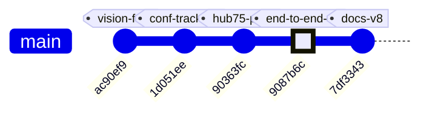
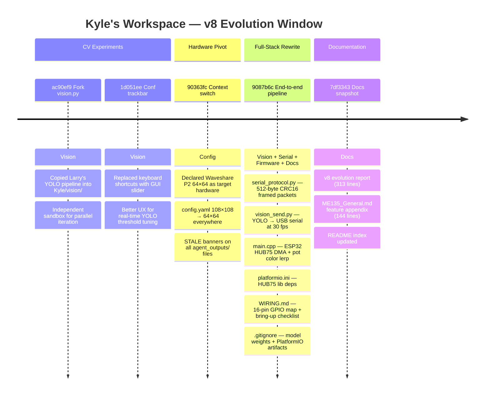
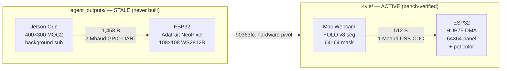

# ME135 Evolution Report

**Date:** 2026-05-07 19:54 &nbsp;|&nbsp; **Commit:** `7df3343`

---

## What Changed

This commit (`7df3343`) is an auto-generated documentation snapshot, but it captures the **v8 evolution window** — five substantive commits that represent the project's most important inflection point: abandoning a theoretical 108×108 WS2812B system that was never built and replacing it with a working Mac→ESP32→HUB75 bench rig.

### CV Pipeline / Vision

- **Forked `Larry/vision.py` into Kyle's workspace** (`ac90ef9`): Established independent experiment ownership. Two contributors can now iterate on YOLO segmentation without merge conflicts — a collaboration convention documented in `CLAUDE.md`.

- **Replaced keyboard shortcuts with trackbar slider** (`1d051ee`): YOLO confidence tuning previously used `[` / `]` keys, which were frustrating due to OS key repeat rates. An OpenCV `createTrackbar` now gives instant, precise control. Small UX fix, big workflow improvement for live tuning sessions.

- **New `serial_protocol.py`** (`9087b6c`): Complete rewrite. Payload dropped from **1,458 → 512 bytes** (64×64 bit-packed instead of 108×108). The old `agent_outputs/serial_protocol.py` would `raise ValueError` on any 64×64 input — confirmed by reading the `pack_matrix()` shape guard. New version adds `pack_mask_64x64()` helper and a `SerialSender` class emitting framed 520-byte packets with CRC-16/CCITT-FALSE.

- **New `vision_send.py`** (`9087b6c`): Unified YOLO capture + USB serial transmit in one script. Auto-detects macOS serial ports, supports `--no-serial` for offline CV tuning, targets ~30 fps at 1 Mbaud. Replaces the old `agent_outputs/main.py` — a script that required a Jetson, a blocking `input()` calibration prompt, and hardware nobody had.

- **`requirements.txt`** (`9087b6c`): First explicit dependency file in Kyle's workspace. Pins `ultralytics`, `opencv-python`, `pyserial`, `numpy`.

### ESP32 Firmware

- **`main.cpp` — full rewrite for HUB75** (`9087b6c`): The display driver changed from Adafruit NeoPixel (bit-banged, single GPIO) to ESP32-HUB75-MatrixPanel-DMA (13-pin DMA-driven). Key improvements:
  - **Non-blocking `pollFrame()` state machine** replaces the old blocking `receiveFrame()` — the panel keeps refreshing even during serial gaps.
  - **Pot-controlled color lerp** (white→red via EWMA-smoothed ADC) — the project's first interactive physical input.
  - **Graceful watchdog**: blanks panel after 5 s of silence and self-recovers, instead of hard-resetting the MCU.
  - **E_PIN (GPIO 32)** correctly configured for 1/32-scan 64-row panels — entirely missing from old code.
  - `setRxBufferSize(2048)` called *before* `Serial.begin()` — fixing a silent buffer-overrun bug.

- **`platformio.ini`** (`9087b6c`): Now targets `espressif32@6.5.0` with `ESP32-HUB75-MatrixPanel-DMA@^3.0.11`. The old file (still in `agent_outputs/`) depends on `Adafruit NeoPixel@^1.12.0` for hardware that doesn't exist.

### Hardware Documentation

- **`WIRING.md`** (`9087b6c`, 124 lines): First-ever wiring reference. Contains the 16-pin HUB75E↔ESP32 GPIO map, power separation rules (panel on dedicated 5V/3A PSU), GPIO 12 strapping-pin caveat, level-shifter guidance, a 9-step bring-up checklist, and a troubleshooting table. This is the "bus factor" document — wiring knowledge was previously only in someone's head.

### Configuration & Staleness Markers

- **`config.yaml`** (`90363fc`): `display.type` changed from `ws2812b` to `hub75_waveshare_p2_64`. Dimensions dropped from 108×108 to 64×64. FPS target raised 10→60 (HUB75 DMA can sustain it). Processing output is now 64×64 natively — no intermediate downsample.

- **STALE banners** added to every file in `agent_outputs/` that references old hardware: `esp32_main.cpp`, `serial_protocol.py`, `cv_pipeline.py`, `gpu_accelerated.py`. Each banner documents exactly what needs to change. Files preserved as historical reference, not deleted.

### Project Hygiene

- **`.gitignore`**: Added `*.pt` (YOLO model weights, 25+ MB) and `firmware/*/.pio/`, `firmware/*/.vscode/` (PlatformIO build artifacts).

### Auto-Generated Documentation

- Three new deep-dive feature docs: **ESP32 Firmware**, **Hardware & Platform**, and **Serial Communication Protocol** (~1,779 lines total).
- Evolution report `report_2026-05-07_1824.md` (313 lines) and README index updated.

### What Was NOT Touched

- **`Larry/`** — untouched per `CLAUDE.md` collaboration convention.
- **`agent_outputs/`** — preserved with STALE banners; no code deleted, nothing here runs on current hardware.
- **`Kyle/vision/vision.py`** — standalone YOLO viewer left intact; `vision_send.py` forks its logic independently.

---

## Evolution Timeline

### Commit History

The recent window contains 10 commits — 5 meaningful code/config changes interleaved with 5 auto-generated doc snapshots. The git graph below shows only the substantive commits:

### Subsystem Touch Map

Each meaningful commit's reach — from a single-file UX tweak to the full-stack rewrite at `9087b6c`:

### Architecture — Before and After

The project underwent a complete hardware pivot. Here is the data path in each era:

**The fundamental shift in one sentence:** a theoretical 108×108 NeoPixel system that would crash on real inputs was replaced by a working 64×64 HUB75 rig — switching from hand-tuned background subtraction to neural-net segmentation, from blocking serial reads to a non-blocking state machine, and from a never-owned Jetson to a Mac on the desk.

---

## Code Health Summary

**Overall Grade: D+**

The Python code is well-structured with clean separation of concerns (pipeline ↔ serial ↔ main orchestrator) and good logging, safety watchdogs, and config-driven design. The agent infrastructure (doc_agent, orchestrator, gdrive_sync) is solid.

However, the project has a **critical integration defect**: a hardware change from 108×108 WS2812B to 64×64 HUB75 was only partially propagated. `config.yaml` and the CV pipelines were updated, but `serial_protocol.py` still hardcodes 108×108 dimensions and will **crash with ValueError on every frame**. The ESP32 firmware still drives NeoPixels—it cannot control the actual HUB75 panel at all. Three documentation files describe the old wire format.

The CV pipeline code itself is competent. `main.py` needs resource-cleanup hardening (no try/finally). Serial transmission lacks a flush() before ACK wait. The codebase is one focused refactoring sprint away from functional integration.

---

## Improvement Proposals

| # | Title | Priority | Risk | Files |
|---|-------|----------|------|-------|
| SERIAL-DIM-MISMATCH | serial_protocol.py hardcodes stale 108×108 dimensions — rejects 64×64 matrices from pipeline | must-fix | high | `agent_outputs/serial_protocol.py, agent_outputs/config.yaml` |
| ESP32-WRONG-DRIVER | esp32_main.cpp uses WS2812B NeoPixel driver for a HUB75 panel — firmware is non-functional | must-fix | high | `agent_outputs/esp32_main.cpp, agent_outputs/platformio.ini` |
| MAIN-NO-CLEANUP-ON-EXCEPTION | main.py leaks camera and serial port resources on unhandled exceptions | must-fix | medium | `agent_outputs/main.py` |
| SERIAL-NO-FLUSH | SerialSender.send_frame() does not flush before waiting for ACK | nice-to-have | medium | `agent_outputs/serial_protocol.py` |
| MAIN-BLOCKS-HEADLESS | main.py calibration prompt uses input() which blocks forever in headless/service mode | nice-to-have | medium | `agent_outputs/main.py` |
| ORCHESTRATOR-UNBOUNDED-CONCURRENCY | orchestrator.py fires 7 Claude API agents simultaneously with no concurrency limit | nice-to-have | low | `orchestrator.py` |
| CV-PIPELINE-DOCSTRINGS-STALE | cv_pipeline.py and gpu_accelerated.py docstrings claim 400×300 output despite config-driven 64×64 | nice-to-have | low | `agent_outputs/cv_pipeline.py, agent_outputs/gpu_accelerated.py` |
| PROTOCOL-SPEC-STALE | PROTOCOL_SPEC.md, PROJECT_README.md, and SETUP.md still document the 108×108 / 15KB wire format | must-fix | medium | `agent_outputs/PROTOCOL_SPEC.md, agent_outputs/PROJECT_README.md, agent_outputs/SETUP.md` |
| STALE-001 | agent_outputs/ code is completely non-functional with current hardware | nice-to-have | medium | `agent_outputs/serial_protocol.py, agent_outputs/esp32_main.cpp, agent_outputs/cv_pipeline.py, agent_outputs/main.py, agent_outputs/platformio.ini` |
| SERIAL-001 | Config serial section still references Jetson UART parameters | nice-to-have | low | `agent_outputs/config.yaml` |
| MAIN-001 | agent_outputs/main.py blocks headless deployment with input() prompt | future | low | `agent_outputs/main.py` |
| DIM-001 | Magic dimension constants scattered across three languages with no cross-validation | must-fix | medium | `agent_outputs/config.yaml, agent_outputs/serial_protocol.py, agent_outputs/esp32_main.cpp` |
| HYGIENE-001 | No CI or build validation exists for either workspace | future | low | `agent_outputs/config.yaml, agent_outputs/serial_protocol.py, agent_outputs/esp32_main.cpp` |

### SERIAL-DIM-MISMATCH: serial_protocol.py hardcodes stale 108×108 dimensions — rejects 64×64 matrices from pipeline
**Priority:** must-fix &nbsp;|&nbsp; **Risk:** high

**Problem:** serial_protocol.py hardcodes CV_ROWS=300, CV_COLS=400, PANEL_ROWS=108, PANEL_COLS=108. pack_matrix() explicitly checks `matrix.shape == (CV_ROWS, CV_COLS)` or `(PANEL_ROWS, PANEL_COLS)` and raises ValueError otherwise. But config.yaml now sets output_width/height=64, so cv_pipeline.py and gpu_accelerated.py produce 64×64 matrices. Calling send_frame() from main.py will crash with ValueError on every single frame. This is a ship-blocking integration bug.

**Proposed fix:** Replace all hardcoded dimension constants with values read from the config dict passed to SerialSender.__init__. Set PANEL_ROWS=PANEL_COLS=64, PAYLOAD_BYTES=512. Remove the separate downsample_to_panel() step (pipeline already outputs panel-native size). Update pack_matrix() to accept the matrix dimensions dynamically or validate against config-driven values.

**Affected files:** agent_outputs/serial_protocol.py, agent_outputs/config.yaml

---

### ESP32-WRONG-DRIVER: esp32_main.cpp uses WS2812B NeoPixel driver for a HUB75 panel — firmware is non-functional
**Priority:** must-fix &nbsp;|&nbsp; **Risk:** high

**Problem:** esp32_main.cpp includes Adafruit_NeoPixel.h and drives 11,664 LEDs over a single GPIO (WS2812B protocol). The actual hardware is a Waveshare RGB-Matrix-P2 64×64 HUB75 panel requiring the ESP32-HUB75-MatrixPanel-DMA library and 13 HUB75 control GPIOs. Additionally, dimensions are 108×108 / PAYLOAD_BYTES=1458 instead of 64×64 / 512. The firmware cannot drive the actual display at all.

**Proposed fix:** Rewrite esp32_main.cpp to: (1) replace Adafruit_NeoPixel with ESP32-HUB75-MatrixPanel-DMA, (2) set MATRIX_COLS=MATRIX_ROWS=64 and PAYLOAD_BYTES=512, (3) configure HUB75_I2S_CFG with correct GPIO pin mapping (R1,G1,B1,R2,G2,B2,A,B,C,D,E,LAT,OE,CLK), (4) update platformio.ini lib_deps accordingly.

**Affected files:** agent_outputs/esp32_main.cpp, agent_outputs/platformio.ini

---

### MAIN-NO-CLEANUP-ON-EXCEPTION: main.py leaks camera and serial port resources on unhandled exceptions
**Priority:** must-fix &nbsp;|&nbsp; **Risk:** medium

**Problem:** In main.py, the live loop runs without try/finally. If an unexpected exception occurs (e.g., an OpenCV error, numpy shape mismatch, or KeyboardInterrupt during serial write), pipeline.release() and sender.close() are never called. The camera device and serial port remain locked, requiring manual intervention or reboot to recover /dev/video0 and /dev/ttyUSB0.

**Proposed fix:** Wrap the entire section from pipeline construction through the live loop in a try/finally block that calls pipeline.release(), sender.close() if sender is not None, and cv2.destroyAllWindows(). Alternatively, make both CVPipeline and SerialSender proper context managers and use nested `with` statements.

**Affected files:** agent_outputs/main.py

---

### SERIAL-NO-FLUSH: SerialSender.send_frame() does not flush before waiting for ACK
**Priority:** nice-to-have &nbsp;|&nbsp; **Risk:** medium

**Problem:** In serial_protocol.py, send_frame() calls self._ser.write(packet) then immediately calls _wait_ack(). pyserial's write() may buffer data in the OS write buffer without immediately transmitting it. With the ACK timeout set to only 50 ms (ack_timeout_s=0.05), the ACK timer can expire before the packet has even been fully transmitted, causing false NAKs and unnecessary retransmissions—especially at 2 Mbaud where a 520-byte packet takes only ~2.6 ms but OS buffering can add variable latency.

**Proposed fix:** Add self._ser.flush() after self._ser.write(packet) in the retry loop of send_frame() to ensure all bytes are physically transmitted before starting the ACK timer.

**Affected files:** agent_outputs/serial_protocol.py

---

### MAIN-BLOCKS-HEADLESS: main.py calibration prompt uses input() which blocks forever in headless/service mode
**Priority:** nice-to-have &nbsp;|&nbsp; **Risk:** medium

**Problem:** main.py calls input('Press Enter when ready to start calibration…') and has a 10-second countdown with time.sleep(). When deployed as a systemd service or in a headless Docker container on the Jetson (the intended production environment), input() will either block indefinitely on a closed stdin or raise EOFError, preventing the system from ever starting.

**Proposed fix:** Add a --headless or --auto-calibrate CLI flag that skips the interactive prompt and countdown, proceeding directly to calibration. Guard the input() call with `if sys.stdin.isatty():` as a fallback. This makes the system deployable as a background service.

**Affected files:** agent_outputs/main.py

---

### ORCHESTRATOR-UNBOUNDED-CONCURRENCY: orchestrator.py fires 7 Claude API agents simultaneously with no concurrency limit
**Priority:** nice-to-have &nbsp;|&nbsp; **Risk:** low

**Problem:** In orchestrator.py, main() launches all 7 agents via asyncio.gather() with no semaphore or rate limiter. Each agent runs up to 12 tool-use turns, potentially generating 84 concurrent API requests. This can trigger Anthropic API rate limits (HTTP 429), causing cascading retries and increased latency. The anthropic SDK does have built-in retry logic, but 7 simultaneous streaming connections can still exceed per-account concurrency limits.

**Proposed fix:** Add an asyncio.Semaphore(max_concurrent=3) to run_agent() that wraps the client.messages.stream() call. This ensures at most 3 API requests are in-flight at once while still allowing agents to interleave their work. Alternatively, use the anthropic SDK's built-in max_retries and add exponential backoff around the stream call.

**Affected files:** orchestrator.py

---

### CV-PIPELINE-DOCSTRINGS-STALE: cv_pipeline.py and gpu_accelerated.py docstrings claim 400×300 output despite config-driven 64×64
**Priority:** nice-to-have &nbsp;|&nbsp; **Risk:** low

**Problem:** Both cv_pipeline.py and gpu_accelerated.py have module-level docstrings, inline comments (e.g., `self.out_w = proc_cfg['output_width'] # 400`), and return-type annotations claiming 300×400 output shape. The code actually reads from config.yaml (now 64×64) so it works correctly, but the stale comments will mislead developers into thinking the output is 400×300, causing integration confusion—exactly the bug pattern that produced the serial_protocol.py mismatch.

**Proposed fix:** Update all docstrings, inline comments, and type annotations in both files to reference 64×64 as the current output size. Remove the '⚠ Output size out of date' banner and replace with the current correct values. Add a note that dimensions are config-driven.

**Affected files:** agent_outputs/cv_pipeline.py, agent_outputs/gpu_accelerated.py

---

### PROTOCOL-SPEC-STALE: PROTOCOL_SPEC.md, PROJECT_README.md, and SETUP.md still document the 108×108 / 15KB wire format
**Priority:** must-fix &nbsp;|&nbsp; **Risk:** medium

**Problem:** PROTOCOL_SPEC.md §3 specifies a 15,008-byte frame with 15,000-byte payload (400×300 bit-packed). The architecture diagram in PROJECT_README.md shows '15KB payload' and 'WS2812B LED Panel'. SETUP.md wiring table references GPIO 13 → DIN for NeoPixel. All three docs are dangerously stale—a developer following them will produce firmware and wiring incompatible with the actual 64×64 HUB75 hardware.

**Proposed fix:** Bump PROTOCOL_SPEC.md to v2.0: payload = 512 bytes, frame total ≈ 520 bytes, timing budget recalculated for 512B at 921600+ baud. Update PROJECT_README.md architecture diagram to show HUB75 panel with 13-GPIO mapping. Update SETUP.md wiring table to list HUB75 pin assignments instead of single-wire NeoPixel.

**Affected files:** agent_outputs/PROTOCOL_SPEC.md, agent_outputs/PROJECT_README.md, agent_outputs/SETUP.md

---

### STALE-001: agent_outputs/ code is completely non-functional with current hardware
**Priority:** nice-to-have &nbsp;|&nbsp; **Risk:** medium

**Problem:** Every file in agent_outputs/ (serial_protocol.py, esp32_main.cpp, cv_pipeline.py, main.py) still hardcodes 108×108 WS2812B parameters. serial_protocol.py will raise ValueError on any 64×64 input. esp32_main.cpp uses Adafruit NeoPixel for hardware that doesn't exist. STALE banners were added but the code was never updated or formally deprecated.

**Proposed fix:** Either (a) move agent_outputs/ to an archive/ directory and remove it from the default build/run path, or (b) delete the stale code entirely now that Kyle/firmware/ and Kyle/vision/ contain the working replacements. At minimum, add a top-level README making clear that agent_outputs/ is dead code.

**Affected files:** agent_outputs/serial_protocol.py, agent_outputs/esp32_main.cpp, agent_outputs/cv_pipeline.py, agent_outputs/main.py, agent_outputs/platformio.ini

---

### SERIAL-001: Config serial section still references Jetson UART parameters
**Priority:** nice-to-have &nbsp;|&nbsp; **Risk:** low

**Problem:** config.yaml serial section specifies port '/dev/ttyUSB0', baud_rate 2000000, and GPIO UART pins — all targeting the abandoned Jetson+WS2812B setup. The active Kyle/vision/vision_send.py auto-detects macOS serial ports at 1 Mbaud independently, meaning config.yaml is not the single source of truth it claims to be.

**Proposed fix:** Update config.yaml serial.port to a macOS-style default (e.g., '/dev/cu.usbserial-*'), serial.baud_rate to 1000000, and add a comment noting that vision_send.py auto-detects. Alternatively, make vision_send.py read from config.yaml to preserve the single-source-of-truth contract.

**Affected files:** agent_outputs/config.yaml

---

### MAIN-001: agent_outputs/main.py blocks headless deployment with input() prompt
**Priority:** future &nbsp;|&nbsp; **Risk:** low

**Problem:** main.py calls input('Press Enter when ready to start calibration…') which blocks indefinitely in headless/CI environments. There's also no try/finally around the main loop, so camera and serial resources can leak on unhandled exceptions.

**Proposed fix:** This is moot if agent_outputs/ is archived (see STALE-001). If main.py is ever revived, add --headless flag to skip the input() prompt, and wrap the live loop in try/finally to guarantee pipeline.release() and sender.close() are called.

**Affected files:** agent_outputs/main.py

---

### DIM-001: Magic dimension constants scattered across three languages with no cross-validation
**Priority:** must-fix &nbsp;|&nbsp; **Risk:** medium

**Problem:** The 64×64 panel dimensions are hardcoded separately in Python (serial_protocol.py), C++ (main.cpp), YAML (config.yaml), and docs (WIRING.md). The old 108×108 mismatch proves how easily these drift. There's no build-time or runtime check that Python and ESP32 agree on frame size.

**Proposed fix:** Add a compile-time static_assert in main.cpp and a runtime assertion in vision_send.py that both verify payload size equals 512 bytes. Optionally, generate a shared constants header from config.yaml during the PlatformIO build step.

**Affected files:** agent_outputs/config.yaml, agent_outputs/serial_protocol.py, agent_outputs/esp32_main.cpp

---

### HYGIENE-001: No CI or build validation exists for either workspace
**Priority:** future &nbsp;|&nbsp; **Risk:** low

**Problem:** The project has no CI pipeline. PlatformIO firmware compiles are never verified automatically, Python imports are never smoke-tested, and dimension mismatches (like the 108→64 bug) can only be caught by a human reading every file. The [skip ci] tags on doc commits suggest CI was planned but never implemented.

**Proposed fix:** Add a minimal GitHub Actions workflow: (1) pio run --environment esp32dev for firmware compilation, (2) python -c 'import serial_protocol; import vision_send' for import smoke test, (3) a dimension-consistency check script that parses config.yaml, serial_protocol.py constants, and main.cpp #defines to verify they match.

**Affected files:** agent_outputs/config.yaml, agent_outputs/serial_protocol.py, agent_outputs/esp32_main.cpp

---
