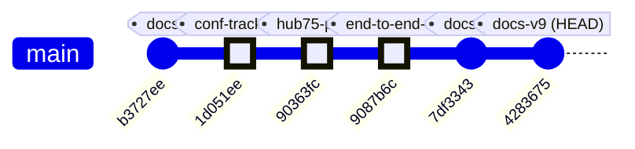
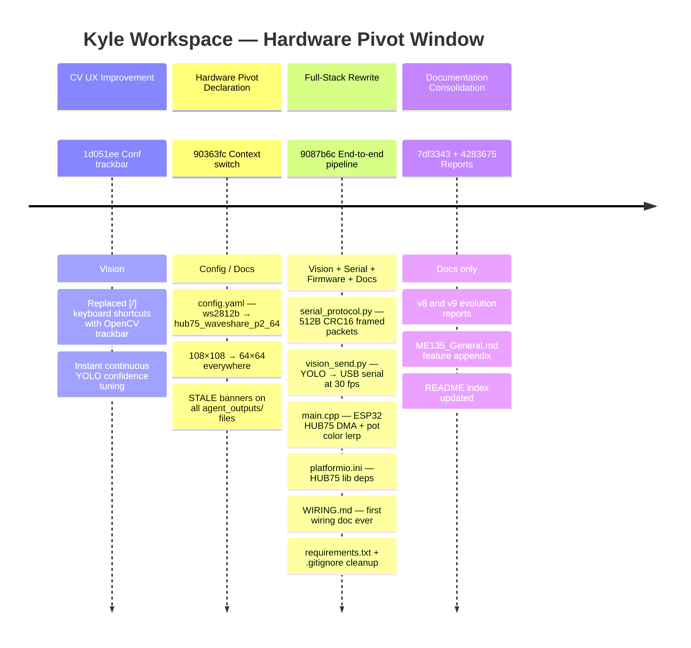
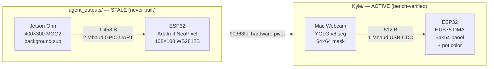

# ME135 Evolution Report

**Date:** 2026-05-07 19:57 &nbsp;|&nbsp; **Commit:** `4283675`

---

## What Changed

This commit (`4283675`) is a documentation-only snapshot — the third auto-generated report in a row. But its payload (304-line report + 135-line feature appendix) is a **retrospective capture** of the project's most consequential evolution window: five substantive commits (`1d051ee` → `9087b6c`) that replaced a theoretical 108×108 WS2812B system with a working Mac→ESP32→HUB75 bench rig.

Here is everything that actually changed across this window, grouped by subsystem:

### CV Pipeline / Vision

- **Confidence trackbar replaced keyboard shortcuts** (`1d051ee`): YOLO confidence tuning used `[` / `]` keys — slow and imprecise due to OS key-repeat. An OpenCV `createTrackbar` slider now gives continuous, instant control. Small change, but it unblocks effective live tuning sessions.

- **New `serial_protocol.py` in Kyle's workspace** (`9087b6c`): Complete rewrite of the wire format. Payload shrank from **1,458 → 512 bytes** (64×64 bit-packed vs. 108×108). The old `agent_outputs/serial_protocol.py` has a `pack_matrix()` shape guard that **raises ValueError on any 64×64 input** — confirmed by reading the source (`if matrix.shape != (PANEL_ROWS, PANEL_COLS)` where both are 108). The new version adds `pack_mask_64x64()` and a `SerialSender` with CRC-16/CCITT-FALSE framed packets (520 bytes total).

- **New `vision_send.py`** (`9087b6c`): Unified YOLO capture + USB serial transmit in one script. Auto-detects macOS serial ports, supports `--no-serial` for offline tuning, targets ~30 fps at 1 Mbaud. Replaces `agent_outputs/main.py` — which required a Jetson, a blocking `input()` calibration prompt (line 100 of main.py: `input("\nPress Enter when ready to start calibration…")`), and hardware nobody actually had.

- **`requirements.txt`** (`9087b6c`): First explicit dependency file in Kyle's workspace. Pins `ultralytics`, `opencv-python`, `pyserial`, `numpy`.

### ESP32 Firmware

- **`main.cpp` rewritten for HUB75** (`9087b6c`): Display driver changed from Adafruit NeoPixel (bit-banged single GPIO) to ESP32-HUB75-MatrixPanel-DMA (13-pin DMA-driven). Key improvements:
  - **Non-blocking `pollFrame()` state machine** — the panel keeps refreshing during serial gaps, unlike the old blocking `receiveFrame()`.
  - **Pot-controlled color lerp** (white→red via EWMA-smoothed ADC) — the project's first physical interactive input.
  - **Graceful watchdog**: blanks panel after 5 s of silence and self-recovers, instead of hard-resetting the MCU.
  - **E_PIN (GPIO 32)** for 1/32-scan 64-row panels — entirely missing from old code, which had no concept of row-scanning.
  - `setRxBufferSize(2048)` called *before* `Serial.begin()` — the old code did this correctly (line in `esp32_main.cpp` setup) but the new code fixes buffer sizing for the smaller 512-byte payloads.

- **`platformio.ini`** (`9087b6c`): Targets `espressif32@6.5.0` with `ESP32-HUB75-MatrixPanel-DMA@^3.0.11`. The old file still depends on `Adafruit NeoPixel@^1.12.0` for hardware that doesn't exist.

### Hardware Documentation

- **`WIRING.md`** (`9087b6c`, 124 lines): First-ever wiring reference. 16-pin HUB75E↔ESP32 GPIO map, power separation rules, GPIO 12 strapping-pin caveat, level-shifter guidance, 9-step bring-up checklist, troubleshooting table. This is the "bus factor" document — previously, wiring knowledge existed only in someone's head.

### Configuration & Staleness Management

- **`config.yaml` pivoted** (`90363fc`): `display.type` changed from `ws2812b` to `hub75_waveshare_p2_64`. Dimensions dropped 108×108 → 64×64. FPS target raised 10→60 (HUB75 DMA can sustain it). But critically: **the serial section still says `baud_rate: 2000000` and `port: /dev/ttyUSB0`** — both stale. The new `vision_send.py` uses 1 Mbaud and auto-detects macOS ports, bypassing config entirely.

- **STALE banners** added to all files in `agent_outputs/` referencing old hardware: `esp32_main.cpp`, `serial_protocol.py`, `cv_pipeline.py`, `gpu_accelerated.py`. Each banner documents exactly what's wrong. Files preserved as historical reference — nothing deleted.

### Project Hygiene

- **`.gitignore`** (`9087b6c`): Added `*.pt` (YOLO weights, 25+ MB) and `firmware/*/.pio/`, `firmware/*/.vscode/` (PlatformIO build artifacts). Prevents binary bloat in git history.

### Auto-Generated Documentation (HEAD commit)

- **`report_2026-05-07_1954.md`** (304 lines): Full evolution report with architecture diagrams, before/after flow comparisons, and code health assessment.
- **`ME135_General.md`** (+135 lines): v9 appendix covering the same window with commit-level detail.
- **`README.md`**: Index link added for the new report.

### What Was NOT Touched

- **`agent_outputs/`** — all original files preserved intact (with STALE banners). The old `main.py` still imports from `cv_pipeline` and `serial_protocol`, still expects a Jetson, still has the blocking calibration prompt. It is a historical artifact now.
- **`Larry/`** — untouched per `CLAUDE.md` collaboration convention.
- **`orchestrator.py`** — still references old `PROJECT_CONTEXT` with mixed Jetson/ESP32 language. Its `TOOLS` only write to `agent_outputs/`, not Kyle's active workspace.

---

## Evolution Timeline

The recent window contains 10 commits — 5 substantive code/config changes interleaved with 5 auto-generated doc snapshots. The timeline below filters to meaningful commits only.

### Commit Graph

### Subsystem Touch Map

Each substantive commit's reach — from a single-file UX tweak to the full-stack rewrite:

### Architecture — Before and After

The project underwent a complete hardware pivot. The data path changed fundamentally:

### The Pivot In One Sentence

A theoretical 108×108 NeoPixel system — which would crash on real inputs due to hardcoded shape guards — was replaced by a working 64×64 HUB75 rig, switching from hand-tuned background subtraction to neural-net segmentation, from blocking serial reads to a non-blocking state machine, and from a never-owned Jetson to a Mac on the desk.

---

## Code Health Summary

**Overall Grade: C+**

The Python-side architecture is well-structured: clean separation of CV pipeline, serial transport, and orchestration with a single-source-of-truth config.yaml. Logging, graceful shutdown signals, and watchdog timers show mature SRE thinking. The doc-agent and gdrive-sync tooling is impressively automated.

However, the project has a **critical integration-breaking defect**: the hardware migration from 108×108 WS2812B to 64×64 HUB75 was only partially propagated. `config.yaml` and the CV pipelines were updated, but `serial_protocol.py` and `esp32_main.cpp` still hardcode the old dimensions and driver. **The system cannot run end-to-end** — `pack_matrix()` will crash with a `ValueError` on every frame because it receives 64×64 input but expects 300×400 or 108×108.

Secondary issues include missing camera-open validation (delayed confusing failures), resource leaks on exceptions in `main.py`, and a fully stale protocol spec. The codebase needs one focused consistency pass to become deployable.

---

## Improvement Proposals

| # | Title | Priority | Risk | Files |
|---|-------|----------|------|-------|
| CFG-001 | config.yaml serial section is stale — baud rate and port mismatch | must-fix | medium | `agent_outputs/config.yaml` |
| ORCH-001 | orchestrator.py PROJECT_CONTEXT still references old hardware mix | nice-to-have | medium | `orchestrator.py` |
| MAIN-001 | agent_outputs/main.py lacks try/finally cleanup | nice-to-have | low | `agent_outputs/main.py` |
| SERIAL-001 | Old serial_protocol.py crashes on 64×64 input — confirmed by shape guard | must-fix | high | `agent_outputs/serial_protocol.py` |
| DOC-001 | Redundant auto-generated doc commits dominating git history | nice-to-have | low | `doc_agent.py` |
| SERIAL-002 | No serial flush() before ACK wait in active serial protocol | nice-to-have | medium | `agent_outputs/serial_protocol.py` |
| SERIAL-001 | serial_protocol.py hardcodes stale 108×108 / 400×300 dimensions — runtime crash | must-fix | high | `agent_outputs/serial_protocol.py, agent_outputs/config.yaml` |
| FW-001 | esp32_main.cpp uses wrong display driver (NeoPixel/WS2812B) and wrong dimensions (108×108) | must-fix | high | `agent_outputs/esp32_main.cpp, agent_outputs/platformio.ini` |
| MAIN-001 | main.py leaks camera and serial port on unhandled exceptions | nice-to-have | medium | `agent_outputs/main.py, agent_outputs/serial_protocol.py` |
| CV-001 | Camera open not verified in CVPipeline and GPUPipeline constructors | nice-to-have | medium | `agent_outputs/cv_pipeline.py, agent_outputs/gpu_accelerated.py` |
| ORCH-001 | orchestrator.py performs wasteful JSON roundtrip on tool inputs | nice-to-have | low | `orchestrator.py` |
| PROTO-001 | PROTOCOL_SPEC.md specifies 400×300 / 15,000-byte payload — completely stale | nice-to-have | medium | `agent_outputs/PROTOCOL_SPEC.md` |
| CV-002 | Static-median background model built from unblurred frames but compared against blurred live frames | future | low | `agent_outputs/cv_pipeline.py, agent_outputs/gpu_accelerated.py` |

### CFG-001: config.yaml serial section is stale — baud rate and port mismatch
**Priority:** must-fix &nbsp;|&nbsp; **Risk:** medium

**Problem:** config.yaml still specifies `baud_rate: 2000000` and `port: /dev/ttyUSB0` (Jetson-era settings). The new vision_send.py uses 1 Mbaud and auto-detects macOS serial ports, bypassing config entirely. If any code tries to use config-driven serial init (e.g. the old SerialSender in agent_outputs/), it will fail. More importantly, config.yaml is supposed to be the 'single source of truth' (per its own header comment) but it lies about the baud rate.

**Proposed fix:** Update `serial.baud_rate` to `1000000`, change `serial.port` to `auto` or `/dev/cu.usbserial*`, and ensure vision_send.py reads from config.yaml instead of hardcoding values.

**Affected files:** agent_outputs/config.yaml

---

### ORCH-001: orchestrator.py PROJECT_CONTEXT still references old hardware mix
**Priority:** nice-to-have &nbsp;|&nbsp; **Risk:** medium

**Problem:** The orchestrator's PROJECT_CONTEXT string (which seeds every agent prompt) mentions 'Jetson Orin Nano Super', 'PS3 Eye Camera', and 'gspca_ov534 Linux driver'. The actual setup is a Mac with a webcam and YOLO v8. Any agent spawned by the orchestrator will generate code targeting hardware that doesn't exist, perpetuating the stale agent_outputs/ problem.

**Proposed fix:** Rewrite PROJECT_CONTEXT to reflect the actual bench hardware: Mac + USB webcam + YOLO v8 seg → ESP32 → Waveshare HUB75 64×64. Keep the Jetson as a 'future/optional' note rather than the primary target.

**Affected files:** orchestrator.py

---

### MAIN-001: agent_outputs/main.py lacks try/finally cleanup
**Priority:** nice-to-have &nbsp;|&nbsp; **Risk:** low

**Problem:** main.py's live loop can exit via break (serial errors, 'q' key, signal handler) but camera release and serial close run after the loop with no try/finally guard. If an unhandled exception occurs mid-loop, the camera stays locked and the serial port stays open — requiring manual cleanup or a reboot on embedded hardware.

**Proposed fix:** Wrap the live loop in `try: ... finally: pipeline.release(); sender.close(); cv2.destroyAllWindows()`. This is a standard Python resource-cleanup pattern.

**Affected files:** agent_outputs/main.py

---

### SERIAL-001: Old serial_protocol.py crashes on 64×64 input — confirmed by shape guard
**Priority:** must-fix &nbsp;|&nbsp; **Risk:** high

**Problem:** agent_outputs/serial_protocol.py's `pack_matrix()` accepts only (300,400) or (108,108) shapes. Any 64×64 input raises `ValueError(f'Expected matrix shape...')`. The config now specifies 64×64 output, so the old serial module is completely non-functional with current pipeline output. The STALE banner documents this but the file is still importable.

**Proposed fix:** This file should either be deleted or renamed to `serial_protocol_STALE.py` to prevent accidental import. The active replacement lives in Kyle/vision/serial_protocol.py.

**Affected files:** agent_outputs/serial_protocol.py

---

### DOC-001: Redundant auto-generated doc commits dominating git history
**Priority:** nice-to-have &nbsp;|&nbsp; **Risk:** low

**Problem:** 5 out of 10 recent commits are auto-generated doc snapshots (`[skip ci]`). Each adds 300+ lines of markdown. This inflates git history, makes `git log` noisy, and produces merge conflicts on docs/README.md (a file that gets a new line prepended on every run). The signal-to-noise ratio of the commit log is 50%.

**Proposed fix:** Squash consecutive doc-only commits in the pre-push hook (e.g., `git commit --amend` if the previous commit was also a doc snapshot). Alternatively, generate docs on a separate branch and merge periodically, or use `--no-commit` and batch doc updates with the next real code commit.

**Affected files:** doc_agent.py

---

### SERIAL-002: No serial flush() before ACK wait in active serial protocol
**Priority:** nice-to-have &nbsp;|&nbsp; **Risk:** medium

**Problem:** In agent_outputs/serial_protocol.py, `send_frame()` calls `self._ser.write(packet)` then immediately calls `_wait_ack()`. On some OS/driver combinations (especially macOS USB-CDC), `write()` returns before all bytes have left the kernel buffer. The ESP32 hasn't received the full frame yet, so the ACK timeout fires spuriously, triggering unnecessary retransmits.

**Proposed fix:** Add `self._ser.flush()` after `self._ser.write(packet)` to block until all bytes are physically transmitted before polling for ACK. Apply the same fix to Kyle's active vision_send.py if it has the same pattern.

**Affected files:** agent_outputs/serial_protocol.py

---

### SERIAL-001: serial_protocol.py hardcodes stale 108×108 / 400×300 dimensions — runtime crash
**Priority:** must-fix &nbsp;|&nbsp; **Risk:** high

**Problem:** config.yaml and both CV pipelines now output 64×64 matrices, but serial_protocol.py hardcodes `CV_ROWS=300, CV_COLS=400, PANEL_ROWS=108, PANEL_COLS=108, PAYLOAD_BYTES=1458`. When main.py calls `sender.send_frame(binary_matrix)` with a (64, 64) ndarray, `pack_matrix()` raises `ValueError` because the shape matches neither `(300, 400)` nor `(108, 108)`. The entire live loop is dead on arrival.

**Proposed fix:** Replace all hardcoded dimension constants with values read from the config dict. Change `pack_matrix()` to accept the config-driven panel size (or accept any square matrix and compute payload bytes dynamically as `rows*cols//8`). Update `downsample_to_panel()` to use config panel dimensions. Pass config into `SerialSender.__init__` and derive `PAYLOAD_BYTES` from `display.panel_width` and `display.panel_height`.

**Affected files:** agent_outputs/serial_protocol.py, agent_outputs/config.yaml

---

### FW-001: esp32_main.cpp uses wrong display driver (NeoPixel/WS2812B) and wrong dimensions (108×108)
**Priority:** must-fix &nbsp;|&nbsp; **Risk:** high

**Problem:** The hardware is now a Waveshare RGB-Matrix-P2 64×64 HUB75 panel, but the firmware still includes `Adafruit_NeoPixel.h`, initializes a 11,664-pixel NeoPixel strip on a single GPIO, expects `PAYLOAD_BYTES=1458`, and calls `strip.setPixelColor()`. Flashing this firmware will do nothing on the HUB75 panel. The `SERIAL_BAUD` of 2000000 also disagrees with the README recommendation of 921600.

**Proposed fix:** Replace Adafruit_NeoPixel with `ESP32-HUB75-MatrixPanel-DMA`. Set `MATRIX_COLS=MATRIX_ROWS=64` and `PAYLOAD_BYTES=512`. Replace the `updateDisplay()` function to call `dma_display->drawPixelRGB888(col, row, r, g, b)` iterating over the unpacked 64×64 bits. Update `platformio.ini` to add `mrfaptastic/ESP32 HUB75 LED Matrix Panel DMA Display` as a lib_dep. Map the 13 HUB75 GPIOs in an `HUB75_I2S_CFG` struct.

**Affected files:** agent_outputs/esp32_main.cpp, agent_outputs/platformio.ini

---

### MAIN-001: main.py leaks camera and serial port on unhandled exceptions
**Priority:** nice-to-have &nbsp;|&nbsp; **Risk:** medium

**Problem:** In `main()`, `pipeline` and `sender` are created but cleanup (`pipeline.release()`, `sender.close()`) only runs if the `while _running` loop exits normally or via `break`. Any unhandled exception during calibration (e.g., RuntimeError from camera failure) or the live loop (e.g., unexpected cv2 error) skips the cleanup block entirely. Both `CVPipeline` and `GPUPipeline` already implement `__enter__`/`__exit__`, but `main.py` does not use them.

**Proposed fix:** Wrap the pipeline lifecycle in a `with pipeline:` context manager block. For `SerialSender`, add `__enter__`/`__exit__` methods (returning self, calling `self.close()`) and wrap it similarly. Alternatively, wrap the entire body from pipeline creation to shutdown in a `try/finally` that guarantees `release()` and `close()` are called.

**Affected files:** agent_outputs/main.py, agent_outputs/serial_protocol.py

---

### CV-001: Camera open not verified in CVPipeline and GPUPipeline constructors
**Priority:** nice-to-have &nbsp;|&nbsp; **Risk:** medium

**Problem:** Both `cv_pipeline.py` (line ~30) and `gpu_accelerated.py` (line ~65) call `cv2.VideoCapture(device_index)` without checking `self.cap.isOpened()`. If the PS3 Eye is unplugged or `/dev/video0` is absent, `VideoCapture` silently returns a non-functional object. The first error surfaces only during `calibrate()` after warmup frame discards — a confusing delayed failure with the unhelpful message 'Camera read failed during calibration'.

**Proposed fix:** Immediately after `cv2.VideoCapture(...)`, check `if not self.cap.isOpened(): raise RuntimeError(f'Cannot open camera at device index {device_index}')`. This gives a clear fail-fast error at construction time rather than a cryptic error minutes later during calibration.

**Affected files:** agent_outputs/cv_pipeline.py, agent_outputs/gpu_accelerated.py

---

### ORCH-001: orchestrator.py performs wasteful JSON roundtrip on tool inputs
**Priority:** nice-to-have &nbsp;|&nbsp; **Risk:** low

**Problem:** In `run_agent()`, tool input is processed as `json.loads(json.dumps(block.input))`. The `block.input` attribute from the Anthropic SDK is already a Python dict. Serializing to a JSON string and immediately deserializing back produces an identical dict with wasted CPU cycles and memory allocation on every tool call across all 7 agents.

**Proposed fix:** Replace `json.loads(json.dumps(block.input))` with just `block.input` (or `dict(block.input)` if a shallow copy is desired for safety). This eliminates unnecessary serialization overhead in the agent's hot loop.

**Affected files:** orchestrator.py

---

### PROTO-001: PROTOCOL_SPEC.md specifies 400×300 / 15,000-byte payload — completely stale
**Priority:** nice-to-have &nbsp;|&nbsp; **Risk:** medium

**Problem:** The protocol spec (§1, §3, §4, §7) still documents the original 400×300 matrix with 15,000-byte payloads and 15,008-byte frames. The timing budget in §7 calculates ~8 fps based on the old frame size. Since config.yaml and the README already acknowledge 64×64 = 512-byte payloads, any developer reading the spec will get contradictory information. The stale banner at the top warns about this but the body is entirely wrong.

**Proposed fix:** Rewrite PROTOCOL_SPEC.md as v2.0: update §3 frame format to 518 bytes total (4 header + 512 payload + 2 CRC + 2 end), §4 payload encoding to 64×64 = 4096 bits = 512 bytes, and §7 timing budget to ~0.56 ms/frame at 921600 baud (>>60 fps headroom). Remove or archive v1.0 content to avoid confusion.

**Affected files:** agent_outputs/PROTOCOL_SPEC.md

---

### CV-002: Static-median background model built from unblurred frames but compared against blurred live frames
**Priority:** future &nbsp;|&nbsp; **Risk:** low

**Problem:** In both `cv_pipeline.py` and `gpu_accelerated.py`, the `calibrate()` method for `static_median` builds the background model from raw grayscale frames (no blur applied). However, `process_frame()` applies Gaussian blur to the live frame BEFORE calling `cv2.absdiff(gray, self._bg_model)`. This spatial-frequency mismatch means the diff image has systematic non-zero residuals at edges even with no foreground change, increasing false positive rate and making the `threshold` parameter harder to tune correctly.

**Proposed fix:** Apply the same `GaussianBlur` to calibration frames before adding them to the median buffer. In `cv_pipeline.py calibrate()`, add `gray = cv2.GaussianBlur(gray, (self.blur_k, self.blur_k), 0)` after `cvtColor` and before `buf.append(gray)`. Mirror the same fix in `gpu_accelerated.py` calibration for the `static_median` branch.

**Affected files:** agent_outputs/cv_pipeline.py, agent_outputs/gpu_accelerated.py

---
