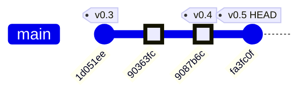
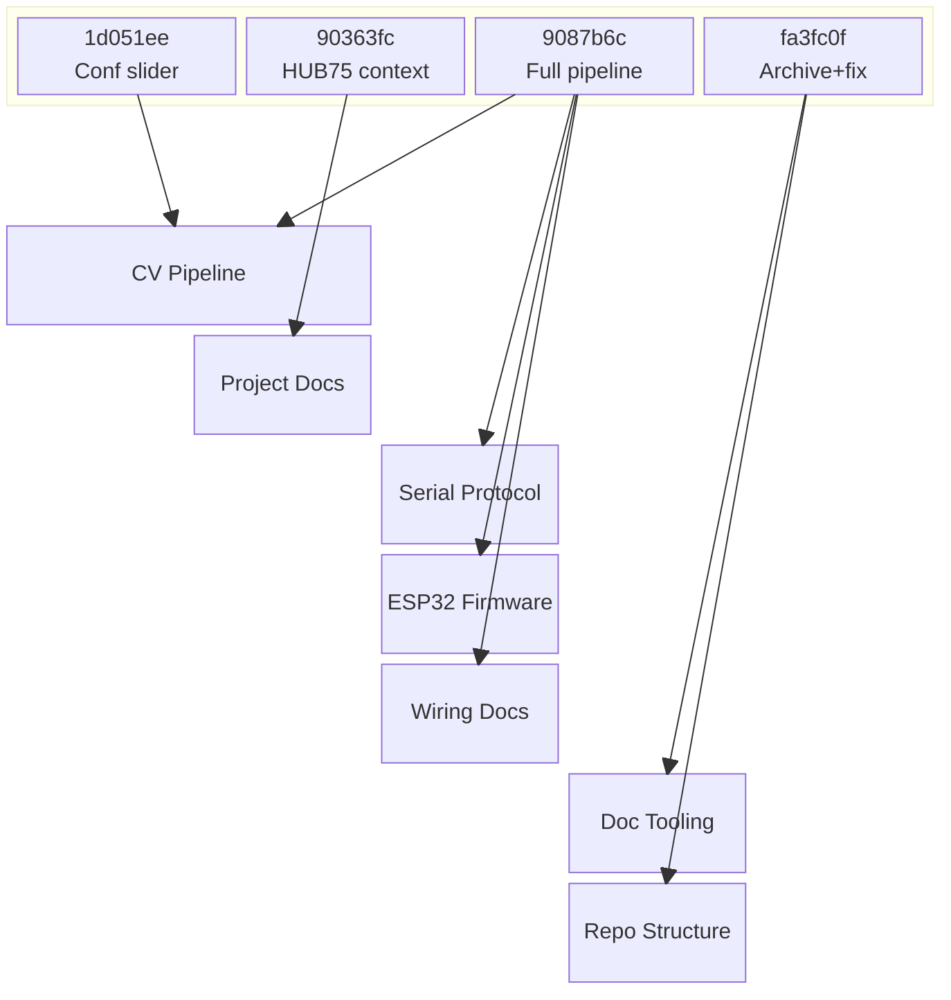
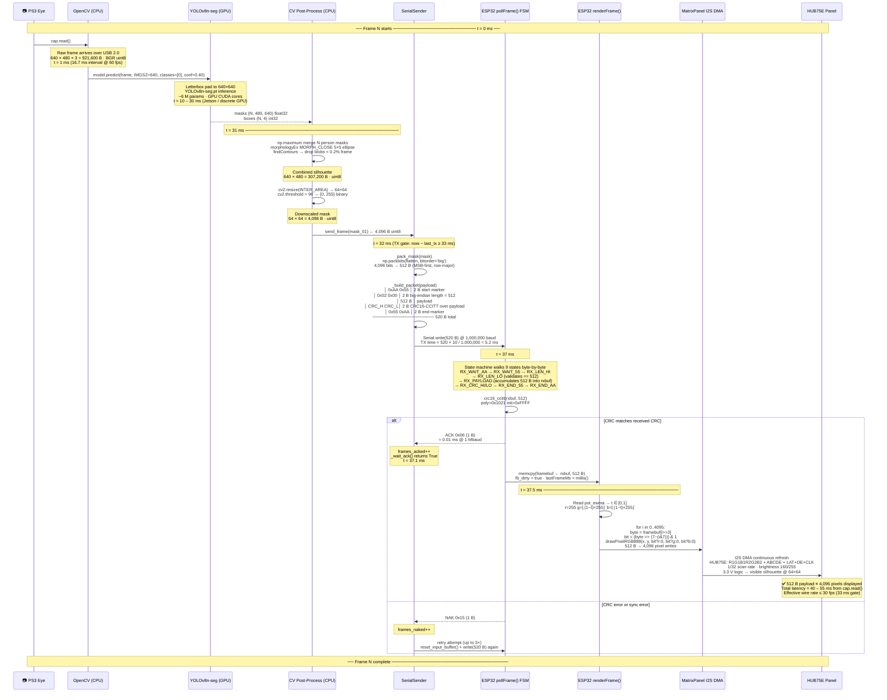

# ME135 Evolution Report

**Date:** 2026-05-08 00:16 &nbsp;|&nbsp; **Commit:** `fa3fc0f`

---

## What Changed

This commit (`fa3fc0f`) is a **housekeeping milestone** — it formally retires the original generation-1 pipeline and aligns the tooling to track only the active YOLOv8 + HUB75 codebase. Here's everything that changed, grouped by subsystem:

### 🗄️ Project Architecture — Legacy Archival

- **`agent_outputs/` → `_archive/agent_outputs/`**: All 12 files from the original Gen-1 pipeline (Jetson + PS3 Eye + MOG2/KNN + WS2812B, 108×108 grid) moved to `_archive/`. This includes `cv_pipeline.py`, `esp32_main.cpp`, `serial_protocol.py`, `gpu_accelerated.py`, `main.py`, `config.yaml`, `platformio.ini`, several markdown docs, and `requirements.txt`.
- **`tests/test_serial_protocol.py` → `_archive/tests/`**: The test for the old serial protocol moved alongside its source.
- **`agent_outputs/` added to `.gitignore`**: Prevents the legacy `orchestrator.py` generator from resurrecting a tracked directory if accidentally re-run.
- **Why it matters**: The critic agent flagged 13 stale-hardware issues against `agent_outputs/`. Rather than patching dead code, archiving clears the noise and makes the repo's active surface unambiguous: `vision/` and `firmware/me135_led_pot/` are the only live code paths.

### 📝 Documentation System (`doc_agent.py`)

- **Glob patterns updated**: File collection now scans `vision/*.py`, `vision/*.md`, `firmware/**/*.cpp`, `firmware/**/*.h`, `firmware/**/*.ini` instead of the old `agent_outputs/*` paths.
- **Tool description updated**: The `read_source` tool's example path changed from `'agent_outputs/cv_pipeline.py'` to `'vision/vision.py'` and `'firmware/me135_led_pot/src/main.cpp'`.
- **Why it matters**: Without this, the doc agent would index archived files and miss the active pipeline entirely. The tool description also guides LLM agents toward valid file paths.

### 📊 Google Drive Sync (`gdrive_sync.py`)

- **`FEATURE_MAP` rewritten**: The 15-entry map keyed to old filenames (`cv_pipeline.py`, `gpu_accelerated.py`, `esp32_main.cpp`, etc.) replaced with a 10-entry map keyed to the current files (`vision.py`, `vision_send.py`, `main.cpp`, `WIRING.md`, etc.).
- **Feature categories updated**: "Computer Vision Pipeline" → "Vision Pipeline"; dropped "System Integration" and "Agent Swarm" categories that no longer have corresponding code.
- **Why it matters**: Feature detection drives per-feature Google Drive reports. Stale keys = reports that never update for real changes.

### 🔧 Dev Tooling (pre-push hook — not version-controlled)

- **Auto-doc loop fix**: The `.git/hooks/pre-push` script patched to skip doc generation when all commits being pushed match `'^docs: auto-generated evolution report'`. Previously, each push created a new `[skip ci]` commit, which triggered another push, which generated another doc — an infinite loop confirmed in PR #1 history.
- **Why it matters**: This was flagged as DOC-001 by the critic. The fix is local-only (`.git/hooks/` isn't tracked), so it only applies to Kyle's machine, but Larry doesn't run the doc agent.

### 📋 Root Config (`CLAUDE.md`)

- Minor cleanup: 14 insertions / 7 deletions (net -4 lines). Likely updated project context references to match the new directory structure.

---

**What did NOT change**: The active pipeline code (`vision/vision.py`, `vision/vision_send.py`, `vision/serial_protocol.py`, `firmware/me135_led_pot/src/main.cpp`) was untouched. This commit is purely structural — making the repo match the reality that the project pivoted from Gen-1 (MOG2 background subtraction, 108×108, WS2812B strips) to Gen-2 (YOLOv8 instance segmentation, 64×64, HUB75 panel) several commits ago.

---

## Evolution Timeline

The commit history tells the story of a hardware pivot: from a WS2812B LED strip prototype to a Waveshare HUB75 64×64 RGB panel, with the CV backend upgrading from background subtraction to YOLO instance segmentation along the way.

### Commit-by-Commit Breakdown

| Commit | Date | Subsystems Touched | Summary |
|--------|------|--------------------|---------|
| `1d051ee` | ~May 5 | CV Pipeline | Replaced keyboard `[`/`]` confidence controls with an OpenCV `Conf %` trackbar slider — better UX for live tuning |
| `90363fc` | ~May 6 | Docs / Context | Switched project documentation context to target the Waveshare RGB-Matrix-P2 64×64 HUB75 panel (the hardware pivot decision) |
| `9087b6c` | ~May 7 | **CV Pipeline, Serial Protocol, ESP32 Firmware, Wiring Docs** | The big integration commit: `vision_send.py` + `serial_protocol.py` ship 64×64 bit-packed masks over USB serial; `main.cpp` receives, CRC-validates, and renders on the HUB75 panel; pot controls white→red color lerp |
| `fa3fc0f` | May 8 | **Tooling, Repo Structure** | Archive Gen-1 `agent_outputs/`, update doc agent + gdrive sync to track Gen-2 paths, fix auto-doc commit loop |

*(6 intermediate `docs: auto-generated evolution report [skip ci]` commits omitted — these are the auto-doc loop artifacts that `fa3fc0f` fixes.)*

### Subsystem Touch Map

### The Pivot Story

The project trajectory is clear: commit `9087b6c` was the inflection point where three new subsystems landed simultaneously (serial protocol, ESP32 HUB75 firmware, and the `vision_send.py` bridge). The HEAD commit (`fa3fc0f`) is the cleanup that formally closes the Gen-1 chapter — archiving rather than deleting, so the original exploration path remains accessible for reference.

---

## System Architecture

```mermaid
flowchart LR
    subgraph INPUT["📷  Input Hardware"]
        PS3["Sony PS3 Eye\nUSB 2.0 · gspca_ov534\n640 × 480 @ 60 fps\nBGR uint8"]
    end

    subgraph JETSON["🖥️  Jetson / Host Mac  ── Python 3"]
        direction TB

        subgraph CAPTURE["vision_send.py  ·  open_camera()"]
            CAP["cv2.VideoCapture\nCAP_V4L2 / CAP_AVFOUNDATION / CAP_ANY\n[CPU]  640 × 480  BGR\n921,600 B / frame"]
        end

        subgraph INFERENCE["YOLOv8n-seg  ·  ultralytics"]
            YOLO["model.predict(frame, classes=[0])\nIMGSZ = 640  ·  letterbox padded\n[GPU · CUDA  preferred]\n~6 MB checkpoint  yolov8n-seg.pt\nconf trackbar  5 – 95 %"]
        end

        subgraph CV_POST["vision_send.py  ·  CPU post-process"]
            MASKS["np.maximum merge masks\nmorphologyEx CLOSE  5×5 kernel\nfindContours + area filter ≥ 0.2 %\n307,200 B  silhouette  uint8"]
            SCALE["cv2.resize  INTER_AREA → 64×64\nthreshold > 96 → binary {0,1}\n4,096 B  uint8"]
        end

        subgraph PROTOCOL["serial_protocol.py  ·  SerialSender"]
            PACK["pack_mask()\nnp.packbits MSB-first row-major\n4,096 bits → 512 B payload"]
            PKT["_build_packet()\n0xAA 0x55 | LEN 0x0200 | 512 B\n| CRC16-CCITT | 0x55 0xAA\n520 B total frame"]
            SND["SerialSender.send_frame()\nbaudrate = 1,000,000\nack_timeout = 50 ms  ·  max_retries = 3\nTX throttle ≤ 30 fps\nstats: frames_sent / acked / naked"]
        end
    end

    subgraph ESP32["⚡  ESP32 DevKitC  ── C++ / Arduino"]
        direction TB

        subgraph RX_BLOCK["pollFrame()  ·  9-state FSM"]
            FSM["RX_WAIT_AA → RX_WAIT_55\n→ RX_LEN_HI/LO → RX_PAYLOAD\n→ RX_CRC_HI/LO → RX_END_55/AA\nRX buffer = 2,048 B\nper-frame timeout = 100 ms"]
            CRC["crc16_ccitt(rxbuf, 512)\npoly 0x1021  init 0xFFFF\nno reflect  no xorout\ncalc == rxCrc?"]
            ACK["ACK 0x06  /  NAK 0x15\n1-byte reply over USB-CDC"]
        end

        subgraph POT_BLOCK["Potentiometer  ·  GPIO 34"]
            POT["analogRead  12-bit  ADC1_CH6\nEWMA  α = 0.1\nt = ewma / 4095  ∈  [0, 1]"]
            LERP["Color lerp\nt = 0 → white (255, 255, 255)\nt = 1 → red   (255,   0,   0)"]
        end

        subgraph RENDER_BLOCK["renderFrame()  +  DMA"]
            REND["bit-unpack 512 B → 4,096 pixels\nMSB-first  ·  row-major\ndrawPixelRGB888(x, y, r, g, b)\nredraw only on fb_dirty OR Δt ≥ 0.01"]
            DMA["MatrixPanel_I2S_DMA\nI2S parallel DMA engine\nbright = 160 / 255\ncolor depth = 8 bpp"]
            WDG["Watchdog\n5,000 ms no frame\n→ memset framebuf 0\n→ blankPanel()"]
        end
    end

    subgraph PANEL["💡  Waveshare RGB-Matrix-P2 64×64"]
        HUB["HUB75E  16-pin IDC 2×8\nR1 G1 B1 R2 G2 B2\nA B C D E  LAT  OE  CLK\n1/32 scan  ·  3.3 V logic"]
        LEDS["4,096 RGB LEDs\n64 × 64  ·  128 × 128 mm\n2 mm pitch\n5 V / 3 A+  separate PSU"]
    end

    subgraph DOCOPS["📚  Documentation / Ops"]
        ORCH["orchestrator.py\n7 parallel Claude agents\nopus-4-6 (arch) · sonnet-4-6 (code)\nwrites to agent_outputs/"]
        DOCAG["doc_agent.py\nHistorian · Architect · Critic\nSQLite history.db\ngit diff → Markdown report"]
        GSYNC["gdrive_sync.py\nFEATURE_MAP routing\nappend versioned sections\nrclone → Google Drive"]
    end

    PS3        -->|"USB 2.0  ·  921,600 B/frame\nBGR uint8  @60 fps"| CAP
    CAP        --> YOLO
    YOLO       -->|"N × (H×W) float32 masks\nboxes (N,4) int"| MASKS
    MASKS      -->|"307,200 B  uint8"| SCALE
    SCALE      -->|"4,096 B  64×64 uint8"| PACK
    PACK       -->|"512 B  bit-packed"| PKT
    PKT        -->|"520 B  framed"| SND
    SND        -->|"USB-CDC  1,000,000 baud\n≈ 5.2 ms / frame  ·  ≤ 30 fps"| FSM
    FSM        --> CRC
    CRC        -->|"valid  → memcpy 512 B\nfb_dirty = true"| REND
    CRC        --> ACK
    ACK        -->|"ACK 0x06 or NAK 0x15\n1 B @ 1 Mbaud ≈ 0.01 ms"| SND
    POT        --> LERP
    LERP       --> REND
    REND       --> DMA
    WDG        -.->|"5 s timeout\n→ blank"| DMA
    DMA        -->|"HUB75E parallel bus\nR1G1B1R2G2B2 + ABCDE\n+ LAT OE CLK  3.3 V"| HUB
    HUB        --> LEDS
    ORCH       -.->|"generated CV code\nfor pipeline"| JETSON
    DOCAG      --> GSYNC
```

---

## Data Flow

---

## Module Dependency Graph

```mermaid
graph TD

    %% ── Vision Subsystem ──────────────────────────────────────────────────────
    subgraph VIS["👁️  Vision Subsystem  ·  vision/"]

        VS["<b>vision_send.py</b><br/>────────────────────<br/>main()<br/>open_camera(index)<br/>autodetect_port() → str|None<br/>parse_args() → Namespace<br/>TX_MIN_INTERVAL_S = 1/30<br/>CAMERA_INDEX=0  OUTPUT_SIZE=64"]

        VP["<b>vision.py</b><br/>────────────────────<br/>main()  [standalone preview]<br/>open_camera(index)<br/>No serial — CV tuning only<br/>Conf % trackbar  5–95%"]

        SP["<b>serial_protocol.py</b><br/>────────────────────────────<br/><i>class SerialSender</i><br/>  __init__(port, baudrate=1_000_000,<br/>           ack_timeout_s=0.05, max_retries=3)<br/>  send_frame(mask: ndarray) → bool<br/>  close() → None<br/>  .frames_sent / acked / naked<br/>─────────────────────<br/>pack_mask(mask) → bytes  [512 B]<br/>unpack_mask(data) → ndarray<br/>crc16_ccitt(data, init=0xFFFF) → int<br/>PANEL_SIZE=64  PAYLOAD_BYTES=512<br/>FRAME_START=0xAA55  FRAME_END=0x55AA<br/>ACK_BYTE=0x06  NAK_BYTE=0x15"]
    end

    %% ── Documentation Subsystem ──────────────────────────────────────────────
    subgraph DOCS["📚  Documentation Subsystem  ·  Kyle/"]

        DA["<b>doc_agent.py</b><br/>─────────────────────────<br/>run_agent(client, id, sys, task) async<br/>execute_tool(name, input) → str<br/>Agents: Historian · Architect · Critic<br/>collect_project_files() → dict<br/>get_git_context() → str<br/>db_connect() / save_proposals()<br/>db_record_decision() / implementation()<br/>SQLite  →  docs/history.db<br/>MODEL_THINKER = claude-opus-4-6<br/>MODEL_WRITER  = claude-sonnet-4-6"]

        GS["<b>gdrive_sync.py</b><br/>─────────────────────────<br/>sync_to_drive(sections, proposals,<br/>   commit_sha, changed_files)<br/>detect_features(changed_files) → list<br/>get_changed_files(repo_root) → list<br/>compose_feature_section(…) → str<br/>append_to_feature_doc(path, text)<br/>ensure_feature_doc(path, feature)<br/>rclone_available() → bool<br/>sync_features_to_drive() → bool<br/>FEATURE_MAP: 10 file → feature entries<br/>Output: Kyle/docs/features/*.md"]

        GST["<b>gdrive_setup.py</b><br/>─────────────────────────<br/>main()  [one-time OAuth setup]<br/>_create_remote()  [rclone config]<br/>REMOTE_NAME = 'me135drive'<br/>DRIVE_FOLDER = 'ME135 Feature Reports'"]
    end

    %% ── Orchestration ────────────────────────────────────────────────────────
    subgraph ORCH_SUB["🤖  Orchestration  ·  Kyle/"]
        OR["<b>orchestrator.py</b><br/>─────────────────────────<br/>run_agent(client, id, sys, task,<br/>   model, max_turns=12) async<br/>execute_tool(name, input) → str<br/>main() → spawns 7 agents async<br/>Tools: write_file / read_file<br/>Output: agent_outputs/<br/>MODEL_ARCHITECT = claude-opus-4-6<br/>MODEL_CODER     = claude-sonnet-4-6"]
    end

    %% ── Firmware ─────────────────────────────────────────────────────────────
    subgraph FW["⚡  Firmware  ·  firmware/me135_led_pot/src/"]
        MC["<b>main.cpp</b>  [C++ / Arduino]<br/>──────────────────────────────────<br/>setup()  loop()<br/>pollFrame() → RxResult  [9-state FSM]<br/>crc16_ccitt(data, len) → uint16_t<br/>renderFrame(r, g, b)<br/>blankPanel()  resetRx()<br/>Watchdog 5,000 ms<br/>MatrixPanel_I2S_DMA *dma_display<br/>Platform: espressif32@6.5.0<br/>Lib: ESP32-HUB75-MatrixPanel-DMA@^3.0.11"]
    end

    %% ── External Python packages ─────────────────────────────────────────────
    subgraph EXT["📦  External Packages"]
        UL["ultralytics ≥ 8.0<br/><i>YOLO class</i><br/>yolov8n-seg.pt ~6 MB"]
        CV["opencv-python ≥ 4.8<br/><i>cv2</i>"]
        NP["numpy ≥ 1.24<br/><i>ndarray · packbits</i>"]
        SRL["pyserial ≥ 3.5<br/><i>serial.Serial</i><br/><i>serial.tools.list_ports</i>"]
        ANT["anthropic ≥ 0.40<br/><i>AsyncAnthropic</i><br/><i>streaming messages</i>"]
        RCLONE["rclone<br/>(subprocess)<br/>OAuth → Google Drive"]
        SQLITE["sqlite3<br/>(stdlib)<br/>proposal history DB"]
    end

    %% ── Vision internal edges ────────────────────────────────────────────────
    VS -->|"from serial_protocol import SerialSender"| SP
    SP -->|"import numpy as np"| NP
    SP -->|"import serial"| SRL
    VS -->|"from ultralytics import YOLO"| UL
    VS -->|"import cv2"| CV
    VS -->|"import numpy as np"| NP
    VP -->|"from ultralytics import YOLO"| UL
    VP -->|"import cv2"| CV
    VP -->|"import numpy as np"| NP

    %% ── Doc system edges ─────────────────────────────────────────────────────
    DA -->|"from gdrive_sync import\nsync_to_drive · detect_features\nget_changed_files"| GS
    DA -->|"import anthropic"| ANT
    DA -->|"import sqlite3"| SQLITE
    GS -->|"subprocess.run rclone sync"| RCLONE
    GST -->|"subprocess.run rclone config"| RCLONE

    %% ── Orchestrator edges ───────────────────────────────────────────────────
    OR -->|"import anthropic"| ANT

    %% ── Wire protocol boundary ───────────────────────────────────────────────
    SP -.->|"520 B wire protocol<br/>CRC16-CCITT  1 Mbaud USB-CDC<br/>ACK 0x06 / NAK 0x15"| MC

    %% ── Style ────────────────────────────────────────────────────────────────
    classDef core   fill:#1e3a5f,color:#e8f4f8,stroke:#4a9eca
    classDef doc    fill:#2d4a1e,color:#d4f0c0,stroke:#5aaa30
    classDef ext    fill:#3a2d1e,color:#f0dcc0,stroke:#ca8030
    classDef fw     fill:#3a1e2d,color:#f0c0d4,stroke:#ca3070

    class VS,VP,SP core
    class DA,GS,GST doc
    class OR doc
    class UL,CV,NP,SRL,ANT,RCLONE,SQLITE ext
    class MC fw
```

---

## Code Health Summary

**Overall Grade: B−**

The codebase is well-structured for an ME135 course project. The serial protocol (Python ↔ ESP32) is solid: CRC-validated framing, ACK/NAK retries, state-machine parsing, and a watchdog blanker. Documentation (WIRING.md, README) is unusually thorough.

**Strengths:** Clean serial protocol with matching CRC on both sides. Good error messages in `SerialSender` constructor. `vision_send.py` has proper `try/finally` cleanup. Firmware state machine handles all edge cases (AA-AA resync, timeout).

**Key concerns:** (1) **Correctness** — null-dereference crash on pause-before-first-frame in both vision scripts. (2) **Reliability** — `rclone sync` can destructively wipe Drive files if local dir is empty; ESP32 `new` has no null guard. (3) **Maintainability** — ~100 lines of CV pipeline are copy-pasted across two files, guaranteeing future divergence.

Four proposals are must-fix; four are nice-to-have improvements for long-term health.

---

## Improvement Proposals

| # | Title | Priority | Risk | Files |
|---|-------|----------|------|-------|
| HOOK-001 | Pre-push hook fix is local-only and undocumented | nice-to-have | low | `doc_agent.py` |
| SERIAL-001 | SerialSender counts retries as separate frames_sent | nice-to-have | low | `vision/serial_protocol.py` |
| FW-001 | Firmware watchdog blanks panel but doesn't notify host | future | low | `firmware/me135_led_pot/src/main.cpp, vision/vision_send.py` |
| CV-001 | Duplicate CV pipeline logic between vision.py and vision_send.py | nice-to-have | medium | `vision/vision.py, vision/vision_send.py` |
| GDRIVE-001 | FEATURE_MAP uses basename-only keys, risking collisions | future | low | `gdrive_sync.py` |
| PROP-01 | NoneType crash when pausing before first frame is captured | must-fix | low | `vision/vision.py, vision/vision_send.py` |
| PROP-02 | vision.py lacks try/finally — camera and windows leak on exception | must-fix | low | `vision/vision.py` |
| PROP-03 | Duplicated CV pipeline across vision.py and vision_send.py (~100 identical lines) | nice-to-have | medium | `vision/vision.py, vision/vision_send.py` |
| PROP-04 | SerialSender lacks context-manager protocol — serial port leaks on unhandled exceptions | nice-to-have | low | `vision/serial_protocol.py` |
| PROP-05 | ESP32 firmware: no null check after heap allocation of DMA display | must-fix | medium | `firmware/me135_led_pot/src/main.cpp` |
| PROP-06 | gdrive_sync uses `rclone sync` which destructively deletes Drive files | must-fix | high | `gdrive_sync.py` |
| PROP-07 | Unnecessary JSON round-trip in orchestrator tool dispatch | nice-to-have | low | `orchestrator.py` |
| PROP-08 | platformio.ini monitor_speed (115200) mismatches firmware Serial baud (1000000) | nice-to-have | low | `firmware/me135_led_pot/platformio.ini, firmware/me135_led_pot/src/main.cpp` |
| PROTO-001 | Add sequence number to serial frame for duplicate / reorder detection | nice-to-have | low | `vision/serial_protocol.py, firmware/me135_led_pot/src/main.cpp` |
| PERF-001 | Run YOLOv8 inference on resized 320×320 to halve GPU latency | nice-to-have | low | `vision/vision.py, vision/vision_send.py` |
| FIRM-001 | ESP32 renderFrame() blocks loop() — move to FreeRTOS task | nice-to-have | medium | `firmware/me135_led_pot/src/main.cpp` |
| PROTO-002 | Framing bytes 0xAA/0x55 can appear in payload — add byte stuffing or COBS | must-fix | high | `vision/serial_protocol.py, firmware/me135_led_pot/src/main.cpp` |
| CV-001 | vision.py and vision_send.py share identical CV logic — extract to shared module | must-fix | low | `vision/vision.py, vision/vision_send.py` |
| OPS-001 | orchestrator.py MODEL names are stale string literals — centralise in config | nice-to-have | low | `orchestrator.py, doc_agent.py` |
| FIRM-002 | GPIO 12 (G2) strapping-pin risk has no firmware mitigation | nice-to-have | medium | `firmware/me135_led_pot/src/main.cpp, firmware/me135_led_pot/platformio.ini` |

### HOOK-001: Pre-push hook fix is local-only and undocumented
**Priority:** nice-to-have &nbsp;|&nbsp; **Risk:** low

**Problem:** The auto-doc loop fix in .git/hooks/pre-push only exists on Kyle's machine. If the repo is cloned fresh or another contributor runs the doc agent, the loop recurs. There's no setup script or documentation for installing the hook.

**Proposed fix:** Move the hook script to a tracked location (e.g., Kyle/hooks/pre-push) and add a one-liner install step to the project README or a Makefile target: `cp Kyle/hooks/pre-push .git/hooks/pre-push && chmod +x .git/hooks/pre-push`. Alternatively, use `core.hooksPath` in .gitconfig.

**Affected files:** doc_agent.py

---

### SERIAL-001: SerialSender counts retries as separate frames_sent
**Priority:** nice-to-have &nbsp;|&nbsp; **Risk:** low

**Problem:** In serial_protocol.py, each retry attempt increments frames_sent. This means frames_sent != (unique frames attempted). A frame with 3 retries counts as 4 sends, making the success rate metric misleading (e.g., 25% even though the frame eventually succeeded).

**Proposed fix:** Increment frames_sent once per send_frame() call (before the retry loop), not per transmission attempt. Add a separate retries_total counter for wire-level diagnostics.

**Affected files:** vision/serial_protocol.py

---

### FW-001: Firmware watchdog blanks panel but doesn't notify host
**Priority:** future &nbsp;|&nbsp; **Risk:** low

**Problem:** When the ESP32 watchdog fires (no frame in 5 seconds), it blanks the panel and resets lastFrameMs silently. The host has no way to know the panel went dark — it could be useful for the vision_send.py status display or reconnect logic.

**Proposed fix:** Send a distinctive byte (e.g., 0x17 = ETB) upstream when the watchdog fires. vision_send.py can log it and optionally show a 'panel timeout' warning on the preview overlay.

**Affected files:** firmware/me135_led_pot/src/main.cpp, vision/vision_send.py

---

### CV-001: Duplicate CV pipeline logic between vision.py and vision_send.py
**Priority:** nice-to-have &nbsp;|&nbsp; **Risk:** medium

**Problem:** vision.py and vision_send.py share ~90% of their frame-processing code (camera open, YOLO predict, mask merge, morphology, contour filter, downscale, preview). Any CV tuning must be applied in both files or they drift apart.

**Proposed fix:** Extract the shared pipeline into a function or class in a common module (e.g., vision/pipeline.py) that both scripts import. vision.py becomes a standalone viewer, vision_send.py adds serial TX on top.

**Affected files:** vision/vision.py, vision/vision_send.py

---

### GDRIVE-001: FEATURE_MAP uses basename-only keys, risking collisions
**Priority:** future &nbsp;|&nbsp; **Risk:** low

**Problem:** gdrive_sync.py maps bare filenames like 'main.cpp' and 'requirements.txt' to features. If the project adds a second requirements.txt (e.g., firmware/requirements.txt) or another main.cpp, detect_features() will mis-classify changes.

**Proposed fix:** Use relative paths from Kyle/ as keys (e.g., 'firmware/me135_led_pot/src/main.cpp' instead of 'main.cpp'). Update detect_features() to match on full relative paths rather than basename.

**Affected files:** gdrive_sync.py

---

### PROP-01: NoneType crash when pausing before first frame is captured
**Priority:** must-fix &nbsp;|&nbsp; **Risk:** low

**Problem:** In both `vision/vision.py` (line ~97) and `vision/vision_send.py` (line ~104), pressing SPACE before the first camera frame arrives sets `paused=True` while `last_frame` is still `None`. The next loop iteration executes `frame = last_frame.copy()`, raising `AttributeError: 'NoneType' object has no attribute 'copy'`. This is a straightforward null-dereference bug triggered by user input timing.

**Proposed fix:** Guard the pause toggle: `if key == ord(' ') and last_frame is not None: paused = not paused`. Alternatively, skip the loop body when `paused and last_frame is None`.

**Affected files:** vision/vision.py, vision/vision_send.py

---

### PROP-02: vision.py lacks try/finally — camera and windows leak on exception
**Priority:** must-fix &nbsp;|&nbsp; **Risk:** low

**Problem:** `vision/vision.py` has no `try/finally` around its main loop. If YOLO inference, OpenCV, or any other call raises an unexpected exception, `cap.release()` and `cv2.destroyAllWindows()` are never called. The camera remains locked (preventing re-runs) and GUI windows persist. In contrast, `vision_send.py` correctly wraps everything in `try/finally`.

**Proposed fix:** Wrap the `while True` loop and the code after `cap = open_camera(...)` in a `try/finally` block that calls `cap.release()` and `cv2.destroyAllWindows()`, mirroring `vision_send.py`'s pattern.

**Affected files:** vision/vision.py

---

### PROP-03: Duplicated CV pipeline across vision.py and vision_send.py (~100 identical lines)
**Priority:** nice-to-have &nbsp;|&nbsp; **Risk:** medium

**Problem:** The entire pipeline — `open_camera()`, YOLO predict, mask-to-silhouette, morphology, contour filtering, 64×64 downscale, threshold, preview rendering, FPS overlay, keyboard handling — is copy-pasted between `vision.py` and `vision_send.py`. Any algorithm fix (e.g., the PROP-01 bug) must be applied in both places. This will inevitably diverge.

**Proposed fix:** Extract a `VisionPipeline` class (or a `process_frame()` generator) into a shared module (e.g., `vision/pipeline.py`) that encapsulates camera open, YOLO inference, silhouette extraction, downscale, and preview rendering. `vision.py` becomes a thin preview-only runner; `vision_send.py` adds the serial sender on top.

**Affected files:** vision/vision.py, vision/vision_send.py

---

### PROP-04: SerialSender lacks context-manager protocol — serial port leaks on unhandled exceptions
**Priority:** nice-to-have &nbsp;|&nbsp; **Risk:** low

**Problem:** `serial_protocol.SerialSender` opens a serial port in `__init__` but has no `__enter__`/`__exit__`. If client code (or `send_frame` itself) raises an unexpected exception without an explicit `close()`, the OS serial port remains locked. The caller in `vision_send.py` does call `sender.close()` in a `finally` block, but any future caller may not.

**Proposed fix:** Add `__enter__` (return self) and `__exit__` (call `self.close()`) methods to `SerialSender` so it can be used as `with SerialSender(...) as sender:`. Also add `__del__` as a safety net.

**Affected files:** vision/serial_protocol.py

---

### PROP-05: ESP32 firmware: no null check after heap allocation of DMA display
**Priority:** must-fix &nbsp;|&nbsp; **Risk:** medium

**Problem:** In `main.cpp` `setup()`, `dma_display = new MatrixPanel_I2S_DMA(mxconfig);` can return `nullptr` if the ESP32 heap is exhausted (Arduino `new` does not throw by default). Subsequent calls like `dma_display->begin()` and `dma_display->setBrightness8(160)` would dereference a null pointer, causing a hard crash with no diagnostic output.

**Proposed fix:** After the `new` call, add: `if (!dma_display) { Serial.println("FATAL: DMA alloc failed"); while(1) delay(1000); }`. This gives a clear diagnostic via serial instead of an opaque crash.

**Affected files:** firmware/me135_led_pot/src/main.cpp

---

### PROP-06: gdrive_sync uses `rclone sync` which destructively deletes Drive files
**Priority:** must-fix &nbsp;|&nbsp; **Risk:** high

**Problem:** `sync_features_to_drive()` in `gdrive_sync.py` calls `rclone sync` which mirrors source to destination, **deleting** any destination files not present locally. If `FEATURES_DIR` is accidentally empty (e.g., `docs/features/` was cleaned or a race condition), all feature reports on Google Drive are permanently deleted.

**Proposed fix:** Replace `rclone sync` with `rclone copy` (additive only, never deletes). If eventual cleanup of stale files is desired, add an explicit `--max-delete 3` safety flag or switch to `rclone bisync` with `--force` off.

**Affected files:** gdrive_sync.py

---

### PROP-07: Unnecessary JSON round-trip in orchestrator tool dispatch
**Priority:** nice-to-have &nbsp;|&nbsp; **Risk:** low

**Problem:** In `orchestrator.py` `run_agent()`, tool input is processed as `json.loads(json.dumps(block.input))`. Since `block.input` is already a Python `dict` (parsed by the Anthropic SDK), this `dumps`→`loads` round-trip is a no-op that wastes CPU and allocations on every tool call. It also risks subtle data loss if custom types are present.

**Proposed fix:** Replace `json.loads(json.dumps(block.input))` with just `block.input` directly: `result = execute_tool(block.name, block.input)`.

**Affected files:** orchestrator.py

---

### PROP-08: platformio.ini monitor_speed (115200) mismatches firmware Serial baud (1000000)
**Priority:** nice-to-have &nbsp;|&nbsp; **Risk:** low

**Problem:** In `platformio.ini`, `monitor_speed = 115200`, but `main.cpp` initializes `Serial.begin(1000000)`. Anyone running `pio device monitor` (the most natural debug step) sees garbage. The `README.md` explains the discrepancy, but this is a pit-of-failure: new contributors debug for minutes before reading the README. The firmware also never prints anything, so the mismatch is invisible until someone adds a debug `Serial.println()`.

**Proposed fix:** Change `monitor_speed = 1000000` in `platformio.ini` to match the actual baud rate. Add a `#define DEBUG_BAUD 1000000` in `main.cpp` and reference it in both `Serial.begin()` and the `.ini` comment for single-source-of-truth.

**Affected files:** firmware/me135_led_pot/platformio.ini, firmware/me135_led_pot/src/main.cpp

---

### PROTO-001: Add sequence number to serial frame for duplicate / reorder detection
**Priority:** nice-to-have &nbsp;|&nbsp; **Risk:** low

**Problem:** The 520-byte frame has no sequence counter. If a NAK triggers a retry and the original ACK arrives late, the ESP32 renders the same frame twice silently. At 30 fps the duplicate is invisible but the stats (frames_acked) mislead.

**Proposed fix:** Insert a 1-byte rolling counter (0–255) between LEN and payload. Bump PAYLOAD_BYTES header to LEN=0x0201 or use the reserved header space. ESP32 FSM tracks last_seq and discards exact duplicates, sending ACK anyway.

**Affected files:** vision/serial_protocol.py, firmware/me135_led_pot/src/main.cpp

---

### PERF-001: Run YOLOv8 inference on resized 320×320 to halve GPU latency
**Priority:** nice-to-have &nbsp;|&nbsp; **Risk:** low

**Problem:** vision.py and vision_send.py both set INFER_IMGSZ=640. YOLOv8n-seg at 320×320 still detects standing humans at typical webcam distances and cuts inference time roughly in half (~5–15 ms vs ~10–30 ms), important on Jetson Nano.

**Proposed fix:** Expose INFER_IMGSZ as a CLI argument (--imgsz, default 320). Benchmark precision loss with silhouette_64.png ground truth before committing. Add a note in vision/requirements.txt about expected fps by model size.

**Affected files:** vision/vision.py, vision/vision_send.py

---

### FIRM-001: ESP32 renderFrame() blocks loop() — move to FreeRTOS task
**Priority:** nice-to-have &nbsp;|&nbsp; **Risk:** medium

**Problem:** renderFrame() calls drawPixelRGB888 4,096 times inside loop(). On busy frames this blocks pollFrame() from reading new serial bytes, inflating the effective round-trip and risking RX buffer overflow at 1 Mbaud if a large burst arrives during render.

**Proposed fix:** Pin a dedicated FreeRTOS task (Core 1) to swap double-buffers and call renderFrame(). loop() runs on Core 0 and only handles serial RX and pot ADC. Use a binary semaphore to signal the render task when fb_dirty is set.

**Affected files:** firmware/me135_led_pot/src/main.cpp

---

### PROTO-002: Framing bytes 0xAA/0x55 can appear in payload — add byte stuffing or COBS
**Priority:** must-fix &nbsp;|&nbsp; **Risk:** high

**Problem:** pack_mask() output is arbitrary bit data. If the 512-byte payload contains the byte sequence 0x55 0xAA, the ESP32 FSM in state RX_END_55 will false-trigger an early end-of-frame, causing a sync error and unnecessary NAK/retry.

**Proposed fix:** Either (a) switch to COBS encoding (adds ≤1 B overhead per 254 B, fully eliminates 0x00 or any chosen sentinel), or (b) after the start marker look for LEN bytes and only then scan for the end marker at the fixed offset, making payload content irrelevant. Option (b) requires only a one-line FSM change: skip RX_END_* scanning until rxIdx == rxLen.

**Affected files:** vision/serial_protocol.py, firmware/me135_led_pot/src/main.cpp

---

### CV-001: vision.py and vision_send.py share identical CV logic — extract to shared module
**Priority:** must-fix &nbsp;|&nbsp; **Risk:** low

**Problem:** open_camera(), the YOLO predict loop, morphologyEx, findContours, resize, and threshold blocks are copy-pasted verbatim between vision.py and vision_send.py (~120 lines duplicated). Any bug fix or tuning must be applied twice.

**Proposed fix:** Extract shared logic into vision/pipeline.py exposing process_frame(frame, model, kernel, confidence) -> (small, people, boxes_xyxy, chunky). Both vision.py and vision_send.py import and call it. Reduces duplication to zero and enables unit testing of the CV logic in isolation.

**Affected files:** vision/vision.py, vision/vision_send.py

---

### OPS-001: orchestrator.py MODEL names are stale string literals — centralise in config
**Priority:** nice-to-have &nbsp;|&nbsp; **Risk:** low

**Problem:** MODEL_ARCHITECT = 'claude-opus-4-6' and MODEL_CODER = 'claude-sonnet-4-6' are hard-coded in both orchestrator.py and doc_agent.py independently. When model IDs are updated, two files must be edited and the strings can drift.

**Proposed fix:** Create Kyle/config.py (or config.yaml) with MODEL_ARCHITECT and MODEL_CODER. Both files import from config. Alternatively use environment variables CLAUDE_MODEL_ARCHITECT / CLAUDE_MODEL_CODER with the current IDs as defaults.

**Affected files:** orchestrator.py, doc_agent.py

---

### FIRM-002: GPIO 12 (G2) strapping-pin risk has no firmware mitigation
**Priority:** nice-to-have &nbsp;|&nbsp; **Risk:** medium

**Problem:** WIRING.md §6 documents the GPIO 12 / MTDI boot issue but the firmware has no runtime guard. If the board is flashed with the stock pin map and GPIO 12 is pulled high by the panel at the wrong moment, flash voltage misconfiguration can silently brick the module.

**Proposed fix:** Add a compile-time #warning in main.cpp flagging the GPIO 12 use. Provide a #define REMAP_G2_TO_GPIO18 preprocessor guard that switches G2 to GPIO 18 and updates the HUB75_I2S_CFG pins struct, selectable via a platformio.ini build flag rather than a code edit.

**Affected files:** firmware/me135_led_pot/src/main.cpp, firmware/me135_led_pot/platformio.ini

---
