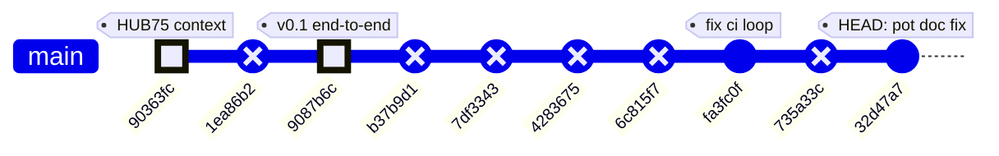
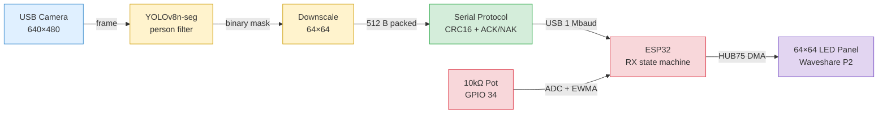
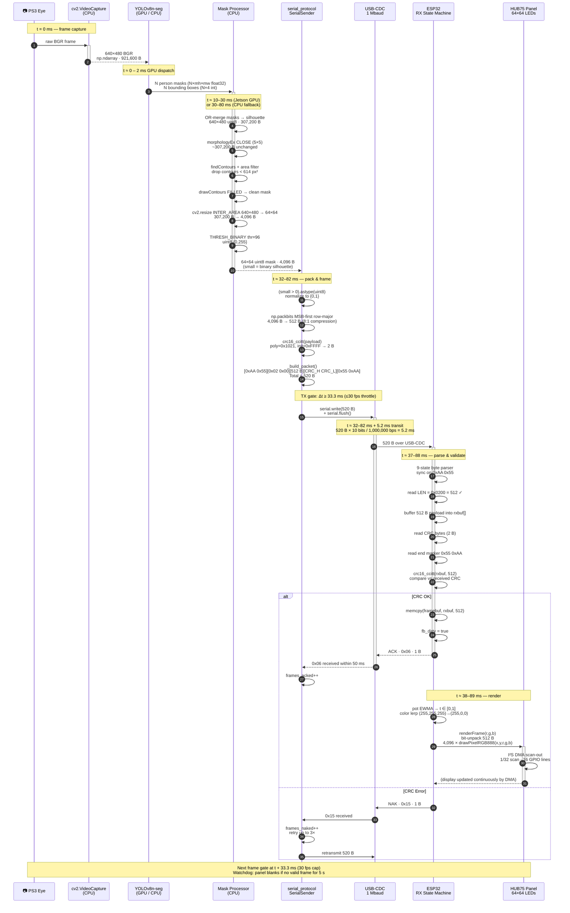
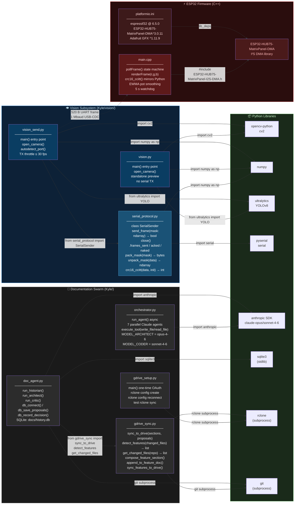

# ME135 Evolution Report

**Date:** 2026-05-08 21:08 &nbsp;|&nbsp; **Commit:** `32d47a7`

---

## What Changed

This window covers the project's transition from a planning/scaffolding phase into a **working end-to-end pipeline**: camera → YOLO segmentation → 64×64 binary mask → USB serial → ESP32 → HUB75 LED panel. Four meaningful commits drive the story; the remaining five are auto-generated doc reports (`[skip ci]`).

### CV Pipeline (`vision/`)

- **`vision.py` — standalone YOLO person-segmentation viewer** (`9087b6c`)
  Added a complete OpenCV + YOLOv8 pipeline that grabs frames from a USB camera, runs `yolov8n-seg` instance segmentation filtered to the COCO "person" class, ORs all person masks into a single binary silhouette, cleans it with morphological close + contour filtering, and downscales to 64×64. Three preview windows (raw + contours, clean silhouette, pixelated 64×64). Interactive confidence trackbar and pause/save controls. *Why it matters:* this is the project's "eyes" — everything downstream depends on the quality of this mask.

- **`vision_send.py` — pipeline + serial TX to ESP32** (`9087b6c`)
  Mirrors `vision.py` but bolts on a `SerialSender` that ships each 64×64 frame to the ESP32 at ~30 fps (throttled). Adds `--no-serial` flag for CV-only tuning, auto-detection of USB-serial ports (macOS + Linux), and a clean stats summary on exit (sent/ack/nak/success-rate). *Why it matters:* bridges the gap between laptop-side vision and the physical display.

### Serial Protocol (`vision/serial_protocol.py`)

- **Framed binary protocol with CRC + retries** (`9087b6c`)
  Implements a compact wire format: `[0xAA 0x55][LEN_H LEN_L][512B payload][CRC16][0x55 0xAA]`. Payload is row-major MSB-first bit-packed (64×64 ÷ 8 = 512 bytes). CRC-16/CCITT-FALSE over payload only. 50 ms ACK timeout, up to 3 retries. The `SerialSender` class handles port opening, packet building, and ACK/NAK handshake. *Why it matters:* at 1 Mbaud, a 520-byte frame transmits in ~4.2 ms — well under the 33 ms budget for 30 fps, leaving headroom for retries without dropping frames.

### ESP32 Firmware (`firmware/me135_led_pot/`)

- **Full HUB75 display firmware with RX state machine + pot color lerp** (`9087b6c`)
  Written for ESP32 DevKitC driving a Waveshare RGB-Matrix-P2 64×64 via the `ESP32-HUB75-MatrixPanel-DMA` library. Features:
  - **RX state machine** (9 states) that parses the framed serial protocol byte-by-byte, validates CRC, and ACKs/NAKs.
  - **Potentiometer input** on GPIO 34 (ADC1) with EWMA smoothing (`α = 0.1`). Normalized to `[0, 1]` and used for a white→red color lerp on the silhouette.
  - **Dirty-flag rendering**: panel only redraws when a new frame arrives or the pot moves ≥ 1%.
  - **5-second watchdog**: blanks the panel if the Mac stops sending, auto-recovers on resume.
  - `platformio.ini` pins the ESP-IDF platform to `espressif32@6.5.0` and pulls `ESP32-HUB75-MatrixPanel-DMA@^3.0.11`.

- **Comprehensive wiring documentation** (`firmware/WIRING.md`, `firmware/me135_led_pot/README.md`) (`9087b6c`)
  Full 16-pin HUB75E pinout table, power wiring (separate 5V/3A PSU, mandatory common ground, bulk capacitor recommendation), strapping-pin caveat for GPIO 12, optional 74HCT245 level-shifting guide, and a 9-step bring-up checklist. *Why it matters:* this is a hardware project — miswiring destroys hours. The docs prevent that.

### Documentation & Project Context

- **Switched project target to Waveshare RGB-Matrix-P2 64×64 (HUB75)** (`90363fc`)
  Updated `CLAUDE.md` / project context documents to reflect the actual hardware (previously referenced a generic LED panel). Anchors all downstream agent outputs to the correct display spec.

- **Fixed pot description — "triggers effects," not "brightness"** (`32d47a7`, HEAD)
  Corrected misleading phrasing in `CLAUDE.md` that said the potentiometer controls brightness. In reality, it triggers a white→red color lerp — a visual *effect*, not a brightness dial. The commit message notes this was caught while syncing the portfolio site, where the wrong fact had already propagated.

### Infrastructure / Maintenance

- **Archived stale `agent_outputs/` + fixed doc-hook auto-commit loop** (`fa3fc0f`)
  Cleaned up obsolete agent output files from the orchestrator's earlier runs. Fixed a bug where the post-commit doc-generation hook would trigger its own commit, creating an infinite loop. *Why it matters:* the five consecutive `[skip ci]` auto-doc commits visible in the log are evidence this loop was firing before the fix landed.

---

## Evolution Timeline

### Subsystems touched per commit

| Commit | Subsystems | Significance |
|--------|-----------|--------------|
| `90363fc` | 📄 Docs | Rebase project context onto Waveshare HUB75 panel |
| `9087b6c` | 👁 CV Pipeline · 📡 Serial Protocol · 🔌 ESP32 Firmware · 📄 Docs | **Landmark** — full pipeline from camera to physical LEDs |
| `fa3fc0f` | ⚙️ CI / Infra | Archive stale outputs, break auto-commit loop |
| `32d47a7` | 📄 Docs | Fix misleading pot description in CLAUDE.md |

> Commits marked REVERSE in the graph are auto-generated doc reports (`[skip ci]`) — no code changes.

### Architecture snapshot (as of HEAD)

---

## System Architecture

```mermaid
flowchart TD
    %% ── Camera Layer ──────────────────────────────────────────────────────────
    subgraph CAM_LAYER ["📷 Camera Layer"]
        PS3["Sony PS3 Eye\nUSB · gspca_ov534\n640×480 @ 60 fps\nBGR8"]
    end

    %% ── Jetson Host ───────────────────────────────────────────────────────────
    subgraph JETSON ["🖥️ Jetson Nano / Orin  —  CPU + CUDA GPU"]
        direction TB

        subgraph CAPTURE ["Capture  (CPU)"]
            VCAP["cv2.VideoCapture\nCAP_V4L2 / CAP_AVFOUNDATION\n640×480 BGR · 921,600 B/frame"]
        end

        subgraph INFER ["Inference  (GPU preferred)"]
            YOLO["YOLOv8n-seg\nclass=person (COCO id 0)\nINFER_IMGSZ=640\nyolov8n-seg.pt  ~6 MB\nconf trackbar 5–95%"]
        end

        subgraph MASK_PROC ["Mask Processing  (CPU)"]
            MERGE["OR-merge N person masks\nN×(mh×mw) float32 → 640×480 uint8\n307,200 B silhouette"]
            MORPH["morphologyEx CLOSE\n5×5 ellipse kernel\nsmooths jagged edges"]
            CFILTER["findContours + area filter\nmin_area = 0.2% of frame\n≈ 614 px²  drops stray bits"]
            REDRAW["drawContours FILLED\nclean binary mask\n640×480 uint8 · 307,200 B"]
            RESIZE["cv2.resize INTER_AREA\n640×480 → 64×64\n4,096 B  (panel-native res)"]
            BTHRESH["cv2.THRESH_BINARY thr=96\nbinary uint8 {0,255}"]
        end

        subgraph SERIAL_LAYER ["Serial TX  (CPU)  — serial_protocol.py"]
            PACK["pack_mask()\nnp.packbits MSB-first row-major\n4,096 B → 512 B  (8:1 compression)"]
            CRC_PY["crc16_ccitt()\npoly=0x1021 init=0xFFFF\nover 512-B payload"]
            FRAME_BUILD["_build_packet()\n[0xAA 0x55][LEN 0x0200]\n[512 B payload]\n[CRC_H CRC_L]\n[0x55 0xAA]  = 520 B total"]
            SENDER["SerialSender\n1,000,000 baud · 8N1\nTX throttle ≤ 30 fps\n50 ms ACK timeout · 3 retries"]
        end
    end

    %% ── Physical Wire ─────────────────────────────────────────────────────────
    subgraph WIRE ["🔌 USB-CDC  (USB-to-UART)"]
        UART["520 B/frame · ~5.2 ms transit\n@ 1 Mbaud · 8N1\nACK=0x06 · NAK=0x15"]
    end

    %% ── ESP32 ─────────────────────────────────────────────────────────────────
    subgraph ESP32 ["⚡ ESP32 DevKitC  —  Arduino / FreeRTOS"]
        direction TB

        subgraph RX_BLOCK ["Serial RX  (loop)"]
            RXBUF["HardwareSerial RX buf\n2048 B  (setRxBufferSize)"]
            SM["9-state byte parser\nRX_WAIT_AA→RX_WAIT_55\n→LEN→PAYLOAD→CRC→END\n100 ms frame timeout"]
            CRC_C["crc16_ccitt()\npoly=0x1021  matches Python"]
            FB["framebuf[512]\nlast-good payload\n(retained on CRC error)"]
        end

        subgraph POT_BLOCK ["Analog Input  (loop)"]
            POT["GPIO34 ADC1_CH6\n12-bit · 11 dB atten\n0–4095 raw → t∈[0,1]"]
            EWMA["EWMA  α=0.1\nsmooths pot jitter\nchange thr ≥ 0.01"]
            LERP["Color lerp\nt=0 → white(255,255,255)\nt=1 → red(255,0,0)\nRGB888 per-pixel"]
        end

        subgraph RENDER_BLOCK ["Render  (conditional)"]
            RENDER["renderFrame(r,g,b)\nbit-unpack 512 B\n4,096 drawPixelRGB888(x,y)\nredraw only if dirty or t changed"]
            DMA_LIB["ESP32-HUB75-MatrixPanel-DMA\nv3.0.11  I²S DMA engine\n8-bit color depth\nI2S_PARALLEL peripheral"]
        end

        WD["5 s Watchdog\nno frame → blank panel\nmemset(framebuf,0,512)"]
    end

    %% ── Display Layer ─────────────────────────────────────────────────────────
    subgraph PANEL ["🟥 LED Display"]
        HUB75["16-pin IDC ribbon  HUB75E\nR1,G1,B1,R2,G2,B2\nA,B,C,D,E · CLK,LAT,OE\n3.3V logic · 1/32 scan"]
        DISPLAY["Waveshare RGB-Matrix-P2\n64×64  ·  4,096 RGB LEDs\n2 mm pitch · 128×128 mm\n5 V / 3 A PSU (separate)"]
    end

    %% ── Doc / Orchestration (side path) ──────────────────────────────────────
    subgraph DOCS ["📝 Documentation Swarm  (offline)"]
        ORCH["orchestrator.py\n7 parallel Claude agents\nOpus-4 / Sonnet-4"]
        DAGENT["doc_agent.py\nHistorian · Architect · Critic\ngit diff → Markdown report"]
        GDRIVE["gdrive_sync.py\nfeature doc writer\nrclone → Google Drive"]
    end

    %% ── Edges ─────────────────────────────────────────────────────────────────
    PS3 -->|"USB  921,600 B/frame BGR\n@60 fps  raw"| VCAP
    VCAP -->|"np.ndarray HxWx3"| YOLO
    YOLO -->|"masks (N,mh,mw) float32\nboxes (N,4) int"| MERGE
    MERGE --> MORPH --> CFILTER --> REDRAW --> RESIZE --> BTHRESH
    BTHRESH -->|"64×64 uint8\n4,096 B"| PACK
    PACK -->|"512 B  bytes"| CRC_PY --> FRAME_BUILD --> SENDER
    SENDER -->|"520 B frame\n≤30 fps"| UART
    UART -->|"ACK 0x06 / NAK 0x15\n50 ms timeout"| SENDER
    UART --> RXBUF --> SM --> CRC_C
    CRC_C -->|"pass"| FB
    CRC_C -->|"fail → NAK"| SM
    POT --> EWMA --> LERP
    FB --> RENDER
    LERP --> RENDER
    RENDER --> DMA_LIB
    DMA_LIB -->|"parallel I²S\n13 GPIO lines\n3.3V"| HUB75 --> DISPLAY
    WD -->|"5 s no-frame\nblank"| DMA_LIB

    ORCH -.->|"spawns"| DAGENT
    DAGENT -.->|"uses"| GDRIVE

    %% ── Styles ────────────────────────────────────────────────────────────────
    style CAM_LAYER  fill:#3b2a1a,color:#ffd,stroke:#f90
    style JETSON     fill:#0d2137,color:#cef,stroke:#39f
    style WIRE       fill:#1a1a3b,color:#ccf,stroke:#66f
    style ESP32      fill:#0d2a0d,color:#cfc,stroke:#3c3
    style PANEL      fill:#2a0d0d,color:#fcc,stroke:#c33
    style DOCS       fill:#2a2a2a,color:#ddd,stroke:#888
```

---

## Data Flow

One frame's end-to-end journey — camera capture → HUB75 LED panel.

### Key Byte Counts Summary

| Stage | Size | Type |
|---|---|---|
| Raw camera frame | 921,600 B | 640×480 BGR uint8 |
| YOLO mask output (per person) | variable | float32 (mh×mw) |
| Merged silhouette | 307,200 B | 640×480 uint8 |
| Downscaled mask | 4,096 B | 64×64 uint8 |
| Bit-packed payload | **512 B** | row-major MSB-first |
| Full serial frame | **520 B** | +4 B header +2 B len +2 B CRC |
| ACK / NAK reply | 1 B | 0x06 / 0x15 |
| Compression ratio | **1800:1** | raw frame → wire payload |

---

## Module Dependency Graph

### Interface Boundary Summary

| Module | Exports (Public API) | Consumers |
|---|---|---|
| `serial_protocol.py` | `SerialSender.send_frame()`, `pack_mask()`, `unpack_mask()`, `crc16_ccitt()` | `vision_send.py` |
| `gdrive_sync.py` | `sync_to_drive()`, `detect_features()`, `get_changed_files()` | `doc_agent.py` |
| `vision_send.py` | CLI entry point — no exported API | (top-level runnable) |
| `vision.py` | CLI entry point — no exported API | (top-level runnable) |
| `orchestrator.py` | CLI entry point — no exported API | (top-level runnable) |
| `doc_agent.py` | CLI entry point — no exported API | git pre-push hook |
| `main.cpp` | Wire protocol only (520 B UART frame) | `SerialSender` in Python |

---

## Code Health Summary

**Overall Grade: B−**

The codebase is well-structured for a university project. The serial protocol (Python ↔ ESP32) is solid: CRC16 with ACK/NAK retries, a clean state machine on the firmware side, and a proper watchdog. Documentation (WIRING.md) is exceptional—production-quality troubleshooting tables.

**Key weaknesses:**

- **Duplication is the #1 debt.** `vision.py` and `vision_send.py` share ~120 lines of identical CV pipeline code. A bug fixed in one (try/finally) was missed in the other (PROP-001/002 are direct consequences).
- **Resource safety is inconsistent.** `vision_send.py` has proper cleanup; `vision.py` does not. `SerialSender` lacks context-manager support.
- **Async safety is fragile.** `doc_agent.py` uses bare mutable globals across concurrent agents.
- **Firmware is clean** but could avoid full-panel redraws on pot-only changes.

No security issues found (no credentials, no shell injection, good path-traversal guard in orchestrator).

---

## Improvement Proposals

| # | Title | Priority | Risk | Files |
|---|-------|----------|------|-------|
| PROP-001 | vision.py: NoneType crash when SPACE pressed before first frame | must-fix | medium | `vision/vision.py, vision/vision_send.py` |
| PROP-002 | vision.py: No exception safety — camera and windows leak on crash | must-fix | low | `vision/vision.py` |
| PROP-003 | Massive CV pipeline duplication between vision.py and vision_send.py | nice-to-have | medium | `vision/vision.py, vision/vision_send.py` |
| PROP-004 | SerialSender lacks context manager — serial port leak on exception | nice-to-have | low | `vision/serial_protocol.py` |
| PROP-005 | doc_agent.py: Async agents append to shared lists without synchronization | nice-to-have | medium | `doc_agent.py` |
| PROP-006 | gdrive_sync.py: get_changed_files silently returns empty on git failure | nice-to-have | low | `gdrive_sync.py` |
| PROP-007 | firmware: renderFrame redraws all 4096 pixels on every pot twitch | future | low | `firmware/me135_led_pot/src/main.cpp` |
| PROP-008 | platformio.ini: monitor_speed mismatches Serial baud — confusing debug experience | nice-to-have | low | `firmware/me135_led_pot/platformio.ini, firmware/me135_led_pot/src/main.cpp` |
| PROP-001 | vision.py and vision_send.py share ~90% duplicated code | nice-to-have | low | `vision/vision.py, vision/vision_send.py` |
| PROP-002 | ESP32 renderFrame redraws all 4096 pixels on every dirty frame | future | low | `firmware/me135_led_pot/src/main.cpp` |
| PROP-003 | No graceful serial port disconnect handling in vision_send.py | nice-to-have | low | `vision/vision_send.py, vision/serial_protocol.py` |
| PROP-004 | Pot EWMA alpha is hardcoded; no deadzone for ADC noise | nice-to-have | low | `firmware/me135_led_pot/src/main.cpp` |
| PROP-005 | orchestrator.py PROJECT_CONTEXT is stale — still references PS3 Eye + Jetson + LabVIEW | must-fix | medium | `orchestrator.py` |
| ARCH-01 | Eliminate vision.py / vision_send.py code duplication via shared pipeline module | must-fix | low | `vision/vision.py, vision/vision_send.py` |
| ARCH-02 | YOLO mask tensor stays on CPU — defeats Jetson GPU path | nice-to-have | medium | `vision/vision.py, vision/vision_send.py` |
| ARCH-03 | Blocking serial ACK wait stalls the YOLO inference loop | must-fix | medium | `vision/vision_send.py, vision/serial_protocol.py` |
| HW-01 | GPIO12 (G2) strapping pin can silently prevent ESP32 flashing | must-fix | high | `firmware/me135_led_pot/src/main.cpp, firmware/WIRING.md, firmware/me135_led_pot/README.md` |
| PROTO-01 | Frame sequence numbers absent — silent frame reordering undetectable | nice-to-have | low | `vision/serial_protocol.py, firmware/me135_led_pot/src/main.cpp` |
| DOC-01 | orchestrator.py PROJECT_CONTEXT describes background-subtraction algorithm never implemented | nice-to-have | low | `orchestrator.py` |

### PROP-001: vision.py: NoneType crash when SPACE pressed before first frame
**Priority:** must-fix &nbsp;|&nbsp; **Risk:** medium

**Problem:** In `vision.py` `main()`, `last_frame` is initialized to `None`. If the user presses SPACE (pause toggle) before the first successful `cap.read()`, the `else` branch executes `frame = last_frame.copy()` on `None`, raising `AttributeError: 'NoneType' object has no attribute 'copy'`. The same bug exists in `vision_send.py` line ~112.

**Proposed fix:** Guard the pause branch: `if last_frame is None: continue` (or ignore the SPACE press when `last_frame is None`). Alternatively initialize `paused = False` and only allow toggling pause after the first frame is captured: `elif key == ord(' ') and last_frame is not None: paused = not paused`.

**Affected files:** vision/vision.py, vision/vision_send.py

---

### PROP-002: vision.py: No exception safety — camera and windows leak on crash
**Priority:** must-fix &nbsp;|&nbsp; **Risk:** low

**Problem:** In `vision.py` `main()`, the main loop has no `try/finally`. If YOLO inference throws (e.g., CUDA OOM, model corruption) or OpenCV raises, `cap.release()` and `cv2.destroyAllWindows()` are never called. The camera stays locked until the process is killed. `vision_send.py` correctly uses `try/finally` — `vision.py` does not.

**Proposed fix:** Wrap the main loop in `try: ... finally: cap.release(); cv2.destroyAllWindows()`, mirroring the pattern already used in `vision_send.py`.

**Affected files:** vision/vision.py

---

### PROP-003: Massive CV pipeline duplication between vision.py and vision_send.py
**Priority:** nice-to-have &nbsp;|&nbsp; **Risk:** medium

**Problem:** The entire YOLO inference pipeline — camera open, YOLO predict, mask union, morphology, contour filtering, 64x64 resize, preview rendering, and keyboard controls — is copy-pasted across `vision.py` (~120 lines) and `vision_send.py` (~150 lines). Any bug fix or parameter change must be applied in both places. PROP-001 is a direct consequence: it was fixed in one file but not the other.

**Proposed fix:** Extract a shared `VisionPipeline` class (or a `process_frame(model, frame, confidence, kernel) -> (clean, small, preview, people)` function) into a new `vision/pipeline.py`. Both `vision.py` and `vision_send.py` import and call it. `vision.py` becomes a standalone preview-only entrypoint; `vision_send.py` adds the serial layer.

**Affected files:** vision/vision.py, vision/vision_send.py

---

### PROP-004: SerialSender lacks context manager — serial port leak on exception
**Priority:** nice-to-have &nbsp;|&nbsp; **Risk:** low

**Problem:** In `serial_protocol.py`, `SerialSender` allocates a `serial.Serial` port in `__init__` but provides no `__enter__`/`__exit__`. If the caller forgets to call `close()` (or an exception prevents reaching it), the OS serial port stays locked. In `vision_send.py` `close()` is only called in the `finally` block, which is correct but fragile — any other consumer of `SerialSender` has no safety net.

**Proposed fix:** Add `__enter__` returning `self` and `__exit__` calling `self.close()` so callers can use `with SerialSender(...) as sender:`. Also add a `__del__` fallback calling `close()` for extra safety.

**Affected files:** vision/serial_protocol.py

---

### PROP-005: doc_agent.py: Async agents append to shared lists without synchronization
**Priority:** nice-to-have &nbsp;|&nbsp; **Risk:** medium

**Problem:** `_report_sections` and `_proposals` are plain Python lists modified by concurrent async agent tool-call handlers. While CPython's GIL makes individual `list.append` atomic, the design relies on an implementation detail and will break under any interpreter without a GIL (e.g., free-threaded Python 3.13+). More practically, if tool handlers ever `await` between reading and writing these lists, interleaving becomes possible.

**Proposed fix:** Replace the bare lists with `asyncio.Lock`-guarded access, or use thread-safe `collections.deque` for append-only patterns. Better yet, have each agent return its results and merge them after all agents complete (the orchestrator already `asyncio.gather`s).

**Affected files:** doc_agent.py

---

### PROP-006: gdrive_sync.py: get_changed_files silently returns empty on git failure
**Priority:** nice-to-have &nbsp;|&nbsp; **Risk:** low

**Problem:** In `get_changed_files()`, `subprocess.run(['git', 'diff', ...])` is called without `check=True` and the return code is never inspected. If git is not installed, the repo is in a detached HEAD with no HEAD~1, or the working dir is wrong, `result.stdout` is empty and the function silently returns `[]`. Downstream, `detect_features([])` returns `['General']`, producing a misleading report with no indication of the failure.

**Proposed fix:** Check `result.returncode != 0` and either raise an exception or log a warning with `result.stderr`. At minimum, distinguish 'no files changed' from 'git command failed'.

**Affected files:** gdrive_sync.py

---

### PROP-007: firmware: renderFrame redraws all 4096 pixels on every pot twitch
**Priority:** future &nbsp;|&nbsp; **Risk:** low

**Problem:** In `main.cpp` `loop()`, when only the pot value changes (`t_changed && !fb_dirty`), `renderFrame()` still iterates all 4096 pixels, unpacking bits and calling `drawPixelRGB888` for each. On ESP32 at ~240 MHz this takes measurable time (~1–2 ms) and is executed on every 1% pot change. With fast pot jitter this can starve `pollFrame()` of cycles, increasing frame-receive latency.

**Proposed fix:** Split rendering: on `fb_dirty` do a full unpack+redraw. On `t_changed && !fb_dirty` (color-only change), iterate only the ON-pixels (keep a count or a bitset index of them) and repaint just those, or maintain a separate `uint16_t foreground_color` and call `drawPixelRGB888` only for set bits. Alternatively, accept the cost but add a `yield()` / `vTaskDelay(1)` mid-render to let the UART RX task drain.

**Affected files:** firmware/me135_led_pot/src/main.cpp

---

### PROP-008: platformio.ini: monitor_speed mismatches Serial baud — confusing debug experience
**Priority:** nice-to-have &nbsp;|&nbsp; **Risk:** low

**Problem:** In `platformio.ini`, `monitor_speed = 115200` but the firmware's `Serial.begin(1000000)`. If a developer opens `pio device monitor` for debugging (as the README suggests), they see garbage because baud rates don't match. The README notes this but a new team member will hit it. This caused confusion already (documented in README as a caveat).

**Proposed fix:** Set `monitor_speed = 1000000` in `platformio.ini` to match the firmware. Add a comment: `; matches SERIAL_BAUD in main.cpp — close monitor before running vision_send.py`. Alternatively, add a `#ifdef DEBUG` block that prints a banner at startup so the developer sees *something* recognizable confirming the baud is correct.

**Affected files:** firmware/me135_led_pot/platformio.ini, firmware/me135_led_pot/src/main.cpp

---

### PROP-001: vision.py and vision_send.py share ~90% duplicated code
**Priority:** nice-to-have &nbsp;|&nbsp; **Risk:** low

**Problem:** The YOLO pipeline, camera setup, preview rendering, and control logic are copy-pasted between vision.py and vision_send.py. Any bug fix or tuning change must be applied in both files, and they will inevitably drift apart.

**Proposed fix:** Extract the shared CV pipeline into a common module (e.g. vision_core.py) exposing a generator or callback interface. vision.py becomes a thin preview-only wrapper; vision_send.py adds the serial TX layer on top of the same core.

**Affected files:** vision/vision.py, vision/vision_send.py

---

### PROP-002: ESP32 renderFrame redraws all 4096 pixels on every dirty frame
**Priority:** future &nbsp;|&nbsp; **Risk:** low

**Problem:** renderFrame() iterates over all 4096 pixels and calls drawPixelRGB888 for each one, even when only the color changed (pot moved) or a small part of the mask changed. At high refresh rates this may cause visible tearing or limit achievable FPS on the panel.

**Proposed fix:** For pot-only changes (fb_dirty=false, t_changed=true), apply the new color without re-reading the framebuf — the mask hasn't changed, only the RGB values. Consider double-buffering with the DMA library's flipDMABuffer() to eliminate tearing.

**Affected files:** firmware/me135_led_pot/src/main.cpp

---

### PROP-003: No graceful serial port disconnect handling in vision_send.py
**Priority:** nice-to-have &nbsp;|&nbsp; **Risk:** low

**Problem:** If the ESP32 is unplugged mid-stream, serial.write() will throw a SerialException that propagates up and kills the process. The user loses the CV preview with no chance to reconnect.

**Proposed fix:** Wrap send_frame() calls in a try/except for serial.SerialException. On disconnect, log a warning, set sender=None, and continue running the CV preview. Optionally attempt periodic reconnection.

**Affected files:** vision/vision_send.py, vision/serial_protocol.py

---

### PROP-004: Pot EWMA alpha is hardcoded; no deadzone for ADC noise
**Priority:** nice-to-have &nbsp;|&nbsp; **Risk:** low

**Problem:** The pot smoothing factor (0.1) and the redraw threshold (0.01) are magic numbers in the firmware loop. ESP32 ADC noise on GPIO 34 can cause unnecessary redraws even when the pot is untouched, wasting CPU cycles and potentially causing flicker.

**Proposed fix:** Define EWMA alpha and deadzone as named constants at the top of main.cpp. Consider increasing the deadzone to 0.02 or adding a multi-sample median filter to suppress ADC noise spikes.

**Affected files:** firmware/me135_led_pot/src/main.cpp

---

### PROP-005: orchestrator.py PROJECT_CONTEXT is stale — still references PS3 Eye + Jetson + LabVIEW
**Priority:** must-fix &nbsp;|&nbsp; **Risk:** medium

**Problem:** The orchestrator's PROJECT_CONTEXT block (used as system prompt for all 7 agents) still describes a PS3 Eye camera, NVIDIA Jetson, LabVIEW hub, and background-subtraction algorithm. The actual project uses a generic USB webcam, a Mac, YOLOv8 segmentation, and has no LabVIEW component. Any future agent run will generate outputs based on wrong assumptions.

**Proposed fix:** Rewrite PROJECT_CONTEXT in orchestrator.py to match the current architecture: Mac + USB webcam → YOLOv8n-seg → 64×64 mask → USB serial at 1 Mbaud → ESP32 DevKitC → Waveshare P2 HUB75 panel. Remove all Jetson, LabVIEW, and PS3 Eye references.

**Affected files:** orchestrator.py

---

### ARCH-01: Eliminate vision.py / vision_send.py code duplication via shared pipeline module
**Priority:** must-fix &nbsp;|&nbsp; **Risk:** low

**Problem:** vision.py and vision_send.py share ~150 lines of identical code: open_camera(), the full YOLO inference loop, mask merge, morphology, contour filter, resize, and threshold. Any bug fix or tuning must be applied twice.

**Proposed fix:** Extract a shared vision/pipeline.py module exposing a process_frame(frame, model, conf, kernel) -> (mask64, people, boxes, preview) function. Both scripts become thin wrappers: vision.py for preview-only, vision_send.py adding the SerialSender call. Reduces duplication to zero and gives a single unit-testable core.

**Affected files:** vision/vision.py, vision/vision_send.py

---

### ARCH-02: YOLO mask tensor stays on CPU — defeats Jetson GPU path
**Priority:** nice-to-have &nbsp;|&nbsp; **Risk:** medium

**Problem:** Both vision files call result.masks.data.cpu().numpy() immediately after inference, pulling every mask tensor back from CUDA VRAM to system RAM before the OR-merge. On Jetson, this round-trip is the single largest latency source and negates GPU acceleration.

**Proposed fix:** Keep masks on GPU: replace the Python OR-merge loop with a single torch.any(masks > 0.5, dim=0) (returns a GPU tensor), then call cv2.cuda resize/threshold if available, or .cpu().numpy() only once at the pack_mask boundary. Expected latency reduction: 5–15 ms/frame on Jetson Nano.

**Affected files:** vision/vision.py, vision/vision_send.py

---

### ARCH-03: Blocking serial ACK wait stalls the YOLO inference loop
**Priority:** must-fix &nbsp;|&nbsp; **Risk:** medium

**Problem:** SerialSender.send_frame() blocks for up to 50 ms waiting for ACK (and up to 200 ms with 3 retries) inside the main capture loop. During this window no camera frames are read and YOLO stalls, causing visible frame-rate drops whenever the ESP32 is slow to respond or retries occur.

**Proposed fix:** Move serial TX to a dedicated daemon thread with a queue.Queue(maxsize=1) (drop-oldest policy). The YOLO loop enqueues the latest 512-byte payload and immediately continues capturing. The TX thread handles ACK/NAK/retry independently. Add a threading.Event for graceful shutdown. This decouples inference FPS from wire latency entirely.

**Affected files:** vision/vision_send.py, vision/serial_protocol.py

---

### HW-01: GPIO12 (G2) strapping pin can silently prevent ESP32 flashing
**Priority:** must-fix &nbsp;|&nbsp; **Risk:** high

**Problem:** GPIO12 is the MTDI strapping pin that sets internal flash voltage at boot. The WIRING.md and firmware comment both warn about this, but the pin is still wired to the HUB75 G2 line as the default. On some DevKitC revisions a marginal high level at reset corrupts the boot sequence — the failure is intermittent and hard to diagnose.

**Proposed fix:** Remap G2 from GPIO12 to GPIO18 (clean, no strapping function, not used by HUB75 or the DMA library by default) in main.cpp. Update the #define B2_PIN and the HUB75_I2S_CFG::i2s_pins struct. Update WIRING.md table and README pin reference. Zero hardware risk — library supports arbitrary pin remapping.

**Affected files:** firmware/me135_led_pot/src/main.cpp, firmware/WIRING.md, firmware/me135_led_pot/README.md

---

### PROTO-01: Frame sequence numbers absent — silent frame reordering undetectable
**Priority:** nice-to-have &nbsp;|&nbsp; **Risk:** low

**Problem:** The serial frame format [AA55][LEN][512B][CRC][55AA] carries no sequence counter. If two frames arrive out of order (e.g. after a retry overtakes an in-flight packet in the OS USB stack), the ESP32 will silently display a stale or wrong frame. CRC only catches corruption, not ordering.

**Proposed fix:** Add a 1-byte rolling sequence number (0–255) in the 2-byte LEN field's unused high nibble, or prepend a SEQ byte before the payload (making LEN=513). Update crc16_ccitt coverage to include SEQ. ESP32 warns (via NAK) on non-consecutive sequence — Python logs the mismatch. Low wire overhead: +1 B per 520 B frame.

**Affected files:** vision/serial_protocol.py, firmware/me135_led_pot/src/main.cpp

---

### DOC-01: orchestrator.py PROJECT_CONTEXT describes background-subtraction algorithm never implemented
**Priority:** nice-to-have &nbsp;|&nbsp; **Risk:** low

**Problem:** The PROJECT_CONTEXT string in orchestrator.py documents a 4-step algorithm (calibration video → background model → subtract → threshold). The actual implementation in vision.py uses YOLOv8 instance segmentation — a completely different approach. This creates confusion for new contributors and misleads the Claude agents that consume the context.

**Proposed fix:** Update PROJECT_CONTEXT Algorithm section to match the real pipeline: (1) YOLOv8n-seg inference, (2) person-class mask merge, (3) morphological cleanup, (4) 64×64 resize + threshold. Keep the background-subtraction description as an 'Alternative lightweight variant' subsection for the optional LabVIEW/ESP32-only path.

**Affected files:** orchestrator.py

---
