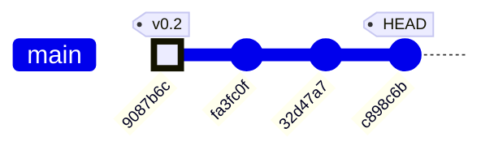
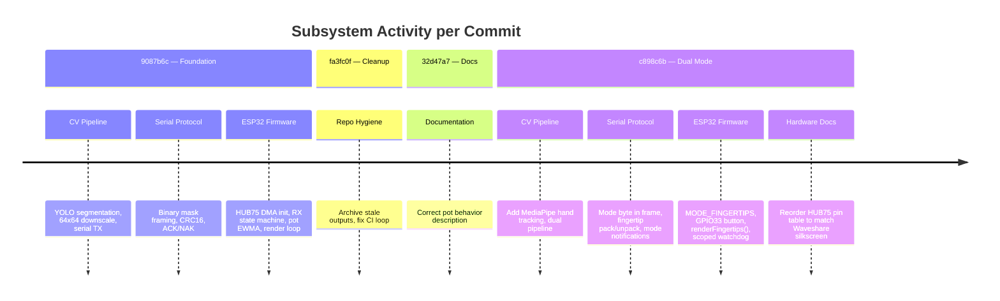
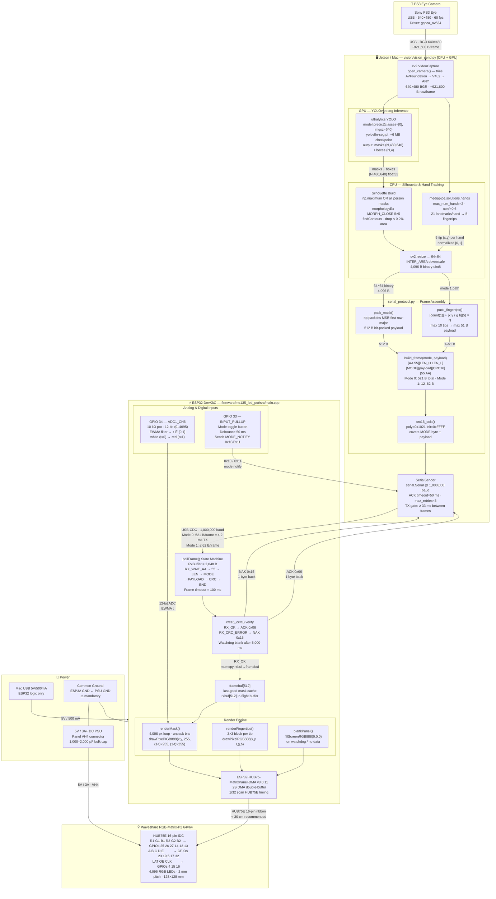
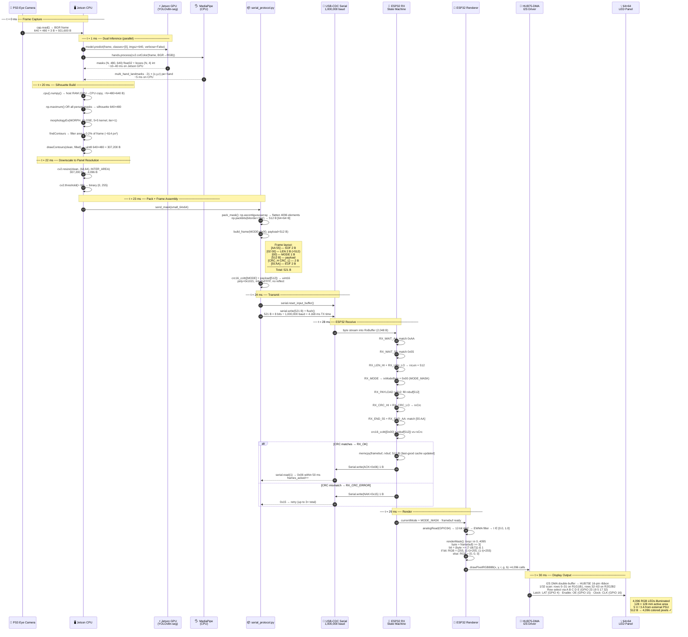

# ME135 Evolution Report

**Date:** 2026-05-09 12:39 &nbsp;|&nbsp; **Commit:** `c898c6b`

---

## What Changed

This batch of commits transforms a single-mode silhouette display into a **dual-mode system** (mask + fingertip tracking) and fixes a hardware wiring error that could have bricked setups built from the old docs.

### ESP32 Firmware (`main.cpp`) — Major protocol & rendering overhaul

- **Multi-mode serial protocol**: The frame format gained a `MODE` byte between the length field and payload. The old wire format was `[AA 55][LEN][512B payload][CRC][55 AA]`; the new one is `[AA 55][LEN][MODE][payload...][CRC][55 AA]`. CRC now covers MODE + payload (previously payload-only). This is a **breaking wire-protocol change** — both sides must be updated together.
- **MODE_FINGERTIPS (0x01)**: New render path. Receives `[count][x,y,r,g,b]×N` packets (up to 10 fingertips) and draws each as a 3×3 colored block on the panel. Purpose: a second team member (Wen) can drive the panel with hand-tracked colored dots instead of a silhouette mask.
- **Button-driven mode toggle (GPIO 33)**: A physical button on the ESP32 switches between mask mode and fingertip mode at runtime, with proper debounce (50 ms). The ESP32 sends `0x10`/`0x11` notification bytes upstream so the Mac knows which packet type to send.
- **Render refactor**: The old monolithic `renderFrame(r,g,b)` split into `renderMask()` (pot-driven white→red lerp baked in) and `renderFingertips()`. The panel is now blanked before each redraw — important because fingertip mode only draws sparse dots.
- **Watchdog scoped to mode 0 only**: The 5-second "blank if Mac stops sending" watchdog now only fires in mask mode. Fingertip mode stays on last frame — reasonable since finger tracking is inherently sporadic.
- **Cleanup**: Removed `COLOR_DEPTH` define and commented-out `setPixelColorDepthBits` call. Stripped verbose inline comments that were more tutorial than maintenance documentation.

### Serial Protocol (`serial_protocol.py`) — Mode-aware framing

- **`build_frame(mode, payload)`**: New universal frame builder that inserts the mode byte and computes CRC over `mode + payload`. Replaces the old mask-only framer.
- **`pack_fingertips()` / `unpack_fingertips()`**: Encode/decode fingertip lists into the compact `[count][x,y,r,g,b]...` binary format. Symmetric with `pack_mask()`/`unpack_mask()`.
- **`SerialSender` now mode-aware**: Exposes `send_mask()` and `send_fingertips()` as separate entry points. Tracks `esp32_mode` internally and provides `read_mode_change()` to poll for button-press notifications from the ESP32.
- **Mode notification constants**: `MODE_NOTIFY_0` (0x10) and `MODE_NOTIFY_1` (0x11) defined. These single-byte upstream messages let the ESP32 tell the Mac "I switched modes."

### Vision Pipeline (`vision_send.py`) — Unified YOLO + MediaPipe

- **Dual pipeline**: Every frame now runs *both* YOLO person segmentation (silhouette mask) and MediaPipe hand tracking (fingertip positions). Which result gets sent depends on the ESP32's current mode.
- **MediaPipe integration**: `extract_fingertips()` reads 5 landmark IDs (thumb tip, index tip, etc.) per detected hand (up to 2 hands), maps them to 64×64 panel coordinates, and assigns cycling RGB colors.
- **Mode-driven TX**: The main loop checks `sender.esp32_mode` and calls either `send_mask()` or `send_fingertips()`. Mode changes are received passively via `read_mode_change()`.
- **Preview enhancements**: Camera overlay now shows both fingertip dots and silhouette contours simultaneously, regardless of which mode is active on the ESP32. The 64×64 preview grid shows fingertip positions too.

### Hardware Docs (`WIRING.md`) — Critical pin-numbering fix

- **HUB75 pin table completely reordered**: The old table used Adafruit-style numbering (R1 at pin 1, GND at pin 16). The Waveshare RGB-Matrix-P2 64×64 numbers pins in *reverse* — pin 1 is GND/OE at the bottom-right, pin 16 is R1 at the top-left. **Anyone wiring from the old table would have had every signal on the wrong pin.** The GPIO assignments themselves didn't change — only which physical IDC pin each signal lands on.
- **Pin map comment in `main.cpp`** updated to show Waveshare pin numbers alongside GPIOs: e.g., `R1(16)=25` meaning "Waveshare HUB75 pin 16 → GPIO 25."

### Housekeeping

- **`fa3fc0f`**: Archived stale `agent_outputs/` directory and fixed a doc-generation hook that was creating infinite auto-commit loops.
- **`32d47a7`**: Fixed pot description in docs — it triggers effects (white→red lerp), not brightness control.

---

## Evolution Timeline

| Commit | Date | Summary | Subsystems touched |
|--------|------|---------|--------------------|
| `9087b6c` | May 7 | **64×64 mask → ESP32 → HUB75 panel + pot lerp** — Initial working pipeline: YOLO silhouette, serial framing, HUB75 DMA rendering, pot-controlled color | CV pipeline, serial protocol, ESP32 firmware |
| `fa3fc0f` | May 8 | Archive stale `agent_outputs/`, fix doc-hook auto-commit loop | Repo hygiene, CI |
| `32d47a7` | May 8 | Fix pot description — triggers white→red effect, not brightness | Docs |
| `c898c6b` | May 9 | **Waveshare pin-numbering fix** + finger-glove mode (MODE_FINGERTIPS), button debounce, MediaPipe integration, mode-aware protocol | ESP32 firmware, serial protocol, CV pipeline, hardware docs |

### Subsystem evolution across commits

**Key architectural milestone at `c898c6b`:** The system evolves from a single-purpose silhouette display into a mode-switchable platform. The ESP32 is now the mode authority (physical button), and the Mac adapts its TX format based on upstream notifications. This inverts the original control flow where the Mac was the sole driver.

---

## System Architecture

| Layer | Key Numbers |
|---|---|
| Camera raw frame | 640 × 480 × 3 B = **921,600 B** |
| YOLO inference size | 640 px letterboxed (GPU) |
| Silhouette at panel res | 64 × 64 = **4,096 B** (binary) |
| Bit-packed payload (Mode 0) | **512 B** (64 × 64 / 8) |
| Full framed packet (Mode 0) | **521 B** = 2+2+1+512+2+2 |
| Baud rate | **1,000,000 baud** USB-CDC |
| TX time per frame | ≈ **4.2 ms** → headroom for 30 fps |
| ESP32 RX buffer | **2,048 B** |
| Watchdog blank timeout | **5,000 ms** no-data |
| Panel power | **5 V / 3 A+** (separate PSU) |

---

## Data Flow

One frame's journey — camera shutter to glowing LED panel.

### Byte-count ledger per step

| Step | Data | Size |
|---|---|---|
| Raw camera frame | BGR uint8 640×480 | **921,600 B** |
| YOLO mask tensor (1 person) | float32 480×640 | **1,228,800 B** |
| Binary silhouette (640×480) | uint8 | **307,200 B** |
| Downscaled silhouette | uint8 64×64 | **4,096 B** |
| Bit-packed payload | Mode 0 | **512 B** |
| Full framed packet | SOF+LEN+MODE+payload+CRC+EOF | **521 B** |
| ACK/NAK reply | 1 byte | **1 B** |
| Mode-notify byte | ESP32 → host | **1 B** |
| framebuf cache | on ESP32 | **512 B** |
| Render calls | drawPixelRGB888 × 4,096 | **4,096 calls** |

### Timing budget at 30 fps (33.3 ms/frame)

| Phase | Estimated time |
|---|---|
| cap.read() | ~1 ms |
| YOLO GPU inference | ~10–40 ms |
| MediaPipe CPU | ~5 ms |
| Silhouette + resize | ~2 ms |
| pack + CRC + write | < 1 ms |
| Serial TX (521 B @ 1 Mbaud) | **4.2 ms** |
| ACK round-trip | ~1 ms |
| ESP32 render (4096 px) | ~2 ms |
| **Total (GPU path)** | **~26–56 ms** |

> ⚠️ YOLO is the dominant bottleneck. On Jetson with CUDA the GPU path runs ~15 ms/frame; on a Mac CPU it can exceed 40 ms, limiting effective TX rate below 25 fps.

---

## Module Dependency Graph

```mermaid
graph TD
  %% ── Entry Points ────────────────────────────────────────────────
  subgraph ENTRY["🚀 Entry Points"]
    VS["**vision_send.py**\n─────────────────\nmain() ← argparse\nautodetect_port()\nopen_camera()\nextract_fingertips()\ndraw_fingertips_camera()\ndraw_fingertips_grid()\nparse_args()"]

    VP["**vision.py**\n─────────────────\nmain() standalone\nopen_camera()\n❌ no serial sender\n[preview + save only]"]

    ORCH["**orchestrator.py**\n─────────────────\nrun_agent() async\nexecute_tool()\nwrite_file / read_file\n7× Claude agent swarm\nMODEL_ARCHITECT / CODER"]

    DA["**doc_agent.py**\n─────────────────\nHistorian agent\nArchitect agent  ← you are here\nCritic agent\ncollect_project_files()\nget_git_context()\ndb_connect() / db_save_*()"]
  end

  %% ── Core Protocol Library ───────────────────────────────────────
  subgraph PROTO["📦 serial_protocol.py — Public Interface"]
    SP_CLASS["**SerialSender** class\n─────────────────\n__init__(port, baudrate,\n  ack_timeout_s, max_retries)\nsend_mask(mask: ndarray) → bool\nsend_fingertips(tips: list) → bool\nread_mode_change() → int|None\nclose()\n─────────────────\nproperties: esp32_mode\ncounters: frames_sent/acked/naked"]

    SP_FN["**Free functions**\n─────────────────\nbuild_frame(mode, payload) → bytes\npack_mask(ndarray) → bytes [512 B]\nunpack_mask(bytes) → ndarray\npack_fingertips(list) → bytes\nunpack_fingertips(bytes) → list\ncrc16_ccitt(data, init) → int"]

    SP_TYPES["**Types / Constants**\n─────────────────\nFingertip(NamedTuple)\n  x, y, r, g, b: int\nPANEL_SIZE = 64\nPAYLOAD_BYTES = 512\nFRAME_START = AA 55\nFRAME_END   = 55 AA\nACK_BYTE = 0x06\nNAK_BYTE = 0x15\nMODE_MASK = 0x00\nMODE_FINGERTIPS = 0x01\nMODE_NOTIFY_0/1 = 0x10/0x11\nMAX_FINGERTIPS = 10"]
  end

  %% ── Doc / Sync system ───────────────────────────────────────────
  subgraph DOCS["📝 Documentation System"]
    GS["**gdrive_sync.py**\n─────────────────\ndetect_features()\nget_changed_files()\nsync_to_drive()\nappend_to_feature_doc()\ncompose_feature_section()\nfeature_to_filename()\nFEATURE_MAP dict\nRCLONE_REMOTE config"]

    GSU["**gdrive_setup.py**\n─────────────────\nmain()\n_create_remote()\nrclone OAuth browser flow\ntest sync to Drive"]
  end

  %% ── Firmware ────────────────────────────────────────────────────
  subgraph FW["⚡ firmware/me135_led_pot/"]
    MAIN_CPP["**main.cpp**\n─────────────────\nsetup() / loop()\npollFrame() RX state machine\nrenderMask()\nrenderFingertips()\nblankPanel()\ncrc16_ccitt() [C impl]\nFingertip struct\nRxState enum"]

    PINI["**platformio.ini**\n─────────────────\nplatform=espressif32@6.5.0\nboard=esp32dev\nframework=arduino\nmonitor_speed=115200"]
  end

  %% ── Python Package Dependencies ─────────────────────────────────
  subgraph PYLIBS["📦 Python Packages (vision/requirements.txt)"]
    YOLO_LIB["**ultralytics ≥ 8.0**\nYOLO class\nyolov8n-seg.pt ~6 MB\nauto-download on first run"]
    CV2_LIB["**opencv-python ≥ 4.8**\ncv2.VideoCapture\ncv2.resize / threshold\ncv2.findContours\ncv2.morphologyEx\ncv2.imshow / waitKey"]
    NP_LIB["**numpy ≥ 1.24**\nndarray · packbits\nmaximum · zeros\nascontiguousarray"]
    SER_LIB["**pyserial ≥ 3.5**\nserial.Serial\nSerial.write / read\nlist_ports.comports()"]
    MP_LIB["**mediapipe**\nmp.solutions.hands\nHands()\nprocess()"]
    ANT_LIB["**anthropic ≥ 0.40**\nAsyncAnthropic\nmessages.stream()\nclaude-opus/sonnet-4-6"]
  end

  %% ── C++ Library Dependencies ────────────────────────────────────
  subgraph CLIBS["📦 C++ / Arduino Libraries (platformio.ini lib_deps)"]
    HUB75_LIB["**ESP32-HUB75-MatrixPanel-DMA v3.0.11**\nMatrixPanel_I2S_DMA\ndrawPixelRGB888()\nfillScreenRGB888()\nI2S DMA HUB75E timing"]
    AGFX["**Adafruit GFX Library v1.11.9**"]
    ABUSIO["**Adafruit BusIO v1.16.1**"]
  end

  %% ── Import edges ────────────────────────────────────────────────

  %% vision_send.py imports
  VS -->|"from serial_protocol import\nFingertip · SerialSender\nMODE_MASK · MODE_FINGERTIPS"| SP_CLASS
  VS -->|"from serial_protocol import\nFingertip · MODE_* consts"| SP_TYPES
  VS -->|"import cv2"| CV2_LIB
  VS -->|"import numpy as np"| NP_LIB
  VS -->|"from ultralytics import YOLO"| YOLO_LIB
  VS -->|"import mediapipe as mp"| MP_LIB

  %% vision.py imports (standalone — NO serial_protocol)
  VP -->|"import cv2"| CV2_LIB
  VP -->|"import numpy as np"| NP_LIB
  VP -->|"from ultralytics import YOLO"| YOLO_LIB

  %% serial_protocol.py imports
  SP_CLASS -->|"import serial\nserial.tools.list_ports"| SER_LIB
  SP_CLASS -->|"import numpy"| NP_LIB
  SP_FN    -->|"import numpy"| NP_LIB
  SP_FN    -->|"import struct"| SP_TYPES

  %% doc_agent.py imports
  DA -->|"import anthropic"| ANT_LIB
  DA -->|"from gdrive_sync import\nsync_to_drive · detect_features\nget_changed_files"| GS

  %% orchestrator.py imports
  ORCH -->|"import anthropic"| ANT_LIB

  %% gdrive_sync → gdrive_setup relationship
  GS  -.->|"delegates rclone OAuth\n(user must run once)"| GSU

  %% firmware deps
  MAIN_CPP -->|"#include"| HUB75_LIB
  PINI     -->|"lib_deps"| HUB75_LIB
  PINI     -->|"lib_deps"| AGFX
  PINI     -->|"lib_deps"| ABUSIO
  HUB75_LIB -->|"depends"| AGFX
  HUB75_LIB -->|"depends"| ABUSIO

  %% ── Cross-system serial wire boundary ──────────────────────────
  SP_CLASS -.->|"⬇ USB-CDC 1 Mbaud\n521 B framed packet\nACK/NAK 1 B reply"| MAIN_CPP

  %% ── Styling ─────────────────────────────────────────────────────
  style SP_CLASS fill:#2d6a4f,color:#fff,stroke:#1b4332
  style SP_FN    fill:#2d6a4f,color:#fff,stroke:#1b4332
  style SP_TYPES fill:#2d6a4f,color:#fff,stroke:#1b4332
  style VS       fill:#1d3557,color:#fff,stroke:#457b9d
  style VP       fill:#1d3557,color:#fff,stroke:#457b9d
  style MAIN_CPP fill:#7b2d8b,color:#fff,stroke:#4a0e59
  style DA       fill:#6b3a1f,color:#fff,stroke:#3d1f0a
  style ORCH     fill:#6b3a1f,color:#fff,stroke:#3d1f0a
```

### Class / Interface Boundaries

| Boundary | Producer | Consumer | Contract |
|---|---|---|---|
| **Python → C firmware** | `SerialSender.send_mask()` | `pollFrame()` state machine | `[AA55][LEN][MODE][payload][CRC16][55AA]` · ACK=0x06 · NAK=0x15 |
| **ESP32 → Python** | `pollFrame()` button handler | `SerialSender.read_mode_change()` | Single byte `0x10` (mode 0) or `0x11` (mode 1) |
| **YOLO → Silhouette** | `model.predict()` GPU tensor | `np.maximum()` CPU loop | `result.masks.data` shape `(N, H, W)` float32 on GPU |
| **MediaPipe → Fingertips** | `hands.process()` CPU | `extract_fingertips()` | `hand_landmarks.landmark[i].{x,y,z}` normalized |
| **pack_mask → build_frame** | `pack_mask(ndarray)` | `build_frame(0x00, bytes)` | Exactly **512 B** or `ValueError` |
| **gdrive_sync → doc_agent** | `sync_to_drive()` | `da.main()` after agents | `list[tuple[str,str]]` sections + `list[dict]` proposals |

---

## Code Health Summary

**Overall Grade: B**

This is a well-structured, well-documented embedded + vision project with clear separation between the Python host pipeline, serial protocol, and ESP32 firmware. The serial framing protocol is solid — CRC-verified, ACK/NAK with retries, clean state machine on the ESP32 side. Documentation (`WIRING.md`) is exceptional for a course project.

**Strengths:** Clean serial protocol abstraction, defensive firmware (watchdog blanking, debounce, EWMA filtering), thorough hardware troubleshooting docs, proper async agent orchestration.

**Weaknesses:** A deploy-blocking missing dependency (`mediapipe`), stale README that documents wrong CRC scope, significant duplicated logic between `vision.py` and `vision_send.py`, and wasted compute running both ML models every frame regardless of active mode. No path traversal guard on the doc agent's file-read tool.

Two proposals are **must-fix** (PROP-001, PROP-003); the rest improve maintainability and performance with low risk.

---

## Improvement Proposals

| # | Title | Priority | Risk | Files |
|---|-------|----------|------|-------|
| PROP-001 | Button debounce fires on every LOW read, not on falling edge | must-fix | high | `firmware/me135_led_pot/src/main.cpp` |
| PROP-002 | CRC buffer on stack risks overflow for large payloads | nice-to-have | medium | `firmware/me135_led_pot/src/main.cpp` |
| PROP-003 | Mode-change notification can collide with ACK/NAK bytes | must-fix | medium | `vision/serial_protocol.py, firmware/me135_led_pot/src/main.cpp` |
| PROP-004 | Fingertip payload length not validated against actual count | nice-to-have | medium | `firmware/me135_led_pot/src/main.cpp` |
| PROP-005 | renderMask() recomputes pot color per-pixel unnecessarily | nice-to-have | low | `firmware/me135_led_pot/src/main.cpp` |
| PROP-006 | No version handshake between Mac and ESP32 after protocol change | future | low | `vision/serial_protocol.py, firmware/me135_led_pot/src/main.cpp` |
| PROP-001 | Missing `mediapipe` in both requirements.txt files | must-fix | low | `vision/requirements.txt` |
| PROP-002 | YOLO + MediaPipe both run every frame regardless of active mode | nice-to-have | low | `vision/vision_send.py` |
| PROP-003 | README CRC documentation contradicts actual implementation | must-fix | low | `firmware/me135_led_pot/README.md` |
| PROP-004 | `SerialSender` lacks context manager, risking serial port leak | nice-to-have | low | `vision/serial_protocol.py` |
| PROP-005 | Duplicated `open_camera()` function and YOLO pipeline logic | nice-to-have | low | `vision/vision.py, vision/vision_send.py` |
| PROP-006 | `doc_agent.py` `read_source` tool allows path traversal beyond project root | nice-to-have | medium | `doc_agent.py` |
| PROP-007 | ESP32 `pollFrame()` allocates 513-byte CRC buffer on stack every valid frame | nice-to-have | medium | `firmware/me135_led_pot/src/main.cpp` |
| PROP-008 | Concurrent agents append to shared global `_report_sections` and `_proposals` without synchronization | future | low | `doc_agent.py` |
| PROTO-001 | CRC scope mismatch between README and firmware | must-fix | medium | `firmware/me135_led_pot/README.md, vision/serial_protocol.py, firmware/me135_led_pot/src/main.cpp` |
| PROTO-002 | read_mode_change() races with send_mask() on the same serial port | must-fix | high | `vision/serial_protocol.py` |
| FW-001 | pot_ewma uninitialised on first render call (-1.0f sentinel leaks to color) | nice-to-have | low | `firmware/me135_led_pot/src/main.cpp` |
| FW-002 | Watchdog blanks panel at 5 s but lastFrameMs is only reset on RX_OK, not on retries | nice-to-have | low | `firmware/me135_led_pot/src/main.cpp` |
| CV-001 | GPU→CPU tensor copy done unconditionally even when no person detected | nice-to-have | low | `vision/vision_send.py, vision/vision.py` |
| CV-002 | vision.py and vision_send.py duplicate open_camera() and the YOLO inference block verbatim | must-fix | low | `vision/vision.py, vision/vision_send.py` |
| SERIAL-001 | autodetect_port() silently picks the first port alphabetically — wrong on multi-device Jetson rigs | nice-to-have | medium | `vision/vision_send.py` |
| INFRA-001 | orchestrator.py references claude-opus-4-6 / claude-sonnet-4-6 — non-standard model IDs | must-fix | high | `orchestrator.py, doc_agent.py` |
| INFRA-002 | doc_agent.py collect_project_files() reads everything into RAM before passing to agents — no size guard | nice-to-have | medium | `doc_agent.py` |
| HW-001 | Level shifter is 'optional but recommended' — should be mandatory for reliable HUB75E at full refresh | nice-to-have | medium | `firmware/WIRING.md` |

### PROP-001: Button debounce fires on every LOW read, not on falling edge
**Priority:** must-fix &nbsp;|&nbsp; **Risk:** high

**Problem:** The button handler in `loop()` checks `if (reading == LOW)` inside the debounce window, but it doesn't track whether the button *transitioned* to LOW. If the loop runs faster than DEBOUNCE_MS, the mode toggles once correctly, but on subsequent loops with the button still held, the `(millis() - lastDebounceMs) > DEBOUNCE_MS` check passes again because `lastDebounceMs` is only updated when the reading *changes*. If the button is held steady at LOW for >50ms, the mode will toggle every loop iteration — rapidly flickering between modes.

**Proposed fix:** Add a `buttonPressed` latch: only toggle mode on the falling edge (HIGH→LOW transition after debounce). Set the latch when debounced state transitions to LOW, clear it on transition to HIGH. Classic pattern: track `lastStableState` separately from `lastButtonState`.

**Affected files:** firmware/me135_led_pot/src/main.cpp

---

### PROP-002: CRC buffer on stack risks overflow for large payloads
**Priority:** nice-to-have &nbsp;|&nbsp; **Risk:** medium

**Problem:** In `pollFrame()` at the `RX_END_AA` case, a 513-byte `crcBuf[1 + PAYLOAD_BYTES]` is allocated on the stack every time a complete frame arrives. This works for the current 512-byte mask payload, but the stack allocation is fragile — if PAYLOAD_BYTES ever increases, or if the call stack is already deep, this could overflow the ESP32's 8KB default task stack.

**Proposed fix:** Compute CRC incrementally: `crc = crc16_ccitt(&rxModeByte, 1); crc = crc16_ccitt_continue(rxbuf, rxLen, crc);` by adding an `init` parameter to `crc16_ccitt`. Eliminates the copy entirely.

**Affected files:** firmware/me135_led_pot/src/main.cpp

---

### PROP-003: Mode-change notification can collide with ACK/NAK bytes
**Priority:** must-fix &nbsp;|&nbsp; **Risk:** medium

**Problem:** The ESP32 sends `0x10`/`0x11` on the same serial line as `0x06` (ACK) and `0x15` (NAK). The Python `_wait_ack()` method reads exactly 1 byte and treats anything other than ACK/NAK as a failure. If the button is pressed between a frame TX and the ACK read, the Mac receives the mode notification instead of the ACK, causing a spurious retry. Conversely, `read_mode_change()` could consume an ACK byte if called at the wrong time.

**Proposed fix:** Buffer incoming bytes in `_wait_ack()` and dispatch: ACK/NAK go to the ack result, 0x10/0x11 go to a mode-change queue. Or use a tiny framing wrapper around notifications so they're unambiguous.

**Affected files:** vision/serial_protocol.py, firmware/me135_led_pot/src/main.cpp

---

### PROP-004: Fingertip payload length not validated against actual count
**Priority:** nice-to-have &nbsp;|&nbsp; **Risk:** medium

**Problem:** On the ESP32 side, `fingertipCount = rxbuf[0]` is read and clamped to MAX_FINGERTIPS, but the code doesn't verify that `rxLen >= 1 + fingertipCount * 5`. A truncated packet (e.g., count=10 but only 3 fingertips of data) would read uninitialized `rxbuf` bytes as coordinates and colors.

**Proposed fix:** After reading `fingertipCount`, add: `if (rxLen < 1 + fingertipCount * 5) fingertipCount = (rxLen - 1) / 5;` to clamp to actually-received data.

**Affected files:** firmware/me135_led_pot/src/main.cpp

---

### PROP-005: renderMask() recomputes pot color per-pixel unnecessarily
**Priority:** nice-to-have &nbsp;|&nbsp; **Risk:** low

**Problem:** The pot-based color lerp (`cr`, `cg`, `cb`) is computed inside the 4096-iteration pixel loop. Since `last_t` doesn't change within a single render call, this is 4096 redundant float multiplications.

**Proposed fix:** Hoist the color computation above the loop: compute `cr`, `cg`, `cb` once, then use them for all lit pixels. Trivial refactor, measurable on ESP32 at high refresh rates.

**Affected files:** firmware/me135_led_pot/src/main.cpp

---

### PROP-006: No version handshake between Mac and ESP32 after protocol change
**Priority:** future &nbsp;|&nbsp; **Risk:** low

**Problem:** The protocol breaking change (adding the MODE byte) means the Mac and ESP32 must be updated in lockstep. There's no version negotiation — if one side is stale, frames will silently fail CRC and the user sees only NAK retries with no explanation.

**Proposed fix:** Add a startup handshake: Mac sends a version-query command, ESP32 replies with protocol version. If mismatched, print a clear error. Could be as simple as a reserved mode byte (e.g., 0xFF) with a 1-byte version payload.

**Affected files:** vision/serial_protocol.py, firmware/me135_led_pot/src/main.cpp

---

### PROP-001: Missing `mediapipe` in both requirements.txt files
**Priority:** must-fix &nbsp;|&nbsp; **Risk:** low

**Problem:** `vision/vision_send.py` imports `mediapipe` (`import mediapipe as mp`), but neither `vision/requirements.txt` nor the root `requirements.txt` lists it. Anyone following the setup instructions (`pip install -r requirements.txt`) will get an `ImportError: No module named 'mediapipe'` at runtime. This is a silent deployment-breaking bug.

**Proposed fix:** Add `mediapipe>=0.10.0` to `vision/requirements.txt`. This is the only requirements file the vision pipeline should reference.

**Affected files:** vision/requirements.txt

---

### PROP-002: YOLO + MediaPipe both run every frame regardless of active mode
**Priority:** nice-to-have &nbsp;|&nbsp; **Risk:** low

**Problem:** In `vision/vision_send.py::main()`, the YOLO segmentation pipeline AND the MediaPipe hand pipeline run on every frame unconditionally. When `current_mode == 0` (mask), the MediaPipe results are computed but never sent. When `current_mode == 1` (fingertips), the full YOLO predict + contour extraction runs but the mask is never sent. YOLO inference alone costs ~15-30ms/frame on CPU. This wastes ~50% of compute budget.

**Proposed fix:** Gate each pipeline on `current_mode`. Only run `model.predict(...)` when `current_mode == MODE_MASK` and only run `hands.process(rgb)` when `current_mode == MODE_FINGERTIPS`. Keep the preview rendering for both modes if desired, but skip the heavy inference call for the inactive mode.

**Affected files:** vision/vision_send.py

---

### PROP-003: README CRC documentation contradicts actual implementation
**Priority:** must-fix &nbsp;|&nbsp; **Risk:** low

**Problem:** `firmware/me135_led_pot/README.md` states: 'CRC-16/CCITT-FALSE ... over the 512-byte payload only.' However, both the Python code (`serial_protocol.py::build_frame` — `body = bytes([mode]) + payload; crc = crc16_ccitt(body)`) and the ESP32 firmware (`main.cpp::pollFrame` — `crcBuf[0] = rxModeByte; ... crc16_ccitt(crcBuf, 1 + rxLen)`) compute the CRC over the MODE byte + payload (513 bytes for mask mode, not 512). A third-party implementer following the README would produce wrong CRCs, getting perpetual NAKs.

**Proposed fix:** Update the README's wire protocol section to state: 'CRC-16/CCITT-FALSE over MODE byte + payload (1 + LEN bytes).' Also update the example frame diagram to show the MODE byte is included in the CRC scope.

**Affected files:** firmware/me135_led_pot/README.md

---

### PROP-004: `SerialSender` lacks context manager, risking serial port leak
**Priority:** nice-to-have &nbsp;|&nbsp; **Risk:** low

**Problem:** In `vision/serial_protocol.py`, `SerialSender` opens a serial port in `__init__` and exposes a `close()` method, but does not implement `__enter__`/`__exit__`. If an exception occurs between construction and the `finally` block in `vision_send.py::main()`, the port stays locked. On macOS, a leaked `/dev/cu.*` port blocks all subsequent opens until the process dies, requiring manual `lsof | grep cu.usb` hunting.

**Proposed fix:** Add `__enter__` (return self) and `__exit__` (call `self.close()`) to `SerialSender`. Callers can then use `with SerialSender(...) as sender:` for guaranteed cleanup. Keep `close()` for backward compat.

**Affected files:** vision/serial_protocol.py

---

### PROP-005: Duplicated `open_camera()` function and YOLO pipeline logic
**Priority:** nice-to-have &nbsp;|&nbsp; **Risk:** low

**Problem:** `vision/vision.py::open_camera()` and `vision/vision_send.py::open_camera()` are identical 8-line functions. The YOLO predict → mask merge → morphologyEx → findContours → clean pipeline (~30 lines) is also duplicated between both files. If the YOLO post-processing logic is updated in one file (e.g., changing `min_area` threshold or morph kernel), the other file silently diverges.

**Proposed fix:** Extract `open_camera()` and a `process_yolo_frame(model, frame, confidence) -> (clean_mask, contours, boxes)` function into a shared module (e.g., `vision/pipeline.py`). Both `vision.py` and `vision_send.py` import from it.

**Affected files:** vision/vision.py, vision/vision_send.py

---

### PROP-006: `doc_agent.py` `read_source` tool allows path traversal beyond project root
**Priority:** nice-to-have &nbsp;|&nbsp; **Risk:** medium

**Problem:** The `read_source` tool in `doc_agent.py` resolves `PROJECT_ROOT / filename` and reads it. Unlike `orchestrator.py` which checks `Path(filename).name != filename`, `doc_agent.py`'s tool has no path validation. A Claude agent could request `../../.env` or `../../.git/config` to read secrets, API keys, or credentials outside the project tree. While the LLM agent is semi-trusted, the tool should enforce boundaries defensively.

**Proposed fix:** After resolving the path, check `resolved.resolve().is_relative_to(PROJECT_ROOT.resolve())`. Return an error string if the path escapes the project root. Add the same guard to the 8 KB truncation logic.

**Affected files:** doc_agent.py

---

### PROP-007: ESP32 `pollFrame()` allocates 513-byte CRC buffer on stack every valid frame
**Priority:** nice-to-have &nbsp;|&nbsp; **Risk:** medium

**Problem:** In `main.cpp::pollFrame()`, the CRC verification block declares `uint8_t crcBuf[1 + PAYLOAD_BYTES]` (513 bytes) on the stack inside the `RX_END_AA` case. ESP32's default task stack is 8 KB. This 513-byte allocation plus the existing `rxbuf[512]` and `framebuf[512]` globals is safe today, but if called from a deeper call chain or a FreeRTOS task with a smaller stack, it risks stack overflow with no warning.

**Proposed fix:** Make `crcBuf` a static local (`static uint8_t crcBuf[...]`) or compute the CRC incrementally: `crc = crc16_ccitt(&rxModeByte, 1); crc = crc16_ccitt(rxbuf, rxLen, crc);` — the existing `crc16_ccitt` already accepts an `init` parameter. This eliminates the copy and the stack allocation entirely.

**Affected files:** firmware/me135_led_pot/src/main.cpp

---

### PROP-008: Concurrent agents append to shared global `_report_sections` and `_proposals` without synchronization
**Priority:** future &nbsp;|&nbsp; **Risk:** low

**Problem:** In `doc_agent.py`, three agents run via `asyncio.gather()` and their tool callbacks all mutate the module-level `_report_sections` (list.append) and `_proposals` (list.extend). While CPython's GIL makes individual list operations atomic, `list.extend` from `write_proposals` is NOT atomic with respect to other appends — another agent's `write_section` append could interleave between extend's internal iterations. More importantly, if the code ever moves to threads (or a different Python runtime), this becomes a data corruption bug.

**Proposed fix:** Pass a per-agent accumulator dict into each `run_agent()` call and merge results after `asyncio.gather()` completes. This eliminates shared mutable state entirely and makes agent outputs deterministically ordered.

**Affected files:** doc_agent.py

---

### PROTO-001: CRC scope mismatch between README and firmware
**Priority:** must-fix &nbsp;|&nbsp; **Risk:** medium

**Problem:** firmware/me135_led_pot/README.md states the CRC covers 'the 512-byte payload only', but both serial_protocol.py (build_frame) and main.cpp (RX_END_AA handler) compute CRC over [MODE byte + payload]. Any third-party implementation built from the README alone will produce wrong CRCs and get NAK-looped forever.

**Proposed fix:** Update README.md wire-protocol section to read: 'CRC-16/CCITT-FALSE over [MODE(1 B) + payload(N B)]. Total CRC input = 513 B for Mode 0.' Add a worked hex example.

**Affected files:** firmware/me135_led_pot/README.md, vision/serial_protocol.py, firmware/me135_led_pot/src/main.cpp

---

### PROTO-002: read_mode_change() races with send_mask() on the same serial port
**Priority:** must-fix &nbsp;|&nbsp; **Risk:** high

**Problem:** SerialSender.read_mode_change() reads from self._ser.in_waiting opportunistically, but _send_packet() calls reset_input_buffer() before every write. If a MODE_NOTIFY byte (0x10/0x11) arrives in the window between reset_input_buffer() and serial.read(1) for the ACK, the notify byte is silently discarded. The host never switches modes until the next button press.

**Proposed fix:** Add a dedicated RX thread that reads the serial port continuously and dispatches ACK bytes vs. mode-notify bytes to separate queues. _wait_ack() then reads from the ACK queue with a timeout, and the mode queue is polled from the main loop. Alternatively, add a 1-byte peek before reset_input_buffer() to drain any pending notify bytes first.

**Affected files:** vision/serial_protocol.py

---

### FW-001: pot_ewma uninitialised on first render call (-1.0f sentinel leaks to color)
**Priority:** nice-to-have &nbsp;|&nbsp; **Risk:** low

**Problem:** In main.cpp, pot_ewma = -1.0f and last_t = -1.0f are set as globals. renderMask() uses `float t = (last_t > 0.0f) ? last_t : 0.0f`, so t=0 on the first frame. However, the EWMA update only runs in loop() after a frame is received. If a frame arrives before the first analogRead() EWMA tick (which can happen at 1 Mbaud), last_t remains -1 and the guard saves it. The guard is correct but the intent is opaque — a named constant would be clearer, and the first ADC read should occur in setup().

**Proposed fix:** In setup(), call analogRead(POT_PIN) once and initialise pot_ewma = analogRead(POT_PIN) / 4095.0f; last_t = pot_ewma; to guarantee a valid color on the first rendered frame. Remove the sentinel -1.0f pattern.

**Affected files:** firmware/me135_led_pot/src/main.cpp

---

### FW-002: Watchdog blanks panel at 5 s but lastFrameMs is only reset on RX_OK, not on retries
**Priority:** nice-to-have &nbsp;|&nbsp; **Risk:** low

**Problem:** The 5,000 ms watchdog in loop() compares millis() - lastFrameMs. lastFrameMs is updated only on RX_OK. During retry storms (3 retries × 50 ms ACK timeout = up to 200 ms delay per frame) or a brief cable disconnect, the panel blanks even though the host is actively sending. At 30 fps the host retransmits every 33 ms; 5 s / 33 ms = 151 consecutive failed frames before blanking, which is reasonable — but is undocumented.

**Proposed fix:** Document the watchdog behaviour in a comment. Optionally add a separate 'last_rx_attempt_ms' timestamp updated whenever any valid SOF (0xAA 0x55) is seen, and use that for a shorter connectivity indicator (e.g., blink an LED) while keeping the 5 s blank threshold for full silence.

**Affected files:** firmware/me135_led_pot/src/main.cpp

---

### CV-001: GPU→CPU tensor copy done unconditionally even when no person detected
**Priority:** nice-to-have &nbsp;|&nbsp; **Risk:** low

**Problem:** In vision_send.py, masks = result.masks.data.cpu().numpy() is only called inside `if result.masks is not None`, which is correct. But the result object itself (a full YOLO Results object) is always allocated on the GPU and transferred to host regardless of detections. On Jetson, the .cpu() call serialises the CUDA stream. When zero people are in frame, this copy is wasted every frame at ~30 fps.

**Proposed fix:** Check result.masks is not None before building the Results object at all using YOLO's stream=True mode and processing results lazily. Alternatively, add an early-continue path: if result.boxes is None or len(result.boxes) == 0: skip the mask extraction block entirely and send a zero mask directly, avoiding the tensor transfer.

**Affected files:** vision/vision_send.py, vision/vision.py

---

### CV-002: vision.py and vision_send.py duplicate open_camera() and the YOLO inference block verbatim
**Priority:** must-fix &nbsp;|&nbsp; **Risk:** low

**Problem:** open_camera(), the YOLO predict loop, silhouette morphology, contour filtering, and the 64×64 resize are copy-pasted between vision.py (standalone preview) and vision_send.py (full sender). Any bug fix or parameter change must be applied twice. Already seen: vision.py uses a hardcoded confidence trackbar while vision_send.py uses argparse — the two have diverged.

**Proposed fix:** Extract a shared vision_core.py module with: open_camera(), run_yolo_silhouette(frame, model, conf) → ndarray, run_mediapipe_fingertips(frame, hands) → list[Fingertip]. Both vision.py and vision_send.py import from it. vision.py becomes a thin preview wrapper; vision_send.py adds only the serial plumbing.

**Affected files:** vision/vision.py, vision/vision_send.py

---

### SERIAL-001: autodetect_port() silently picks the first port alphabetically — wrong on multi-device Jetson rigs
**Priority:** nice-to-have &nbsp;|&nbsp; **Risk:** medium

**Problem:** autodetect_port() does sorted(glob.glob(pat))[0]. On a Jetson with multiple USB-serial adapters (e.g., debug UART on /dev/ttyUSB0, ESP32 on /dev/ttyUSB1), the wrong device gets opened. The error only surfaces as a stream of NAK responses or garbled output, with no diagnostic message.

**Proposed fix:** After opening the port, send a known probe byte (e.g., 0x00 + frame-end 0x55 0xAA) and listen for a NAK (0x15) within 200 ms. If no response, try the next candidate port. Log which port was selected and why. Alternatively, expose a --port-hint substring flag so users can write --port-hint ESP32.

**Affected files:** vision/vision_send.py

---

### INFRA-001: orchestrator.py references claude-opus-4-6 / claude-sonnet-4-6 — non-standard model IDs
**Priority:** must-fix &nbsp;|&nbsp; **Risk:** high

**Problem:** MODEL_ARCHITECT = 'claude-opus-4-6' and MODEL_CODER = 'claude-sonnet-4-6' are not valid Anthropic API model identifiers as of the current API. The API will return a 404/invalid-model error at runtime, silently aborting all 7 agents. The correct identifiers use a date suffix (e.g. claude-opus-4-5, claude-sonnet-4-5) or the API alias 'claude-opus-latest'.

**Proposed fix:** Replace hardcoded model strings with the anthropic SDK's named constants or validated aliases. Add a startup check: client.models.list() and assert the chosen model appears in the list, failing fast with a clear error message rather than discovering the issue mid-swarm.

**Affected files:** orchestrator.py, doc_agent.py

---

### INFRA-002: doc_agent.py collect_project_files() reads everything into RAM before passing to agents — no size guard
**Priority:** nice-to-have &nbsp;|&nbsp; **Risk:** medium

**Problem:** collect_project_files() globs all *.py, *.md, *.cpp, *.h, *.ini, *.txt files and reads them into a single dict. With growing agent_outputs/ (each run appends to feature docs), this dict can grow unboundedly. Feature docs with 50+ commits easily exceed 500 KB, and the entire dict is serialised into the agent system prompt, consuming token budget before the agent writes a single line.

**Proposed fix:** Add a per-file size cap (e.g., 16 KB, truncating with a [...truncated...] marker) and a total-dict cap (e.g., 256 KB). Exclude agent_outputs/ and docs/features/ from the glob — agents can call read_source() for specific files they need rather than receiving everything upfront.

**Affected files:** doc_agent.py

---

### HW-001: Level shifter is 'optional but recommended' — should be mandatory for reliable HUB75E at full refresh
**Priority:** nice-to-have &nbsp;|&nbsp; **Risk:** medium

**Problem:** WIRING.md §7 marks the 74HCT245 level shifter as optional. The Waveshare RGB-Matrix-P2 uses a HUB75E controller that specifies 5V logic levels on its inputs. At 3.3V (ESP32 output), the logic-high threshold (≥3.5V for TTL) is not met. This is reliable at low refresh rates but causes ghost pixels, first-row brightness anomalies, and corrupted output above ~80–100 Hz — exactly the symptoms described in the troubleshooting table.

**Proposed fix:** Reclassify the level shifter as required for production use. Update §7 to state: 'Insert one 74AHCT245 (R1,G1,B1,R2,G2,B2,CLK,LAT) + one 74AHCT125 quad buffer (A,B,C,D,E,OE) between ESP32 and HUB75 IN. VCC=5V from panel PSU. This is mandatory for reliable operation above 60 Hz.' Update the bring-up checklist (§9) accordingly.

**Affected files:** firmware/WIRING.md

---
