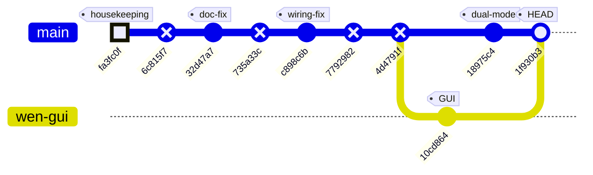
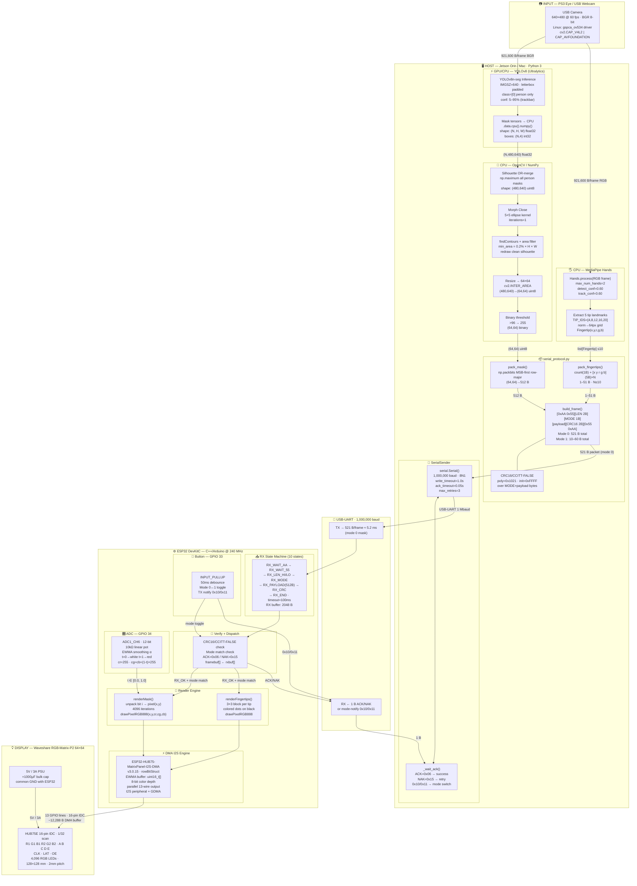
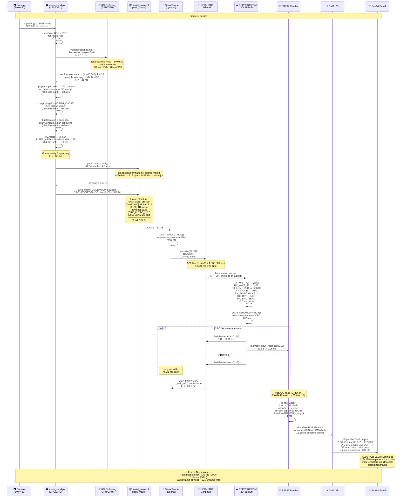
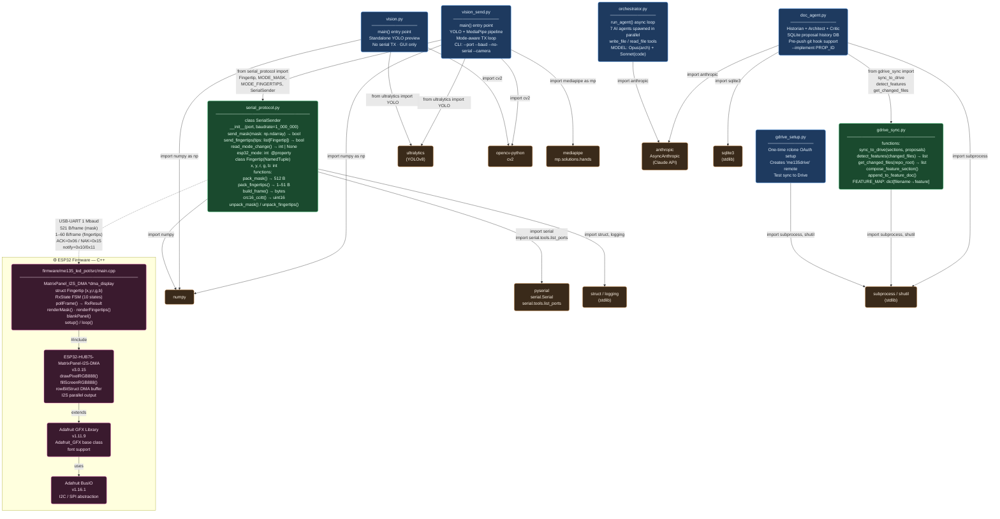

# ME135 Evolution Report

**Date:** 2026-05-09 14:13 &nbsp;|&nbsp; **Commit:** `1f930b3`

---

## What Changed

This batch of commits (from `fa3fc0f` → `1f930b3`) represents a major capability leap: the project went from a single-mode silhouette display to a **dual-mode system** with both person silhouettes and color fingertip tracking, plus a parallel GUI effort from a teammate.

### CV Pipeline & Vision (`vision/`)

- **New unified pipeline `vision_send.py`** — Merges YOLO person segmentation (Kyle's original) with MediaPipe hand tracking (Wen's contribution) into a single script. Both pipelines run every frame; the active TX mode is determined by the ESP32's physical button. This is the new "main" entry point, replacing the old `vision.py` as the operational sender.
  - *Why it matters:* The system can now detect colored fingertips (up to 10, across 2 hands) with cycling per-finger RGB colors — a second interaction modality beyond the silhouette.
- **`vision.py` preserved as standalone** — The original YOLO-only pipeline remains unchanged for debugging or single-mode use. No regression risk.

### Serial Protocol (`vision/serial_protocol.py`)

- **Added Mode 0x01 (fingertip packets)** — New `pack_fingertips()` / `unpack_fingertips()` functions serialize up to 10 fingertip positions with per-tip RGB color into a compact `[count][x,y,r,g,b]…` payload. CRC16 integrity check covers the mode byte + payload.
- **Mode-change notification handling** — `SerialSender` now listens for ESP32 mode-change bytes (`0x10` = mode 0, `0x11` = mode 1) interleaved with ACK/NAK responses. The `_handle_mode_byte()` method drains and interprets these asynchronously.
  - *Why it matters:* The ESP32 button drives mode selection — the Python side is a follower, not a leader. Clean separation of concerns.

### ESP32 Firmware (`firmware/me135_led_pot/src/main.cpp`)

- **Dual-mode rendering** — Firmware now handles two frame types:
  - Mode 0 (mask): 512-byte bit-packed silhouette, colored by pot-controlled white→red lerp (unchanged behavior).
  - Mode 1 (fingertips): Parses `[count][x,y,r,g,b]…` packets and renders each fingertip as a **3×3 pixel block** for visibility on the 2mm-pitch panel.
- **Physical button toggle (GPIO 33)** — A debounced pushbutton cycles between modes. On press, the ESP32 sends a mode-notification byte (`0x10`/`0x11`) upstream so the Python sender switches packet format.
- **Receive state machine extended** — `pollFrame()` now validates the incoming mode byte against `currentMode` and rejects mismatched frames (returns `RX_SYNC_ERROR`), preventing garbled renders during mode transitions.
- **Watchdog on both modes** — If no valid frame arrives within 5 seconds, the panel blanks. Prevents stale imagery if the USB link drops.

### Hardware Documentation (`firmware/WIRING.md`)

- **HUB75 pin numbering corrected** (`c898c6b`) — The pin table was renumbered to match the Waveshare RGB-Matrix-P2 64×64 silkscreen (pin 1 = bottom-right, pin 16 = top-left). Previously the numbering was inverted, which would cause a mis-wire on first build.
  - *Why it matters:* A wiring doc error on a 16-pin ribbon cable means magic smoke. This was a safety-critical doc fix.
- **Pot description corrected** (`32d47a7`) — Documentation previously said the potentiometer controls "brightness." It actually controls a white→red color lerp (effect selection), not intensity. Fixed to prevent user confusion.

### GUI (Steph's Branch — `Steph/Project_GUI.py`)

- **New Tkinter/OpenCV GUI added** (`10cd864`, merged at `1f930b3`) — Teammate Wen/Steph contributed a standalone GUI with:
  - Final layout with interactive icons
  - Checkerboard border decoration (`checker_tile.png` asset)
  - YOLOv8n-seg model bundled (`yolov8n-seg.pt`)
  - Separate `requirements.txt` for its dependencies
  - *Why it matters:* This is a parallel UI effort — a presentation-ready front-end, likely for the ME135 final demo. It lives in `Steph/` and doesn't touch Kyle's pipeline code.

### DevOps & Housekeeping

- **Stale `agent_outputs/` archived** (`fa3fc0f`) — Old Claude agent swarm outputs cleaned up.
- **Doc-hook auto-commit loop fixed** (`fa3fc0f`) — The git pre-push hook was triggering its own push, creating an infinite loop. Now broken with `[skip ci]` markers on auto-generated doc commits.
- **Presentation PDF added** — `ME 135235 Presentation 3.pdf` (9606 lines in diff = binary blob) committed at the repo root for class deliverable tracking.

---

## Evolution Timeline

### Subsystem touch map

| Commit | CV Pipeline | Serial Protocol | ESP32 Firmware | Wiring Docs | GUI (Steph/) | DevOps |
|--------|:-----------:|:---------------:|:--------------:|:-----------:|:------------:|:------:|
| `fa3fc0f` archive + fix loop | | | | | | ✅ |
| `32d47a7` pot desc fix | | | | ✅ | | |
| `c898c6b` HUB75 pin fix | | | | ✅ | | |
| `10cd864` GUI layout (Wen) | | | | | ✅ | |
| `18975c4` dual-mode merge | ✅ | ✅ | ✅ | | | |
| `1f930b3` GUI merge (HEAD) | | | | | ✅ | |

> Commits marked `type: REVERSE` in the graph are auto-generated doc reports (`[skip ci]`) — they contain no code changes.

### Key milestone

Commit `18975c4` is the architectural inflection point: the system graduated from a **single-pipeline, single-mode** design (YOLO silhouette only) to a **dual-pipeline, button-toggled** architecture spanning all three core subsystems (CV, serial protocol, firmware). Every layer gained a new code path, yet the mode-negotiation protocol keeps them synchronized through a simple 1-byte notification scheme.

---

## System Architecture

---

## Data Flow

One frame journey — **Mode 0 (mask)** path. Timing estimates based on yolov8n-seg on CPU; GPU path ~3–5× faster.

---

## Module Dependency Graph

### Interface Summary Table

| Boundary | From | To | Contract |
|---|---|---|---|
| **Python import** | `vision_send.py` | `serial_protocol.py` | `SerialSender`, `Fingertip`, `MODE_*` constants |
| **Python import** | `doc_agent.py` | `gdrive_sync.py` | `sync_to_drive()`, `detect_features()`, `get_changed_files()` |
| **Serial wire** | `serial_protocol.SerialSender` | `main.cpp` | `build_frame()` framing · CRC16/CCITT-FALSE · ACK/NAK |
| **C++ include** | `main.cpp` | `ESP32-HUB75-MatrixPanel-I2S-DMA` | `drawPixelRGB888()`, `fillScreenRGB888()` |
| **C++ inheritance** | `MatrixPanel_I2S_DMA` | `Adafruit_GFX` | GFX drawing primitives |
| **Claude API** | `orchestrator.py` / `doc_agent.py` | `anthropic` | Async streaming · tool_use loop |

---

## Code Health Summary

**Overall Grade: B−**

The project demonstrates solid embedded/vision architecture — a clean framed serial protocol with CRC, well-documented HUB75 wiring, and a coherent agent-based documentation system. The firmware state machine is correct and robust against malformed input.

**Strengths:** Protocol symmetry between Python and C++ (matching CRC, framing, mode semantics). Excellent hardware documentation (WIRING.md). Good use of EWMA smoothing on pot readings. Defensive input validation on serial payloads.

**Weaknesses:** A path traversal vulnerability in doc_agent.py's `read_source` tool is the most urgent finding. Missing `mediapipe` dependency in requirements.txt will break fresh installs. Both CV pipelines run unconditionally every frame, halving achievable FPS. Shared mutable state between concurrent async agents is fragile. The firmware allocates a 513-byte stack buffer unnecessarily. Several resources (serial port, camera) lack guaranteed cleanup via context managers.

---

## Improvement Proposals

| # | Title | Priority | Risk | Files |
|---|-------|----------|------|-------|
| SEC-001 | Path traversal in doc_agent.py read_source tool | must-fix | high | `doc_agent.py` |
| BUG-001 | Missing mediapipe in vision/requirements.txt | must-fix | low | `vision/requirements.txt` |
| BUG-002 | NoneType crash when pausing before first frame captured | must-fix | low | `vision/vision.py, vision/vision_send.py` |
| PERF-001 | Both YOLO and MediaPipe run every frame regardless of active mode | nice-to-have | low | `vision/vision_send.py` |
| FW-001 | 513-byte stack CRC buffer in firmware pollFrame() is wasteful and fragile | nice-to-have | medium | `firmware/me135_led_pot/src/main.cpp` |
| REL-001 | Shared mutable lists in doc_agent.py accessed by concurrent async agents | nice-to-have | medium | `doc_agent.py` |
| REL-002 | SerialSender lacks context manager protocol and cleanup on exception | nice-to-have | low | `vision/serial_protocol.py, vision/vision_send.py` |
| REL-003 | git subprocess failures silently swallowed in gdrive_sync.py | future | low | `gdrive_sync.py` |
| PROP-010 | ESP32 CRC buffer allocated on stack may overflow for fingertip mode | nice-to-have | low | `firmware/me135_led_pot/src/main.cpp` |
| PROP-011 | vision_send.py silently drops frames on mode mismatch instead of queuing | nice-to-have | low | `vision/vision_send.py` |
| PROP-012 | No .gitignore for Steph/ directory — large model file committed | must-fix | low | `Steph/.gitignore` |
| PROP-013 | Presentation PDF committed at repo root bloats history | nice-to-have | low | `ME 135235 Presentation 3.pdf` |
| PROP-014 | MediaPipe hands not released on crash path in vision_send.py | nice-to-have | medium | `vision/vision_send.py` |
| PROP-015 | ESP32 button debounce uses polling, not interrupt — may miss fast presses | future | low | `firmware/me135_led_pot/src/main.cpp` |

### SEC-001: Path traversal in doc_agent.py read_source tool
**Priority:** must-fix &nbsp;|&nbsp; **Risk:** high

**Problem:** In doc_agent.py `execute_tool()`, the `read_source` handler builds a file path via `PROJECT_ROOT / tool_input['filename']` with zero validation. An LLM agent can request `../../etc/passwd` or `../../.env` and read arbitrary files on disk. The orchestrator.py `execute_tool` correctly checks `Path(filename).name != filename` for its write_file/read_file tools, but doc_agent.py has no equivalent guard.

**Proposed fix:** Resolve the path, then assert it stays within PROJECT_ROOT: `resolved = (PROJECT_ROOT / tool_input['filename']).resolve(); if not resolved.is_relative_to(PROJECT_ROOT.resolve()): return 'ERROR: path outside project'`. This mirrors the traversal check already present in orchestrator.py.

**Affected files:** doc_agent.py

---

### BUG-001: Missing mediapipe in vision/requirements.txt
**Priority:** must-fix &nbsp;|&nbsp; **Risk:** low

**Problem:** vision_send.py imports `mediapipe` (`import mediapipe as mp`) but vision/requirements.txt only lists ultralytics, opencv-python, numpy, and pyserial. Anyone installing from requirements.txt will get an immediate ImportError when running vision_send.py.

**Proposed fix:** Add `mediapipe>=0.10` to vision/requirements.txt.

**Affected files:** vision/requirements.txt

---

### BUG-002: NoneType crash when pausing before first frame captured
**Priority:** must-fix &nbsp;|&nbsp; **Risk:** low

**Problem:** In both vision/vision.py and vision/vision_send.py, `last_frame` is initialized to `None`. If the user presses SPACE before the first successful `cap.read()`, the `else` branch executes `frame = last_frame.copy()` which throws `AttributeError: 'NoneType' object has no attribute 'copy'`. This is a race that's easy to trigger if the camera is slow to initialize.

**Proposed fix:** Guard the pause toggle: `elif key == ord(' '): if last_frame is not None: paused = not paused`. Alternatively, skip the pause branch when `last_frame is None`.

**Affected files:** vision/vision.py, vision/vision_send.py

---

### PERF-001: Both YOLO and MediaPipe run every frame regardless of active mode
**Priority:** nice-to-have &nbsp;|&nbsp; **Risk:** low

**Problem:** In vision_send.py, both the YOLO segmentation model and MediaPipe hand tracker run on every frame, even though only one mode's data is sent to the ESP32. YOLO inference at 640px is the dominant cost (~30-50ms/frame on CPU). When in fingertip mode (mode 1), the YOLO pass is pure waste; when in mask mode (mode 0), the MediaPipe pass is wasted.

**Proposed fix:** Gate each pipeline on `current_mode`: `if current_mode == 0: <run YOLO>` and `if current_mode == 1: <run MediaPipe>`. Still render both previews if desired, but skip the heavy inference for the inactive mode. This could nearly double FPS.

**Affected files:** vision/vision_send.py

---

### FW-001: 513-byte stack CRC buffer in firmware pollFrame() is wasteful and fragile
**Priority:** nice-to-have &nbsp;|&nbsp; **Risk:** medium

**Problem:** In main.cpp `pollFrame()`, `uint8_t crcBuf[1 + PAYLOAD_BYTES]` allocates 513 bytes on the stack every time a complete frame is received. ESP32 Arduino default loop task stack is 8KB; this single allocation consumes 6% of it. For fingertip mode (max 51 bytes payload), 462 bytes are unused. If future protocol changes increase PAYLOAD_BYTES, this risks a stack overflow.

**Proposed fix:** Compute CRC incrementally: `uint16_t calc = crc16_ccitt(&rxModeByte, 1); calc = crc16_ccitt(rxbuf, rxLen, calc);` — modify crc16_ccitt to accept an `init` parameter (it already takes one conceptually). This eliminates the temp buffer entirely.

**Affected files:** firmware/me135_led_pot/src/main.cpp

---

### REL-001: Shared mutable lists in doc_agent.py accessed by concurrent async agents
**Priority:** nice-to-have &nbsp;|&nbsp; **Risk:** medium

**Problem:** Module-level `_report_sections` and `_proposals` lists are appended to by three agents running as concurrent asyncio tasks. While Python's GIL makes `list.append()` thread-safe, the pattern is error-prone: agent tool handlers mutate shared state without explicit synchronization, and the final assembly reads these lists without any ordering guarantee. If the code ever moves to threads or multiprocessing, this becomes a data race.

**Proposed fix:** Pass an `asyncio.Queue` or a per-agent result dict to each agent runner. Collect results after `asyncio.gather()` returns. This makes data flow explicit and eliminates shared mutation.

**Affected files:** doc_agent.py

---

### REL-002: SerialSender lacks context manager protocol and cleanup on exception
**Priority:** nice-to-have &nbsp;|&nbsp; **Risk:** low

**Problem:** serial_protocol.py's `SerialSender` has a `close()` method but no `__enter__`/`__exit__`. In vision_send.py, if an exception occurs in the main loop (e.g., KeyboardInterrupt before the finally block), the serial port may not be released, blocking subsequent runs until the port is manually freed or the process is killed.

**Proposed fix:** Add `def __enter__(self): return self` and `def __exit__(self, *args): self.close()` to SerialSender. Update vision_send.py to use `with SerialSender(...) as sender:` for guaranteed cleanup.

**Affected files:** vision/serial_protocol.py, vision/vision_send.py

---

### REL-003: git subprocess failures silently swallowed in gdrive_sync.py
**Priority:** future &nbsp;|&nbsp; **Risk:** low

**Problem:** In gdrive_sync.py `get_changed_files()`, `subprocess.run(['git', 'diff', ...])` does not check `returncode`. On a fresh clone with no HEAD~1 (single commit), or outside a git repo, the command fails silently and returns an empty file list. The fallback `git show` also doesn't check its return code. This causes the feature detection to default to 'General' without warning.

**Proposed fix:** Check `result.returncode != 0` and log a warning. For the first-commit case, catch the specific error and fall back explicitly. Add `try/except subprocess.CalledProcessError` or check returncode to distinguish 'no changes' from 'git error'.

**Affected files:** gdrive_sync.py

---

### PROP-010: ESP32 CRC buffer allocated on stack may overflow for fingertip mode
**Priority:** nice-to-have &nbsp;|&nbsp; **Risk:** low

**Problem:** In main.cpp pollFrame(), the CRC verification buffer is declared as `uint8_t crcBuf[1 + PAYLOAD_BYTES]` (513 bytes) on the stack. This is sized for mode-0 mask payloads. For mode-1 fingertip payloads (max 51 bytes), it works fine — but the fixed 513-byte stack allocation is wasteful and fragile if a third mode with larger payloads is ever added. More critically, the ESP32's default task stack is 8 KB; 513 bytes per frame parse is 6% of stack budget.

**Proposed fix:** Use a smaller stack buffer (`uint8_t crcBuf[1 + rxLen]` with VLA, or just compute CRC incrementally over rxModeByte then rxbuf without copying). Incremental CRC is zero-copy and eliminates the stack concern entirely.

**Affected files:** firmware/me135_led_pot/src/main.cpp

---

### PROP-011: vision_send.py silently drops frames on mode mismatch instead of queuing
**Priority:** nice-to-have &nbsp;|&nbsp; **Risk:** low

**Problem:** When the ESP32 toggles mode (e.g., 0→1), there's a race window: vision_send.py may have just computed a mode-0 mask and attempt to send it, but the ESP32 rejects it as RX_SYNC_ERROR (mode mismatch). The frame is lost and the user sees a brief blank panel until the next frame cycle.

**Proposed fix:** After detecting a mode change via `sender.read_mode_change()`, immediately re-enter the send branch for the new mode using the already-computed data from the other pipeline (both run every frame). This eliminates the one-frame gap.

**Affected files:** vision/vision_send.py

---

### PROP-012: No .gitignore for Steph/ directory — large model file committed
**Priority:** must-fix &nbsp;|&nbsp; **Risk:** low

**Problem:** The merge brought in `Steph/yolov8n-seg.pt` (7 MB binary) directly into the repo. Kyle's vision/ pipeline already downloads this model on first run and keeps it out of version control. The Steph/ directory also has an empty `.gitignore` and `.env` file, suggesting the ignore rules were never populated.

**Proposed fix:** Add `*.pt` and `.env` to `Steph/.gitignore`. Consider removing the 7 MB model from git history with `git filter-repo` or at minimum adding it to the repo-root `.gitignore` to prevent future re-adds.

**Affected files:** Steph/.gitignore

---

### PROP-013: Presentation PDF committed at repo root bloats history
**Priority:** nice-to-have &nbsp;|&nbsp; **Risk:** low

**Problem:** `ME 135235 Presentation 3.pdf` (9606 diff lines = large binary) is committed at the repository root. Binary PDFs inflate git history permanently and slow clones. This is a recurring pattern for class deliverables.

**Proposed fix:** Move presentation files to a `docs/presentations/` directory and add `*.pdf` to `.gitignore`. Host deliverable PDFs on Google Drive (the project already has gdrive_sync.py) and link from README instead.

**Affected files:** ME 135235 Presentation 3.pdf

---

### PROP-014: MediaPipe hands not released on crash path in vision_send.py
**Priority:** nice-to-have &nbsp;|&nbsp; **Risk:** medium

**Problem:** In vision_send.py, the `hands` MediaPipe object is created in the try block but if an exception occurs after `hands` is initialized but before entering the main loop's try/finally, `hands.close()` is called in the except — good. However, the main loop's `finally` block also calls `hands.close()`, meaning a double-close on exception. More importantly, if `model.predict()` throws inside the main loop, the except clause catches KeyboardInterrupt but not other exceptions, so a YOLO crash would propagate without cleanup.

**Proposed fix:** Wrap the main loop in a broader try/finally that guarantees cleanup of all resources (cap, hands, sender, cv2 windows) regardless of exception type. Use a context-manager pattern or a single cleanup function called from one finally block.

**Affected files:** vision/vision_send.py

---

### PROP-015: ESP32 button debounce uses polling, not interrupt — may miss fast presses
**Priority:** future &nbsp;|&nbsp; **Risk:** low

**Problem:** The button on GPIO 33 is polled in `loop()` with a 50ms debounce window. If the main loop iteration takes longer than 50ms (e.g., during a large frame render or serial RX burst), a quick button press could be missed entirely.

**Proposed fix:** Use an ISR-based approach: attach an interrupt on FALLING edge that sets a volatile flag, then check and clear the flag in loop(). This guarantees press detection regardless of loop timing. Keep the debounce timer to ignore bounces after the first edge.

**Affected files:** firmware/me135_led_pot/src/main.cpp

---
