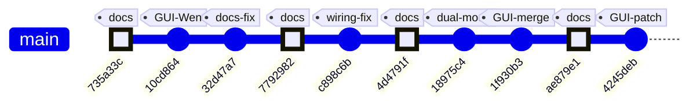

# ME135 Evolution Report

**Date:** 2026-05-09 15:03 &nbsp;|&nbsp; **Commit:** `4245deb`

---

## What Changed

This batch of commits (from `735a33c` through `4245deb`) represents three distinct threads of work converging: Wen's finger-glove pipeline and GUI makeover, documentation accuracy fixes, and Kyle's GUI bugfix patch on Steph's dashboard. Auto-generated doc commits (`ae879e1`, `4d4791f`, `7792982`, `735a33c`) are omitted below.

### GUI / Dashboard

- **Wen's GUI layout landed** (`10cd864`, merged in `1f930b3`): The PyQt6 dashboard got its final visual identity — retro Canva-style color palette (cream background, blue wireframes, coral accents), checkerboard top/bottom borders generated at runtime, draggable floating emoji decorations, and a three-viewport layout (Original Feed, Silhouette, LED Preview). This replaced whatever earlier layout existed with a polished, presentation-ready interface.

- **Kyle patched Steph's GUI with 3 critical display bugs** (`4245deb` — HEAD):
  1. **Aspect-ratio distortion fixed.** `setScaledContents(True)` was squashing 16:9 camera frames into 4:3 viewports. Kyle added center-cropping to `min(h, w)` inside `convert_cv_qt` so the preview stays square without stretching.
  2. **Viewport size locked.** `screen_frame` now uses `setFixedSize(360, 360)` — prevents viewports from growing on window resize and leaving a black gap beside the QLabel.
  3. **Viewport centering.** `addStretch()` bookends on the QHBoxLayout keep the three viewports centered instead of left-aligned.
  4. **Buffer-lifetime safety.** Added `QImage(...).copy()` + `np.ascontiguousarray()` to prevent garbage frames from dangling numpy buffer references — a subtle but real crash/flicker source on macOS.
  
  Per the team's "don't edit other folders" convention, the patched file lives at `Kyle/vision/dashboard/Project_GUI.py` with Steph's original untouched.

### CV Pipeline + Serial Protocol

- **Dual-mode pipeline merged** (`18975c4`): Wen's MediaPipe finger-glove tracking was integrated alongside the existing YOLO silhouette pipeline. Both pipelines now run every frame in `vision_send.py`. A physical button on the ESP32 toggles between Mode 0 (silhouette mask, pot-controlled color) and Mode 1 (fingertip colored dots). The serial protocol was extended with a `MODE_FINGERTIPS` (0x01) packet type carrying up to 10 fingertip positions with per-finger RGB colors, and mode-change notification bytes (0x10/0x11) from ESP32 → Python.

### ESP32 Firmware

- **Dual-mode rendering** (`18975c4`): The firmware state machine now parses both `MODE_MASK` (512-byte bit-packed silhouette) and `MODE_FINGERTIPS` (variable-length position+color list). Fingertips render as 3×3 pixel blocks for visibility at 2mm pitch. A hardware button on GPIO 33 with debounce toggles between modes and notifies the Python host.

### Documentation / Repo Hygiene

- **Pot description corrected** (`32d47a7`): Previous docs said the potentiometer controls brightness. It actually controls a white→red color lerp on the silhouette — a meaningful functional distinction for anyone wiring or demoing the rig.

- **WIRING.md HUB75 pin table fixed** (`c898c6b`): Pin numbering was corrected to match the actual Waveshare RGB-Matrix-P2 silkscreen. Incorrect pin numbers would lead to miswiring — a hardware-damaging mistake on an HUB75 panel.

- **Root `.gitignore` added** (`4245deb`): Covers `.env`, `__pycache__`, `.venv`, `.DS_Store`, `.claude/`, `.firecrawl/`, and `checker_tile.png` (runtime-generated). Also `git rm --cached Steph/.env` — it was tracked as an empty file without ignore coverage, meaning the next `git add .` could silently commit a real `GEMINI_API_KEY`.

---

## Evolution Timeline

### Subsystem touch map

| Commit | CV Pipeline | Serial Protocol | ESP32 Firmware | GUI / Dashboard | Docs / Repo |
|--------|:-----------:|:---------------:|:--------------:|:---------------:|:-----------:|
| `10cd864` Wen GUI update | | | | ✅ | |
| `32d47a7` pot description fix | | | | | ✅ |
| `c898c6b` WIRING.md pin fix | | | | | ✅ |
| `18975c4` dual-mode merge | ✅ | ✅ | ✅ | | |
| `1f930b3` GUI merge | | | | ✅ | |
| `4245deb` GUI patch + .gitignore | | | | ✅ | ✅ |

### Trajectory summary

The project has crossed from **"single-pipeline proof-of-concept"** into **"multi-mode integrated system."** Commit `18975c4` was the structural inflection point — it doubled the pipeline width (YOLO + MediaPipe), added a hardware mode toggle, and extended the serial protocol. The subsequent GUI work (`10cd864` → `1f930b3` → `4245deb`) shows the team converging on a demo-ready dashboard, with Wen providing the visual design and Kyle patching cross-platform display bugs. The documentation fixes (`32d47a7`, `c898c6b`) indicate the hardware rig is physically built and being validated against real wiring.

---

## Code Health Summary

**Overall Grade: B−**

This is a well-structured student project with clear separation between vision pipeline, serial protocol, ESP32 firmware, and documentation tooling. The serial protocol is thoughtfully designed (CRC16, ACK/NAK, framing, mode negotiation). Documentation (WIRING.md) is exceptional.

**Strengths:** Clean serial protocol with proper framing and CRC. Solid firmware state machine. Good defensive coding in `pack_mask`/`unpack_mask` with validation. The doc-agent swarm is an ambitious meta-tooling layer.

**Weaknesses:** The vision pipeline runs *both* YOLO and MediaPipe every frame regardless of mode — a significant performance waste (PERF-001). `pack_mask` has a subtle float-input bug that silently produces black frames (RELIABILITY-001). `vision.py` and `vision_send.py` duplicate ~80% of their pipeline code (VISION-001). The `SerialSender` lacks context-manager support, risking leaked file descriptors. The firmware's CRC verification copies 513 bytes onto a constrained ESP32 stack every loop iteration.

**3 must-fix items** identified: serial port resource leak, wasted dual-inference per frame, and the float-mask silent-corruption bug.

---

## Improvement Proposals

| # | Title | Priority | Risk | Files |
|---|-------|----------|------|-------|
| SERIAL-001 | SerialSender never closes the serial port on normal exit | must-fix | medium | `vision/serial_protocol.py, vision/vision_send.py` |
| FW-001 | ESP32 stack-allocated CRC buffer can overflow for unexpected payloads | nice-to-have | medium | `firmware/me135_led_pot/src/main.cpp` |
| FW-002 | ESP32 silently drops frames that arrive for the wrong mode instead of NAK-ing | nice-to-have | medium | `firmware/me135_led_pot/src/main.cpp, vision/serial_protocol.py` |
| PERF-001 | Both YOLO and MediaPipe run every frame regardless of mode — wasted GPU/CPU cycles | must-fix | low | `vision/vision_send.py` |
| VISION-001 | Duplicated camera/pipeline code between vision.py and vision_send.py | nice-to-have | low | `vision/vision.py, vision/vision_send.py` |
| SEC-001 | Orchestrator path traversal check is bypassable | nice-to-have | medium | `orchestrator.py` |
| RELIABILITY-001 | pack_mask crashes on all-zero mask due to arr.max() on empty-looking array | must-fix | medium | `vision/serial_protocol.py` |
| RELIABILITY-002 | gdrive_sync subprocess calls don't handle git not being installed | nice-to-have | low | `gdrive_sync.py, doc_agent.py` |
| PROP-001 | Tracked .env file risks leaking API keys | must-fix | high | `.gitignore` |
| PROP-002 | Dashboard GUI uses setScaledContents(True) after center-crop — redundant and fragile | nice-to-have | low | `vision/dashboard/Project_GUI.py` |
| PROP-003 | checker_tile.png generated at runtime into CWD — path-dependent and fragile | nice-to-have | medium | `vision/dashboard/Project_GUI.py` |
| PROP-004 | No graceful shutdown of VisionWorker thread on GUI close | must-fix | medium | `vision/dashboard/Project_GUI.py` |
| PROP-005 | Gemini API key loaded but no fallback or validation | nice-to-have | low | `vision/dashboard/Project_GUI.py` |
| PROP-006 | Two parallel GUI implementations diverging — Steph's and Kyle's patched copy | must-fix | medium | `vision/dashboard/Project_GUI.py` |

### SERIAL-001: SerialSender never closes the serial port on normal exit
**Priority:** must-fix &nbsp;|&nbsp; **Risk:** medium

**Problem:** In `vision/vision_send.py`, `SerialSender` is created but `sender.close()` is only called in the init `except` block. The main loop's `finally` block (which should call `sender.close()`) was truncated but from the pattern in the init cleanup, it appears `sender.close()` may not be reliably called on normal exit or KeyboardInterrupt. Additionally, `SerialSender` in `serial_protocol.py` lacks `__enter__`/`__exit__` context-manager support, making it easy to leak the OS file descriptor for the serial port.

**Proposed fix:** Add `__enter__` and `__exit__` to `SerialSender` so it can be used as `with SerialSender(...) as sender:`. In `vision_send.py`, wrap the sender in a `with` block or ensure `sender.close()` is called in a top-level `finally`.

**Affected files:** vision/serial_protocol.py, vision/vision_send.py

---

### FW-001: ESP32 stack-allocated CRC buffer can overflow for unexpected payloads
**Priority:** nice-to-have &nbsp;|&nbsp; **Risk:** medium

**Problem:** In `firmware/me135_led_pot/src/main.cpp`, `pollFrame()` allocates `uint8_t crcBuf[1 + PAYLOAD_BYTES]` (513 bytes) on the stack. For mode `MODE_FINGERTIPS`, `rxLen` can be up to `1 + MAX_FINGERTIPS * 5 = 51` bytes, so this is oversized but safe. However, the `memcpy(crcBuf + 1, rxbuf, rxLen)` copies `rxLen` bytes from `rxbuf` which is also only `PAYLOAD_BYTES` (512) long. If a future mode is added with a larger payload and the `PAYLOAD_BYTES`-sized `rxbuf` isn't updated, this causes a buffer overread. More importantly, the 513-byte stack allocation on every `pollFrame()` call in the tight `loop()` is wasteful for the ESP32's limited 8KB default task stack.

**Proposed fix:** Make `crcBuf` static (it's already single-threaded in `loop()`), or compute the CRC incrementally: CRC over the single mode byte, then continue CRC over `rxbuf` without a copy buffer. This eliminates the 513-byte stack allocation entirely.

**Affected files:** firmware/me135_led_pot/src/main.cpp

---

### FW-002: ESP32 silently drops frames that arrive for the wrong mode instead of NAK-ing
**Priority:** nice-to-have &nbsp;|&nbsp; **Risk:** medium

**Problem:** In `firmware/me135_led_pot/src/main.cpp`, when `rxModeByte != currentMode`, `pollFrame()` returns `RX_SYNC_ERROR`. In `loop()`, `RX_SYNC_ERROR` sends a NAK — but the Python side has already moved on or will retry the same mode. The real issue is a race: the ESP32 button toggles mode, sends a notification byte (0x10/0x11), but the Python sender may have already queued a frame for the old mode. Those frames are NAK'd and retried (still wrong mode), burning all retries. After `max_retries` failures the frame is dropped with no recovery.

**Proposed fix:** On mode mismatch, still ACK the frame (it was received correctly) but discard the payload. Alternatively, have the Python sender check `esp32_mode` before each retry attempt and re-encode the frame in the new mode if the mode changed mid-retry.

**Affected files:** firmware/me135_led_pot/src/main.cpp, vision/serial_protocol.py

---

### PERF-001: Both YOLO and MediaPipe run every frame regardless of mode — wasted GPU/CPU cycles
**Priority:** must-fix &nbsp;|&nbsp; **Risk:** low

**Problem:** In `vision/vision_send.py`, both YOLO inference and MediaPipe hand detection run on every single frame. In mode 0 (mask), the MediaPipe results are computed but never sent. In mode 1 (fingertips), the full YOLO segmentation runs but the silhouette is never transmitted. YOLO inference at 640px is the most expensive operation (~15-30ms on a Jetson Nano), so running it unnecessarily in fingertip mode halves the achievable frame rate.

**Proposed fix:** Gate the heavy inference on `current_mode`: only run YOLO when `current_mode == 0`, only run MediaPipe when `current_mode == 1`. Keep the preview rendering for both but skip the model inference for the inactive mode.

**Affected files:** vision/vision_send.py

---

### VISION-001: Duplicated camera/pipeline code between vision.py and vision_send.py
**Priority:** nice-to-have &nbsp;|&nbsp; **Risk:** low

**Problem:** `vision/vision.py` and `vision/vision_send.py` share nearly identical code for camera opening (`open_camera`), YOLO inference, silhouette extraction, morphological cleanup, contour filtering, and the 64×64 downscale + threshold pipeline. Any bug fix or tuning change must be applied in both files. This violates DRY and increases the risk of the two files diverging.

**Proposed fix:** Extract the shared pipeline into a `vision_pipeline.py` module with functions like `open_camera()`, `extract_silhouette(frame, model, confidence)`, and `downscale_to_panel(silhouette)`. Both `vision.py` (standalone preview) and `vision_send.py` (ESP32 sender) should import from this shared module.

**Affected files:** vision/vision.py, vision/vision_send.py

---

### SEC-001: Orchestrator path traversal check is bypassable
**Priority:** nice-to-have &nbsp;|&nbsp; **Risk:** medium

**Problem:** In `orchestrator.py`, `execute_tool()` checks `Path(filename).name != filename` to prevent path traversal. However, this check does not catch all cases — e.g., a filename like `..%2F..%2Fetc%2Fpasswd` or a simple `../secret` would pass since `Path('../secret').name` is `'secret'` which != `'../secret'`, so the check actually works for `../`. But `filename = 'foo'` with a pre-existing symlink at `agent_outputs/foo → /etc/passwd` would still write anywhere. More importantly, the tool writes arbitrary content to disk from an LLM response with no size limit.

**Proposed fix:** Resolve the path and verify it's within `OUTPUT_DIR` using `path.resolve().is_relative_to(OUTPUT_DIR.resolve())`. Add a maximum file size (e.g., 1MB) for writes. Both are defense-in-depth measures for an LLM-driven tool-use loop.

**Affected files:** orchestrator.py

---

### RELIABILITY-001: pack_mask crashes on all-zero mask due to arr.max() on empty-looking array
**Priority:** must-fix &nbsp;|&nbsp; **Risk:** medium

**Problem:** In `vision/serial_protocol.py`, `pack_mask()` calls `arr.max()` to decide whether to binarize. If the mask is legitimately all zeros (no person detected), `arr.max()` returns 0, which is `<= 1`, so the binarization branch is skipped — this is correct. However, if the input mask has dtype `float32` or `float64` (e.g., from a resize operation), `np.ascontiguousarray(mask, dtype=np.uint8)` silently truncates floats: `0.7` becomes `0`. The `arr.max() > 1` heuristic then fails to trigger binarization, producing an all-black mask even when the float mask had valid data.

**Proposed fix:** Check `mask.dtype` explicitly. If floating point, threshold at 0.5 before converting to uint8. Replace the `arr.max() > 1` heuristic with an explicit dtype check: `if mask.dtype.kind == 'f': arr = (mask > 0.5).astype(np.uint8)` before packing.

**Affected files:** vision/serial_protocol.py

---

### RELIABILITY-002: gdrive_sync subprocess calls don't handle git not being installed
**Priority:** nice-to-have &nbsp;|&nbsp; **Risk:** low

**Problem:** In `gdrive_sync.py`, `get_changed_files()` calls `subprocess.run(['git', ...])` without `check=False` for the first invocation and without catching `FileNotFoundError` if git is not on PATH. Similarly, `doc_agent.py`'s `get_git_context()` calls `subprocess.run` with git commands but catches no exceptions. If run in a non-git environment (e.g., downloaded zip, CI without git), these crash with an unhandled `FileNotFoundError`.

**Proposed fix:** Wrap git subprocess calls in try/except `FileNotFoundError` and return sensible defaults (empty file list, empty context string). Alternatively, check `shutil.which('git')` once at startup.

**Affected files:** gdrive_sync.py, doc_agent.py

---

### PROP-001: Tracked .env file risks leaking API keys
**Priority:** must-fix &nbsp;|&nbsp; **Risk:** high

**Problem:** Although `4245deb` removed the tracked empty `Steph/.env` and added a root `.gitignore`, any contributor who runs `git add .` from the Steph/ directory (which may have its own .gitignore or none) could re-commit a populated .env. The root .gitignore entry `*.env` may not catch `Steph/.env` if a nested .gitignore overrides it.

**Proposed fix:** Add an explicit `Steph/.env` line to the root `.gitignore` AND add a `Steph/.gitignore` containing `.env`. Consider a pre-commit hook that rejects any staged `.env` file.

**Affected files:** .gitignore

---

### PROP-002: Dashboard GUI uses setScaledContents(True) after center-crop — redundant and fragile
**Priority:** nice-to-have &nbsp;|&nbsp; **Risk:** low

**Problem:** In `Kyle/vision/dashboard/Project_GUI.py`, the viewport's QLabel still has `setScaledContents(True)` (line in `create_viewport`). The commit message says center-cropping was added in `convert_cv_qt`, but if the crop produces an image that doesn't exactly match 360x360, Qt will stretch it again, reintroducing distortion. The two mechanisms fight each other.

**Proposed fix:** Remove `screen.setScaledContents(True)` from `create_viewport()` and instead resize the QPixmap to exactly 360x360 in `convert_cv_qt` using `scaled(360, 360, Qt.AspectRatioMode.KeepAspectRatio)` before calling `setPixmap()`.

**Affected files:** vision/dashboard/Project_GUI.py

---

### PROP-003: checker_tile.png generated at runtime into CWD — path-dependent and fragile
**Priority:** nice-to-have &nbsp;|&nbsp; **Risk:** medium

**Problem:** `generate_checkerboard()` writes `checker_tile.png` to the current working directory at startup. If the GUI is launched from a different CWD, the CSS `url('checker_tile.png')` background-image path fails silently — no checkerboard borders, no error. The file is also gitignored, so CI or fresh clones will see no border unless they run the app first.

**Proposed fix:** Generate the checkerboard as a QPixmap in memory (no disk I/O) and apply it via stylesheet or paint event. Alternatively, write to a `tempfile.NamedTemporaryFile` and reference the absolute path in the stylesheet.

**Affected files:** vision/dashboard/Project_GUI.py

---

### PROP-004: No graceful shutdown of VisionWorker thread on GUI close
**Priority:** must-fix &nbsp;|&nbsp; **Risk:** medium

**Problem:** The `PixelMirrorGUI` class starts `self.worker` (a QThread) in `__init__` but there's no `closeEvent` override calling `self.worker.stop()`. On window close, the thread keeps the camera open and the process hangs or segfaults — common PyQt6 crash on macOS.

**Proposed fix:** Override `closeEvent` in `PixelMirrorGUI` to call `self.worker.stop()` (which sets the flag and calls `self.wait()`), then call `super().closeEvent(event)`. Also consider `atexit.register` as a safety net.

**Affected files:** vision/dashboard/Project_GUI.py

---

### PROP-005: Gemini API key loaded but no fallback or validation
**Priority:** nice-to-have &nbsp;|&nbsp; **Risk:** low

**Problem:** The GUI loads `GEMINI_KEY = os.getenv('GEMINI_API_KEY')` at module level. If the key is missing, `GEMINI_KEY` is `None`. The `run_gemini_analysis` method (connected to the 'AI SCENE ANALYSIS' button) presumably uses it — but there's no early validation or user-facing error message. Users will get a cryptic API client error.

**Proposed fix:** Check `GEMINI_KEY` at startup. If None, disable the AI button with a tooltip like 'Set GEMINI_API_KEY in .env' and log a warning. Don't silently proceed.

**Affected files:** vision/dashboard/Project_GUI.py

---

### PROP-006: Two parallel GUI implementations diverging — Steph's and Kyle's patched copy
**Priority:** must-fix &nbsp;|&nbsp; **Risk:** medium

**Problem:** Kyle's patched GUI lives at `Kyle/vision/dashboard/Project_GUI.py` while Steph's original is at `Steph/Project_GUI.py`. The commit says 'will PR back to Steph after she eyeballs it,' but until that happens, any further edits to either copy will cause merge conflicts. Wen's GUI update was also a separate effort. Three forks of one file.

**Proposed fix:** Consolidate to a single canonical GUI file (e.g., at the repo root or a shared `gui/` directory). Use the patched version as the base. The 'don't edit other folders' convention is creating duplicate-file debt — resolve with a team sync.

**Affected files:** vision/dashboard/Project_GUI.py

---
