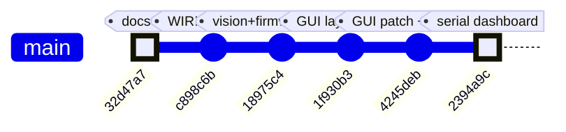
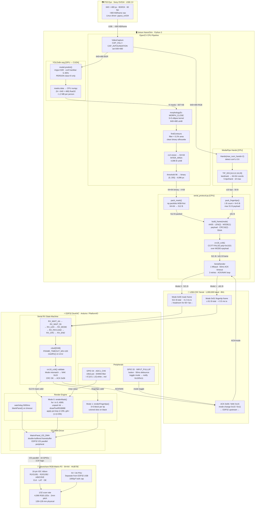
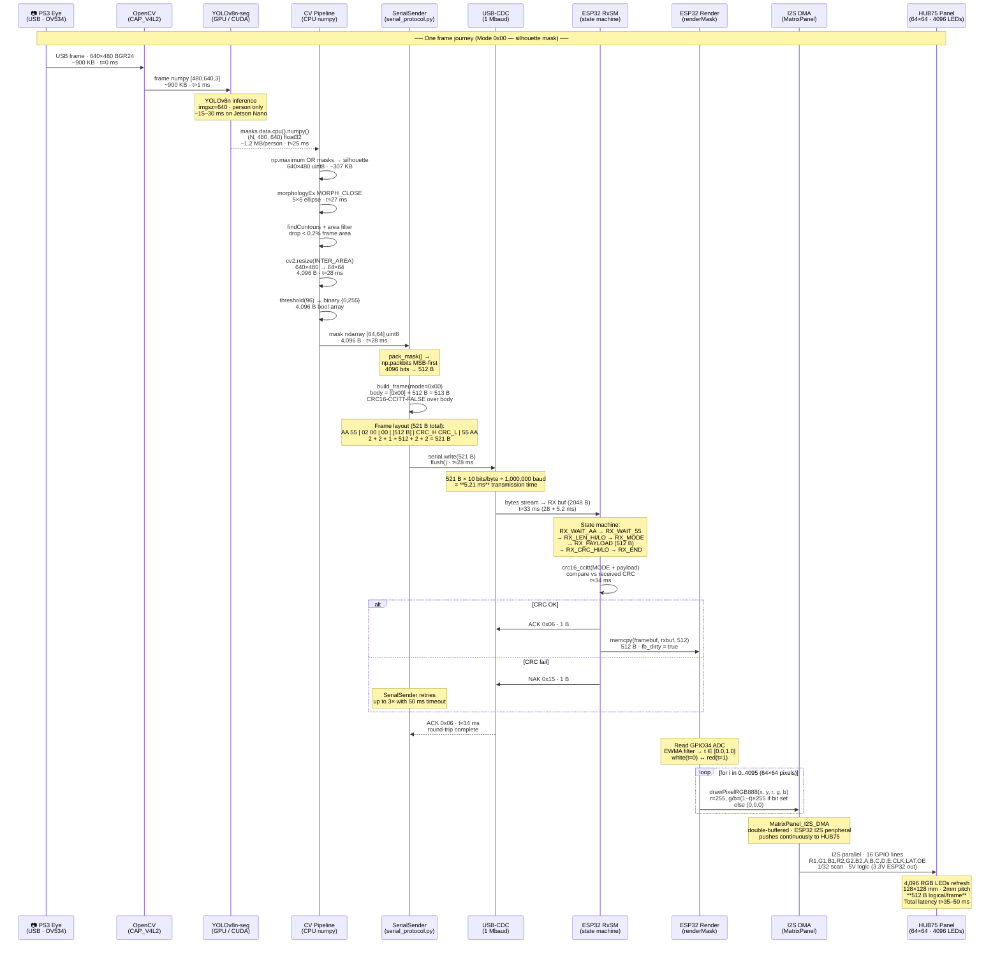

# ME135 Evolution Report

**Date:** 2026-05-09 16:16 &nbsp;|&nbsp; **Commit:** `2394a9c`

---

## What Changed

## Commit `2394a9c` — Wire Serial Transport + Dual-Mode Dashboard to ESP32

This is the commit that turns the GUI from a **display-only** dashboard into a **live serial transmitter** capable of driving the 64×64 HUB75 LED panel in real time. Three files changed (+1,061 / −138 lines).

### GUI / Dashboard (`Project_GUI.py` — 647 lines rewritten)

- **Serial transport wired in.** `PixelMirrorGUI` now owns a `SerialWorker` instance. Every frame, the vision thread emits either a 64×64 binary mask (`mask_ready_signal`) or a list of `Fingertip` objects (`tips_ready_signal`). The GUI routes whichever payload matches the ESP32's current mode to the serial worker. **Why it matters:** Previously, the dashboard could *see* the silhouette but had no way to *send* it — `vision_send.py` (the CLI tool) was the only path to the panel.

- **Backpressure / frame gating.** A `_tx_in_flight` flag + 30 fps cap prevents the GUI from flooding the serial link. The GUI waits for `send_complete_signal` before emitting the next frame. **Why it matters:** Without this, Qt's queued connections would buffer unbounded frames, causing growing latency.

- **MediaPipe added to VisionWorker (lazy-init, optional).** The worker thread now runs MediaPipe hand detection alongside YOLO on every frame, emitting fingertip landmarks. MediaPipe is imported with a `try/except` so the GUI still launches without it. Hands are recreated only if sensitivity parameters change. **Why it matters:** This is the integration point for Wen's finger-glove pipeline (merged in `18975c4`). The dashboard can now switch between mask and fingertip modes seamlessly based on the ESP32 button toggle.

- **Context-sensitive slider panel.** In mask mode: YOLO Confidence + LED Threshold sliders. In fingertip mode: Hand Detection Confidence + Tracking Confidence sliders (these control MediaPipe sensitivity, not HSV — Wen's pipeline is landmark-based). **Why it matters:** Previous sliders were always visible and didn't adapt to the active mode.

- **5-row status grid.** STATUS box rebuilt from a single label into a structured grid: MODE (color-coded), SERIAL (port/state), LINK (sent/ACK/NAK counters), CAM (fps + people count), POT. **Why it matters:** Gives real-time diagnostic feedback during bench testing without needing a terminal.

- **Port management UI.** Combo box listing available serial ports + Connect / Disconnect / Refresh buttons. **Why it matters:** Previously the only way to specify a port was via CLI args to `vision_send.py`.

- **Cleanup:** `try/finally` wraps the worker's main loop so `cap.release()` and `hands.close()` always fire. BLANK PANEL button added (sends all-zero frame). RE-CALIBRATE removed (was a duplicate of RESET CAMERA). Gemini AI response now renders into a `QTextEdit` instead of printing to stdout. `checker_tile.png` relocated to `assets/` subdirectory.

### Serial Worker (`serial_worker.py` — 276 lines, new file)

- **QObject + moveToThread facade.** Wraps `SerialSender` (from `serial_protocol.py`) on a dedicated worker thread. Slots receive mask/tips/blank requests via `QueuedConnection` so ACK waits never block the GUI thread. Shutdown uses `BlockingQueuedConnection` to guarantee the serial port is released before the thread exits. **Why it matters:** This is the bridge between the Qt event loop and the blocking serial I/O — the architectural piece that was missing.

- **Reuses `serial_protocol.py` as-is.** No duplication of the wire format (CRC-16/CCITT-FALSE, `AA 55 … 55 AA` framing, MSB-first 64×64 bit-pack). The protocol module was already byte-correct against the firmware. **Why it matters:** Single source of truth for the wire format.

### Test Suite (`tests/test_protocol.py` — 276 lines, new file)

- **33 tests pinning the 64×64 / 512-byte wire format.** Covers: CRC vectors, MSB-first bit-pack round-trips, frame structure (start/end markers, length field, CRC position), fingertip pack/unpack, end-to-end mask encoding. Replaces archived 108×108 tests that targeted the legacy WS2812B path. **Why it matters:** Catches any accidental wire-format drift between Python and the ESP32 C firmware.

### What Did NOT Change

- **`serial_protocol.py`** — Untouched; already correct.
- **ESP32 firmware (`main.cpp`)** — Untouched; the GUI now speaks the same protocol the firmware has always expected.
- **`vision_send.py`** (CLI pipeline) — Untouched; the dashboard is a parallel UI, not a replacement.
- **Larry's code** — Explicitly scoped out.

---

## Evolution Timeline

The project has grown from documentation fixes through pipeline merges to a fully wired GUI-to-panel path. Each commit below shows which subsystem it touched.

### Subsystem touchpoints per commit

| Commit | Docs | CV Pipeline | GUI / Dashboard | Serial Protocol | ESP32 Firmware |
|--------|------|-------------|-----------------|-----------------|----------------|
| `32d47a7` — fix pot description | ✅ | | | | |
| `c898c6b` — fix HUB75 pin numbers | ✅ | | | | |
| `18975c4` — Wen's finger-glove merge | | ✅ | | ✅ | ✅ |
| `1f930b3` — Wen's GUI layout merge | | | ✅ | | |
| `4245deb` — patched Steph's GUI | | | ✅ | | |
| **`2394a9c` — serial dashboard** | | ✅ | ✅ | ✅ (tests) | |

### Trajectory narrative

The project's arc across these commits is clear: **docs → merge partners' work → wire it all together**.

1. **Foundation fixes** (`32d47a7`, `c898c6b`): Corrected misleading docs — pot triggers effects (not brightness), and the HUB75 pin table now matches the Waveshare panel.
2. **Pipeline unification** (`18975c4`): Wen's MediaPipe fingertip tracker merged alongside the YOLO mask pipeline; ESP32 firmware gained dual-mode receive (mode 0 = mask, mode 1 = fingertips).
3. **GUI consolidation** (`1f930b3`, `4245deb`): Layout finalized with interactive icons and checkerboard borders; Steph's GUI variant patched and adapted.
4. **The wiring commit** (`2394a9c`): The dashboard became a real-time transmitter. SerialWorker bridges Qt signals to the existing `serial_protocol.py`. 33 tests lock the wire format. MediaPipe runs inside the GUI thread for the first time. The system is now **end-to-end capable**: camera → YOLO/MediaPipe → Qt dashboard → serial → ESP32 → HUB75 panel.

**Next milestone:** Live hardware verification — plug in the ESP32, click Connect, and confirm sustained TX with low NAK rate.

---

## System Architecture

| Stage | Data Type | Size | Rate |
|---|---|---|---|
| Camera out | BGR24 uint8 | ~900 KB/frame | 60 fps |
| YOLO masks | float32 numpy | ~1.2 MB/person | GPU async |
| 64×64 binary | uint8 numpy | 4,096 B | 30 fps TX |
| Serial packet (mode 0) | bit-packed + framing | **521 B** | ≤30 fps |
| Serial packet (mode 1) | fingertips struct | **≤61 B** | ≤30 fps |
| HUB75 framebuffer | RGB888 DMA | **512 B logical** | continuous DMA |

---

## Data Flow

### Byte-count ledger — one mode-0 frame

| Hop | Payload | Notes |
|---|---|---|
| Camera → OpenCV | ~900,000 B | 640×480 BGR24 |
| YOLO masks → CPU | ~1,228,800 B | (N, 480, 640) float32 |
| Silhouette after OR | 307,200 B | 640×480 uint8 |
| After resize 64×64 | 4,096 B | uint8 pre-threshold |
| After packbits | **512 B** | bit-packed MSB-first |
| Serial frame (with framing) | **521 B** | +2 start +2 len +1 mode +2 CRC +2 end |
| ESP32 framebuf[] | **512 B** | stored until next valid frame |
| HUB75 logical | **512 B** | 4096 bits → 4096 LEDs |
| Transmission time @ 1 Mbaud | ≈ **5.21 ms** | 521 B × 10 bits |
| End-to-end latency | ≈ **35–50 ms** | camera → LED |

---

## Module Dependency Graph

```mermaid
graph TD
    %% ── Entry Points ──────────────────────────────────────────────────────────
    subgraph ENTRY["🚀 Entry Points"]
        ORC["orchestrator.py\n─────────────────\nmain(): asyncio.run()\nrun_agent() × 7 parallel\nexecute_tool() dispatch\nAgents: CV · Serial · HW\n         Safety · LabVIEW\n         Arch · Firmware"]
        DOC["doc_agent.py\n─────────────────\nmain(): asyncio.run()\nPersonas:\n  📜 HISTORIAN\n  🏛  ARCHITECT\n  🔍 CRITIC\ndb_connect() → SQLite"]
        SETUP["gdrive_setup.py\n─────────────────\nmain(): one-time\nrclone OAuth setup\nDrive folder create"]
    end

    %% ── Vision Layer ──────────────────────────────────────────────────────────
    subgraph VIS["👁️  Vision  (vision/)"]
        VS["vision_send.py\n────────────────────────\nclass: none (procedural)\nmain() → event loop\n• open_camera()\n• autodetect_port()\n• extract_fingertips()\n• draw_fingertips_camera()\n• draw_fingertips_grid()\n• parse_args()"]
        VV["vision.py\n────────────────────────\nclass: none (procedural)\nmain() → event loop\n• open_camera()\nStandalone — no serial"]
        SP["serial_protocol.py\n────────────────────────\nclass SerialSender\n  send_mask(ndarray) → bool\n  send_fingertips(list) → bool\n  read_mode_change() → int\n  esp32_mode: int [prop]\nNamedTuple: Fingertip(x,y,r,g,b)\nfn: pack_mask() → bytes 512B\nfn: pack_fingertips() → bytes\nfn: build_frame(mode,payload)\nfn: crc16_ccitt() → int\nconst: MODE_MASK=0x00\nconst: MODE_FINGERTIPS=0x01"]
    end

    %% ── Documentation Layer ───────────────────────────────────────────────────
    subgraph DOCL["📚 Documentation System"]
        GDS["gdrive_sync.py\n────────────────────────\nfn: sync_to_drive(sections,\n     proposals, commit, date)\nfn: detect_features(files)\nfn: get_changed_files(root)\nfn: compose_feature_section()\nfn: append_to_feature_doc()\nfn: sync_features_to_drive()\nmap: FEATURE_MAP {file→feature}"]
    end

    %% ── Third-Party Python ────────────────────────────────────────────────────
    subgraph PYEXT["📦 Python Dependencies"]
        ANTH["anthropic\nAsyncAnthropic\nmessages.stream()\nthinking=adaptive"]
        ULT["ultralytics\nYOLO('yolov8n-seg.pt')\n.predict() GPU/CPU\n~6 MB checkpoint"]
        OCV["opencv-python\ncv2.VideoCapture\ncv2.resize · threshold\nmorphologyEx\nfindContours"]
        MPIPE["mediapipe\nmp.solutions.hands\nHands.process()\nHandLandmark"]
        PYSER["pyserial\nserial.Serial\n1 Mbaud 8N1\nwrite_timeout=1s"]
        NP["numpy\nndarray [64,64]\npackbits MSB-first"]
        RCLONE["rclone (subprocess)\nGDrive OAuth\nsync local→Drive"]
        SQLITE["sqlite3 (stdlib)\nproposals table\nreports table"]
    end

    %% ── Firmware (C++) ───────────────────────────────────────────────────────
    subgraph FW["⚡ ESP32 Firmware (C++)"]
        MAIN["main.cpp\n────────────────────────\nMatrixPanel_I2S_DMA *dma\nstruct Fingertip{x,y,r,g,b}\nsetup(): panel init + pins\nloop(): pollFrame()+render\npollFrame() RxState machine\nrenderMask(): pot lerp\nrenderFingertips(): 3×3 dot\nblankPanel(): watchdog"]
        HUB["ESP32-HUB75-MatrixPanel\n-I2S-DMA.h\n────────────────────────\nMatrixPanel_I2S_DMA\n.begin() .drawPixelRGB888()\n.fillScreenRGB888()\nI2S parallel DMA engine\ndouble-buffered"]
        GFX["Adafruit GFX Library\n────────────────────────\nAdafruit_GFX base class\nFont structs\n(optional in this project)"]
        BUSIO["Adafruit BusIO\n────────────────────────\nI2C / SPI abstractions\n(indirect dep of GFX)"]
    end

    %% ── Python Import Edges ──────────────────────────────────────────────────
    VS   -->|"from serial_protocol import\nFingertip · MODE_MASK\nMODE_FINGERTIPS · SerialSender"| SP
    VS   -->|"import cv2"| OCV
    VS   -->|"from ultralytics import YOLO"| ULT
    VS   -->|"import mediapipe as mp"| MPIPE
    VS   -->|"import numpy as np"| NP
    SP   -->|"import serial"| PYSER
    SP   -->|"import numpy as np"| NP
    VV   -->|"import cv2"| OCV
    VV   -->|"from ultralytics import YOLO"| ULT
    VV   -->|"import numpy as np"| NP
    ORC  -->|"import anthropic\nAsyncAnthropic"| ANTH
    DOC  -->|"import anthropic\nAsyncAnthropic"| ANTH
    DOC  -->|"from gdrive_sync import\nsync_to_drive · detect_features\nget_changed_files"| GDS
    DOC  -->|"import sqlite3"| SQLITE
    GDS  -->|"subprocess.run(rclone)"| RCLONE
    SETUP-->|"subprocess.run(rclone)"| RCLONE

    %% ── C++ #include Edges ───────────────────────────────────────────────────
    MAIN -->|"#include"| HUB
    HUB  -->|"extends"| GFX
    GFX  -->|"depends"| BUSIO

    %% ── Cross-Layer: Serial Link ─────────────────────────────────────────────
    SP   -.->|"serial.write(521B)\n1 Mbaud USB-CDC"| MAIN

    %% ── Styles ───────────────────────────────────────────────────────────────
    style VS    fill:#1a3a4a,stroke:#4fc3f7,color:#fff
    style VV    fill:#1a3a4a,stroke:#4fc3f7,color:#fff
    style SP    fill:#0d2b3e,stroke:#00e5ff,color:#fff
    style MAIN  fill:#2d1b00,stroke:#ff9800,color:#fff
    style HUB   fill:#2d1b00,stroke:#ff9800,color:#fff
    style GFX   fill:#1a1a00,stroke:#ffd54f,color:#fff
    style BUSIO fill:#1a1a00,stroke:#ffd54f,color:#fff
    style ORC   fill:#1a0a2e,stroke:#ce93d8,color:#fff
    style DOC   fill:#1a0a2e,stroke:#ce93d8,color:#fff
    style SETUP fill:#1a0a2e,stroke:#ce93d8,color:#fff
    style GDS   fill:#1a0a2e,stroke:#ce93d8,color:#fff
    style ANTH  fill:#0a1a0a,stroke:#a5d6a7,color:#fff
    style ULT   fill:#0a1a0a,stroke:#a5d6a7,color:#fff
    style OCV   fill:#0a1a0a,stroke:#a5d6a7,color:#fff
    style MPIPE fill:#0a1a0a,stroke:#a5d6a7,color:#fff
    style PYSER fill:#0a1a0a,stroke:#a5d6a7,color:#fff
    style NP    fill:#0a1a0a,stroke:#a5d6a7,color:#fff
    style RCLONE fill:#0a1a0a,stroke:#a5d6a7,color:#fff
    style SQLITE fill:#0a1a0a,stroke:#a5d6a7,color:#fff
```

### Interface contract summary

| Boundary | Type | Interface |
|---|---|---|
| `vision_send.py` → `serial_protocol.py` | Python import | `SerialSender`, `Fingertip`, `MODE_MASK`, `MODE_FINGERTIPS` |
| `serial_protocol.py` → ESP32 | Binary serial | 521 B framed packet · CRC16-CCITT-FALSE |
| `doc_agent.py` → `gdrive_sync.py` | Python import | `sync_to_drive()`, `detect_features()`, `get_changed_files()` |
| `doc_agent.py` → Anthropic API | HTTP/SDK | `AsyncAnthropic.messages.stream()` · thinking=adaptive |
| `orchestrator.py` → Anthropic API | HTTP/SDK | 7 × parallel `run_agent()` coroutines |
| `gdrive_sync.py` → Drive | subprocess | `rclone sync` · OAuth · remote `me135drive:` |
| `main.cpp` → HUB75 lib | C++ `#include` | `MatrixPanel_I2S_DMA` · `drawPixelRGB888()` |
| `vision.py` | **Isolated** | Standalone CV preview — no serial, no imports from project |

---

## Code Health Summary

**Overall Grade: B**

This is a well-structured embedded+vision project with clean separation between Python vision pipeline, serial protocol, and ESP32 firmware. The serial protocol is thoughtfully designed with CRC16, ACK/NAK, framing, and mode awareness. Documentation (WIRING.md) is exceptional — production-quality troubleshooting tables.

**Strengths:** Clear module boundaries, robust serial framing with retries, good error messages, thorough hardware docs, proper use of `try/finally` in `vision_send.py`.

**Weaknesses:** Both YOLO and MediaPipe run unconditionally every frame (wasting ~50% compute), `mediapipe` is missing from `requirements.txt` (broken cold install), `open_camera()` is duplicated verbatim across two files, `vision.py` leaks the camera on exceptions, and the PlatformIO monitor baud rate is wrong. The firmware uses a 513-byte stack buffer where a static or incremental CRC would be safer on ESP32's limited stack.

No security-critical issues found. No hardcoded API keys — the Anthropic SDK reads from the environment correctly.

---

## Improvement Proposals

| # | Title | Priority | Risk | Files |
|---|-------|----------|------|-------|
| PROP-001 | sys.path manipulation for imports is fragile | nice-to-have | medium | `vision/dashboard/Project_GUI.py` |
| PROP-002 | No timeout / watchdog on serial worker thread shutdown | nice-to-have | medium | `vision/dashboard/serial_worker.py, vision/dashboard/Project_GUI.py` |
| PROP-003 | MediaPipe runs every frame even when in mask mode | nice-to-have | low | `vision/dashboard/Project_GUI.py` |
| PROP-004 | Live hardware verification still deferred | must-fix | high | `vision/dashboard/Project_GUI.py, vision/dashboard/serial_worker.py, firmware/me135_led_pot/src/main.cpp` |
| PROP-005 | Headless GUI smoke test blocked by Qt6 plugin issue | nice-to-have | low | `vision/dashboard/Project_GUI.py` |
| PERF-01 | Both YOLO and MediaPipe run every frame regardless of active mode | must-fix | low | `vision/vision_send.py` |
| BUG-01 | vision/requirements.txt is missing mediapipe dependency | must-fix | low | `vision/requirements.txt` |
| BUG-02 | platformio.ini monitor_speed (115200) mismatches firmware Serial.begin (1000000) | must-fix | low | `firmware/me135_led_pot/platformio.ini` |
| REL-01 | vision.py main loop lacks try/finally — camera and windows leak on exception | nice-to-have | low | `vision/vision.py` |
| REL-02 | ESP32 firmware: 513-byte stack buffer in pollFrame() CRC verification | nice-to-have | medium | `firmware/me135_led_pot/src/main.cpp` |
| DES-01 | Duplicated open_camera() function across vision.py and vision_send.py | nice-to-have | low | `vision/vision.py, vision/vision_send.py` |
| REL-03 | SerialSender lacks context-manager protocol (__enter__/__exit__) | nice-to-have | low | `vision/serial_protocol.py, vision/vision_send.py` |
| SEC-01 | Hardcoded personal email in gdrive_setup.py | nice-to-have | low | `gdrive_setup.py` |
| PROTO-01 | Serial frame has no sequence number — retries can deliver duplicate frames | must-fix | medium | `vision/serial_protocol.py, firmware/me135_led_pot/src/main.cpp` |
| PROTO-02 | ACK timeout (50 ms) is longer than one frame period (33 ms) at 30 fps | must-fix | low | `vision/serial_protocol.py, vision/vision_send.py` |
| CV-01 | vision.py and vision_send.py share 80%+ identical camera/YOLO/contour code with no shared base | nice-to-have | low | `vision/vision.py, vision/vision_send.py` |
| FW-01 | ESP32 renderMask() calls drawPixelRGB888() 4,096 times per frame — no DMA burst write | nice-to-have | medium | `firmware/me135_led_pot/src/main.cpp` |
| FW-02 | Pot ADC read is synchronous in loop() — no task separation from serial RX | nice-to-have | low | `firmware/me135_led_pot/src/main.cpp` |
| DOC-01 | orchestrator.py agent model names are hardcoded to non-existent model IDs | must-fix | high | `orchestrator.py, doc_agent.py` |
| ARCH-01 | No back-pressure mechanism between vision pipeline and SerialSender queue | future | medium | `vision/vision_send.py, vision/serial_protocol.py` |

### PROP-001: sys.path manipulation for imports is fragile
**Priority:** nice-to-have &nbsp;|&nbsp; **Risk:** medium

**Problem:** Project_GUI.py uses `sys.path.insert(0, ...)` twice to import serial_protocol and serial_worker. This breaks if the file is moved, if multiple versions exist on sys.path, or if pytest discovers modules in a different order. It also triggers E402 lint warnings (suppressed with noqa).

**Proposed fix:** Add a minimal `pyproject.toml` or `setup.py` with `packages=['vision']` and install in editable mode (`pip install -e .`). Replace sys.path hacks with normal `from vision.serial_protocol import ...` imports.

**Affected files:** vision/dashboard/Project_GUI.py

---

### PROP-002: No timeout / watchdog on serial worker thread shutdown
**Priority:** nice-to-have &nbsp;|&nbsp; **Risk:** medium

**Problem:** The commit message says shutdown uses BlockingQueuedConnection, but if the serial port hangs (e.g., USB cable yanked mid-write), the blocking call could deadlock the GUI's closeEvent indefinitely. The `serial.Serial.write_timeout` is 1 s, but retries could multiply that to 4 s per frame.

**Proposed fix:** Add a `QThread.wait(timeout_ms)` guard in the GUI's closeEvent. If the thread doesn't exit within e.g. 3 seconds, call `terminate()` and log a warning. Also consider a `QTimer.singleShot` watchdog that force-closes the serial port if shutdown stalls.

**Affected files:** vision/dashboard/serial_worker.py, vision/dashboard/Project_GUI.py

---

### PROP-003: MediaPipe runs every frame even when in mask mode
**Priority:** nice-to-have &nbsp;|&nbsp; **Risk:** low

**Problem:** VisionWorker runs `hands.process(rgb)` on every camera frame regardless of the current ESP32 mode. MediaPipe hand detection is non-trivial CPU work (~5–15 ms/frame). When the panel is in mask mode (mode 0), the fingertip results are emitted but ignored by the serial routing.

**Proposed fix:** Gate MediaPipe processing on the current mode. Add a `self.current_mode` attribute to VisionWorker (updated via a slot from the mode-change signal chain). Skip `_ensure_hands()` and `hands.process()` when mode == MODE_MASK. This could recover 10–30% of per-frame CPU.

**Affected files:** vision/dashboard/Project_GUI.py

---

### PROP-004: Live hardware verification still deferred
**Priority:** must-fix &nbsp;|&nbsp; **Risk:** high

**Problem:** The commit message explicitly states 'ESP32 not currently plugged in, so live frame test is DEFERRED.' The 33 unit tests verify the wire format in isolation, but no integration test confirms the full path (camera → YOLO → serial → ESP32 → panel). NAK rate under sustained TX is unknown.

**Proposed fix:** Schedule a bench test session. Connect ESP32, launch the dashboard, and run for 5 minutes at 30 fps in each mode. Log sent/ACK/NAK counts. Acceptance criteria: NAK rate < 1%. Document results in a test log or CI artifact.

**Affected files:** vision/dashboard/Project_GUI.py, vision/dashboard/serial_worker.py, firmware/me135_led_pot/src/main.cpp

---

### PROP-005: Headless GUI smoke test blocked by Qt6 plugin issue
**Priority:** nice-to-have &nbsp;|&nbsp; **Risk:** low

**Problem:** The commit notes that headless GUI smoke testing is blocked because the offscreen Qt6 plugin won't load in the current venv (Steph/.venv). This means CI cannot verify that the GUI launches without crashing — only py_compile and ruff are running.

**Proposed fix:** Create a dedicated project venv with `PyQt6` installed from pip (not system). Add `QT_QPA_PLATFORM=offscreen` to the CI env and a smoke test that instantiates `PixelMirrorGUI`, processes one synthetic frame, and exits. Alternatively, use `pytest-qt` which handles offscreen setup automatically.

**Affected files:** vision/dashboard/Project_GUI.py

---

### PERF-01: Both YOLO and MediaPipe run every frame regardless of active mode
**Priority:** must-fix &nbsp;|&nbsp; **Risk:** low

**Problem:** In `vision_send.py::main()`, both the YOLO person segmentation pipeline and the MediaPipe hand tracking pipeline execute on every frame, even though only one mode's data is ever sent to the ESP32. When mode=0 (mask), MediaPipe still burns CPU/GPU computing hand landmarks that are discarded. When mode=1 (fingertips), YOLO still runs full instance segmentation that is discarded. This roughly doubles per-frame compute cost for no benefit.

**Proposed fix:** Guard each pipeline behind `if current_mode == MODE_MASK:` and `if current_mode == MODE_FINGERTIPS:` blocks. Only run the pipeline whose output will actually be transmitted. Keep the preview drawing conditional on the same check.

**Affected files:** vision/vision_send.py

---

### BUG-01: vision/requirements.txt is missing mediapipe dependency
**Priority:** must-fix &nbsp;|&nbsp; **Risk:** low

**Problem:** `vision_send.py` imports `mediapipe` at the top level (`import mediapipe as mp`), and the module docstring lists it as required. However, `vision/requirements.txt` only lists ultralytics, opencv-python, numpy, and pyserial — mediapipe is absent. A fresh `pip install -r vision/requirements.txt` will produce an ImportError at runtime.

**Proposed fix:** Add `mediapipe>=0.10` to `vision/requirements.txt`.

**Affected files:** vision/requirements.txt

---

### BUG-02: platformio.ini monitor_speed (115200) mismatches firmware Serial.begin (1000000)
**Priority:** must-fix &nbsp;|&nbsp; **Risk:** low

**Problem:** In `platformio.ini`, `monitor_speed = 115200`. In `main.cpp`, `Serial.begin(SERIAL_BAUD)` where `SERIAL_BAUD = 1000000`. If a developer opens `pio device monitor` for debugging, they see garbage because the baud rates don't match. This is a frequent debugging trap documented in WIRING.md §9 but the INI should still be correct.

**Proposed fix:** Change `monitor_speed = 115200` to `monitor_speed = 1000000` in `platformio.ini`.

**Affected files:** firmware/me135_led_pot/platformio.ini

---

### REL-01: vision.py main loop lacks try/finally — camera and windows leak on exception
**Priority:** nice-to-have &nbsp;|&nbsp; **Risk:** low

**Problem:** In `vision.py::main()`, the camera (`cap`) and OpenCV windows are only released at the very end of the function after the while-loop. If any exception (including KeyboardInterrupt) is raised during the loop, `cap.release()` and `cv2.destroyAllWindows()` are never called, leaking the camera device. Contrast with `vision_send.py` which properly uses try/finally.

**Proposed fix:** Wrap the main while-loop in a `try/finally` block that calls `cap.release()` and `cv2.destroyAllWindows()` in the finally clause, mirroring the pattern already used in `vision_send.py`.

**Affected files:** vision/vision.py

---

### REL-02: ESP32 firmware: 513-byte stack buffer in pollFrame() CRC verification
**Priority:** nice-to-have &nbsp;|&nbsp; **Risk:** medium

**Problem:** In `main.cpp::pollFrame()`, the `RX_END_AA` case allocates `uint8_t crcBuf[1 + PAYLOAD_BYTES]` (513 bytes) on the stack. The ESP32 Arduino loop task has an 8 KB stack by default. This 513-byte VLA consumes ~6% of stack on every received frame and is at risk of stack overflow if the DMA library or other call chains deepen.

**Proposed fix:** Make `crcBuf` a `static` local or a file-scope global (it's only used inside the single-threaded `pollFrame` path), eliminating the per-call stack allocation. Alternatively, compute CRC incrementally over `rxModeByte` then `rxbuf` without an intermediate copy buffer.

**Affected files:** firmware/me135_led_pot/src/main.cpp

---

### DES-01: Duplicated open_camera() function across vision.py and vision_send.py
**Priority:** nice-to-have &nbsp;|&nbsp; **Risk:** low

**Problem:** `open_camera()` is copy-pasted identically in both `vision/vision.py` and `vision/vision_send.py` — same backend fallback list, same resolution settings, same error handling. Any bug fix or backend addition must be applied twice.

**Proposed fix:** Extract `open_camera()` into a shared module (e.g., `vision/camera_utils.py`) and import it from both files. vision.py already serves as a standalone demo, so an import from a shared utility is appropriate.

**Affected files:** vision/vision.py, vision/vision_send.py

---

### REL-03: SerialSender lacks context-manager protocol (__enter__/__exit__)
**Priority:** nice-to-have &nbsp;|&nbsp; **Risk:** low

**Problem:** In `serial_protocol.py`, `SerialSender` opens a serial port in `__init__` and exposes a `close()` method, but doesn't implement `__enter__`/`__exit__`. Callers must manually manage the lifecycle. If `send_mask()` or `send_fingertips()` raises an unexpected exception (e.g., `serial.SerialException` on USB disconnect), the port is leaked unless the caller has an explicit `finally` block.

**Proposed fix:** Add `__enter__(self) -> Self` returning self and `__exit__` calling `self.close()`, enabling `with SerialSender(...) as sender:` usage. Update `vision_send.py` to use the context manager.

**Affected files:** vision/serial_protocol.py, vision/vision_send.py

---

### SEC-01: Hardcoded personal email in gdrive_setup.py
**Priority:** nice-to-have &nbsp;|&nbsp; **Risk:** low

**Problem:** Line in `gdrive_setup.py::main()` prints `"→ Sign in with kyle-nelson@berkeley.edu"`, hardcoding a specific user's email. This is a minor information leak and makes the script non-portable if the project is shared or forked.

**Proposed fix:** Replace with a generic prompt like `"→ Sign in with your @berkeley.edu account"`, or read the email from an env variable / git config (`git config user.email`).

**Affected files:** gdrive_setup.py

---

### PROTO-01: Serial frame has no sequence number — retries can deliver duplicate frames
**Priority:** must-fix &nbsp;|&nbsp; **Risk:** medium

**Problem:** serial_protocol.py build_frame() has no monotonic sequence counter. When SerialSender retries after a NAK or ACK timeout, the ESP32 has no way to detect duplicate delivery and will re-render the same (or a stale) frame. At 1 Mbaud and 3 retries this causes visible stutter at 30 fps.

**Proposed fix:** Add a 1-byte sequence ID (0x00–0xFF wrapping) inside the frame body between MODE and payload. ESP32 RxState machine stores last_seq; drops frames where seq == last_seq. Cost: +1 byte per frame, zero baud impact.

**Affected files:** vision/serial_protocol.py, firmware/me135_led_pot/src/main.cpp

---

### PROTO-02: ACK timeout (50 ms) is longer than one frame period (33 ms) at 30 fps
**Priority:** must-fix &nbsp;|&nbsp; **Risk:** low

**Problem:** SerialSender.ack_timeout_s defaults to 0.05 s (50 ms). At 30 fps the frame budget is 33 ms. A missed ACK therefore stalls the entire pipeline for 50 ms — 1.5 frame periods — before the retry, causing visible frame drops and backpressure.

**Proposed fix:** Reduce ack_timeout_s to 0.015 s (15 ms). At 1 Mbaud the ESP32 ACK byte returns in < 1 ms after the last frame byte is received. 15 ms gives 15× margin while still fitting within the 33 ms frame budget. Expose as a CLI argument in vision_send.py.

**Affected files:** vision/serial_protocol.py, vision/vision_send.py

---

### CV-01: vision.py and vision_send.py share 80%+ identical camera/YOLO/contour code with no shared base
**Priority:** nice-to-have &nbsp;|&nbsp; **Risk:** low

**Problem:** open_camera(), the YOLO inference block, morphologyEx/findContours pipeline, and the 64×64 resize are copy-pasted verbatim across vision.py and vision_send.py. Any fix (e.g. INTER_AREA vs INTER_LINEAR, confidence clamp) must be applied in two places.

**Proposed fix:** Extract shared logic into vision/pipeline.py: class SilhouettePipeline(model, imgsz) with method process_frame(frame) -> (small_64, contours, boxes). Both scripts instantiate the class. vision.py stays standalone for quick preview; vision_send.py adds the SerialSender layer.

**Affected files:** vision/vision.py, vision/vision_send.py

---

### FW-01: ESP32 renderMask() calls drawPixelRGB888() 4,096 times per frame — no DMA burst write
**Priority:** nice-to-have &nbsp;|&nbsp; **Risk:** medium

**Problem:** renderMask() loops over all 4,096 pixels calling drawPixelRGB888(x, y, r, g, b) individually. Each call sets one pixel in the DMA framebuffer via a function call + bounds check. This is ~4K function calls per render tick, blocking the Arduino loop() for measurable time and preventing smooth pot-value updates mid-frame.

**Proposed fix:** Pre-expand the 512-byte bit-packed mask into a full RGB565 or RGB888 DMA buffer in SRAM using IRAM_ATTR memset + bit-scan. Write the expanded buffer directly to the panel's DMA memory via fillRect or direct framebuffer pointer (available in MatrixPanel_I2S_DMA as getFrameBufferPtr()). Reduces to 1 memcpy per frame.

**Affected files:** firmware/me135_led_pot/src/main.cpp

---

### FW-02: Pot ADC read is synchronous in loop() — no task separation from serial RX
**Priority:** nice-to-have &nbsp;|&nbsp; **Risk:** low

**Problem:** analogRead(POT_PIN) and the EWMA filter run inline in loop(), interleaved with pollFrame(). On ESP32 the ADC read takes ~20–100 µs. During a high-throughput serial burst this delays the RxState machine, risking FRAME_TIMEOUT_MS (100 ms) false-triggers at high frame rates.

**Proposed fix:** Move pot sampling to a FreeRTOS TimerHandle_t or a dedicated task on Core 0, storing pot_ewma in a volatile float. Keep serial RX (pollFrame + render) on Core 1 via xTaskCreatePinnedToCore(). Eliminates ADC jitter from the serial path entirely.

**Affected files:** firmware/me135_led_pot/src/main.cpp

---

### DOC-01: orchestrator.py agent model names are hardcoded to non-existent model IDs
**Priority:** must-fix &nbsp;|&nbsp; **Risk:** high

**Problem:** MODEL_ARCHITECT = 'claude-opus-4-6' and MODEL_CODER = 'claude-sonnet-4-6' are hardcoded strings that do not correspond to any current Anthropic model ID (correct IDs are e.g. claude-opus-4-5, claude-sonnet-4-5). Calls will fail at runtime with a 404 from the API.

**Proposed fix:** Read model IDs from environment variables CLAUDE_ARCHITECT_MODEL and CLAUDE_CODER_MODEL with sensible defaults (claude-opus-4-5, claude-sonnet-4-5). Add a startup validation call to client.models.list() and assert the requested models are available before spawning agents.

**Affected files:** orchestrator.py, doc_agent.py

---

### ARCH-01: No back-pressure mechanism between vision pipeline and SerialSender queue
**Priority:** future &nbsp;|&nbsp; **Risk:** medium

**Problem:** vision_send.py enforces TX_MIN_INTERVAL_S = 1/30 but there is no queue or buffer between the CV loop and SerialSender. If YOLO inference takes > 33 ms (common on CPU-only hosts), the serial send is skipped silently via a time.time() guard. There is no dropped-frame counter or adaptive throttle.

**Proposed fix:** Introduce a threading.Queue(maxsize=2) between the CV thread and a dedicated serial-TX thread. CV thread puts latest mask (overwrite on full — always send freshest frame). TX thread drains at the negotiated rate. Add a stats counter for dropped frames, logged every 5 seconds.

**Affected files:** vision/vision_send.py, vision/serial_protocol.py

---
